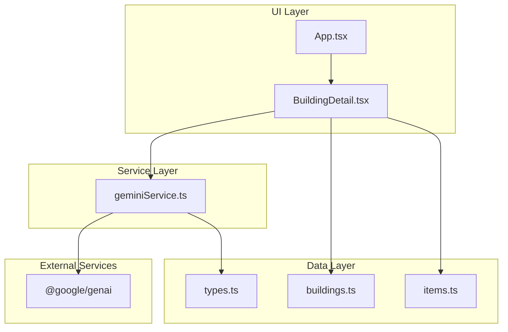
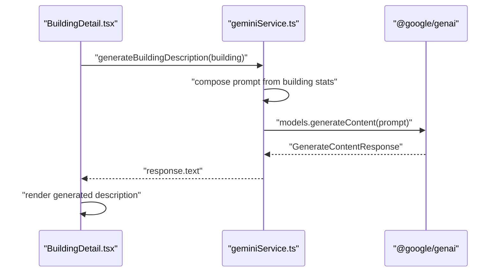
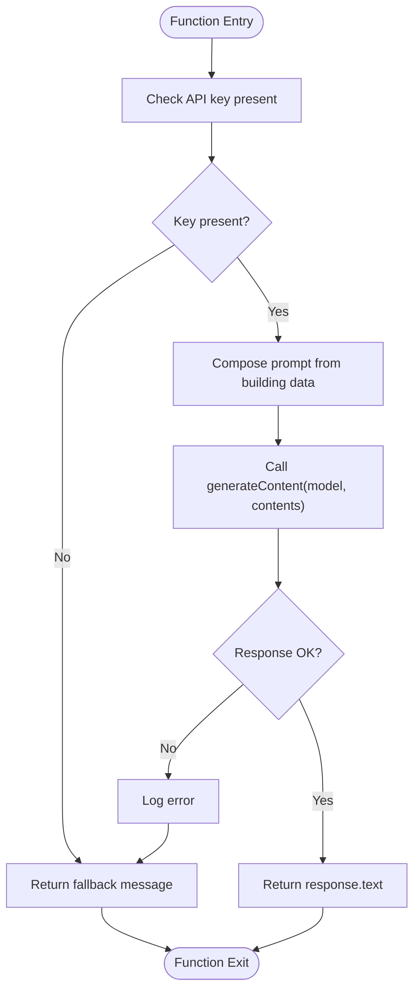
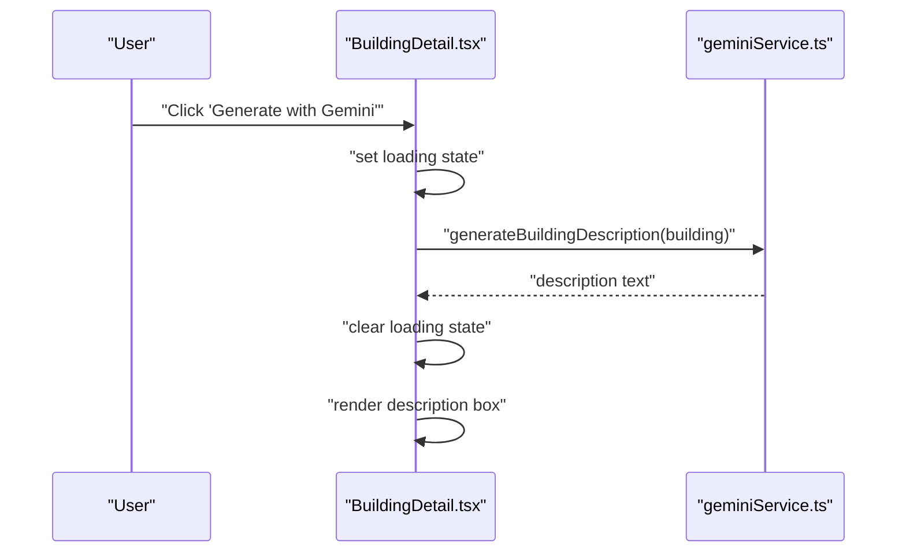
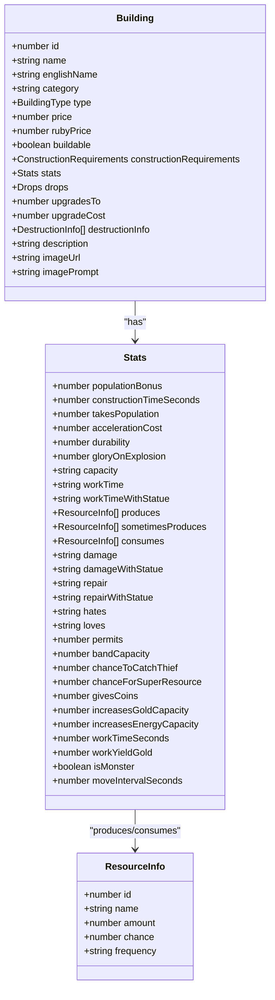
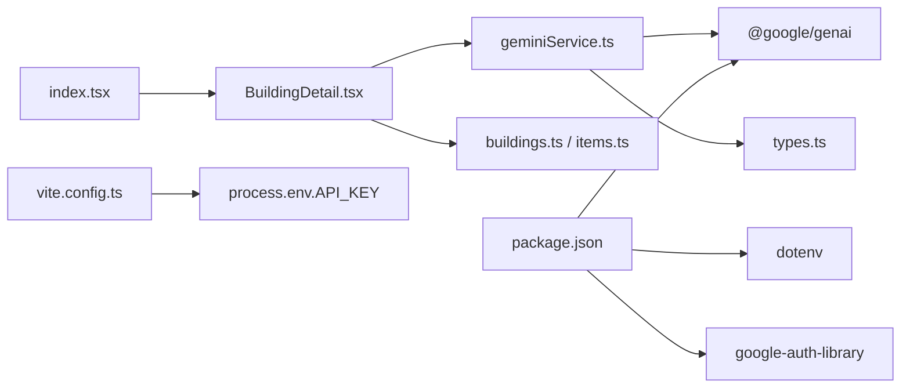

# AI Integration

<cite>
**Referenced Files in This Document**
- [geminiService.ts](file://services/geminiService.ts)
- [BuildingDetail.tsx](file://components/BuildingDetail.tsx)
- [App.tsx](file://App.tsx)
- [types.ts](file://types.ts)
- [buildings.ts](file://data/buildings.ts)
- [items.ts](file://data/items.ts)
- [ErrorBoundary.tsx](file://components/ErrorBoundary.tsx)
- [package.json](file://package.json)
- [vite.config.ts](file://vite.config.ts)
- [README.md](file://README.md)
- [index.tsx](file://index.tsx)
</cite>

## Table of Contents
1. [Introduction](#introduction)
2. [Project Structure](#project-structure)
3. [Core Components](#core-components)
4. [Architecture Overview](#architecture-overview)
5. [Detailed Component Analysis](#detailed-component-analysis)
6. [Dependency Analysis](#dependency-analysis)
7. [Performance Considerations](#performance-considerations)
8. [Troubleshooting Guide](#troubleshooting-guide)
9. [Conclusion](#conclusion)
10. [Appendices](#appendices)

## Introduction
This document describes the Google Gemini AI integration service for dynamic content generation within the game. It focuses on how AI-generated building descriptions are produced, how the service is wired into the UI, and how the broader game engine interacts with AI responses. It also covers authentication, error handling, fallback behavior, and practical examples of how AI enhances the gaming experience (building descriptions, contextual storytelling, and environmental narrative).

## Project Structure
The AI integration centers around a dedicated service module that encapsulates the Gemini client and a single generation function. The UI component invokes this service to augment building details with AI-generated descriptions. Supporting types and data files define the building and item models used by the AI prompts.

**Diagram sources**
- [BuildingDetail.tsx:1-85](file://components/BuildingDetail.tsx#L1-L85)
- [geminiService.ts:1-43](file://services/geminiService.ts#L1-L43)
- [types.ts:42-96](file://types.ts#L42-L96)
- [buildings.ts:1-800](file://data/buildings.ts#L1-L800)
- [items.ts:1-415](file://data/items.ts#L1-L415)
- [package.json:12-21](file://package.json#L12-L21)

**Section sources**
- [README.md:11-20](file://README.md#L11-L20)
- [vite.config.ts:13-16](file://vite.config.ts#L13-L16)

## Core Components
- Gemini AI Service: Encapsulates the Gemini client and exposes a single function to generate building descriptions based on structured building data.
- UI Integration: A building detail panel provides a button to trigger AI generation and displays the result.
- Data Contracts: Strongly typed building and item models power the prompt construction and ensure accurate data transfer.

Key responsibilities:
- Prompt construction from building stats and metadata.
- Safe invocation of the Gemini API with environment-based configuration.
- Graceful fallback and error handling for offline or misconfigured environments.

**Section sources**
- [geminiService.ts:12-43](file://services/geminiService.ts#L12-L43)
- [BuildingDetail.tsx:50-85](file://components/BuildingDetail.tsx#L50-L85)
- [types.ts:42-96](file://types.ts#L42-L96)

## Architecture Overview
The AI integration follows a straightforward request-response pattern:
- The UI triggers generation via a button click.
- The UI component calls the service function.
- The service composes a prompt from the building’s stats and description hint.
- The service invokes the Gemini API and returns the generated text.
- The UI renders the result or a localized fallback message.

**Diagram sources**
- [BuildingDetail.tsx:50-85](file://components/BuildingDetail.tsx#L50-L85)
- [geminiService.ts:12-43](file://services/geminiService.ts#L12-L43)

## Detailed Component Analysis

### Gemini AI Service
The service initializes the Gemini client using an API key from the environment and exports a function to generate building descriptions. It constructs a prompt from the building’s name, category, durability, population bonus, production/consumption stats, and any original description hint. It executes the generation request and returns either the generated text or a localized fallback message on failure.

**Diagram sources**
- [geminiService.ts:12-43](file://services/geminiService.ts#L12-L43)

**Section sources**
- [geminiService.ts:1-43](file://services/geminiService.ts#L1-L43)

### UI Integration (Building Details)
The building detail panel integrates the AI service by:
- Rendering the building’s image, name, category, and original description.
- Providing a button to trigger AI generation.
- Showing a loading state during generation.
- Displaying the AI-generated description in a bordered container below the button.

**Diagram sources**
- [BuildingDetail.tsx:50-85](file://components/BuildingDetail.tsx#L50-L85)
- [geminiService.ts:12-43](file://services/geminiService.ts#L12-L43)

**Section sources**
- [BuildingDetail.tsx:1-85](file://components/BuildingDetail.tsx#L1-L85)

### Data Models and Prompt Inputs
The service relies on strongly typed building and item models to construct the prompt. The building model includes identifiers, category, type, pricing, construction requirements, stats (population bonus, durability, production/consumption), drops, and description. These fields are used to tailor the AI’s description to the building’s role and mechanics.

**Diagram sources**
- [types.ts:42-96](file://types.ts#L42-L96)
- [types.ts:2-8](file://types.ts#L2-L8)

**Section sources**
- [types.ts:42-96](file://types.ts#L42-L96)

### Integration Patterns with the Game Engine
- UI-driven generation: The building detail panel triggers generation on demand, keeping latency low and user-controlled.
- Data-driven prompts: The prompt is constructed from the building’s stats and description hint, ensuring relevance to the game world.
- Minimal coupling: The service is self-contained and depends only on the building model and the Gemini SDK.
- Game state independence: The AI response does not alter persisted game state; it is purely presentation-layer augmentation.

Practical examples of AI enhancement:
- Dynamic building descriptions: AI creates immersive, theme-aligned descriptions for each building based on its stats and category.
- Contextual storytelling: The prompt includes original description hints to preserve lore while enriching it with AI creativity.
- Environmental narrative: While the current integration targets building descriptions, the same pattern can be extended to quest summaries, event logs, or ambient storytelling.

**Section sources**
- [BuildingDetail.tsx:50-85](file://components/BuildingDetail.tsx#L50-L85)
- [geminiService.ts:17-31](file://services/geminiService.ts#L17-L31)

## Dependency Analysis
The AI integration depends on:
- @google/genai for content generation.
- dotenv/google-auth-library for environment configuration and authentication support.
- React components for UI orchestration.

**Diagram sources**
- [index.tsx:1-20](file://index.tsx#L1-L20)
- [BuildingDetail.tsx:1-10](file://components/BuildingDetail.tsx#L1-L10)
- [geminiService.ts:1-2](file://services/geminiService.ts#L1-L2)
- [types.ts:42-96](file://types.ts#L42-L96)
- [buildings.ts:1-800](file://data/buildings.ts#L1-L800)
- [items.ts:1-415](file://data/items.ts#L1-L415)
- [vite.config.ts:13-16](file://vite.config.ts#L13-L16)
- [package.json:12-21](file://package.json#L12-L21)

**Section sources**
- [package.json:12-21](file://package.json#L12-L21)
- [vite.config.ts:13-16](file://vite.config.ts#L13-L16)

## Performance Considerations
- Request latency: Gemini generation is asynchronous; keep UI responsive by rendering a loading state while awaiting results.
- Prompt size: Keep prompts concise by selecting only relevant fields from the building model to minimize token usage and latency.
- Rate limiting: The current implementation does not include explicit rate limiting. If you anticipate high-frequency requests, consider adding client-side throttling or caching.
- Model selection: The integration uses a specific model variant; evaluate whether switching models affects latency and quality.
- Offline resilience: The service returns a localized fallback message when the API key is missing, preventing hard failures.

[No sources needed since this section provides general guidance]

## Troubleshooting Guide
Common issues and resolutions:
- Missing API key:
  - Symptom: Service returns a fallback message and logs a warning.
  - Resolution: Set the API key in the environment and rebuild the app.
- Network errors:
  - Symptom: Console logs an error during generation; UI shows a fallback message.
  - Resolution: Retry after network stability; verify API key validity.
- UI not updating:
  - Symptom: Button appears disabled or description does not appear.
  - Resolution: Ensure the button handler invokes the service and updates state; confirm the component re-renders after receiving the result.
- Error boundaries:
  - The app wraps the root with an error boundary that displays a friendly message and allows reloading on unexpected errors.

**Section sources**
- [geminiService.ts:4-8](file://services/geminiService.ts#L4-L8)
- [geminiService.ts:39-42](file://services/geminiService.ts#L39-L42)
- [ErrorBoundary.tsx:14-78](file://components/ErrorBoundary.tsx#L14-L78)

## Conclusion
The Gemini AI integration provides a focused, user-driven enhancement to the game’s building descriptions. By composing prompts from structured building data and returning localized fallbacks on failure, the integration remains robust and user-friendly. Extending this pattern to quests, events, or environmental storytelling follows the same modular approach.

[No sources needed since this section summarizes without analyzing specific files]

## Appendices

### Authentication and Environment Setup
- API key configuration: The service reads the key from the environment. The build configuration defines the environment variable for the client bundle.
- Local setup: Follow the repository’s instructions to install dependencies and set the API key before running the app.

**Section sources**
- [README.md:16-20](file://README.md#L16-L20)
- [vite.config.ts:13-16](file://vite.config.ts#L13-L16)

### API Surface and Contracts
- Service function: generateBuildingDescription(building: Building): Promise<string>
- Input: Building model with stats, category, and description hint.
- Output: Generated description text or a fallback message.

**Section sources**
- [geminiService.ts:12-43](file://services/geminiService.ts#L12-L43)
- [types.ts:42-96](file://types.ts#L42-L96)