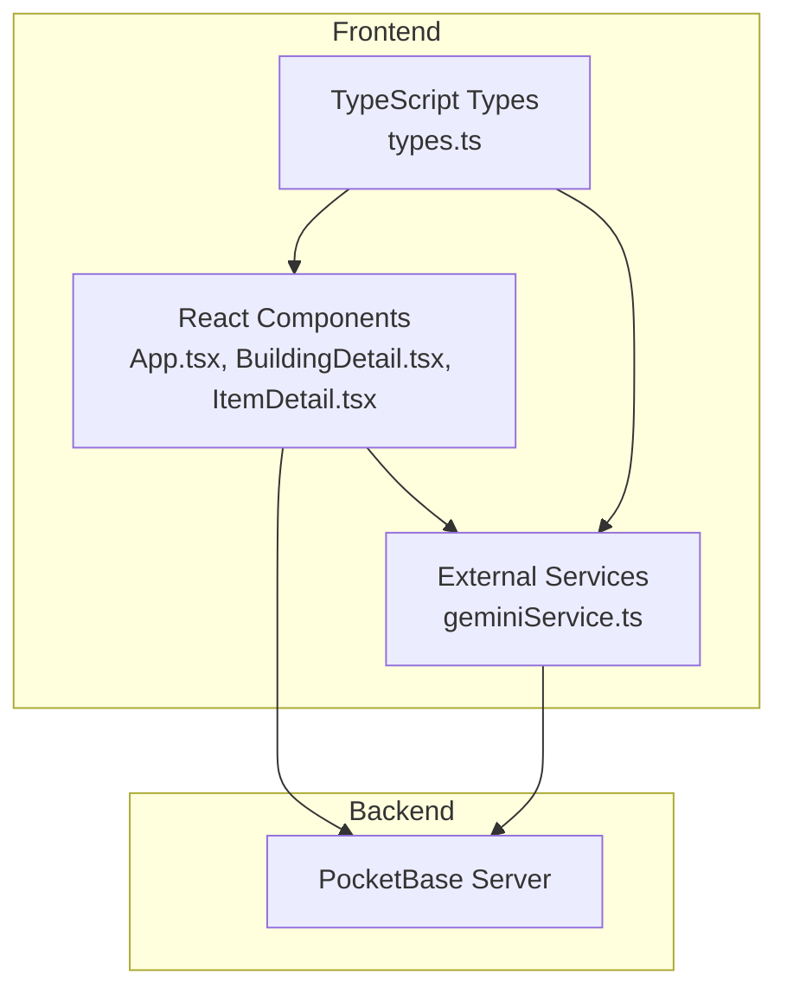
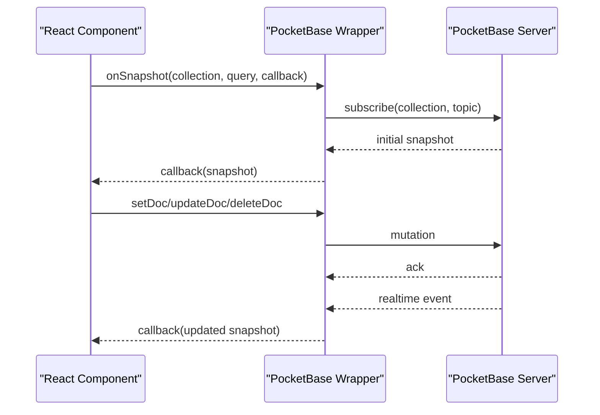
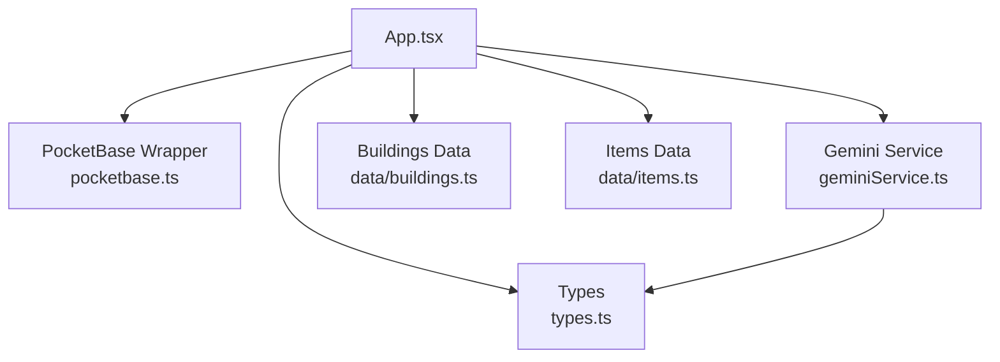
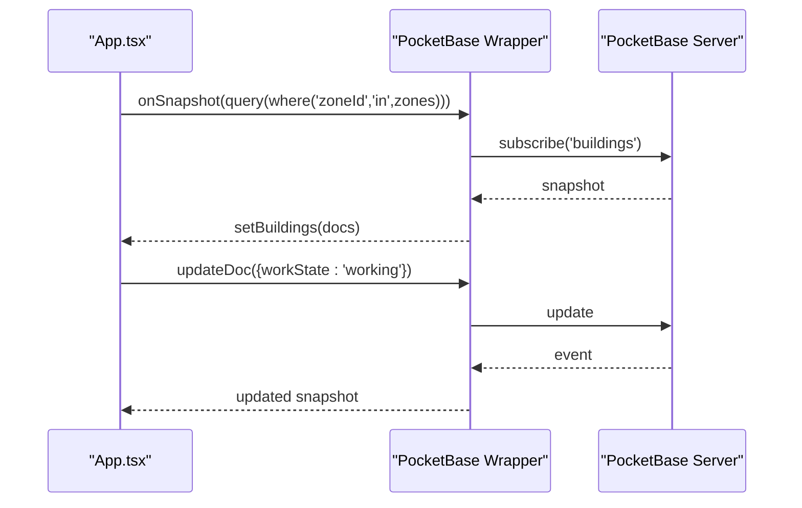
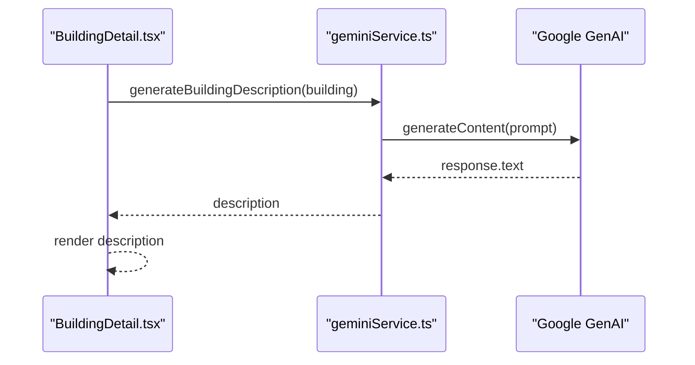

# API Reference

<cite>
**Referenced Files in This Document**
- [pocketbase.ts](file://src/pocketbase.ts)
- [geminiService.ts](file://services/geminiService.ts)
- [types.ts](file://types.ts)
- [App.tsx](file://App.tsx)
- [index.tsx](file://index.tsx)
- [buildings.ts](file://data/buildings.ts)
- [items.ts](file://data/items.ts)
- [README.md](file://README.md)
- [package.json](file://package.json)
- [BuildingDetail.tsx](file://components/BuildingDetail.tsx)
- [ItemDetail.tsx](file://components/ItemDetail.tsx)
</cite>

## Table of Contents
1. [Introduction](#introduction)
2. [Project Structure](#project-structure)
3. [Core Components](#core-components)
4. [Architecture Overview](#architecture-overview)
5. [Detailed Component Analysis](#detailed-component-analysis)
6. [Dependency Analysis](#dependency-analysis)
7. [Performance Considerations](#performance-considerations)
8. [Troubleshooting Guide](#troubleshooting-guide)
9. [Conclusion](#conclusion)
10. [Appendices](#appendices)

## Introduction
This document provides API documentation for the Basingsemmorpg application’s internal APIs and external service integrations. It covers:
- The PocketBase database API wrapper with CRUD, query building, and real-time subscriptions
- The Gemini AI service integration for content generation
- The main game engine API surface exposed via React components and PocketBase wrappers
- Component interfaces, prop types, and event handlers
- Comprehensive type definitions from types.ts including data models, interface specifications, and enums
- Practical usage examples, error handling strategies, and integration patterns
- API versioning, backward compatibility, and migration guidance

## Project Structure
The application is a React-based single-page application using Vite for development and PocketBase as the backend database. External integrations include:
- PocketBase SDK for database operations and real-time subscriptions
- Google Gemini GenAI SDK for content generation
- Local TypeScript types for game entities and UI props

**Diagram sources**
- [App.tsx:1-50](file://App.tsx#L1-L50)
- [geminiService.ts:1-43](file://services/geminiService.ts#L1-L43)
- [types.ts:1-197](file://types.ts#L1-L197)

**Section sources**
- [README.md:1-21](file://README.md#L1-L21)
- [package.json:1-31](file://package.json#L1-L31)

## Core Components
This section outlines the primary APIs and services used by the application.

- PocketBase Database API Wrapper
  - Authentication helpers mirroring Firebase Auth exports
  - Firestore-compatible helpers for documents, collections, snapshots, and queries
  - Data transformation utilities for schema alignment and type normalization
  - CRUD operations with robust upsert, partial updates, and field deletion
  - Query builder supporting where, orderBy, and limit constraints
  - Real-time subscriptions with retry logic and throttling
  - Transactions and write batches for multi-operation consistency
  - Error handling and operation logging

- Gemini AI Service
  - Content generation for building descriptions
  - Request/response handling and environment configuration

- Game Engine API Surface
  - React components interacting with PocketBase and Gemini
  - Data models and UI prop interfaces for building and item details

**Section sources**
- [pocketbase.ts:1-825](file://src/pocketbase.ts#L1-L825)
- [geminiService.ts:1-43](file://services/geminiService.ts#L1-L43)
- [types.ts:1-197](file://types.ts#L1-L197)
- [App.tsx:1-50](file://App.tsx#L1-L50)

## Architecture Overview
The application follows a reactive architecture:
- React components subscribe to PocketBase collections and documents via onSnapshot
- UI state updates trigger CRUD operations through the PocketBase wrapper
- External services (Gemini) augment UI content asynchronously
- TypeScript types define the contract between components, services, and the database

**Diagram sources**
- [pocketbase.ts:571-707](file://src/pocketbase.ts#L571-L707)
- [App.tsx:822-877](file://App.tsx#L822-L877)

## Detailed Component Analysis

### PocketBase Database API Wrapper
The PocketBase wrapper provides a Firestore-compatible API layered over PocketBase. It includes:
- Authentication helpers: signInWithEmailAndPassword, createUserWithEmailAndPassword, signInWithPopup, signOut, onAuthStateChanged
- Firestore-compatible types: DocSnapshot, QuerySnapshot, DocRef
- Data transformation: wrapData, unwrapData, sanitizePbId
- CRUD operations: getDoc, getDocs, setDoc, updateDoc, deleteDoc, deleteAll
- Query builder: query, where, orderBy, limit, increment sentinel, deleteField
- Real-time subscriptions: onSnapshot with retry and throttling
- Transactions and write batches: runTransaction, writeBatch
- Error handling: handleFirestoreError with OperationType enumeration

Key methods and signatures:
- Authentication
  - signInWithEmailAndPassword(email: string, password: string): Promise<{ user: PBUser }>
  - createUserWithEmailAndPassword(email: string, password: string): Promise<{ user: PBUser }>
  - signInWithPopup(...args): Promise<{ user: PBUser }>
  - signOut(...args): Promise<void>
  - onAuthStateChanged(auth: unknown, callback: (user: PBUser | null) => void): () => void

- Document and collection references
  - doc(db: unknown, collectionName: string, id: string): DocRef
  - collection(db: unknown, collectionName: string): string

- CRUD operations
  - getDoc(ref: DocRef): Promise<DocSnapshot>
  - getDocs(colOrQuery: string | QueryDescriptor): Promise<QuerySnapshot>
  - setDoc(ref: DocRef, data: AnyRecord): Promise<void>
  - updateDoc(ref: DocRef, data: AnyRecord): Promise<void>
  - deleteDoc(ref: DocRef): Promise<void>
  - deleteAll(collectionName: string): Promise<void>
  - deleteField(): null
  - increment(n: number): IncrementSentinel

- Query builder
  - query(col: string, ...constraints: QueryConstraint[]): QueryDescriptor
  - where(field: string, op: string, value: unknown): QueryConstraint
  - orderBy(field: string, dir: 'asc' | 'desc'): QueryConstraint
  - limit(n: number): QueryConstraint

- Real-time subscriptions
  - onSnapshot(refOrQuery: DocRef | QueryDescriptor, callback: (snapshot: any) => void, errCallback?: (e: unknown) => void): UnsubscribeFn

- Transactions and batches
  - runTransaction(db: unknown, fn: (t: PBTransaction) => Promise<T>): Promise<T>
  - writeBatch(db: unknown): Batch

- Utilities
  - sanitizePbId(id: string | number): string
  - handleFirestoreError(error: unknown, operationType: OperationType, path?: string | null): void

Usage examples:
- Subscribing to user data
  - onSnapshot(doc(db, 'users', uid), (snap) => setUserData(snap.data()))
- Querying buildings by zone
  - onSnapshot(query(collection(db, 'buildings'), where('zoneId', 'in', zones)), (snap) => setBuildings(snap.docs.map(d => d.data())))
- Updating player resources
  - updateDoc(doc(db, 'users', uid), { gold: increment(delta), 'inventory.10001': increment(-consume) })

Error handling:
- Use handleFirestoreError for consistent logging and user feedback
- onSnapshot accepts an optional error callback for immediate handling

**Section sources**
- [pocketbase.ts:1-825](file://src/pocketbase.ts#L1-L825)

### Gemini AI Service
The Gemini service integrates with the Google GenAI SDK to generate creative building descriptions in Russian.

Methods:
- generateBuildingDescription(building: Building): Promise<string>

Behavior:
- Requires API key via environment variable
- Generates a description prompt based on building stats and properties
- Returns either the generated text or a fallback message if the API key is missing or generation fails

Integration pattern:
- Components call generateBuildingDescription and render the result
- The service handles environment checks and error logging internally

**Section sources**
- [geminiService.ts:1-43](file://services/geminiService.ts#L1-L43)
- [BuildingDetail.tsx:46-85](file://components/BuildingDetail.tsx#L46-L85)

### Game Engine API Surface (React Components)
The main game logic is implemented in App.tsx, which:
- Initializes PocketBase client and authentication
- Synchronizes game state via onSnapshot subscriptions
- Manages user data, buildings, map resources, dropped items, chat, and market
- Implements game actions (build, move, collect, destroy) with optimistic UI updates and server synchronization

Key UI components and props:
- BuildingDetail
  - Props: building: Building, onSelectEntity: (entity: { id: number; type: 'item' | 'building' }) => void
  - Behavior: Displays building info, production/consumption stats, drops, and destruction info; integrates with Gemini description generation
- ItemDetail
  - Props: item: Item, onSelectEntity: (entity: { id: number; type: 'item' | 'building' }) => void
  - Behavior: Displays item usage relationships (required for, used in work, produced by, drops from)

Integration with PocketBase:
- Subscriptions to collections (users, buildings, map_resources, dropped_items, chat_messages, presence, clans, market)
- CRUD operations for saving user data, placing buildings, collecting resources, and managing chat

**Section sources**
- [App.tsx:1-50](file://App.tsx#L1-L50)
- [App.tsx:822-877](file://App.tsx#L822-L877)
- [App.tsx:1618-1636](file://App.tsx#L1618-L1636)
- [BuildingDetail.tsx:7-151](file://components/BuildingDetail.tsx#L7-L151)
- [ItemDetail.tsx:5-59](file://components/ItemDetail.tsx#L5-L59)

### Data Models and Type Definitions
The types.ts file defines core data structures used across the application.

Enums:
- BuildingType: default, storage, town_hall, residential

Interfaces:
- ResourceInfo: id, name, amount, chance, frequency
- Item: id, name, englishName, description, category, requiredFor, usedInWork, producedBy, sometimesProducedBy, dropsFrom, imageUrl, rubyPackQuantity
- DestructionInfo: resourceId, weaponName, amount, goldCost, energyCost, timeSeconds, damage
- Building: id, name, englishName, category, type, price, rubyPrice, buildable, constructionRequirements, stats, drops, upgradesTo, upgradeCost, destructionInfo, description, imageUrl, imagePrompt
- DroppedItem: id, x, y, zoneId, itemId, amount, ownerId, ownerName
- MapResource: x, y, zoneId, hp, type
- PlacedBuilding: id, x, y, zoneId, buildingId, ownerId, ownerName, isConstructing, constructionEndTime, type, isLocal, workState, workEndTime, isDestroying, destructionEndTime, hp, maxHp, pendingDamage, taxRate, bank, initiatorId, lastMoveTime, lastAttackTime, protectionEndTime, isActive, hostId, timestamp
- VisualEffect: id, x, y, type, startTime, duration, targetX, targetY
- MarketListing: id, sellerName, sellerId, resourceId, amount, price, currency
- Clan: id, name, description, avatarUrl, leaderName, leaderUid, membersCount
- HistoryEntry: id, message, timestamp, type
- PrivateMessage: id, chatId, senderId, receiverId, text, timestamp, read, participants

Usage examples:
- BuildingDetail receives a Building and renders stats and relationships
- ItemDetail receives an Item and lists related buildings and chances/frequencies
- App.tsx uses PlacedBuilding, MapResource, DroppedItem, and other types for state management

**Section sources**
- [types.ts:1-197](file://types.ts#L1-L197)
- [buildings.ts:1-800](file://data/buildings.ts#L1-L800)
- [items.ts:1-415](file://data/items.ts#L1-L415)

### API Usage Examples
- Authentication
  - Email/password login: signInWithEmailAndPassword(email, password)
  - Registration: createUserWithEmailAndPassword(email, password)
  - Popup OAuth: signInWithPopup()
  - Logout: signOut()

- Real-time subscriptions
  - User profile: onSnapshot(doc(db, 'users', uid), (snap) => setUserData(snap.data()))
  - Buildings in zones: onSnapshot(query(collection(db, 'buildings'), where('zoneId', 'in', zones)), (snap) => setBuildings(snap.docs.map(d => d.data())))

- CRUD operations
  - Place a building: setDoc(doc(db, 'buildings', id), placedBuilding)
  - Collect dropped item: deleteDoc(doc(db, 'dropped_items', id))
  - Update user resources: updateDoc(doc(db, 'users', uid), { gold: increment(delta), 'inventory.itemId': increment(-consume) })

- Query building data
  - Get all buildings: getDocs(collection(db, 'buildings'))
  - Filter by owner: getDocs(query(collection(db, 'buildings'), where('ownerId', '==', uid)))

- Transactions and batches
  - runTransaction for multi-field updates with consistency
  - writeBatch for committing multiple operations atomically

**Section sources**
- [pocketbase.ts:18-104](file://src/pocketbase.ts#L18-L104)
- [pocketbase.ts:288-448](file://src/pocketbase.ts#L288-L448)
- [pocketbase.ts:476-569](file://src/pocketbase.ts#L476-L569)
- [pocketbase.ts:571-707](file://src/pocketbase.ts#L571-L707)
- [pocketbase.ts:716-765](file://src/pocketbase.ts#L716-L765)
- [App.tsx:1040-1058](file://App.tsx#L1040-L1058)
- [App.tsx:1108-1112](file://App.tsx#L1108-L1112)

### Error Handling Strategies
- Consistent logging via handleFirestoreError with OperationType and path
- onSnapshot error callbacks for immediate UI feedback
- Graceful degradation when external services (e.g., Gemini) are unavailable
- Retry logic for stale client IDs in real-time subscriptions
- Optimistic UI updates with rollback on failure

**Section sources**
- [pocketbase.ts:787-800](file://src/pocketbase.ts#L787-L800)
- [pocketbase.ts:587-621](file://src/pocketbase.ts#L587-L621)
- [geminiService.ts:33-42](file://services/geminiService.ts#L33-L42)

### Integration Patterns
- Real-time synchronization: Subscribe to collections and documents; merge local state with server updates
- Data transformation: Use wrapData and unwrapData to normalize schema differences between game logic and PocketBase
- Environment configuration: Provide API keys via environment variables for external services
- Component-driven data fetching: Use getDocs for bulk reads and onSnapshot for live updates

**Section sources**
- [pocketbase.ts:145-218](file://src/pocketbase.ts#L145-L218)
- [geminiService.ts:1-10](file://services/geminiService.ts#L1-L10)
- [App.tsx:822-877](file://App.tsx#L822-L877)

## Dependency Analysis
External dependencies and their roles:
- pocketbase: Backend database and real-time subscriptions
- @google/genai: AI content generation for building descriptions
- lucide-react: UI icons
- motion: Animation library
- dotenv/google-auth-library: Environment configuration and auth utilities

**Diagram sources**
- [package.json:12-21](file://package.json#L12-L21)
- [App.tsx:1-50](file://App.tsx#L1-L50)
- [geminiService.ts:1-43](file://services/geminiService.ts#L1-L43)
- [types.ts:1-197](file://types.ts#L1-L197)
- [buildings.ts:1-800](file://data/buildings.ts#L1-L800)
- [items.ts:1-415](file://data/items.ts#L1-L415)

**Section sources**
- [package.json:12-21](file://package.json#L12-L21)

## Performance Considerations
- Real-time throttling: onSnapshot uses throttling to reduce server load during rapid updates
- Chunked deletions: deleteAll performs deletions in chunks to avoid overwhelming the server
- Optimistic UI updates: Immediate UI changes with subsequent reconciliation to minimize perceived latency
- Efficient queries: Use where clauses and limits to constrain dataset sizes
- Data normalization: wrapData and unwrapData reduce schema mismatches and simplify updates

[No sources needed since this section provides general guidance]

## Troubleshooting Guide
Common issues and resolutions:
- Authentication failures: Verify email/password credentials and ensure unique email constraints
- Real-time subscription errors: Stale client ID errors are retried automatically; check network connectivity
- Missing API key for Gemini: Provide GEMINI_API_KEY in environment; service logs warnings when missing
- Data corruption: unwrapData strips accidental isLocal flags; handleFirestoreError logs and surfaces errors
- Presence updates: Errors are ignored to keep gameplay smooth; presence is best-effort

**Section sources**
- [pocketbase.ts:587-621](file://src/pocketbase.ts#L587-L621)
- [pocketbase.ts:787-800](file://src/pocketbase.ts#L787-L800)
- [geminiService.ts:4-8](file://services/geminiService.ts#L4-L8)

## Conclusion
This API reference documents the PocketBase wrapper, Gemini integration, and React component interfaces that power the Basingsemmorpg application. By leveraging Firestore-compatible abstractions, real-time subscriptions, and typed data models, the application achieves responsive multiplayer gameplay synchronized with a remote database. The provided examples, error handling strategies, and integration patterns enable developers to extend functionality while maintaining backward compatibility and performance.

[No sources needed since this section summarizes without analyzing specific files]

## Appendices

### API Versioning and Backward Compatibility
- Version markers: The PocketBase wrapper logs version identifiers to track changes across deployments
- Migration patterns: Use deleteAll cautiously and coordinate with server-side migrations; sanitizePbId ensures stable record IDs
- Schema alignment: wrapData and unwrapData normalize differences between game logic and PocketBase schema

**Section sources**
- [pocketbase.ts](file://src/pocketbase.ts#L11)
- [pocketbase.ts:165-218](file://src/pocketbase.ts#L165-L218)
- [pocketbase.ts:252-276](file://src/pocketbase.ts#L252-L276)

### Example Workflows

#### Real-time Building Updates

**Diagram sources**
- [App.tsx:2125-2145](file://App.tsx#L2125-L2145)
- [pocketbase.ts:571-707](file://src/pocketbase.ts#L571-L707)

#### Building Description Generation

**Diagram sources**
- [BuildingDetail.tsx:50-56](file://components/BuildingDetail.tsx#L50-L56)
- [geminiService.ts:12-42](file://services/geminiService.ts#L12-L42)