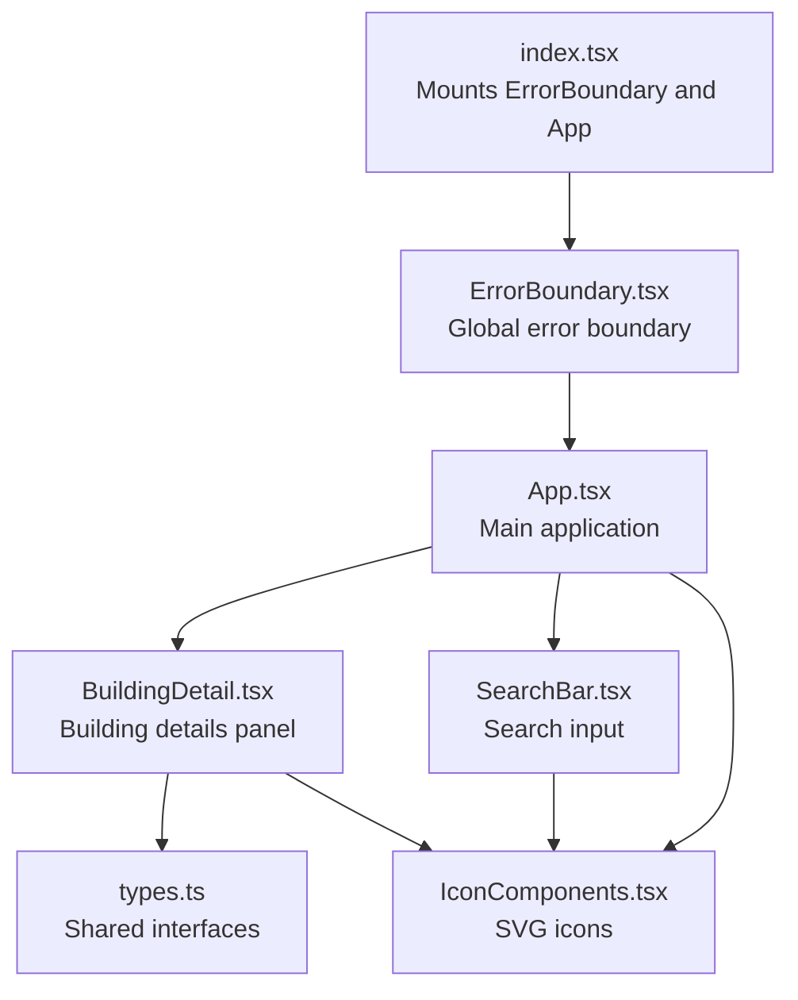
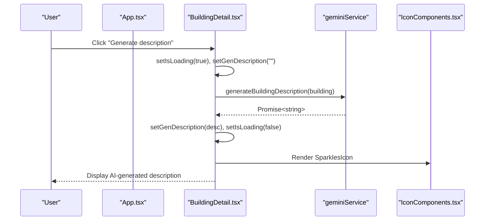
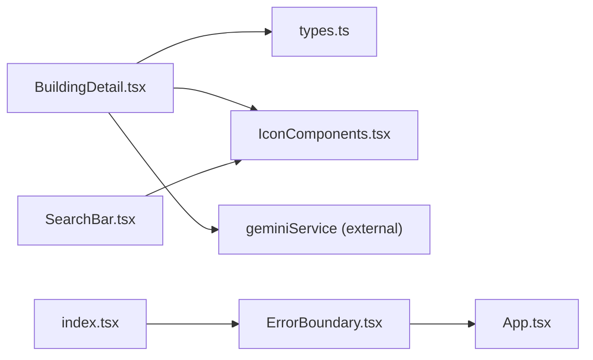

# Component APIs

<cite>
**Referenced Files in This Document**
- [BuildingDetail.tsx](file://components/BuildingDetail.tsx)
- [IconComponents.tsx](file://components/IconComponents.tsx)
- [SearchBar.tsx](file://components/SearchBar.tsx)
- [ErrorBoundary.tsx](file://components/ErrorBoundary.tsx)
- [types.ts](file://types.ts)
- [index.tsx](file://index.tsx)
- [App.tsx](file://App.tsx)
</cite>

## Table of Contents
1. [Introduction](#introduction)
2. [Project Structure](#project-structure)
3. [Core Components](#core-components)
4. [Architecture Overview](#architecture-overview)
5. [Detailed Component Analysis](#detailed-component-analysis)
6. [Dependency Analysis](#dependency-analysis)
7. [Performance Considerations](#performance-considerations)
8. [Troubleshooting Guide](#troubleshooting-guide)
9. [Conclusion](#conclusion)

## Introduction
This document provides comprehensive API documentation for key React components used in the project. It focuses on:
- BuildingDetail: Building display and interaction patterns
- IconComponents: SVG icon interfaces and customization options
- SearchBar: Search functionality, filtering, and event handling
- ErrorBoundary: Error handling patterns and recovery mechanisms

It also covers prop type definitions, event handler signatures, usage examples, composition patterns, state management integration, performance considerations, accessibility guidelines, responsive design patterns, and cross-browser compatibility notes.

## Project Structure
The components are located under the components directory and are integrated into the application via the root index.tsx and App.tsx. The types module defines shared interfaces used by these components.

**Diagram sources**
- [index.tsx:14-19](file://index.tsx#L14-L19)
- [ErrorBoundary.tsx:14-75](file://components/ErrorBoundary.tsx#L14-L75)
- [App.tsx:255-320](file://App.tsx#L255-L320)
- [BuildingDetail.tsx:46-148](file://components/BuildingDetail.tsx#L46-L148)
- [SearchBar.tsx:11-26](file://components/SearchBar.tsx#L11-L26)
- [IconComponents.tsx:4-187](file://components/IconComponents.tsx#L4-L187)
- [types.ts:2-96](file://types.ts#L2-L96)

**Section sources**
- [index.tsx:14-19](file://index.tsx#L14-L19)
- [App.tsx:255-320](file://App.tsx#L255-L320)
- [types.ts:2-96](file://types.ts#L2-L96)

## Core Components
This section summarizes the primary component APIs and their roles.

- BuildingDetail
  - Purpose: Renders detailed information about a building, including stats, requirements, production/consumption, drops, and destruction info. Provides an action to generate an AI description.
  - Key props:
    - building: Building
    - onSelectEntity: (entity: { id: number; type: 'item' | 'building' }) => void
  - Internal state:
    - genDescription: string
    - isLoading: boolean
  - Event handlers:
    - handleGenerateDescription: async function to fetch AI description
  - Composition pattern:
    - Uses DetailRow and ResourceList subcomponents
    - Uses SparklesIcon from IconComponents
    - Integrates with geminiService for AI description generation

- IconComponents
  - Purpose: Provides a library of reusable SVG icons as React functional components.
  - Interface: Each icon accepts a className?: string prop for sizing and styling.
  - Exported icons: SearchIcon, BuildingIcon, ResourceIcon, CloseIcon, SparklesIcon, CoinIcon, EnergyIcon, UserIcon, MaleIcon, FemaleIcon, ResidentialIcon, BusinessIcon, LettersIcon, GreeneryIcon, RoadsIcon, WallsIcon, FactoriesIcon, MonstersIcon, ClanIcon, GiftsIcon, InventoryIcon, MoveIcon, ShoppingCartIcon, TradeIcon, RepairIcon, DefenseIcon, HomeIcon, ChevronUpIcon, ChevronDownIcon, SellIcon, ShieldIcon, MapIcon, CompassIcon, SmileyIcon

- SearchBar
  - Purpose: Text input for searching by ID or name with an embedded SearchIcon.
  - Key props:
    - searchTerm: string
    - setSearchTerm: (term: string) => void
    - placeholder?: string (default: "Поиск по ID, названию...")
  - Event handling:
    - onChange handler updates searchTerm via setSearchTerm

- ErrorBoundary
  - Purpose: Catches JavaScript errors during rendering and displays a friendly error page with a reset button.
  - Props:
    - children: ReactNode
  - State:
    - hasError: boolean
    - error: Error | null
  - Lifecycle methods:
    - getDerivedStateFromError: sets error state on uncaught error
    - componentDidCatch: logs error and error info
  - Recovery:
    - Reset button triggers window reload after resetting state

**Section sources**
- [BuildingDetail.tsx:7-10](file://components/BuildingDetail.tsx#L7-L10)
- [BuildingDetail.tsx:46-148](file://components/BuildingDetail.tsx#L46-L148)
- [IconComponents.tsx:4-187](file://components/IconComponents.tsx#L4-L187)
- [SearchBar.tsx:5-9](file://components/SearchBar.tsx#L5-L9)
- [SearchBar.tsx:11-26](file://components/SearchBar.tsx#L11-L26)
- [ErrorBoundary.tsx:5-12](file://components/ErrorBoundary.tsx#L5-L12)
- [ErrorBoundary.tsx:14-75](file://components/ErrorBoundary.tsx#L14-L75)

## Architecture Overview
The components integrate with the main application and share data models defined in types.ts. BuildingDetail relies on external AI service integration for dynamic content generation. ErrorBoundary wraps the entire application to provide resilience against runtime errors.

**Diagram sources**
- [BuildingDetail.tsx:50-56](file://components/BuildingDetail.tsx#L50-L56)
- [BuildingDetail.tsx:53](file://components/BuildingDetail.tsx#L53)
- [IconComponents.tsx:28-32](file://components/IconComponents.tsx#L28-L32)

**Section sources**
- [BuildingDetail.tsx:46-148](file://components/BuildingDetail.tsx#L46-L148)
- [App.tsx:255-320](file://App.tsx#L255-L320)

## Detailed Component Analysis

### BuildingDetail Component API
- Purpose
  - Displays comprehensive building information and supports generating an AI description.
- Props
  - building: Building
  - onSelectEntity: (entity: { id: number; type: 'item' | 'building' }) => void
- Internal state
  - genDescription: string
  - isLoading: boolean
- Event handlers
  - handleGenerateDescription: async function to call AI service and update state
- Subcomponents
  - DetailRow: renders a single row with label/value
  - ResourceList: renders a list of resources with clickable names
- Composition patterns
  - Uses SparklesIcon for the AI generation button
  - Integrates with geminiService for dynamic content
- Accessibility
  - Uses semantic headings and lists
  - Interactive elements have hover/focus styles
- Responsive design
  - Uses grid layout with responsive breakpoints
- Cross-browser compatibility
  - Pure React and Tailwind CSS; ensure Tailwind JIT mode is configured

Usage example (conceptual):
- Pass a Building object and an entity selection callback to render the panel.
- The AI description button triggers asynchronous network activity; ensure proper loading states.

**Section sources**
- [BuildingDetail.tsx:7-10](file://components/BuildingDetail.tsx#L7-L10)
- [BuildingDetail.tsx:12-20](file://components/BuildingDetail.tsx#L12-L20)
- [BuildingDetail.tsx:22-43](file://components/BuildingDetail.tsx#L22-L43)
- [BuildingDetail.tsx:46-148](file://components/BuildingDetail.tsx#L46-L148)
- [types.ts:42-96](file://types.ts#L42-L96)

### IconComponents API
- Purpose
  - Provide a consistent set of SVG icons as React components.
- Interface
  - Each icon: ({ className }: { className?: string }) => JSX.Element
- Customization
  - className controls size and color via Tailwind classes
- Common usage
  - Embedded inside SearchBar and buttons within BuildingDetail
- Accessibility
  - Icons are decorative; ensure meaningful text is present alongside icons for interactive elements

Usage example (conceptual):
- Import SearchIcon and use as a visual prefix inside SearchBar.
- Use SparklesIcon inside a button to indicate AI-related actions.

**Section sources**
- [IconComponents.tsx:4-187](file://components/IconComponents.tsx#L4-L187)
- [SearchBar.tsx:14-16](file://components/SearchBar.tsx#L14-L16)
- [BuildingDetail.tsx:77-78](file://components/BuildingDetail.tsx#L77-L78)

### SearchBar Component API
- Purpose
  - Lightweight text input with an embedded SearchIcon for filtering/searching.
- Props
  - searchTerm: string
  - setSearchTerm: (term: string) => void
  - placeholder?: string (default provided)
- Event handling
  - onChange updates searchTerm via setSearchTerm
- Accessibility
  - Uses placeholder text and built-in focus styles
  - Ensure sufficient color contrast for placeholder text
- Responsive design
  - Full-width container with centered alignment
- Cross-browser compatibility
  - Standard HTMLInputElement; tested across modern browsers

Usage example (conceptual):
- Bind to a parent component’s state to filter lists or search within App.tsx.

**Section sources**
- [SearchBar.tsx:5-9](file://components/SearchBar.tsx#L5-L9)
- [SearchBar.tsx:11-26](file://components/SearchBar.tsx#L11-L26)

### ErrorBoundary Component API
- Purpose
  - Global error boundary to gracefully handle JavaScript errors.
- Props
  - children: ReactNode
- State
  - hasError: boolean
  - error: Error | null
- Lifecycle methods
  - getDerivedStateFromError: sets error state on uncaught error
  - componentDidCatch: logs error and error info
- Recovery mechanism
  - Reset button triggers window reload after resetting internal state
- Accessibility
  - Clear error message and prominent reset button
- Cross-browser compatibility
  - Standard React class component; works across environments

Usage example (conceptual):
- Wrap the entire application in index.tsx to ensure global error coverage.

**Section sources**
- [ErrorBoundary.tsx:5-12](file://components/ErrorBoundary.tsx#L5-L12)
- [ErrorBoundary.tsx:14-75](file://components/ErrorBoundary.tsx#L14-L75)
- [index.tsx:14-19](file://index.tsx#L14-L19)

## Dependency Analysis
- BuildingDetail depends on:
  - types.ts for Building and ResourceInfo
  - IconComponents.tsx for SparklesIcon
  - geminiService for AI description generation
- SearchBar depends on:
  - IconComponents.tsx for SearchIcon
- ErrorBoundary is a standalone component wrapping the app root.

**Diagram sources**
- [BuildingDetail.tsx:3](file://components/BuildingDetail.tsx#L3)
- [BuildingDetail.tsx:5](file://components/BuildingDetail.tsx#L5)
- [IconComponents.tsx:2](file://components/IconComponents.tsx#L2)
- [SearchBar.tsx:3](file://components/SearchBar.tsx#L3)
- [ErrorBoundary.tsx:3](file://components/ErrorBoundary.tsx#L3)
- [index.tsx:5](file://index.tsx#L5)

**Section sources**
- [BuildingDetail.tsx:3-5](file://components/BuildingDetail.tsx#L3-L5)
- [SearchBar.tsx:3](file://components/SearchBar.tsx#L3)
- [ErrorBoundary.tsx:3](file://components/ErrorBoundary.tsx#L3)
- [index.tsx:5](file://index.tsx#L5)

## Performance Considerations
- BuildingDetail
  - Async AI description generation can block UI briefly; consider debouncing or caching results if used frequently.
  - Large tables/lists are paginated or scrollable; keep lists concise to maintain responsiveness.
- IconComponents
  - Stateless functional components; minimal overhead. Reuse icons to avoid duplication.
- SearchBar
  - Controlled input; ensure setSearchTerm is memoized to prevent unnecessary re-renders.
- ErrorBoundary
  - Minimal footprint; only active when an error occurs.

## Troubleshooting Guide
- BuildingDetail AI description not appearing
  - Verify API key configuration and network connectivity for the AI service.
  - Check that handleGenerateDescription is invoked and isLoading reflects the async process.
- SearchBar not updating
  - Ensure setSearchTerm is passed correctly and is not overwritten by external state.
- ErrorBoundary not triggering
  - Confirm that an error is thrown within a child component and not caught upstream.
  - Verify ErrorBoundary is rendered at the root level.

**Section sources**
- [BuildingDetail.tsx:46-148](file://components/BuildingDetail.tsx#L46-L148)
- [SearchBar.tsx:11-26](file://components/SearchBar.tsx#L11-L26)
- [ErrorBoundary.tsx:14-75](file://components/ErrorBoundary.tsx#L14-L75)
- [index.tsx:14-19](file://index.tsx#L14-L19)

## Conclusion
These components form a cohesive UI layer with clear separation of concerns:
- BuildingDetail encapsulates building presentation and AI-driven content.
- IconComponents standardize visual elements.
- SearchBar enables efficient filtering.
- ErrorBoundary ensures graceful degradation.

Adhering to the documented APIs, accessibility guidelines, and performance recommendations will help maintain a robust and user-friendly interface.