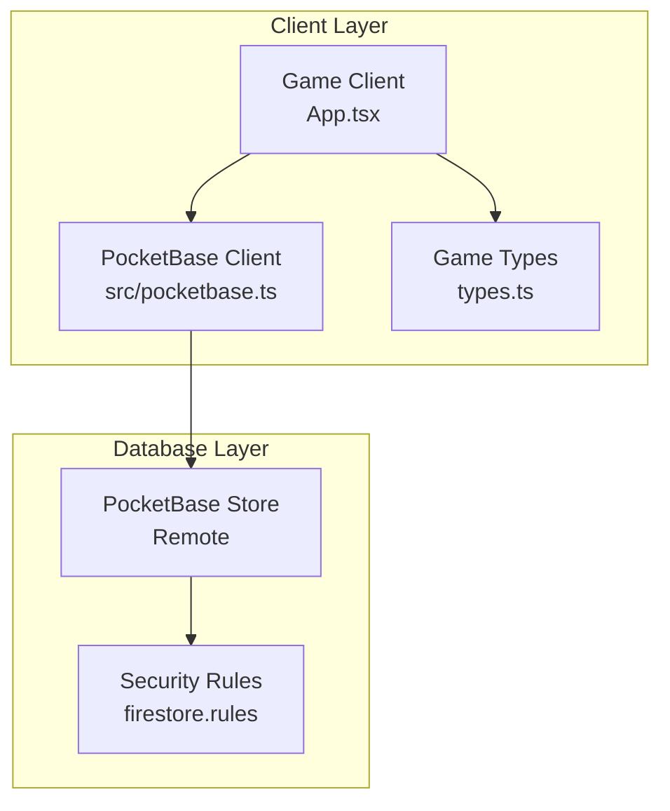
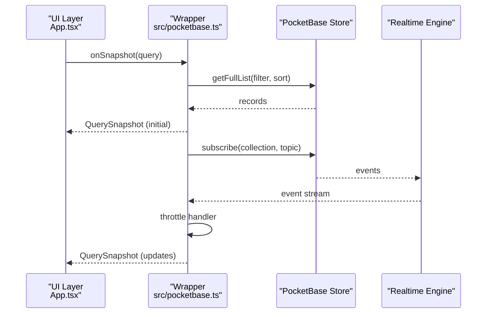
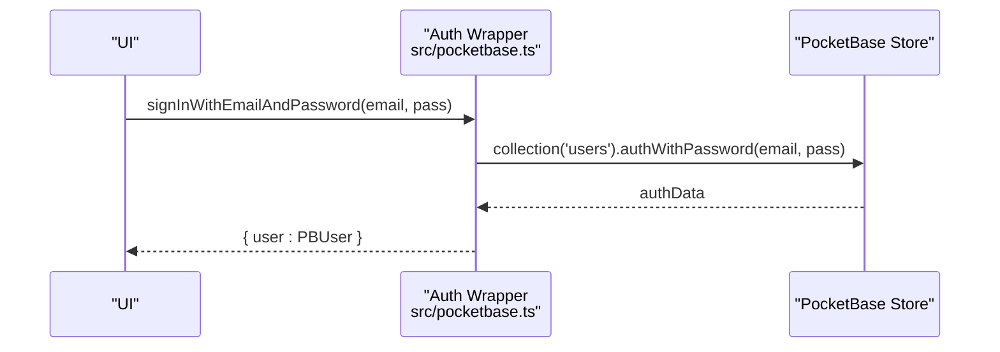
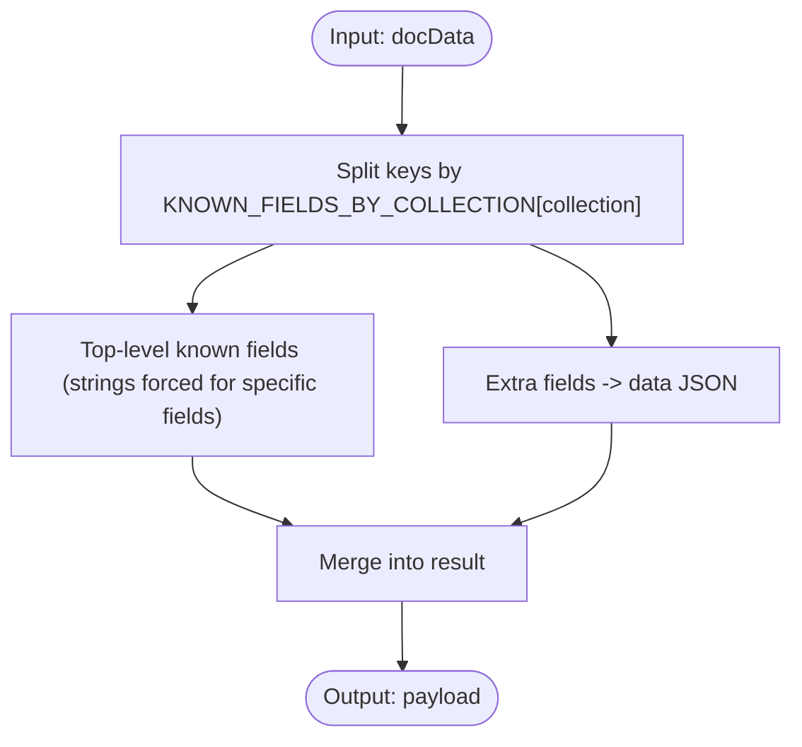
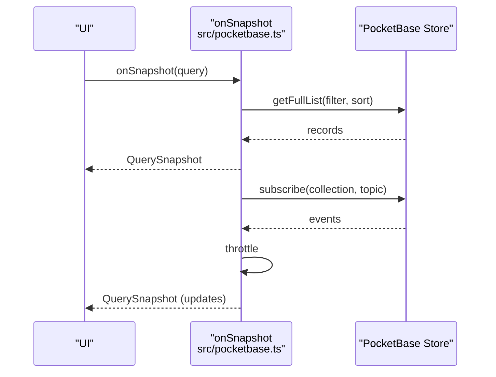
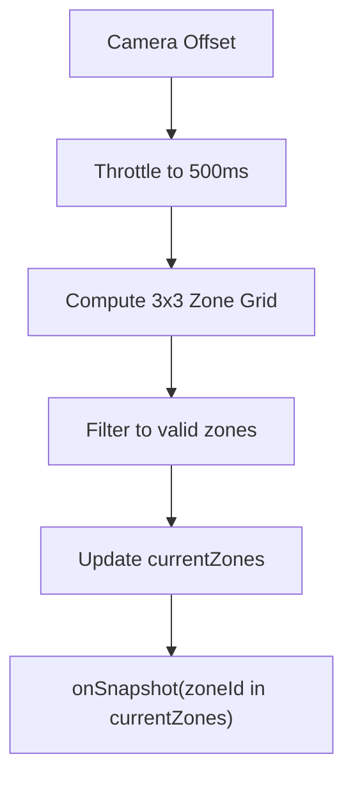
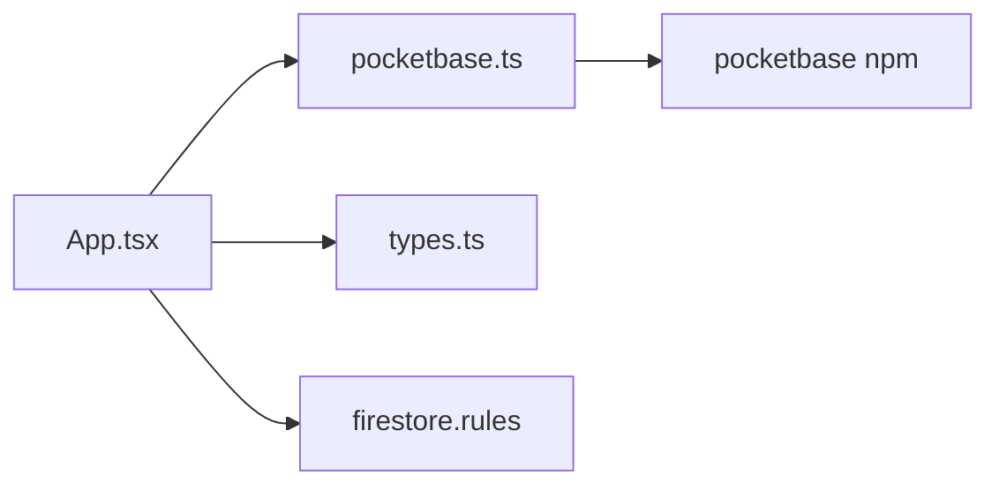

# Database API

<cite>
**Referenced Files in This Document**
- [pocketbase.ts](file://src/pocketbase.ts)
- [App.tsx](file://App.tsx)
- [types.ts](file://types.ts)
- [firestore.rules](file://firestore.rules)
- [firebase-blueprint.json](file://firebase-blueprint.json)
- [package.json](file://package.json)
- [vite.config.ts](file://vite.config.ts)
</cite>

## Table of Contents
1. [Introduction](#introduction)
2. [Project Structure](#project-structure)
3. [Core Components](#core-components)
4. [Architecture Overview](#architecture-overview)
5. [Detailed Component Analysis](#detailed-component-analysis)
6. [Dependency Analysis](#dependency-analysis)
7. [Performance Considerations](#performance-considerations)
8. [Troubleshooting Guide](#troubleshooting-guide)
9. [Conclusion](#conclusion)
10. [Appendices](#appendices)

## Introduction
This document provides comprehensive API documentation for the PocketBase database integration used by the game client. It covers the Firebase-compatible wrapper methods for authentication, real-time subscriptions, data transformation, CRUD operations, and optimistic update handling. It also documents the data models for game entities (PlacedBuilding, MapResource, DroppedItem, User, and others), query building and filtering, pagination, security rules, authentication and authorization patterns, and performance optimization strategies including zone-based data partitioning.

## Project Structure
The database integration is primarily implemented in a single module that mirrors Firebase’s API surface for ease of migration and familiarity. The main client module exposes:
- Authentication helpers mirroring Firebase’s auth APIs
- Firestore-compatible helpers for snapshots and references
- Data transformation utilities to normalize schema differences
- CRUD operations for collections
- Query builder and constraints
- Real-time subscriptions with automatic reconnection
- Transaction and batch helpers
- Error handling and connection testing

**Diagram sources**
- [pocketbase.ts:1-121](file://src/pocketbase.ts#L1-L121)
- [App.tsx:1-120](file://App.tsx#L1-L120)
- [firestore.rules:1-355](file://firestore.rules#L1-L355)

**Section sources**
- [pocketbase.ts:1-121](file://src/pocketbase.ts#L1-L121)
- [App.tsx:1-120](file://App.tsx#L1-L120)
- [package.json:1-31](file://package.json#L1-L31)

## Core Components
- Authentication
  - signInWithEmailAndPassword, createUserWithEmailAndPassword, signInWithPopup, signOut, onAuthStateChanged
  - PBUser type and conversion helpers
- Firestore-compatible helpers
  - DocSnapshot, QuerySnapshot, DocRef, collection, doc
- Data transformation
  - wrapData, unwrapData, toDocSnapshot, sanitizePbId
- CRUD operations
  - getDoc, getDocs, setDoc, updateDoc, deleteDoc, deleteAll, deleteField
- Query builder
  - query, where, orderBy, limit, increment
- Real-time subscriptions
  - onSnapshot with automatic reconnection and throttling
- Transactions and batches
  - runTransaction, writeBatch
- Error handling and connectivity
  - handleFirestoreError, testConnection

**Section sources**
- [pocketbase.ts:14-121](file://src/pocketbase.ts#L14-L121)
- [pocketbase.ts:143-285](file://src/pocketbase.ts#L143-L285)
- [pocketbase.ts:286-765](file://src/pocketbase.ts#L286-L765)
- [pocketbase.ts:771-825](file://src/pocketbase.ts#L771-L825)

## Architecture Overview
The game client uses a Firebase-compatible wrapper around PocketBase. The wrapper:
- Normalizes data by moving non-key fields into a JSON “data” field and lifting known filterable fields to top-level
- Sanitizes IDs to PocketBase’s strict 15-character alphanumeric requirement
- Provides real-time subscriptions with jittered stagger, retries on stale client IDs, and throttled updates
- Implements optimistic updates for responsive UI and conflict resolution via sticky interaction logic

**Diagram sources**
- [pocketbase.ts:571-707](file://src/pocketbase.ts#L571-L707)
- [App.tsx:822-877](file://App.tsx#L822-L877)

**Section sources**
- [pocketbase.ts:571-707](file://src/pocketbase.ts#L571-L707)
- [App.tsx:822-877](file://App.tsx#L822-L877)

## Detailed Component Analysis

### Authentication API
- signInWithEmailAndPassword(email, password) -> Promise<{ user: PBUser }>
- createUserWithEmailAndPassword(email, password) -> Promise<{ user: PBUser }>
- signInWithPopup(...) -> Promise<{ user: PBUser }>
- signOut() -> Promise<void>
- onAuthStateChanged(auth, callback) -> () => void

PBUser fields: id, uid, email, displayName, photoURL. The wrapper caches PBUser instances and updates only when fields change.

**Diagram sources**
- [pocketbase.ts:18-37](file://src/pocketbase.ts#L18-L37)

**Section sources**
- [pocketbase.ts:18-121](file://src/pocketbase.ts#L18-L121)

### Firestore-Compatible Helpers
- DocSnapshot: exists(), data(), id
- QuerySnapshot: docs, size, forEach(cb), docChanges()
- DocRef: { collectionName, id }
- collection(db, name) -> string
- doc(db, collectionName, id) -> DocRef

These enable seamless migration from Firebase SDK usage.

**Section sources**
- [pocketbase.ts:124-141](file://src/pocketbase.ts#L124-L141)
- [pocketbase.ts:242-284](file://src/pocketbase.ts#L242-L284)

### Data Transformation and ID Sanitization
- sanitizePbId(id: string|number) -> string (exactly 15 alphanumerics)
- wrapData(collectionName, docData) -> payload with known fields at top-level and others in data JSON
- unwrapData(record) -> object with lifted fields and type corrections
- toDocSnapshot(record) -> DocSnapshot with normalized id

**Diagram sources**
- [pocketbase.ts:150-184](file://src/pocketbase.ts#L150-L184)

**Section sources**
- [pocketbase.ts:150-231](file://src/pocketbase.ts#L150-L231)
- [pocketbase.ts:252-276](file://src/pocketbase.ts#L252-L276)

### CRUD Operations
- getDoc(ref: DocRef) -> Promise<DocSnapshot>
- getDocs(colOrQuery: string|QueryDescriptor) -> Promise<QuerySnapshot>
- setDoc(ref: DocRef, data: AnyRecord) -> Promise<void> (robust upsert)
- updateDoc(ref: DocRef, data: AnyRecord) -> Promise<void> (supports increment sentinel and dot notation)
- deleteDoc(ref: DocRef) -> Promise<void>
- deleteAll(collectionName: string) -> Promise<void> (chunked deletion)
- deleteField() -> null (marker for field removal)
- increment(n: number) -> IncrementSentinel

Notes:
- setDoc performs a list lookup by id and falls back to gameId for map_resources
- updateDoc supports nested dot notation and numeric increments via sentinel
- deleteDoc handles map_resources by coordinate fallback and swallows 404 unless it is a different error

**Section sources**
- [pocketbase.ts:288-448](file://src/pocketbase.ts#L288-L448)
- [pocketbase.ts:471-569](file://src/pocketbase.ts#L471-L569)

### Query Builder and Filtering
- query(collection, ...constraints) -> QueryDescriptor
- where(field, op, value)
- orderBy(field, dir)
- limit(n)
Supported operators: ==, !=, >, >=, <, <=, in, array-contains
Special timestamp mapping: where('timestamp', ...) becomes where('updated', ...)
Ordering: orderBy('timestamp') maps to orderBy('updated')

Pagination:
- maxItems in QueryDescriptor maps to perPage for getFullList

**Section sources**
- [pocketbase.ts:476-560](file://src/pocketbase.ts#L476-L560)

### Real-Time Subscriptions and Automatic Reconnection
- onSnapshot(refOrQuery, callback, errCallback?) -> () => void
- Single doc: initial getDoc + subscribe(topic=id)
- Collection/query: initial getFullList + subscribe(topic='*')
- Automatic reconnection:
  - Jittered stagger on subscribe
  - Retry on 404 client id errors with exponential backoff
  - Cleanup on unsubscribe
- Updates are throttled to reduce churn

**Diagram sources**
- [pocketbase.ts:578-707](file://src/pocketbase.ts#L578-L707)

**Section sources**
- [pocketbase.ts:578-707](file://src/pocketbase.ts#L578-L707)

### Transactions and Batches
- runTransaction(db, fn) -> Promise<T>
  - PBTransaction: get, update, set, delete
  - Executes pending ops sequentially after fn completes
- writeBatch(db) -> Batch
  - set, update, delete, commit()

Note: PocketBase does not support atomic multi-document transactions; runTransaction batches operations and executes them in order.

**Section sources**
- [pocketbase.ts:724-765](file://src/pocketbase.ts#L724-L765)

### Error Handling and Connectivity Testing
- handleFirestoreError(error, operationType, path?)
  - Logs detailed validation errors and highlights permission issues
- testConnection() -> Promise<void>
  - Checks PocketBase health endpoint

**Section sources**
- [pocketbase.ts:787-825](file://src/pocketbase.ts#L787-L825)

### Game Entity Models
Core models used by the game client:
- PlacedBuilding: id, x, y, zoneId, buildingId, ownerId, ownerName, isConstructing, constructionEndTime, type, isLocal, workState, workEndTime, isDestroying, destructionEndTime, hp, maxHp, pendingDamage, taxRate, bank, initiatorId, lastMoveTime, lastAttackTime, protectionEndTime, isActive, hostId, timestamp
- MapResource: x, y, zoneId, hp, type ∈ {'tree','oil','chest','quarry'}
- DroppedItem: id, x, y, zoneId, itemId, amount, ownerId?, ownerName?
- User (PBUser): id, uid, email, displayName, photoURL
- Additional models: Building, Item, MarketListing, Clan, HistoryEntry, PrivateMessage, VisualEffect

These types are used across UI and database operations.

**Section sources**
- [types.ts:100-147](file://types.ts#L100-L147)
- [types.ts:1-98](file://types.ts#L1-L98)

### Zone-Based Data Partitioning and Performance
- Camera-driven zone computation: getZoneId(x,y) = `${floor(x/ZONE_SIZE)}_${floor(y/ZONE_SIZE)}`
- Current zones tracked and throttled to reduce subscription churn
- Subscriptions scoped to currentZones via where('zoneId', 'in', currentZones)
- Optimizations:
  - getDocs for bulk reads (e.g., clans, market) to avoid realtime overhead
  - Presence updates with heartbeat and throttling
  - Sticky interaction logic to prevent rollback during sync races

**Diagram sources**
- [App.tsx:780-820](file://App.tsx#L780-L820)
- [App.tsx:822-877](file://App.tsx#L822-L877)

**Section sources**
- [App.tsx:780-877](file://App.tsx#L780-L877)

### Security Rules and Authorization
Rules enforce:
- Authentication checks for reads/writes
- Ownership checks for user documents
- Admin/moderator overrides
- Field-level validation for all collections
- Restricted updates for specific entities (e.g., buildings, map_resources)
- Presence and private messages scoped appropriately

Examples:
- users: read allowed; create/update require ownership and validation
- buildings: create/update allow owner/admin or restricted fields for game/system entities
- map_resources: create/update/delete allowed with validation
- private_messages: read allowed for participants; updates restricted to read flag

**Section sources**
- [firestore.rules:242-354](file://firestore.rules#L242-L354)

### Authentication Patterns
- Email/password and Google OAuth2 sign-in
- Auto-initialization of user records on first auth
- Migration of guest-owned buildings to authenticated user
- Presence tracking for online user discovery

**Section sources**
- [pocketbase.ts:18-98](file://src/pocketbase.ts#L18-L98)
- [App.tsx:1558-1616](file://App.tsx#L1558-L1616)
- [App.tsx:1587-1610](file://App.tsx#L1587-L1610)

### Optimistic Update Handling
- Local state updates immediately on user actions (e.g., building placement, movement, resource harvesting)
- Sticky interaction logic prevents rollback during sync races by preserving local state until server confirms parity
- Deletion protection via a set of IDs being deleted to avoid UI flicker

**Section sources**
- [App.tsx:1040-1067](file://App.tsx#L1040-L1067)
- [App.tsx:2024-2091](file://App.tsx#L2024-L2091)

## Dependency Analysis
External dependencies relevant to database integration:
- pocketbase client library
- React for UI and state management
- lucide-react for UI icons
- google-auth-library and @google/genai for external integrations

**Diagram sources**
- [package.json:12-21](file://package.json#L12-L21)
- [vite.config.ts:1-29](file://vite.config.ts#L1-L29)

**Section sources**
- [package.json:1-31](file://package.json#L1-L31)
- [vite.config.ts:1-29](file://vite.config.ts#L1-L29)

## Performance Considerations
- Prefer getDocs for bulk reads when real-time updates are not needed (e.g., clans, market)
- Use zone-based queries to limit dataset size
- Throttle camera-to-zone updates to reduce subscription churn
- Use writeBatch for multiple related updates to minimize round trips
- Leverage presence heartbeat with appropriate intervals to balance freshness and load
- Avoid excessive real-time subscriptions; consolidate where possible

## Troubleshooting Guide
Common issues and resolutions:
- Permission denied errors: Verify user is authenticated and matches ownership rules; check role-based overrides
- Field validation errors: Review firestore.rules validators for the affected collection and fields
- Stale client ID (404) during subscription: Automatic retry with jitter; ensure unsubscribe is called on component unmount
- 404 on delete: For map_resources, fallback to coordinate-based lookup; ignore if not found
- Race conditions: Sticky interaction logic preserves local optimistic state until server confirms parity

**Section sources**
- [pocketbase.ts:787-825](file://src/pocketbase.ts#L787-L825)
- [pocketbase.ts:600-621](file://src/pocketbase.ts#L600-L621)
- [App.tsx:2527-2542](file://App.tsx#L2527-L2542)

## Conclusion
The PocketBase integration provides a robust, Firebase-compatible abstraction for authentication, real-time synchronization, and CRUD operations. With zone-based partitioning, optimistic updates, and strict security rules, the system balances responsiveness, scalability, and correctness for a live multiplayer game environment.

## Appendices

### API Reference Index
- Authentication: signInWithEmailAndPassword, createUserWithEmailAndPassword, signInWithPopup, signOut, onAuthStateChanged
- Snapshots: DocSnapshot, QuerySnapshot, DocRef, collection, doc
- Data: sanitizePbId, wrapData, unwrapData, toDocSnapshot
- CRUD: getDoc, getDocs, setDoc, updateDoc, deleteDoc, deleteAll, deleteField
- Query: query, where, orderBy, limit, increment
- Real-time: onSnapshot
- Transactions/Batch: runTransaction, writeBatch
- Utilities: handleFirestoreError, testConnection

**Section sources**
- [pocketbase.ts:18-121](file://src/pocketbase.ts#L18-L121)
- [pocketbase.ts:143-285](file://src/pocketbase.ts#L143-L285)
- [pocketbase.ts:286-765](file://src/pocketbase.ts#L286-L765)
- [pocketbase.ts:771-825](file://src/pocketbase.ts#L771-L825)