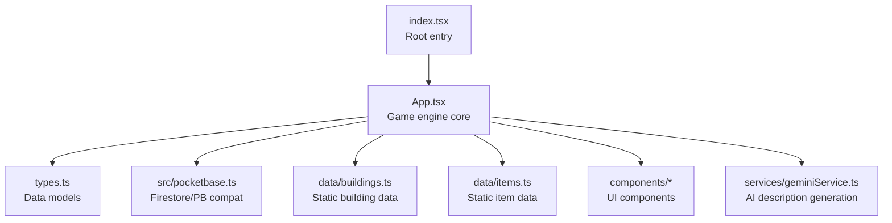
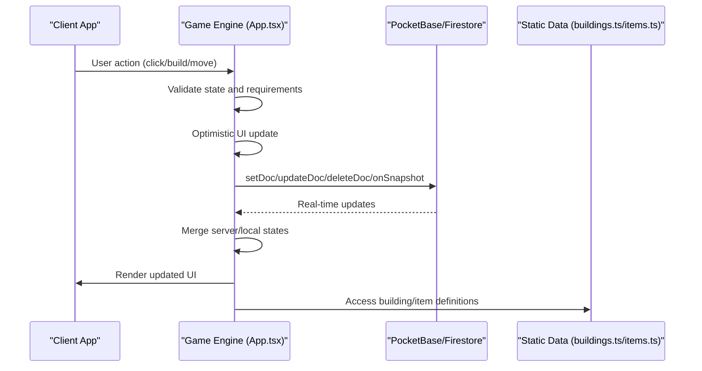
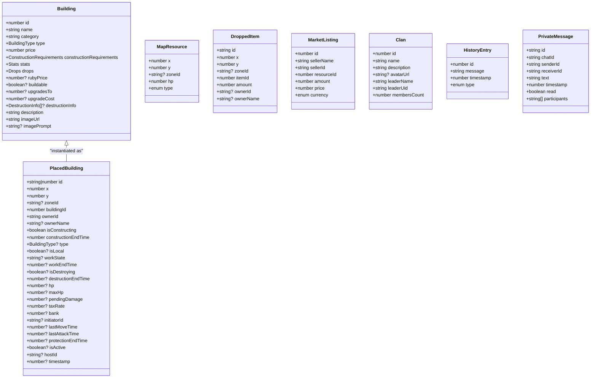
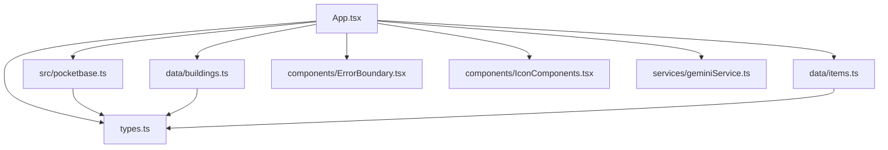

# Game Engine API

<cite>
**Referenced Files in This Document**
- [index.tsx](file://index.tsx)
- [App.tsx](file://App.tsx)
- [types.ts](file://types.ts)
- [pocketbase.ts](file://src/pocketbase.ts)
- [buildings.ts](file://data/buildings.ts)
- [items.ts](file://data/items.ts)
- [ErrorBoundary.tsx](file://components/ErrorBoundary.tsx)
- [IconComponents.tsx](file://components/IconComponents.tsx)
- [geminiService.ts](file://services/geminiService.ts)
</cite>

## Table of Contents
1. [Introduction](#introduction)
2. [Project Structure](#project-structure)
3. [Core Components](#core-components)
4. [Architecture Overview](#architecture-overview)
5. [Detailed Component Analysis](#detailed-component-analysis)
6. [Dependency Analysis](#dependency-analysis)
7. [Performance Considerations](#performance-considerations)
8. [Troubleshooting Guide](#troubleshooting-guide)
9. [Conclusion](#conclusion)

## Introduction
This document provides comprehensive API documentation for the core game engine methods and interfaces. It covers isometric coordinate conversion, zone-based data management, building placement mechanics, resource extraction systems, game state management, real-time synchronization, and event handling. It also documents component interfaces, prop types, and event handlers for React components, along with examples of game loop integration, state mutation patterns, performance optimization techniques, error handling strategies, debugging patterns, and integration with external services.

## Project Structure
The project is a React-based MMORTS game with a TypeScript backend abstraction layer for Firestore/PocketBase. Key areas:
- Application entry and root rendering
- Core game engine logic in App.tsx
- Data models and types
- Firestore/PocketBase compatibility layer
- Static game data (buildings and items)
- React components and UI elements
- AI service integration

**Diagram sources**
- [index.tsx:1-20](file://index.tsx#L1-L20)
- [App.tsx:1-200](file://App.tsx#L1-L200)
- [types.ts:1-197](file://types.ts#L1-L197)
- [pocketbase.ts:1-825](file://src/pocketbase.ts#L1-L825)
- [buildings.ts:1-800](file://data/buildings.ts#L1-L800)
- [items.ts:1-415](file://data/items.ts#L1-L415)
- [geminiService.ts:1-43](file://services/geminiService.ts#L1-L43)

**Section sources**
- [index.tsx:1-20](file://index.tsx#L1-L20)
- [App.tsx:1-200](file://App.tsx#L1-L200)

## Core Components

### Isometric Coordinate Conversion APIs
The engine provides bidirectional isometric-to-screen conversions essential for mouse interactions and rendering.

- worldToScreen(x: number, y: number, zoom: number): { screenX: number, screenY: number }
- screenToWorld(screenX: number, screenY: number, zoom: number): { x: number, y: number }

These functions use tile dimensions and camera offsets to transform coordinates. They are memoized and optimized for performance.

**Section sources**
- [App.tsx:473-487](file://App.tsx#L473-L487)

### Zone-Based Data Management
The world is divided into fixed-size zones to optimize real-time subscriptions and data loading.

- ZONES_X, ZONES_Y: Grid dimensions (5x5)
- ZONE_SIZE: 40x40 tiles per zone
- getZoneId(x: number, y: number): string
- currentZones state tracks currently visible zones
- Zone throttling via throttledCameraOffset reduces subscription churn

Subscriptions are scoped to current zones:
- Map resources: onSnapshot(query(where('zoneId', 'in', currentZones)))
- Buildings: onSnapshot(query(where('zoneId', 'in', currentZones)))
- My buildings: onSnapshot(query(where('ownerId', '==', userId)))

**Section sources**
- [App.tsx:36-46](file://App.tsx#L36-L46)
- [App.tsx:473-487](file://App.tsx#L473-L487)
- [App.tsx:800-820](file://App.tsx#L800-L820)
- [App.tsx:822-877](file://App.tsx#L822-L877)
- [App.tsx:2125-2145](file://App.tsx#L2125-L2145)
- [App.tsx:2093-2123](file://App.tsx#L2093-L2123)

### Building Placement Mechanics
Core placement logic validates tile occupancy, player constraints, and resource costs.

Key functions and validations:
- checkIsTileOccupied(x: number, y: number): boolean
- handleConfirmBuild(): Promise<void> — handles placement, resource deduction, optimistic UI updates, and server sync
- isMyBuilding(b: PlacedBuilding): boolean — owner check
- maxBuildings calculation from building permits
- Population and construction requirement checks

Placement flow:
1. Validate tile availability
2. Check building limits and requirements
3. Deduct resources and update player state
4. Create PlacedBuilding entity with zoneId and construction flags
5. Optimistically update local state, then sync to PocketBase

**Section sources**
- [App.tsx:421-431](file://App.tsx#L421-L431)
- [App.tsx:1439-1555](file://App.tsx#L1439-L1555)
- [App.tsx:2024-2091](file://App.tsx#L2024-L2091)

### Resource Extraction Systems
The engine supports multiple resource types with distinct behaviors.

Resource types:
- Tree: yields wood and coins, respawns after depletion
- Oil deposit: requires Oil Rig to extract barrels
- Quarry: requires Wild Quarry to extract stone
- Chest: randomly yields coins

Core interactions:
- Mouse click on resource triggers extraction
- Energy cost and glory gain mechanics
- HP tracking and respawn timers
- Theft notifications to sector owners

Production and collection:
- Direct production from buildings (e.g., Lily/Mushroom)
- Production completion handling with resource delivery

**Section sources**
- [App.tsx:1170-1285](file://App.tsx#L1170-L1285)
- [App.tsx:1115-1160](file://App.tsx#L1115-L1160)
- [App.tsx:1122-1141](file://App.tsx#L1122-L1141)

### Game State Management and Real-Time Synchronization
Central state management and synchronization patterns:

- Auth state: onAuthStateChanged with PocketBase auth store
- User data: onSnapshot('users/{uid}') with healing for corrupted fields
- Buildings: merge server and local states with sticky interaction logic
- Zones: throttled zone updates to minimize subscriptions
- Presence: periodic heartbeat updates with smoothing interpolation
- Auto-save: periodic saveUserData() every 5 minutes

State mutation patterns:
- Optimistic updates for immediate UI feedback
- Sticky interaction protection to prevent rollback during rapid actions
- Merge strategies for server vs. local building states

**Section sources**
- [App.tsx:1558-1616](file://App.tsx#L1558-L1616)
- [App.tsx:1618-1645](file://App.tsx#L1618-L1645)
- [App.tsx:1767-1819](file://App.tsx#L1767-L1819)
- [App.tsx:2093-2145](file://App.tsx#L2093-L2145)
- [App.tsx:1864-1901](file://App.tsx#L1864-L1901)
- [App.tsx:1914-1934](file://App.tsx#L1914-L1934)

### Event Handling and UI Interactions
Event handlers and UI state:

- Canvas mouse/touch events: drag camera, select/deselect, build menu, move mode
- Tooltip system with hovered tile and building info
- Build confirmation modal with validation
- Resource selection for oil/quarry
- Chat and social features with presence integration

**Section sources**
- [App.tsx:978-1068](file://App.tsx#L978-L1068)
- [App.tsx:1319-1334](file://App.tsx#L1319-L1334)
- [App.tsx:1336-1422](file://App.tsx#L1336-L1422)
- [App.tsx:1439-1555](file://App.tsx#L1439-L1555)
- [App.tsx:1475-1482](file://App.tsx#L1475-L1482)

## Architecture Overview

**Diagram sources**
- [App.tsx:1439-1555](file://App.tsx#L1439-L1555)
- [pocketbase.ts:287-448](file://src/pocketbase.ts#L287-L448)
- [buildings.ts:1-800](file://data/buildings.ts#L1-L800)
- [items.ts:1-415](file://data/items.ts#L1-L415)

## Detailed Component Analysis

### Data Models and Types
Core types define game entities and state structures.

**Diagram sources**
- [types.ts:35-96](file://types.ts#L35-L96)
- [types.ts:119-147](file://types.ts#L119-L147)
- [types.ts:111-117](file://types.ts#L111-L117)
- [types.ts:100-109](file://types.ts#L100-L109)
- [types.ts:160-168](file://types.ts#L160-L168)
- [types.ts:170-178](file://types.ts#L170-L178)
- [types.ts:180-185](file://types.ts#L180-L185)
- [types.ts:187-196](file://types.ts#L187-L196)

**Section sources**
- [types.ts:1-197](file://types.ts#L1-L197)

### Firestore/PocketBase Compatibility Layer
The compatibility layer abstracts Firestore operations to PocketBase equivalents, enabling real-time subscriptions and robust CRUD operations.

Key exports:
- Auth: signInWithEmailAndPassword, createUserWithEmailAndPassword, signOut, onAuthStateChanged
- Data: doc, collection, getDoc, getDocs, setDoc, updateDoc, deleteDoc, query, where, orderBy, limit, onSnapshot, runTransaction, writeBatch
- Utilities: sanitizePbId, increment, deleteField, handleFirestoreError

Real-time behavior:
- onSnapshot with throttling for collection queries
- Safe subscription with stale client ID retries
- Transformations for known fields and nested data

**Section sources**
- [pocketbase.ts:13-121](file://src/pocketbase.ts#L13-L121)
- [pocketbase.ts:287-448](file://src/pocketbase.ts#L287-L448)
- [pocketbase.ts:571-707](file://src/pocketbase.ts#L571-L707)
- [pocketbase.ts:787-800](file://src/pocketbase.ts#L787-L800)

### React Component Interfaces and Prop Types
Common component props and handlers used across the UI:

- ConstructionTimer props:
  - endTime: number
  - cost: number
  - onSpeedUp: () => void
  - isMyBuilding: boolean

- ErrorBoundary props:
  - children: ReactNode

- Icon components:
  - className?: string (various icons exported)

**Section sources**
- [App.tsx:210-243](file://App.tsx#L210-L243)
- [ErrorBoundary.tsx:5-12](file://components/ErrorBoundary.tsx#L5-L12)
- [IconComponents.tsx:4-187](file://components/IconComponents.tsx#L4-L187)

### Game Loop Integration and State Mutation Patterns
The game loop integrates rendering and state updates:

- RequestAnimationFrame-based loop
- Effect cleanup and cancellation
- Visual effects lifecycle management
- Resizing and canvas context handling

State mutation patterns:
- Optimistic updates before server confirmation
- Sticky interaction protection to prevent rollback
- Merge strategies for server vs. local states
- Batched operations for performance

**Section sources**
- [App.tsx:3609-3642](file://App.tsx#L3609-L3642)
- [App.tsx:2024-2091](file://App.tsx#L2024-L2091)

### AI Service Integration
External AI service integration for dynamic content generation:

- generateBuildingDescription(building: Building): Promise<string>
- Uses Google Generative AI with environment-configured API key
- Returns localized descriptions or fallback messages

**Section sources**
- [geminiService.ts:12-43](file://services/geminiService.ts#L12-L43)

## Dependency Analysis

**Diagram sources**
- [App.tsx:1-200](file://App.tsx#L1-L200)
- [types.ts:1-197](file://types.ts#L1-L197)
- [pocketbase.ts:1-825](file://src/pocketbase.ts#L1-L825)
- [buildings.ts:1-800](file://data/buildings.ts#L1-L800)
- [items.ts:1-415](file://data/items.ts#L1-L415)
- [ErrorBoundary.tsx:1-78](file://components/ErrorBoundary.tsx#L1-L78)
- [IconComponents.tsx:1-187](file://components/IconComponents.tsx#L1-L187)
- [geminiService.ts:1-43](file://services/geminiService.ts#L1-L43)

**Section sources**
- [App.tsx:1-200](file://App.tsx#L1-L200)
- [types.ts:1-197](file://types.ts#L1-L197)

## Performance Considerations
- Zone-based subscriptions: Limit data fetch to current zones and throttle camera updates to reduce subscription churn.
- Optimistic UI: Immediate state updates improve perceived performance; sticky interaction logic prevents rollback artifacts.
- Rendering optimizations: Visible tile range approximation and loop bounds reduce unnecessary draw cycles.
- Real-time throttling: onSnapshot throttling for collection queries prevents excessive updates.
- Batched operations: writeBatch and runTransaction consolidate writes for better throughput.

[No sources needed since this section provides general guidance]

## Troubleshooting Guide
Common issues and resolutions:

- Authentication failures: Errors translated to user-friendly messages (e.g., invalid credentials, unique constraints).
- Real-time sync errors: Stale client ID handling with retries; presence errors ignored to maintain gameplay.
- Data corruption: Automatic healing of numeric fields for user data.
- Build errors: Validation messages for insufficient gold, population, or resources; building limits enforced.
- Resource extraction: Energy and cooldown checks; theft notifications to sector owners.

Debugging patterns:
- ErrorBoundary displays structured error messages and operation details.
- Console logging for reload signals, healing, and presence updates.
- handleFirestoreError centralizes error reporting with operation type and path.

**Section sources**
- [App.tsx:1734-1753](file://App.tsx#L1734-L1753)
- [App.tsx:1787-1793](file://App.tsx#L1787-L1793)
- [ErrorBoundary.tsx:24-31](file://components/ErrorBoundary.tsx#L24-L31)
- [pocketbase.ts:787-800](file://src/pocketbase.ts#L787-L800)

## Conclusion
The game engine provides a robust foundation for an isometric MMORTS with strong real-time synchronization, efficient zone-based data management, and comprehensive building and resource systems. The API surface is well-defined through TypeScript types and React components, with clear patterns for state mutation, error handling, and performance optimization. Integration with PocketBase/Firestore ensures scalable multiplayer gameplay, while external AI services enhance content generation.