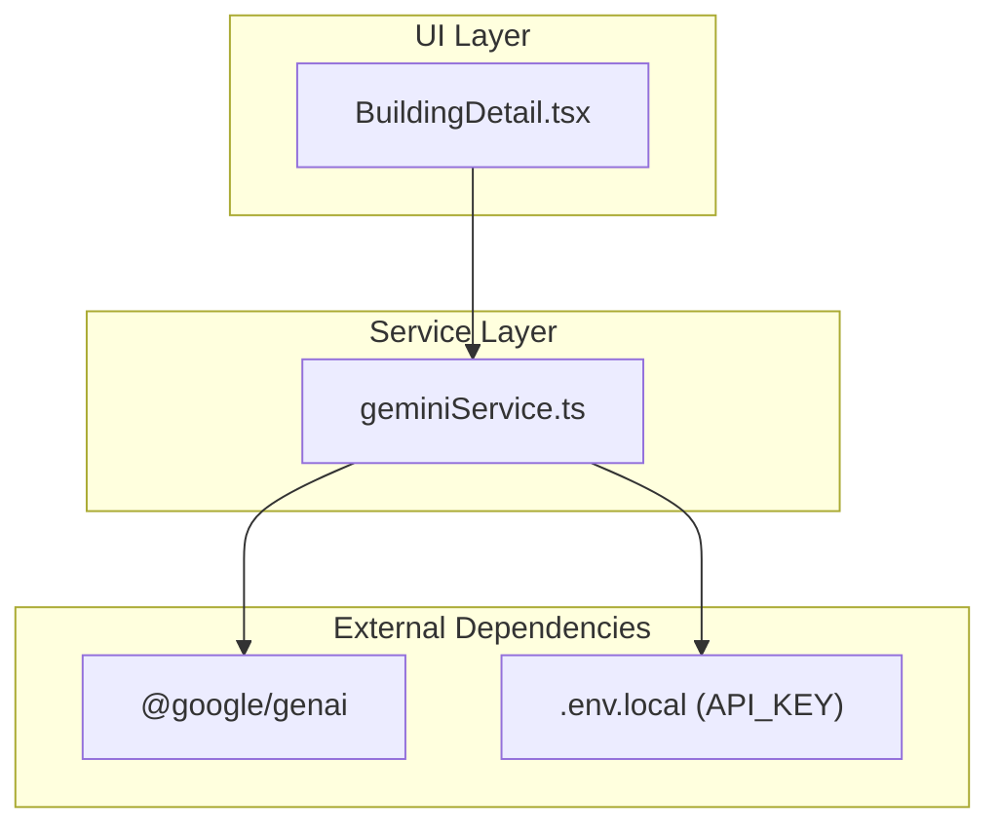
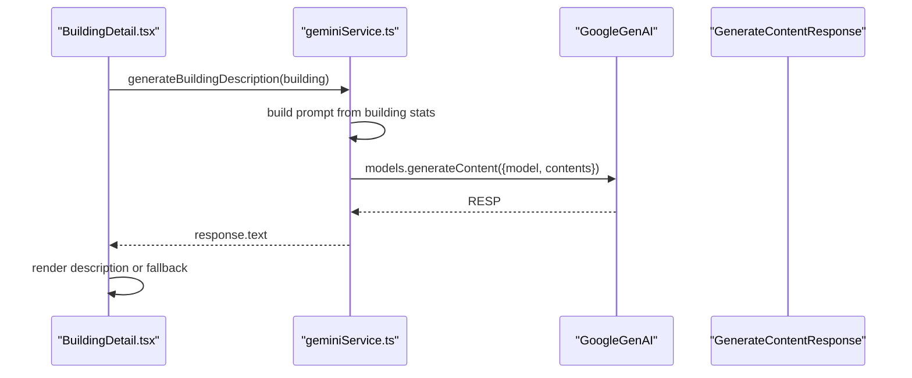
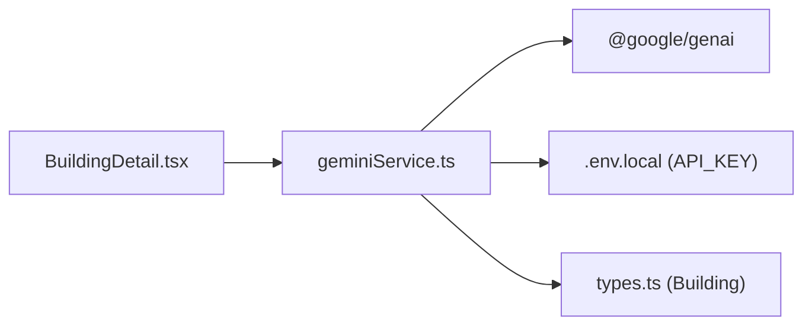

# Gemini AI API

<cite>
**Referenced Files in This Document**
- [geminiService.ts](file://services/geminiService.ts)
- [BuildingDetail.tsx](file://components/BuildingDetail.tsx)
- [types.ts](file://types.ts)
- [buildings.ts](file://data/buildings.ts)
- [README.md](file://README.md)
- [package.json](file://package.json)
- [App.tsx](file://App.tsx)
- [pocketbase.ts](file://src/pocketbase.ts)
</cite>

## Table of Contents
1. [Introduction](#introduction)
2. [Project Structure](#project-structure)
3. [Core Components](#core-components)
4. [Architecture Overview](#architecture-overview)
5. [Detailed Component Analysis](#detailed-component-analysis)
6. [Dependency Analysis](#dependency-analysis)
7. [Performance Considerations](#performance-considerations)
8. [Troubleshooting Guide](#troubleshooting-guide)
9. [Conclusion](#conclusion)

## Introduction
This document provides comprehensive API documentation for the Google Gemini AI integration used to generate in-game building descriptions. It covers content generation methods, request/response schemas, model configuration, prompt engineering patterns, method signatures, parameter validation, error handling, integration with the main game engine, and practical guidance for rate limiting, fallbacks, cost optimization, and caching strategies.

## Project Structure
The Gemini integration is implemented as a small service module that encapsulates the AI client and a single generation function. The UI component invokes this service to generate descriptions for buildings, which are then displayed in the building detail panel.

**Diagram sources**
- [BuildingDetail.tsx:46-85](file://components/BuildingDetail.tsx#L46-L85)
- [geminiService.ts:1-43](file://services/geminiService.ts#L1-L43)
- [package.json:12-20](file://package.json#L12-L20)

**Section sources**
- [geminiService.ts:1-43](file://services/geminiService.ts#L1-L43)
- [BuildingDetail.tsx:1-151](file://components/BuildingDetail.tsx#L1-L151)
- [README.md:16-20](file://README.md#L16-L20)
- [package.json:12-20](file://package.json#L12-L20)

## Core Components
- Gemini Service: Exposes a single asynchronous function to generate building descriptions using the Gemini API.
- UI Integration: The building detail component triggers generation and displays the result.
- Data Contracts: Strongly typed building data structures define the input to the generator.

Key responsibilities:
- Prompt construction from building metadata.
- Model invocation and response extraction.
- Graceful error handling and user feedback.

**Section sources**
- [geminiService.ts:12-43](file://services/geminiService.ts#L12-L43)
- [BuildingDetail.tsx:50-56](file://components/BuildingDetail.tsx#L50-L56)
- [types.ts:42-96](file://types.ts#L42-L96)

## Architecture Overview
The AI generation flow is straightforward: the UI component calls the service, which builds a prompt from the building object, sends it to the Gemini API, and returns the generated text. The UI renders the result or a localized fallback message.

**Diagram sources**
- [BuildingDetail.tsx:50-56](file://components/BuildingDetail.tsx#L50-L56)
- [geminiService.ts:12-43](file://services/geminiService.ts#L12-L43)

## Detailed Component Analysis

### Gemini Service API
- Module: services/geminiService.ts
- Function: generateBuildingDescription(building: Building): Promise<string>
- Purpose: Generate a creative, Russian-language, 2–3 sentence description for a building based on its stats and category.

Method signature and behavior:
- Parameters:
  - building: Building (from types.ts)
- Returns:
  - Promise<string> containing the generated description or a localized fallback message.
- Implementation highlights:
  - Validates presence of API key via environment variable.
  - Constructs a structured prompt using building metadata (name, category, durability, population bonus, produces/consumes, original description hint).
  - Invokes the Gemini model with a fixed model identifier.
  - Extracts the generated text from the response.
  - Catches errors and logs them, returning a user-friendly fallback.

Prompt engineering patterns:
- Clear instruction to generate a fantasy-themed, Russian description.
- Explicit length constraint (2–3 sentences).
- Structured bullet-style key stats presentation.
- Fallback hint from the original description field.
- Instruction to return only the description text.

Model configuration:
- Model: gemini-2.5-flash
- Input: contents (string prompt)

Error handling:
- Environment check for API key.
- Try/catch around model invocation.
- Console logging of errors.
- Fallback return value for UI rendering.

**Section sources**
- [geminiService.ts:12-43](file://services/geminiService.ts#L12-L43)
- [types.ts:42-96](file://types.ts#L42-L96)

### UI Integration (Building Detail)
- Module: components/BuildingDetail.tsx
- Behavior:
  - Renders building metadata and an action button to trigger AI generation.
  - Calls generateBuildingDescription(building) and displays the returned text.
  - Shows a loading state during generation.
  - Displays a localized fallback message if generation fails.

Integration points:
- Imports the generateBuildingDescription function from the service.
- Uses the Building type for type safety.
- Integrates with the broader game UI and state management.

**Section sources**
- [BuildingDetail.tsx:46-85](file://components/BuildingDetail.tsx#L46-L85)
- [types.ts:42-96](file://types.ts#L42-L96)

### Data Contracts
- Building interface (types.ts):
  - Fields include id, name, category, stats (durability, populationBonus, produces, consumes, etc.), constructionRequirements, drops, destructionInfo, description, imageUrl, and more.
- Buildings dataset (data/buildings.ts):
  - Provides concrete building entries used by the UI and service.

Usage in AI generation:
- The service composes a prompt using fields from the Building object, ensuring the generator has sufficient context for rich descriptions.

**Section sources**
- [types.ts:42-96](file://types.ts#L42-L96)
- [buildings.ts:4-100](file://data/buildings.ts#L4-L100)

### Request/Response Schemas

- Request
  - Model: gemini-2.5-flash
  - Input: contents (string)
  - Example payload shape:
    - model: "gemini-2.5-flash"
    - contents: "<prompt string>"
- Response
  - Output: text (string)
  - Example response shape:
    - text: "<generated description>"

Notes:
- The service does not expose raw request/response objects; it returns a single string (the generated text).
- The prompt is constructed programmatically from the Building object.

**Section sources**
- [geminiService.ts:33-38](file://services/geminiService.ts#L33-L38)

### Parameter Validation and Error Handling Strategies
- API key validation:
  - The service checks for the presence of the API key environment variable and returns a fallback message if missing.
- Runtime error handling:
  - Try/catch around the model invocation.
  - Console error logging for diagnostics.
  - Fallback return value for UI resilience.
- UI-level safeguards:
  - Loading state prevents repeated clicks.
  - Fallback message displayed if generation fails.

**Section sources**
- [geminiService.ts:13-15](file://services/geminiService.ts#L13-L15)
- [geminiService.ts:39-42](file://services/geminiService.ts#L39-L42)
- [BuildingDetail.tsx:72-79](file://components/BuildingDetail.tsx#L72-L79)

### Integration Patterns with the Main Game Engine
- Data sourcing:
  - The building detail panel receives a Building object from the game’s state/data pipeline.
- Generation trigger:
  - Clicking the “Generate with Gemini” button initiates the service call.
- Rendering:
  - The generated description replaces or augments the static description in the UI.
- Persistence and synchronization:
  - While the AI generation itself is client-side, the game engine manages building data and UI state via Firestore/PocketBase. The AI description is ephemeral UI content and not persisted.

Note: The main game loop and Firestore integrations are handled elsewhere in the codebase and are not part of the AI generation flow.

**Section sources**
- [BuildingDetail.tsx:50-56](file://components/BuildingDetail.tsx#L50-L56)
- [App.tsx:1-200](file://App.tsx#L1-L200)

### Examples of Successful API Usage
- Triggering generation:
  - User clicks the “Generate with Gemini” button in the building detail panel.
  - The service constructs a prompt from the building’s stats and category.
  - The Gemini model returns a description string.
  - The UI displays the description.
- Expected prompt characteristics:
  - Includes building name, category, durability, population bonus, production/consumption details, and an optional original description hint.

**Section sources**
- [BuildingDetail.tsx:50-56](file://components/BuildingDetail.tsx#L50-L56)
- [geminiService.ts:17-31](file://services/geminiService.ts#L17-L31)

### Rate Limiting Considerations
- The service does not implement client-side rate limiting.
- Recommendations:
  - Enforce a per-user cooldown in the UI (e.g., disable the button for N seconds after a request).
  - Debounce rapid successive clicks.
  - Batch requests if multiple generations are needed.
  - Monitor API quotas and surface quota warnings to users.

[No sources needed since this section provides general guidance]

### Fallback Mechanisms for API Failures
- Service-level fallback:
  - Returns a localized fallback message when the API key is missing or when an error occurs.
- UI-level fallback:
  - Displays the fallback message and disables the generation button until retry.

**Section sources**
- [geminiService.ts:13-15](file://services/geminiService.ts#L13-L15)
- [geminiService.ts:39-42](file://services/geminiService.ts#L39-L42)
- [BuildingDetail.tsx:72-79](file://components/BuildingDetail.tsx#L72-L79)

### Cost Optimization and Caching Strategies for AI Content
- Caching:
  - Cache generated descriptions keyed by building id and a hash of the building’s stats to avoid redundant calls.
- Cost control:
  - Limit the number of generations per session.
  - Use smaller, cheaper models for simpler prompts if available.
- Efficiency:
  - Defer generation until the user explicitly requests it (as implemented).
  - Avoid regenerating when the building has not changed.

[No sources needed since this section provides general guidance]

## Dependency Analysis
The Gemini integration depends on:
- @google/genai for model invocation.
- Environment configuration for the API key.
- The Building type for input data.

**Diagram sources**
- [BuildingDetail.tsx:46-85](file://components/BuildingDetail.tsx#L46-L85)
- [geminiService.ts:1-43](file://services/geminiService.ts#L1-L43)
- [types.ts:42-96](file://types.ts#L42-L96)
- [package.json:12-20](file://package.json#L12-L20)

**Section sources**
- [package.json:12-20](file://package.json#L12-L20)
- [geminiService.ts:1-43](file://services/geminiService.ts#L1-L43)
- [types.ts:42-96](file://types.ts#L42-L96)

## Performance Considerations
- Network latency:
  - Gemini calls are asynchronous; ensure the UI remains responsive with loading states.
- Prompt size:
  - Keep prompts concise while including essential stats to reduce token usage and latency.
- Caching:
  - Implement a cache keyed by building id and stat hash to minimize repeated calls.

[No sources needed since this section provides general guidance]

## Troubleshooting Guide
Common issues and resolutions:
- API key not configured:
  - Ensure GEMINI_API_KEY is present in .env.local.
  - The service returns a fallback message when the key is missing.
- API errors:
  - The service catches exceptions and logs them; the UI displays a fallback message.
  - Check PocketBase health and Firestore permissions if related errors occur.
- UI not updating:
  - Verify that the button click handler invokes the service and updates state.

**Section sources**
- [geminiService.ts:4-8](file://services/geminiService.ts#L4-L8)
- [geminiService.ts:39-42](file://services/geminiService.ts#L39-L42)
- [pocketbase.ts:799-816](file://src/pocketbase.ts#L799-L816)

## Conclusion
The Gemini AI integration is a focused, client-side enhancement that enriches the game’s building descriptions. It leverages a simple, robust service with clear error handling and integrates seamlessly with the UI. By implementing caching, rate limiting, and thoughtful prompt engineering, developers can optimize costs and improve responsiveness while maintaining a delightful user experience.