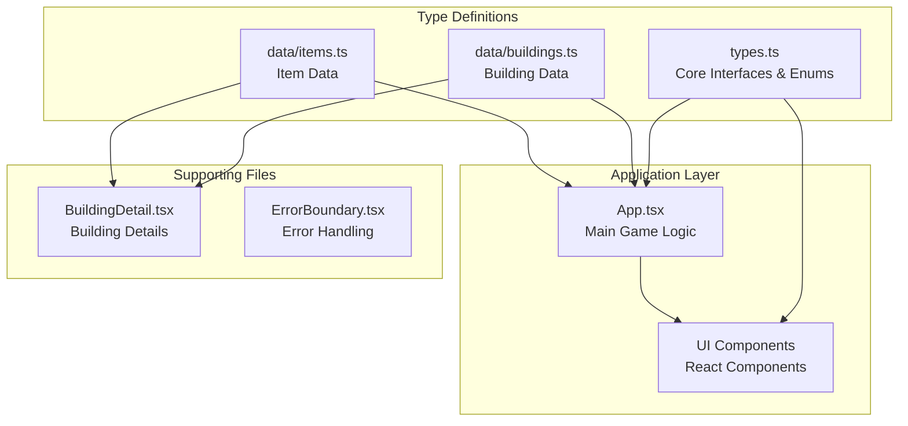
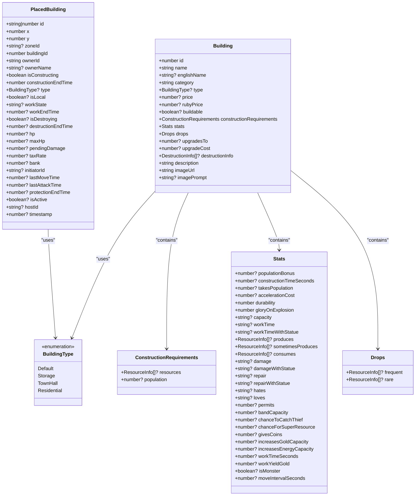
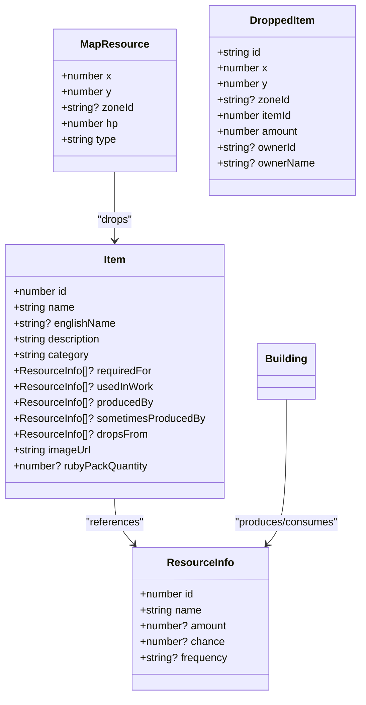
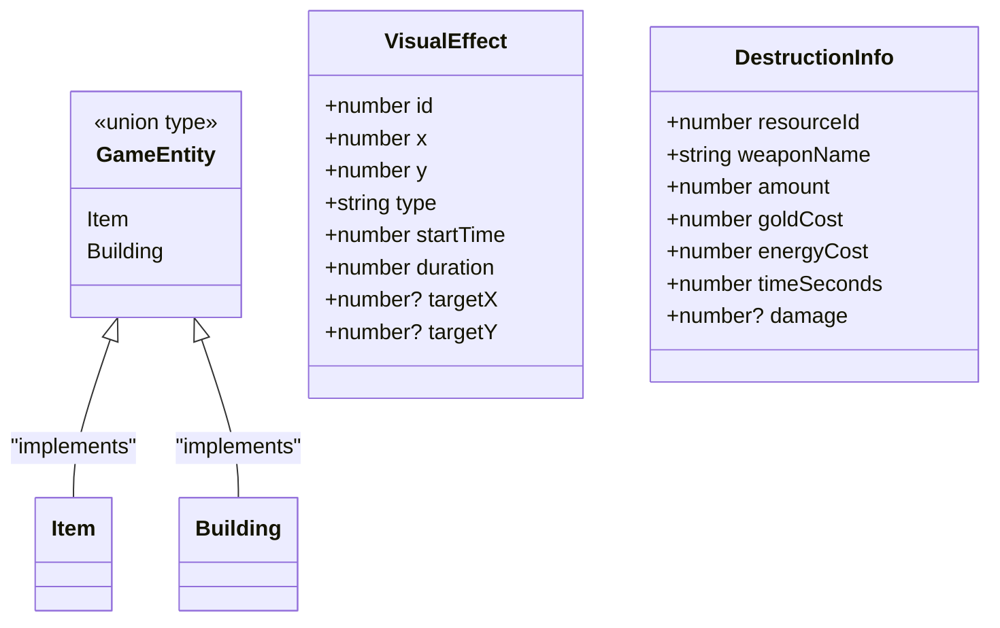
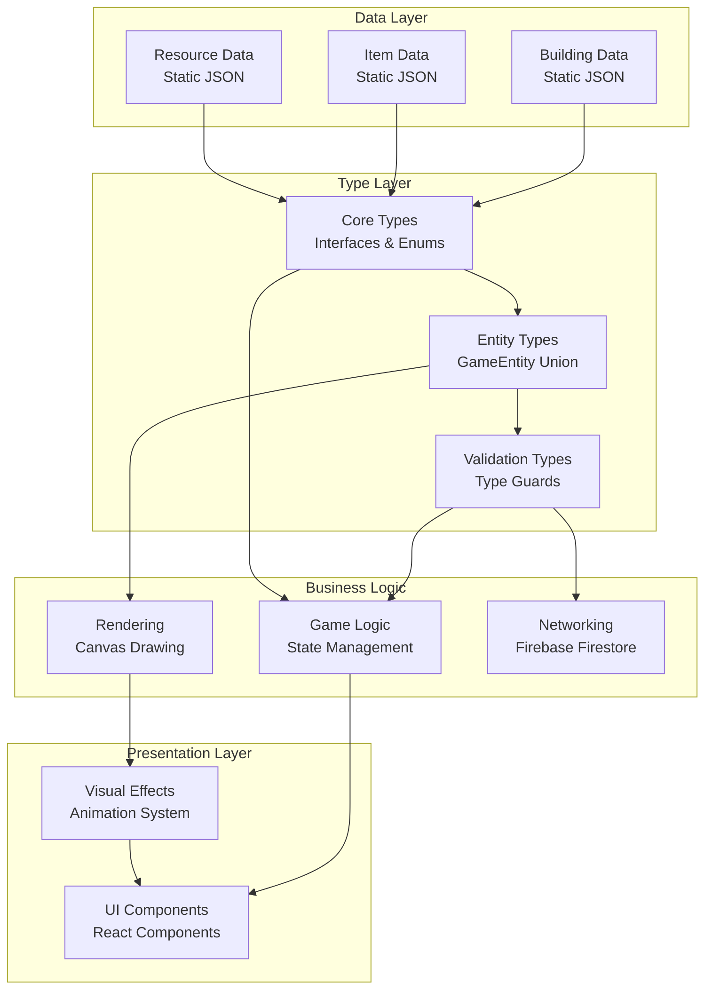
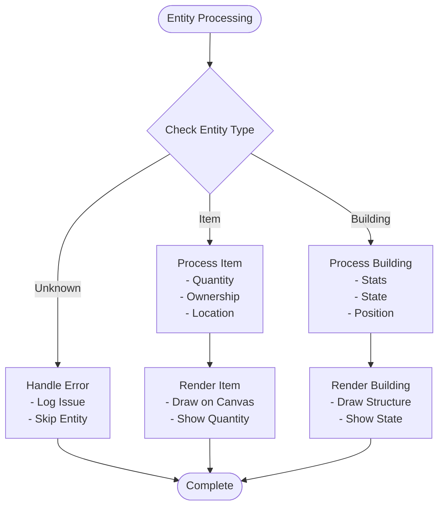
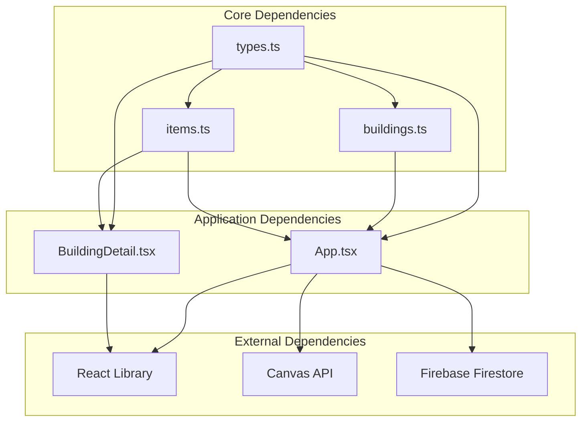

# Type Definitions

<cite>
**Referenced Files in This Document**
- [types.ts](file://types.ts)
- [buildings.ts](file://data/buildings.ts)
- [items.ts](file://data/items.ts)
- [App.tsx](file://App.tsx)
- [BuildingDetail.tsx](file://components/BuildingDetail.tsx)
</cite>

## Table of Contents
1. [Introduction](#introduction)
2. [Project Structure](#project-structure)
3. [Core Components](#core-components)
4. [Architecture Overview](#architecture-overview)
5. [Detailed Component Analysis](#detailed-component-analysis)
6. [Dependency Analysis](#dependency-analysis)
7. [Performance Considerations](#performance-considerations)
8. [Troubleshooting Guide](#troubleshooting-guide)
9. [Conclusion](#conclusion)

## Introduction

This document provides comprehensive documentation for all TypeScript type definitions and interfaces used throughout the game application. The codebase implements a real-time strategy game with extensive building systems, resource management, and multiplayer functionality. The type system ensures type safety across the entire application, from game entities to UI components.

The type definitions cover core game mechanics including building construction, resource extraction, combat systems, and player interactions. The interfaces are designed to support both client-side rendering and server-side persistence while maintaining strict type safety.

## Project Structure

The type definitions are organized across several key files:



**Diagram sources**
- [types.ts:1-197](file://types.ts#L1-L197)
- [buildings.ts:1-800](file://data/buildings.ts#L1-L800)
- [items.ts:1-415](file://data/items.ts#L1-L415)

**Section sources**
- [types.ts:1-197](file://types.ts#L1-L197)
- [buildings.ts:1-800](file://data/buildings.ts#L1-L800)
- [items.ts:1-415](file://data/items.ts#L1-L415)

## Core Components

### Building System Types

The building system consists of several interconnected interfaces that define the complete building lifecycle and capabilities:



**Diagram sources**
- [types.ts:35-96](file://types.ts#L35-L96)
- [types.ts:119-147](file://types.ts#L119-L147)

### Resource Management Types

The resource system provides comprehensive tracking of game resources and their relationships:



**Diagram sources**
- [types.ts:2-117](file://types.ts#L2-L117)

### Entity System

The game employs a union type system for handling different entity types uniformly:



**Diagram sources**
- [types.ts:98-158](file://types.ts#L98-L158)

**Section sources**
- [types.ts:2-158](file://types.ts#L2-L158)

## Architecture Overview

The type system follows a layered architecture pattern that separates concerns between data models, business logic, and presentation:



**Diagram sources**
- [types.ts:1-197](file://types.ts#L1-L197)
- [buildings.ts:1-800](file://data/buildings.ts#L1-L800)
- [items.ts:1-415](file://data/items.ts#L1-L415)

## Detailed Component Analysis

### Building Interface Analysis

The Building interface serves as the foundation for all constructible structures in the game:

**Key Properties:**
- **Identification**: Unique numeric ID, localized and English names, category classification
- **Construction**: Price in coins or rubies, buildable flag, construction requirements
- **Statistics**: Comprehensive stat tracking including population bonuses, construction times, durability
- **Production**: Resource production and consumption capabilities
- **Drops**: Loot tables for building destruction
- **Upgrade Path**: Hierarchical building progression system

**Construction Requirements Pattern:**
```typescript
constructionRequirements: {
  resources?: ResourceInfo[];
  population?: number;
}
```

**Stats Complexity Analysis:**
The stats object contains over 20 different properties covering:
- Population management (populationBonus, takesPopulation)
- Economic metrics (constructionTimeSeconds, accelerationCost, givesCoins)
- Military capabilities (damage, repair, permits)
- Resource management (capacity, workTimeSeconds, workYieldGold)

**Section sources**
- [types.ts:42-96](file://types.ts#L42-L96)
- [buildings.ts:4-87](file://data/buildings.ts#L4-L87)

### PlacedBuilding Interface Analysis

The PlacedBuilding interface extends Building with runtime state information:

**Runtime State Management:**
- **Positioning**: X, Y coordinates with zone identification
- **Ownership**: Owner ID and name tracking
- **Construction State**: Construction progress and completion timestamps
- **Work State**: Production cycle management (idle, working, finished)
- **Combat State**: Health tracking, pending damage, destruction timers
- **Economic State**: Tax rates, gold storage, initiative tracking

**Type Safety Patterns:**
The interface uses optional properties extensively to handle different construction phases and states, ensuring type safety across all game scenarios.

**Section sources**
- [types.ts:119-147](file://types.ts#L119-L147)

### Item Interface Analysis

The Item interface defines game resources and materials:

**Resource Classification:**
- **Production Chain**: Tracks requiredFor, usedInWork, producedBy, sometimesProducedBy, dropsFrom relationships
- **Economic Value**: Ruby pack quantities for premium currency purchases
- **Visual Assets**: Image URLs for resource representation

**Relationship Modeling:**
The ResourceInfo references create a comprehensive graph of resource dependencies and production chains, enabling complex economic simulations.

**Section sources**
- [types.ts:10-23](file://types.ts#L10-L23)
- [items.ts:4-414](file://data/items.ts#L4-L414)

### MapResource and DroppedItem Analysis

**MapResource Interface:**
- **Extraction Mechanics**: Tree, oil, chest, and quarry resource types
- **Durability Tracking**: HP values indicating resource depletion
- **Spatial Organization**: Zone-based positioning for efficient rendering

**DroppedItem Interface:**
- **Temporary Ownership**: Owner ID and name for item claiming mechanics
- **Spatial Positioning**: Coordinate tracking with zone identification
- **Quantity Management**: Stack size tracking for resource accumulation

**Section sources**
- [types.ts:111-117](file://types.ts#L111-L117)
- [types.ts:100-109](file://types.ts#L100-L109)

### GameEntity Union Type Analysis

The GameEntity union type enables polymorphic handling of different game objects:



**Diagram sources**
- [types.ts:98](file://types.ts#L98)

**Type Guard Implementation:**
The application uses property existence checks as type guards:
- `'buildingId' in entity` for PlacedBuilding detection
- `'itemId' in entity` for DroppedItem detection
- `entity.entityType === 'building'` for entity categorization

**Section sources**
- [types.ts:98-117](file://types.ts#L98-L117)
- [App.tsx:2873](file://App.tsx#L2873)

### VisualEffect System

The VisualEffect interface supports dynamic game animations:

**Effect Types:**
- **Upgrade**: Golden ring animation for building upgrades
- **Explosion**: Fireball effect for destruction
- **Shot**: Projectile trail with targeting
- **Flash**: Diamond-shaped flash for various events

**Animation Lifecycle:**
- **Timing**: startTime and duration properties
- **Targeting**: Optional target coordinates for projectile effects
- **Progress Calculation**: Normalized progress for smooth animations

**Section sources**
- [types.ts:149-158](file://types.ts#L149-L158)

## Dependency Analysis

The type system exhibits strong modularity with clear dependency relationships:



**Diagram sources**
- [types.ts:1-197](file://types.ts#L1-L197)
- [App.tsx:23](file://App.tsx#L23)
- [BuildingDetail.tsx:3](file://components/BuildingDetail.tsx#L3)

**Type Safety Dependencies:**
- **BuildingType Enum**: Centralized type validation across all building operations
- **ResourceInfo References**: Consistent resource relationship modeling
- **Optional Properties**: Graceful handling of incomplete construction states
- **Union Types**: Polymorphic entity handling with compile-time safety

**Section sources**
- [types.ts:1-197](file://types.ts#L1-L197)
- [App.tsx:23](file://App.tsx#L23)

## Performance Considerations

### Type-Level Optimizations

**Interface Design Benefits:**
- **Compile-time Validation**: All type errors caught during development
- **IDE Support**: Enhanced IntelliSense and auto-completion
- **Refactoring Safety**: Type-safe refactoring across the entire codebase

**Memory Efficiency:**
- **Optional Properties**: Reduced memory footprint for incomplete objects
- **Shared References**: ResourceInfo objects shared across multiple entities
- **Primitive Types**: Minimal overhead with basic number and string types

### Runtime Performance Patterns

**Type Guard Optimization:**
The application uses efficient property existence checks as type guards, avoiding expensive runtime type checking while maintaining safety.

**State Management:**
- **Immutable Updates**: Type-safe state updates prevent accidental mutations
- **Selective Rendering**: Type information enables efficient conditional rendering

## Troubleshooting Guide

### Common Type Issues

**Missing Property Errors:**
- Verify ResourceInfo arrays are properly initialized
- Check optional properties are handled with null checks
- Ensure enum values match expected string literals

**Type Assertion Patterns:**
```typescript
// Safe type assertions
const building = entity as Building;
const item = entity as Item;

// Property-based type guards
if ('buildingId' in entity) {
    // Type-safe PlacedBuilding access
}

if ('itemId' in entity) {
    // Type-safe DroppedItem access
}
```

**Validation Strategies:**
- Use optional chaining for potentially undefined properties
- Implement defensive programming with type guards
- Leverage TypeScript's strict mode for comprehensive error detection

**Section sources**
- [types.ts:98-117](file://types.ts#L98-L117)
- [App.tsx:2873](file://App.tsx#L2873)

## Conclusion

The TypeScript type system in this application demonstrates comprehensive type safety implementation across multiple game systems. The carefully designed interfaces and enums provide:

**Strengths:**
- Complete coverage of game mechanics from resource management to building systems
- Strong type safety with minimal runtime overhead
- Extensible architecture supporting future feature additions
- Clear separation of concerns between data models and business logic

**Implementation Excellence:**
- Thoughtful use of union types for polymorphic entity handling
- Comprehensive optional property design for flexible state management
- Well-structured enum usage for categorical data
- Efficient type guard patterns for runtime type checking

The type definitions serve as both documentation and contract enforcement, ensuring reliable game behavior while maintaining developer productivity through comprehensive IDE support and compile-time error detection.