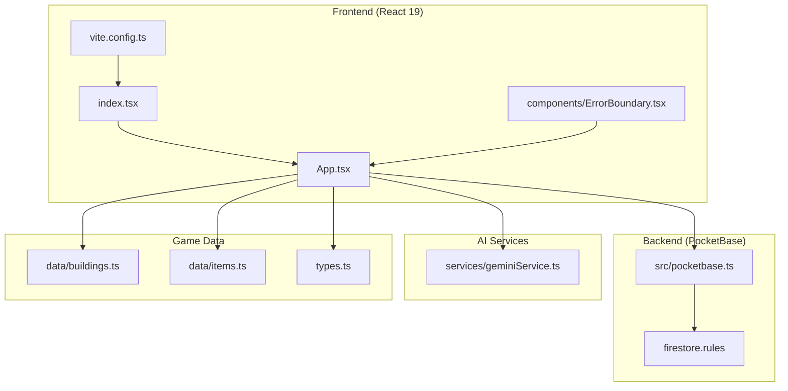
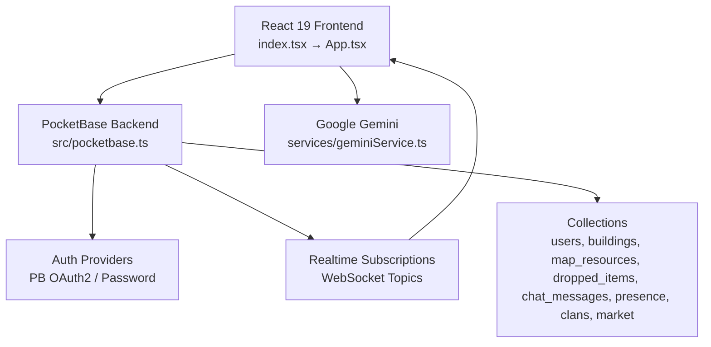
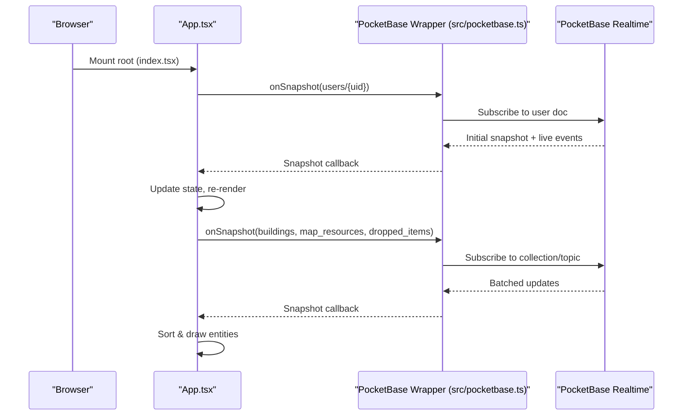
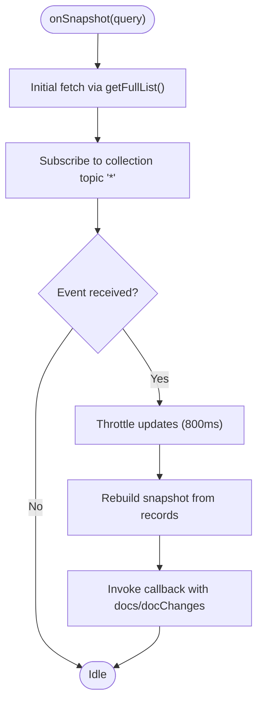
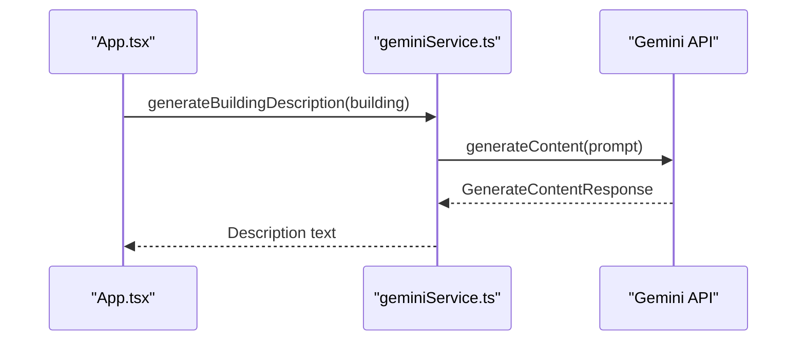
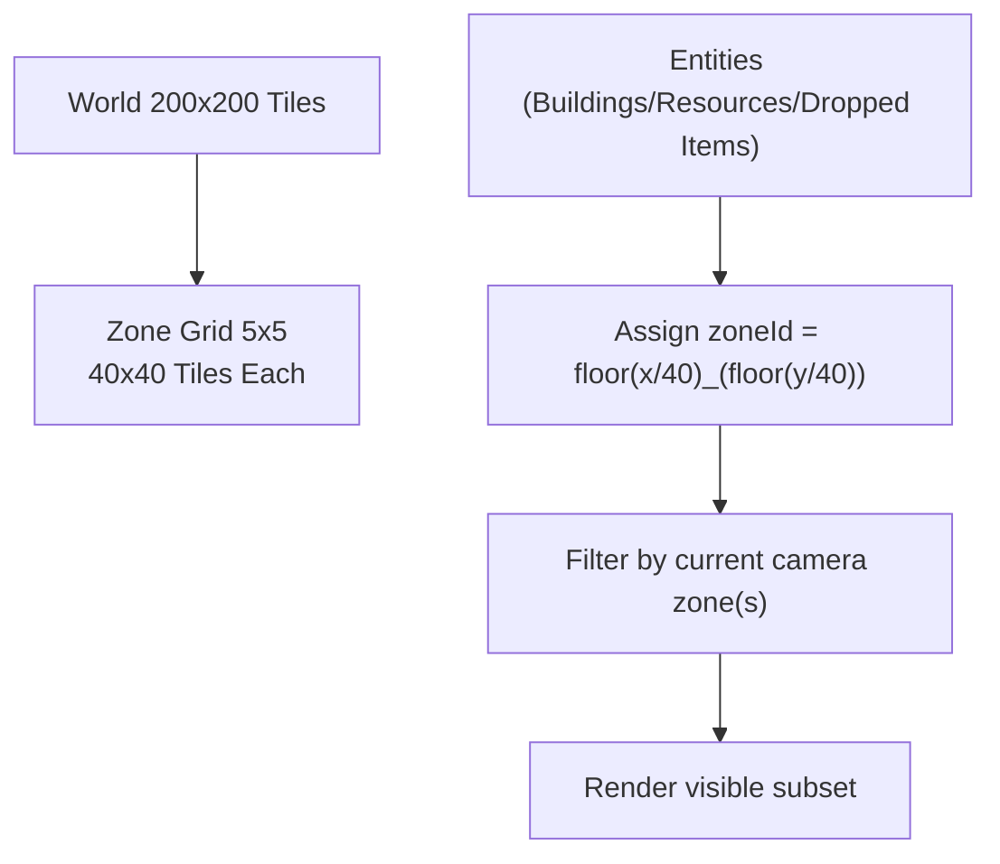
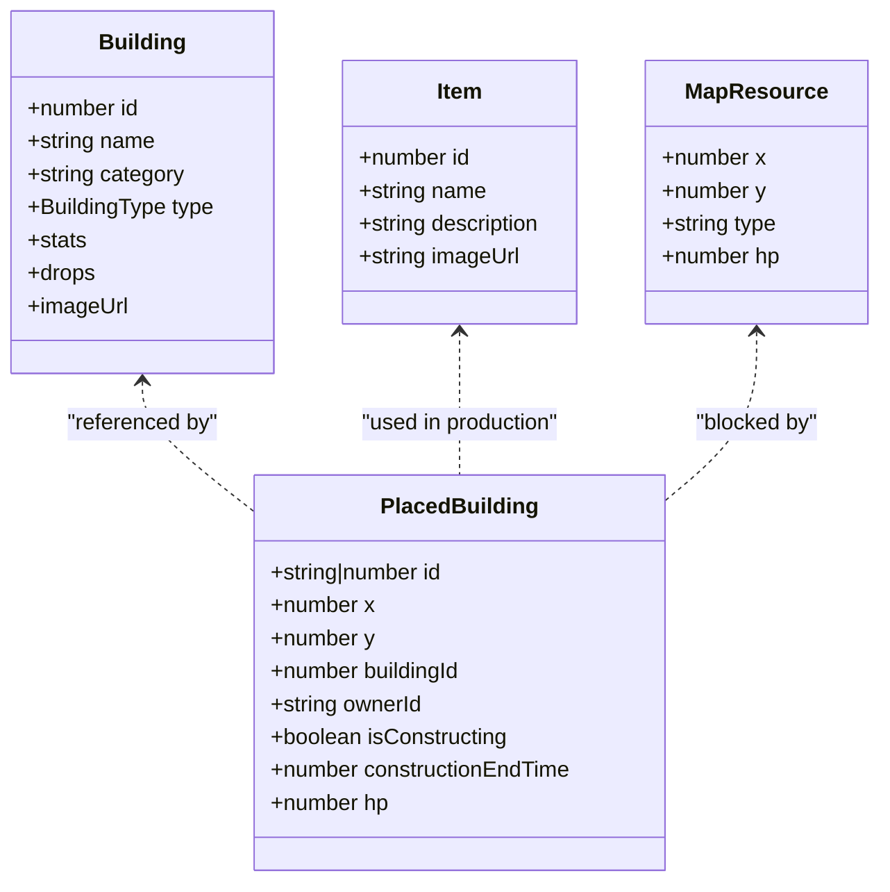
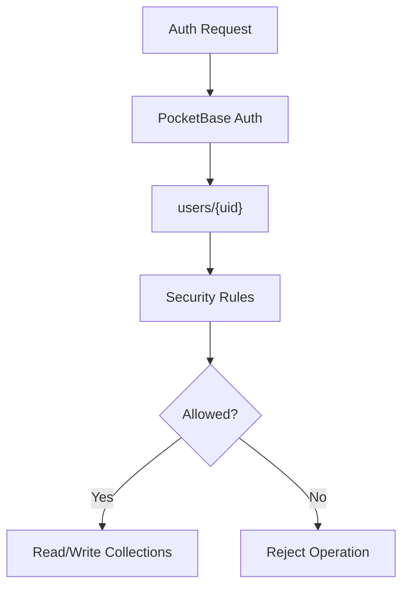
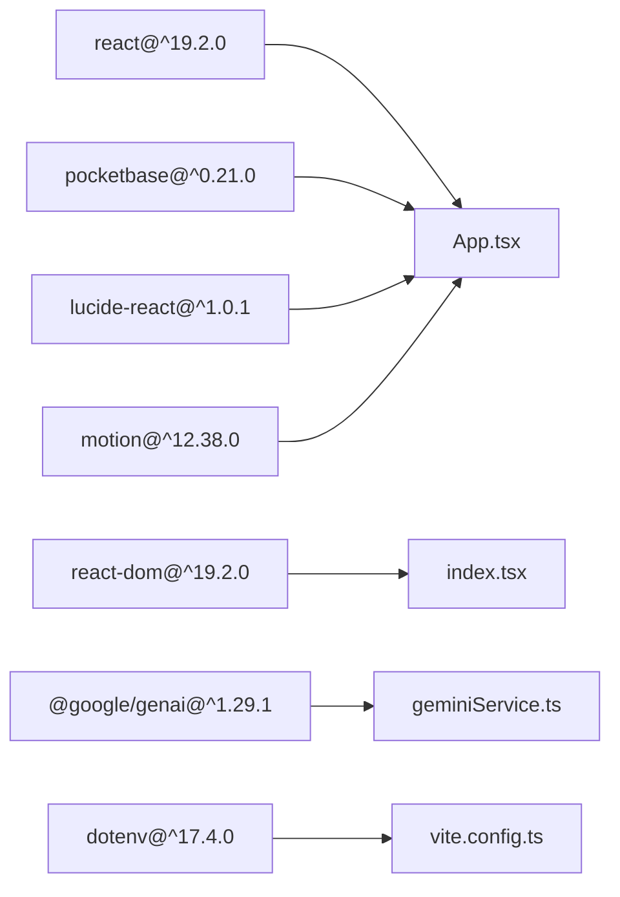

# Architecture Overview

<cite>
**Referenced Files in This Document**
- [package.json](file://package.json)
- [index.html](file://index.html)
- [index.tsx](file://index.tsx)
- [App.tsx](file://App.tsx)
- [src/pocketbase.ts](file://src/pocketbase.ts)
- [services/geminiService.ts](file://services/geminiService.ts)
- [types.ts](file://types.ts)
- [data/buildings.ts](file://data/buildings.ts)
- [data/items.ts](file://data/items.ts)
- [vite.config.ts](file://vite.config.ts)
- [README.md](file://README.md)
- [components/ErrorBoundary.tsx](file://components/ErrorBoundary.tsx)
- [migrate_zones_80.mjs](file://migrate_zones_80.mjs)
- [firestore.rules](file://firestore.rules)
</cite>

## Table of Contents
1. [Introduction](#introduction)
2. [Project Structure](#project-structure)
3. [Core Components](#core-components)
4. [Architecture Overview](#architecture-overview)
5. [Detailed Component Analysis](#detailed-component-analysis)
6. [Dependency Analysis](#dependency-analysis)
7. [Performance Considerations](#performance-considerations)
8. [Troubleshooting Guide](#troubleshooting-guide)
9. [Conclusion](#conclusion)
10. [Appendices](#appendices)

## Introduction
This document describes the Basingsemmorpg system architecture, focusing on the integration between a React 19 frontend, a PocketBase backend, and Google Gemini AI services. It explains how the isometric game engine, building system, and resource management components interact, along with real-time synchronization via PocketBase’s WebSocket-based subscriptions. Cross-cutting concerns such as authentication, authorization, and real-time state management are covered, alongside infrastructure requirements, scalability considerations, and deployment topology.

## Project Structure
The project is a Vite/React 19 single-page application that renders an isometric city-builder game. Data is synchronized in real time with PocketBase, and AI-assisted content generation is integrated via Google Gemini.

**Diagram sources**
- [index.tsx:1-20](file://index.tsx#L1-L20)
- [App.tsx:1-8217](file://App.tsx#L1-L8217)
- [src/pocketbase.ts:1-825](file://src/pocketbase.ts#L1-L825)
- [services/geminiService.ts:1-43](file://services/geminiService.ts#L1-L43)
- [data/buildings.ts:1-800](file://data/buildings.ts#L1-L800)
- [data/items.ts:1-415](file://data/items.ts#L1-L415)
- [types.ts:1-197](file://types.ts#L1-L197)
- [vite.config.ts:1-29](file://vite.config.ts#L1-L29)
- [firestore.rules:246-262](file://firestore.rules#L246-L262)

**Section sources**
- [index.html:1-15](file://index.html#L1-L15)
- [index.tsx:1-20](file://index.tsx#L1-L20)
- [vite.config.ts:1-29](file://vite.config.ts#L1-L29)

## Core Components
- React 19 Frontend
  - Root initialization and strict mode with error boundary wrapping.
  - Central game logic in App.tsx orchestrating rendering, state, and real-time subscriptions.
- PocketBase Backend
  - Authentication and Firestore-compatible wrappers for collections, queries, and real-time subscriptions.
  - Zone-based partitioning for performance and efficient data fetching.
- Google Gemini AI
  - Content generation service for building descriptions.
- Game Data Models
  - Strongly typed models for buildings, items, map resources, and game entities.

**Section sources**
- [index.tsx:1-20](file://index.tsx#L1-L20)
- [App.tsx:1-800](file://App.tsx#L1-L800)
- [src/pocketbase.ts:1-825](file://src/pocketbase.ts#L1-L825)
- [services/geminiService.ts:1-43](file://services/geminiService.ts#L1-L43)
- [types.ts:1-197](file://types.ts#L1-L197)

## Architecture Overview
The system follows a reactive, event-driven architecture:
- React 19 renders the isometric world and UI, driven by real-time state from PocketBase.
- PocketBase provides:
  - Authentication (password and OAuth providers).
  - Real-time subscriptions via WebSocket topics.
  - Schema-normalized storage with a JSON “data” field for arbitrary game data.
- Google Gemini integrates for AI-assisted content generation.

**Diagram sources**
- [index.tsx:1-20](file://index.tsx#L1-L20)
- [App.tsx:1-800](file://App.tsx#L1-L800)
- [src/pocketbase.ts:1-825](file://src/pocketbase.ts#L1-L825)
- [services/geminiService.ts:1-43](file://services/geminiService.ts#L1-L43)

## Detailed Component Analysis

### React 19 Frontend and Game Engine
- Rendering pipeline
  - Root mounts App inside a strict mode and error boundary wrapper.
  - App.tsx manages camera, zoom, isometric projection, and drawing loop.
- Real-time state
  - Uses onSnapshot wrappers to subscribe to collections and documents.
  - Throttles camera-based zone updates to reduce subscription churn.
- UI and gameplay
  - Building placement, resource harvesting, combat mechanics, chat, clans, market, and social features.
  - Zone-based partitioning for efficient rendering and data fetching.

**Diagram sources**
- [index.tsx:1-20](file://index.tsx#L1-L20)
- [App.tsx:1-800](file://App.tsx#L1-L800)
- [src/pocketbase.ts:571-707](file://src/pocketbase.ts#L571-L707)

**Section sources**
- [index.tsx:1-20](file://index.tsx#L1-L20)
- [App.tsx:1-800](file://App.tsx#L1-L800)
- [src/pocketbase.ts:571-707](file://src/pocketbase.ts#L571-L707)

### PocketBase Backend and Real-Time Synchronization
- Authentication
  - Email/password and OAuth2 providers mapped to PocketBase auth store.
  - User documents normalized for compatibility with Firebase-like APIs.
- Data access layer
  - Firestore-compatible helpers for doc/collection, getDoc/getDocs, setDoc/updateDoc/deleteDoc.
  - Query builder supports where, orderBy, limit, array-contains, and in filters.
- Real-time subscriptions
  - onSnapshot wraps PocketBase collection subscriptions with initial fetch and throttled updates.
  - Automatic retry on stale client ID errors.
- Data normalization
  - Known fields persisted at top-level; arbitrary game data moved into a JSON “data” field.
  - Sanitization of IDs to 15-character alphanumeric identifiers.

**Diagram sources**
- [src/pocketbase.ts:571-707](file://src/pocketbase.ts#L571-L707)

**Section sources**
- [src/pocketbase.ts:1-825](file://src/pocketbase.ts#L1-L825)

### Google Gemini AI Integration
- Purpose
  - Generate localized, themed descriptions for buildings using a structured prompt.
- Integration
  - Environment variable API key required.
  - Service returns a text description or a fallback message if the key is missing.

**Diagram sources**
- [services/geminiService.ts:1-43](file://services/geminiService.ts#L1-L43)

**Section sources**
- [services/geminiService.ts:1-43](file://services/geminiService.ts#L1-L43)

### Zone-Based Data Partitioning and Performance
- Zone grid
  - World divided into 40x40 tile zones (5x5 grid for 200x200 world).
  - Entities carry a zoneId for efficient filtering and rendering.
- Migration tool
  - Script to compute and update zoneId for existing collections.
- Rendering optimizations
  - Visibility checks and reduced draw loops based on camera and zoom.
  - Sorting optimizations to minimize overdraw.

**Diagram sources**
- [App.tsx:43-46](file://App.tsx#L43-L46)
- [migrate_zones_80.mjs:1-58](file://migrate_zones_80.mjs#L1-L58)

**Section sources**
- [App.tsx:43-46](file://App.tsx#L43-L46)
- [migrate_zones_80.mjs:1-58](file://migrate_zones_80.mjs#L1-L58)

### Data Models and Game Entities
- Strong typing for buildings, items, map resources, and game entities.
- Examples include building categories, stats, drops, and destruction info.

**Diagram sources**
- [types.ts:42-96](file://types.ts#L42-L96)
- [types.ts:100-147](file://types.ts#L100-L147)
- [types.ts:111-117](file://types.ts#L111-L117)

**Section sources**
- [types.ts:1-197](file://types.ts#L1-L197)
- [data/buildings.ts:1-800](file://data/buildings.ts#L1-L800)
- [data/items.ts:1-415](file://data/items.ts#L1-L415)

### Authentication, Authorization, and Security
- Authentication
  - Email/password and OAuth2 via PocketBase.
  - User object normalized for compatibility.
- Authorization
  - Firestore security rules enforce ownership, admin-only deletes, and selective field updates.
  - Bans and curses are enforced via server-side rules and client checks.

**Diagram sources**
- [src/pocketbase.ts:13-121](file://src/pocketbase.ts#L13-L121)
- [firestore.rules:246-262](file://firestore.rules#L246-L262)

**Section sources**
- [src/pocketbase.ts:13-121](file://src/pocketbase.ts#L13-L121)
- [firestore.rules:246-262](file://firestore.rules#L246-L262)

## Dependency Analysis
- Frontend dependencies
  - React 19, React DOM, PocketBase client, Lucide icons, Motion for animations, dotenv for environment.
- Dev and build
  - Vite, React plugin, TypeScript, Tailwind CDN in HTML.
- AI
  - @google/genai SDK for Gemini.

**Diagram sources**
- [package.json:12-29](file://package.json#L12-L29)
- [vite.config.ts:1-29](file://vite.config.ts#L1-L29)

**Section sources**
- [package.json:1-31](file://package.json#L1-L31)
- [vite.config.ts:1-29](file://vite.config.ts#L1-L29)

## Performance Considerations
- Zone-based partitioning reduces query and render scope.
- Throttled realtime updates (800 ms) balance freshness and throughput.
- Camera-based visibility checks and optimized draw loops improve frame rates.
- Sanitized 15-character IDs ensure consistent indexing and minimal overhead.
- Batched deletions and controlled subscription staggering mitigate backend storms.

[No sources needed since this section provides general guidance]

## Troubleshooting Guide
- Error boundary
  - Catches uncaught errors and displays a resettable UI with parsed error details.
- PocketBase error handling
  - Centralized handler logs operation type, path, and error messages.
- Common issues
  - Stale client ID during realtime subscriptions triggers automatic retries.
  - Missing API key for Gemini returns a graceful fallback message.

**Section sources**
- [components/ErrorBoundary.tsx:1-78](file://components/ErrorBoundary.tsx#L1-L78)
- [src/pocketbase.ts:787-800](file://src/pocketbase.ts#L787-L800)
- [services/geminiService.ts:4-8](file://services/geminiService.ts#L4-L8)

## Conclusion
The Basingsemmorpg architecture combines a modern React 19 frontend with PocketBase’s real-time capabilities and Google Gemini for AI-assisted content. Zone-based partitioning, robust error handling, and a normalized data model enable scalable multiplayer gameplay. Security is enforced via PocketBase rules, while the UI remains responsive through throttled updates and optimized rendering.

[No sources needed since this section summarizes without analyzing specific files]

## Appendices

### Technology Stack and Compatibility
- Frontend
  - React 19, React DOM, TypeScript, Vite, Tailwind (via CDN in HTML).
- Backend
  - PocketBase 0.21.x with Firestore-compatible API.
- AI
  - Google GenAI SDK.
- Environment
  - Vite defines API keys for Gemini at build time.

**Section sources**
- [package.json:12-29](file://package.json#L12-L29)
- [vite.config.ts:13-16](file://vite.config.ts#L13-L16)
- [README.md:16-20](file://README.md#L16-L20)

### Infrastructure and Deployment Topology
- Local development
  - Vite dev server on port 3000, host 0.0.0.0.
  - PocketBase endpoint configured in the PocketBase wrapper.
- Production
  - Host Vite-built assets behind a reverse proxy.
  - Deploy PocketBase on a reachable host with TLS termination and firewall rules.
  - Configure environment variables for Gemini API key and PocketBase admin credentials.

**Section sources**
- [vite.config.ts:8-11](file://vite.config.ts#L8-L11)
- [src/pocketbase.ts:8](file://src/pocketbase.ts#L8)
- [README.md:16-20](file://README.md#L16-L20)