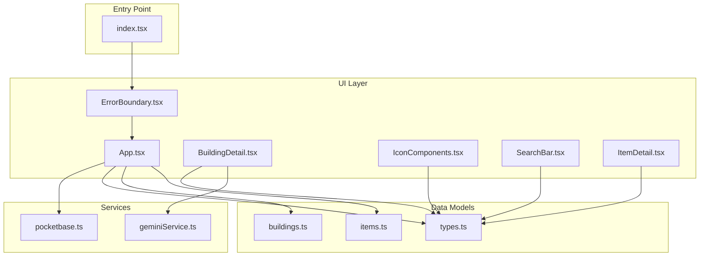
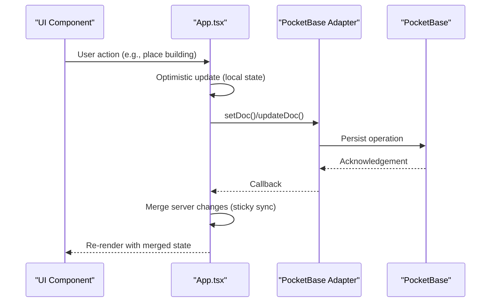
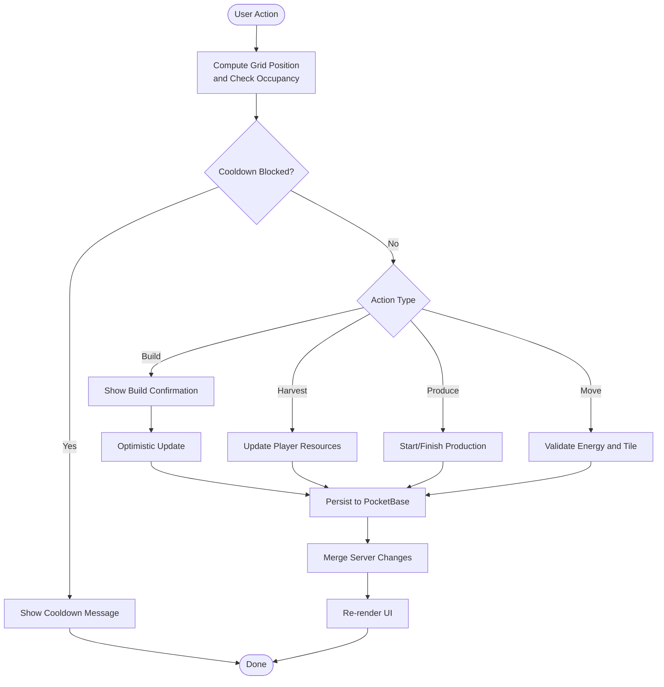
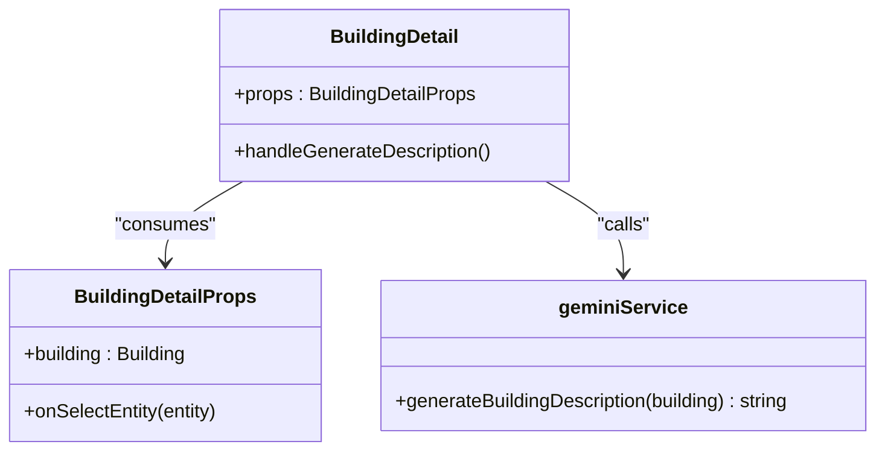
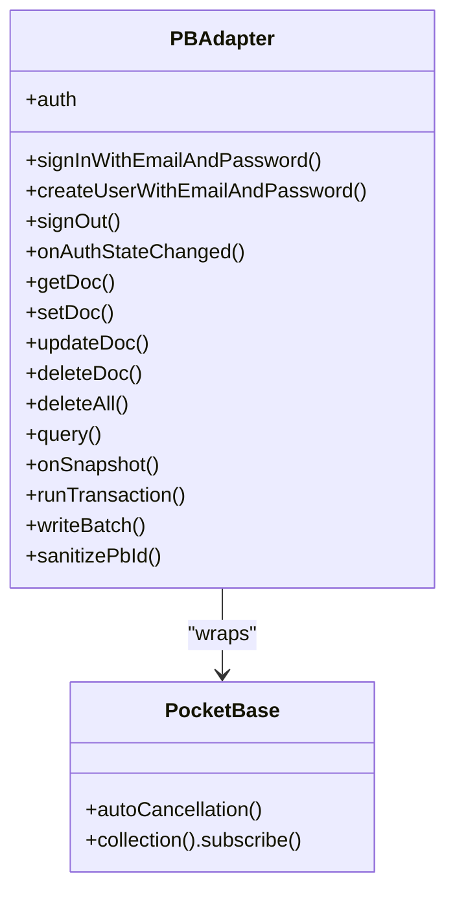
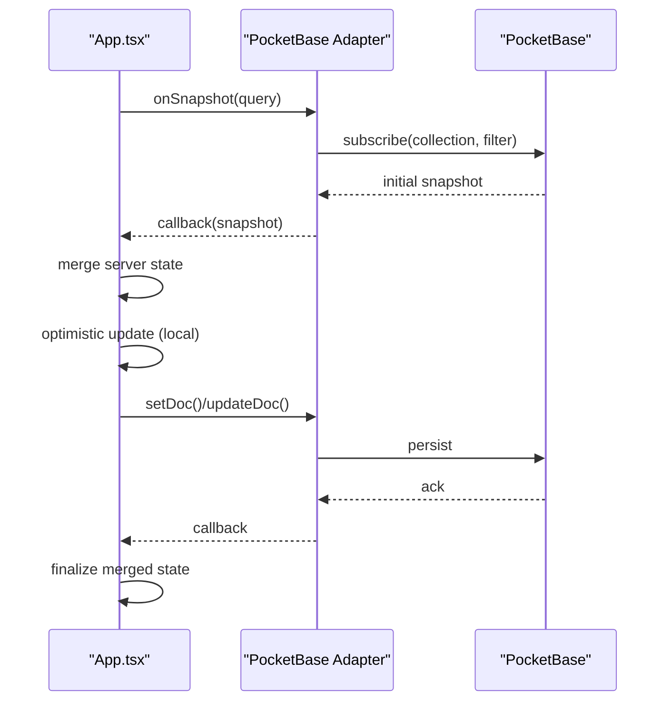
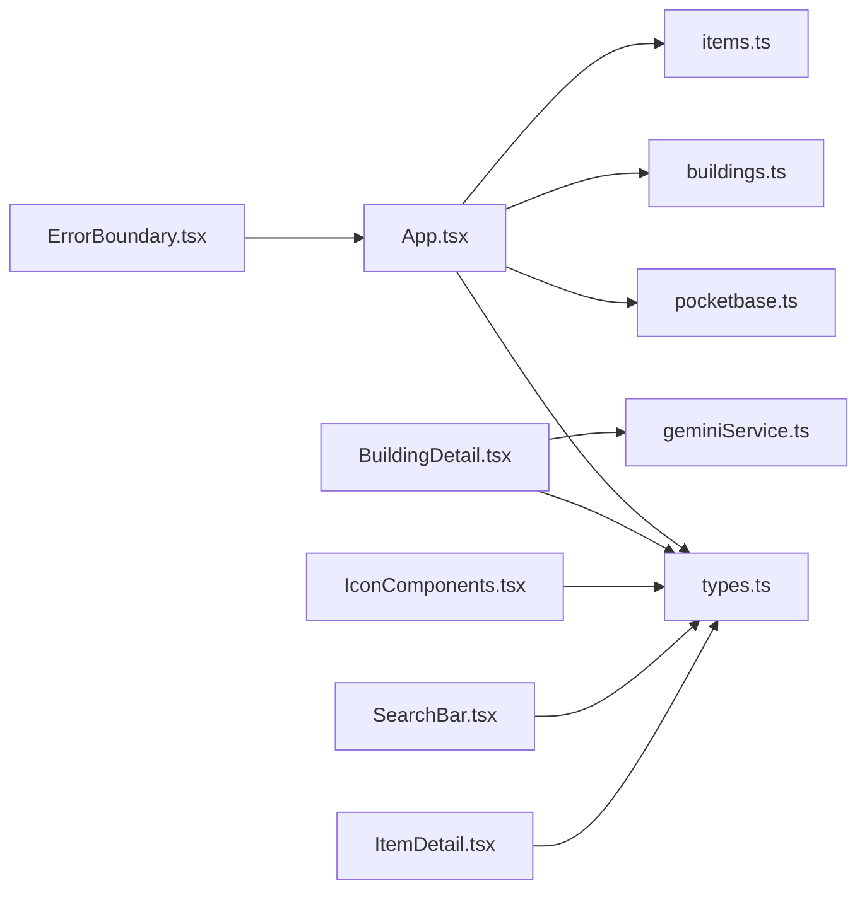

# Component Interactions

<cite>
**Referenced Files in This Document**
- [App.tsx](file://App.tsx)
- [index.tsx](file://index.tsx)
- [pocketbase.ts](file://src/pocketbase.ts)
- [types.ts](file://types.ts)
- [BuildingDetail.tsx](file://components/BuildingDetail.tsx)
- [IconComponents.tsx](file://components/IconComponents.tsx)
- [SearchBar.tsx](file://components/SearchBar.tsx)
- [ItemDetail.tsx](file://components/ItemDetail.tsx)
- [ErrorBoundary.tsx](file://components/ErrorBoundary.tsx)
- [geminiService.ts](file://services/geminiService.ts)
- [buildings.ts](file://data/buildings.ts)
- [items.ts](file://data/items.ts)
</cite>

## Table of Contents
1. [Introduction](#introduction)
2. [Project Structure](#project-structure)
3. [Core Components](#core-components)
4. [Architecture Overview](#architecture-overview)
5. [Detailed Component Analysis](#detailed-component-analysis)
6. [Dependency Analysis](#dependency-analysis)
7. [Performance Considerations](#performance-considerations)
8. [Troubleshooting Guide](#troubleshooting-guide)
9. [Conclusion](#conclusion)

## Introduction
This document explains how component interactions work in the Basingsemmorpg architecture, with a focus on how the central App.tsx orchestrates game state, coordinates UI components (including BuildingDetail and IconComponents), and synchronizes with PocketBase in real time. It covers user input handling, state transitions, optimistic updates, conflict resolution, and integration points across building placement, resource management, and social systems.

## Project Structure
The application follows a React-centric structure with a single orchestrator component (App.tsx) managing global state and real-time synchronization via a PocketBase compatibility layer. Supporting components encapsulate UI concerns, while data definitions and services provide typed models and external integrations.

**Diagram sources**
- [index.tsx:1-20](file://index.tsx#L1-L20)
- [App.tsx:1-120](file://App.tsx#L1-L120)
- [pocketbase.ts:1-120](file://src/pocketbase.ts#L1-L120)
- [types.ts:1-197](file://types.ts#L1-L197)
- [BuildingDetail.tsx:1-151](file://components/BuildingDetail.tsx#L1-L151)
- [IconComponents.tsx:1-187](file://components/IconComponents.tsx#L1-L187)
- [SearchBar.tsx:1-29](file://components/SearchBar.tsx#L1-L29)
- [ItemDetail.tsx:1-59](file://components/ItemDetail.tsx#L1-L59)
- [ErrorBoundary.tsx:1-78](file://components/ErrorBoundary.tsx#L1-L78)
- [geminiService.ts:1-43](file://services/geminiService.ts#L1-L43)
- [buildings.ts:1-800](file://data/buildings.ts#L1-L800)
- [items.ts:1-415](file://data/items.ts#L1-L415)

**Section sources**
- [index.tsx:1-20](file://index.tsx#L1-L20)
- [App.tsx:1-120](file://App.tsx#L1-L120)

## Core Components
- App.tsx: Central orchestrator managing global state, real-time subscriptions, user interactions, and optimistic updates. It controls building placement, resource harvesting, production workflows, chat, clans, and presence.
- UI Components:
  - BuildingDetail: Displays building metadata, requirements, production stats, and destruction info, with AI-powered description generation.
  - IconComponents: Reusable SVG icons for UI affordances.
  - SearchBar: Generic search input with icon.
  - ItemDetail: Displays item metadata and relationships to buildings/resources.
- PocketBase Compatibility: A thin adapter exposing Firestore-like APIs (getDoc, setDoc, updateDoc, deleteDoc, onSnapshot, runTransaction, writeBatch) backed by PocketBase.
- Types: Strongly-typed models for buildings, items, map resources, placed buildings, and game entities.
- Services: Gemini integration for dynamic building descriptions.

**Section sources**
- [App.tsx:255-382](file://App.tsx#L255-L382)
- [BuildingDetail.tsx:1-151](file://components/BuildingDetail.tsx#L1-L151)
- [IconComponents.tsx:1-187](file://components/IconComponents.tsx#L1-L187)
- [SearchBar.tsx:1-29](file://components/SearchBar.tsx#L1-L29)
- [ItemDetail.tsx:1-59](file://components/ItemDetail.tsx#L1-L59)
- [pocketbase.ts:1-120](file://src/pocketbase.ts#L1-L120)
- [types.ts:1-197](file://types.ts#L1-L197)
- [geminiService.ts:1-43](file://services/geminiService.ts#L1-L43)

## Architecture Overview
The system uses a centralized state machine pattern in App.tsx with real-time subscriptions to PocketBase collections. UI components receive props and callbacks to trigger actions that update local state optimistically and persist to the backend. Conflicts are resolved through sticky interaction logic and anti-jitter protections.

**Diagram sources**
- [App.tsx:1521-1555](file://App.tsx#L1521-L1555)
- [pocketbase.ts:337-426](file://src/pocketbase.ts#L337-L426)

## Detailed Component Analysis

### App.tsx: Central Orchestrator
App.tsx manages:
- Global state: camera offset, zoom, placed buildings, map resources, dropped items, user profile, chat, clans, market, and UI flags.
- Real-time subscriptions: buildings (by zone and owner), map resources, dropped items, users, presence, chat, market.
- User interactions: mouse/touch events, tooltips, build confirmation, move mode, resource harvesting, production triggers, taxation, and combat-related actions.
- Optimistic updates: immediate UI feedback followed by server persistence.
- Conflict resolution: sticky interaction logic prevents rollback during short-lived local actions; anti-jitter protects against sync races.

Key patterns:
- Event propagation: Mouse/touch handlers compute grid positions, check occupancy, enforce cooldowns, and dispatch actions that update both local state and PocketBase.
- Prop drilling: Many UI flags and callbacks are passed down to child components (e.g., build menu, building detail modal).
- Refs for consistency: userRef, isAuthReadyRef, placedBuildingsRef, mapResourcesRef, and others ensure callbacks see current state.
- Sticky sync: updatePlacedBuildingsFromServer merges server and local states, preserving recent local changes until server confirms.

**Diagram sources**
- [App.tsx:978-1317](file://App.tsx#L978-L1317)
- [App.tsx:1439-1555](file://App.tsx#L1439-L1555)
- [App.tsx:2024-2091](file://App.tsx#L2024-L2091)

**Section sources**
- [App.tsx:978-1317](file://App.tsx#L978-L1317)
- [App.tsx:1439-1555](file://App.tsx#L1439-L1555)
- [App.tsx:2024-2091](file://App.tsx#L2024-L2091)

### BuildingDetail.tsx: Building Information UI
BuildingDetail displays comprehensive building metadata and integrates with AI service for dynamic descriptions. It receives a building object and an onSelectEntity callback to navigate to related items.

**Diagram sources**
- [BuildingDetail.tsx:1-151](file://components/BuildingDetail.tsx#L1-L151)
- [geminiService.ts:12-43](file://services/geminiService.ts#L12-L43)

**Section sources**
- [BuildingDetail.tsx:1-151](file://components/BuildingDetail.tsx#L1-L151)
- [geminiService.ts:12-43](file://services/geminiService.ts#L12-L43)

### IconComponents.tsx: Shared UI Icons
IconComponents provides reusable SVG icons used across the UI (e.g., building, resource, close, coin, energy, etc.). These are referenced by App.tsx and other components for consistent visuals.

**Section sources**
- [IconComponents.tsx:1-187](file://components/IconComponents.tsx#L1-L187)

### SearchBar.tsx: Generic Search Input
SearchBar is a controlled input component with an icon, enabling search across entities by ID or name.

**Section sources**
- [SearchBar.tsx:1-29](file://components/SearchBar.tsx#L1-L29)

### ItemDetail.tsx: Item Information UI
ItemDetail renders item metadata and relationships to buildings/resources, with clickable links to navigate to related entities.

**Section sources**
- [ItemDetail.tsx:1-59](file://components/ItemDetail.tsx#L1-L59)

### PocketBase Compatibility Layer
The pocketbase.ts module exposes Firestore-like APIs backed by PocketBase:
- Authentication mirroring (signInWithEmailAndPassword, createUserWithEmailAndPassword, signOut, onAuthStateChanged).
- Document operations (getDoc, setDoc, updateDoc, deleteDoc, deleteAll).
- Queries (query, where, orderBy, limit) and real-time subscriptions (onSnapshot) with throttling and stale client ID retries.
- Transactions and batch writes (runTransaction, writeBatch).
- ID sanitization to 15-character alphanumeric strings.

**Diagram sources**
- [pocketbase.ts:1-120](file://src/pocketbase.ts#L1-L120)
- [pocketbase.ts:578-707](file://src/pocketbase.ts#L578-L707)

**Section sources**
- [pocketbase.ts:1-120](file://src/pocketbase.ts#L1-L120)
- [pocketbase.ts:287-448](file://src/pocketbase.ts#L287-L448)
- [pocketbase.ts:578-707](file://src/pocketbase.ts#L578-L707)

### Data Models and Integration Points
- types.ts defines core models: Building, Item, MapResource, PlacedBuilding, DroppedItem, MarketListing, Clan, HistoryEntry, PrivateMessage, and enums like BuildingType.
- buildings.ts and items.ts provide static data for gameplay mechanics (requirements, stats, drops, upgrades).
- App.tsx references these models to compute derived state (population, max buildings, taxes) and to drive UI rendering.

**Section sources**
- [types.ts:1-197](file://types.ts#L1-L197)
- [buildings.ts:1-800](file://data/buildings.ts#L1-L800)
- [items.ts:1-415](file://data/items.ts#L1-L415)

### Real-Time Synchronization and Optimistic Updates
- Zone-based subscriptions: App.tsx computes current zones from camera position and subscribes to map_resources, dropped_items, and buildings by zone and owner.
- Optimistic updates: UI reflects immediate changes (e.g., placing a building, moving an object, harvesting resources) before server acknowledgment.
- Sticky sync: Recent local interactions are preserved until server confirms parity, preventing rollback during brief sync delays.
- Anti-jitter: Short-lived local states are protected from server "stale" versions to avoid flicker or undo.

**Diagram sources**
- [App.tsx:822-877](file://App.tsx#L822-L877)
- [App.tsx:2094-2145](file://App.tsx#L2094-L2145)
- [pocketbase.ts:578-707](file://src/pocketbase.ts#L578-L707)

**Section sources**
- [App.tsx:822-877](file://App.tsx#L822-L877)
- [App.tsx:2094-2145](file://App.tsx#L2094-L2145)
- [pocketbase.ts:578-707](file://src/pocketbase.ts#L578-L707)

### Component Lifecycle Management and Event Propagation
- Mounting: App.tsx initializes auth listeners, loads user data, sets up presence, and subscribes to collections.
- Rendering: App.tsx draws the isometric world, overlays UI, and handles tooltips and hover states.
- Events: Mouse and touch handlers compute grid positions, validate actions, enforce cooldowns, and dispatch updates.
- Unmounting: Subscriptions are cleaned up via returned unsubscribe functions from onSnapshot.

**Section sources**
- [App.tsx:1558-1616](file://App.tsx#L1558-L1616)
- [App.tsx:1767-1819](file://App.tsx#L1767-L1819)
- [App.tsx:1864-1901](file://App.tsx#L1864-L1901)
- [App.tsx:2474-2494](file://App.tsx#L2474-L2494)

### Integration Points Across Game Systems
- Building Placement: Validates ownership, population, resource costs, and tile occupancy; persists to buildings collection; optimistically adds to local state.
- Resource Management: Handles tree harvesting, oil/quarry extraction, chest looting, and inventory updates; enforces energy and capacity limits.
- Social Systems: Chat, presence, friend lists, reputation actions (praise/complain), bans, curses, and private messaging integrate with PocketBase collections.
- Market and Economy: Market listings are fetched and displayed; transactions use runTransaction or writeBatch for atomicity.

**Section sources**
- [App.tsx:1439-1555](file://App.tsx#L1439-L1555)
- [App.tsx:1076-1285](file://App.tsx#L1076-L1285)
- [App.tsx:2147-2165](file://App.tsx#L2147-L2165)
- [App.tsx:2276-2347](file://App.tsx#L2276-L2347)

## Dependency Analysis
The system exhibits clear separation of concerns:
- App.tsx depends on pocketbase.ts for persistence and subscriptions, types.ts for models, and data/*.ts for static definitions.
- UI components depend on shared types and icons, and on App.tsx for callbacks and state.
- ErrorBoundary wraps the root to provide graceful error handling.

**Diagram sources**
- [App.tsx:1-120](file://App.tsx#L1-L120)
- [pocketbase.ts:1-120](file://src/pocketbase.ts#L1-L120)
- [types.ts:1-197](file://types.ts#L1-L197)
- [buildings.ts:1-800](file://data/buildings.ts#L1-L800)
- [items.ts:1-415](file://data/items.ts#L1-L415)
- [BuildingDetail.tsx:1-151](file://components/BuildingDetail.tsx#L1-L151)
- [IconComponents.tsx:1-187](file://components/IconComponents.tsx#L1-L187)
- [SearchBar.tsx:1-29](file://components/SearchBar.tsx#L1-L29)
- [ItemDetail.tsx:1-59](file://components/ItemDetail.tsx#L1-L59)
- [ErrorBoundary.tsx:1-78](file://components/ErrorBoundary.tsx#L1-L78)

**Section sources**
- [App.tsx:1-120](file://App.tsx#L1-L120)
- [pocketbase.ts:1-120](file://src/pocketbase.ts#L1-L120)
- [types.ts:1-197](file://types.ts#L1-L197)

## Performance Considerations
- Subscription throttling: Camera offset throttling reduces zone subscription churn; onSnapshot uses a throttle for collection updates.
- Anti-storm staggering: Real-time subscriptions stagger initial subscriptions to avoid "storm" on mount.
- Batch operations: writeBatch consolidates multiple updates for market and moderation actions.
- Image preloading: Assets are preloaded to minimize rendering delays.
- Sticky sync: Prevents unnecessary re-renders and flicker by preserving local optimistic state until server confirms.

[No sources needed since this section provides general guidance]

## Troubleshooting Guide
Common issues and remedies:
- Authentication failures: Errors are translated to user-friendly messages (e.g., invalid credentials, unique constraints).
- Presence and connection: Presence updates are best-effort; errors are ignored to keep gameplay responsive.
- Error boundary: Uncaught errors surface in a styled overlay with reset option; logs include operation type and path for diagnostics.
- PocketBase errors: handleFirestoreError logs structured errors with operation type and path.

**Section sources**
- [App.tsx:1734-1753](file://App.tsx#L1734-L1753)
- [App.tsx:1869-1893](file://App.tsx#L1869-L1893)
- [ErrorBoundary.tsx:14-78](file://components/ErrorBoundary.tsx#L14-L78)
- [pocketbase.ts:787-800](file://src/pocketbase.ts#L787-L800)

## Conclusion
The Basingsemmorpg architecture centers around App.tsx as a reactive orchestrator that harmonizes user interactions, real-time synchronization, and optimistic updates. UI components remain focused and composable, while the PocketBase compatibility layer abstracts persistence and subscriptions. The result is a responsive, resilient system where user actions propagate predictably through state, UI, and database layers, with robust mechanisms to resolve conflicts and maintain consistency.