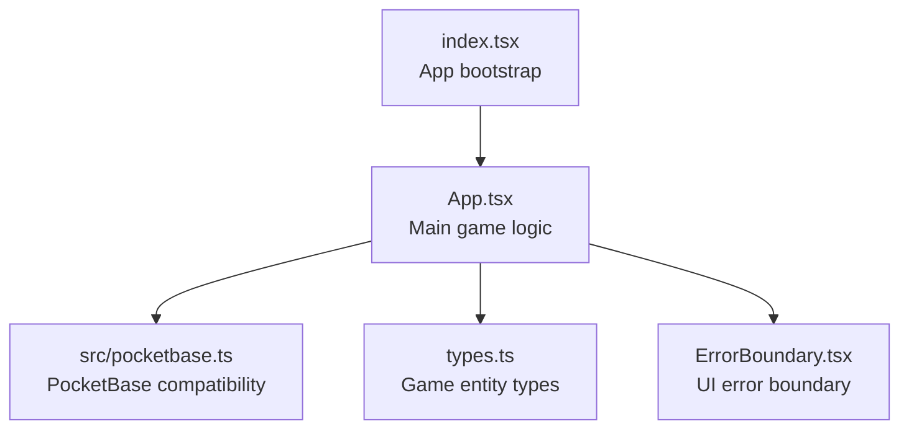
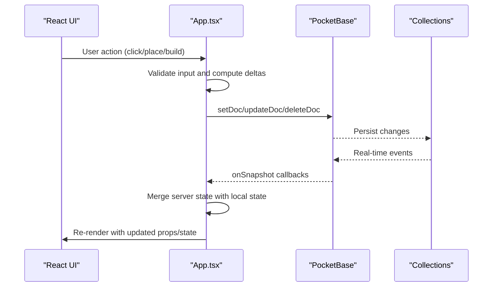
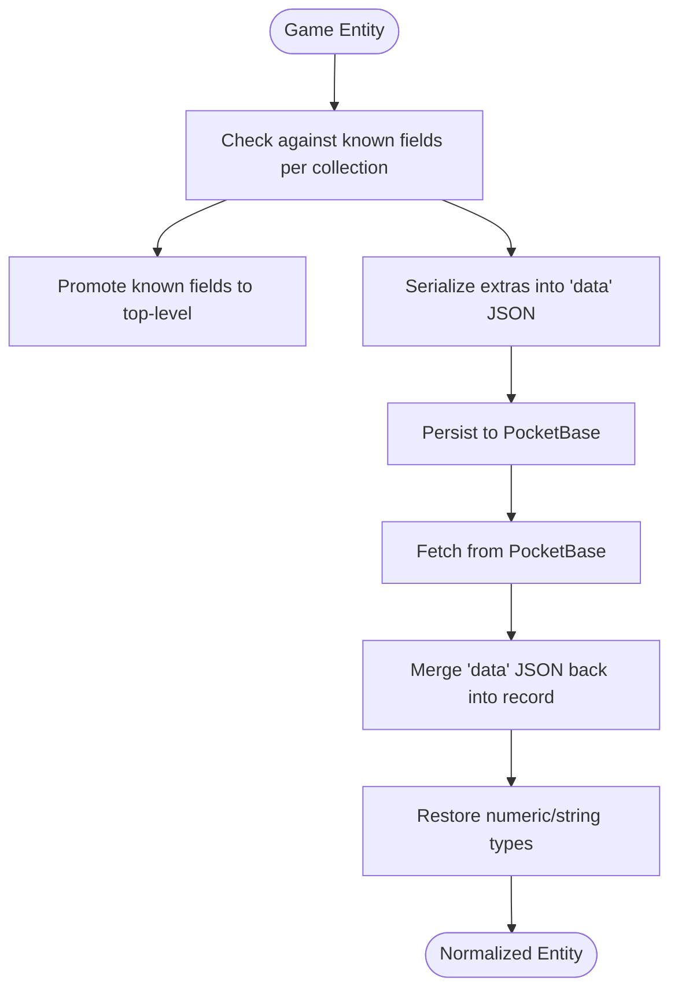
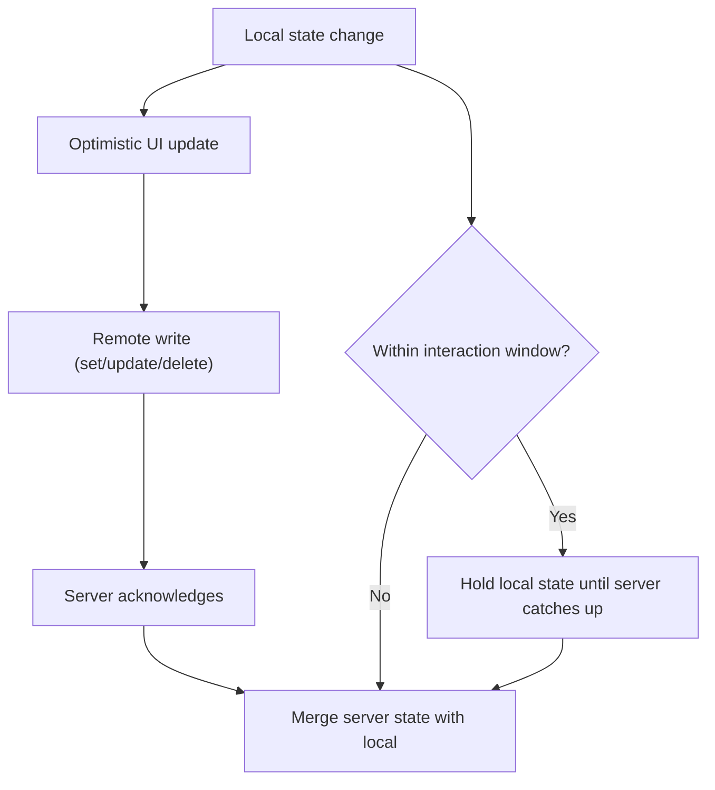
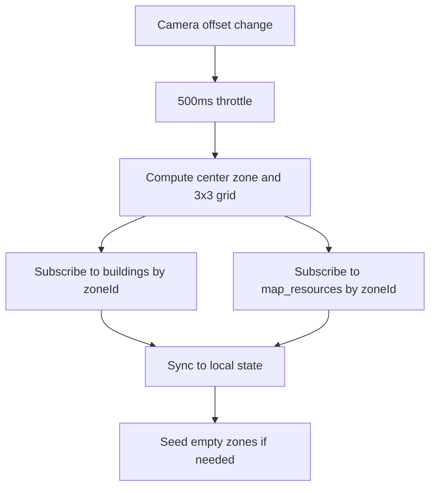
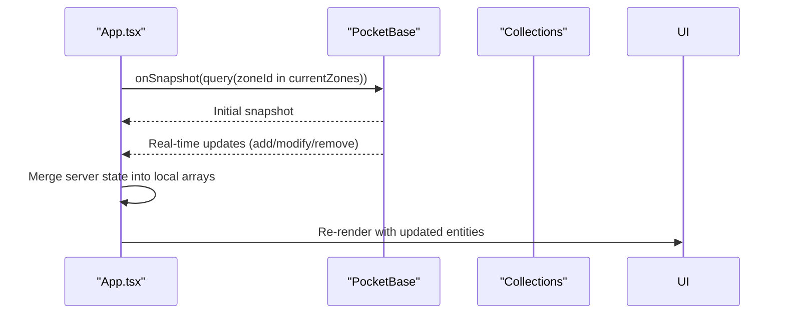
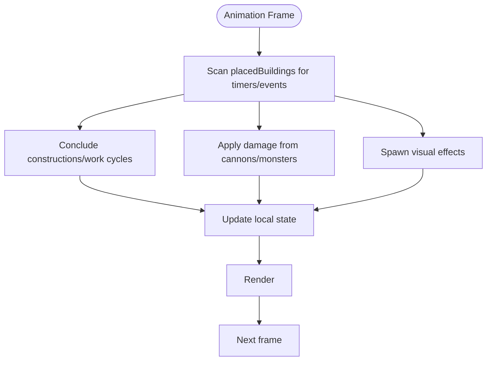
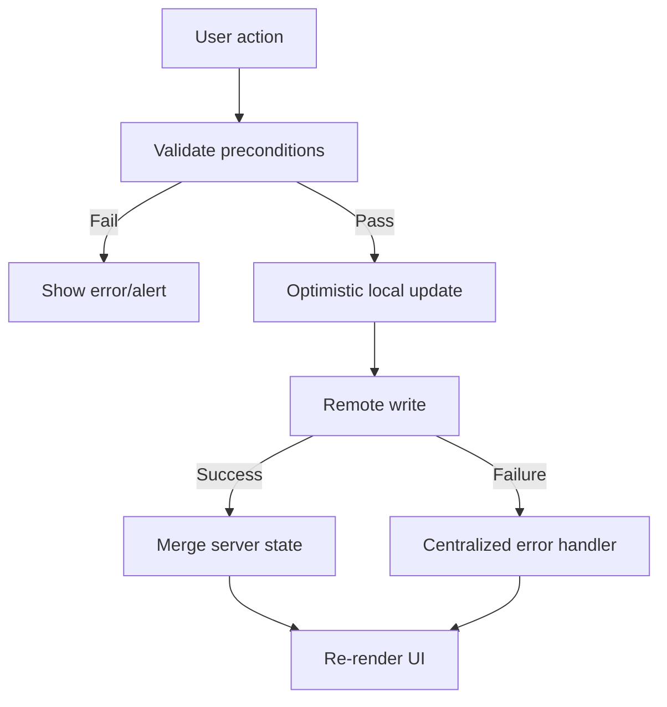
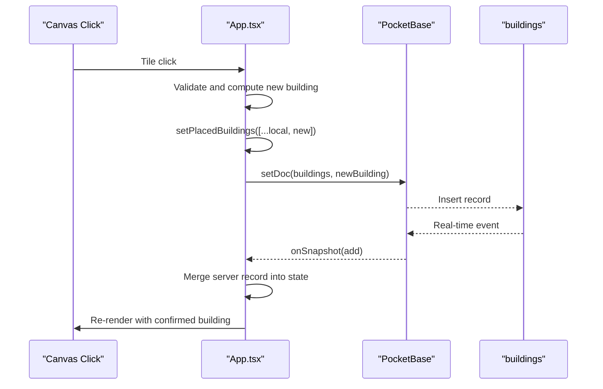
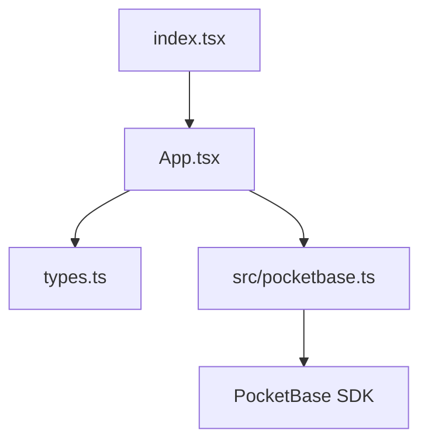

# Data Flow Patterns

<cite>
**Referenced Files in This Document**
- [index.tsx](file://index.tsx)
- [App.tsx](file://App.tsx)
- [pocketbase.ts](file://src/pocketbase.ts)
- [types.ts](file://types.ts)
- [README.md](file://README.md)
</cite>

## Table of Contents
1. [Introduction](#introduction)
2. [Project Structure](#project-structure)
3. [Core Components](#core-components)
4. [Architecture Overview](#architecture-overview)
5. [Detailed Component Analysis](#detailed-component-analysis)
6. [Dependency Analysis](#dependency-analysis)
7. [Performance Considerations](#performance-considerations)
8. [Troubleshooting Guide](#troubleshooting-guide)
9. [Conclusion](#conclusion)

## Introduction
This document explains the complete data flow patterns in the Basingsemmorpg system. It traces how user input propagates through React components, state management, PocketBase real-time database operations, and back to UI updates. It covers bidirectional synchronization between local React state and remote database state, transformation layers between game objects and database records, validation and error handling strategies, and performance optimizations such as zone-based loading and throttled operations.

## Project Structure
The application is a React-based single-page application bootstrapped in index.tsx and rendered inside an ErrorBoundary. The main game logic, state orchestration, and PocketBase integration live in App.tsx. A compatibility layer for PocketBase operations is implemented in src/pocketbase.ts, and shared TypeScript types define the game entities (PlacedBuilding, MapResource, etc.) in types.ts.

**Diagram sources**
- [index.tsx:1-20](file://index.tsx#L1-L20)
- [App.tsx:1-50](file://App.tsx#L1-L50)
- [pocketbase.ts:1-30](file://src/pocketbase.ts#L1-L30)
- [types.ts:1-50](file://types.ts#L1-L50)

**Section sources**
- [index.tsx:1-20](file://index.tsx#L1-L20)
- [README.md:1-21](file://README.md#L1-L21)

## Core Components
- React root and error boundary: Initializes the React app and wraps the App with an ErrorBoundary.
- App component: Central orchestrator managing camera, zones, real-time subscriptions, local state, and game loop.
- PocketBase compatibility layer: Provides Firestore-like APIs (getDoc, setDoc, updateDoc, deleteDoc, onSnapshot, runTransaction, writeBatch) and data transformation helpers to adapt between game entities and PocketBase records.
- Types: Defines PlacedBuilding, MapResource, DroppedItem, MarketListing, and other game entities used across the system.

Key responsibilities:
- Zone-based loading: Computes current zones from camera position and subscribes to relevant collections.
- Real-time synchronization: Subscribes to buildings, map_resources, dropped_items, users, presence, chat_messages, market, and private_messages.
- Optimistic updates: Updates local state immediately upon user actions and reconciles with server later.
- Conflict resolution: Uses sticky interaction logic and anti-jitter mechanisms to reconcile local and server states.
- Validation and error handling: Centralized error handler for PocketBase operations and localized validation in UI actions.

**Section sources**
- [App.tsx:255-400](file://App.tsx#L255-L400)
- [pocketbase.ts:143-218](file://src/pocketbase.ts#L143-L218)
- [types.ts:100-197](file://types.ts#L100-L197)

## Architecture Overview
The system follows a reactive, event-driven architecture:
- User input triggers React handlers that update local state and perform PocketBase writes.
- Real-time subscriptions continuously refresh local state from the database.
- A game loop periodically processes AI and timers, updating both local and remote state.
- Data transformations ensure compatibility between game entities and PocketBase records.

**Diagram sources**
- [App.tsx:1000-1317](file://App.tsx#L1000-L1317)
- [pocketbase.ts:287-356](file://src/pocketbase.ts#L287-L356)
- [pocketbase.ts:571-707](file://src/pocketbase.ts#L571-L707)

## Detailed Component Analysis

### Data Transformation Layer (Game Entities ↔ Database Records)
PocketBase requires strict schema fields. The compatibility layer transforms arbitrary game data into a normalized shape:
- Known fields are promoted to top-level fields for filtering.
- Other fields are serialized into a JSON "data" field.
- On reads, the "data" JSON is merged back into the record and types are restored (e.g., numeric IDs).
- Special handling strips accidental "isLocal" flags that could cause ghost records.

**Diagram sources**
- [pocketbase.ts:143-218](file://src/pocketbase.ts#L143-L218)

**Section sources**
- [pocketbase.ts:143-218](file://src/pocketbase.ts#L143-L218)
- [types.ts:111-147](file://types.ts#L111-L147)

### Bidirectional Synchronization and Conflict Resolution
- Optimistic updates: UI reflects immediate changes (e.g., moving a building, collecting production, buying/selling items).
- Sticky interaction logic: If a local interaction occurred within a short timeframe, the UI prioritizes local state until the server confirms reconciliation.
- Anti-jitter protection: Prevents rapid rollback when server data is slightly behind local state.
- Deletion protection: During cleanup, local "deleting" flags prevent flicker and race conditions.

**Diagram sources**
- [App.tsx:2024-2091](file://App.tsx#L2024-L2091)
- [App.tsx:3448-3627](file://App.tsx#L3448-L3627)

**Section sources**
- [App.tsx:2024-2091](file://App.tsx#L2024-L2091)
- [App.tsx:3448-3627](file://App.tsx#L3448-L3627)

### Zone-Based Loading and Throttled Operations
- Zone computation: Camera position determines a 3x3 grid of zones centered on the viewport.
- Throttled camera updates: Camera offset changes are debounced to reduce subscription churn.
- Per-zone subscriptions: Only buildings and map_resources within current zones are subscribed to.
- Seeding: Empty zones are populated with resources and monsters on demand.

**Diagram sources**
- [App.tsx:780-820](file://App.tsx#L780-L820)
- [App.tsx:822-877](file://App.tsx#L822-L877)
- [App.tsx:894-953](file://App.tsx#L894-L953)

**Section sources**
- [App.tsx:780-820](file://App.tsx#L780-L820)
- [App.tsx:822-877](file://App.tsx#L822-L877)
- [App.tsx:894-953](file://App.tsx#L894-L953)

### Real-Time Subscriptions and Collections
- Buildings: Subscribed globally for the current player and by zone for others.
- Map resources: Zone-scoped subscriptions with initial seeding.
- Dropped items: Zone-scoped subscriptions.
- Users: One-to-one document snapshots for player stats.
- Presence: Periodic presence updates with heartbeat.
- Chat and market: Snapshot-based lists with limits and ordering.
- Private messages: Participant-scoped subscriptions.

**Diagram sources**
- [App.tsx:822-877](file://App.tsx#L822-L877)
- [App.tsx:880-893](file://App.tsx#L880-L893)
- [App.tsx:1768-1819](file://App.tsx#L1768-L1819)
- [App.tsx:1841-1862](file://App.tsx#L1841-L1862)
- [App.tsx:2147-2165](file://App.tsx#L2147-L2165)
- [App.tsx:2474-2494](file://App.tsx#L2474-L2494)

**Section sources**
- [App.tsx:822-877](file://App.tsx#L822-L877)
- [App.tsx:880-893](file://App.tsx#L880-L893)
- [App.tsx:1768-1819](file://App.tsx#L1768-L1819)
- [App.tsx:1841-1862](file://App.tsx#L1841-L1862)
- [App.tsx:2147-2165](file://App.tsx#L2147-L2165)
- [App.tsx:2474-2494](file://App.tsx#L2474-L2494)

### Game Loop and Timers
- Animation frame loop processes:
  - Construction completion
  - Work cycle completion
  - Destruction timers
  - Monster AI movement and attacks
  - Cannon targeting and damage
- Effects: Visual effects for explosions and upgrades.
- Cleanup: Dead buildings are deleted from the database.

**Diagram sources**
- [App.tsx:3216-3627](file://App.tsx#L3216-L3627)

**Section sources**
- [App.tsx:3216-3627](file://App.tsx#L3216-L3627)

### Validation, Error Handling, and Conflict Resolution
- Input validation: Actions validate prerequisites (energy, gold, population, inventory, building limits).
- Error handling: Centralized handler logs and surfaces PocketBase errors; ignores expected race conditions during game loop.
- Conflict resolution: Sticky interaction logic and anti-jitter merge to reconcile local and server states.
- Atomic operations: Transactions and write batches ensure consistency for multi-field updates.

**Diagram sources**
- [App.tsx:1439-1555](file://App.tsx#L1439-L1555)
- [App.tsx:3914-4020](file://App.tsx#L3914-L4020)
- [pocketbase.ts:787-800](file://src/pocketbase.ts#L787-L800)

**Section sources**
- [App.tsx:1439-1555](file://App.tsx#L1439-L1555)
- [App.tsx:3914-4020](file://App.tsx#L3914-L4020)
- [pocketbase.ts:787-800](file://src/pocketbase.ts#L787-L800)

### Example Data Lifecycle: Building Placement
1. User clicks a tile; App checks occupancy and building limits.
2. Optimistically adds a temporary building to local state.
3. Writes the new building to the buildings collection.
4. Real-time subscription receives the new record and merges into local state.
5. Sticky interaction logic ensures UI stability if server responds late.

**Diagram sources**
- [App.tsx:1317-1317](file://App.tsx#L1317-L1317)
- [App.tsx:1538-1555](file://App.tsx#L1538-L1555)
- [pocketbase.ts:337-356](file://src/pocketbase.ts#L337-L356)

**Section sources**
- [App.tsx:1317-1317](file://App.tsx#L1317-L1317)
- [App.tsx:1538-1555](file://App.tsx#L1538-L1555)
- [pocketbase.ts:337-356](file://src/pocketbase.ts#L337-L356)

## Dependency Analysis
- App.tsx depends on:
  - src/pocketbase.ts for database operations and real-time subscriptions.
  - types.ts for strongly-typed game entities.
  - index.tsx for mounting the app and wrapping with ErrorBoundary.
- PocketBase compatibility layer abstracts PocketBase differences and provides Firestore-like semantics.

**Diagram sources**
- [index.tsx:1-20](file://index.tsx#L1-L20)
- [App.tsx:1-30](file://App.tsx#L1-L30)
- [pocketbase.ts:1-12](file://src/pocketbase.ts#L1-L12)

**Section sources**
- [index.tsx:1-20](file://index.tsx#L1-L20)
- [App.tsx:1-30](file://App.tsx#L1-L30)
- [pocketbase.ts:1-12](file://src/pocketbase.ts#L1-L12)

## Performance Considerations
- Zone-based loading: Limits the number of subscribed records to the visible area, reducing bandwidth and CPU.
- Throttled camera updates: Debounces zone recomputation to avoid excessive re-subscriptions.
- Optimistic UI updates: Minimizes perceived latency by updating immediately and reconciling later.
- Batched writes: Uses writeBatch and runTransaction to group related updates atomically.
- Image preloading: Loads asset URLs once to improve rendering performance.
- Heartbeat presence: Periodic presence updates balance freshness and overhead.

[No sources needed since this section provides general guidance]

## Troubleshooting Guide
Common issues and remedies:
- Stale client ID errors in real-time subscriptions: The compatibility layer retries with jitter and cleans up stale subscriptions.
- Expected race conditions during game loop: Errors are ignored to avoid noisy alerts for known benign cases.
- Presence failures: Updates are attempted but failures are ignored to keep gameplay smooth.
- Data type mismatches: The transformation layer restores numeric types and sanitizes IDs to 15-character strings.

**Section sources**
- [pocketbase.ts:587-621](file://src/pocketbase.ts#L587-L621)
- [App.tsx:27-33](file://App.tsx#L27-L33)
- [pocketbase.ts:252-276](file://src/pocketbase.ts#L252-L276)

## Conclusion
The Basingsemmorpg system implements a robust, real-time data flow that balances responsiveness with consistency. Through zone-based loading, throttled operations, optimistic UI updates, and a comprehensive transformation layer, it maintains synchronized state across local React components and the PocketBase database. Validation and centralized error handling ensure reliability, while conflict resolution strategies preserve user experience during eventual consistency scenarios.