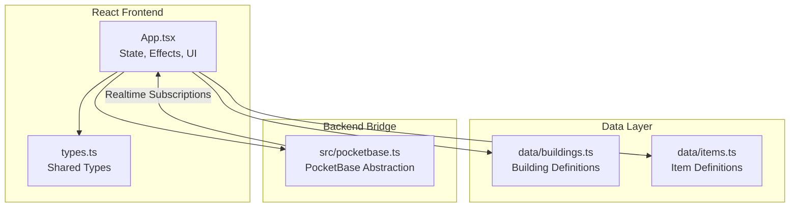
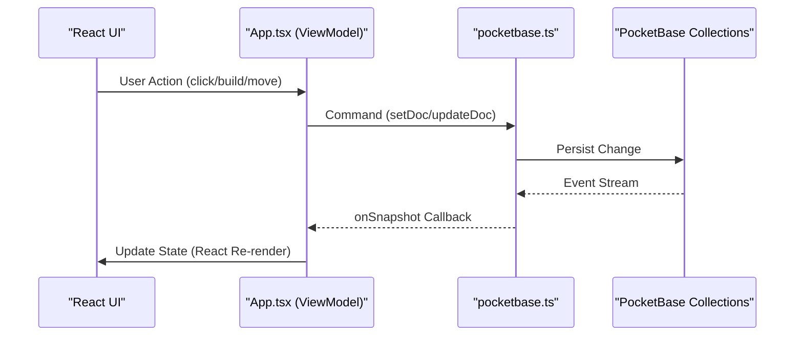
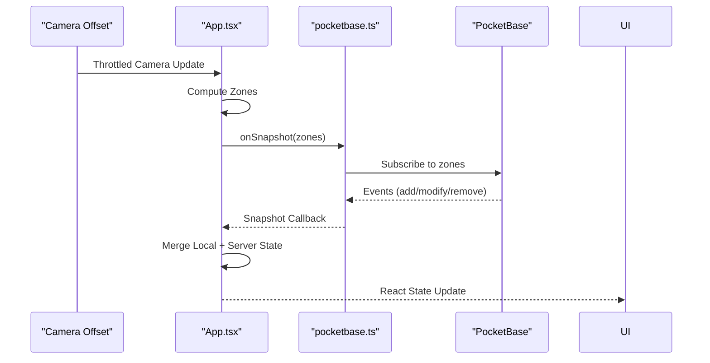
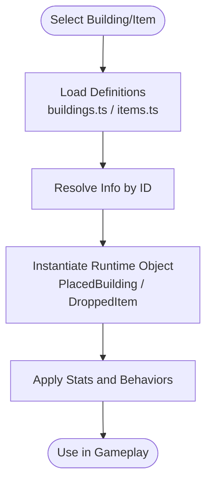
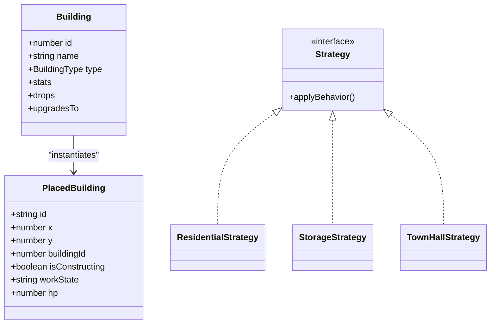
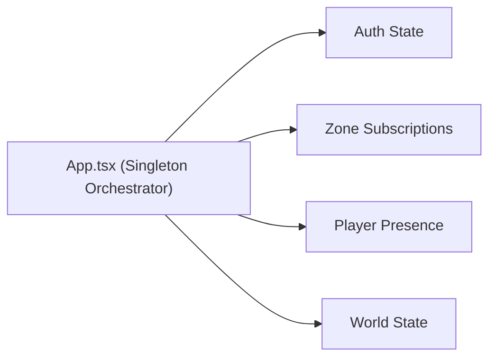
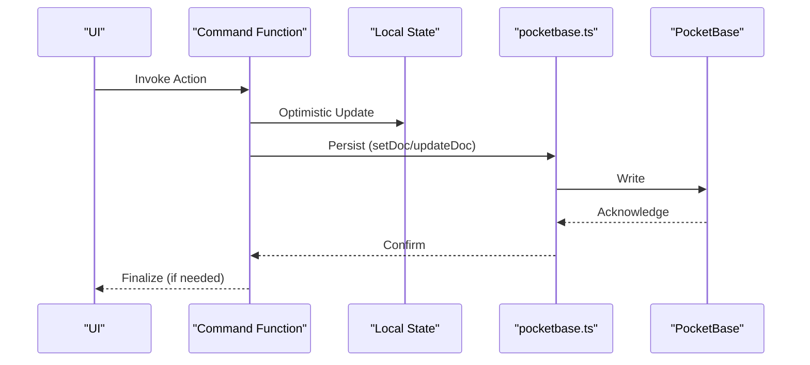
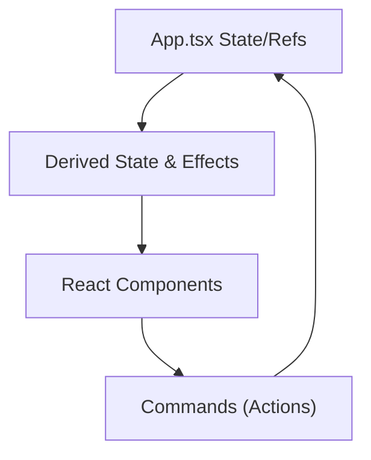
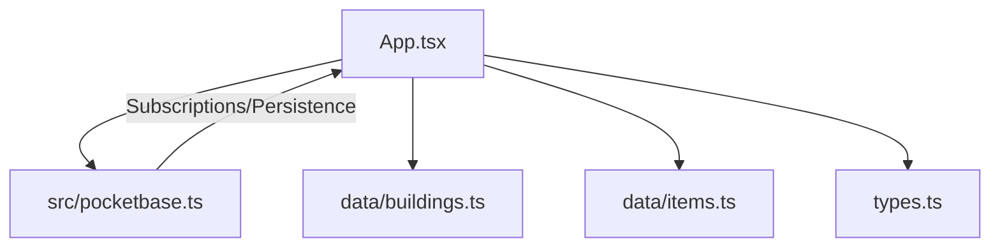

# Design Patterns

<cite>
**Referenced Files in This Document**
- [App.tsx](file://App.tsx)
- [pocketbase.ts](file://src/pocketbase.ts)
- [buildings.ts](file://data/buildings.ts)
- [items.ts](file://data/items.ts)
- [types.ts](file://types.ts)
</cite>

## Table of Contents
1. [Introduction](#introduction)
2. [Project Structure](#project-structure)
3. [Core Components](#core-components)
4. [Architecture Overview](#architecture-overview)
5. [Detailed Component Analysis](#detailed-component-analysis)
6. [Dependency Analysis](#dependency-analysis)
7. [Performance Considerations](#performance-considerations)
8. [Troubleshooting Guide](#troubleshooting-guide)
9. [Conclusion](#conclusion)

## Introduction
This document analyzes the design patterns implemented in the Basingsemmorpg codebase. It focuses on:
- Observer pattern for real-time state synchronization via PocketBase subscriptions
- Factory pattern for dynamic building and item creation
- Strategy pattern for building behaviors and game mechanics
- Singleton pattern for game instance management
- Command pattern for player actions and game events
- MVVM-like architecture in React components

It explains how these patterns enable real-time gameplay, maintainability, and scalability, and discusses trade-offs and performance implications.

## Project Structure
The project is a React single-page application with a TypeScript backend bridge to PocketBase. Key areas:
- Application state and orchestration live in App.tsx
- Real-time synchronization is abstracted in src/pocketbase.ts
- Game assets and definitions are in data/buildings.ts and data/items.ts
- Shared types are defined in types.ts

**Diagram sources**
- [App.tsx](file://App.tsx)
- [pocketbase.ts](file://src/pocketbase.ts)
- [buildings.ts](file://data/buildings.ts)
- [items.ts](file://data/items.ts)
- [types.ts](file://types.ts)

**Section sources**
- [App.tsx](file://App.tsx)
- [pocketbase.ts](file://src/pocketbase.ts)
- [buildings.ts](file://data/buildings.ts)
- [items.ts](file://data/items.ts)
- [types.ts](file://types.ts)

## Core Components
- Real-time synchronization engine: src/pocketbase.ts provides onSnapshot, getDoc, setDoc, updateDoc, deleteDoc, and query abstractions mirroring Firestore semantics atop PocketBase.
- Game orchestration: App.tsx manages state, effects, UI, and game loops, coordinating with the backend via the PocketBase abstraction.
- Data definitions: data/buildings.ts and data/items.ts define static game assets used for factory-style creation and strategy-driven behaviors.
- Shared types: types.ts defines PlacedBuilding, MapResource, DroppedItem, and related interfaces.

These components collectively implement the Observer, Factory, Strategy, Singleton, Command, and MVVM-like patterns described below.

**Section sources**
- [pocketbase.ts](file://src/pocketbase.ts)
- [App.tsx](file://App.tsx)
- [buildings.ts](file://data/buildings.ts)
- [items.ts](file://data/items.ts)
- [types.ts](file://types.ts)

## Architecture Overview
The architecture follows a reactive, MVVM-like flow:
- View (React components) reacts to state changes
- ViewModel-like orchestrators (App.tsx) manage derived state and side effects
- Model (PocketBase collections) persists and synchronizes state
- Commands (actions) mutate state and trigger persistence

**Diagram sources**
- [App.tsx](file://App.tsx)
- [pocketbase.ts](file://src/pocketbase.ts)

**Section sources**
- [App.tsx](file://App.tsx)
- [pocketbase.ts](file://src/pocketbase.ts)

## Detailed Component Analysis

### Observer Pattern: Real-Time State Synchronization
The Observer pattern is implemented through PocketBase subscriptions:
- onSnapshot wraps PocketBase’s subscribe to provide Firestore-like callbacks
- Zones are calculated from camera position and throttled to reduce subscription churn
- Separate subscriptions listen to user-specific data, map resources, dropped items, buildings, chat, presence, and market
- Smart merge logic reconciles local optimistic updates with server state to prevent jitter

Benefits:
- Low-latency, real-time updates
- Reduced network overhead via throttling and zone-based queries
- Anti-jitter logic preserves recent local actions until server confirms

Trade-offs:
- Subscription storm risk mitigated by staggering and throttling
- Requires careful merge logic to avoid conflicts

**Diagram sources**
- [App.tsx](file://App.tsx)
- [pocketbase.ts](file://src/pocketbase.ts)

**Section sources**
- [App.tsx](file://App.tsx)
- [pocketbase.ts](file://src/pocketbase.ts)

### Factory Pattern: Dynamic Building and Item Creation
The Factory pattern is evident in:
- Static asset definitions in data/buildings.ts and data/items.ts
- Runtime instantiation of PlacedBuilding and DroppedItem instances based on these definitions
- Conditional creation paths (e.g., initial map generation, construction, upgrades)

Example references:
- Building definitions and stats are loaded from data/buildings.ts and used to instantiate PlacedBuilding objects in App.tsx
- Item definitions from data/items.ts inform crafting, production, and drop mechanics

Benefits:
- Centralized, declarative asset definitions
- Easy extension of new building/item types
- Consistent behavior across game systems

Trade-offs:
- Requires strict adherence to shared types and IDs
- Asset changes propagate across the system via references

**Diagram sources**
- [buildings.ts](file://data/buildings.ts)
- [items.ts](file://data/items.ts)
- [types.ts](file://types.ts)
- [App.tsx](file://App.tsx)

**Section sources**
- [buildings.ts](file://data/buildings.ts)
- [items.ts](file://data/items.ts)
- [types.ts](file://types.ts)
- [App.tsx](file://App.tsx)

### Strategy Pattern: Building Behaviors and Mechanics
The Strategy pattern is applied to:
- Different building categories and types (e.g., Residential, Storage, TownHall) with distinct stats and behaviors
- Production mechanics, taxation, and AI logic variations
- Upgrade paths and conditional behaviors (e.g., tax rates, capacity bonuses)

Example references:
- Building stats and drops define per-type behaviors
- Tax setting, production start/collect, and monster AI logic vary by building category/type

Benefits:
- Encapsulates varied behaviors behind consistent interfaces
- Simplifies adding new building types and mechanics
- Keeps UI logic agnostic of specific behaviors

Trade-offs:
- Requires careful mapping of behaviors to categories/types
- Complexity increases with more strategies

**Diagram sources**
- [types.ts](file://types.ts)
- [buildings.ts](file://data/buildings.ts)
- [App.tsx](file://App.tsx)

**Section sources**
- [types.ts](file://types.ts)
- [buildings.ts](file://data/buildings.ts)
- [App.tsx](file://App.tsx)

### Singleton Pattern: Game Instance Management
Singleton characteristics observed:
- A single App.tsx orchestrates the entire game lifecycle
- Centralized state and effects manage authentication, persistence, and UI
- Shared references (refs) capture current state for callbacks and loops

Benefits:
- Unified control surface for game logic
- Predictable initialization and teardown
- Easier debugging and testing boundaries

Trade-offs:
- Tight coupling in monolithic component
- Requires disciplined ref usage to avoid stale closures

**Diagram sources**
- [App.tsx](file://App.tsx)

**Section sources**
- [App.tsx](file://App.tsx)

### Command Pattern: Player Actions and Game Events
The Command pattern is implemented through:
- User-triggered actions (build, move, collect, tax, ban, praise/complain) encapsulated as functions
- Each command updates local state optimistically and persists to PocketBase
- Commands coordinate with real-time subscriptions to reconcile eventual consistency

Example references:
- handleConfirmBuild, handleMouseDown interactions, handleSetTax, handlePraisePlayer, handleComplainPlayer, handleBanPlayer
- Optimistic UI updates followed by server writes

Benefits:
- Clear separation of action intent and persistence
- Easy to audit and extend commands
- Supports rollback and conflict resolution

Trade-offs:
- Requires careful optimistic update and reconciliation logic
- Network failures must be handled gracefully

**Diagram sources**
- [App.tsx](file://App.tsx)
- [pocketbase.ts](file://src/pocketbase.ts)

**Section sources**
- [App.tsx](file://App.tsx)
- [pocketbase.ts](file://src/pocketbase.ts)

### MVVM-like Architecture in React Components
MVVM-like traits:
- Model: App.tsx state and refs representing game state
- View: React components rendering UI
- ViewModel: App.tsx orchestrating derived state, effects, and side effects

Evidence:
- State hooks and refs encapsulate model state
- Effects derive computed values (population, max buildings, etc.)
- UI components react to state changes; commands mutate state and persist

Benefits:
- Clean separation of concerns
- Testable view logic via component composition
- Scalable state management

Trade-offs:
- Large component complexity in App.tsx
- Requires disciplined state and effect organization

**Diagram sources**
- [App.tsx](file://App.tsx)

**Section sources**
- [App.tsx](file://App.tsx)

## Dependency Analysis
Key dependencies and relationships:
- App.tsx depends on src/pocketbase.ts for persistence and subscriptions
- App.tsx imports data/buildings.ts and data/items.ts for definitions
- types.ts underpins shared interfaces used across components and services
- Real-time subscriptions depend on zone calculations and throttling to minimize load

**Diagram sources**
- [App.tsx](file://App.tsx)
- [pocketbase.ts](file://src/pocketbase.ts)
- [buildings.ts](file://data/buildings.ts)
- [items.ts](file://data/items.ts)
- [types.ts](file://types.ts)

**Section sources**
- [App.tsx](file://App.tsx)
- [pocketbase.ts](file://src/pocketbase.ts)
- [buildings.ts](file://data/buildings.ts)
- [items.ts](file://data/items.ts)
- [types.ts](file://types.ts)

## Performance Considerations
- Throttling camera-to-zone updates reduces subscription churn and network load
- Zone-based queries limit the dataset for each subscription
- Optimistic UI updates improve perceived responsiveness; reconciliation logic prevents jitter
- Batched writes and transactions reduce round-trips for multi-field updates
- Smart merging of server and local state avoids unnecessary re-renders and conflicts

[No sources needed since this section provides general guidance]

## Troubleshooting Guide
Common issues and resolutions:
- Stale client ID errors during subscriptions: Retries are built-in with jitter and backoff
- Expected permission errors during game loop: Ignored to prevent noise from race conditions
- Presence and user data healing: String fields are coerced to numbers to recover from corruption
- Anti-jitter logic: Recent local interactions temporarily override server state until convergence

**Section sources**
- [pocketbase.ts](file://src/pocketbase.ts)
- [App.tsx](file://App.tsx)

## Conclusion
The Basingsemmorpg codebase leverages well-known design patterns to deliver a responsive, scalable, and maintainable real-time game:
- Observer pattern ensures low-latency synchronization
- Factory pattern centralizes asset definitions
- Strategy pattern encapsulates varied behaviors
- Singleton pattern unifies orchestration
- Command pattern cleanly separates actions from persistence
- MVVM-like architecture organizes state and UI

These choices balance performance and maintainability, with thoughtful trade-offs around subscription management, optimistic updates, and reconciliation logic.