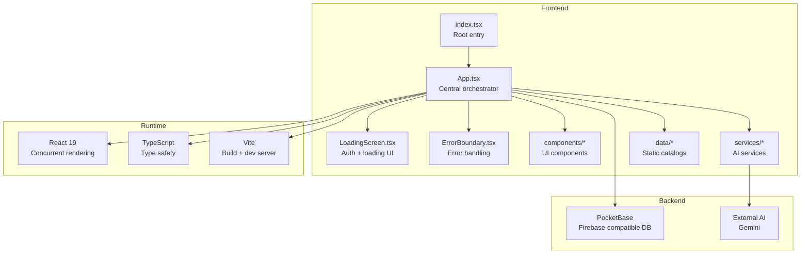
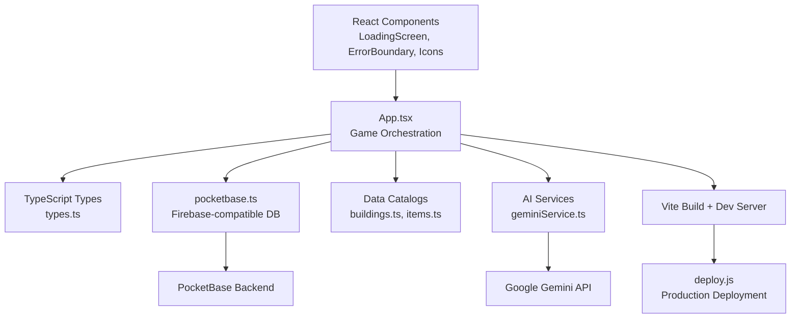
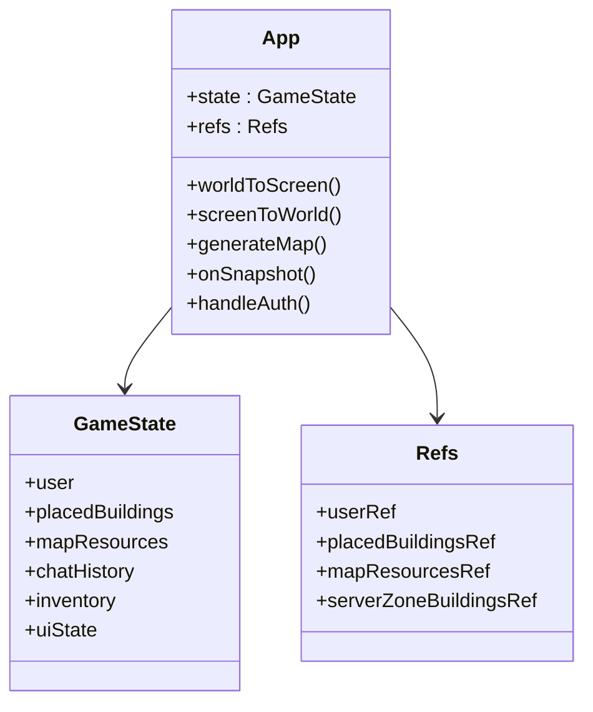
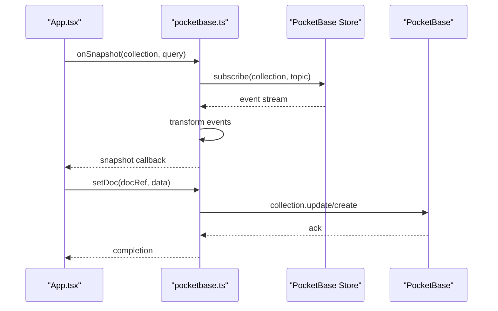
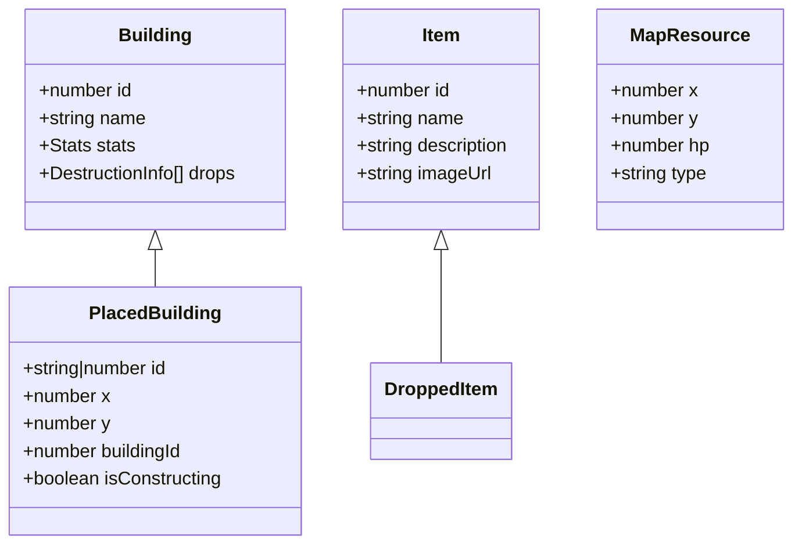
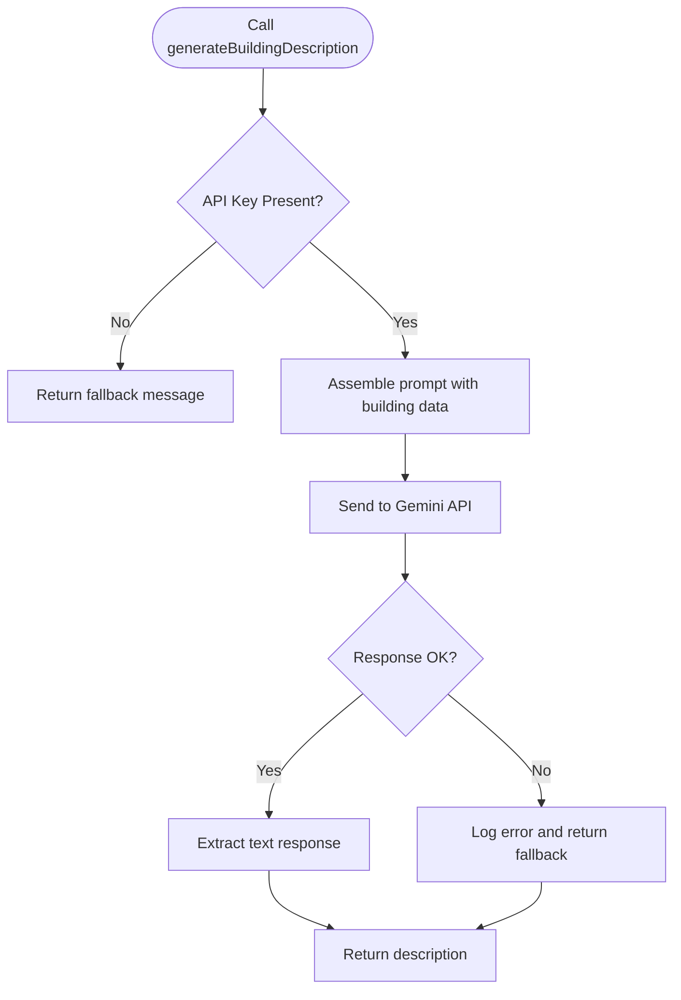
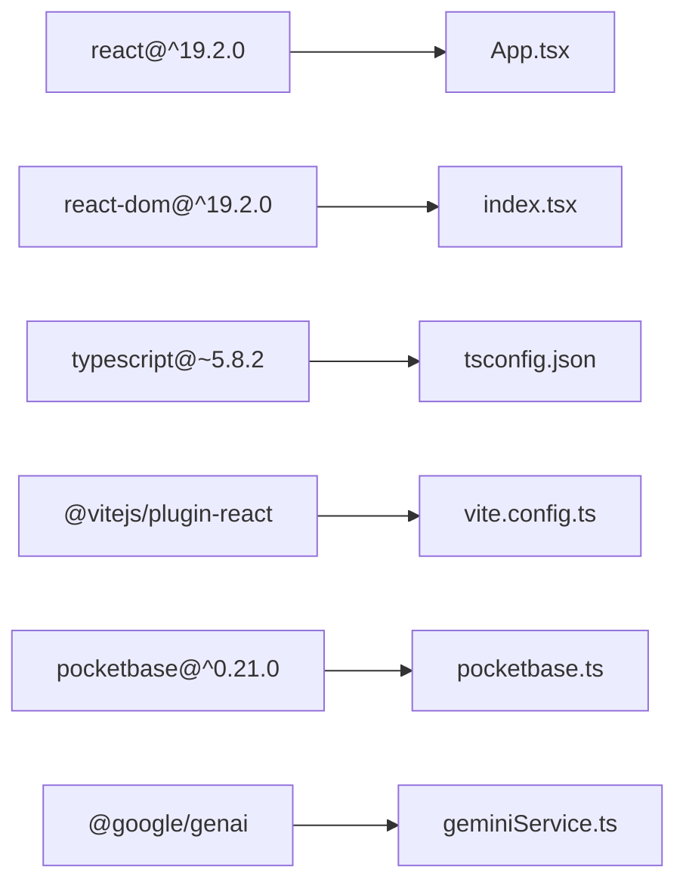

# System Architecture

<cite>
**Referenced Files in This Document**
- [App.tsx](file://App.tsx)
- [pocketbase.ts](file://src/pocketbase.ts)
- [types.ts](file://types.ts)
- [index.tsx](file://index.tsx)
- [package.json](file://package.json)
- [vite.config.ts](file://vite.config.ts)
- [tsconfig.json](file://tsconfig.json)
- [geminiService.ts](file://services/geminiService.ts)
- [buildings.ts](file://data/buildings.ts)
- [items.ts](file://data/items.ts)
- [ErrorBoundary.tsx](file://components/ErrorBoundary.tsx)
- [IconComponents.tsx](file://components/IconComponents.tsx)
- [SearchBar.tsx](file://components/SearchBar.tsx)
- [LoadingScreen.tsx](file://LoadingScreen.tsx)
- [deploy.js](file://deploy.js)
</cite>

## Table of Contents
1. [Introduction](#introduction)
2. [Project Structure](#project-structure)
3. [Core Components](#core-components)
4. [Architecture Overview](#architecture-overview)
5. [Detailed Component Analysis](#detailed-component-analysis)
6. [Dependency Analysis](#dependency-analysis)
7. [Performance Considerations](#performance-considerations)
8. [Troubleshooting Guide](#troubleshooting-guide)
9. [Conclusion](#conclusion)
10. [Appendices](#appendices)

## Introduction
This document describes the system architecture of the Basingsemmorpg platform, a real-time multiplayer browser-based city-builder game. The platform integrates a React 19 frontend with concurrent rendering, a PocketBase backend providing Firebase-compatible database access, and external AI services for dynamic content generation. The architecture emphasizes real-time synchronization, type safety through TypeScript, and scalable deployment patterns.

## Project Structure
The project follows a feature-based layout with clear separation of concerns:
- Frontend entry and root component orchestration
- Central game logic and state management
- Database abstraction layer mirroring Firebase APIs
- Shared type definitions and data catalogs
- UI components and reusable utilities
- AI service integration for dynamic content
- Build and deployment tooling

**Diagram sources**
- [index.tsx:1-20](file://index.tsx#L1-L20)
- [App.tsx:1-8217](file://App.tsx#L1-L8217)
- [LoadingScreen.tsx:1-198](file://LoadingScreen.tsx#L1-L198)
- [ErrorBoundary.tsx:1-78](file://components/ErrorBoundary.tsx#L1-L78)
- [IconComponents.tsx:1-187](file://components/IconComponents.tsx#L1-L187)
- [geminiService.ts:1-43](file://services/geminiService.ts#L1-L43)
- [buildings.ts:1-800](file://data/buildings.ts#L1-L800)
- [items.ts:1-415](file://data/items.ts#L1-L415)

**Section sources**
- [index.tsx:1-20](file://index.tsx#L1-L20)
- [App.tsx:1-8217](file://App.tsx#L1-L8217)
- [package.json:1-31](file://package.json#L1-L31)
- [vite.config.ts:1-29](file://vite.config.ts#L1-L29)
- [tsconfig.json:1-29](file://tsconfig.json#L1-L29)

## Core Components
- App.tsx: Central orchestrator managing game state, real-time subscriptions, UI state, and interactions. Implements MVVM-like separation of view (UI) and model (game state), with observers for real-time updates.
- pocketbase.ts: Firebase-compatible wrapper around PocketBase, providing auth, Firestore-style queries, and real-time subscriptions with robust error handling and sanitization.
- types.ts: Shared TypeScript interfaces defining game entities (Buildings, Items, PlacedBuilding, MapResource, etc.) ensuring type safety across components and services.
- UI Components: Modular React components (LoadingScreen, ErrorBoundary, IconComponents, SearchBar) encapsulating presentation and user interactions.
- AI Services: Gemini integration for dynamic content generation (e.g., building descriptions) with environment-based configuration.
- Data Catalogs: Static datasets for Buildings and Items, enabling deterministic gameplay logic and UI rendering.

**Section sources**
- [App.tsx:255-403](file://App.tsx#L255-L403)
- [pocketbase.ts:1-825](file://src/pocketbase.ts#L1-L825)
- [types.ts:1-197](file://types.ts#L1-L197)
- [geminiService.ts:1-43](file://services/geminiService.ts#L1-L43)
- [buildings.ts:1-800](file://data/buildings.ts#L1-L800)
- [items.ts:1-415](file://data/items.ts#L1-L415)

## Architecture Overview
The system employs a layered architecture:
- Presentation Layer: React components and UI screens
- Application Layer: App.tsx orchestrating game logic and state transitions
- Data Access Layer: pocketbase.ts abstracting PocketBase operations
- Domain Layer: TypeScript types and data catalogs
- Integration Layer: AI services and external APIs
- Infrastructure Layer: Vite build pipeline and deployment scripts

**Diagram sources**
- [App.tsx:1-8217](file://App.tsx#L1-L8217)
- [pocketbase.ts:1-825](file://src/pocketbase.ts#L1-L825)
- [types.ts:1-197](file://types.ts#L1-L197)
- [geminiService.ts:1-43](file://services/geminiService.ts#L1-L43)
- [buildings.ts:1-800](file://data/buildings.ts#L1-L800)
- [items.ts:1-415](file://data/items.ts#L1-L415)
- [vite.config.ts:1-29](file://vite.config.ts#L1-L29)
- [deploy.js:1-20](file://deploy.js#L1-L20)

## Detailed Component Analysis

### App.tsx: Central Game Orchestration
App.tsx serves as the MVVM-like controller:
- View Model: Extensive React state and refs managing UI and game state
- Model: Game entities, world state, and derived computations
- Controller: Event handlers, lifecycle effects, and real-time synchronization

Key patterns:
- Observer Pattern: Real-time subscriptions via onSnapshot for buildings, map resources, chat, and presence
- Factory Pattern: Dynamic content creation (map generation, building placement)
- MVVM Separation: Clear separation between UI rendering and game logic

**Diagram sources**
- [App.tsx:255-800](file://App.tsx#L255-L800)

**Section sources**
- [App.tsx:255-800](file://App.tsx#L255-L800)
- [App.tsx:720-778](file://App.tsx#L720-L778)
- [App.tsx:780-800](file://App.tsx#L780-L800)

### pocketbase.ts: Firebase-Compatible Database Wrapper
Provides a Firebase-like API surface over PocketBase:
- Authentication: signInWithEmailAndPassword, createUserWithEmailAndPassword, onAuthStateChanged
- Firestore Compatibility: doc, collection, getDoc, getDocs, setDoc, updateDoc, deleteDoc, onSnapshot
- Query Builder: query, where, orderBy, limit
- Real-time Subscriptions: Robust subscription with retry logic and throttling
- Data Transformation: wrapData/unwrapData for schema compatibility and type restoration

**Diagram sources**
- [pocketbase.ts:578-707](file://src/pocketbase.ts#L578-L707)
- [pocketbase.ts:338-356](file://src/pocketbase.ts#L338-L356)

**Section sources**
- [pocketbase.ts:14-121](file://src/pocketbase.ts#L14-L121)
- [pocketbase.ts:288-448](file://src/pocketbase.ts#L288-L448)
- [pocketbase.ts:578-707](file://src/pocketbase.ts#L578-L707)

### TypeScript Type System
Shared interfaces ensure type safety across the platform:
- Entity Types: Building, Item, PlacedBuilding, MapResource, DroppedItem, MarketListing, Clan, HistoryEntry, PrivateMessage
- Enumerations: BuildingType
- Utility Types: OperationType, IncrementSentinel

**Diagram sources**
- [types.ts:42-96](file://types.ts#L42-L96)
- [types.ts:100-147](file://types.ts#L100-L147)
- [types.ts:111-117](file://types.ts#L111-L117)

**Section sources**
- [types.ts:1-197](file://types.ts#L1-L197)

### AI Service Integration: Gemini
Dynamic content generation for game assets:
- Environment-based API key configuration
- Prompt engineering for building descriptions
- Error handling and fallback responses

**Diagram sources**
- [geminiService.ts:12-43](file://services/geminiService.ts#L12-L43)

**Section sources**
- [geminiService.ts:1-43](file://services/geminiService.ts#L1-L43)

### UI Components and Data Catalogs
- ErrorBoundary: Centralized error handling with reset capability
- IconComponents: Reusable SVG icon library
- SearchBar: Generic search input component
- LoadingScreen: Auth and loading progress UI
- Data catalogs: Static definitions for Buildings and Items

**Section sources**
- [ErrorBoundary.tsx:1-78](file://components/ErrorBoundary.tsx#L1-L78)
- [IconComponents.tsx:1-187](file://components/IconComponents.tsx#L1-L187)
- [SearchBar.tsx:1-29](file://components/SearchBar.tsx#L1-L29)
- [LoadingScreen.tsx:1-198](file://LoadingScreen.tsx#L1-L198)
- [buildings.ts:1-800](file://data/buildings.ts#L1-L800)
- [items.ts:1-415](file://data/items.ts#L1-L415)

## Dependency Analysis
Runtime and build dependencies:
- React 19 with concurrent features
- TypeScript for compile-time type safety
- Vite for fast development and optimized builds
- PocketBase for backend-as-a-service
- Google Gemini for AI content generation

**Diagram sources**
- [package.json:12-28](file://package.json#L12-L28)
- [vite.config.ts:2-3](file://vite.config.ts#L2-L3)
- [tsconfig.json:2-28](file://tsconfig.json#L2-L28)
- [pocketbase.ts:1-11](file://src/pocketbase.ts#L1-L11)
- [geminiService.ts:1-1](file://services/geminiService.ts#L1-L1)

**Section sources**
- [package.json:1-31](file://package.json#L1-L31)
- [vite.config.ts:1-29](file://vite.config.ts#L1-L29)
- [tsconfig.json:1-29](file://tsconfig.json#L1-L29)

## Performance Considerations
- Real-time throttling: onSnapshot applies throttling to reduce network load during rapid updates
- Zone-based subscriptions: Camera-position throttling limits the number of active subscriptions
- Batch operations: writeBatch and runTransaction consolidate writes
- Optimized rendering: React 19 concurrent features enable efficient rendering and scheduling
- Build optimization: Vite provides fast builds with source maps and chunk size warnings

[No sources needed since this section provides general guidance]

## Troubleshooting Guide
Common issues and resolutions:
- Authentication failures: Verify PocketBase endpoint and credentials; check onAuthStateChanged callbacks
- Real-time sync errors: Inspect handleFirestoreError logs; review subscription retry logic
- Build errors: Ensure TypeScript compilation passes; validate Vite configuration
- AI service failures: Confirm API key presence; check Gemini quota and rate limits
- Deployment issues: Review deploy.js steps; verify SCP and SSH connectivity

**Section sources**
- [pocketbase.ts:787-800](file://src/pocketbase.ts#L787-L800)
- [ErrorBoundary.tsx:24-31](file://components/ErrorBoundary.tsx#L24-L31)
- [deploy.js:1-20](file://deploy.js#L1-L20)

## Conclusion
The Basingsemmorpg platform demonstrates a well-structured real-time architecture combining React 19, PocketBase, and AI services. The MVVM-like design in App.tsx, the Firebase-compatible database wrapper, and strict TypeScript typing form a robust foundation for scalable multiplayer gameplay. The architecture supports real-time synchronization, dynamic content generation, and efficient deployment, providing a solid base for future enhancements.

## Appendices

### Technology Stack Decisions
- React 19: Concurrent rendering enables efficient UI updates and better user experience
- TypeScript: Compile-time type checking reduces runtime errors and improves maintainability
- Vite: Fast development server and optimized production builds
- PocketBase: Firebase-compatible backend with real-time subscriptions and flexible schema
- Google Gemini: On-demand AI content generation for dynamic game elements

**Section sources**
- [package.json:12-28](file://package.json#L12-L28)
- [vite.config.ts:1-29](file://vite.config.ts#L1-L29)
- [tsconfig.json:1-29](file://tsconfig.json#L1-L29)
- [pocketbase.ts:1-11](file://src/pocketbase.ts#L1-L11)
- [geminiService.ts:1-8](file://services/geminiService.ts#L1-L8)

### Infrastructure and Deployment
- Local development: Vite dev server with hot module replacement
- Production build: Vite build with sourcemaps and chunk size monitoring
- Deployment pipeline: Automated build, archive, transfer, and extraction to web server
- Backend hosting: PocketBase instance accessible via configured endpoint

**Section sources**
- [vite.config.ts:5-28](file://vite.config.ts#L5-L28)
- [deploy.js:1-20](file://deploy.js#L1-L20)
- [pocketbase.ts:8-11](file://src/pocketbase.ts#L8-L11)