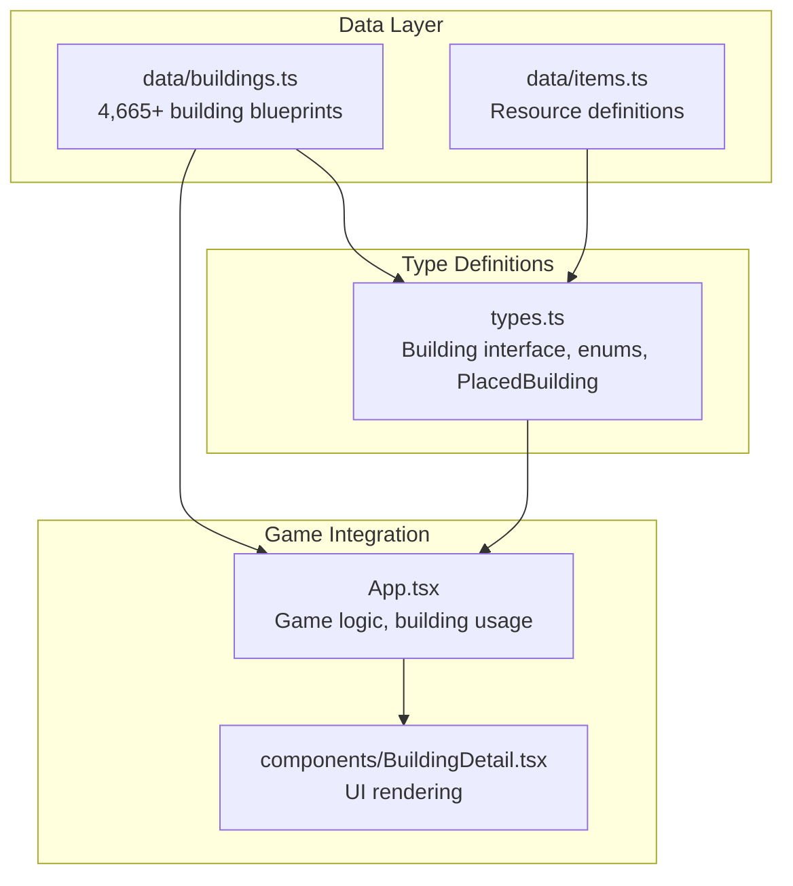
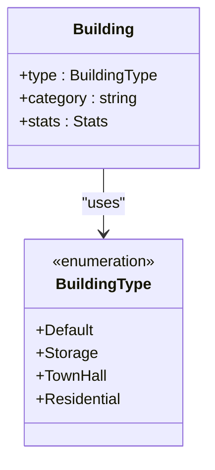
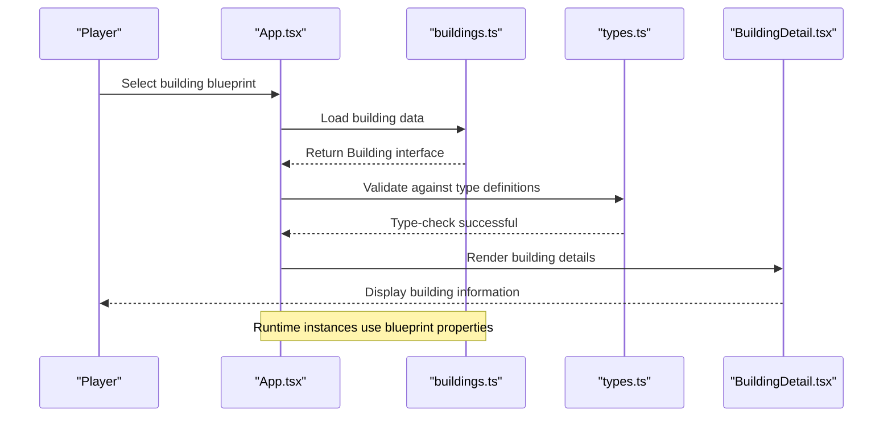
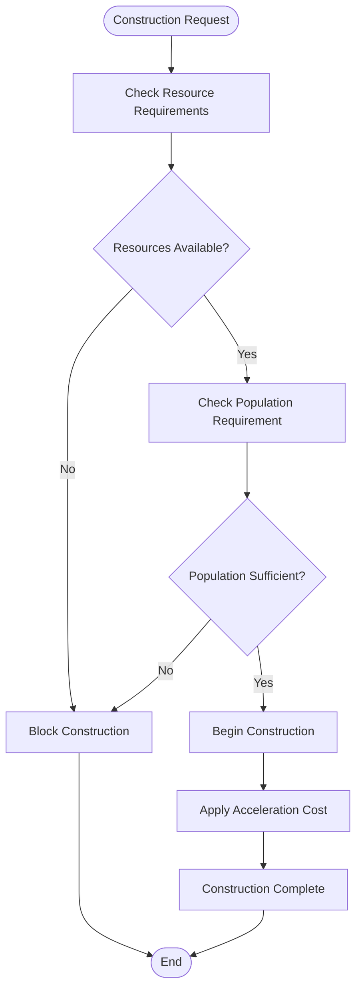
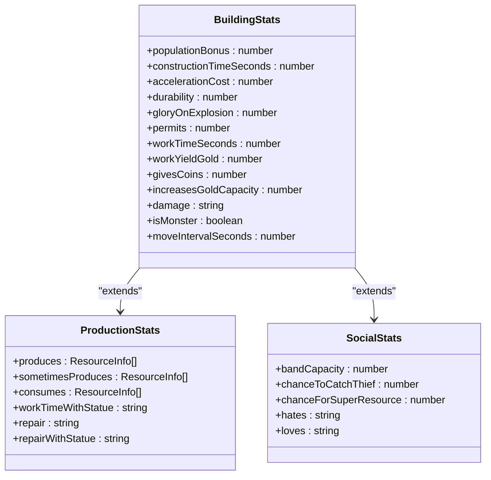
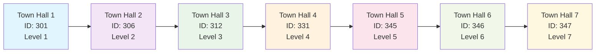
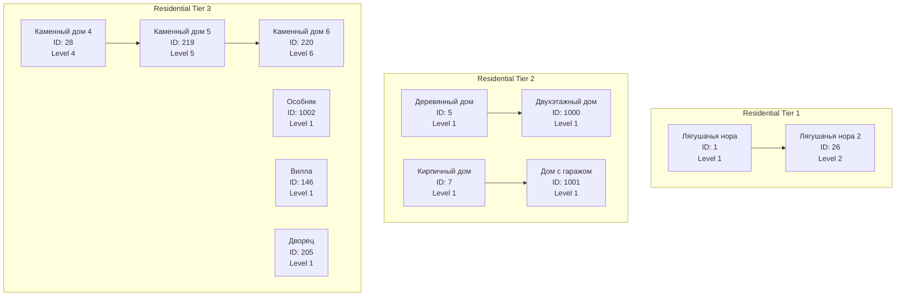
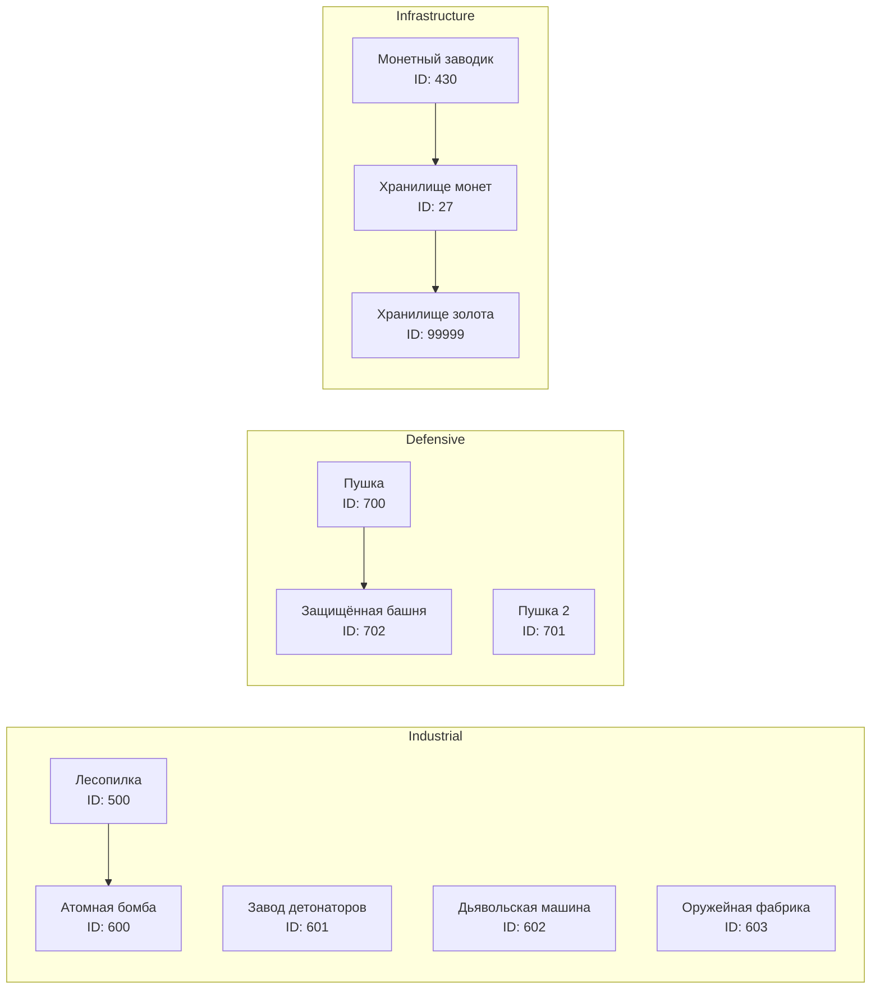
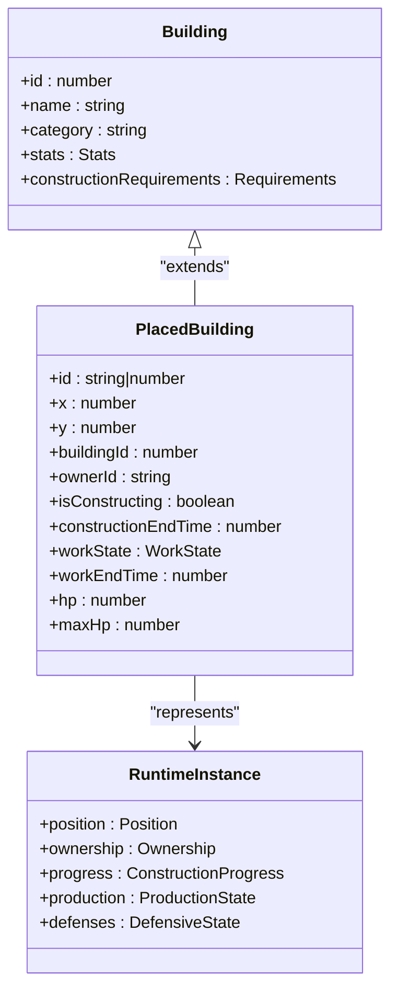
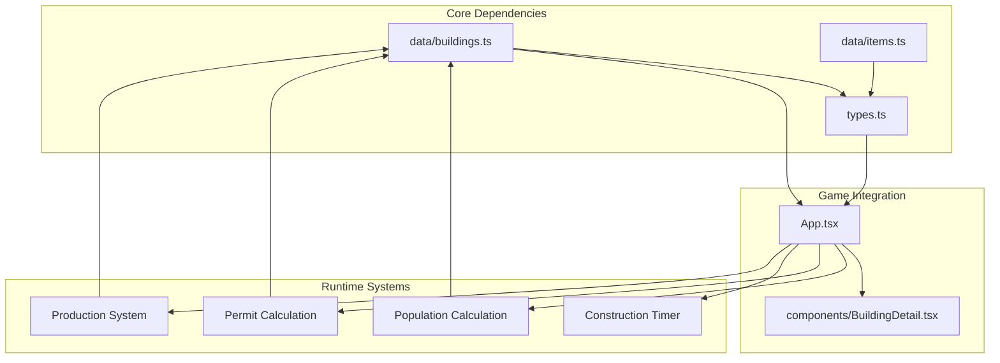

# Building Data Structure

<cite>
**Referenced Files in This Document**
- [buildings.ts](file://data/buildings.ts)
- [types.ts](file://types.ts)
- [items.ts](file://data/items.ts)
- [App.tsx](file://App.tsx)
- [BuildingDetail.tsx](file://components/BuildingDetail.tsx)
</cite>

## Table of Contents
1. [Introduction](#introduction)
2. [Project Structure](#project-structure)
3. [Core Components](#core-components)
4. [Architecture Overview](#architecture-overview)
5. [Detailed Component Analysis](#detailed-component-analysis)
6. [Dependency Analysis](#dependency-analysis)
7. [Performance Considerations](#performance-considerations)
8. [Troubleshooting Guide](#troubleshooting-guide)
9. [Conclusion](#conclusion)

## Introduction
This document provides comprehensive documentation for the building data structure that defines 4,665+ building configurations in the game. The building system encompasses the Building interface, BuildingType enum, construction requirements, stat system, and the relationship between building blueprints and runtime building instances. It covers how different building categories (TownHall, Residential, Business, etc.) are organized, explains the construction requirements system including population requirements and resource costs, documents the stat system covering construction time, acceleration costs, permits, durability, glory on explosion, and population bonuses, and provides guidance on adding new building types and extending the building data structure.

## Project Structure
The building data structure is primarily defined in the data/buildings.ts file and supported by shared types in types.ts. The App.tsx file integrates building data into the game logic, while components like BuildingDetail.tsx render building information to players. Items data is defined in data/items.ts and complements the building system by providing resource definitions used in construction and production.

**Diagram sources**
- [buildings.ts:1-50](file://data/buildings.ts#L1-L50)
- [types.ts:35-96](file://types.ts#L35-L96)
- [App.tsx:22-25](file://App.tsx#L22-L25)
- [BuildingDetail.tsx:1-20](file://components/BuildingDetail.tsx#L1-L20)

**Section sources**
- [buildings.ts:1-50](file://data/buildings.ts#L1-L50)
- [types.ts:35-96](file://types.ts#L35-L96)
- [App.tsx:22-25](file://App.tsx#L22-L25)

## Core Components

### Building Interface Structure
The Building interface defines the complete structure for all building blueprints:

**Primary Properties:**
- `id`: Unique building identifier
- `name`: Localized building name
- `englishName`: Optional English name for internationalization
- `category`: Building category (Жилые, Бизнес, Защита, etc.)
- `type`: BuildingType enum value
- `price`: Gold price for direct purchase
- `rubyPrice`: Ruby price for premium purchase
- `buildable`: Boolean indicating if building can be constructed

**Construction Requirements:**
- `constructionRequirements.resources`: Array of required resources with amounts and chances
- `constructionRequirements.population`: Population requirement for construction

**Stats System:**
- `stats.populationBonus`: Population provided by the building
- `stats.constructionTimeSeconds`: Base construction time in seconds
- `stats.accelerationCost`: Rubies needed to speed up construction
- `stats.durability`: Building health points
- `stats.gloryOnExplosion`: Glory gained when building explodes
- `stats.permits`: Additional building permits granted
- `stats.workTimeSeconds`: Production cycle time
- `stats.workYieldGold`: Gold produced per cycle
- `stats.givesCoins`: Direct coin bonus
- `stats.increasesGoldCapacity`: Gold storage capacity increase
- `stats.damage`: Attack damage for defensive buildings
- `stats.isMonster`: Indicates if building is a monster type
- `stats.moveIntervalSeconds`: Movement interval for mobile buildings

**Production and Consumption:**
- `stats.produces`: Resources produced during work cycles
- `stats.sometimesProduces`: Randomly produced resources with chances
- `stats.consumes`: Resources consumed during production

**Drop System:**
- `drops.frequent`: Common drop items with amounts and chances
- `drops.rare`: Rare drop items with amounts and chances

**Upgrade System:**
- `upgradesTo`: Next level building ID
- `upgradeCost`: Cost to upgrade to next level

**Destruction Information:**
- `destructionInfo`: Array of weapon types and their costs/damage for demolition

**Section sources**
- [types.ts:42-96](file://types.ts#L42-L96)

### BuildingType Enum
The BuildingType enum organizes buildings by functional categories:

**Diagram sources**
- [types.ts:35-40](file://types.ts#L35-L40)

**Section sources**
- [types.ts:35-40](file://types.ts#L35-L40)

### Building Categories Organization
Buildings are organized into distinct categories that define gameplay roles:

**TownHall Category**: Administrative buildings that grant permits and population bonuses
- Example: 301-347 series (Town Hall levels 1-7)

**Residential Category**: Housing buildings that provide population capacity
- Example: 1, 26, 5, 7, 1000, 1001, 28, 219, 220, 1002, 146, 205 series

**Business Category**: Resource production and trading buildings
- Example: Mushroom beds, farms, markets, auction houses

**Storage Category**: Capacity enhancement buildings
- Example: Gold Storage, Coin Storage series

**Defense Category**: Military and protective structures
- Example: Cannons, watchtowers, protected towers

**Industry Category**: Manufacturing and production facilities
- Example: Sawmills, factories, refineries

**Nature Category**: Environmental and terrain features
- Example: Mountains, rivers

**Monsters Category**: Mobile hostile structures
- Example: Killing huts, kind santa, gorynych

**Section sources**
- [buildings.ts:1-800](file://data/buildings.ts#L1-L800)
- [buildings.ts:800-1600](file://data/buildings.ts#L800-L1600)
- [buildings.ts:1600-2400](file://data/buildings.ts#L1600-L2400)

## Architecture Overview

The building system follows a blueprint-based architecture where building blueprints define static properties and runtime instances represent active constructions:

**Diagram sources**
- [App.tsx:22-25](file://App.tsx#L22-L25)
- [buildings.ts:1-50](file://data/buildings.ts#L1-L50)
- [types.ts:42-96](file://types.ts#L42-L96)

The relationship between blueprints and runtime instances is managed through the PlacedBuilding interface, which extends Building with runtime-specific properties like position, ownership, construction state, and work progress.

**Section sources**
- [types.ts:119-147](file://types.ts#L119-L147)
- [App.tsx:490-527](file://App.tsx#L490-L527)

## Detailed Component Analysis

### Construction Requirements System
The construction requirements system ensures balanced progression through resource and population constraints:

**Diagram sources**
- [buildings.ts:13-15](file://data/buildings.ts#L13-L15)
- [buildings.ts:96-101](file://data/buildings.ts#L96-L101)

Key construction mechanics:
- **Resource Requirements**: Specific quantities of items required for construction
- **Population Requirements**: Minimum population needed to construct
- **Acceleration System**: Rubies spent to reduce construction time
- **Upgrade Path**: Sequential building levels with increasing requirements

**Section sources**
- [buildings.ts:13-15](file://data/buildings.ts#L13-L15)
- [buildings.ts:96-101](file://data/buildings.ts#L96-L101)
- [buildings.ts:2656-2665](file://data/buildings.ts#L2656-L2665)

### Stat System Analysis
The stat system governs building functionality, production, and economic impact:

**Diagram sources**
- [types.ts:55-85](file://types.ts#L55-L85)

**Section sources**
- [types.ts:55-85](file://types.ts#L55-L85)

### Building Blueprints Examples

#### Town Hall Upgrade Blueprint
The Town Hall represents the core administrative building with progressive upgrades:

**Diagram sources**
- [buildings.ts:4-87](file://data/buildings.ts#L4-L87)
- [buildings.ts:88-172](file://data/buildings.ts#L88-L172)
- [buildings.ts:173-286](file://data/buildings.ts#L173-L286)

Key characteristics of Town Hall upgrades:
- **Population Bonus**: Increases from 8 to 50 population capacity
- **Permits**: Increases from 5 to 2000 building permits
- **Construction Time**: Extends from 1 second to 7,000 seconds
- **Durability**: Grows from 40 to 6,432 health points
- **Upgrade Costs**: Progressively higher resource and gold costs

**Section sources**
- [buildings.ts:4-87](file://data/buildings.ts#L4-L87)
- [buildings.ts:88-172](file://data/buildings.ts#L88-L172)
- [buildings.ts:173-286](file://data/buildings.ts#L173-L286)

#### Residential Building Blueprint
Residential buildings provide population housing with tiered improvements:

**Diagram sources**
- [buildings.ts:326-430](file://data/buildings.ts#L326-L430)
- [buildings.ts:431-508](file://data/buildings.ts#L431-L508)
- [buildings.ts:509-790](file://data/buildings.ts#L509-L790)

Residential building characteristics:
- **Population Capacity**: Ranges from 2 to 100 population units
- **Construction Times**: From 40 seconds to 27,783 seconds
- **Upgrade Paths**: Many residential buildings have multiple upgrade levels
- **Special Features**: Some provide coin generation or unique bonuses

**Section sources**
- [buildings.ts:326-430](file://data/buildings.ts#L326-L430)
- [buildings.ts:431-508](file://data/buildings.ts#L431-L508)
- [buildings.ts:509-790](file://data/buildings.ts#L509-L790)

#### Specialized Structure Blueprint
Specialized buildings serve unique gameplay functions:

**Diagram sources**
- [buildings.ts:2100-2146](file://data/buildings.ts#L2100-L2146)
- [buildings.ts:2475-2510](file://data/buildings.ts#L2475-L2510)
- [buildings.ts:2511-2556](file://data/buildings.ts#L2511-L2556)
- [buildings.ts:2903-2938](file://data/buildings.ts#L2903-L2938)
- [buildings.ts:3178-3205](file://data/buildings.ts#L3178-L3205)

Specialized building categories:
- **Industrial**: Resource processing and manufacturing facilities
- **Defensive**: Military structures with attack capabilities
- **Infrastructure**: Economic support buildings with storage and production

**Section sources**
- [buildings.ts:2100-2146](file://data/buildings.ts#L2100-L2146)
- [buildings.ts:2475-2510](file://data/buildings.ts#L2475-L2510)
- [buildings.ts:2511-2556](file://data/buildings.ts#L2511-L2556)
- [buildings.ts:2903-2938](file://data/buildings.ts#L2903-L2938)
- [buildings.ts:3178-3205](file://data/buildings.ts#L3178-L3205)

### Relationship Between Blueprints and Runtime Instances
The relationship between building blueprints and runtime instances is managed through the PlacedBuilding interface:

**Diagram sources**
- [types.ts:42-96](file://types.ts#L42-L96)
- [types.ts:119-147](file://types.ts#L119-L147)

Runtime instance characteristics:
- **Position Management**: X/Y coordinates and zone identification
- **Ownership Tracking**: Owner ID and name for multiplayer contexts
- **Construction State**: Whether building is under construction
- **Production Cycles**: Work state and completion timing
- **Health Management**: Current and maximum durability
- **Upgrade Progression**: Track construction completion and level advancement

**Section sources**
- [types.ts:119-147](file://types.ts#L119-L147)
- [App.tsx:490-527](file://App.tsx#L490-L527)

## Dependency Analysis

The building system has several key dependencies and relationships:

**Diagram sources**
- [App.tsx:490-527](file://App.tsx#L490-L527)
- [App.tsx:520-542](file://App.tsx#L520-L542)
- [App.tsx:210-243](file://App.tsx#L210-L243)

Key dependency relationships:
- **Data Dependencies**: Buildings depend on types for validation and on items for resource definitions
- **Game Logic Dependencies**: App.tsx depends on building data for calculations and UI rendering
- **Runtime Dependencies**: Population and permit calculations depend on building stats
- **UI Dependencies**: BuildingDetail.tsx depends on building data for display

**Section sources**
- [App.tsx:490-542](file://App.tsx#L490-L542)
- [BuildingDetail.tsx:46-148](file://components/BuildingDetail.tsx#L46-L148)

## Performance Considerations
The building data structure is designed for optimal performance with 4,665+ entries:

### Memory Optimization
- **Sparse Properties**: Optional properties prevent unnecessary memory allocation
- **Shared References**: Common resource definitions are referenced rather than duplicated
- **Efficient Arrays**: Building arrays are optimized for sequential access patterns

### Computation Efficiency
- **Category-Based Filtering**: Buildings are organized by category for efficient filtering
- **Stat Caching**: Calculated values (population, permits) are cached in App.tsx state
- **Lazy Loading**: Building details are loaded only when needed in UI components

### Scaling Considerations
- **Modular Design**: Separate concerns between data definition, type validation, and game logic
- **Extensible Structure**: New building types can be added without affecting existing systems
- **Performance Monitoring**: Built-in mechanisms for tracking construction times and resource usage

## Troubleshooting Guide

### Common Building Issues
**Construction Failures:**
- Verify resource availability in constructionRequirements.resources
- Check population requirements meet current population
- Confirm acceleration cost rubies are sufficient

**Upgrade Problems:**
- Ensure upgradeCost matches current building level requirements
- Verify upgradesTo references valid building ID
- Check resource requirements for next level

**Stat Calculation Errors:**
- Validate populationBonus values are positive integers
- Confirm constructionTimeSeconds is reasonable for building type
- Check durability values align with building category

### Debugging Tools
The system includes several debugging mechanisms:
- **Console Logging**: Construction timers and resource checks
- **State Validation**: Population and permit calculations
- **UI Feedback**: Building detail component displays all stat information

**Section sources**
- [App.tsx:210-243](file://App.tsx#L210-L243)
- [BuildingDetail.tsx:46-148](file://components/BuildingDetail.tsx#L46-L148)

## Conclusion
The building data structure provides a comprehensive foundation for the game's construction and economic systems. With 4,665+ building configurations organized by functional categories, the system supports complex gameplay mechanics including resource management, population growth, industrial production, and military defense. The blueprint-based architecture ensures scalability and maintainability while the robust stat system enables sophisticated economic modeling. The integration with runtime instances allows for dynamic gameplay while maintaining performance efficiency. Future extensions can leverage the modular design to add new building types, categories, and gameplay mechanics without disrupting existing functionality.