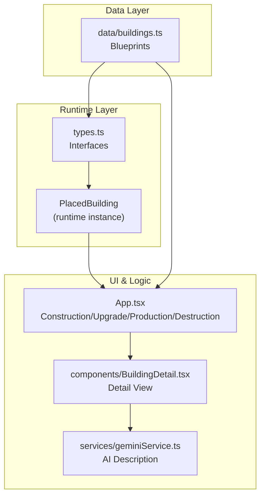
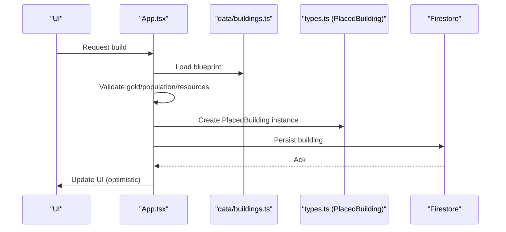
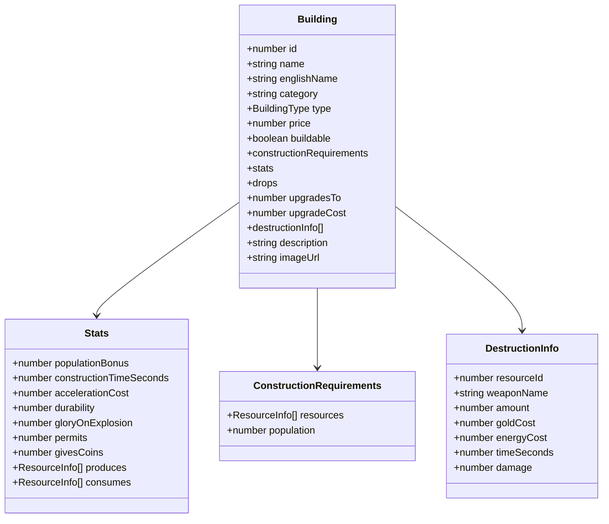
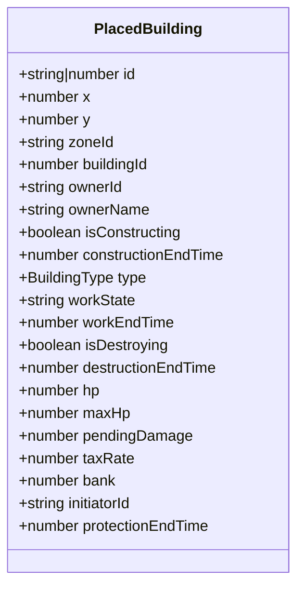
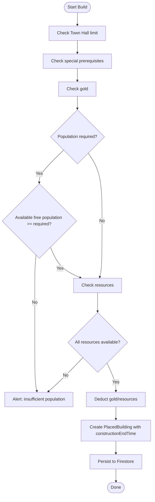
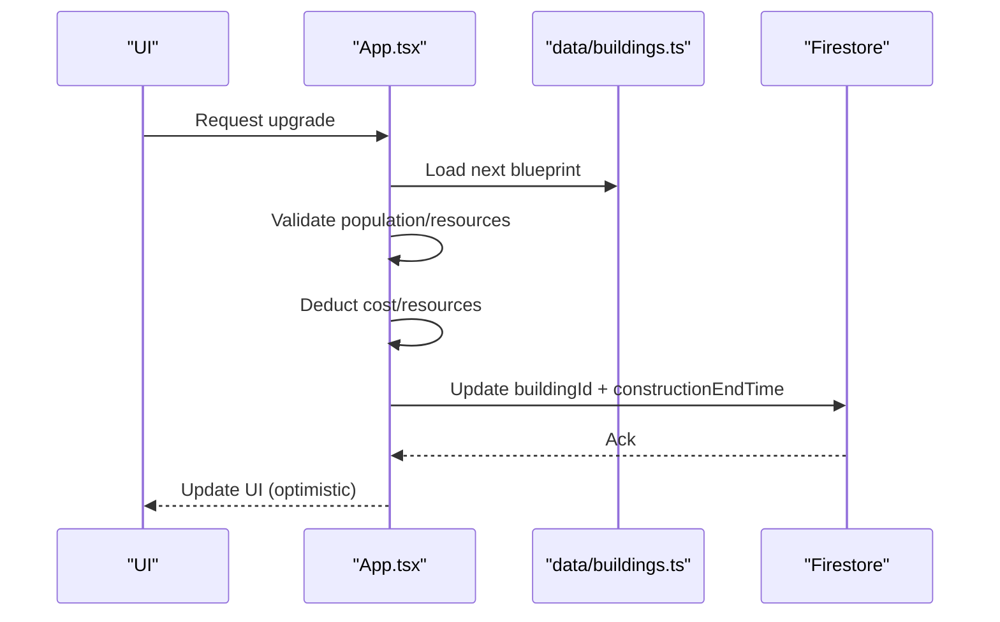
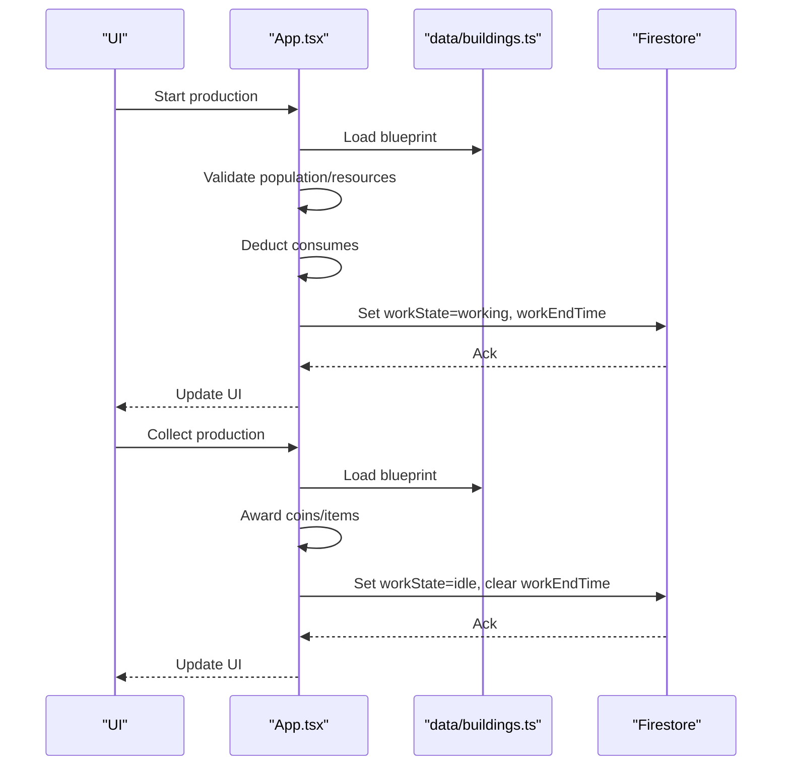
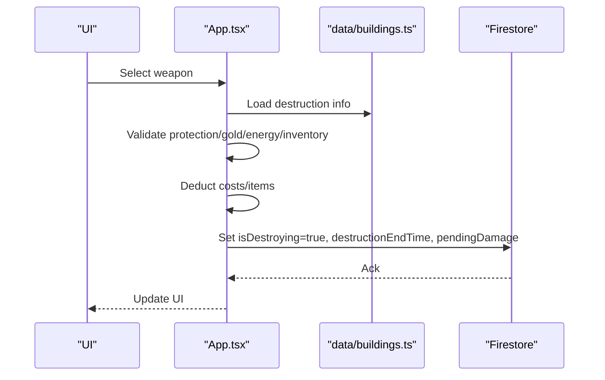
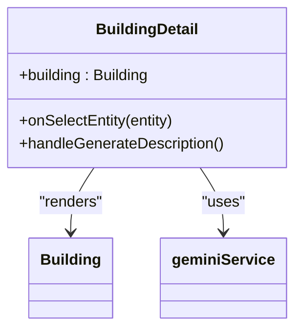
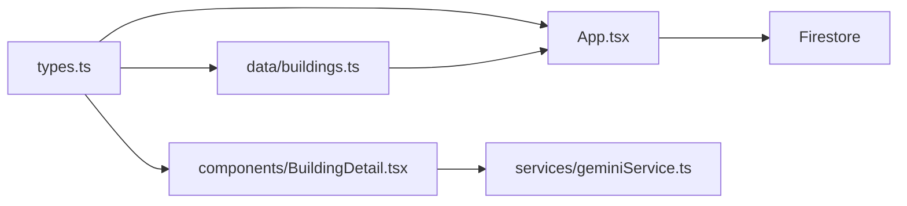

# Building System

<cite>
**Referenced Files in This Document**
- [data/buildings.ts](file://data/buildings.ts)
- [types.ts](file://types.ts)
- [App.tsx](file://App.tsx)
- [components/BuildingDetail.tsx](file://components/BuildingDetail.tsx)
- [geminiService.ts](file://services/geminiService.ts)
</cite>

## Table of Contents
1. [Introduction](#introduction)
2. [Project Structure](#project-structure)
3. [Core Components](#core-components)
4. [Architecture Overview](#architecture-overview)
5. [Detailed Component Analysis](#detailed-component-analysis)
6. [Dependency Analysis](#dependency-analysis)
7. [Performance Considerations](#performance-considerations)
8. [Troubleshooting Guide](#troubleshooting-guide)
9. [Conclusion](#conclusion)

## Introduction
This document explains the building system that powers over 4,665 building configurations and construction mechanics. It covers the building data model, construction cost and validation logic, upgrade paths, destruction mechanics, integration with resource management and production chains, and combat mechanics. It also documents the building detail view component and how it renders building information. The goal is to help both beginners and experienced developers implement new building types efficiently.

## Project Structure
The building system spans three primary areas:
- Data definition: centralized building blueprints
- Runtime model: placed building instances persisted and updated
- UI and logic: construction, upgrades, production, and destruction flows

**Diagram sources**
- [data/buildings.ts:1-120](file://data/buildings.ts#L1-L120)
- [types.ts:42-147](file://types.ts#L42-L147)
- [App.tsx:1470-1555](file://App.tsx#L1470-L1555)
- [components/BuildingDetail.tsx:46-151](file://components/BuildingDetail.tsx#L46-L151)

**Section sources**
- [data/buildings.ts:1-120](file://data/buildings.ts#L1-L120)
- [types.ts:42-147](file://types.ts#L42-L147)
- [App.tsx:1470-1555](file://App.tsx#L1470-L1555)
- [components/BuildingDetail.tsx:46-151](file://components/BuildingDetail.tsx#L46-L151)

## Core Components
- Building blueprint model: defines stats, costs, requirements, production/consumption, drops, and destruction info
- PlacedBuilding runtime model: tracks position, ownership, construction/production timers, HP, and state
- UI detail view: renders blueprint attributes, production/consumption, drops, and destruction options
- Construction/validation logic: checks gold, population, and resource availability before placing
- Upgrade logic: validates requirements and applies acceleration cost
- Production logic: starts work cycles, consumes inputs, yields outputs and coins
- Destruction logic: validates resources, gold, and energy; schedules timed destruction

**Section sources**
- [data/buildings.ts:42-96](file://data/buildings.ts#L42-L96)
- [types.ts:119-147](file://types.ts#L119-L147)
- [components/BuildingDetail.tsx:46-151](file://components/BuildingDetail.tsx#L46-L151)
- [App.tsx:1470-1555](file://App.tsx#L1470-L1555)
- [App.tsx:4480-4545](file://App.tsx#L4480-L4545)
- [App.tsx:4547-4679](file://App.tsx#L4547-L4679)
- [App.tsx:5241-5324](file://App.tsx#L5241-L5324)

## Architecture Overview
The system separates static blueprints from dynamic runtime instances. Blueprints live in data/buildings.ts and define all building capabilities. At runtime, PlacedBuilding instances represent actual buildings on the map, with Firestore persistence and optimistic UI updates. Construction, upgrades, production, and destruction are coordinated in App.tsx, which reads blueprint data and updates PlacedBuilding state.

**Diagram sources**
- [App.tsx:1470-1555](file://App.tsx#L1470-L1555)
- [data/buildings.ts:42-96](file://data/buildings.ts#L42-L96)
- [types.ts:119-147](file://types.ts#L119-L147)

## Detailed Component Analysis

### Building Data Model
- Blueprint fields include identifiers, name, category, type, pricing, buildability flag, construction requirements (population and resources), stats (construction time, acceleration cost, durability, glory on explosion, population bonus, permits, givesCoins, produces/consumes), drops (frequent/rare), upgrade targets and cost, destruction info, description, and image URL.
- Stats support production chains via produces/consumes arrays and sometimesProduces for probabilistic outputs.
- Destruction info enumerates weapon options with resource cost, gold/energy cost, time, and optional damage.

**Diagram sources**
- [data/buildings.ts:42-96](file://data/buildings.ts#L42-L96)
- [types.ts:25-96](file://types.ts#L25-L96)

**Section sources**
- [data/buildings.ts:42-96](file://data/buildings.ts#L42-L96)
- [types.ts:25-96](file://types.ts#L25-L96)

### Runtime Building Instances (PlacedBuilding)
- PlacedBuilding captures the actual building state on the map: position, zone, ownership, construction timers, work state and timers, HP/maxHP, pending damage, tax rate, bank, protection end time, and flags for construction/destroying.
- It is persisted to Firestore and updated optimistically in the UI.

**Diagram sources**
- [types.ts:119-147](file://types.ts#L119-L147)

**Section sources**
- [types.ts:119-147](file://types.ts#L119-L147)

### Construction Mechanics
- Validation checks:
  - Town Hall uniqueness
  - Special prerequisites (e.g., requiring a clan castle for watchtowers)
  - Sufficient gold
  - Required population (excluding Town Hall)
  - Required resources (inventory amounts vs. blueprint requirements)
- On success:
  - Deducts price and required resources
  - Creates a PlacedBuilding with constructionEndTime
  - Updates UI optimistically and persists to Firestore

**Diagram sources**
- [App.tsx:1470-1555](file://App.tsx#L1470-L1555)

**Section sources**
- [App.tsx:1470-1555](file://App.tsx#L1470-L1555)

### Upgrade Path Mechanics
- Validates:
  - Free population availability (excluding Town Hall)
  - Resource availability for the next tier
- On success:
  - Deducts upgrade cost and required resources
  - Triggers visual effects and logs
  - Persists the new buildingId, constructionEndTime, and stats

**Diagram sources**
- [App.tsx:4480-4545](file://App.tsx#L4480-L4545)
- [data/buildings.ts:42-96](file://data/buildings.ts#L42-L96)

**Section sources**
- [App.tsx:4480-4545](file://App.tsx#L4480-L4545)

### Production Chains and Resource Management
- Start production:
  - Validates population and required resources
  - Deducts consumption inputs
  - Sets workEndTime and workState to working
- Collect production:
  - Awards coins and produces items according to blueprint rules
  - Applies special overrides for certain building tiers
  - Transitions workState to idle and clears workEndTime

**Diagram sources**
- [App.tsx:4547-4679](file://App.tsx#L4547-L4679)
- [data/buildings.ts:42-96](file://data/buildings.ts#L42-L96)

**Section sources**
- [App.tsx:4547-4679](file://App.tsx#L4547-L4679)

### Destruction Mechanics
- Validates:
  - Protection window (cannot explode during protection)
  - Sufficient gold, energy, and weapon items
- On success:
  - Deducts costs and weapon items
  - Schedules destructionEndTime and sets isDestroying with pendingDamage
  - Logs destruction event

**Diagram sources**
- [App.tsx:5241-5324](file://App.tsx#L5241-L5324)
- [data/buildings.ts:25-33](file://data/buildings.ts#L25-L33)

**Section sources**
- [App.tsx:5241-5324](file://App.tsx#L5241-L5324)

### Building Detail View Component
- Renders:
  - Basic info: name, category, image, price/ruby price
  - Stats: durability, glory on explosion, population bonus/takes, permits, construction time, acceleration cost
  - Requirements: resources and population
  - Production/consumption: produces/consumes lists
  - Drops: frequent/rare items and coin yield
  - Destruction info: weapon table with cost/time/damage
  - AI-generated description button (via geminiService)
- Supports clicking item names to navigate to item details

**Diagram sources**
- [components/BuildingDetail.tsx:46-151](file://components/BuildingDetail.tsx#L46-L151)
- [services/geminiService.ts](file://services/geminiService.ts)

**Section sources**
- [components/BuildingDetail.tsx:46-151](file://components/BuildingDetail.tsx#L46-L151)

## Dependency Analysis
- data/buildings.ts depends on types.ts for typed ResourceInfo and Building interfaces.
- App.tsx depends on data/buildings.ts for blueprint data and types.ts for PlacedBuilding and enums.
- components/BuildingDetail.tsx depends on types.ts for Building and on geminiService.ts for AI description generation.
- Firestore updates are coordinated in App.tsx for construction, upgrades, production, and destruction.

**Diagram sources**
- [types.ts:25-96](file://types.ts#L25-L96)
- [data/buildings.ts:42-96](file://data/buildings.ts#L42-L96)
- [App.tsx:1470-1555](file://App.tsx#L1470-L1555)
- [components/BuildingDetail.tsx:46-151](file://components/BuildingDetail.tsx#L46-L151)

**Section sources**
- [types.ts:25-96](file://types.ts#L25-L96)
- [data/buildings.ts:42-96](file://data/buildings.ts#L42-L96)
- [App.tsx:1470-1555](file://App.tsx#L1470-L1555)
- [components/BuildingDetail.tsx:46-151](file://components/BuildingDetail.tsx#L46-L151)

## Performance Considerations
- Construction and destruction use optimistic UI updates to reduce perceived latency; Firestore writes are applied afterward with error handling.
- Production loops and game loop logic iterate over placedBuildings; keep selectors efficient (e.g., filter by state flags).
- Large-scale destruction scheduling relies on timestamps; ensure clients reconcile state consistently.

[No sources needed since this section provides general guidance]

## Troubleshooting Guide
Common issues and resolutions:
- Construction validation failures
  - Insufficient gold: ensure playerGold meets building.price
  - Population requirement: verify maxPopulation - currentPopulation >= required
  - Missing resources: confirm inventory contains required amounts
- Upgrade validation failures
  - Population and resource checks mirror construction logic
- Production start failures
  - Population cap exceeded or missing consumables
- Destruction failures
  - Protection window active, insufficient gold/energy, or weapon count below required
- UI desync
  - Confirm optimistic updates align with Firestore acknowledgments and error handlers

**Section sources**
- [App.tsx:1470-1555](file://App.tsx#L1470-L1555)
- [App.tsx:4480-4545](file://App.tsx#L4480-L4545)
- [App.tsx:4547-4679](file://App.tsx#L4547-L4679)
- [App.tsx:5241-5324](file://App.tsx#L5241-L5324)

## Conclusion
The building system combines a rich, typed blueprint model with robust runtime state management and a clear separation of concerns across data, runtime, and UI layers. Construction, upgrades, production, and destruction are implemented with validation, optimistic updates, and Firestore persistence. The building detail view provides comprehensive information and integrates with AI description generation. New building types can be added by extending the blueprint definitions and ensuring logic coverage in App.tsx where necessary.