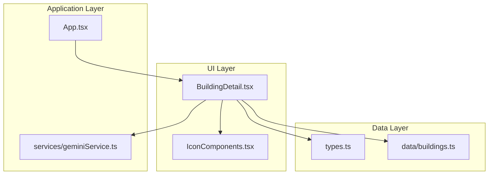
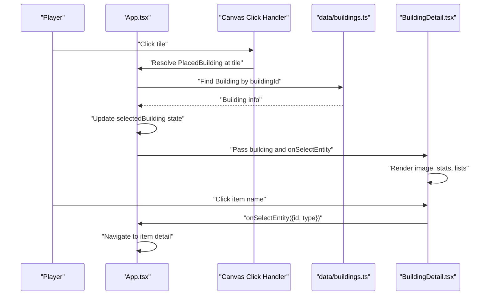
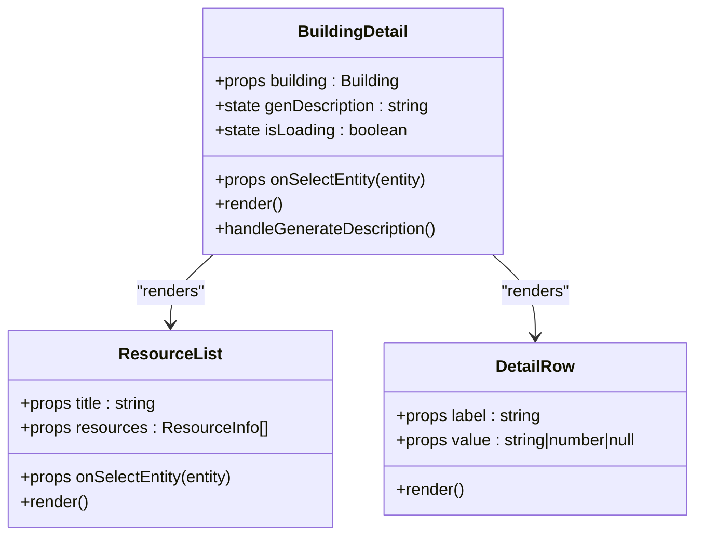
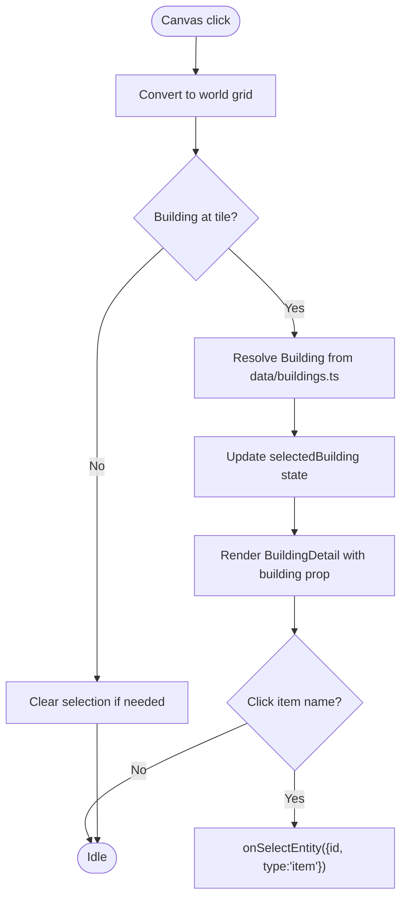
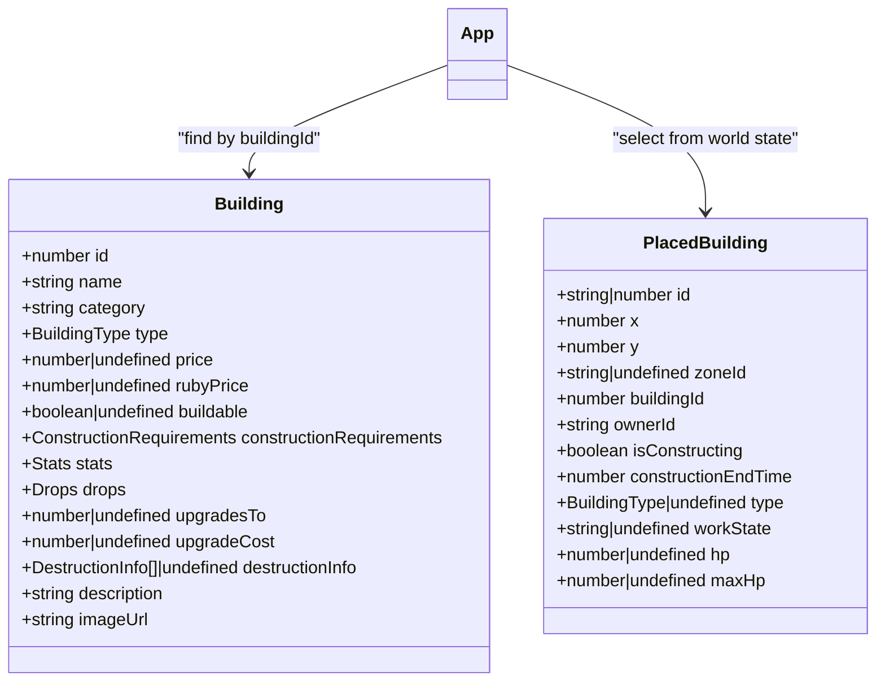
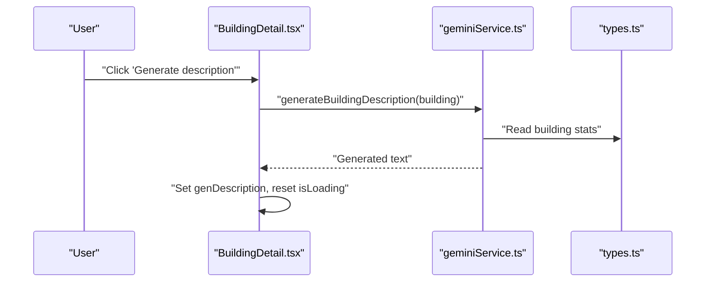
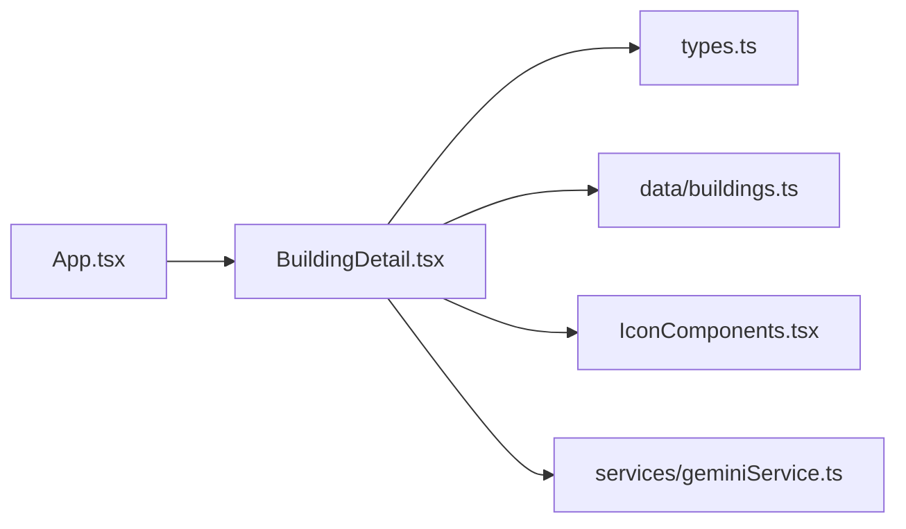

# Building UI Components

<cite>
**Referenced Files in This Document**
- [BuildingDetail.tsx](file://components/BuildingDetail.tsx)
- [buildings.ts](file://data/buildings.ts)
- [App.tsx](file://App.tsx)
- [types.ts](file://types.ts)
- [IconComponents.tsx](file://components/IconComponents.tsx)
- [geminiService.ts](file://services/geminiService.ts)
</cite>

## Table of Contents
1. [Introduction](#introduction)
2. [Project Structure](#project-structure)
3. [Core Components](#core-components)
4. [Architecture Overview](#architecture-overview)
5. [Detailed Component Analysis](#detailed-component-analysis)
6. [Dependency Analysis](#dependency-analysis)
7. [Performance Considerations](#performance-considerations)
8. [Troubleshooting Guide](#troubleshooting-guide)
9. [Conclusion](#conclusion)
10. [Appendices](#appendices)

## Introduction
This document explains the building-related UI components with a focus on the BuildingDetail component and the building selection workflow. It covers how building details are rendered (image, stats, production/consumption, drops, and destruction info), how the selection flow moves from map interaction to the detail panel, and how the component integrates with the main game state and building data structures. It also provides guidance on responsive design, accessibility, and extending the UI for new building types.

## Project Structure
The building UI ecosystem centers around:
- A typed building data source that defines all buildings and their stats
- A main game application that manages world state, selection, and rendering
- A dedicated BuildingDetail component that renders building information and interactive controls
- Supporting services for AI-powered descriptions and iconography

**Diagram sources**
- [BuildingDetail.tsx:1-151](file://components/BuildingDetail.tsx#L1-L151)
- [buildings.ts:1-800](file://data/buildings.ts#L1-L800)
- [App.tsx:1-8217](file://App.tsx#L1-L8217)
- [types.ts:1-197](file://types.ts#L1-L197)
- [IconComponents.tsx:1-187](file://components/IconComponents.tsx#L1-L187)
- [geminiService.ts:1-43](file://services/geminiService.ts#L1-L43)

**Section sources**
- [BuildingDetail.tsx:1-151](file://components/BuildingDetail.tsx#L1-L151)
- [buildings.ts:1-800](file://data/buildings.ts#L1-L800)
- [App.tsx:1-8217](file://App.tsx#L1-L8217)
- [types.ts:1-197](file://types.ts#L1-L197)
- [IconComponents.tsx:1-187](file://components/IconComponents.tsx#L1-L187)
- [geminiService.ts:1-43](file://services/geminiService.ts#L1-L43)

## Core Components
- BuildingDetail: Renders a building’s image, name, description, stats, requirements, production/consumption, drops, and optional AI-generated description. Includes an action button to trigger AI generation and displays loading states.
- Building data: Typed definitions and sample building entries define categories, stats, costs, and destructive profiles.
- Application integration: The main App manages selection state, map interactions, and passes selected building data to the detail panel.

Key responsibilities:
- BuildingDetail: Render UI, manage local loading state for AI description, and route item clicks to the parent via a callback.
- App: Manage selection state, resolve building info from placed buildings, and pass it to the detail panel.

**Section sources**
- [BuildingDetail.tsx:46-148](file://components/BuildingDetail.tsx#L46-L148)
- [buildings.ts:1-800](file://data/buildings.ts#L1-L800)
- [App.tsx:1140-1160](file://App.tsx#L1140-L1160)

## Architecture Overview
The building selection and detail rendering pipeline connects map interactions to the detail panel and data sources.

**Diagram sources**
- [App.tsx:1115-1160](file://App.tsx#L1115-L1160)
- [App.tsx:5422-5429](file://App.tsx#L5422-L5429)
- [buildings.ts:1-800](file://data/buildings.ts#L1-L800)
- [BuildingDetail.tsx:22-43](file://components/BuildingDetail.tsx#L22-L43)

## Detailed Component Analysis

### BuildingDetail Component
The BuildingDetail component is a self-contained UI panel that renders comprehensive building information and interactive controls.

- Props
  - building: Building — The building definition to render.
  - onSelectEntity: (entity: { id: number; type: 'item' | 'building' }) => void — Callback invoked when clicking an item name in requirements, production, consumption, or drops.

- State
  - genDescription: string — Stores the AI-generated description after user action.
  - isLoading: boolean — Controls the AI generation button state and loading indicator.

- Rendering sections
  - Header: image, name, localized/english name, category, and id.
  - Description: static description and an action to generate a dynamic description via AI.
  - Stats grid: price (coins or rubies), durability, glory on explosion, population bonus, permits, construction time, acceleration cost.
  - Requirements: population requirement and a list of required resources; clicking a resource name triggers onSelectEntity.
  - Production/Consumption: lists of produced and consumed resources; clicking an item name triggers onSelectEntity.
  - Drops: frequent and rare drops; clicking an item name triggers onSelectEntity.
  - Destruction info: optional table showing weapons, amounts, time, and damage.

- Interactions
  - AI description generation: Button invokes a service to generate a description based on building stats and displays it in a bordered panel below the button.
  - Item navigation: Resource and drop names are clickable and route to item details via the provided callback.

- Accessibility and UX
  - Clear semantic structure with headings and lists.
  - Hover and click affordances for clickable items.
  - Disabled states during AI generation.

- Responsive design
  - Grid layout adapts from single column on small screens to two-column layout on larger screens for stats and lists.

**Diagram sources**
- [BuildingDetail.tsx:7-10](file://components/BuildingDetail.tsx#L7-L10)
- [BuildingDetail.tsx:12-20](file://components/BuildingDetail.tsx#L12-L20)
- [BuildingDetail.tsx:22-43](file://components/BuildingDetail.tsx#L22-L43)
- [BuildingDetail.tsx:46-148](file://components/BuildingDetail.tsx#L46-L148)

**Section sources**
- [BuildingDetail.tsx:7-10](file://components/BuildingDetail.tsx#L7-L10)
- [BuildingDetail.tsx:12-20](file://components/BuildingDetail.tsx#L12-L20)
- [BuildingDetail.tsx:22-43](file://components/BuildingDetail.tsx#L22-L43)
- [BuildingDetail.tsx:46-148](file://components/BuildingDetail.tsx#L46-L148)

### Building Selection Workflow
The selection flow begins with a click on the game canvas and ends with the detail panel populated with building data.

- Canvas click resolution
  - Convert screen coordinates to world grid coordinates.
  - Detect if a building exists at the clicked tile and is alive (hp > 0 or undefined).
  - If a building is present, resolve its info from the building data source and update the selectedBuilding state.

- Detail panel display
  - The selectedBuilding state drives the BuildingDetail component props.
  - The component renders the building’s image, stats, and lists.

- Item navigation from detail panel
  - When a user clicks an item name in requirements, production, consumption, or drops, the onSelectEntity callback is invoked with entity type 'item'.
  - The parent App handles navigation to the item detail panel.

**Diagram sources**
- [App.tsx:1115-1160](file://App.tsx#L1115-L1160)
- [buildings.ts:1-800](file://data/buildings.ts#L1-L800)
- [BuildingDetail.tsx:22-43](file://components/BuildingDetail.tsx#L22-L43)

**Section sources**
- [App.tsx:1115-1160](file://App.tsx#L1115-L1160)
- [App.tsx:5422-5429](file://App.tsx#L5422-L5429)
- [BuildingDetail.tsx:22-43](file://components/BuildingDetail.tsx#L22-L43)

### Data Structures and Integration
- Building type
  - Defines id, name, category, type, pricing, construction requirements, stats, drops, upgrades, destruction info, and image URL.
- PlacedBuilding type
  - Tracks position, ownership, construction state, work state, HP, and other runtime attributes.
- Integration
  - App resolves PlacedBuilding from the world state and finds the corresponding Building definition from data/buildings.ts to pass to BuildingDetail.

**Diagram sources**
- [types.ts:42-96](file://types.ts#L42-L96)
- [types.ts:119-147](file://types.ts#L119-L147)
- [buildings.ts:1-800](file://data/buildings.ts#L1-L800)
- [App.tsx:1155-1157](file://App.tsx#L1155-L1157)

**Section sources**
- [types.ts:42-96](file://types.ts#L42-L96)
- [types.ts:119-147](file://types.ts#L119-L147)
- [buildings.ts:1-800](file://data/buildings.ts#L1-L800)
- [App.tsx:1155-1157](file://App.tsx#L1155-L1157)

### AI-Generated Description Integration
- The component exposes a button to generate a description using an AI service.
- The service composes a prompt from building stats and returns a text description.
- The component displays the result in a bordered panel and disables the button while loading.

**Diagram sources**
- [BuildingDetail.tsx:50-56](file://components/BuildingDetail.tsx#L50-L56)
- [geminiService.ts:12-43](file://services/geminiService.ts#L12-L43)
- [types.ts:42-96](file://types.ts#L42-L96)

**Section sources**
- [BuildingDetail.tsx:50-56](file://components/BuildingDetail.tsx#L50-L56)
- [geminiService.ts:12-43](file://services/geminiService.ts#L12-L43)

## Dependency Analysis
- BuildingDetail depends on:
  - types.ts for typing (Building, ResourceInfo)
  - data/buildings.ts for building images and descriptions
  - IconComponents.tsx for icons (e.g., sparkles)
  - services/geminiService.ts for AI description generation
- App manages selection and passes data to BuildingDetail, acting as the orchestrator between UI and data.

**Diagram sources**
- [App.tsx:1-8217](file://App.tsx#L1-L8217)
- [BuildingDetail.tsx:1-151](file://components/BuildingDetail.tsx#L1-L151)
- [types.ts:1-197](file://types.ts#L1-L197)
- [buildings.ts:1-800](file://data/buildings.ts#L1-L800)
- [IconComponents.tsx:1-187](file://components/IconComponents.tsx#L1-L187)
- [geminiService.ts:1-43](file://services/geminiService.ts#L1-L43)

**Section sources**
- [App.tsx:1-8217](file://App.tsx#L1-L8217)
- [BuildingDetail.tsx:1-151](file://components/BuildingDetail.tsx#L1-L151)

## Performance Considerations
- Minimize re-renders by passing memoized building objects and callbacks from the parent.
- Defer AI description generation until requested to avoid unnecessary network calls.
- Keep the detail panel scrollable to prevent layout thrashing on mobile devices.
- Use lazy loading for images if the number of building images grows large.

## Troubleshooting Guide
- AI description not generated
  - Ensure the API key is configured; otherwise, the service returns a fallback message.
  - Verify the button is not disabled due to ongoing requests.
- Item links not clickable
  - Confirm that onSelectEntity is passed correctly and that the callback is implemented in the parent.
- Missing building data
  - Ensure the buildingId in PlacedBuilding corresponds to an entry in data/buildings.ts.
- Selection not updating
  - Verify that the click handler resolves the building and updates the selectedBuilding state.

**Section sources**
- [geminiService.ts:4-8](file://services/geminiService.ts#L4-L8)
- [BuildingDetail.tsx:22-43](file://components/BuildingDetail.tsx#L22-L43)
- [App.tsx:1155-1157](file://App.tsx#L1155-L1157)

## Conclusion
The BuildingDetail component provides a comprehensive, accessible, and responsive building information panel integrated with the main game state and building data. The selection workflow from map interaction to detail rendering is straightforward, and the component supports extensibility for new building types and customization of the display.

## Appendices

### Extending the UI for New Building Types
- Add a new Building entry in data/buildings.ts with appropriate stats, requirements, and images.
- Ensure the BuildingType enum includes any new category if needed.
- Verify that the App resolves PlacedBuilding to the correct Building definition and passes it to BuildingDetail.
- Test item navigation by ensuring onSelectEntity routes to the intended detail panel.

**Section sources**
- [buildings.ts:1-800](file://data/buildings.ts#L1-L800)
- [types.ts:35-40](file://types.ts#L35-L40)
- [App.tsx:1155-1157](file://App.tsx#L1155-L1157)