# Construction Mechanics

<cite>
**Referenced Files in This Document**
- [App.tsx](file://App.tsx)
- [buildings.ts](file://data/buildings.ts)
- [types.ts](file://types.ts)
</cite>

## Table of Contents
1. [Introduction](#introduction)
2. [Project Structure](#project-structure)
3. [Core Components](#core-components)
4. [Architecture Overview](#architecture-overview)
5. [Detailed Component Analysis](#detailed-component-analysis)
6. [Dependency Analysis](#dependency-analysis)
7. [Performance Considerations](#performance-considerations)
8. [Troubleshooting Guide](#troubleshooting-guide)
9. [Conclusion](#conclusion)

## Introduction
This document explains the construction mechanics of the game, focusing on building placement, cost calculation, validation, construction time tracking, and acceleration. It also documents the constructionRequirements validation system (population limits and resource availability), the relationship between building blueprints and construction instances, and practical troubleshooting for common construction issues.

## Project Structure
The construction system spans three primary areas:
- Game state and UI logic: App.tsx
- Building blueprints and stats: data/buildings.ts
- Shared data models: types.ts

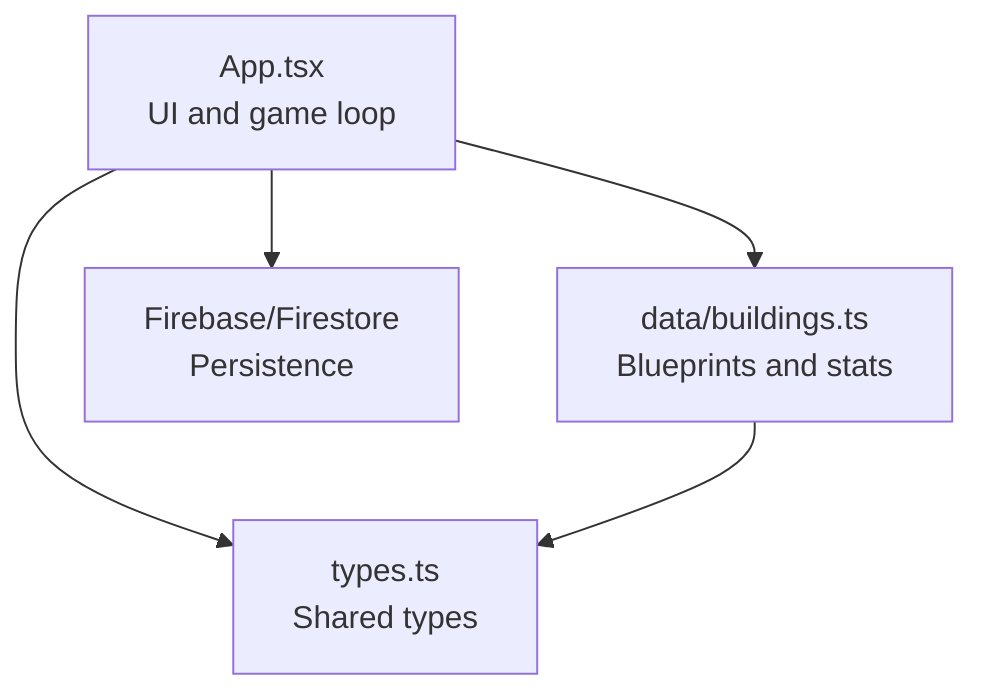

**Diagram sources**
- [App.tsx:255-399](file://App.tsx#L255-L399)
- [buildings.ts:4-96](file://data/buildings.ts#L4-L96)
- [types.ts:42-147](file://types.ts#L42-L147)

**Section sources**
- [App.tsx:255-399](file://App.tsx#L255-L399)
- [buildings.ts:4-96](file://data/buildings.ts#L4-L96)
- [types.ts:42-147](file://types.ts#L42-L147)

## Core Components
- Building blueprints define construction requirements, base stats, and upgrade paths.
- Construction instances track placement, ownership, construction state, and progress.
- Validation enforces placement rules, resource availability, population capacity, and building limits.
- Acceleration allows players to finish construction early using rubies.

Key responsibilities:
- Placement validation and resource deduction
- Construction time tracking and completion
- Acceleration via rubies
- Population and building permit calculations
- Upgrade and production workflows

**Section sources**
- [App.tsx:1439-1555](file://App.tsx#L1439-L1555)
- [App.tsx:5326-5346](file://App.tsx#L5326-L5346)
- [buildings.ts:13-96](file://data/buildings.ts#L13-L96)
- [types.ts:119-147](file://types.ts#L119-L147)

## Architecture Overview
The construction lifecycle is a client-server interaction:
- Client-side validation and optimistic UI updates
- Server persistence via Firestore
- Periodic reconciliation and anti-jitter logic

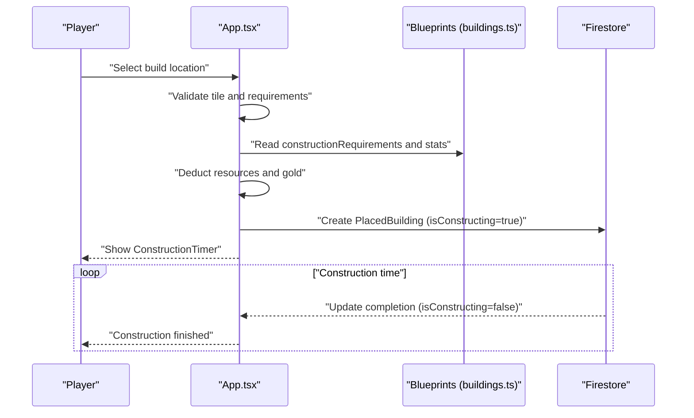

**Diagram sources**
- [App.tsx:1439-1555](file://App.tsx#L1439-L1555)
- [App.tsx:3487-3495](file://App.tsx#L3487-L3495)
- [buildings.ts:13-96](file://data/buildings.ts#L13-L96)

## Detailed Component Analysis

### Building Blueprints and Stats
Blueprints define:
- constructionRequirements: population and resource prerequisites
- stats: constructionTimeSeconds, accelerationCost, permits, durability, etc.
- upgradeCost and upgradesTo for progression

Examples:
- Town Hall tiers increase permits and population bonus, with increasing constructionTimeSeconds and accelerationCost.
- Residential buildings grant populationBonus and have shorter construction times.

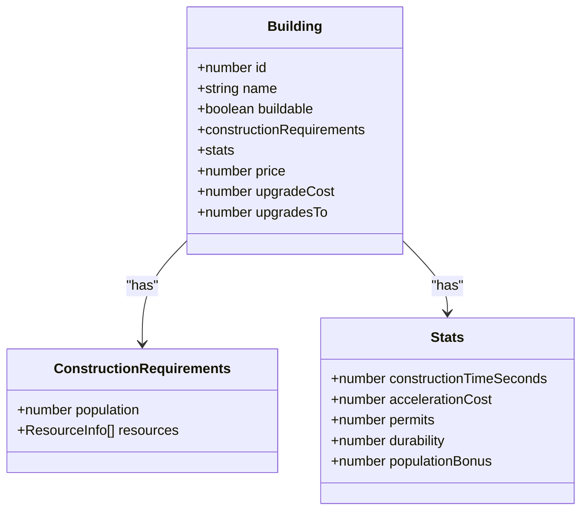

**Diagram sources**
- [buildings.ts:42-96](file://data/buildings.ts#L42-L96)
- [types.ts:42-96](file://types.ts#L42-L96)

**Section sources**
- [buildings.ts:13-96](file://data/buildings.ts#L13-L96)
- [types.ts:42-96](file://types.ts#L42-L96)

### Construction Instance Model
Construction instances (PlacedBuilding) carry:
- Position (x, y), zoneId
- Owner (ownerId, ownerName)
- Construction state (isConstructing, constructionEndTime)
- Work state (workState, workEndTime)
- Durability (hp, maxHp)
- Type and flags (isActive, isLocal)

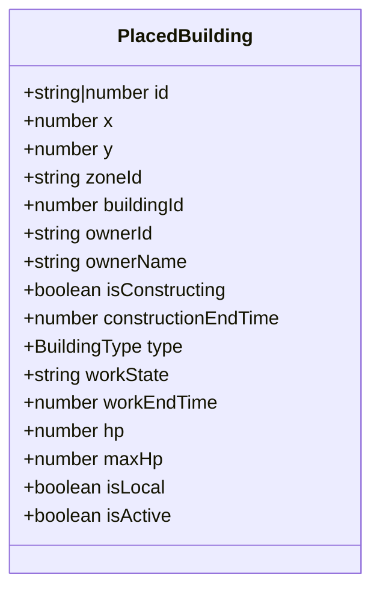

**Diagram sources**
- [types.ts:119-147](file://types.ts#L119-L147)

**Section sources**
- [types.ts:119-147](file://types.ts#L119-L147)

### Construction Workflow: From Placement to Completion
1. Player selects a building and confirms placement.
2. Client validates:
   - Tile is unoccupied
   - Player has sufficient gold
   - Population and resource requirements are met
   - Building count does not exceed permits
3. Resources are deducted (gold and/or inventory items).
4. A PlacedBuilding is created with isConstructing=true and constructionEndTime set.
5. Firestore persists the instance; UI updates optimistically.
6. After constructionEndTime, the instance becomes idle and ready.

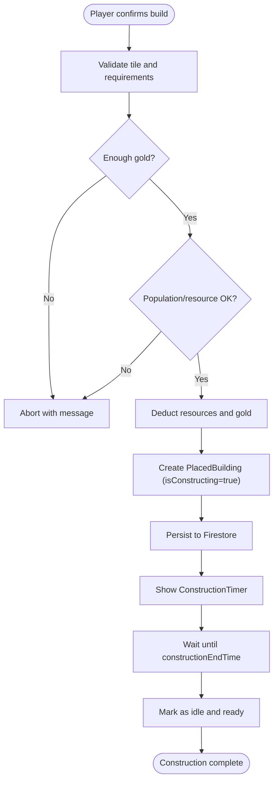

**Diagram sources**
- [App.tsx:1439-1555](file://App.tsx#L1439-L1555)
- [App.tsx:3487-3495](file://App.tsx#L3487-L3495)

**Section sources**
- [App.tsx:1439-1555](file://App.tsx#L1439-L1555)
- [App.tsx:3487-3495](file://App.tsx#L3487-L3495)

### Construction Requirements Validation
Validation checks:
- Tile occupancy via checkIsTileOccupied
- Gold balance
- Population capacity: free population equals maxPopulation minus current population usage
- Resource inventory amounts against constructionRequirements.resources
- Building permit limits via maxBuildings (sum of permits from owned buildings)

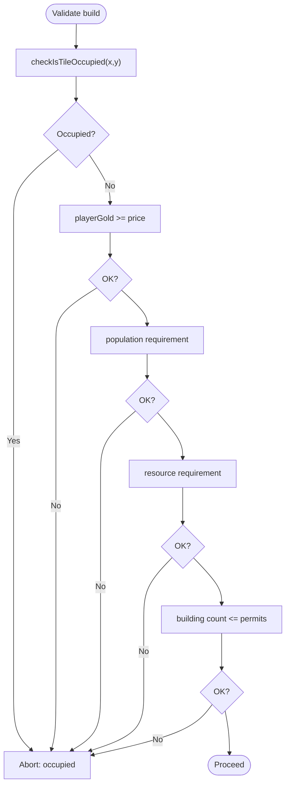

**Diagram sources**
- [App.tsx:1455-1499](file://App.tsx#L1455-L1499)
- [App.tsx:492-527](file://App.tsx#L492-L527)

**Section sources**
- [App.tsx:1455-1499](file://App.tsx#L1455-L1499)
- [App.tsx:492-527](file://App.tsx#L492-L527)

### Cost Calculation and Resource Deduction
- Base cost: building.price deducted from playerGold
- Resource cost: constructionRequirements.resources items deducted from inventory
- updatePlayerResources applies deltas and caps gold gains at goldCapacity

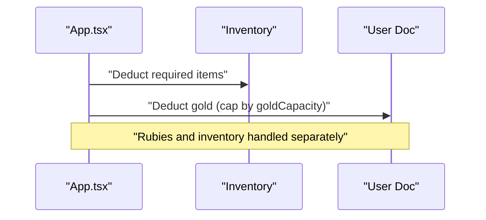

**Diagram sources**
- [App.tsx:1510-1517](file://App.tsx#L1510-L1517)
- [App.tsx:1647-1676](file://App.tsx#L1647-L1676)

**Section sources**
- [App.tsx:1510-1517](file://App.tsx#L1510-L1517)
- [App.tsx:1647-1676](file://App.tsx#L1647-L1676)

### Construction Time Tracking and Completion
- constructionEndTime is set to Date.now() + (constructionTimeSeconds * 1000)
- On completion, isConstructing is cleared and workState set to idle
- Anti-stuck logic ensures completion even if owner is offline

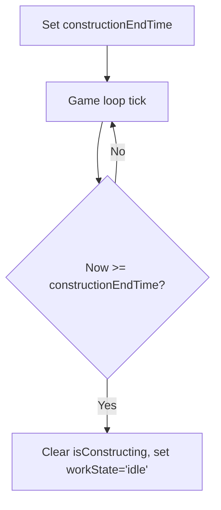

**Diagram sources**
- [App.tsx:1530](file://App.tsx#L1530)
- [App.tsx:3487-3495](file://App.tsx#L3487-L3495)

**Section sources**
- [App.tsx:1530](file://App.tsx#L1530)
- [App.tsx:3487-3495](file://App.tsx#L3487-L3495)

### Acceleration Mechanism
- accelerationCost is defined in blueprint stats
- Players pay rubies to finish construction instantly
- Server updates remove constructionEndTime and mark as idle

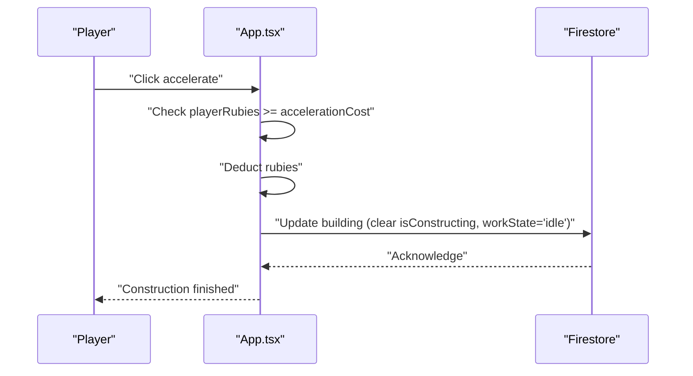

**Diagram sources**
- [App.tsx:5326-5346](file://App.tsx#L5326-L5346)
- [buildings.ts:18](file://data/buildings.ts#L18)

**Section sources**
- [App.tsx:5326-5346](file://App.tsx#L5326-L5346)
- [buildings.ts:18](file://data/buildings.ts#L18)

### Relationship Between Blueprints and Instances
- Blueprint defines constructionTimeSeconds, accelerationCost, permits, populationBonus, etc.
- Instance carries runtime state (isConstructing, constructionEndTime, workState)
- Upgrades change buildingId and reset hp/maxHp/type accordingly

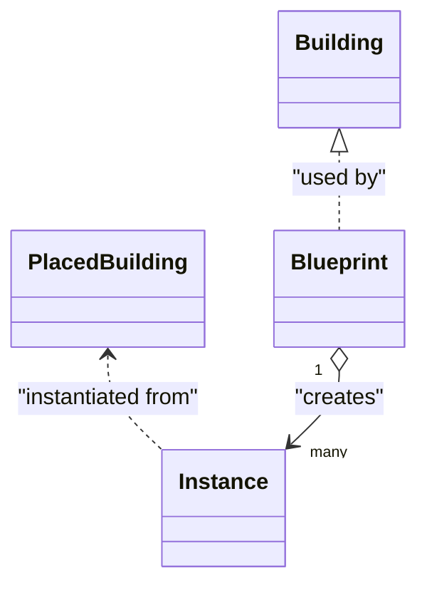

**Diagram sources**
- [buildings.ts:42-96](file://data/buildings.ts#L42-L96)
- [types.ts:119-147](file://types.ts#L119-L147)

**Section sources**
- [buildings.ts:42-96](file://data/buildings.ts#L42-L96)
- [types.ts:119-147](file://types.ts#L119-L147)

### Construction Queue Management
- There is no explicit construction queue in the code reviewed.
- The system relies on individual building timers and optimistic updates.
- Permits govern how many buildings can be constructed concurrently.

**Section sources**
- [App.tsx:1461-1467](file://App.tsx#L1461-L1467)
- [App.tsx:509-527](file://App.tsx#L509-L527)

## Dependency Analysis
- App.tsx depends on data/buildings.ts for blueprint definitions and types.ts for shared types.
- Construction logic is centralized in App.tsx with Firestore persistence.
- Population and permit computations derive from PlacedBuilding state and blueprint stats.

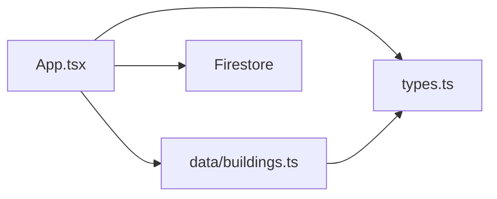

**Diagram sources**
- [App.tsx:255-399](file://App.tsx#L255-L399)
- [buildings.ts:4-96](file://data/buildings.ts#L4-L96)
- [types.ts:42-147](file://types.ts#L42-L147)

**Section sources**
- [App.tsx:255-399](file://App.tsx#L255-L399)
- [buildings.ts:4-96](file://data/buildings.ts#L4-L96)
- [types.ts:42-147](file://types.ts#L42-L147)

## Performance Considerations
- Optimistic UI updates reduce perceived latency; server acknowledgments reconcile later.
- Zone-based subscriptions minimize Firestore reads.
- Anti-jitter logic preserves local changes until server confirms parity.
- Consider batching resource updates and limiting frequent Firestore writes during bulk actions.

[No sources needed since this section provides general guidance]

## Troubleshooting Guide
Common issues and resolutions:
- Insufficient gold
  - Cause: playerGold < building.price
  - Resolution: Ensure sufficient gold before confirming build
  - Section sources
    - [App.tsx:1484-1488](file://App.tsx#L1484-L1488)

- Insufficient population
  - Cause: availablePop < constructionRequirements.population
  - Resolution: Build residential or Town Hall upgrades to raise maxPopulation
  - Section sources
    - [App.tsx:1490-1499](file://App.tsx#L1490-L1499)
    - [App.tsx:492-518](file://App.tsx#L492-L518)

- Missing resources
  - Cause: inventory lacks required items
  - Resolution: Gather or purchase required items
  - Section sources
    - [App.tsx:1501-1508](file://App.tsx#L1501-L1508)

- Tile occupied
  - Cause: checkIsTileOccupied returns true
  - Resolution: Choose another tile
  - Section sources
    - [App.tsx:1455-1460](file://App.tsx#L1455-L1460)

- Building limit reached
  - Cause: currentBuildingCount >= maxBuildings
  - Resolution: Upgrade Town Hall to increase permits
  - Section sources
    - [App.tsx:1461-1467](file://App.tsx#L1461-L1467)
    - [App.tsx:509-527](file://App.tsx#L509-L527)

- Construction stuck at 0s
  - Cause: owner offline preventing completion
  - Resolution: Wait for timer; server logic auto-finalizes when constructionEndTime passes
  - Section sources
    - [App.tsx:3487-3495](file://App.tsx#L3487-L3495)

- Acceleration failed
  - Cause: playerRubies < accelerationCost
  - Resolution: Earn or purchase rubies
  - Section sources
    - [App.tsx:5326-5334](file://App.tsx#L5326-L5334)

Optimization tips for large-scale construction:
- Plan builds around permits and population capacity
- Batch resource gathering to avoid repeated confirmations
- Use acceleration judiciously for high-value buildings

[No sources needed since this section provides general guidance]

## Conclusion
The construction system combines client-side validation and optimistic updates with server persistence to deliver responsive gameplay. Blueprints encode construction rules, while PlacedBuilding instances track runtime state. Validation ensures balanced growth via population and resource constraints, and acceleration offers flexible pacing. For large projects, monitor permits, population, and resource availability to maintain smooth progress.