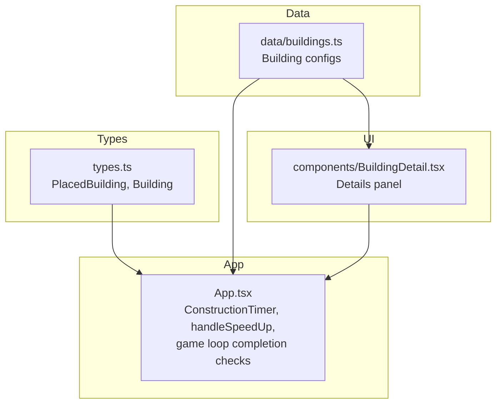
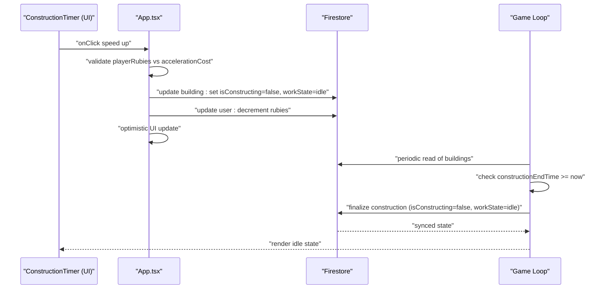
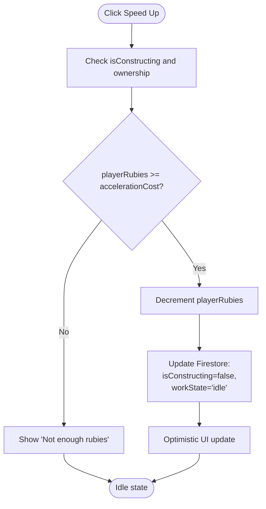
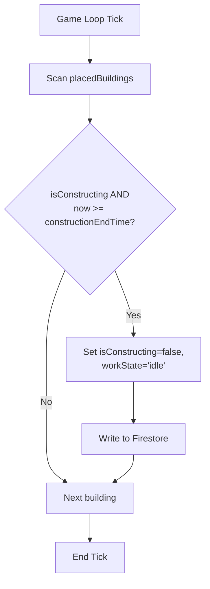
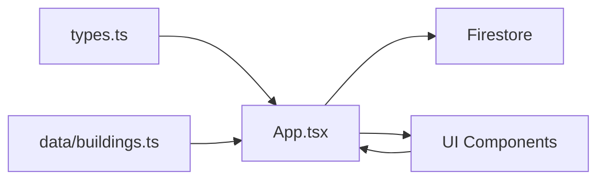

# Construction Timing

<cite>
**Referenced Files in This Document**
- [App.tsx](file://App.tsx)
- [types.ts](file://types.ts)
- [data/buildings.ts](file://data/buildings.ts)
- [components/BuildingDetail.tsx](file://components/BuildingDetail.tsx)
</cite>

## Table of Contents
1. [Introduction](#introduction)
2. [Project Structure](#project-structure)
3. [Core Components](#core-components)
4. [Architecture Overview](#architecture-overview)
5. [Detailed Component Analysis](#detailed-component-analysis)
6. [Dependency Analysis](#dependency-analysis)
7. [Performance Considerations](#performance-considerations)
8. [Troubleshooting Guide](#troubleshooting-guide)
9. [Conclusion](#conclusion)

## Introduction
This document explains the construction timing system in the game, covering construction duration tracking, acceleration mechanics, and automatic completion handling. It details how the constructionTimeSeconds property is used, how real-time progress is tracked, and how construction completion is detected and finalized. It also documents the acceleration system, including accelerationCost calculation and payment processing. Finally, it connects construction timing to the broader game economy, showing how construction affects resource production and population growth.

## Project Structure
The construction timing system spans several parts of the codebase:
- Types define the PlacedBuilding entity and Building metadata, including constructionTimeSeconds and accelerationCost.
- Data files define building configurations, including construction durations and acceleration costs.
- UI components render construction timers and related controls.
- Application logic manages construction lifecycle, including acceleration payments and completion detection.

**Diagram sources**
- [types.ts:119-147](file://types.ts#L119-L147)
- [types.ts:42-96](file://types.ts#L42-L96)
- [data/buildings.ts:1-200](file://data/buildings.ts#L1-L200)
- [components/BuildingDetail.tsx:46-117](file://components/BuildingDetail.tsx#L46-L117)
- [App.tsx:210-243](file://App.tsx#L210-L243)
- [App.tsx:5326-5374](file://App.tsx#L5326-L5374)
- [App.tsx:3487-3505](file://App.tsx#L3487-L3505)

**Section sources**
- [types.ts:42-96](file://types.ts#L42-L96)
- [types.ts:119-147](file://types.ts#L119-L147)
- [data/buildings.ts:1-200](file://data/buildings.ts#L1-L200)
- [components/BuildingDetail.tsx:46-117](file://components/BuildingDetail.tsx#L46-L117)
- [App.tsx:210-243](file://App.tsx#L210-L243)
- [App.tsx:5326-5374](file://App.tsx#L5326-L5374)
- [App.tsx:3487-3505](file://App.tsx#L3487-L3505)

## Core Components
- ConstructionTimer: A UI component that displays the remaining construction time and the acceleration cost, and triggers acceleration when clicked.
- handleSpeedUp: Acceleration handler that validates rubies, decrements player rubies, and updates Firestore to finish construction early.
- Game loop completion checks: Periodic logic that detects when constructionEndTime is reached and finalizes construction for all clients.
- Building metadata: Building definitions include constructionTimeSeconds and accelerationCost, and some buildings also include workTimeSeconds and workYieldGold for production mechanics.

Key responsibilities:
- Real-time countdown rendering and acceleration affordances.
- Payment processing for acceleration using rubies.
- Automatic completion detection and state transitions.
- Integration with building configuration data.

**Section sources**
- [App.tsx:210-243](file://App.tsx#L210-L243)
- [App.tsx:5326-5374](file://App.tsx#L5326-L5374)
- [App.tsx:3487-3505](file://App.tsx#L3487-L3505)
- [types.ts:42-96](file://types.ts#L42-L96)
- [data/buildings.ts:1-200](file://data/buildings.ts#L1-L200)

## Architecture Overview
The construction lifecycle integrates UI, state, and persistence:
- UI renders ConstructionTimer with endTime and cost.
- Player clicks to accelerate; handleSpeedUp validates rubies and updates Firestore.
- Game loop periodically checks constructionEndTime and finalizes construction.
- UI reflects state changes via optimistic updates and Firestore sync.

**Diagram sources**
- [App.tsx:210-243](file://App.tsx#L210-L243)
- [App.tsx:5326-5374](file://App.tsx#L5326-L5374)
- [App.tsx:3487-3505](file://App.tsx#L3487-L3505)

## Detailed Component Analysis

### ConstructionTimer Component
Purpose:
- Display remaining construction time derived from constructionEndTime.
- Show acceleration cost and enable acceleration when the building belongs to the player.

Behavior:
- Computes minutes and seconds from endTime - Date.now().
- Hides itself when timeLeft <= 0.
- Renders a button to trigger acceleration if the building is owned by the current player.

Usage:
- Rendered in the building selection panel when isConstructing is true.

**Section sources**
- [App.tsx:210-243](file://App.tsx#L210-L243)
- [App.tsx:6182-6186](file://App.tsx#L6182-L6186)

### Acceleration Mechanics
Payment and state updates:
- Cost is taken from the building’s accelerationCost.
- Rubies are decremented from the player’s account.
- Firestore is updated to mark construction as finished immediately.
- UI is optimistically updated to reflect idle state.

Validation:
- If playerRubies < accelerationCost, show an alert and abort.

**Diagram sources**
- [App.tsx:5326-5374](file://App.tsx#L5326-L5374)

**Section sources**
- [App.tsx:5326-5374](file://App.tsx#L5326-L5374)

### Automatic Completion Detection
Completion logic:
- Game loop reads placed buildings and compares constructionEndTime to current time.
- When constructionEndTime <= now, sets isConstructing=false and workState='idle'.
- Writes to Firestore to persist the change.
- Applies to any client observing the building, preventing stale “0s” states.

**Diagram sources**
- [App.tsx:3487-3505](file://App.tsx#L3487-L3505)

**Section sources**
- [App.tsx:3487-3505](file://App.tsx#L3487-L3505)

### Construction Duration Tracking and Progress Visualization
Tracking:
- constructionEndTime is set at construction start using constructionTimeSeconds from the building definition.
- UI shows a live countdown until construction completes.

Examples from data:
- Town Hall levels specify constructionTimeSeconds and accelerationCost.
- Residential buildings also define constructionTimeSeconds and accelerationCost.

**Section sources**
- [data/buildings.ts:1-200](file://data/buildings.ts#L1-L200)
- [App.tsx:1298-1298](file://App.tsx#L1298-L1298)
- [App.tsx:1529-1529](file://App.tsx#L1529-L1529)
- [App.tsx:4228-4228](file://App.tsx#L4228-L4228)
- [App.tsx:4276-4276](file://App.tsx#L4276-L4276)
- [App.tsx:4517-4517](file://App.tsx#L4517-L4517)
- [App.tsx:4533-4533](file://App.tsx#L4533-L4533)
- [components/BuildingDetail.tsx:96-98](file://components/BuildingDetail.tsx#L96-L98)

### Relationship Between Construction Timing and Game Economy
- Population growth: Buildings grant populationBonus; constructionTimeSeconds determines how long it takes to gain new population capacity.
- Production: Some buildings consume resources and produce goods or yield gold over time (workTimeSeconds, workYieldGold). These mechanics integrate with construction completion and subsequent production cycles.
- Tax and sharing: For non-lily/mushroom production buildings, gold yields can be affected by nearby tax collectors, impacting effective income.

Concrete examples:
- Residential buildings increase population capacity after construction completes.
- Business buildings (e.g., mushroom beds) produce coins or items and cycle through stages after collection, integrating with construction timing indirectly through upgrades and state transitions.

**Section sources**
- [types.ts:42-96](file://types.ts#L42-L96)
- [data/buildings.ts:846-936](file://data/buildings.ts#L846-L936)
- [App.tsx:4587-4670](file://App.tsx#L4587-L4670)
- [App.tsx:4727-4769](file://App.tsx#L4727-L4769)

## Dependency Analysis
- App.tsx depends on:
  - types.ts for PlacedBuilding and Building shapes.
  - data/buildings.ts for constructionTimeSeconds and accelerationCost values.
  - Firestore SDK for persistence updates.
- UI components depend on:
  - types.ts for rendering building stats.
  - App.tsx for state and handlers.

**Diagram sources**
- [types.ts:42-96](file://types.ts#L42-L96)
- [types.ts:119-147](file://types.ts#L119-L147)
- [data/buildings.ts:1-200](file://data/buildings.ts#L1-L200)
- [App.tsx:210-243](file://App.tsx#L210-L243)
- [App.tsx:5326-5374](file://App.tsx#L5326-L5374)
- [App.tsx:3487-3505](file://App.tsx#L3487-L3505)

**Section sources**
- [types.ts:42-96](file://types.ts#L42-L96)
- [types.ts:119-147](file://types.ts#L119-L147)
- [data/buildings.ts:1-200](file://data/buildings.ts#L1-L200)
- [App.tsx:210-243](file://App.tsx#L210-L243)
- [App.tsx:5326-5374](file://App.tsx#L5326-L5374)
- [App.tsx:3487-3505](file://App.tsx#L3487-L3505)

## Performance Considerations
- ConstructionTimer uses a 1-second tick; this is lightweight and appropriate for UI updates.
- Game loop completion checks iterate over placedBuildings; keep the list reasonably sized to avoid overhead.
- Firestore writes occur on acceleration and completion; batching updates helps reduce network traffic.
- Optimistic UI updates improve perceived responsiveness; ensure they are reverted if server updates differ.

## Troubleshooting Guide
Common issues and resolutions:
- Stuck at “0s”: The game loop automatically finalizes construction for any observer when constructionEndTime is reached, preventing stale states.
- Not enough rubies: The acceleration handler checks rubies and alerts the player; ensure rubies are sufficient before attempting acceleration.
- Construction does not complete: Verify that constructionEndTime is being written and that the game loop runs and updates Firestore accordingly.

**Section sources**
- [App.tsx:3487-3505](file://App.tsx#L3487-L3505)
- [App.tsx:5326-5374](file://App.tsx#L5326-L5374)

## Conclusion
The construction timing system combines precise duration tracking, real-time progress visualization, and robust completion handling. Acceleration mechanics provide a frictionless way to skip construction using rubies, while the game loop ensures reliable finalization across clients. Together with building metadata and production mechanics, construction timing forms a foundational part of the game economy, influencing population growth and resource generation.