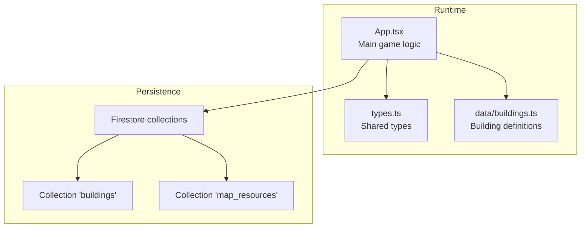
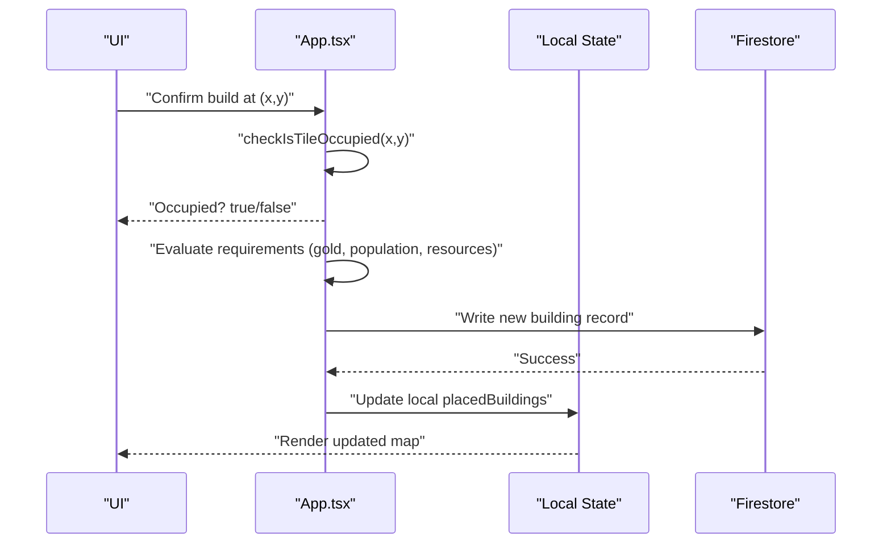
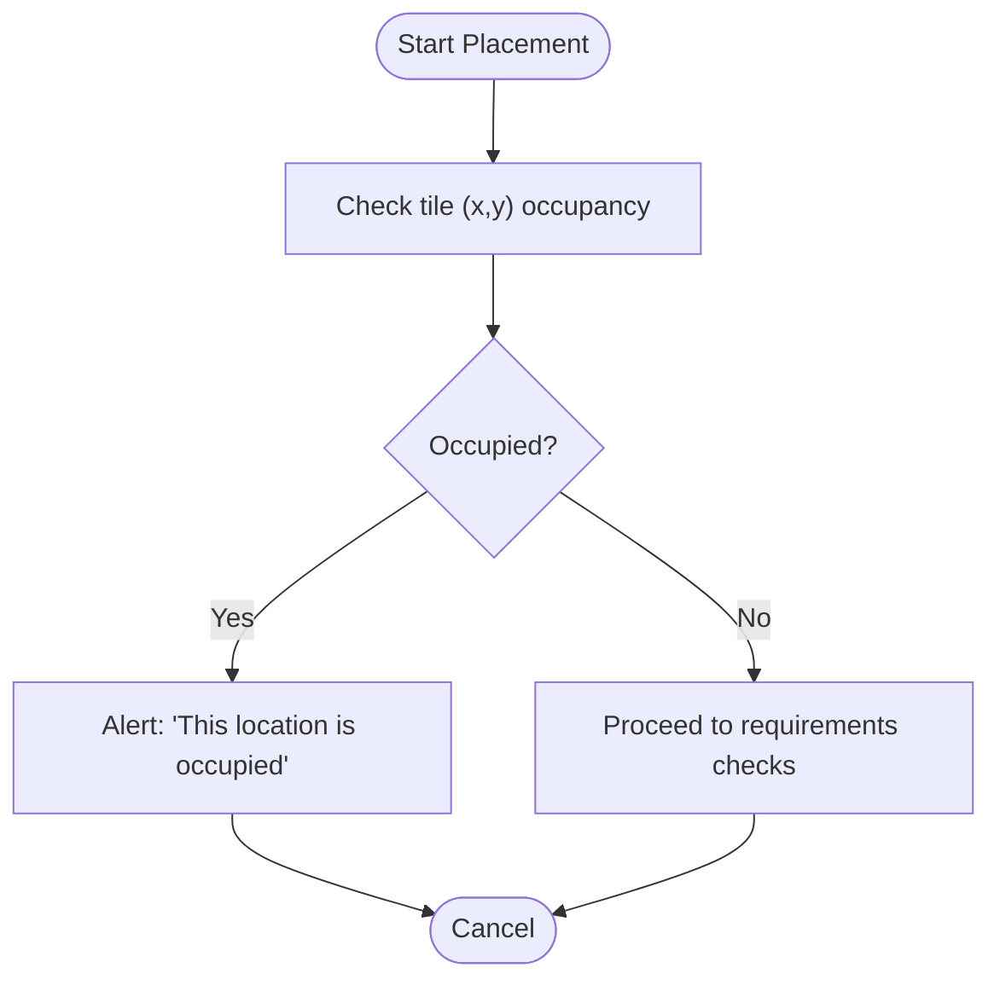
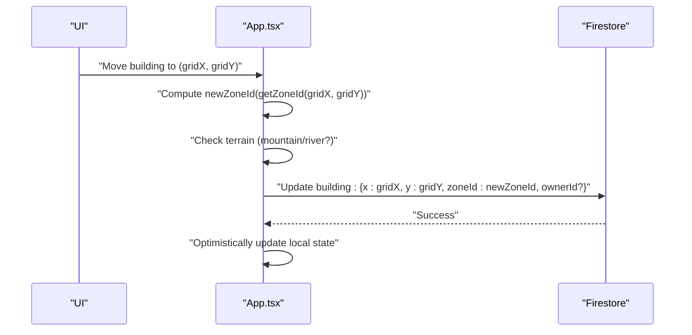
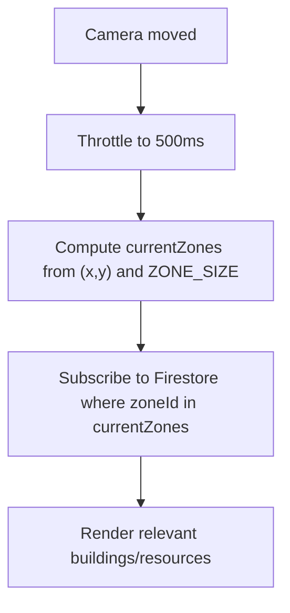
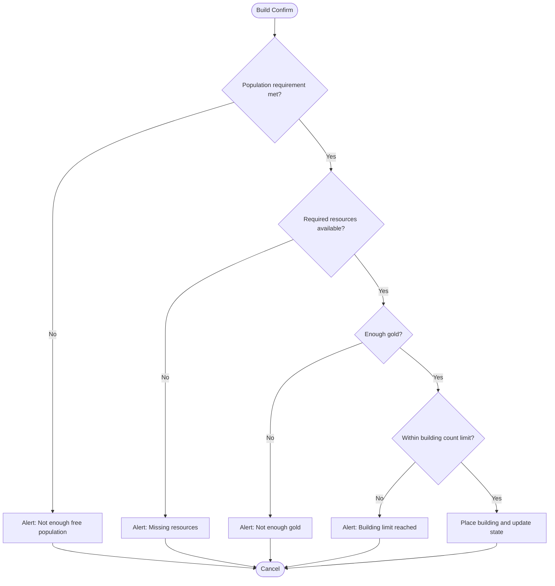
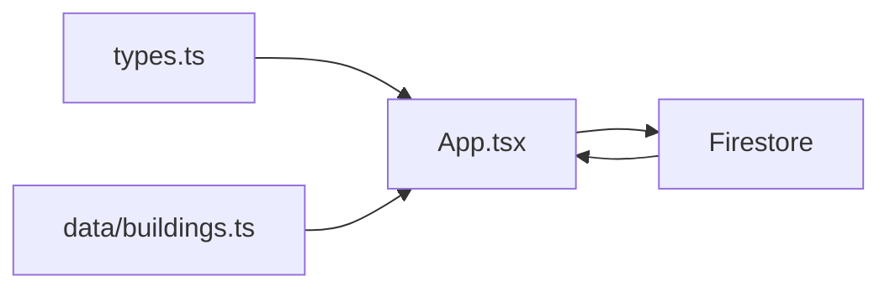

# Placement Validation

<cite>
**Referenced Files in This Document**
- [App.tsx](file://App.tsx)
- [types.ts](file://types.ts)
- [buildings.ts](file://data/buildings.ts)
- [migrate_zones_80.mjs](file://migrate_zones_80.mjs)
- [all_consts.txt](file://all_consts.txt)
- [build_lines.txt](file://build_lines.txt)
</cite>

## Table of Contents
1. [Introduction](#introduction)
2. [Project Structure](#project-structure)
3. [Core Components](#core-components)
4. [Architecture Overview](#architecture-overview)
5. [Detailed Component Analysis](#detailed-component-analysis)
6. [Dependency Analysis](#dependency-analysis)
7. [Performance Considerations](#performance-considerations)
8. [Troubleshooting Guide](#troubleshooting-guide)
9. [Conclusion](#conclusion)

## Introduction
This document explains the building placement validation system used in the game. It covers spatial validation logic, collision detection with existing buildings and map resources, terrain restrictions, and zone-based optimization. It also documents how placement requirements (such as population and resource costs) are enforced, and how movement and ownership rules interact with placement.

## Project Structure
The placement validation logic is primarily implemented in the main application file and supported by shared types and building definitions. Zone-based optimization is handled via zone IDs derived from tile coordinates.

**Diagram sources**
- [App.tsx:36-46](file://App.tsx#L36-L46)
- [types.ts:119-147](file://types.ts#L119-L147)
- [buildings.ts:4-96](file://data/buildings.ts#L4-L96)

**Section sources**
- [App.tsx:36-46](file://App.tsx#L36-L46)
- [types.ts:119-147](file://types.ts#L119-L147)
- [buildings.ts:4-96](file://data/buildings.ts#L4-L96)

## Core Components
- Spatial validation and collision detection:
  - Occupancy check against placed buildings and map resources.
- Terrain restrictions:
  - Special handling for mountains and rivers during movement and ownership assignment.
- Zone-based optimization:
  - Zone ID computation and subscription to relevant zones.
- Placement requirements enforcement:
  - Player resources and population availability.
- Movement and ownership:
  - Ownership transfer on moving into restricted terrain.

Key implementation references:
- Tile occupancy check: [checkIsTileOccupied:421-431](file://App.tsx#L421-L431)
- Zone ID computation: [ZONE_SIZE and getZoneId:44-46](file://App.tsx#L44-L46)
- Zone subscription: [onSnapshot with 'zoneId' in:826-833](file://App.tsx#L826-L833)
- Movement and ownership update: [moveMode updates:1041-1065](file://App.tsx#L1041-L1065)
- Placement requirement checks: [build confirmation flow:1455-1517](file://App.tsx#L1455-L1517)

**Section sources**
- [App.tsx:421-431](file://App.tsx#L421-L431)
- [App.tsx:44-46](file://App.tsx#L44-L46)
- [App.tsx:826-833](file://App.tsx#L826-L833)
- [App.tsx:1041-1065](file://App.tsx#L1041-L1065)
- [App.tsx:1455-1517](file://App.tsx#L1455-L1517)

## Architecture Overview
The placement validation pipeline integrates UI actions, local state, and Firestore persistence. It validates placement in real time and enforces constraints before committing changes.

**Diagram sources**
- [App.tsx:1455-1517](file://App.tsx#L1455-L1517)
- [App.tsx:421-431](file://App.tsx#L421-L431)

## Detailed Component Analysis

### Spatial Validation and Collision Detection
- Purpose: Prevent placing buildings on top of existing buildings or map resources.
- Implementation:
  - Occupancy check scans placed buildings and map resources for the target tile.
  - Only tiles with zero HP or undefined HP are considered for collisions.
- Error handling:
  - If occupied, the system alerts the user and cancels the build confirmation.

**Diagram sources**
- [App.tsx:421-431](file://App.tsx#L421-L431)
- [App.tsx:1455-1460](file://App.tsx#L1455-L1460)

**Section sources**
- [App.tsx:421-431](file://App.tsx#L421-L431)
- [App.tsx:1455-1460](file://App.tsx#L1455-L1460)

### Terrain Restrictions and Movement Ownership
- Purpose: Enforce terrain-specific rules (e.g., mountains and rivers) during movement and ownership.
- Implementation:
  - Movement cost differs for mountains/rivers vs. normal tiles.
  - Moving onto mountains/rivers transfers ownership to the current user.
  - Updates are persisted to Firestore and reflected locally.

**Diagram sources**
- [App.tsx:1041-1065](file://App.tsx#L1041-L1065)

**Section sources**
- [App.tsx:1041-1065](file://App.tsx#L1041-L1065)

### Zone-Based Placement Validation
- Purpose: Optimize performance by limiting Firestore queries to relevant map zones.
- Implementation:
  - Zone ID computed from tile coordinates.
  - Camera offset is throttled to reduce zone recalculations.
  - Subscriptions filter by 'zoneId' in current zones.
  - Zone migration script demonstrates zone ID computation.

**Diagram sources**
- [App.tsx:570-576](file://App.tsx#L570-L576)
- [App.tsx:797-820](file://App.tsx#L797-L820)
- [App.tsx:826-833](file://App.tsx#L826-L833)
- [migrate_zones_80.mjs:8-10](file://migrate_zones_80.mjs#L8-L10)

**Section sources**
- [App.tsx:570-576](file://App.tsx#L570-L576)
- [App.tsx:797-820](file://App.tsx#L797-L820)
- [App.tsx:826-833](file://App.tsx#L826-L833)
- [migrate_zones_80.mjs:8-10](file://migrate_zones_80.mjs#L8-L10)

### Placement Requirements Enforcement
- Purpose: Validate that players meet prerequisites before placing a building.
- Implementation:
  - Population requirement: compares free population against building’s requirement.
  - Resource requirement: checks inventory against construction requirements.
  - Gold requirement: verifies sufficient gold.
  - Town Hall uniqueness and building count limits are enforced.
- Error handling:
  - Alerts inform the user of missing prerequisites and cancel placement.

**Diagram sources**
- [App.tsx:1484-1517](file://App.tsx#L1484-L1517)
- [App.tsx:1461-1473](file://App.tsx#L1461-L1473)
- [App.tsx:1490-1499](file://App.tsx#L1490-L1499)
- [App.tsx:1501-1514](file://App.tsx#L1501-L1514)

**Section sources**
- [App.tsx:1484-1517](file://App.tsx#L1484-L1517)
- [App.tsx:1461-1473](file://App.tsx#L1461-L1473)
- [App.tsx:1490-1499](file://App.tsx#L1490-L1499)
- [App.tsx:1501-1514](file://App.tsx#L1501-L1514)

### Relationship Between Building Dimensions, Rotation Constraints, and Placement
- Observations from the codebase:
  - Placement logic operates on single-tile grid positions (x, y).
  - There is no explicit multi-tile footprint or rotation handling in the referenced files.
  - Movement and ownership logic does not indicate footprint or rotation constraints.
- Implication:
  - All building placements are treated as single-tile, unit-sized units.
  - Rotation constraints and multi-tile dimensions are not enforced in the analyzed code.

**Section sources**
- [App.tsx:421-431](file://App.tsx#L421-L431)
- [App.tsx:1041-1065](file://App.tsx#L1041-L1065)

### Special Terrain Requirements and Minimum Distances
- Special terrain:
  - Mountains and rivers are represented as map resources and buildings with special ownership rules during movement.
- Minimum distances:
  - No explicit minimum distance enforcement logic was found in the analyzed files.

**Section sources**
- [App.tsx:606-654](file://App.tsx#L606-L654)
- [App.tsx:1041-1065](file://App.tsx#L1041-L1065)

## Dependency Analysis
- Types define the canonical shape of placed buildings and map resources.
- Building definitions supply construction requirements and stats used by validation.
- Zone-based subscriptions depend on zone ID computation and Firestore filtering.

**Diagram sources**
- [types.ts:119-147](file://types.ts#L119-L147)
- [buildings.ts:4-96](file://data/buildings.ts#L4-L96)
- [App.tsx:826-833](file://App.tsx#L826-L833)

**Section sources**
- [types.ts:119-147](file://types.ts#L119-L147)
- [buildings.ts:4-96](file://data/buildings.ts#L4-L96)
- [App.tsx:826-833](file://App.tsx#L826-L833)

## Performance Considerations
- Zone throttling: Camera offset throttling reduces unnecessary zone recomputation.
- Zone subscription: Queries are scoped to current zones, minimizing data transfer.
- Occupancy checks: Local scans of placed buildings and map resources are O(n) per tile check.

Recommendations:
- Keep zone size tuned to balance granularity and query volume.
- Consider caching currentZones and avoiding redundant subscriptions.
- For large worlds, ensure zone ID computation remains constant-time.

**Section sources**
- [App.tsx:570-576](file://App.tsx#L570-L576)
- [App.tsx:826-833](file://App.tsx#L826-L833)

## Troubleshooting Guide
Common issues and resolutions:
- Placement fails with “occupied”:
  - Cause: Another building or map resource exists at the target tile.
  - Resolution: Choose another tile or remove the obstacle.
- “Not enough gold” or “Not enough resources”:
  - Cause: Insufficient currency or missing required materials.
  - Resolution: Earn gold, gather resources, or upgrade prerequisites.
- “Building limit reached”:
  - Cause: Exceeded permits granted by Town Halls or residential buildings.
  - Resolution: Upgrade Town Hall or demolish non-essential buildings.
- Movement onto mountains/rivers:
  - Cause: Ownership transfer occurs automatically.
  - Resolution: Verify ownership after movement; ensure movement cost is paid.

**Section sources**
- [App.tsx:1455-1460](file://App.tsx#L1455-L1460)
- [App.tsx:1484-1517](file://App.tsx#L1484-L1517)
- [App.tsx:1461-1473](file://App.tsx#L1461-L1473)
- [App.tsx:1041-1065](file://App.tsx#L1041-L1065)

## Conclusion
The placement validation system centers on a simple yet effective model: single-tile placement, strict occupancy checks, and zone-scoped Firestore subscriptions. Terrain-specific rules govern movement and ownership, while placement requirements enforce economic and population constraints. The absence of multi-tile footprint and rotation logic simplifies validation but may require future extensions for more complex building shapes.