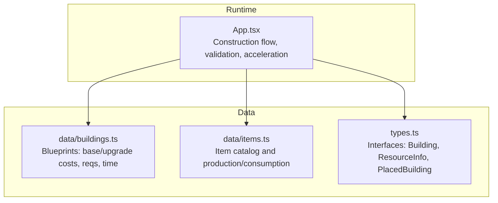
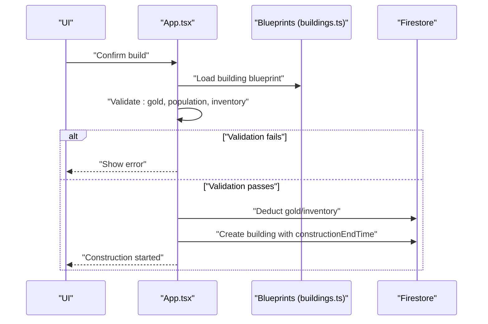
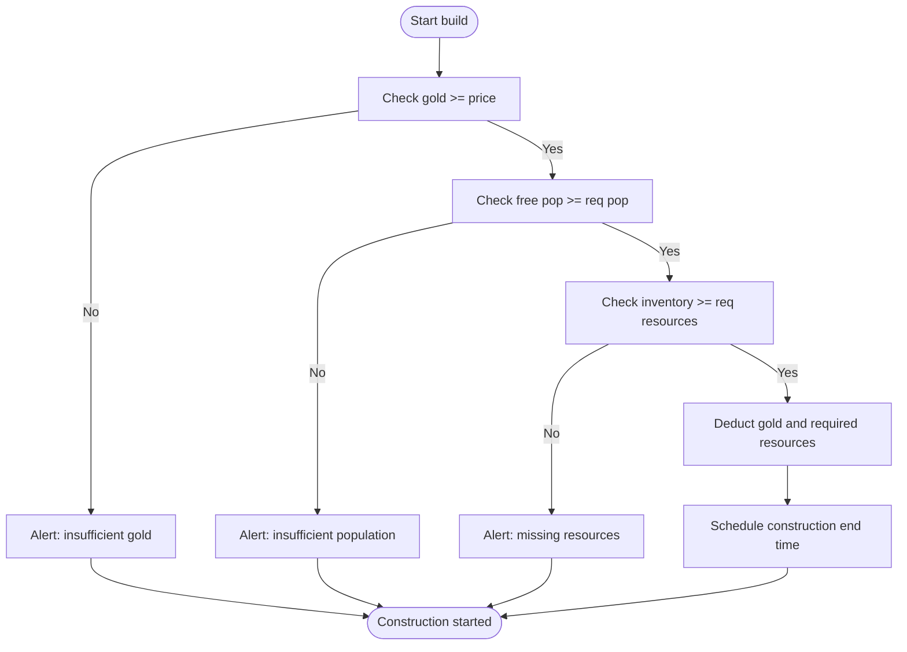
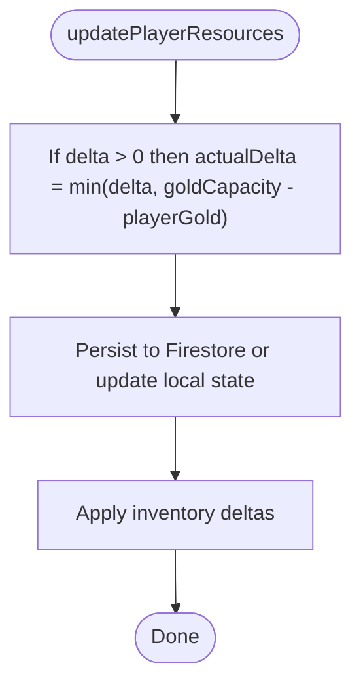
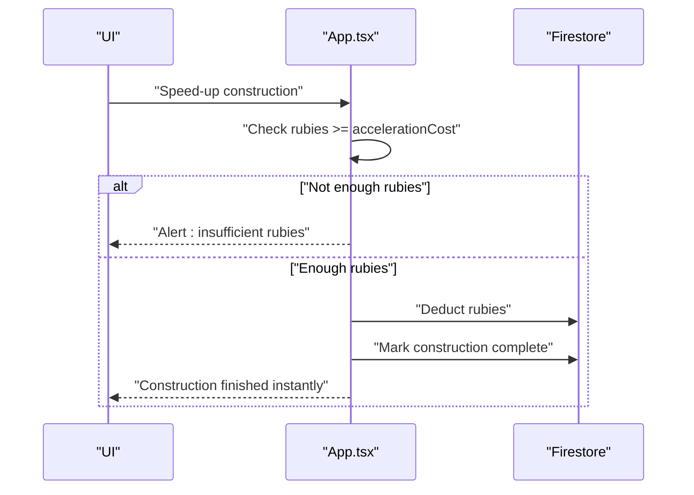
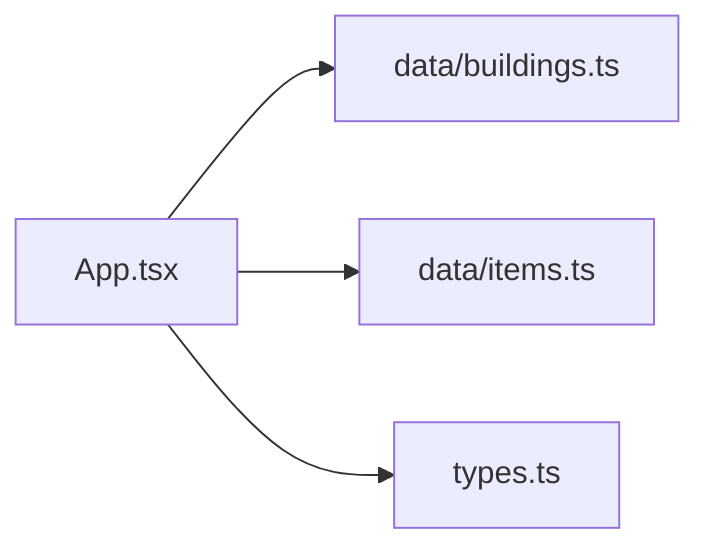

# Resource Cost Calculation

<cite>
**Referenced Files in This Document**
- [App.tsx](file://App.tsx)
- [buildings.ts](file://data/buildings.ts)
- [items.ts](file://data/items.ts)
- [types.ts](file://types.ts)
</cite>

## Table of Contents
1. [Introduction](#introduction)
2. [Project Structure](#project-structure)
3. [Core Components](#core-components)
4. [Architecture Overview](#architecture-overview)
5. [Detailed Component Analysis](#detailed-component-analysis)
6. [Dependency Analysis](#dependency-analysis)
7. [Performance Considerations](#performance-considerations)
8. [Troubleshooting Guide](#troubleshooting-guide)
9. [Conclusion](#conclusion)

## Introduction
This document explains how construction costs and resource validation are calculated and enforced in the game. It covers:
- How base construction costs and upgrade costs are defined via building blueprints
- How resource requirements are validated before construction begins
- How partial payments and accelerated construction are handled
- How construction time relates to resource consumption and storage capacity
- Practical examples and error handling for insufficient resources

## Project Structure
The resource cost and validation logic is implemented primarily in the main application file, with authoritative data in the blueprint datasets and shared type definitions.

**Diagram sources**
- [App.tsx:1439-1555](file://App.tsx#L1439-L1555)
- [buildings.ts:1-4665](file://data/buildings.ts#L1-L4665)
- [items.ts:1-415](file://data/items.ts#L1-L415)
- [types.ts:1-197](file://types.ts#L1-L197)

**Section sources**
- [App.tsx:1439-1555](file://App.tsx#L1439-L1555)
- [buildings.ts:1-4665](file://data/buildings.ts#L1-L4665)
- [items.ts:1-415](file://data/items.ts#L1-L415)
- [types.ts:1-197](file://types.ts#L1-L197)

## Core Components
- Building blueprints define:
  - Base construction cost (gold)
  - Upgrade cost (gold)
  - Construction time (seconds)
  - Acceleration cost (rubies)
  - Population requirement
  - Required resources for construction
- Player resources include:
  - Gold (subject to capacity)
  - Rubies (for acceleration)
  - Inventory (resources used for construction)
- Validation and deduction:
  - Pre-construction checks for gold, population, and inventory
  - Deduction of costs and required resources
  - Acceleration reduces construction time by marking as complete

**Section sources**
- [buildings.ts:1-4665](file://data/buildings.ts#L1-L4665)
- [App.tsx:1484-1517](file://App.tsx#L1484-L1517)
- [App.tsx:5326-5346](file://App.tsx#L5326-L5346)
- [types.ts:42-96](file://types.ts#L42-L96)

## Architecture Overview
The construction lifecycle is a controlled flow that validates prerequisites, deducts resources, and schedules construction completion.

**Diagram sources**
- [App.tsx:1439-1555](file://App.tsx#L1439-L1555)
- [buildings.ts:1-4665](file://data/buildings.ts#L1-L4665)

## Detailed Component Analysis

### Construction Cost Calculation from Blueprints
- Base cost: taken from the building’s price field.
- Upgrade cost: taken from the building’s upgradeCost field.
- Construction time: taken from constructionTimeSeconds.
- Acceleration cost: taken from accelerationCost (rubies).

These values are used to:
- Enforce pre-construction gold budget
- Enforce rubies budget for acceleration
- Compute construction end time

**Section sources**
- [buildings.ts:1-4665](file://data/buildings.ts#L1-L4665)
- [types.ts:42-96](file://types.ts#L42-L96)

### Resource Requirement Validation
Before placing a building, the system checks:
- Gold budget: playerGold ≥ building.price
- Population availability: maxPopulation − currentPopulation ≥ constructionRequirements.population
- Inventory resources: for each required resource, inventory[id] ≥ amount

If any prerequisite is missing, the system alerts the user and aborts construction.

**Diagram sources**
- [App.tsx:1484-1517](file://App.tsx#L1484-L1517)

**Section sources**
- [App.tsx:1484-1517](file://App.tsx#L1484-L1517)

### Resource Deduction and Storage Capacity
- Gold is deducted optimistically and persisted to Firestore.
- Deduction respects storage capacity: if goldDelta > 0, actual gain is capped at goldCapacity − playerGold.
- Inventory resources are deducted per construction requirements.

**Diagram sources**
- [App.tsx:1647-1676](file://App.tsx#L1647-L1676)

**Section sources**
- [App.tsx:1647-1676](file://App.tsx#L1647-L1676)

### Accelerated Construction and Partial Payments
- Acceleration cost is defined per building (rubies).
- If the player lacks rubies, the action is blocked.
- On successful acceleration, construction is marked complete immediately (no time elapses).

**Diagram sources**
- [App.tsx:5326-5346](file://App.tsx#L5326-L5346)

**Section sources**
- [App.tsx:5326-5346](file://App.tsx#L5326-L5346)

### Relationship Between Construction Time and Resource Consumption
- Construction time is defined per building and determines when construction completes.
- While constructing, the system does not continuously consume resources; costs are paid once at start.
- Storage capacity affects how much income can be accepted during gameplay (not during construction itself).

Practical implications:
- A longer constructionTimeSeconds simply delays completion; it does not imply ongoing resource consumption.
- Players can accelerate to finish immediately by spending rubies.

**Section sources**
- [buildings.ts:1-4665](file://data/buildings.ts#L1-L4665)
- [App.tsx:1521-1547](file://App.tsx#L1521-L1547)

### Examples

- Example 1: Building a residential structure
  - Blueprint defines price, constructionTimeSeconds, and constructionRequirements.resources.
  - Validation ensures playerGold ≥ price and inventory satisfies all required resources.
  - Deduction applies immediately upon confirmation.

- Example 2: Upgrading a Town Hall
  - Blueprint defines upgradeCost; validation ensures playerGold ≥ upgradeCost.
  - No ongoing resource consumption; upgrade completes instantly after payment.

- Example 3: Accelerating construction
  - Blueprint defines accelerationCost (rubies).
  - If playerRubies < accelerationCost, the action is blocked.
  - Otherwise, rubies are deducted and construction ends immediately.

**Section sources**
- [buildings.ts:1-4665](file://data/buildings.ts#L1-L4665)
- [App.tsx:1484-1517](file://App.tsx#L1484-L1517)
- [App.tsx:5326-5346](file://App.tsx#L5326-L5346)

## Dependency Analysis
- App.tsx depends on:
  - data/buildings.ts for construction metadata (costs, time, requirements)
  - data/items.ts for resource definitions and production/consumption
  - types.ts for typed interfaces used across the app

**Diagram sources**
- [App.tsx:1439-1555](file://App.tsx#L1439-L1555)
- [buildings.ts:1-4665](file://data/buildings.ts#L1-L4665)
- [items.ts:1-415](file://data/items.ts#L1-L415)
- [types.ts:1-197](file://types.ts#L1-L197)

**Section sources**
- [App.tsx:1439-1555](file://App.tsx#L1439-L1555)
- [buildings.ts:1-4665](file://data/buildings.ts#L1-L4665)
- [items.ts:1-415](file://data/items.ts#L1-L415)
- [types.ts:1-197](file://types.ts#L1-L197)

## Performance Considerations
- Pre-construction validation short-circuits expensive Firestore writes.
- Optimistic UI updates (immediate local state changes) improve perceived responsiveness; Firestore updates follow.
- Zone-based subscriptions minimize data transfer and improve scalability.

## Troubleshooting Guide
Common issues and resolutions:
- Insufficient gold
  - Symptom: Alert “Недостаточно золота!”
  - Cause: playerGold < building.price
  - Resolution: Earn more gold or choose a cheaper building

- Insufficient population
  - Symptom: Alert “Недостаточно свободного населения!”
  - Cause: maxPopulation − currentPopulation < constructionRequirements.population
  - Resolution: Build residential buildings to increase maxPopulation or wait for population growth

- Missing construction resources
  - Symptom: Alert “Недостаточно ресурсов: …”
  - Cause: inventory[id] < amount for one or more required resources
  - Resolution: Produce or acquire the missing resources

- Insufficient rubies for acceleration
  - Symptom: Alert “Недостаточно рубинов!”
  - Cause: playerRubies < building.stats.accelerationCost
  - Resolution: Purchase or earn more rubies

- Construction not starting
  - Verify: No overlapping tile, within building limits, and Town Hall exists if required

**Section sources**
- [App.tsx:1484-1517](file://App.tsx#L1484-L1517)
- [App.tsx:5326-5346](file://App.tsx#L5326-L5346)

## Conclusion
Construction cost calculation and validation rely on clear blueprint metadata and strict pre-flight checks. Costs are paid once at build time, with optional acceleration that immediately finishes construction. Storage capacity governs income acceptance, not ongoing construction expenses. The system provides immediate feedback for insufficient resources and rubies, ensuring predictable and fair gameplay mechanics.