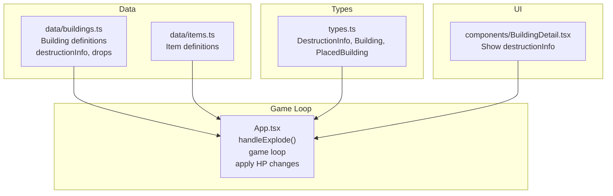
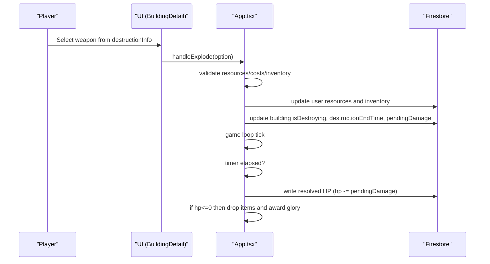
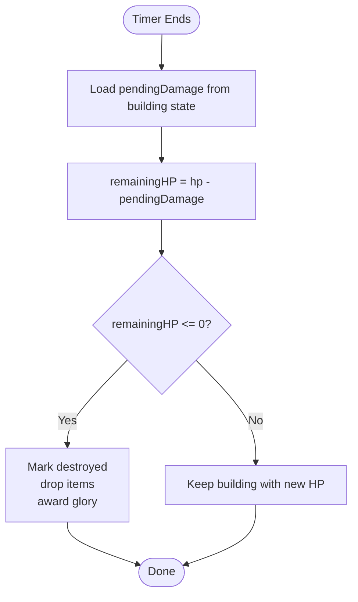
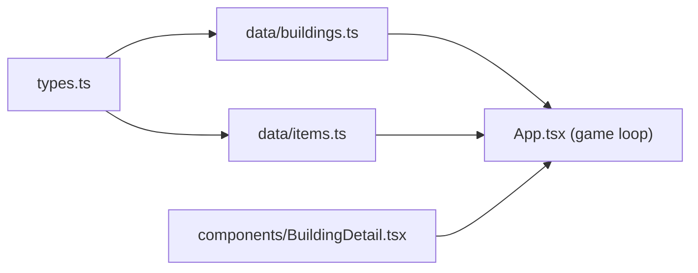

# Damage Calculation

<cite>
**Referenced Files in This Document**
- [App.tsx](file://App.tsx)
- [types.ts](file://types.ts)
- [data/buildings.ts](file://data/buildings.ts)
- [data/items.ts](file://data/items.ts)
- [components/BuildingDetail.tsx](file://components/BuildingDetail.tsx)
- [README.md](file://README.md)
</cite>

## Table of Contents
1. [Introduction](#introduction)
2. [Project Structure](#project-structure)
3. [Core Components](#core-components)
4. [Architecture Overview](#architecture-overview)
5. [Detailed Component Analysis](#detailed-component-analysis)
6. [Dependency Analysis](#dependency-analysis)
7. [Performance Considerations](#performance-considerations)
8. [Troubleshooting Guide](#troubleshooting-guide)
9. [Conclusion](#conclusion)

## Introduction
This document explains the building destruction and damage calculation system in the game. It covers how weapon damage interacts with building durability, how the destruction timer resolves into a final HP change, and how resource drops and glory rewards are determined upon destruction. It also provides concrete examples across building types and weapon combinations, and discusses balance and optimization considerations for efficient resource extraction.

## Project Structure
The damage and destruction system spans several parts of the codebase:
- Types define the data contracts for buildings, items, and destruction options.
- Building definitions include per-structure destruction options and drop tables.
- The game loop applies destruction timers and updates building HP and state.
- UI components present destruction options and results.

**Diagram sources**
- [types.ts:25-96](file://types.ts#L25-L96)
- [data/buildings.ts:1-400](file://data/buildings.ts#L1-L400)
- [data/items.ts:1-415](file://data/items.ts#L1-L415)
- [App.tsx:5241-5324](file://App.tsx#L5241-L5324)
- [App.tsx:3468-3614](file://App.tsx#L3468-L3614)
- [components/BuildingDetail.tsx:119-150](file://components/BuildingDetail.tsx#L119-L150)

**Section sources**
- [README.md:1-21](file://README.md#L1-L21)
- [types.ts:25-96](file://types.ts#L25-L96)
- [data/buildings.ts:1-400](file://data/buildings.ts#L1-L400)
- [data/items.ts:1-415](file://data/items.ts#L1-L415)
- [App.tsx:5241-5324](file://App.tsx#L5241-L5324)
- [App.tsx:3468-3614](file://App.tsx#L3468-L3614)
- [components/BuildingDetail.tsx:119-150](file://components/BuildingDetail.tsx#L119-L150)

## Core Components
- DestructionInfo: Defines weapon usage costs, time, and the damage value applied to a building.
- Building: Contains stats including durability and drops, plus per-weapon destructionInfo entries.
- PlacedBuilding: Runtime state including hp, maxHp, isDestroying, destructionEndTime, and pendingDamage.
- Game loop: Applies destruction timers and updates HP and state.

Key behaviors:
- Players select a destruction option from a building’s destructionInfo.
- The system validates resources and costs, then starts a destruction timer.
- On timer completion, pendingDamage is subtracted from current HP to resolve destruction.

**Section sources**
- [types.ts:25-96](file://types.ts#L25-L96)
- [data/buildings.ts:1-400](file://data/buildings.ts#L1-L400)
- [App.tsx:5241-5324](file://App.tsx#L5241-L5324)
- [App.tsx:3468-3614](file://App.tsx#L3468-L3614)

## Architecture Overview
The destruction flow connects UI selection, state updates, and the game loop.

**Diagram sources**
- [components/BuildingDetail.tsx:119-150](file://components/BuildingDetail.tsx#L119-L150)
- [App.tsx:5241-5324](file://App.tsx#L5241-L5324)
- [App.tsx:3468-3614](file://App.tsx#L3468-L3614)

## Detailed Component Analysis

### DestructionInfo and Building Definitions
- Each building exposes an array of destruction options (destructionInfo).
- Each option specifies:
  - resourceId: the weapon item consumed
  - amount: quantity consumed
  - goldCost and energyCost: resource costs
  - timeSeconds: duration until destruction resolves
  - damage: the numeric damage applied when the timer completes
- Buildings also define stats.durability and drops for loot generation.

Examples from data:
- Low-tier residential building supports very small weapons with tiny damage and short times.
- Town Hall variants scale durability and damage values significantly.
- Very high-tier residential buildings include extremely expensive and powerful weapons.

Concrete examples (descriptive):
- A low-tier residential building can be damaged by a small firecracker-type weapon with minimal cost and short time, resulting in small damage.
- A high-tier residential building requires heavy ordnance with substantial gold and energy costs, long times, and large damage values.
- Town halls reward significant glory on destruction and often drop valuable resources.

**Section sources**
- [data/buildings.ts:27-82](file://data/buildings.ts#L27-L82)
- [data/buildings.ts:120-130](file://data/buildings.ts#L120-L130)
- [data/buildings.ts:542-597](file://data/buildings.ts#L542-L597)
- [data/buildings.ts:636-691](file://data/buildings.ts#L636-L691)
- [data/buildings.ts:730-785](file://data/buildings.ts#L730-L785)
- [types.ts:25-33](file://types.ts#L25-L33)

### Damage Calculation Algorithm
The system does not compute a formula with weapon power, armor, and environment modifiers. Instead:
- Each destruction option defines a fixed damage value.
- When the destruction timer ends, the building’s HP is reduced by the option’s damage value.
- If HP reaches zero, the building is destroyed, dropping resources according to the building’s drop tables and awarding glory.

**Diagram sources**
- [App.tsx:3468-3475](file://App.tsx#L3468-L3475)
- [App.tsx:3527-3529](file://App.tsx#L3527-L3529)
- [App.tsx:3545-3587](file://App.tsx#L3545-L3587)

**Section sources**
- [App.tsx:3468-3475](file://App.tsx#L3468-L3475)
- [App.tsx:3527-3529](file://App.tsx#L3527-L3529)
- [App.tsx:3545-3587](file://App.tsx#L3545-L3587)

### Resource Recovery and Material Extraction Efficiency
- Upon destruction, the building’s drop tables (frequent and rare) are evaluated probabilistically.
- Each drop entry includes an optional chance percentage; if the random roll succeeds, a dropped item is spawned at the building location.
- Inventory and resource costs (gold, energy) are consumed when initiating destruction.

Notes:
- There is no explicit “partial damage” extraction multiplier in the code. Full loot is awarded on full destruction.
- The system relies on probabilistic drops; higher-tier buildings generally offer more valuable drops.

**Section sources**
- [App.tsx:3557-3587](file://App.tsx#L3557-L3587)
- [data/buildings.ts:24-26](file://data/buildings.ts#L24-L26)
- [data/buildings.ts:111-119](file://data/buildings.ts#L111-L119)
- [data/buildings.ts:532-541](file://data/buildings.ts#L532-L541)

### Glory Calculation System
- Each building defines a gloryOnExplosion value.
- When a building is destroyed by its owner or a controller with permission, that glory amount is added to the player’s glory and persisted to the database.

**Section sources**
- [types.ts:55-85](file://types.ts#L55-L85)
- [App.tsx:3554-3555](file://App.tsx#L3554-L3555)
- [App.tsx:3608-3613](file://App.tsx#L3608-L3613)

### UI Presentation of Destruction Options
- The building detail UI lists available destruction options, including weapon name, required amount, gold and energy costs, time, and damage value.
- The explosion menu validates availability of resources and energy before enabling the action.

**Section sources**
- [components/BuildingDetail.tsx:119-150](file://components/BuildingDetail.tsx#L119-L150)
- [App.tsx:6361-6402](file://App.tsx#L6361-L6402)
- [App.tsx:5241-5266](file://App.tsx#L5241-L5266)

## Dependency Analysis

**Diagram sources**
- [types.ts:25-96](file://types.ts#L25-L96)
- [data/buildings.ts:1-400](file://data/buildings.ts#L1-L400)
- [data/items.ts:1-415](file://data/items.ts#L1-L415)
- [App.tsx:3468-3614](file://App.tsx#L3468-L3614)
- [components/BuildingDetail.tsx:119-150](file://components/BuildingDetail.tsx#L119-L150)

**Section sources**
- [types.ts:25-96](file://types.ts#L25-L96)
- [data/buildings.ts:1-400](file://data/buildings.ts#L1-L400)
- [data/items.ts:1-415](file://data/items.ts#L1-L415)
- [App.tsx:3468-3614](file://App.tsx#L3468-L3614)
- [components/BuildingDetail.tsx:119-150](file://components/BuildingDetail.tsx#L119-L150)

## Performance Considerations
- The game loop iterates all placed buildings each frame to process timers and damage. Keep the number of concurrent destructions reasonable to avoid excessive writes.
- Probabilistic drop evaluation occurs per building on destruction; ensure drop tables are concise to minimize overhead.
- Firestore operations are batched per update; avoid frequent rapid toggles of isDestroying to reduce write volume.

## Troubleshooting Guide
Common issues and checks:
- Building not destroyed after timer: Verify destructionEndTime and pendingDamage are set and that the timer has elapsed.
- HP remains unchanged: Confirm the building’s hp field exists and pendingDamage is non-zero.
- No drops or glory: Ensure the building has drops configured and the destroyer qualifies as owner or permitted controller.
- UI shows unavailable actions: Confirm inventory has sufficient items and player has enough gold and energy.

**Section sources**
- [App.tsx:3468-3475](file://App.tsx#L3468-L3475)
- [App.tsx:3527-3529](file://App.tsx#L3527-L3529)
- [App.tsx:3545-3587](file://App.tsx#L3545-L3587)
- [App.tsx:5241-5266](file://App.tsx#L5241-L5266)

## Conclusion
The destruction system uses deterministic, pre-defined damage values per weapon option rather than a complex formula. This simplifies balance around predefined tiers of buildings and weapons while preserving meaningful progression and rewards. For efficient resource extraction, focus on high-value targets with strong drop tables and appropriate weapon choices aligned with building durability and costs.