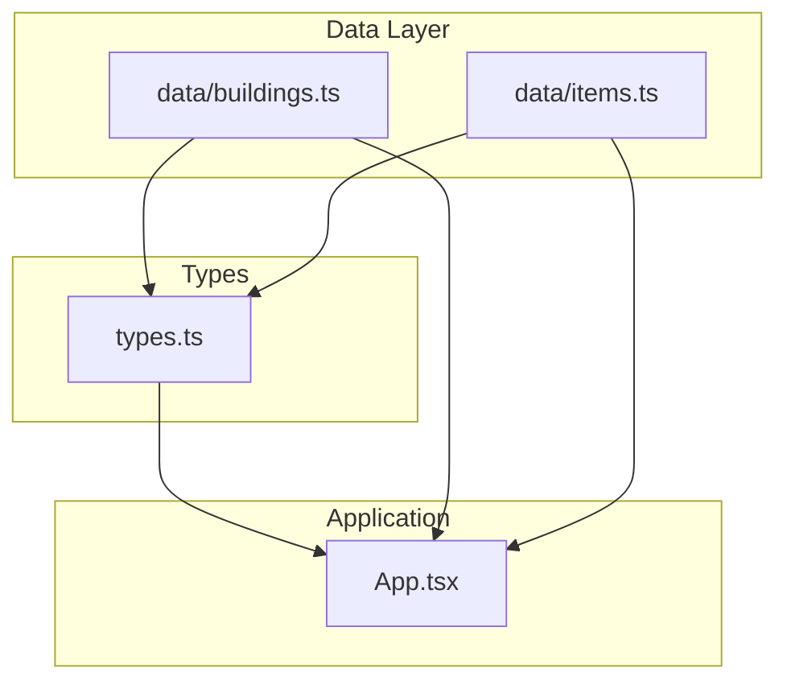
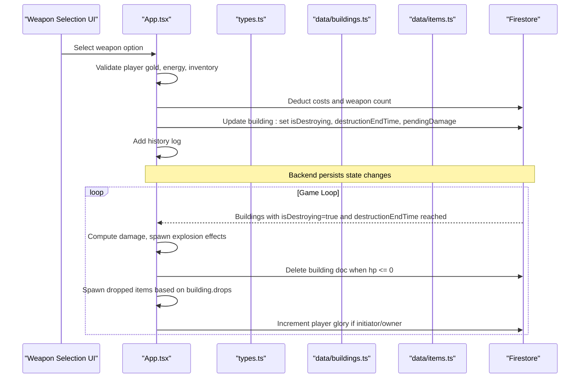
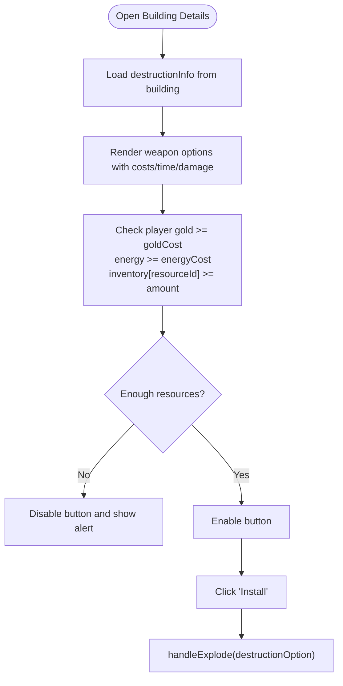
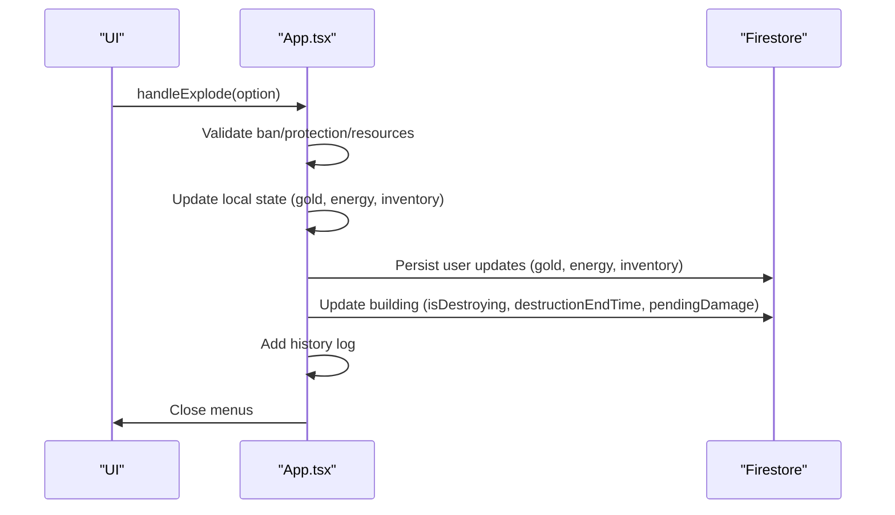
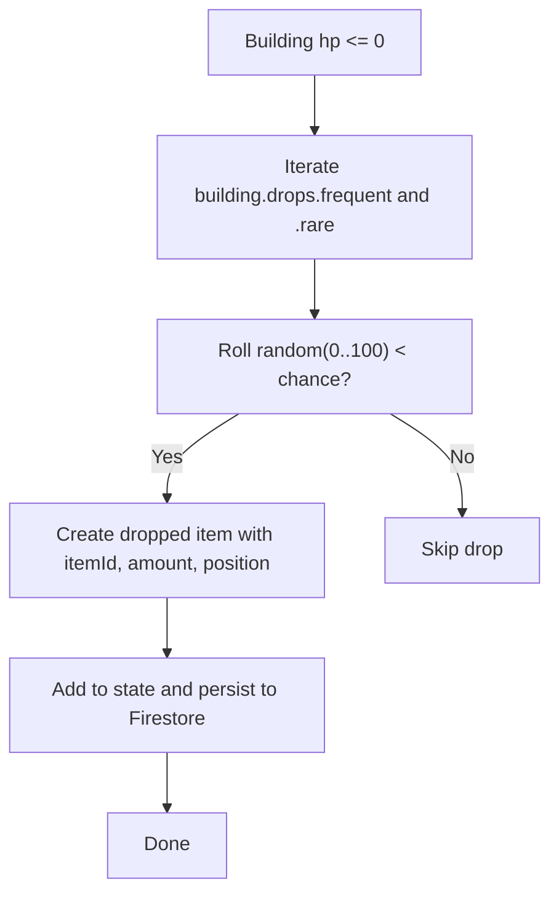
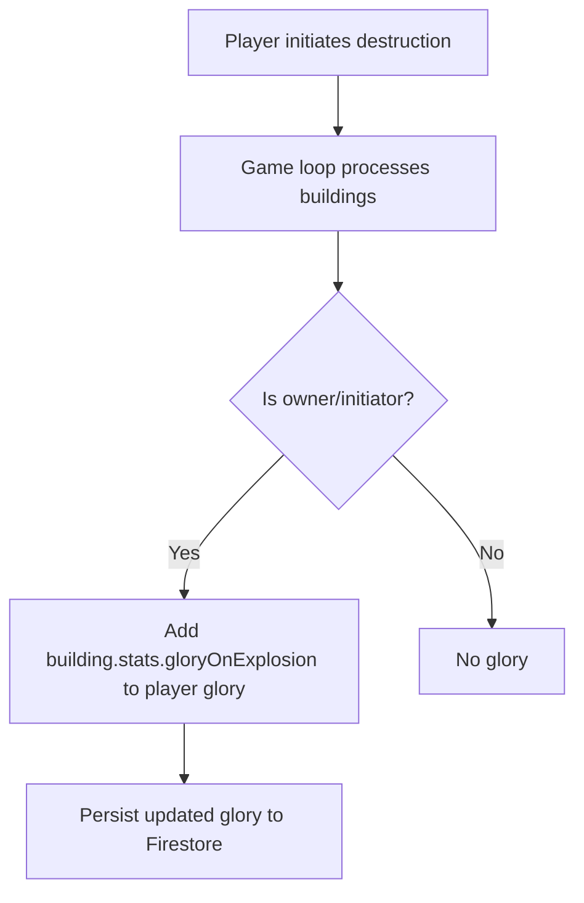
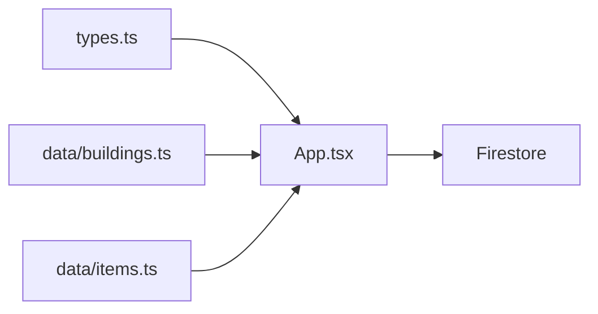

# Destruction Mechanics

<cite>
**Referenced Files in This Document**
- [buildings.ts](file://data/buildings.ts)
- [items.ts](file://data/items.ts)
- [types.ts](file://types.ts)
- [App.tsx](file://App.tsx)
</cite>

## Table of Contents
1. [Introduction](#introduction)
2. [Project Structure](#project-structure)
3. [Core Components](#core-components)
4. [Architecture Overview](#architecture-overview)
5. [Detailed Component Analysis](#detailed-component-analysis)
6. [Dependency Analysis](#dependency-analysis)
7. [Performance Considerations](#performance-considerations)
8. [Troubleshooting Guide](#troubleshooting-guide)
9. [Conclusion](#conclusion)
10. [Appendices](#appendices)

## Introduction
This document explains the destruction mechanics of the game, focusing on the demolition system, weapon usage, cost validation, and resource recovery. It documents the destructionInfo configuration that defines available weapons per building type, cost structures, and damage calculations. It also covers the weapon selection interface, execution workflow, resource recovery via building drops, and the glory calculation system. Finally, it addresses strategic considerations such as clan territory control, defensive measures, and troubleshooting/validation errors.

## Project Structure
The destruction system spans three primary areas:
- Data definitions: building templates and item definitions
- Type contracts: shared interfaces for buildings, items, and destruction info
- Application logic: UI interactions, validation, Firestore updates, and game loop processing

**Diagram sources**
- [buildings.ts](file://data/buildings.ts)
- [items.ts](file://data/items.ts)
- [types.ts](file://types.ts)
- [App.tsx](file://App.tsx)

**Section sources**
- [buildings.ts](file://data/buildings.ts)
- [items.ts](file://data/items.ts)
- [types.ts](file://types.ts)
- [App.tsx](file://App.tsx)

## Core Components
- DestructionInfo: Defines weapon availability, costs, and damage per building.
- Building: Contains stats (durability, gloryOnExplosion), drops configuration, and destructionInfo.
- Item: Describes weapon items used for demolition (e.g., fireworks, bombs, atomic weapons).
- App.tsx: Implements the weapon selection UI, cost validation, and destruction execution.

Key responsibilities:
- destructionInfo lists available demolition options per building.
- Cost validation checks player gold, energy, and weapon inventory.
- Execution sets building destruction timers and pending damage.
- Resource recovery spawns dropped items based on building drops configuration.
- Glory points increase when a building is destroyed by the initiating player or owner.

**Section sources**
- [types.ts](file://types.ts)
- [buildings.ts](file://data/buildings.ts)
- [items.ts](file://data/items.ts)
- [App.tsx](file://App.tsx)

## Architecture Overview
The destruction workflow integrates UI selection, validation, and backend updates. The game loop processes destruction timers and triggers resource drops and glory accumulation.

**Diagram sources**
- [App.tsx](file://App.tsx)
- [types.ts](file://types.ts)
- [buildings.ts](file://data/buildings.ts)
- [items.ts](file://data/items.ts)

## Detailed Component Analysis

### DestructionInfo and Building Drops
- destructionInfo entries define:
  - resourceId: weapon item ID used for demolition
  - weaponName: display name
  - amount: quantity consumed
  - goldCost, energyCost: financial and energy costs
  - timeSeconds: demolition duration
  - damage: damage applied to building health
- Building stats include:
  - durability: base HP
  - gloryOnExplosion: glory awarded upon destruction
- Drops configuration:
  - frequent and rare arrays with resource entries
  - optional chance thresholds for probabilistic drops

Examples from data:
- Small residential building supports low-tier weapons with minimal costs and short durations.
- Town Hall tiers progressively increase durability, gloryOnExplosion, and support higher-tier weapons with substantial costs and long durations.
- Some buildings include destructionInfo while others do not, indicating demolition availability varies by building.

**Section sources**
- [buildings.ts](file://data/buildings.ts)
- [types.ts](file://types.ts)

### Weapon Selection Interface
The UI presents available demolition options derived from a building’s destructionInfo:
- Displays weapon icon, name, required amount, gold cost, energy cost, time, and damage.
- Enables selection only when player has sufficient gold, energy, and weapon items.
- Disables buttons otherwise.

**Diagram sources**
- [App.tsx](file://App.tsx)
- [buildings.ts](file://data/buildings.ts)

**Section sources**
- [App.tsx](file://App.tsx)

### Execution Workflow and Validation
Validation steps:
- Ban check prevents banned players from detonating.
- Protection check prevents detonation if the building is under protection.
- Gold and energy balance checks.
- Inventory check for required weapon amount.

Execution steps:
- Deduct gold, energy, and weapon item from player state and Firestore.
- Log destruction event.
- Update building document with:
  - isDestroying flag
  - destructionEndTime timestamp
  - pendingDamage value
- Clear UI overlays.

**Diagram sources**
- [App.tsx](file://App.tsx)

**Section sources**
- [App.tsx](file://App.tsx)

### Resource Recovery System
When a building is destroyed:
- Frequent and rare drops are iterated.
- Each drop entry includes id, amount, and optional chance.
- Random chance determines whether a drop spawns.
- Dropped items are added to state and persisted to Firestore.
- Drop ownership is set to the player name who initiated/owned the destruction.

**Diagram sources**
- [App.tsx](file://App.tsx)
- [buildings.ts](file://data/buildings.ts)

**Section sources**
- [App.tsx](file://App.tsx)
- [buildings.ts](file://data/buildings.ts)

### Glory Calculation System
Glory is incremented when:
- The building is destroyed by its owner or the player who initiated the destruction.
- The building template defines gloryOnExplosion.

The game loop detects destroyed buildings and adds glory to the player’s account, persisting the change to Firestore.

**Diagram sources**
- [App.tsx](file://App.tsx)
- [buildings.ts](file://data/buildings.ts)

**Section sources**
- [App.tsx](file://App.tsx)
- [buildings.ts](file://data/buildings.ts)

### Strategic Bombing Campaigns and Defensive Considerations
- Strategic targeting: Higher-tier Town Hall buildings yield greater gloryOnExplosion and support more destructive weapons, making them attractive targets for campaigns.
- Defensive posture: Buildings can be protected; during protection, demolition is blocked until protection expires.
- Clan territory control: While not explicitly modeled in the destruction code, controlling high-value buildings (e.g., Town Halls) increases glory gains and resource drops, influencing territorial dominance.

[No sources needed since this section synthesizes gameplay implications without quoting specific code]

## Dependency Analysis
The destruction system depends on:
- Building templates for stats, drops, and destructionInfo.
- Item definitions for weapon resources and metadata.
- Shared types for consistent data contracts.
- App.tsx for UI, validation, persistence, and game loop processing.

**Diagram sources**
- [types.ts](file://types.ts)
- [buildings.ts](file://data/buildings.ts)
- [items.ts](file://data/items.ts)
- [App.tsx](file://App.tsx)

**Section sources**
- [types.ts](file://types.ts)
- [buildings.ts](file://data/buildings.ts)
- [items.ts](file://data/items.ts)
- [App.tsx](file://App.tsx)

## Performance Considerations
- Minimize Firestore writes: Batch updates where possible; the code already optimistically updates UI state before server sync.
- Limit explosion effects: Visual effects are cleaned after duration to avoid memory growth.
- Optimize game loop: Only process buildings with isDestroying and destructionEndTime reached.
- Large-scale demolitions: Prefer client-side estimates for UI responsiveness; server-side reconciliation ensures consistency.

[No sources needed since this section provides general guidance]

## Troubleshooting Guide
Common validation errors and resolutions:
- Insufficient gold: Ensure playerGold meets goldCost before enabling the button.
- Insufficient energy: Ensure playerEnergy meets energyCost.
- Missing weapon items: Verify inventory[resourceId] meets required amount.
- Protected building: Wait until protectionEndTime passes.
- Banned player: Cannot initiate demolition; unban or switch accounts.

Operational tips:
- Confirm Firestore connectivity and permissions for user and building documents.
- Monitor game loop logs for building deletion and drop creation.
- Verify building.drops configuration exists and has valid entries.

**Section sources**
- [App.tsx](file://App.tsx)
- [buildings.ts](file://data/buildings.ts)

## Conclusion
The destruction mechanics combine configurable building templates, robust cost validation, and a seamless execution pipeline. Players can select from a range of weapons, pay associated costs, and trigger demolition timers. Upon completion, the system spawns resource drops and awards glory based on ownership and initiation. Defensive protections and strategic targeting shape gameplay dynamics around clan territories and resource control.

[No sources needed since this section summarizes without analyzing specific files]

## Appendices

### Example Scenarios
- Low-tier residential building: Minimal gold/energy cost, small weapon consumption, short duration, low damage and glory.
- Town Hall tier 1: Moderate costs and duration, moderate damage and glory.
- Town Hall tier 7: Very high costs and duration, very high damage and glory; supports highest-tier weapons.

These examples reflect the scaling present in the building templates.

**Section sources**
- [buildings.ts](file://data/buildings.ts)