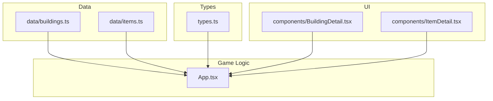
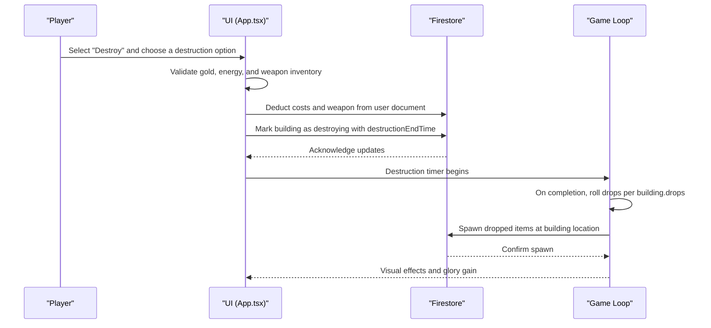
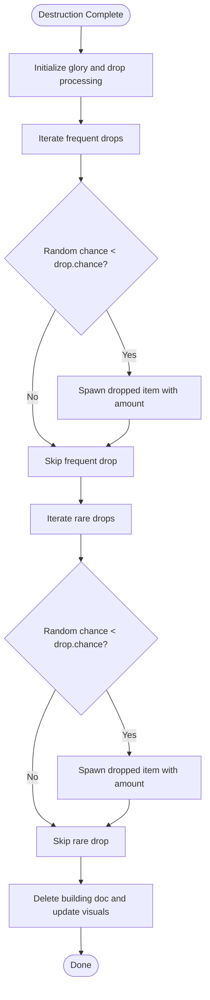
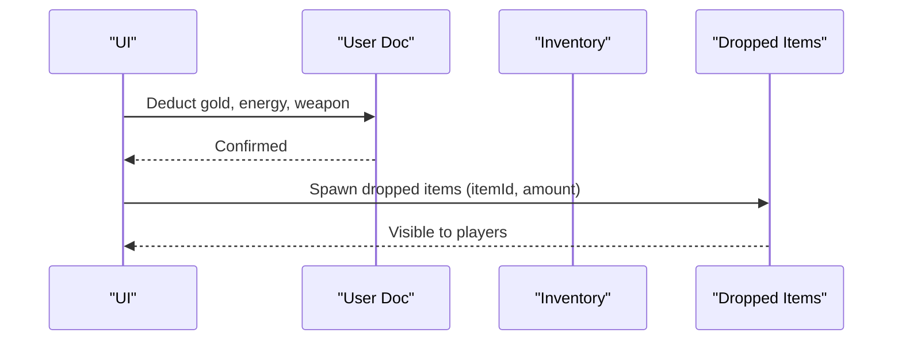
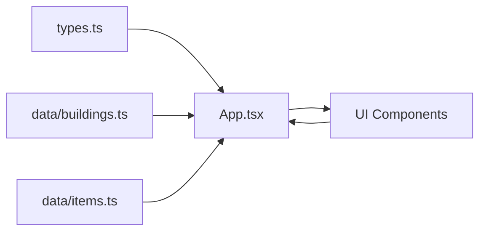

# Resource Recovery

<cite>
**Referenced Files in This Document**
- [buildings.ts](file://data/buildings.ts)
- [items.ts](file://data/items.ts)
- [types.ts](file://types.ts)
- [App.tsx](file://App.tsx)
- [BuildingDetail.tsx](file://components/BuildingDetail.tsx)
- [ItemDetail.tsx](file://components/ItemDetail.tsx)
</cite>

## Table of Contents
1. [Introduction](#introduction)
2. [Project Structure](#project-structure)
3. [Core Components](#core-components)
4. [Architecture Overview](#architecture-overview)
5. [Detailed Component Analysis](#detailed-component-analysis)
6. [Dependency Analysis](#dependency-analysis)
7. [Performance Considerations](#performance-considerations)
8. [Troubleshooting Guide](#troubleshooting-guide)
9. [Conclusion](#conclusion)
10. [Appendices](#appendices)

## Introduction
This document explains the resource recovery system after building destruction. It covers how building drops configuration determines resource return amounts and probabilities, the frequency/rare classification system, and how different drop types affect recovery efficiency. It also documents the integration with the player inventory system and storage capacity considerations, and discusses the relationship between resource recovery and the game economy, including how destruction affects resource supply chains. Finally, it provides recovery optimization strategies to help players maximize resource yield from demolition operations.

## Project Structure
The resource recovery system spans several modules:
- Data definitions for buildings and items define drop configurations and categories.
- Types describe the interfaces for drops, destruction options, and building stats.
- UI components present drop information and destruction options to the player.
- Application logic handles the destruction process, applies costs, and spawns recovered items.

**Diagram sources**
- [buildings.ts](file://data/buildings.ts)
- [items.ts](file://data/items.ts)
- [types.ts](file://types.ts)
- [App.tsx](file://App.tsx)
- [BuildingDetail.tsx](file://components/BuildingDetail.tsx)
- [ItemDetail.tsx](file://components/ItemDetail.tsx)

**Section sources**
- [buildings.ts](file://data/buildings.ts)
- [items.ts](file://data/items.ts)
- [types.ts](file://types.ts)
- [App.tsx](file://App.tsx)
- [BuildingDetail.tsx](file://components/BuildingDetail.tsx)
- [ItemDetail.tsx](file://components/ItemDetail.tsx)

## Core Components
- Building drops configuration: Each building defines two lists of recoverable resources:
  - frequent: Items that have a high probability of dropping.
  - rare: Items that have a lower probability of dropping.
- Drop entries specify:
  - id: The resource/item identifier.
  - name: The display name.
  - amount: The quantity dropped when successful.
  - chance: The percentage chance for that specific drop to occur.
- Destruction options: Each building can define multiple ways to destroy it, each with:
  - resourceId: The weapon item required (e.g., Firecracker).
  - weaponName: The weapon’s display name.
  - amount: The quantity of the weapon required.
  - goldCost: The gold paid to initiate destruction.
  - energyCost: The energy paid to initiate destruction.
  - timeSeconds: The destruction duration.
  - damage: Optional building damage applied during destruction.

These components combine to determine what players receive when they destroy a building and how much it costs to do so.

**Section sources**
- [buildings.ts](file://data/buildings.ts)
- [types.ts](file://types.ts)

## Architecture Overview
The destruction and recovery flow involves the UI, game logic, and persistence:

**Diagram sources**
- [App.tsx](file://App.tsx)
- [types.ts](file://types.ts)

## Detailed Component Analysis

### Building Drops Configuration
- Drops are grouped into frequent and rare lists.
- Each drop entry includes:
  - id and name for identification and display.
  - amount specifying the quantity yielded.
  - chance indicating the probability (percent) that the drop occurs.
- Buildings without drops still support destruction; they simply do not spawn additional resources beyond normal rewards.

Examples from data:
- Residential building with frequent and rare drops.
- Town Hall variants with progressively richer frequent/rare combinations.
- Other building types with varied drop profiles.

**Section sources**
- [buildings.ts](file://data/buildings.ts)

### Frequency/Rare Classification System
- frequent vs. rare categorization influences recovery efficiency:
  - frequent: Higher probability of yielding resources per destruction.
  - rare: Lower probability but often higher-value or unique items.
- Some entries include a frequency field at the item level (e.g., items.ts), but building drops use a separate chance field per drop entry.

**Section sources**
- [buildings.ts](file://data/buildings.ts)
- [items.ts](file://data/items.ts)

### Destruction Options and Costs
- Each building exposes one or more destruction options.
- Each option requires:
  - A weapon item (resourceId) with a specific amount.
  - Payment of gold and energy.
- The selected option sets the building’s destructionEndTime and initiates the destruction process.

**Section sources**
- [buildings.ts](file://data/buildings.ts)
- [types.ts](file://types.ts)
- [App.tsx](file://App.tsx)

### Recovery Calculation Logic
- When a building finishes destruction, the game rolls for each drop in both frequent and rare lists.
- For each drop, a random percent is compared against the drop’s chance. If successful, a dropped item is spawned at the building’s coordinates.
- The dropped item includes:
  - id, x, y, zoneId.
  - itemId (matching the drop id).
  - amount (from the drop).
  - ownerName for attribution.

**Diagram sources**
- [App.tsx](file://App.tsx)

**Section sources**
- [App.tsx](file://App.tsx)

### Integration with Player Inventory and Storage Capacity
- Destruction costs are deducted from player resources:
  - goldCost from gold.
  - energyCost from energy.
  - amount of the weapon item from inventory.
- After destruction, dropped items appear on the map and can be collected by players.
- Gold capacity caps income; the system enforces a maximum cap when adding gold to the player’s balance.

**Diagram sources**
- [App.tsx](file://App.tsx)

**Section sources**
- [App.tsx](file://App.tsx)

### UI Presentation of Drops and Destruction Options
- BuildingDetail displays:
  - frequent and rare drops under “Drops on destruction.”
  - optional gold reward (givesCoins).
- ItemDetail renders resource lists with:
  - name.
  - amount (if present).
  - chance (if present).
  - frequency (if present).

**Section sources**
- [BuildingDetail.tsx](file://components/BuildingDetail.tsx)
- [ItemDetail.tsx](file://components/ItemDetail.tsx)

## Dependency Analysis
- Data dependencies:
  - buildings.ts supplies building-specific drop configurations and destruction options.
  - items.ts supplies item metadata (categories, production/drop relationships).
- Type dependencies:
  - types.ts defines ResourceInfo, Building, DestructionInfo, and related interfaces used across the app.
- Runtime dependencies:
  - App.tsx orchestrates destruction validation, cost deduction, persistence, and drop spawning.
  - UI components rely on data and types to render accurate information.

**Diagram sources**
- [types.ts](file://types.ts)
- [buildings.ts](file://data/buildings.ts)
- [items.ts](file://data/items.ts)
- [App.tsx](file://App.tsx)

**Section sources**
- [types.ts](file://types.ts)
- [buildings.ts](file://data/buildings.ts)
- [items.ts](file://data/items.ts)
- [App.tsx](file://App.tsx)

## Performance Considerations
- Drop rolling occurs per building on destruction completion; keep frequent and rare lists concise to minimize overhead.
- Limit the number of simultaneous destruction actions to avoid excessive concurrent writes.
- Use batched Firestore updates for bulk operations when applicable.
- Avoid spawning excessive dropped items in dense areas to reduce rendering and collision checks.

## Troubleshooting Guide
Common issues and resolutions:
- Not enough resources to destroy:
  - Ensure sufficient gold, energy, and the required weapon amount before initiating destruction.
- Weapon not found:
  - Verify the weapon item exists in inventory and meets the required amount.
- Protection active:
  - Destruction is blocked while a protection timer remains; wait for protection to expire.
- No drops appear:
  - Check that the building has frequent or rare drops configured.
  - Confirm that the random chance for each drop is met; low-probability rare drops may not spawn every time.

**Section sources**
- [App.tsx](file://App.tsx)

## Conclusion
The resource recovery system ties together building drop configurations, destruction mechanics, and inventory/storage constraints. By understanding the frequent/rare classification, drop chances, and destruction costs, players can optimize their recovery yields. Strategic selection of destruction options, combined with managing inventory and storage capacity, maximizes long-term resource throughput and supports broader economic goals.

## Appendices

### Example Scenarios and Calculations
Note: The following examples illustrate mechanics and do not reproduce code. Replace values with actual IDs and quantities from the data files.

- Scenario A: Destroy a residential building with frequent and rare drops
  - Frequent drop: 50% chance to yield 2 units of a common resource.
  - Rare drop: 30% chance to yield 1 unit of a rare resource.
  - Expected yield per destruction:
    - Common resource: 2 × 50% = 1 unit average.
    - Rare resource: 1 × 30% = 0.3 units average.
  - Actual yield depends on random chance per destruction.

- Scenario B: Destroy a Town Hall variant with richer drops
  - Frequent list includes multiple items with varying amounts and chances.
  - Rare list includes higher-value items with lower chances.
  - Strategy: Choose a destruction option that minimizes cost while maximizing expected yield across both lists.

- Scenario C: Destruction costs and weapon requirements
  - A destruction option may require 1 weapon item, cost 50 gold, and 10 energy.
  - Ensure inventory has at least 1 weapon item before attempting destruction.

- Scenario D: Recovery efficiency and drop types
  - frequent items increase reliability of recovery.
  - rare items increase variance and potential high-value returns.
  - Optimize by balancing risk (rare) with consistency (frequent).

- Scenario E: Integration with inventory and storage
  - After destruction, dropped items spawn at the building’s location.
  - Collect dropped items to replenish inventory.
  - Gold income is capped by storage capacity; manage upgrades that increase capacity.

[No sources needed since this section provides illustrative examples]