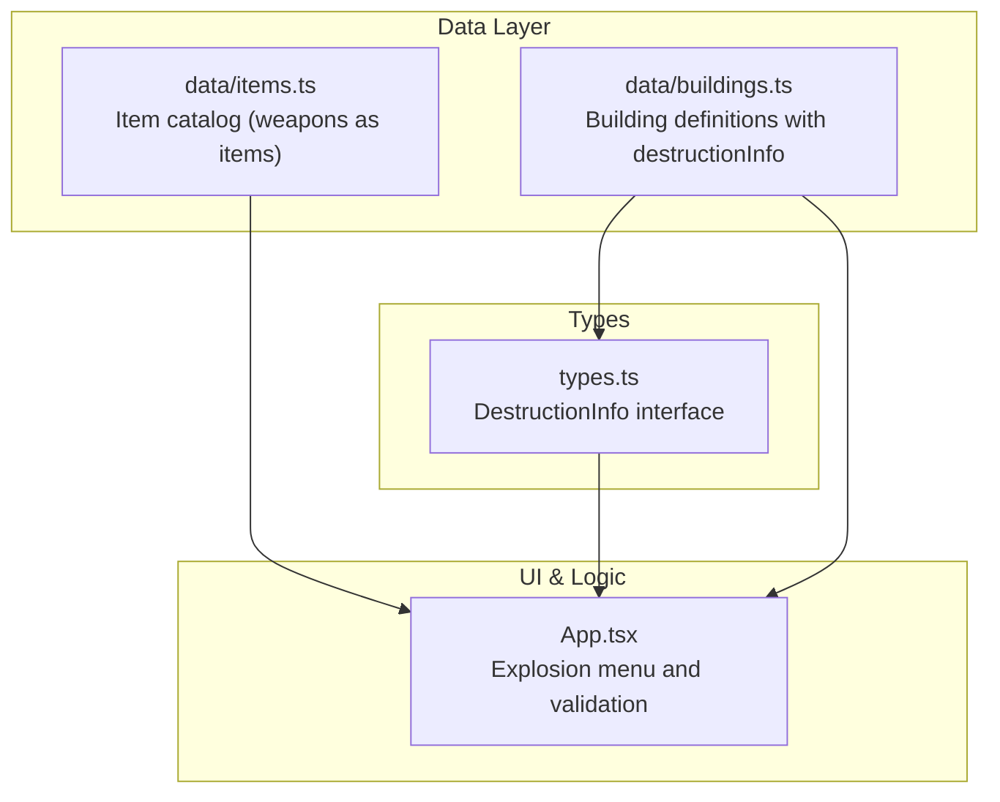
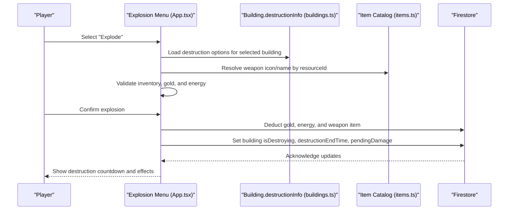
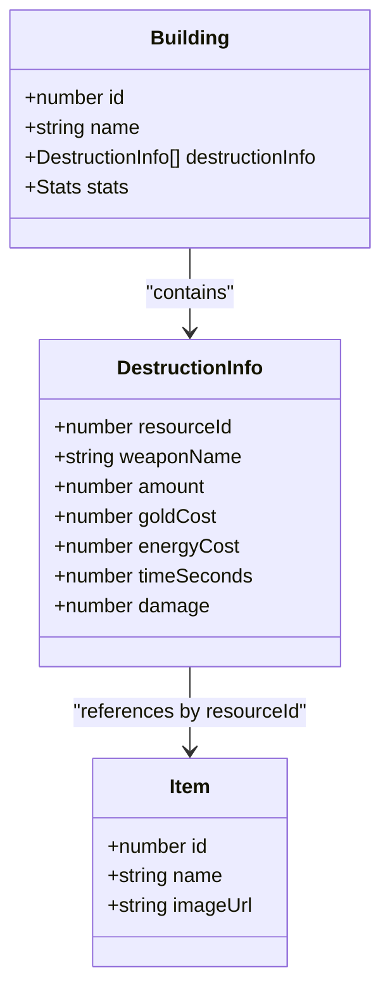
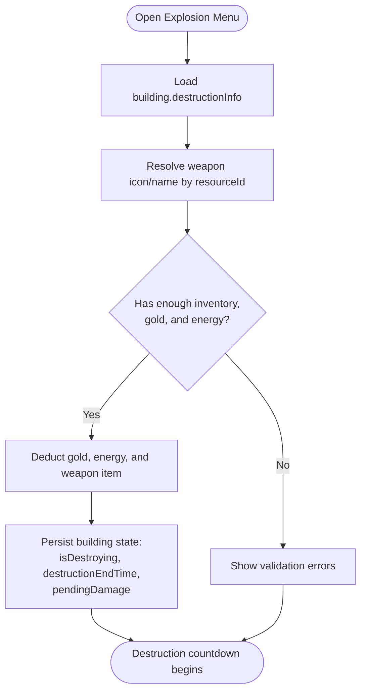
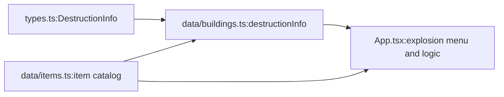

# Weapon System

<cite>
**Referenced Files in This Document**
- [buildings.ts](file://data/buildings.ts)
- [items.ts](file://data/items.ts)
- [types.ts](file://types.ts)
- [App.tsx](file://App.tsx)
</cite>

## Table of Contents
1. [Introduction](#introduction)
2. [Project Structure](#project-structure)
3. [Core Components](#core-components)
4. [Architecture Overview](#architecture-overview)
5. [Detailed Component Analysis](#detailed-component-analysis)
6. [Dependency Analysis](#dependency-analysis)
7. [Performance Considerations](#performance-considerations)
8. [Troubleshooting Guide](#troubleshooting-guide)
9. [Conclusion](#conclusion)

## Introduction
This document explains the weapon system used for building destruction in the game. It focuses on the weapon definitions contained in each building’s destructionInfo array, covering the properties weaponName, resourceId, amount, goldCost, energyCost, timeSeconds, and damage. It also documents how weapon availability evolves as players progress through the game, how weapon effectiveness scales with building levels, and how different building types influence destruction outcomes. Finally, it describes how players acquire weapons and unlock more powerful options over time.

## Project Structure
The weapon system spans three primary areas:
- Data definitions: weapon properties and building-level destruction options are defined in data/buildings.ts and data/items.ts.
- Type contracts: the DestructionInfo interface formalizes weapon attributes in types.ts.
- Runtime logic: the explosion UI and validation logic are implemented in App.tsx.

**Diagram sources**
- [buildings.ts](file://data/buildings.ts)
- [items.ts](file://data/items.ts)
- [types.ts](file://types.ts)
- [App.tsx](file://App.tsx)

**Section sources**
- [buildings.ts](file://data/buildings.ts)
- [types.ts](file://types.ts)
- [App.tsx](file://App.tsx)

## Core Components
- DestructionInfo: Defines a single weapon option for destroying a building, including the weapon item identifier, cost in gold and energy, required quantity, and the damage dealt.
- Building.destructionInfo: An array of DestructionInfo entries attached to each building, representing available weapon options at that building’s level.
- Items: The item catalog lists weapon items (e.g., firecrackers, garden bombs, atomic bombs) and their properties.

Key properties of DestructionInfo:
- resourceId: The weapon item id used for destruction.
- weaponName: Display name of the weapon.
- amount: Quantity of the weapon item consumed per use.
- goldCost: Cost in gold paid per use.
- energyCost: Cost in energy paid per use.
- timeSeconds: Duration (in seconds) for the destruction process.
- damage: Damage applied to the building’s HP.

How these are used:
- Buildings expose a list of destruction options via destructionInfo.
- The UI presents these options to the player and validates resource availability before allowing an explosion.

**Section sources**
- [types.ts:25-33](file://types.ts#L25-L33)
- [buildings.ts:27-82](file://data/buildings.ts#L27-L82)
- [items.ts:118-151](file://data/items.ts#L118-L151)

## Architecture Overview
The weapon system integrates data-driven destruction options with runtime validation and persistence.

**Diagram sources**
- [App.tsx:5241-5324](file://App.tsx#L5241-L5324)
- [App.tsx:6362-6408](file://App.tsx#L6362-L6408)
- [buildings.ts:27-82](file://data/buildings.ts#L27-L82)
- [items.ts:118-151](file://data/items.ts#L118-L151)

## Detailed Component Analysis

### DestructionInfo Model
DestructionInfo encapsulates a single weapon option for a building. It is defined in the types module and populated per building in the data module.

**Diagram sources**
- [types.ts:25-33](file://types.ts#L25-L33)
- [types.ts:42-96](file://types.ts#L42-L96)
- [items.ts:10-23](file://data/items.ts#L10-L23)

**Section sources**
- [types.ts:25-33](file://types.ts#L25-L33)
- [types.ts:42-96](file://types.ts#L42-L96)
- [items.ts:10-23](file://data/items.ts#L10-L23)

### Weapon Availability and Unlocking
- Initial availability: Many buildings include basic weapons (e.g., small fireworks) right from early levels.
- Progression path: As buildings level up, their destructionInfo often expands to include progressively stronger weapons (e.g., super garden bombs, guided missiles, atomic bombs).
- Example progression:
  - Early residential buildings commonly offer small fireworks and basic garden bombs.
  - Higher-level residential and specialized buildings include guided missiles, super garden bombs, and atomic-class weapons.
- Acquisition method: Weapons are obtained by producing them in-game (e.g., growing them on dedicated patches) or receiving them as drops from buildings. The explosion UI checks inventory amounts against the required amount for each option.

Concrete examples from the dataset:
- Early-level residential building destructionInfo includes small fireworks and basic garden bombs with modest gold and energy costs and short destruction times.
- Higher-level residential and specialized buildings include guided missiles and atomic-class weapons with higher gold and energy costs, longer destruction times, and substantial damage.

**Section sources**
- [buildings.ts:345-400](file://data/buildings.ts#L345-L400)
- [buildings.ts:878-933](file://data/buildings.ts#L878-L933)
- [buildings.ts:1270-1325](file://data/buildings.ts#L1270-L1325)
- [buildings.ts:4560-4565](file://data/buildings.ts#L4560-L4565)
- [buildings.ts:4602-4607](file://data/buildings.ts#L4602-L4607)
- [buildings.ts:4647-4652](file://data/buildings.ts#L4647-L4652)

### Cost Progression and Scaling
- Gold and energy costs increase with weapon power. For example, early weapons cost very low gold and energy, while advanced weapons require thousands of gold and significant energy.
- TimeSeconds generally increases for more powerful weapons, reflecting longer preparation or detonation sequences.
- Damage scales substantially with weapon tier, enabling efficient destruction of high-durability buildings.

Examples from the dataset:
- Early-level options: small fireworks and basic garden bombs with minimal gold and energy costs and short durations.
- Advanced options: guided missiles and atomic-class weapons with high gold and energy costs, long durations, and large damage values.

**Section sources**
- [buildings.ts:345-400](file://data/buildings.ts#L345-L400)
- [buildings.ts:878-933](file://data/buildings.ts#L878-L933)
- [buildings.ts:1270-1325](file://data/buildings.ts#L1270-L1325)
- [buildings.ts:4560-4565](file://data/buildings.ts#L4560-L4565)
- [buildings.ts:4602-4607](file://data/buildings.ts#L4602-L4607)
- [buildings.ts:4647-4652](file://data/buildings.ts#L4647-L4652)

### Effectiveness Scaling with Building Levels
- Building durability and glory values scale with level. Higher-level buildings have greater base durability and may drop more valuable resources.
- To match this, destructionInfo for higher-level buildings typically offers more expensive and powerful weapons with higher damage and longer times.
- The explosion logic applies the selected weapon’s damage to the building’s HP, factoring in the building’s current and maximum HP.

Evidence from dataset:
- Town Hall tiers show increasing stats and destructionInfo complexity as levels rise.
- High-level residential and specialized buildings include atomic-class weapons with extremely high damage and long durations.

**Section sources**
- [buildings.ts:16-23](file://data/buildings.ts#L16-L23)
- [buildings.ts:102-110](file://data/buildings.ts#L102-L110)
- [buildings.ts:150-158](file://data/buildings.ts#L150-L158)
- [buildings.ts:188-196](file://data/buildings.ts#L188-L196)
- [buildings.ts:226-234](file://data/buildings.ts#L226-L234)
- [buildings.ts:265-273](file://data/buildings.ts#L265-L273)
- [buildings.ts:304-312](file://data/buildings.ts#L304-L312)
- [buildings.ts:730-784](file://data/buildings.ts#L730-L784)

### Relationship Between Weapon Types and Building Vulnerabilities
- The dataset demonstrates that different building categories and levels expose different destructionInfo arrays. This implies varying vulnerabilities to different weapon types.
- For example, early-level buildings commonly include small fireworks and basic garden bombs, while higher-level buildings include guided missiles and atomic-class weapons.
- The explosion UI validates whether the player has sufficient inventory, gold, and energy for the chosen weapon option, ensuring only feasible combinations are attempted.

**Section sources**
- [buildings.ts:345-400](file://data/buildings.ts#L345-L400)
- [buildings.ts:878-933](file://data/buildings.ts#L878-L933)
- [buildings.ts:1270-1325](file://data/buildings.ts#L1270-L1325)
- [buildings.ts:4560-4565](file://data/buildings.ts#L4560-L4565)
- [buildings.ts:4602-4607](file://data/buildings.ts#L4602-L4607)
- [buildings.ts:4647-4652](file://data/buildings.ts#L4647-L4652)

### Explosion Flow and Validation
The explosion flow validates prerequisites and applies the selected weapon’s effect to the building.

**Diagram sources**
- [App.tsx:5241-5324](file://App.tsx#L5241-L5324)
- [App.tsx:6362-6408](file://App.tsx#L6362-L6408)
- [buildings.ts:27-82](file://data/buildings.ts#L27-L82)
- [items.ts:118-151](file://data/items.ts#L118-L151)

**Section sources**
- [App.tsx:5241-5324](file://App.tsx#L5241-L5324)
- [App.tsx:6362-6408](file://App.tsx#L6362-L6408)

## Dependency Analysis
- types.ts defines the DestructionInfo interface used by data/buildings.ts.
- data/buildings.ts populates destructionInfo arrays for each building.
- data/items.ts provides the item catalog referenced by destructionInfo via resourceId.
- App.tsx reads destructionInfo, resolves items, validates resources, and persists explosion state.

**Diagram sources**
- [types.ts:25-33](file://types.ts#L25-L33)
- [buildings.ts:27-82](file://data/buildings.ts#L27-L82)
- [items.ts:118-151](file://data/items.ts#L118-L151)
- [App.tsx:6362-6408](file://App.tsx#L6362-L6408)

**Section sources**
- [types.ts:25-33](file://types.ts#L25-L33)
- [buildings.ts:27-82](file://data/buildings.ts#L27-L82)
- [items.ts:118-151](file://data/items.ts#L118-L151)
- [App.tsx:6362-6408](file://App.tsx#L6362-L6408)

## Performance Considerations
- The explosion UI iterates over a building’s destructionInfo to render options and compute validity. Keep destructionInfo arrays concise for frequently accessed buildings to minimize rendering overhead.
- Resource validation occurs client-side before persistence. Ensure that inventory and resource checks remain lightweight to avoid UI lag during rapid selection.

## Troubleshooting Guide
Common issues and resolutions:
- Insufficient inventory: The UI checks required weapon quantities and displays a message if missing. Ensure the player has produced or acquired the necessary weapon items.
- Insufficient gold or energy: The UI validates gold and energy costs and prevents explosions if funds are lacking.
- Building under protection: Explosions are blocked if the building is under protection.
- No destruction options: Some buildings may not expose destructionInfo, meaning they cannot be destroyed with the current weapon system.

**Section sources**
- [App.tsx:5241-5324](file://App.tsx#L5241-L5324)
- [App.tsx:6362-6408](file://App.tsx#L6362-L6408)

## Conclusion
The weapon system is data-driven and scales with building levels. Players unlock more powerful weapons as buildings advance, reflected in destructionInfo arrays that include progressively stronger options with higher costs and damage. The UI enforces strict validation to ensure only feasible explosions occur, and persistence logic applies the weapon’s effect to the building’s HP. Understanding the relationship between weapon tiers and building vulnerabilities enables efficient and strategic destruction across the game world.