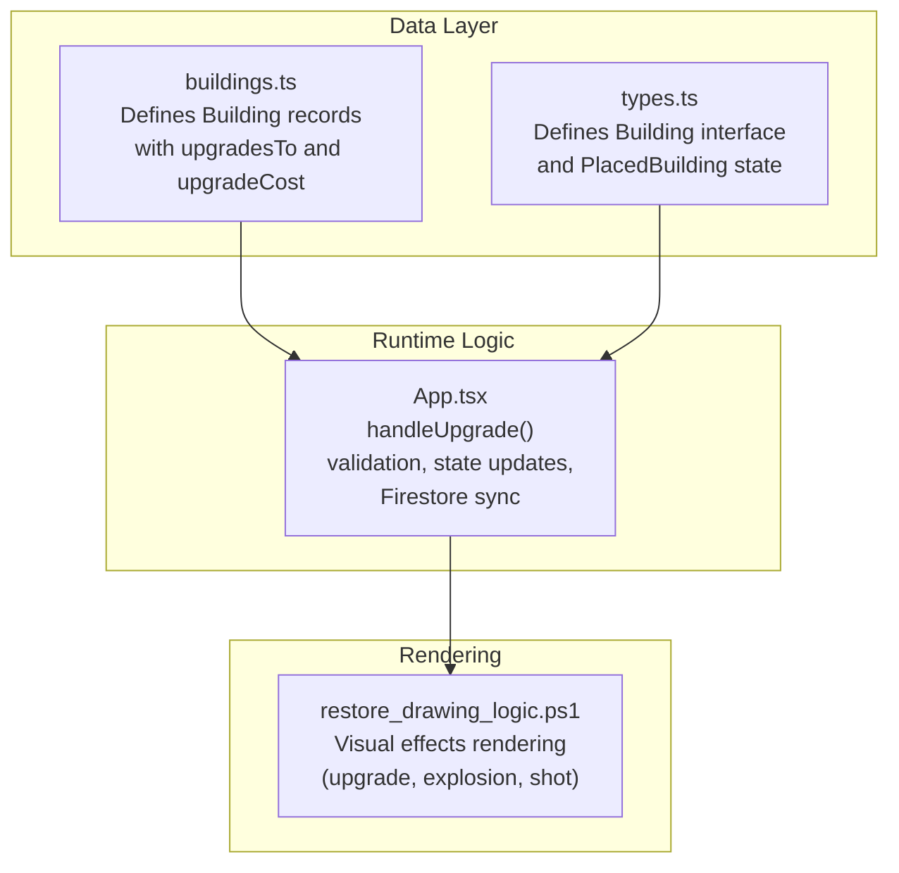
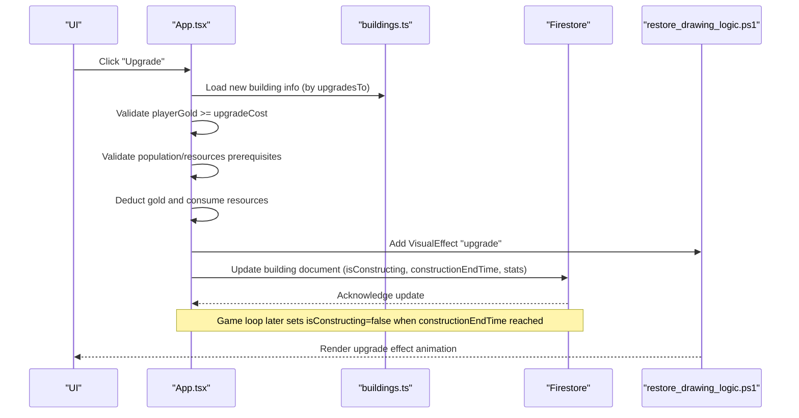
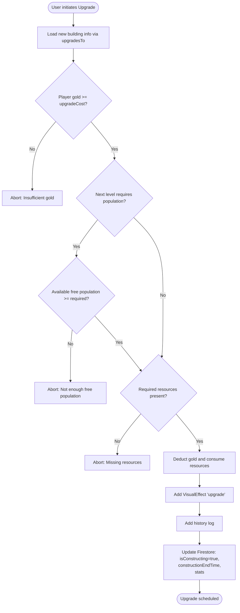
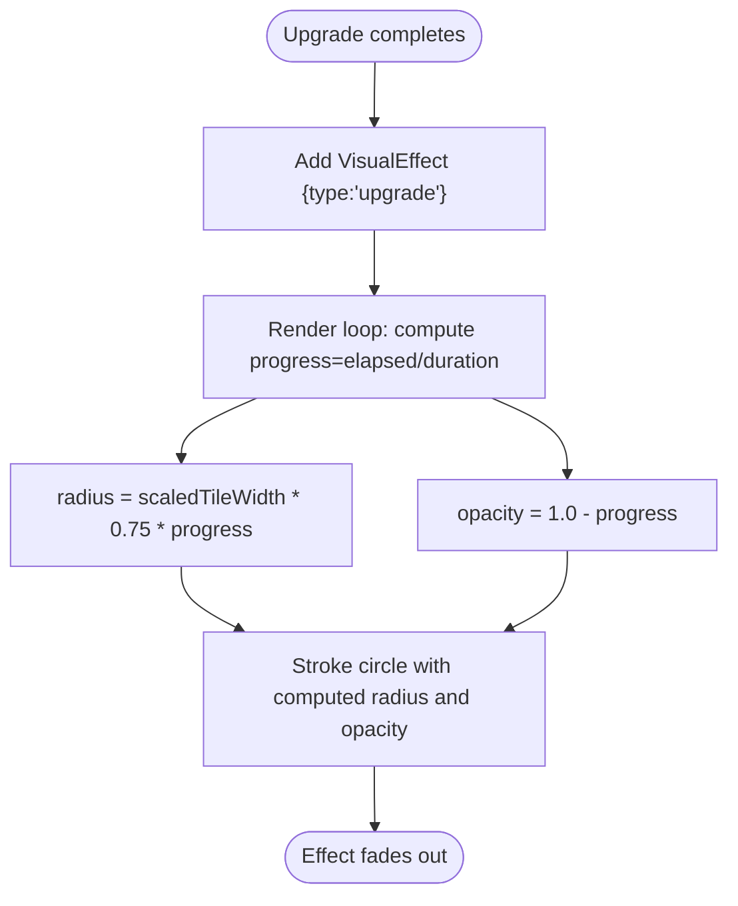
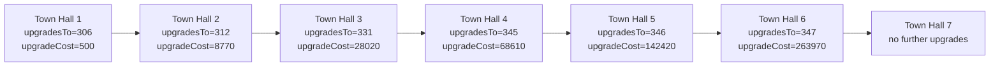
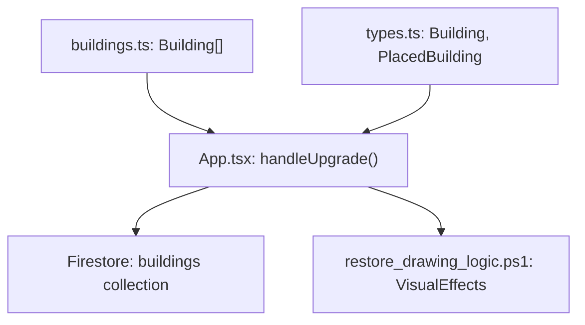

# Upgrade System

<cite>
**Referenced Files in This Document**
- [App.tsx](file://App.tsx)
- [buildings.ts](file://data/buildings.ts)
- [types.ts](file://types.ts)
- [restore_drawing_logic.ps1](file://restore_drawing_logic.ps1)
</cite>

## Table of Contents
1. [Introduction](#introduction)
2. [Project Structure](#project-structure)
3. [Core Components](#core-components)
4. [Architecture Overview](#architecture-overview)
5. [Detailed Component Analysis](#detailed-component-analysis)
6. [Dependency Analysis](#dependency-analysis)
7. [Performance Considerations](#performance-considerations)
8. [Troubleshooting Guide](#troubleshooting-guide)
9. [Conclusion](#conclusion)

## Introduction
This document explains the building upgrade system, focusing on upgrade paths, cost progression, validation, state transitions, completion, synchronization across clients, and visual feedback. It also connects upgrades to city progression mechanics such as city limits, resource production, and defensive capabilities. Concrete examples are drawn from the Town Hall upgrade chain (levels 1 through 7) and other building categories.

## Project Structure
The upgrade system spans three primary areas:
- Data definition: Building schema and upgrade metadata live in the data module.
- Runtime logic: Upgrade validation, cost deduction, Firestore updates, and UI state changes are implemented in the main application.
- Rendering: Visual effects for upgrades are rendered via the canvas drawing pipeline.



**Diagram sources**
- [buildings.ts:1-1200](file://data/buildings.ts#L1-L1200)
- [types.ts:42-147](file://types.ts#L42-L147)
- [App.tsx:4462-4545](file://App.tsx#L4462-L4545)
- [restore_drawing_logic.ps1:90-118](file://restore_drawing_logic.ps1#L90-L118)

**Section sources**
- [buildings.ts:1-1200](file://data/buildings.ts#L1-L1200)
- [types.ts:42-147](file://types.ts#L42-L147)
- [App.tsx:4462-4545](file://App.tsx#L4462-L4545)
- [restore_drawing_logic.ps1:90-118](file://restore_drawing_logic.ps1#L90-L118)

## Core Components
- Building data model: Each Building record includes upgrade metadata (upgradesTo, upgradeCost) and construction requirements (resources, population).
- Upgrade action handler: Validates prerequisites, deducts costs, triggers construction timers, and synchronizes state to Firestore.
- State representation: PlacedBuilding tracks construction state, timestamps, and derived stats for rendering and gameplay.
- Visual effects: Upgrade completion is represented by a golden expanding ring animation.

Key upgrade-related fields and types:
- Building.upgradesTo: Target building ID after upgrade.
- Building.upgradeCost: Upfront gold cost for upgrading.
- Building.constructionRequirements: Population and resource prerequisites for the next level.
- PlacedBuilding.isConstructing, constructionEndTime: Tracks upgrade progress and completion.
- VisualEffect with type "upgrade": Renders the upgrade completion animation.

**Section sources**
- [types.ts:42-96](file://types.ts#L42-L96)
- [types.ts:119-147](file://types.ts#L119-L147)
- [buildings.ts:84-86](file://data/buildings.ts#L84-L86)
- [buildings.ts:133-135](file://data/buildings.ts#L133-L135)
- [buildings.ts:169-171](file://data/buildings.ts#L169-L171)
- [buildings.ts:207-209](file://data/buildings.ts#L207-L209)
- [buildings.ts:245-247](file://data/buildings.ts#L245-L247)
- [buildings.ts:284-286](file://data/buildings.ts#L284-L286)
- [buildings.ts:323-323](file://data/buildings.ts#L323-L323)

## Architecture Overview
The upgrade flow involves client-side validation, resource deduction, state mutation, and Firestore synchronization. On completion, the server-side game loop finalizes construction and updates state for all clients.



**Diagram sources**
- [App.tsx:4462-4545](file://App.tsx#L4462-L4545)
- [buildings.ts:84-86](file://data/buildings.ts#L84-L86)
- [restore_drawing_logic.ps1:90-118](file://restore_drawing_logic.ps1#L90-L118)

## Detailed Component Analysis

### Upgrade Validation and Cost Deduction
The upgrade action validates:
- Gold availability against upgradeCost.
- Population prerequisites for non-TownHall targets.
- Required resources from constructionRequirements.resources.

It then:
- Deducts gold and decrements inventory resources.
- Triggers a visual upgrade effect.
- Logs history entries.
- Updates Firestore with construction flags and timers.



**Diagram sources**
- [App.tsx:4462-4545](file://App.tsx#L4462-L4545)

**Section sources**
- [App.tsx:4462-4545](file://App.tsx#L4462-L4545)

### Upgrade Completion and State Synchronization
Completion occurs when the constructionEndTime elapses. The game loop finalizes construction and sets isConstructing=false and workState='idle'. The UI reflects this change immediately via optimistic updates and Firestore snapshots.

```mermaid
sequenceDiagram
participant LOOP as "Game Loop"
participant FS as "Firestore"
participant APP as "App.tsx"
participant UI as "UI"
LOOP->>FS : Read building with isConstructing=true
alt constructionEndTime reached
LOOP->>FS : Set isConstructing=false, workState='idle'
FS-->>APP : Snapshot update
APP->>UI : Optimistically update placedBuildings
else still constructing
LOOP->>FS : No change
end
```

**Diagram sources**
- [App.tsx:3487-3495](file://App.tsx#L3487-L3495)

**Section sources**
- [App.tsx:3487-3495](file://App.tsx#L3487-L3495)

### Visual Feedback System
The upgrade effect is a golden expanding ring centered on the building. The renderer computes radius and opacity based on elapsed time and effect duration.



**Diagram sources**
- [App.tsx:4502-4509](file://App.tsx#L4502-L4509)
- [restore_drawing_logic.ps1:90-118](file://restore_drawing_logic.ps1#L90-L118)

**Section sources**
- [App.tsx:4502-4509](file://App.tsx#L4502-L4509)
- [restore_drawing_logic.ps1:90-118](file://restore_drawing_logic.ps1#L90-L118)

### Town Hall Upgrade Chain Example
The Town Hall follows a fixed upgrade chain with increasing upgradeCost and construction requirements. Each level grants higher permits, durability, population bonus, and other benefits.



**Diagram sources**
- [buildings.ts:84-86](file://data/buildings.ts#L84-L86)
- [buildings.ts:133-135](file://data/buildings.ts#L133-L135)
- [buildings.ts:169-171](file://data/buildings.ts#L169-L171)
- [buildings.ts:207-209](file://data/buildings.ts#L207-L209)
- [buildings.ts:245-247](file://data/buildings.ts#L245-L247)
- [buildings.ts:284-286](file://data/buildings.ts#L284-L286)
- [buildings.ts:323-323](file://data/buildings.ts#L323-L323)

**Section sources**
- [buildings.ts:84-86](file://data/buildings.ts#L84-L86)
- [buildings.ts:133-135](file://data/buildings.ts#L133-L135)
- [buildings.ts:169-171](file://data/buildings.ts#L169-L171)
- [buildings.ts:207-209](file://data/buildings.ts#L207-L209)
- [buildings.ts:245-247](file://data/buildings.ts#L245-L247)
- [buildings.ts:284-286](file://data/buildings.ts#L284-L286)
- [buildings.ts:323-323](file://data/buildings.ts#L323-L323)

### Relationship to City Progression Mechanics
- City limits and permits: Town Hall levels increase permits, allowing more constructions.
- Population capacity: Higher population bonuses enable larger populations and more efficient production.
- Defensive capabilities: Increased durability and gloryOnExplosion improve resilience and post-destruction glory.
- Resource production: Some buildings grant givesCoins or workYieldGold, scaling with level.

These effects are encoded in stats fields and reflected in UI and gameplay logic.

**Section sources**
- [buildings.ts:102-110](file://data/buildings.ts#L102-L110)
- [buildings.ts:150-158](file://data/buildings.ts#L150-L158)
- [buildings.ts:188-196](file://data/buildings.ts#L188-L196)
- [buildings.ts:226-234](file://data/buildings.ts#L226-L234)
- [buildings.ts:265-273](file://data/buildings.ts#L265-L273)
- [buildings.ts:304-312](file://data/buildings.ts#L304-L312)

## Dependency Analysis
The upgrade system depends on:
- Building definitions for upgrade metadata and prerequisites.
- PlacedBuilding state for construction timers and flags.
- Firestore for cross-client synchronization.
- Canvas rendering for visual effects.



**Diagram sources**
- [buildings.ts:1-1200](file://data/buildings.ts#L1-L1200)
- [types.ts:42-147](file://types.ts#L42-L147)
- [App.tsx:4462-4545](file://App.tsx#L4462-L4545)
- [restore_drawing_logic.ps1:90-118](file://restore_drawing_logic.ps1#L90-L118)

**Section sources**
- [buildings.ts:1-1200](file://data/buildings.ts#L1-L1200)
- [types.ts:42-147](file://types.ts#L42-L147)
- [App.tsx:4462-4545](file://App.tsx#L4462-L4545)
- [restore_drawing_logic.ps1:90-118](file://restore_drawing_logic.ps1#L90-L118)

## Performance Considerations
- Upgrade cost progression: Costs grow exponentially across levels, encouraging strategic pacing.
- Construction timers: Offload timing to server via constructionEndTime to avoid client drift.
- Visual effects: Effects are lightweight animations; keep duration reasonable to minimize render overhead.
- Firestore writes: Batch updates and optimistic UI reduce perceived latency.

## Troubleshooting Guide
Common upgrade-related issues and resolutions:
- Insufficient gold: The handler aborts early and alerts the player. Ensure sufficient funds before initiating upgrades.
- Missing resources: The handler checks constructionRequirements.resources and blocks upgrades if any required resource is absent.
- Insufficient free population: The handler validates free population against required population for non-TownHall upgrades.
- Incomplete upgrades: If a player leaves mid-upgrade, the game loop finalizes construction when constructionEndTime is reached, preventing stuck states.
- Rollback mechanisms: There is no explicit rollback for failed upgrades; however, the system relies on atomic Firestore updates and the game loop’s finalization to maintain consistency.

**Section sources**
- [App.tsx:4471-4492](file://App.tsx#L4471-L4492)
- [App.tsx:3487-3495](file://App.tsx#L3487-L3495)

## Conclusion
The upgrade system integrates data-driven upgrade metadata, robust client-side validation, and Firestore-backed state synchronization. Visual feedback enhances the player experience, while the game loop ensures reliable completion. The Town Hall chain exemplifies predictable progression with increasing costs and benefits, aligning upgrades with city growth, production, and defense.