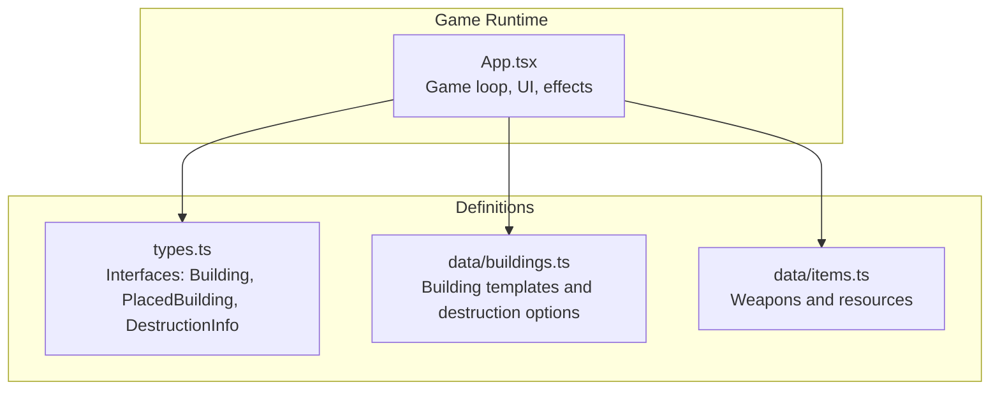
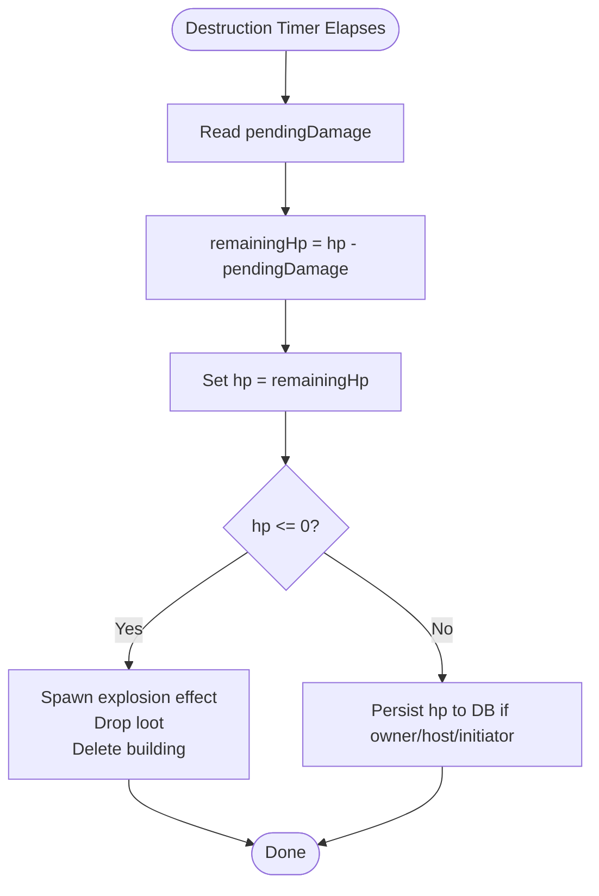
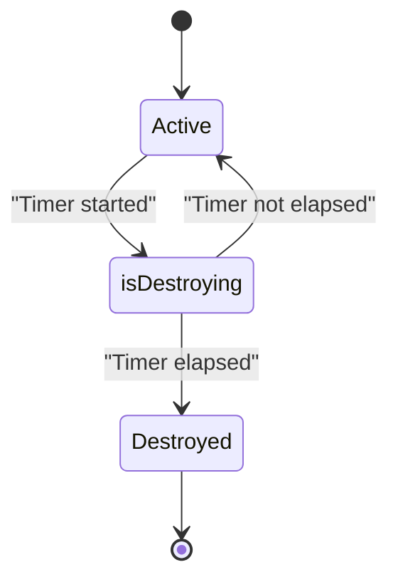
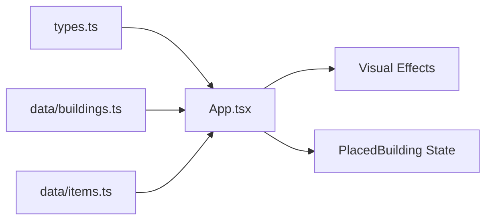

# Building Destruction

<cite>
**Referenced Files in This Document**
- [App.tsx](file://App.tsx)
- [types.ts](file://types.ts)
- [buildings.ts](file://data/buildings.ts)
- [items.ts](file://data/items.ts)
</cite>

## Table of Contents
1. [Introduction](#introduction)
2. [Project Structure](#project-structure)
3. [Core Components](#core-components)
4. [Architecture Overview](#architecture-overview)
5. [Detailed Component Analysis](#detailed-component-analysis)
6. [Dependency Analysis](#dependency-analysis)
7. [Performance Considerations](#performance-considerations)
8. [Troubleshooting Guide](#troubleshooting-guide)
9. [Conclusion](#conclusion)

## Introduction
This document explains the building destruction system in the game. It covers how damage is calculated, how building health is managed, how destruction cascades occur, and how visual and audio feedback are integrated. It also documents building-type-specific behaviors, synchronization across clients, performance optimization during large-scale destruction, and anti-exploit safeguards. The goal is to make the system understandable for beginners while providing deep technical insights for developers.

## Project Structure
The destruction system spans several files:
- Game logic and rendering: App.tsx
- Types and schemas: types.ts
- Building definitions and destruction options: data/buildings.ts
- Item definitions (weapons): data/items.ts



**Diagram sources**
- [App.tsx](file://App.tsx)
- [types.ts](file://types.ts)
- [buildings.ts](file://data/buildings.ts)
- [items.ts](file://data/items.ts)

**Section sources**
- [App.tsx](file://App.tsx)
- [types.ts](file://types.ts)
- [buildings.ts](file://data/buildings.ts)
- [items.ts](file://data/items.ts)

## Core Components
- DestructionInfo: Defines weapon-based destruction options per building, including cost, damage, and timing.
- Building: Contains base stats including durability and explosion glory yield, plus optional drops and destruction options.
- PlacedBuilding: Runtime state for each building instance, including hp, maxHp, isDestroying, destructionEndTime, pendingDamage, and initiatorId.
- VisualEffect: Rendering model for effects like explosions and flashes.

Key mechanics:
- Players choose a destruction option from a building’s destructionInfo.
- The system validates resources, gold, and energy costs.
- It updates the building’s runtime state (hp, maxHp, isDestroying, destructionEndTime, pendingDamage, initiatorId).
- The game loop applies destruction after the timer elapses and spawns visual effects and loot.

**Section sources**
- [types.ts:25-33](file://types.ts#L25-L33)
- [types.ts:42-96](file://types.ts#L42-L96)
- [types.ts:119-147](file://types.ts#L119-L147)
- [types.ts:149-158](file://types.ts#L149-L158)
- [buildings.ts:1-87](file://data/buildings.ts#L1-L87)
- [buildings.ts:325-400](file://data/buildings.ts#L325-L400)

## Architecture Overview
The destruction pipeline integrates UI selection, state updates, and the game loop.

```mermaid
sequenceDiagram
participant Player as "Player"
participant UI as "UI Menu<br/>App.tsx"
participant State as "PlacedBuilding<br/>types.ts"
participant Loop as "Game Loop<br/>App.tsx"
participant Effects as "Visual Effects<br/>App.tsx"
Player->>UI : Select destruction option
UI->>UI : Validate costs and inventory
UI->>State : Update hp/maxHp/isDestroying/destructionEndTime/pendingDamage/initiatorId
Note over UI,State : Firestore update or optimistic local update
Loop->>Loop : Tick every frame
Loop->>State : On timer completion, subtract pendingDamage
Loop->>Effects : Spawn flash/explosion effects
Loop->>State : If hp <= 0, drop loot and delete building
```

**Diagram sources**
- [App.tsx](file://App.tsx)
- [types.ts](file://types.ts)

## Detailed Component Analysis

### Damage Calculation and Health Management
- Base health: Derived from the building template’s durability stat.
- Pending damage: Applied when the destruction timer completes.
- Instant vs. delayed damage:
  - Instant damage is applied immediately when monsters or cannons deal damage.
  - Delayed damage is queued via pendingDamage and applied after destructionEndTime.



**Diagram sources**
- [App.tsx](file://App.tsx)
- [types.ts](file://types.ts)

**Section sources**
- [App.tsx:3467-3486](file://App.tsx#L3467-L3486)
- [App.tsx:3527-3598](file://App.tsx#L3527-L3598)
- [types.ts:119-147](file://types.ts#L119-L147)

### Building State Transitions
- isDestroying: Marks a building as scheduled for destruction.
- destructionEndTime: Timestamp when destruction completes.
- pendingDamage: Damage to apply upon completion.
- initiatorId: Tracks who started the destruction for loot and glory attribution.
- hp and maxHp: Current and initial health.



**Diagram sources**
- [App.tsx](file://App.tsx)
- [types.ts](file://types.ts)

**Section sources**
- [App.tsx:5288-5320](file://App.tsx#L5288-L5320)
- [types.ts:119-147](file://types.ts#L119-L147)

### Resource Loss Mechanisms
- Cost deduction occurs when initiating destruction:
  - Gold and energy are decremented.
  - Required weapon items are consumed from inventory.
- These deductions are persisted to Firestore when authenticated, otherwise applied optimistically to local state.

**Section sources**
- [App.tsx:5268-5282](file://App.tsx#L5268-L5282)
- [App.tsx:5286-5320](file://App.tsx#L5286-L5320)

### Destruction Cascading Effects
- Immediate damage from cannons and monsters is aggregated per tile and applied to the building’s hp.
- Visual feedback: A flash effect is spawned when immediate damage is applied.
- After destruction timer completion, a larger explosion effect is spawned, and loot is generated according to the building’s drop tables.

```mermaid
sequenceDiagram
participant Loop as "Game Loop"
participant Agg as "damageMap"
participant Bld as "PlacedBuilding"
participant FX as "Visual Effects"
Loop->>Agg : Accumulate damage per tile
Agg-->>Bld : Apply damage to hp
Bld->>FX : Spawn flash effect
Loop->>Bld : On timer end, apply pendingDamage
Bld->>FX : Spawn explosion effect
Bld->>Bld : Drop loot if hp <= 0
```

**Diagram sources**
- [App.tsx](file://App.tsx)
- [types.ts](file://types.ts)

**Section sources**
- [App.tsx:3291-3293](file://App.tsx#L3291-L3293)
- [App.tsx:3507-3525](file://App.tsx#L3507-L3525)
- [App.tsx:3531-3598](file://App.tsx#L3531-L3598)

### Building Type-Specific Behaviors
- Town Hall variants scale durability and explosion glory with level.
- Residential buildings have lower durability and smaller explosion glory.
- Some buildings expose destructionInfo arrays with multiple weapon options, each with distinct costs and damage.

Concrete examples from the codebase:
- Town Hall tier progression defines durability and explosion glory increases across levels.
- Residential buildings define small-scale destructionInfo entries for low-cost firecrackers and similar weapons.
- Higher-tier residential and stone houses include progressively stronger weapons and higher damage values.

**Section sources**
- [buildings.ts:16-27](file://data/buildings.ts#L16-L27)
- [buildings.ts:325-400](file://data/buildings.ts#L325-L400)
- [buildings.ts:542-597](file://data/buildings.ts#L542-L597)
- [buildings.ts:636-691](file://data/buildings.ts#L636-L691)
- [buildings.ts:730-785](file://data/buildings.ts#L730-L785)

### Destruction Animation System and Visual Effects
- Effects supported: upgrade ring, explosion wave, shot trail, and flash.
- Rendering computes progress per effect, maps world coordinates to screen, and draws shapes with dynamic opacity and radius.
- Flash is used for immediate damage; explosion is used for destruction completion.

**Section sources**
- [types.ts:149-158](file://types.ts#L149-L158)
- [App.tsx:3140-3184](file://App.tsx#L3140-L3184)
- [App.tsx:3512-3543](file://App.tsx#L3512-L3543)

### Sound Feedback
- No explicit sound effect definitions or playback logic were found in the analyzed files. If sound is desired, integrate audio triggers alongside visual effect spawning.

[No sources needed since this section does not analyze specific files]

### Relationship Between Building Durability, Damage Types, and Outcomes
- Durability determines baseline hp.
- Damage types:
  - Instant: from cannons/monsters; applied immediately.
  - Delayed: from destruction timers; applied after time elapses.
- Outcomes:
  - hp <= 0: building destroyed, explosion effect, glory gain, and loot drops.
  - hp > 0: building remains, updated hp persisted if owner/host/initiator.

**Section sources**
- [types.ts:60](file://types.ts#L60)
- [App.tsx:3507-3525](file://App.tsx#L3507-L3525)
- [App.tsx:3527-3598](file://App.tsx#L3527-L3598)

### UI Integration and Destruction Options
- The UI lists available destruction options for a selected building, showing weapon name, cost, energy, time, and damage.
- Players confirm to initiate destruction; the system enforces protection timers, bans, and resource checks.

**Section sources**
- [App.tsx:6362-6402](file://App.tsx#L6362-L6402)
- [App.tsx:5241-5284](file://App.tsx#L5241-L5284)

## Dependency Analysis
- App.tsx depends on:
  - types.ts for typed building and placement state.
  - data/buildings.ts for building templates and destruction options.
  - data/items.ts for weapon/item definitions.
- The game loop orchestrates:
  - Cannon/monster damage aggregation.
  - Destruction timer application.
  - Visual effect spawning.
  - Loot generation and persistence.



**Diagram sources**
- [App.tsx](file://App.tsx)
- [types.ts](file://types.ts)
- [buildings.ts](file://data/buildings.ts)
- [items.ts](file://data/items.ts)

**Section sources**
- [App.tsx](file://App.tsx)
- [types.ts](file://types.ts)
- [buildings.ts](file://data/buildings.ts)
- [items.ts](file://data/items.ts)

## Performance Considerations
- Minimize Firestore writes:
  - Owner/host/initiator updates are written; others are skipped to reduce load.
- Batch state changes:
  - The game loop consolidates updates and only persists when stateChanged is true.
- Local optimistic updates:
  - UI state updates immediately; server sync follows.
- Effect rendering:
  - Effects are drawn per frame; keep effect counts reasonable for large-scale events.

[No sources needed since this section provides general guidance]

## Troubleshooting Guide
Common issues and mitigations:
- Destruction stuck or not applying:
  - Verify destructionEndTime and pendingDamage are set and the timer has elapsed.
  - Confirm owner/host/initiator can write to the building document.
- Protection timer blocking destruction:
  - Check protectionEndTime; destruction is blocked until protection expires.
- Missing loot:
  - Ensure building has drops configured and the initiator/host logic allows loot generation.
- Synchronization across clients:
  - Use owner/host/initiator checks to gate writes; rely on Firestore transactions or optimistic updates for observers.

**Section sources**
- [App.tsx:3467-3486](file://App.tsx#L3467-L3486)
- [App.tsx:3545-3598](file://App.tsx#L3545-L3598)
- [App.tsx:5249-5252](file://App.tsx#L5249-L5252)

## Conclusion
The destruction system combines a robust state model with a deterministic game loop to manage delayed and instant damage, visual feedback, and loot drops. Building-type scaling ensures meaningful progression, while safeguards prevent abuse and maintain fairness. For large-scale events, focus on minimizing server writes and optimizing effect rendering to preserve responsiveness.