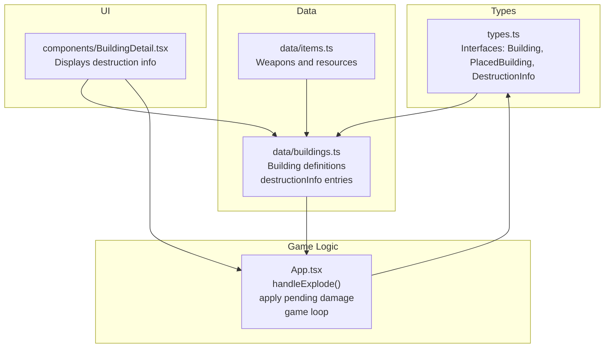
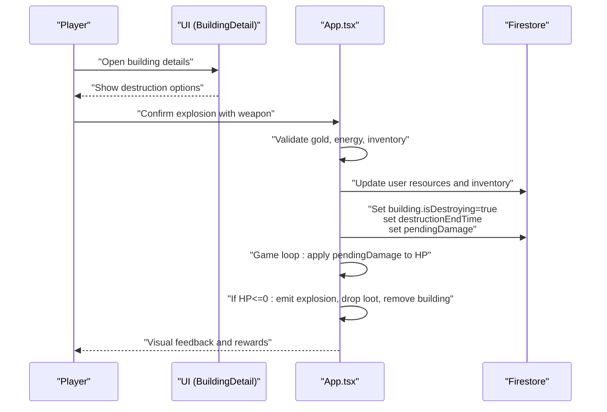
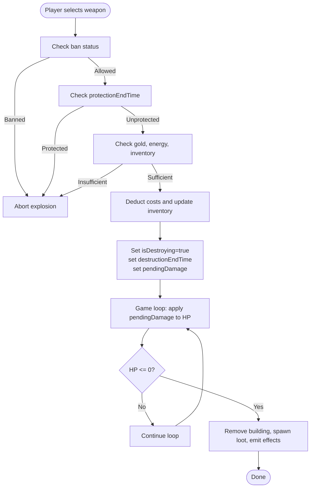
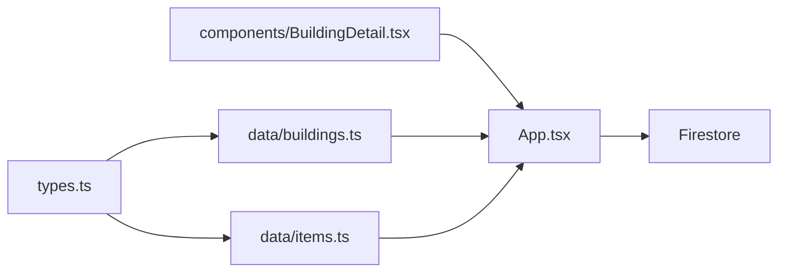

# Damage Calculation

<cite>
**Referenced Files in This Document**
- [types.ts](file://types.ts)
- [data/buildings.ts](file://data/buildings.ts)
- [data/items.ts](file://data/items.ts)
- [App.tsx](file://App.tsx)
- [components/BuildingDetail.tsx](file://components/BuildingDetail.tsx)
</cite>

## Table of Contents
1. [Introduction](#introduction)
2. [Project Structure](#project-structure)
3. [Core Components](#core-components)
4. [Architecture Overview](#architecture-overview)
5. [Detailed Component Analysis](#detailed-component-analysis)
6. [Dependency Analysis](#dependency-analysis)
7. [Performance Considerations](#performance-considerations)
8. [Troubleshooting Guide](#troubleshooting-guide)
9. [Conclusion](#conclusion)

## Introduction
This document explains the damage calculation system for buildings in the game. It covers how damage is represented, applied, and finalized during destruction actions initiated by players. It also documents the integration with weapon systems, the game loop, and the mechanisms that govern building health, destruction, and rewards.

The system centers around:
- A base damage value per weapon type defined in building data
- Player resource costs (gold, energy) and inventory consumption
- A destruction timer that applies pending damage to building health
- A game loop that processes damage, visual effects, and building removal

## Project Structure
The damage system spans several parts of the codebase:
- Types define the shape of buildings, items, and building instances
- Building data defines weapon-to-damage mappings and building stats
- UI components surface weapon options and destruction info
- The game loop applies damage and handles post-destruction effects

**Diagram sources**
- [types.ts:25-96](file://types.ts#L25-L96)
- [data/buildings.ts:1-800](file://data/buildings.ts#L1-L800)
- [data/items.ts:1-415](file://data/items.ts#L1-L415)
- [components/BuildingDetail.tsx:119-137](file://components/BuildingDetail.tsx#L119-L137)
- [App.tsx:5241-5324](file://App.tsx#L5241-L5324)
- [App.tsx:3490-3627](file://App.tsx#L3490-L3627)

**Section sources**
- [types.ts:25-96](file://types.ts#L25-L96)
- [data/buildings.ts:1-800](file://data/buildings.ts#L1-L800)
- [data/items.ts:1-415](file://data/items.ts#L1-L415)
- [components/BuildingDetail.tsx:119-137](file://components/BuildingDetail.tsx#L119-L137)
- [App.tsx:5241-5324](file://App.tsx#L5241-L5324)
- [App.tsx:3490-3627](file://App.tsx#L3490-L3627)

## Core Components
- DestructionInfo: Defines weapon resource ID, name, quantity, cost (gold, energy), time to explode, and the base damage applied to the building.
- PlacedBuilding: Tracks live building state including current HP, max HP, destruction timer, and pending damage.
- Building stats: Durability sets the base HP pool; gloryOnExplosion determines reward; drops define loot generation.

Key implementation references:
- DestructionInfo fields and usage in explosion flow
- Pending damage application in the game loop
- Building HP updates and destruction checks

**Section sources**
- [types.ts:25-33](file://types.ts#L25-L33)
- [types.ts:119-147](file://types.ts#L119-L147)
- [types.ts:42-96](file://types.ts#L42-L96)
- [App.tsx:5241-5324](file://App.tsx#L5241-L5324)
- [App.tsx:3490-3627](file://App.tsx#L3490-L3627)

## Architecture Overview
The damage lifecycle is initiated by the player selecting a weapon and confirming an explosion. The system validates resources and inventory, deducts costs, and schedules a destruction timer. During the game loop, pending damage is applied to the building’s HP. If HP reaches zero, the building is removed, visual effects are emitted, and rewards are processed.

**Diagram sources**
- [components/BuildingDetail.tsx:119-137](file://components/BuildingDetail.tsx#L119-L137)
- [App.tsx:5241-5324](file://App.tsx#L5241-L5324)
- [App.tsx:3490-3627](file://App.tsx#L3490-L3627)

## Detailed Component Analysis

### Damage Formulas and Mechanics
- Base damage per weapon: Defined in each building’s destructionInfo entries. This is the raw damage value applied when the destruction timer completes.
- Pending damage application: During the game loop, pendingDamage is subtracted from the building’s current HP. If HP becomes zero or less, the building is destroyed.
- Finalization: After applying damage, the system removes the destruction flag, clears the timer, and optionally sets HP to zero for non-owners.

Concrete references:
- Pending damage assignment on explosion confirm
- HP update and destruction flagging in the game loop
- Zeroing HP for non-owners after destruction

**Section sources**
- [data/buildings.ts:27-82](file://data/buildings.ts#L27-L82)
- [data/buildings.ts:120-130](file://data/buildings.ts#L120-L130)
- [App.tsx:5286-5300](file://App.tsx#L5286-L5300)
- [App.tsx:3507-3525](file://App.tsx#L3507-L3525)
- [App.tsx:3592-3594](file://App.tsx#L3592-L3594)

### Damage Types and Effects
- The codebase does not implement separate physical, magical, or explosive damage types. Instead, each weapon defines a single base damage value in its destructionInfo entry. This simplifies the model to a single damage scalar per weapon.
- Buildings are not differentiated by resistances or damage type effectiveness in the current implementation.

Implications:
- All weapons apply uniform damage regardless of building category.
- No damage distribution or type-specific modifiers are present.

**Section sources**
- [data/buildings.ts:27-82](file://data/buildings.ts#L27-L82)
- [data/buildings.ts:120-130](file://data/buildings.ts#L120-L130)

### Damage Application Mechanics
- Validation: Before applying damage, the system checks:
  - Player is not banned
  - Building is not under protection
  - Sufficient gold, energy, and weapon inventory
- Deduction: Costs are deducted from player resources and inventory.
- Scheduling: The building enters a destruction state with a timer and pending damage.
- Execution: The game loop periodically applies pendingDamage to HP until the building is destroyed.

**Diagram sources**
- [App.tsx:5241-5324](file://App.tsx#L5241-L5324)
- [App.tsx:3490-3627](file://App.tsx#L3490-L3627)

**Section sources**
- [App.tsx:5241-5324](file://App.tsx#L5241-L5324)
- [App.tsx:3490-3627](file://App.tsx#L3490-L3627)

### Integration with Weapon Systems and Items
- Weapons are items with associated stats and production/drop paths.
- DestructionInfo entries reference weapon item IDs and specify:
  - Required quantity
  - Gold and energy costs
  - Time to explode
  - Base damage applied

References:
- Item definitions for weapons
- DestructionInfo entries in building data

**Section sources**
- [data/items.ts:118-152](file://data/items.ts#L118-L152)
- [data/buildings.ts:27-82](file://data/buildings.ts#L27-L82)
- [data/buildings.ts:120-130](file://data/buildings.ts#L120-L130)

### Building-Level Scaling and Upgrades
- Building stats include durability, which acts as the base HP pool.
- Upgrades increase durability and other stats, indirectly increasing the effective HP before destruction.
- There are no explicit damage multipliers or resistance factors tied to building level in the current implementation.

References:
- Building stats with durability
- Town Hall upgrade progression affecting durability

**Section sources**
- [types.ts:42-96](file://types.ts#L42-L96)
- [data/buildings.ts:16-24](file://data/buildings.ts#L16-L24)
- [data/buildings.ts:102-110](file://data/buildings.ts#L102-L110)
- [data/buildings.ts:150-158](file://data/buildings.ts#L150-L158)
- [data/buildings.ts:188-196](file://data/buildings.ts#L188-L196)
- [data/buildings.ts:226-234](file://data/buildings.ts#L226-L234)
- [data/buildings.ts:265-273](file://data/buildings.ts#L265-L273)
- [data/buildings.ts:304-312](file://data/buildings.ts#L304-L312)

### Damage Distribution and Multi-Target Mechanics
- The current implementation applies a single damage value to one building at a time when the destruction timer completes.
- There is no mechanism for distributing damage across multiple buildings or targets in a single action.

References:
- Pending damage application to a single building
- No multi-target damage distribution logic

**Section sources**
- [App.tsx:3507-3525](file://App.tsx#L3507-L3525)

### Visual Feedback and Post-Destruction Effects
- On damage application, a flash effect is emitted.
- On destruction, an explosion effect is emitted, and loot drops may spawn based on building drops.

References:
- Visual effects emission during damage and destruction
- Loot drop spawning logic

**Section sources**
- [App.tsx:3512-3520](file://App.tsx#L3512-L3520)
- [App.tsx:3536-3543](file://App.tsx#L3536-L3543)
- [App.tsx:3557-3587](file://App.tsx#L3557-L3587)

## Dependency Analysis
The damage system depends on:
- Types for consistent data shapes
- Building data for weapon-to-damage mappings and building stats
- UI components to present options and collect player intent
- Firestore to persist state changes during explosions and game loop updates

**Diagram sources**
- [types.ts:25-96](file://types.ts#L25-L96)
- [data/buildings.ts:1-800](file://data/buildings.ts#L1-L800)
- [data/items.ts:1-415](file://data/items.ts#L1-L415)
- [components/BuildingDetail.tsx:119-137](file://components/BuildingDetail.tsx#L119-L137)
- [App.tsx:5241-5324](file://App.tsx#L5241-L5324)

**Section sources**
- [types.ts:25-96](file://types.ts#L25-L96)
- [data/buildings.ts:1-800](file://data/buildings.ts#L1-L800)
- [data/items.ts:1-415](file://data/items.ts#L1-L415)
- [components/BuildingDetail.tsx:119-137](file://components/BuildingDetail.tsx#L119-L137)
- [App.tsx:5241-5324](file://App.tsx#L5241-L5324)

## Performance Considerations
- Pending damage application occurs in the game loop; keep the number of concurrent destructions reasonable to avoid excessive Firestore writes.
- Visual effects are ephemeral and filtered by time; ensure effect durations are bounded to prevent memory growth.
- Consider batching Firestore updates for multiple buildings being destroyed in a single tick.

[No sources needed since this section provides general guidance]

## Troubleshooting Guide
Common issues and resolutions:
- Explosion blocked by protection: Ensure protectionEndTime has elapsed before attempting another explosion.
- Insufficient resources: Verify gold, energy, and weapon inventory meet the required amounts.
- No damage applied: Confirm the destruction timer has elapsed and pendingDamage was applied in the game loop.
- Building not removed: Check that HP reached zero and that the game loop cleaned up the building reference.

**Section sources**
- [App.tsx:5249-5252](file://App.tsx#L5249-L5252)
- [App.tsx:5254-5266](file://App.tsx#L5254-L5266)
- [App.tsx:3507-3525](file://App.tsx#L3507-L3525)
- [App.tsx:3527-3594](file://App.tsx#L3527-L3594)

## Conclusion
The damage calculation system uses a straightforward model: each weapon defines a base damage value applied when a building’s destruction timer completes. Pending damage is applied to the building’s HP in the game loop, and destruction triggers visual effects and loot drops. While the system currently lacks damage types and building-specific resistances, it provides a clear and maintainable foundation for future enhancements such as damage multipliers, type-specific effects, and scaling with building upgrades.