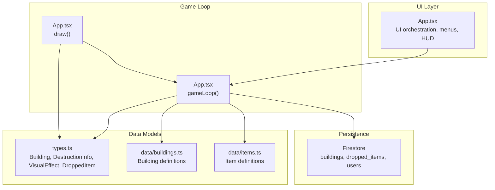
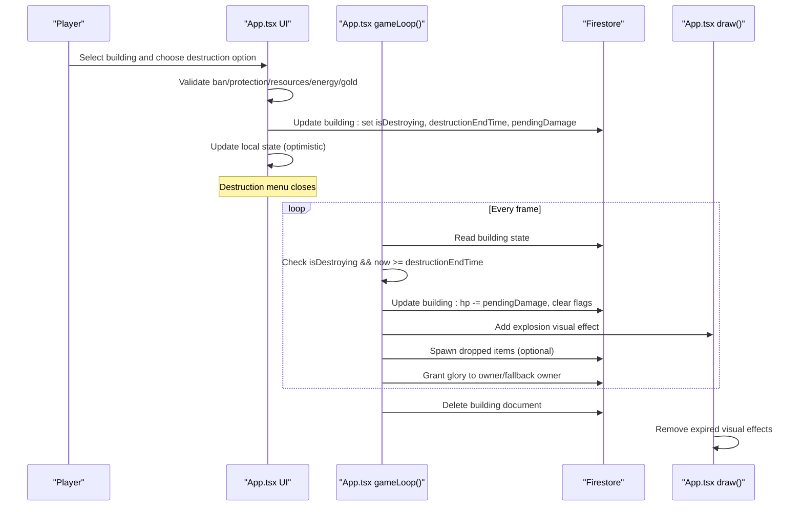
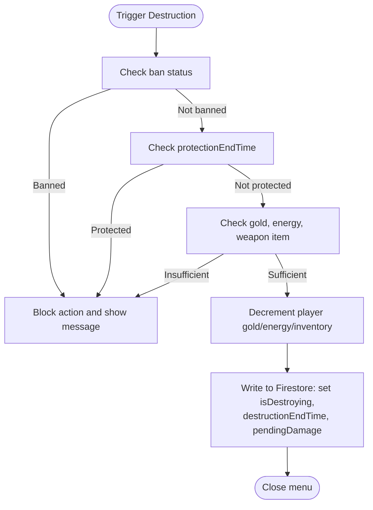
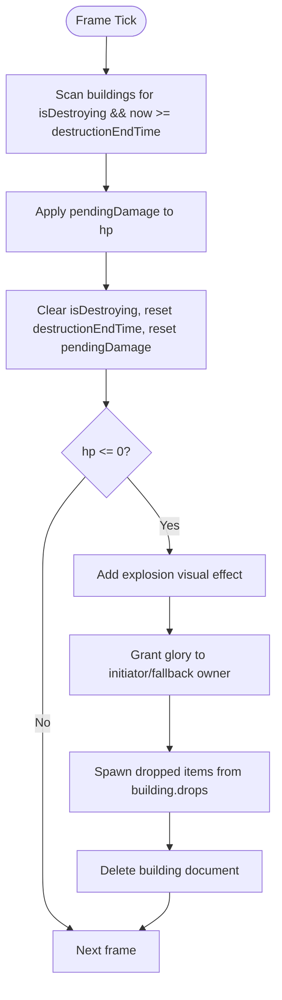
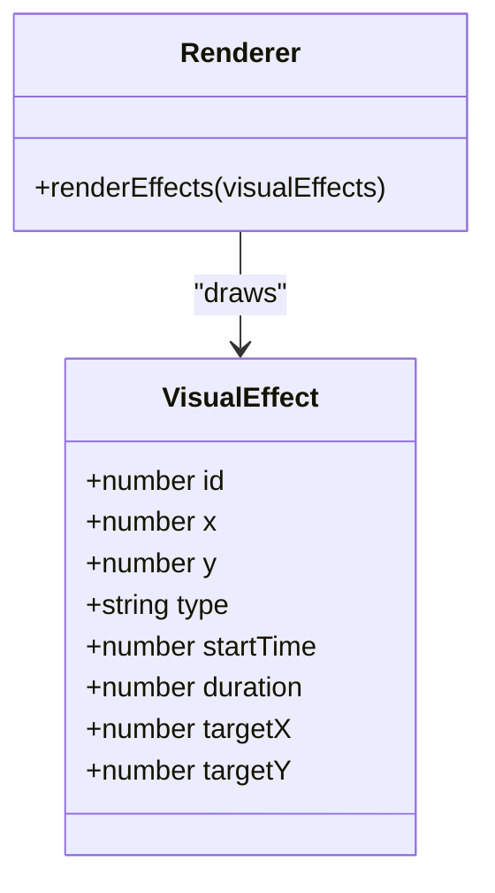
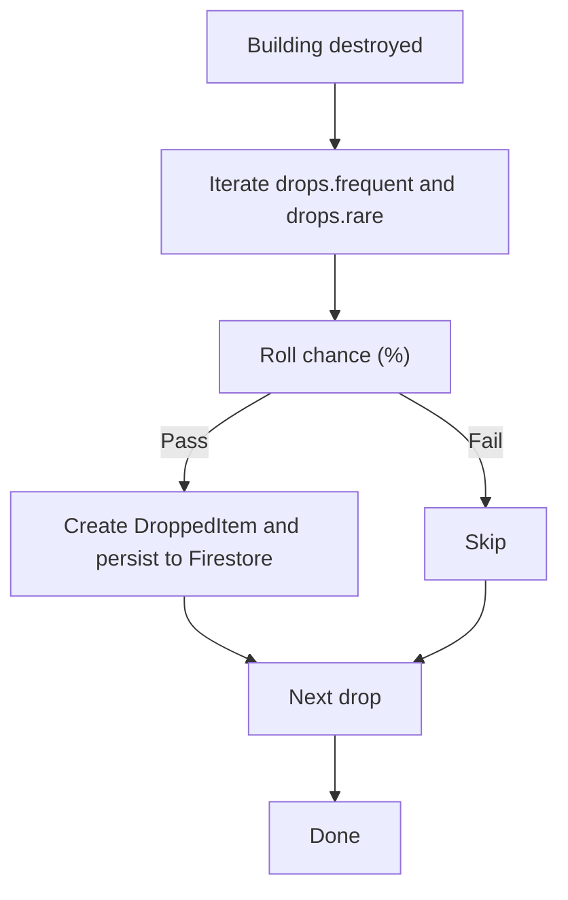
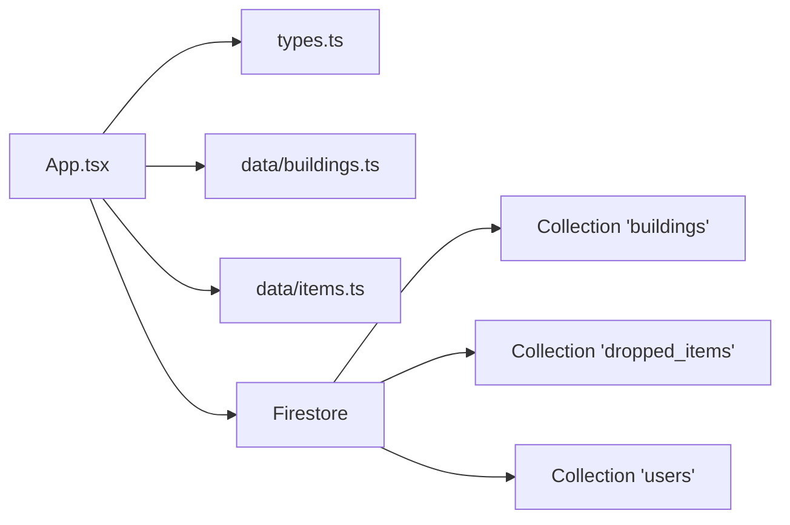

# Destruction Effects

<cite>
**Referenced Files in This Document**
- [App.tsx](file://App.tsx)
- [types.ts](file://types.ts)
- [buildings.ts](file://data/buildings.ts)
- [items.ts](file://data/items.ts)
</cite>

## Table of Contents
1. [Introduction](#introduction)
2. [Project Structure](#project-structure)
3. [Core Components](#core-components)
4. [Architecture Overview](#architecture-overview)
5. [Detailed Component Analysis](#detailed-component-analysis)
6. [Dependency Analysis](#dependency-analysis)
7. [Performance Considerations](#performance-considerations)
8. [Troubleshooting Guide](#troubleshooting-guide)
9. [Conclusion](#conclusion)

## Introduction
This document explains the building destruction effects system in the game, focusing on:
- Visual effects: explosion animations, particle-like flashes, and HUD indicators
- Resource loss and item drops: how destroyed buildings yield items and glory rewards
- Cascading destruction mechanics: how damage propagates and triggers chain reactions
- Integration with the building system: state synchronization, Firestore updates, and cleanup
- Practical guidance for performance, fairness, and anti-exploitation

The goal is to make the destruction system understandable for beginners while providing deep technical insights for developers implementing similar systems.

## Project Structure
The destruction system spans UI orchestration, game loop logic, data models, and static building/item definitions:
- App.tsx: central game loop, visual effects rendering, building state transitions, and Firestore synchronization
- types.ts: shared types for buildings, destruction info, visual effects, and dropped items
- data/buildings.ts: building definitions including destructionInfo and drops
- data/items.ts: item definitions referenced by destructionInfo and drops

**Diagram sources**
- [App.tsx](file://App.tsx)
- [types.ts](file://types.ts)
- [buildings.ts](file://data/buildings.ts)
- [items.ts](file://data/items.ts)

**Section sources**
- [App.tsx](file://App.tsx)
- [types.ts](file://types.ts)
- [buildings.ts](file://data/buildings.ts)
- [items.ts](file://data/items.ts)

## Core Components
- Destruction trigger and validation: checks ban status, protection timers, and resource/energy/gold availability before starting destruction
- Destruction scheduling: sets isDestroying, destructionEndTime, and pendingDamage on the building
- Game loop processing: after the timer elapses, applies damage, spawns explosions, grants glory, and drops items
- Visual effects: explosion circles, flash bursts, and HUD timers for ongoing destruction
- Cleanup: removes the building from Firestore and local state, and updates glory

Key implementation references:
- Trigger and validation: [App.tsx](file://App.tsx)
- Scheduling: [App.tsx](file://App.tsx)
- Game loop processing: [App.tsx](file://App.tsx)
- Visual effects rendering: [App.tsx](file://App.tsx)
- Cleanup and glory: [App.tsx](file://App.tsx)

**Section sources**
- [App.tsx](file://App.tsx)

## Architecture Overview
The destruction lifecycle integrates UI actions, game loop processing, and persistence:

**Diagram sources**
- [App.tsx](file://App.tsx)

**Section sources**
- [App.tsx](file://App.tsx)

## Detailed Component Analysis

### Destruction Trigger and Validation
- Ban enforcement: prevents actions if the player is banned
- Protection checks: blocks destruction if the building is under protection
- Resource checks: verifies gold, energy, and required weapon item amounts
- Local and remote updates: immediately decrements player resources and inventory, then syncs to Firestore

Implementation references:
- Validation and resource checks: [App.tsx](file://App.tsx)
- Local state updates: [App.tsx](file://App.tsx)
- Firestore updates: [App.tsx](file://App.tsx)

**Diagram sources**
- [App.tsx](file://App.tsx)

**Section sources**
- [App.tsx](file://App.tsx)

### Destruction Scheduling and State Flags
- Sets isDestroying to mark the building as being destroyed
- Sets destructionEndTime to the absolute time when destruction completes
- Sets pendingDamage to the damage value associated with the chosen weapon
- Initiator tracking: stores the UID of the player who started the destruction for reward attribution

References:
- Scheduling fields: [App.tsx](file://App.tsx)
- Types: [types.ts](file://types.ts)

**Section sources**
- [App.tsx](file://App.tsx)
- [types.ts](file://types.ts)

### Game Loop Processing and Chain Reactions
- Timer completion: when now >= destructionEndTime, the pendingDamage is applied to hp
- Immediate effects: if damage was applied via other sources (e.g., cannons/monsters), a flash visual effect is spawned
- Destruction detection: when hp <= 0, the building is marked for deletion
- Explosion visuals: a large expanding circle is added to visualEffects
- Glory rewards: granted to the initiating player or fallback owner/host
- Item drops: based on building.drops.frequent/rare with randomized chances
- Persistence cleanup: deletes the building document from Firestore

References:
- Timer and damage application: [App.tsx](file://App.tsx)
- Flash and explosion visuals: [App.tsx](file://App.tsx)
- Glory and drops: [App.tsx](file://App.tsx)
- Cleanup: [App.tsx](file://App.tsx)

**Diagram sources**
- [App.tsx](file://App.tsx)

**Section sources**
- [App.tsx](file://App.tsx)

### Visual Effects Rendering
- VisualEffect types supported: explosion (large expanding circle), flash (brief white diamond), shot (projectile), upgrade (aural ring)
- Rendering pipeline:
  - draw() iterates visualEffects
  - Computes elapsed time and normalized progress
  - Draws explosion as a growing orange circle with alpha fade
  - Draws flash as a white diamond
  - Draws shot as a glowing projectile
  - Removes effects after duration elapses

References:
- Effect rendering: [App.tsx](file://App.tsx)
- VisualEffect type: [types.ts](file://types.ts)

**Diagram sources**
- [types.ts](file://types.ts)
- [App.tsx](file://App.tsx)

**Section sources**
- [types.ts](file://types.ts)
- [App.tsx](file://App.tsx)

### Resource Loss and Item Drops
- Item drops are defined per building in data/buildings.ts under drops.frequent and drops.rare
- Chance-based spawning: each drop entry includes a chance (percent) and amount; a random roll determines whether to spawn
- DroppedItem model: includes itemId, amount, and optional ownerName for attribution
- Persistence: new dropped items are created in Firestore and mirrored locally

References:
- Building drops definition: [buildings.ts](file://data/buildings.ts)
- DroppedItem type: [types.ts](file://types.ts)
- Drop spawning and persistence: [App.tsx](file://App.tsx)

**Diagram sources**
- [buildings.ts](file://data/buildings.ts)
- [types.ts](file://types.ts)
- [App.tsx](file://App.tsx)

**Section sources**
- [buildings.ts](file://data/buildings.ts)
- [types.ts](file://types.ts)
- [App.tsx](file://App.tsx)

### Glory Rewards and Attribution
- Glory gain occurs when a building is destroyed
- Attribution logic:
  - Primary: building.initiatorId equals current user
  - Fallback: neutral or owned by current user, or monster host controlled by current user
- Updates are persisted to Firestore and reflected in the UI

References:
- Glory attribution and persistence: [App.tsx](file://App.tsx)

**Section sources**
- [App.tsx](file://App.tsx)

### Cascading Destruction Mechanics
- Direct chain: when a building is damaged by external sources (cannons/monsters), a flash visual effect is added immediately
- Indirect chain: if hp <= 0, an explosion visual effect is added and the building is scheduled for deletion
- Persistence ensures that deletions propagate across clients via onSnapshot listeners

References:
- Flash on external damage: [App.tsx](file://App.tsx)
- Explosion on destruction: [App.tsx](file://App.tsx)
- Deletion and persistence: [App.tsx](file://App.tsx)

**Section sources**
- [App.tsx](file://App.tsx)

### Integration with the Building System
- State synchronization:
  - Local optimistic updates mirror Firestore writes
  - gameLoop reads current state and reconciles changes
  - Zone-scoped snapshots keep local lists of buildings and dropped items in sync
- Cleanup:
  - After destruction, the building document is deleted
  - Visual effects are garbage-collected after their duration
- HUD indicators:
  - During destruction, a red progress bar and countdown appear above the building
  - During construction and work, separate HUD indicators reflect progress

References:
- State updates and reconciliation: [App.tsx](file://App.tsx)
- Zone snapshots and local lists: [App.tsx](file://App.tsx)
- HUD indicators: [App.tsx](file://App.tsx)

**Section sources**
- [App.tsx](file://App.tsx)

## Dependency Analysis
- App.tsx depends on:
  - types.ts for shared models (Building, DestructionInfo, VisualEffect, DroppedItem)
  - data/buildings.ts for building definitions and destructionInfo/drops
  - data/items.ts for item definitions referenced by destructionInfo
  - Firestore collections: buildings, dropped_items, users

**Diagram sources**
- [App.tsx](file://App.tsx)
- [types.ts](file://types.ts)
- [buildings.ts](file://data/buildings.ts)
- [items.ts](file://data/items.ts)

**Section sources**
- [App.tsx](file://App.tsx)
- [types.ts](file://types.ts)
- [buildings.ts](file://data/buildings.ts)
- [items.ts](file://data/items.ts)

## Performance Considerations
- Visual effects:
  - Limit concurrent explosions by controlling the number of simultaneous destructions
  - Use short durations for effects to minimize render overhead
- Game loop:
  - Batch Firestore writes for state changes
  - Avoid unnecessary state updates by checking if changes occurred before writing
- Rendering:
  - Expire effects promptly to prevent accumulation
  - Use simple shapes and minimal shadow blur for effects
- Network:
  - Leverage onSnapshot to keep local lists minimal and focused on the current zones

[No sources needed since this section provides general guidance]

## Troubleshooting Guide
Common issues and resolutions:
- Destruction does nothing:
  - Verify ban status and protectionEndTime checks
  - Confirm gold, energy, and weapon item quantities meet requirements
  - References: [App.tsx](file://App.tsx)
- Destruction starts but never finishes:
  - Ensure destructionEndTime is set and pendingDamage is present
  - Confirm gameLoop runs and detects isDestroying && now >= destructionEndTime
  - References: [App.tsx](file://App.tsx)
- No explosion or flash visuals:
  - Check visualEffects array and draw() rendering logic
  - Verify effect type and duration are set correctly
  - References: [App.tsx](file://App.tsx)
- Items not dropping:
  - Confirm building.drops.frequent/rare entries and chance thresholds
  - Verify dropped_items documents are created and synced
  - References: [buildings.ts](file://data/buildings.ts), [App.tsx](file://App.tsx)
- Glory not awarded:
  - Check initiatorId and fallback ownership/host logic
  - Ensure Firestore update succeeds
  - References: [App.tsx](file://App.tsx)
- Anti-exploitation:
  - Enforce ban/protection checks before allowing destruction
  - Validate resource/energy/gold balances
  - References: [App.tsx](file://App.tsx)

**Section sources**
- [App.tsx](file://App.tsx)
- [buildings.ts](file://data/buildings.ts)

## Conclusion
The destruction effects system combines immediate UI feedback with robust backend synchronization. It supports:
- Intuitive destruction triggers with clear validation
- Timed destruction with visual progress indicators
- Chain reactions via flash/explosion effects
- Fair resource drops and glory attribution
- Clean state cleanup and persistence

For further development, focus on balancing destruction costs, refining visual effects, and ensuring fairness against coordinated attacks through strict validation and anti-exploitation checks.