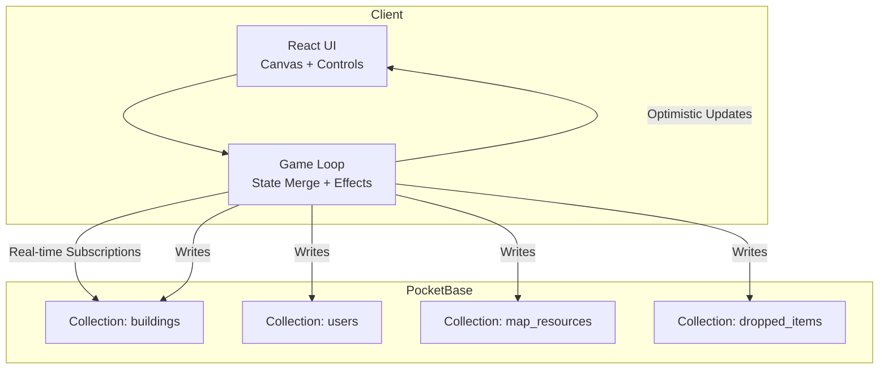
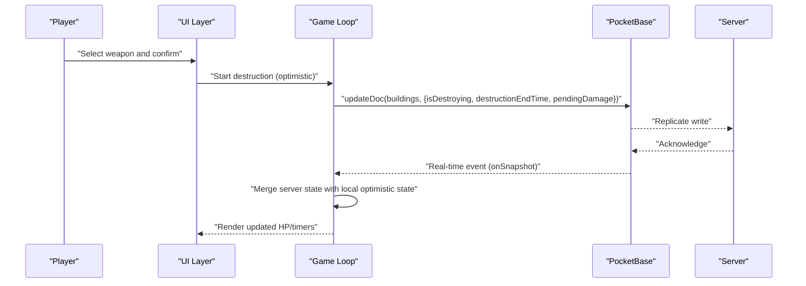
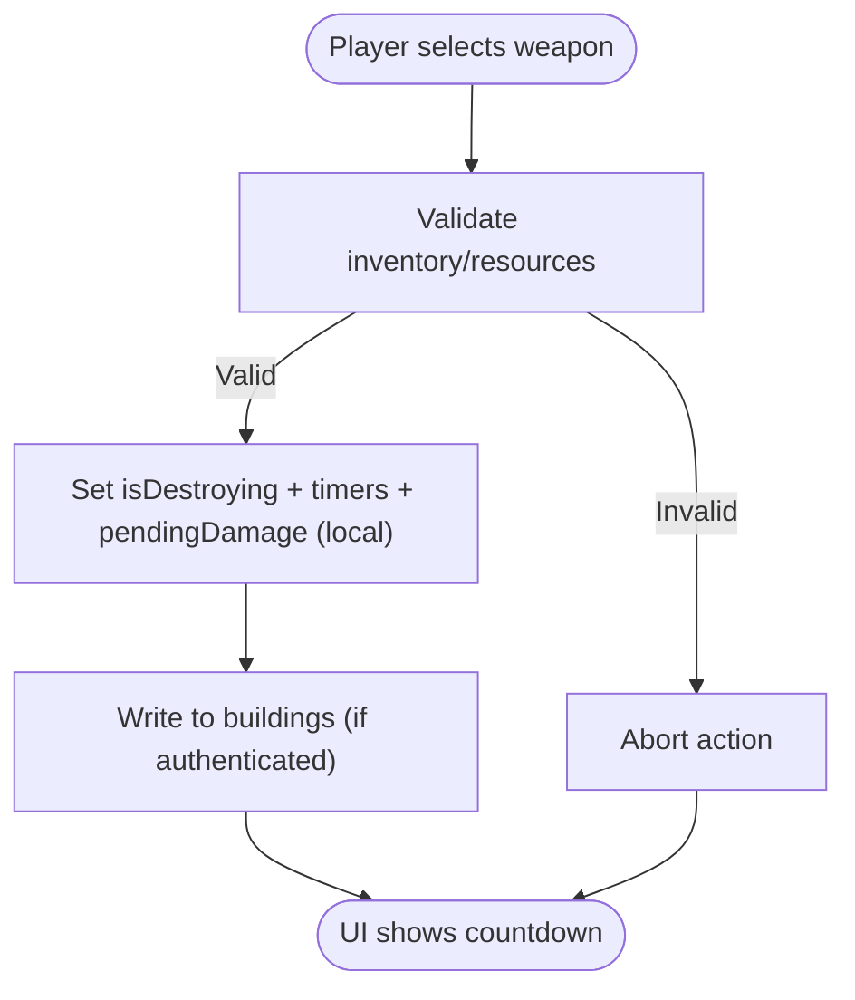
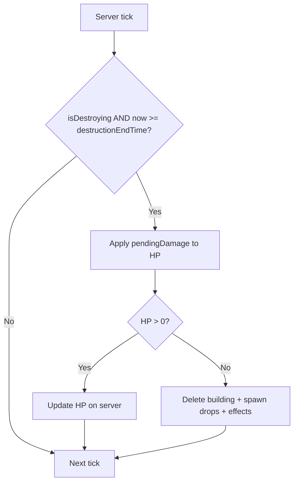
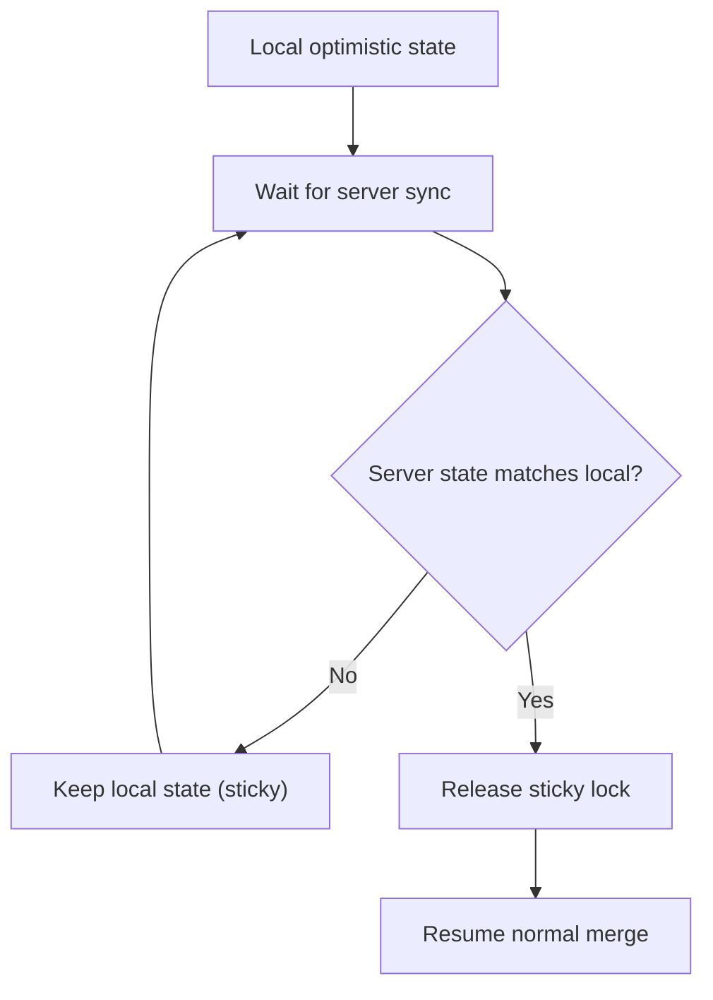
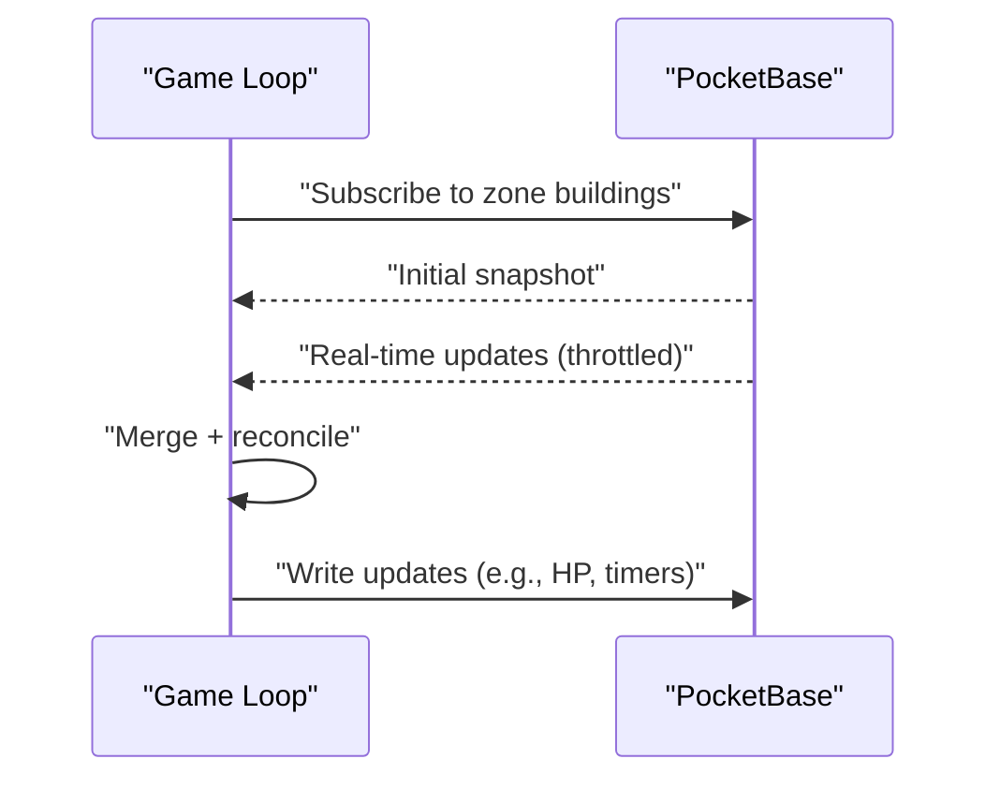
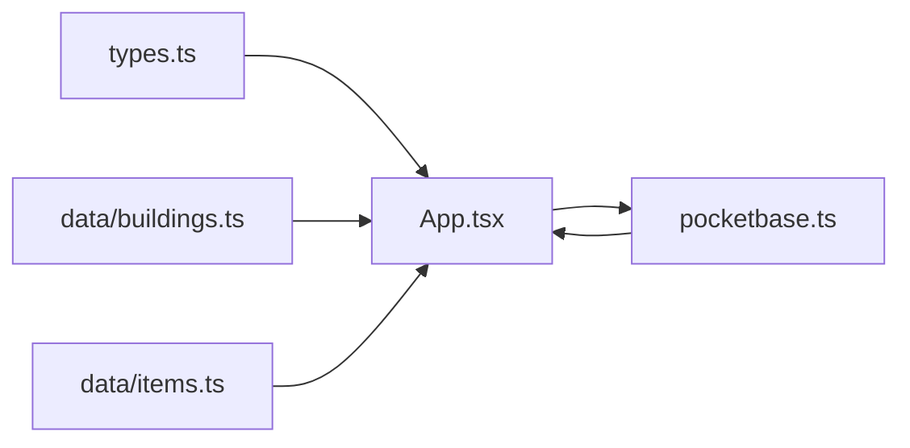

# Destruction Synchronization

<cite>
**Referenced Files in This Document**
- [index.tsx](file://index.tsx)
- [App.tsx](file://App.tsx)
- [pocketbase.ts](file://src/pocketbase.ts)
- [types.ts](file://types.ts)
- [buildings.ts](file://data/buildings.ts)
- [items.ts](file://data/items.ts)
</cite>

## Table of Contents
1. [Introduction](#introduction)
2. [Project Structure](#project-structure)
3. [Core Components](#core-components)
4. [Architecture Overview](#architecture-overview)
5. [Detailed Component Analysis](#detailed-component-analysis)
6. [Dependency Analysis](#dependency-analysis)
7. [Performance Considerations](#performance-considerations)
8. [Troubleshooting Guide](#troubleshooting-guide)
9. [Conclusion](#conclusion)

## Introduction
This document explains the destruction synchronization system for a real-time multiplayer game built with React and PocketBase. It covers how building destruction is initiated by players, propagated across the network, reconciled with server state, and integrated with other systems such as chat, combat, and resource management. The focus is on:
- Real-time destruction updates and optimistic UI
- Conflict detection and resolution
- Client-server coordination via PocketBase
- Handling out-of-order events, lag compensation, and preventing ghost buildings
- Integration with chat, combat, and economy systems

## Project Structure
The destruction system spans several layers:
- UI and game loop orchestration in the main app component
- PocketBase integration for real-time subscriptions and writes
- Type definitions for destruction metadata and building state
- Data definitions for destruction weapons and building stats

**Diagram sources**
- [App.tsx](file://App.tsx)
- [pocketbase.ts](file://src/pocketbase.ts)

**Section sources**
- [index.tsx:1-20](file://index.tsx#L1-L20)
- [App.tsx:255-400](file://App.tsx#L255-L400)
- [pocketbase.ts:1-120](file://src/pocketbase.ts#L1-L120)

## Core Components
- Destruction metadata and building state:
  - DestructionInfo defines weapon-based destruction costs and timers
  - PlacedBuilding tracks HP, destruction timers, and ownership
- PocketBase integration:
  - Real-time subscriptions to buildings and map resources
  - Optimistic writes with server reconciliation
- Game loop:
  - Periodic tick processing for timers and damage application
  - Sticky interaction logic to prevent rollback jank
  - Zone-based subscriptions to minimize network load

**Section sources**
- [types.ts:25-147](file://types.ts#L25-L147)
- [App.tsx:2024-2145](file://App.tsx#L2024-L2145)
- [pocketbase.ts:578-707](file://src/pocketbase.ts#L578-L707)

## Architecture Overview
The destruction lifecycle involves three phases:
1. Player initiates destruction (UI + optimistic update)
2. Server receives and applies destruction state
3. Clients reconcile via real-time subscriptions and sticky logic

**Diagram sources**
- [App.tsx:5288-5324](file://App.tsx#L5288-L5324)
- [App.tsx:3467-3486](file://App.tsx#L3467-L3486)
- [pocketbase.ts:578-707](file://src/pocketbase.ts#L578-L707)

## Detailed Component Analysis

### Destruction Initiation and Optimistic Updates
- When a player selects a weapon and confirms, the client:
  - Sets isDestroying and destructionEndTime
  - Records pendingDamage and initiatorId
  - Immediately updates local state for instant feedback
- If authenticated, the client writes to the buildings collection; otherwise, it relies on local state until sync

**Diagram sources**
- [App.tsx:5288-5324](file://App.tsx#L5288-L5324)
- [App.tsx:5300-5324](file://App.tsx#L5300-L5324)

**Section sources**
- [App.tsx:5288-5324](file://App.tsx#L5288-L5324)
- [types.ts:25-33](file://types.ts#L25-L33)

### Server-Side Application and Deletion
- On the server tick, destruction timers are processed:
  - If destructionEndTime reached, pendingDamage is applied
  - If HP <= 0, the building is deleted and explosion effects are triggered
  - Drops are spawned and glory is awarded based on initiator ownership
- Owner or host clients update HP; observers rely on server finalization

**Diagram sources**
- [App.tsx:3467-3486](file://App.tsx#L3467-L3486)
- [App.tsx:3527-3598](file://App.tsx#L3527-L3598)

**Section sources**
- [App.tsx:3467-3486](file://App.tsx#L3467-L3486)
- [App.tsx:3527-3598](file://App.tsx#L3527-L3598)

### Conflict Detection and Resolution
- Sticky Interaction Logic prevents rollback jank:
  - If a client recently interacted with a building (<10s), it preserves local optimistic state until server matches
  - Once server state matches local, the sticky period ends and normal sync resumes
- DeletingBuildingsRef prevents UI flicker during deletion propagation delays

**Diagram sources**
- [App.tsx:2056-2091](file://App.tsx#L2056-L2091)

**Section sources**
- [App.tsx:2056-2091](file://App.tsx#L2056-L2091)
- [App.tsx:3534-3534](file://App.tsx#L3534-L3534)

### Client-Server Coordination via PocketBase
- Real-time subscriptions:
  - Per-zone building subscriptions to minimize bandwidth
  - Per-user building subscriptions for personal structures
- Throttled zone updates reduce subscription churn
- onSnapshot handles initial fetch and real-time events, with retry logic for stale client IDs

**Diagram sources**
- [App.tsx:2094-2145](file://App.tsx#L2094-L2145)
- [pocketbase.ts:578-707](file://src/pocketbase.ts#L578-L707)

**Section sources**
- [App.tsx:2094-2145](file://App.tsx#L2094-L2145)
- [pocketbase.ts:578-707](file://src/pocketbase.ts#L578-L707)

### Handling Out-of-Order Events and Lag Compensation
- Zone-based subscriptions and throttling reduce out-of-order delivery impact
- Sticky interaction logic compensates for latency by preserving local state briefly
- Server-side finalization ensures eventual consistency regardless of client order

**Section sources**
- [App.tsx:806-820](file://App.tsx#L806-L820)
- [App.tsx:2056-2091](file://App.tsx#L2056-L2091)

### Ghost Building Prevention
- The data transformation layer strips accidental isLocal flags from persisted records to avoid phantom deletions
- DeletingBuildingsRef prevents UI from rendering deleted buildings during sync lag

**Section sources**
- [pocketbase.ts:194-198](file://src/pocketbase.ts#L194-L198)
- [App.tsx:3534-3534](file://App.tsx#L3534-L3534)

### Integration with Other Systems
- Chat:
  - Destruction triggers glory gains and history entries; chat can surface notifications
- Combat:
  - Cannons and monsters apply damage independently; destruction timers supersede instantaneous damage for fairness
- Economy:
  - Destruction costs (gold/energy) and drops feed into inventory and market systems

**Section sources**
- [App.tsx:3400-3600](file://App.tsx#L3400-L3600)
- [buildings.ts:27-82](file://data/buildings.ts#L27-L82)
- [items.ts:118-152](file://data/items.ts#L118-L152)

## Dependency Analysis
- App.tsx depends on:
  - types.ts for building and destruction models
  - pocketbase.ts for real-time subscriptions and writes
  - data/buildings.ts and data/items.ts for weapon and building definitions
- PocketBase enforces schema compatibility and data wrapping/unwrapping

**Diagram sources**
- [types.ts:25-147](file://types.ts#L25-L147)
- [App.tsx:255-400](file://App.tsx#L255-L400)
- [pocketbase.ts:165-218](file://src/pocketbase.ts#L165-L218)
- [buildings.ts:4-82](file://data/buildings.ts#L4-L82)
- [items.ts:118-152](file://data/items.ts#L118-L152)

**Section sources**
- [types.ts:25-147](file://types.ts#L25-L147)
- [pocketbase.ts:165-218](file://src/pocketbase.ts#L165-L218)
- [buildings.ts:4-82](file://data/buildings.ts#L4-L82)
- [items.ts:118-152](file://data/items.ts#L118-L152)

## Performance Considerations
- Zone-based subscriptions and throttling reduce network overhead
- Sticky interaction logic minimizes UI jitter under latency
- Batched writes and controlled real-time updates prevent overload
- Consider adding client-side prediction smoothing for very high-latency connections

## Troubleshooting Guide
Common issues and remedies:
- Stale client ID errors during real-time subscription:
  - The client retries with jitter; ensure subscriptions are not torn down prematurely
- Missing or insufficient permissions:
  - The game loop ignores expected race conditions; investigate permission misconfiguration
- Unexpected rollback or flicker:
  - Verify sticky interaction logic is active and deletingBuildingsRef is cleared after sync
- Data type mismatches:
  - Ensure buildingId and type are normalized during unwrap; check PocketBase schema alignment

**Section sources**
- [pocketbase.ts:587-621](file://src/pocketbase.ts#L587-L621)
- [App.tsx:27-33](file://App.tsx#L27-L33)
- [pocketbase.ts:200-217](file://src/pocketbase.ts#L200-L217)

## Conclusion
The destruction synchronization system combines optimistic UI updates with robust server reconciliation and real-time subscriptions. By leveraging sticky interaction logic, zone-based subscriptions, and careful conflict resolution, it achieves responsive gameplay while maintaining consistency across clients. Integrations with chat, combat, and economy provide a cohesive real-time experience, and the design supports further enhancements such as advanced lag compensation and prediction smoothing.