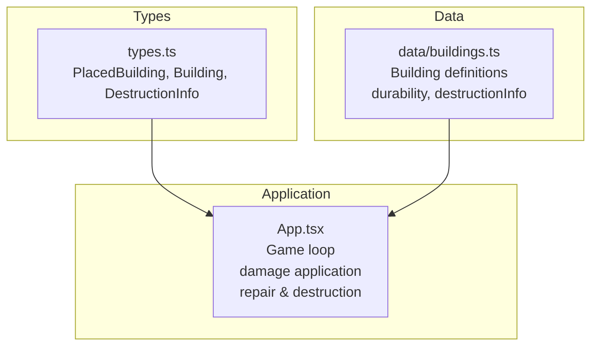
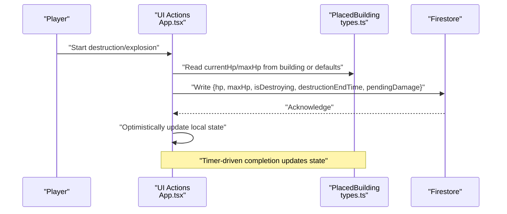
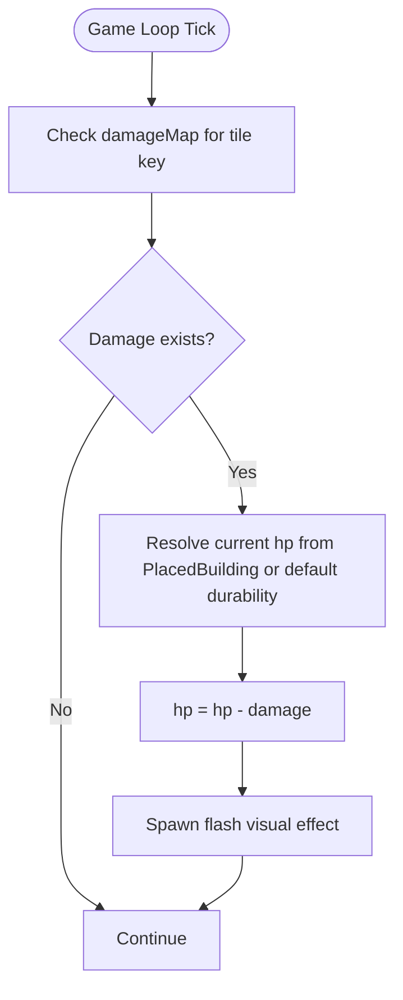
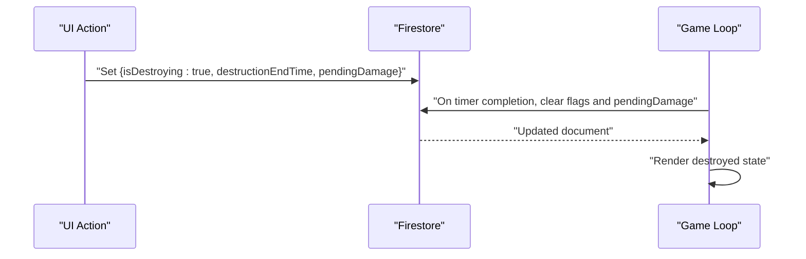
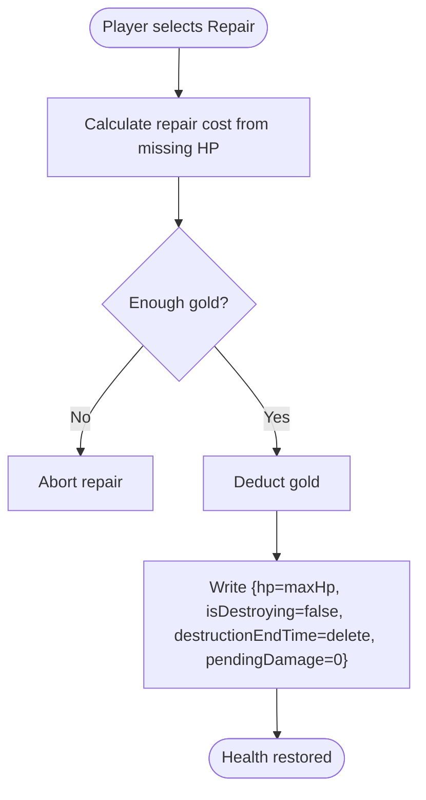
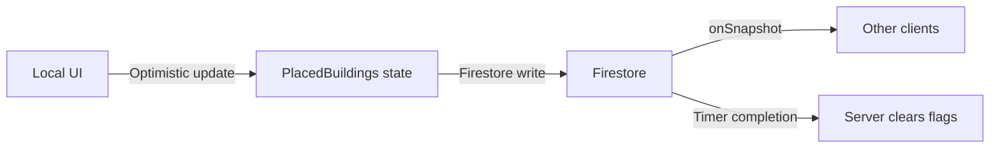
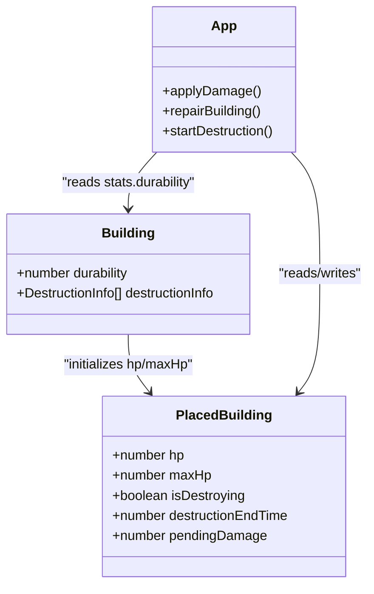

# Health Management

<cite>
**Referenced Files in This Document**
- [App.tsx](file://App.tsx)
- [types.ts](file://types.ts)
- [buildings.ts](file://data/buildings.ts)
- [index.tsx](file://index.tsx)
</cite>

## Table of Contents
1. [Introduction](#introduction)
2. [Project Structure](#project-structure)
3. [Core Components](#core-components)
4. [Architecture Overview](#architecture-overview)
5. [Detailed Component Analysis](#detailed-component-analysis)
6. [Dependency Analysis](#dependency-analysis)
7. [Performance Considerations](#performance-considerations)
8. [Troubleshooting Guide](#troubleshooting-guide)
9. [Conclusion](#conclusion)

## Introduction
This document explains the building health management system in the game. It covers how health points are initialized, tracked, and updated; how damage is calculated and applied; how health thresholds trigger destruction; and how health can be restored. It also documents the relationship between building type and defensive capabilities, health persistence across sessions, synchronization with other players, and safeguards against manipulation. Examples from the actual codebase illustrate health update algorithms and state change detection.

## Project Structure
The health system spans several modules:
- Types define the PlacedBuilding model and related structures.
- Building definitions include durability and destruction info.
- Application logic manages health updates, damage application, repair, and destruction timers.

**Diagram sources**
- [types.ts:119-147](file://types.ts#L119-L147)
- [buildings.ts:1-120](file://data/buildings.ts#L1-L120)
- [App.tsx:3496-3520](file://App.tsx#L3496-L3520)

**Section sources**
- [types.ts:119-147](file://types.ts#L119-L147)
- [buildings.ts:1-120](file://data/buildings.ts#L1-L120)
- [App.tsx:3496-3520](file://App.tsx#L3496-L3520)

## Core Components
- PlacedBuilding: Carries current and maximum health (hp, maxHp), destruction state, and auxiliary fields.
- Building: Defines durability and destruction info used to initialize and cap health.
- Game loop: Applies damage, updates timers, and persists state to Firestore.

Key responsibilities:
- Initialize health from Building.stats.durability when placing or upgrading buildings.
- Track current health and enforce thresholds for destruction.
- Persist health and destruction state to Firestore for cross-player synchronization.
- Provide repair mechanics to restore health.

**Section sources**
- [types.ts:119-147](file://types.ts#L119-L147)
- [buildings.ts:16-27](file://data/buildings.ts#L16-L27)
- [App.tsx:4646-4648](file://App.tsx#L4646-L4648)
- [App.tsx:5157-5162](file://App.tsx#L5157-L5162)

## Architecture Overview
The health system integrates data definitions, runtime state, and persistence:

**Diagram sources**
- [App.tsx:5286-5300](file://App.tsx#L5286-L5300)
- [types.ts:119-147](file://types.ts#L119-L147)

## Detailed Component Analysis

### Health Initialization and Scaling
- Initial health is set from the building definition’s durability when placing or upgrading.
- For constructed buildings, hp and maxHp are initialized to the same value.
- For resource entities (trees, rivers, mountains), separate constants define base HP.

Implementation highlights:
- Upgrade/level-up logic sets hp and maxHp to the next building’s stats.durability.
- Resource entities initialize hp from dedicated constants.

**Section sources**
- [App.tsx:4646-4648](file://App.tsx#L4646-L4648)
- [App.tsx:623-624](file://App.tsx#L623-L624)
- [App.tsx:648-649](file://App.tsx#L648-L649)
- [App.tsx:1300-1301](file://App.tsx#L1300-L1301)
- [App.tsx:1533-1533](file://App.tsx#L1533-L1533)

### Damage Calculation and Application
- Damage is applied during the game loop from attacks (cannons, monsters).
- Current health is decremented by the computed damage amount.
- A flash visual effect is triggered upon damage application.

**Diagram sources**
- [App.tsx:3507-3520](file://App.tsx#L3507-L3520)
- [buildings.ts:16-27](file://data/buildings.ts#L16-L27)

**Section sources**
- [App.tsx:3507-3520](file://App.tsx#L3507-L3520)
- [buildings.ts:16-27](file://data/buildings.ts#L16-L27)

### Destruction Triggers and Timers
- Destruction actions set isDestroying, destructionEndTime, and pendingDamage.
- After the timer elapses, the system updates the building to remove destruction flags and pending damage.
- The timer-based completion ensures deterministic destruction outcomes.

**Diagram sources**
- [App.tsx:5291-5298](file://App.tsx#L5291-L5298)
- [App.tsx:2401-2401](file://App.tsx#L2401-L2401)

**Section sources**
- [App.tsx:5291-5298](file://App.tsx#L5291-L5298)
- [App.tsx:2401-2401](file://App.tsx#L2401-L2401)

### Health Restoration Mechanics
- Players can repair buildings to full health (maxHp) by spending gold.
- Repair clears destruction flags and pending damage.
- Repair cost is derived from missing HP and base price.

**Diagram sources**
- [App.tsx:5139-5175](file://App.tsx#L5139-L5175)

**Section sources**
- [App.tsx:5139-5175](file://App.tsx#L5139-L5175)

### Defensive Capabilities and Building Type
- Durability (from stats.durability) directly scales defensive capability.
- Higher-tier residential and town hall buildings have significantly higher durability.
- Destruction info entries define weapon-specific damage and costs, indirectly reflecting balancing around durability.

Examples:
- Lower-tier residential buildings have modest durability suitable for early-game defense.
- Higher-tier town halls and residences scale durability accordingly.

**Section sources**
- [buildings.ts:16-27](file://data/buildings.ts#L16-L27)
- [buildings.ts:326-400](file://data/buildings.ts#L326-L400)
- [buildings.ts:406-430](file://data/buildings.ts#L406-L430)
- [buildings.ts:432-468](file://data/buildings.ts#L432-L468)

### Health Persistence and Synchronization
- All health-related updates are persisted to Firestore with structured writes.
- Local optimistic updates improve responsiveness; server acks reconcile eventual consistency.
- Destruction timers are timestamp-based, ensuring deterministic completion.

**Diagram sources**
- [App.tsx:5291-5298](file://App.tsx#L5291-L5298)
- [App.tsx:5157-5162](file://App.tsx#L5157-L5162)

**Section sources**
- [App.tsx:5291-5298](file://App.tsx#L5291-L5298)
- [App.tsx:5157-5162](file://App.tsx#L5157-L5162)

### State Change Detection and Validation
- The game loop detects state changes (e.g., construction finish, work finish) and persists them.
- Damage application checks for tile keys and applies damage safely.
- UI guards prevent destructive actions when under protection or insufficient resources.

**Section sources**
- [App.tsx:3496-3505](file://App.tsx#L3496-L3505)
- [App.tsx:3507-3520](file://App.tsx#L3507-L3520)
- [App.tsx:5249-5252](file://App.tsx#L5249-L5252)

## Dependency Analysis
- PlacedBuilding depends on Building for initial health scaling.
- App.tsx orchestrates health lifecycle and persistence.
- Firestore serves as the single source of truth for health and destruction state.

**Diagram sources**
- [types.ts:42-96](file://types.ts#L42-L96)
- [types.ts:119-147](file://types.ts#L119-L147)
- [App.tsx:3507-3520](file://App.tsx#L3507-L3520)

**Section sources**
- [types.ts:42-96](file://types.ts#L42-L96)
- [types.ts:119-147](file://types.ts#L119-L147)
- [App.tsx:3507-3520](file://App.tsx#L3507-L3520)

## Performance Considerations
- Frequent health updates: Use optimistic UI updates to reduce perceived latency; rely on Firestore acks for reconciliation.
- Timer-based destruction: Timestamp comparisons are lightweight and avoid continuous polling.
- Batch writes: Group related updates (e.g., repair clearing flags) to minimize round-trips.
- Avoid unnecessary re-renders: Keep health updates scoped to affected tiles/buildings.

## Troubleshooting Guide
Common issues and mitigations:
- Health overflow protection: Ensure hp does not exceed maxHp after damage or repair. The repair routine sets hp to maxHp, preventing overflow.
- Desynchronization: Verify that isDestroying flags and destructionEndTime are written atomically; use Firestore transactions if needed for critical paths.
- Health manipulation: Treat hp and maxHp as server-side authoritative; reject out-of-range values on the client and reconcile on ack.
- Performance during frequent updates: Debounce UI rendering for rapid damage ticks; batch Firestore writes.

**Section sources**
- [App.tsx:5157-5162](file://App.tsx#L5157-L5162)
- [App.tsx:5291-5298](file://App.tsx#L5291-L5298)

## Conclusion
The health system is centered on durable initialization from building definitions, robust damage application, deterministic destruction timers, and repair mechanics. By persisting state to Firestore and applying optimistic UI updates, the system remains responsive while maintaining consistency across players. Defensive scaling aligns with building tiers, and safeguards protect against overflow and manipulation.