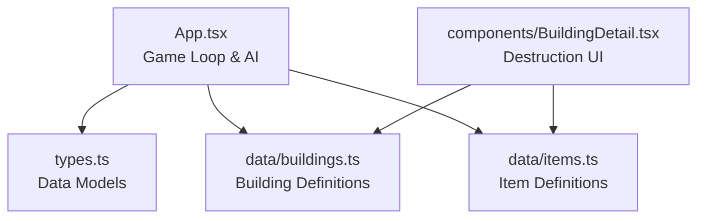
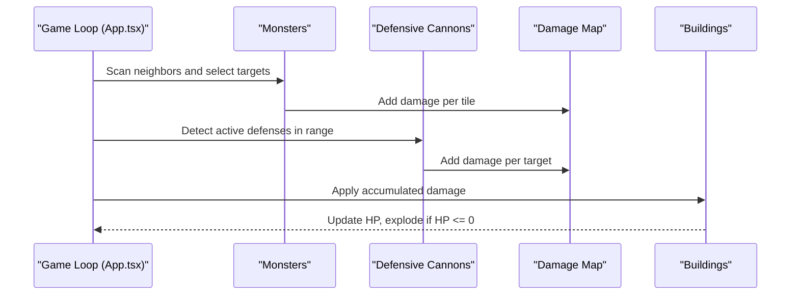
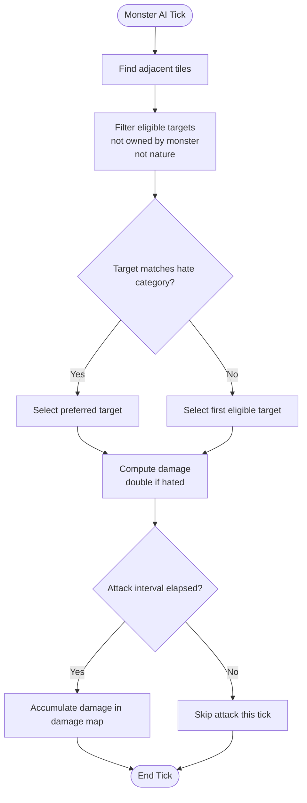
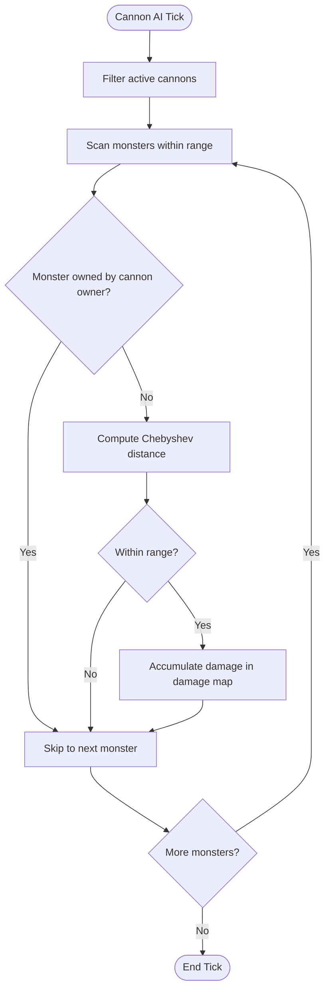
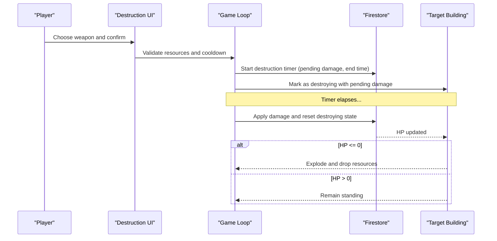
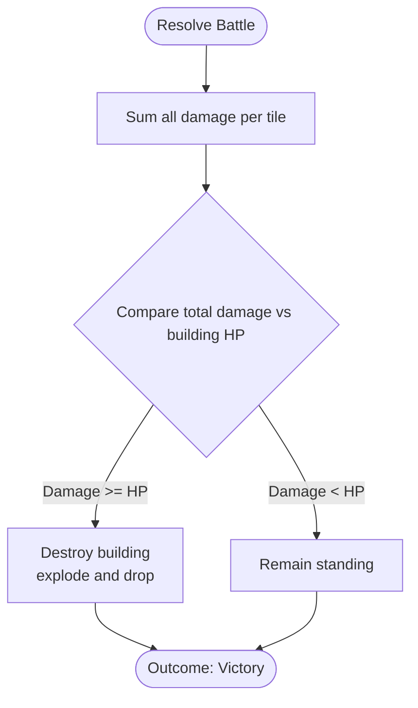
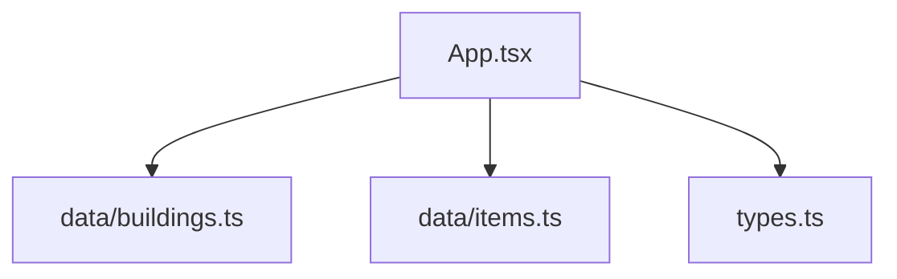

# Battle Outcome Determination

<cite>
**Referenced Files in This Document**
- [App.tsx](file://App.tsx)
- [types.ts](file://types.ts)
- [buildings.ts](file://data/buildings.ts)
- [items.ts](file://data/items.ts)
- [BuildingDetail.tsx](file://components/BuildingDetail.tsx)
</cite>

## Table of Contents
1. [Introduction](#introduction)
2. [Project Structure](#project-structure)
3. [Core Components](#core-components)
4. [Architecture Overview](#architecture-overview)
5. [Detailed Component Analysis](#detailed-component-analysis)
6. [Dependency Analysis](#dependency-analysis)
7. [Performance Considerations](#performance-considerations)
8. [Troubleshooting Guide](#troubleshooting-guide)
9. [Conclusion](#conclusion)

## Introduction
This document explains the battle outcome determination system in the game, focusing on how combat resolves between buildings and monsters, how damage is calculated, and how outcomes are evaluated. It covers:
- Combat algorithms for building vs building and player vs monster conflicts
- Strength calculations, damage modifiers, and terrain effects
- Winner determination logic across different scenarios
- Integration with building health systems, unit deployment mechanics, and resource consumption
- Mathematical formulas, probability factors, and randomization elements
- Common issues, exploit prevention, and performance optimization strategies

## Project Structure
The battle system spans several core files:
- App.tsx: Implements the game loop, AI-driven monster attacks, defensive cannon fire, and destruction timers
- types.ts: Defines data models for buildings, items, and destruction mechanics
- data/buildings.ts: Provides building definitions, stats, and destruction capabilities
- data/items.ts: Supplies item definitions used for weapon resources in destruction actions
- components/BuildingDetail.tsx: Displays weapon options and damage values for destruction actions

**Diagram sources**
- [App.tsx](file://App.tsx)
- [types.ts](file://types.ts)
- [buildings.ts](file://data/buildings.ts)
- [items.ts](file://data/items.ts)
- [BuildingDetail.tsx](file://components/BuildingDetail.tsx)

**Section sources**
- [App.tsx](file://App.tsx)
- [types.ts](file://types.ts)
- [buildings.ts](file://data/buildings.ts)
- [items.ts](file://data/items.ts)
- [BuildingDetail.tsx](file://components/BuildingDetail.tsx)

## Core Components
- Building model and stats: Encapsulate durability, damage, categories, and special behaviors (e.g., monster targeting preferences)
- Destruction mechanics: Define weapon resources, costs, and damage applied to buildings
- Game loop: Coordinates monster AI, defensive cannon fire, and destruction timers
- Health system: Tracks current/max HP per building and handles destruction/explosion logic

Key implementation references:
- Building stats and destruction info: [buildings.ts](file://data/buildings.ts)
- Data models for buildings, items, and destruction: [types.ts](file://types.ts)
- Destruction UI and weapon details: [BuildingDetail.tsx](file://components/BuildingDetail.tsx)
- Monster AI and cannon logic: [App.tsx](file://App.tsx)

**Section sources**
- [buildings.ts](file://data/buildings.ts)
- [types.ts](file://types.ts)
- [BuildingDetail.tsx](file://components/BuildingDetail.tsx)
- [App.tsx](file://App.tsx)

## Architecture Overview
The battle outcome determination follows a deterministic, turn-based simulation within the game loop:
- Monster AI scans adjacent tiles and selects targets based on categories and preferences
- Defensive cannons within range detect and engage monsters
- Damage accumulates in a temporary map keyed by tile coordinates
- At the end of the tick, buildings are updated with accumulated damage and destroyed if HP drops to zero

**Diagram sources**
- [App.tsx](file://App.tsx)

**Section sources**
- [App.tsx](file://App.tsx)

## Detailed Component Analysis

### Monster Attack Mechanics
- Target selection: Adjacent tiles are scanned; preferred targets match the monster’s hate category; fallback to any eligible building
- Damage calculation: Base damage from building stats; doubled if target matches the monster’s hated category
- Cooldown enforcement: Attacks occur at intervals defined by the monster’s stats

**Diagram sources**
- [App.tsx](file://App.tsx)

**Section sources**
- [App.tsx](file://App.tsx)

### Defensive Cannon Mechanics
- Range detection: Uses Chebyshev distance; varies by cannon type
- Target prioritization: Prefer monsters not owned by the cannon’s owner
- Damage application: Adds fixed or computed damage to the target tile

**Diagram sources**
- [App.tsx](file://App.tsx)

**Section sources**
- [App.tsx](file://App.tsx)

### Destruction Timers and Building Health
- Players trigger destruction actions via weapons; each weapon defines gold/energy cost, required items, and damage
- A destruction timer is initiated; after the timer completes, the building’s HP is reduced by the pending damage
- If HP reaches zero, the building explodes and drops resources

**Diagram sources**
- [App.tsx](file://App.tsx)
- [types.ts](file://types.ts)
- [buildings.ts](file://data/buildings.ts)
- [items.ts](file://data/items.ts)

**Section sources**
- [App.tsx](file://App.tsx)
- [types.ts](file://types.ts)
- [buildings.ts](file://data/buildings.ts)
- [items.ts](file://data/items.ts)

### Winner Determination Logic
- Building vs building: Damage accumulation per tile; building with zero HP is destroyed; explosion yields glory and drops
- Player vs monster: Cannons defend; if no defense remains, monsters deal damage until buildings are destroyed or monsters are eliminated
- Clan vs clan conflicts: Not modeled in the current codebase; outcomes depend on player-owned defenses and building health

**Diagram sources**
- [App.tsx](file://App.tsx)
- [types.ts](file://types.ts)

**Section sources**
- [App.tsx](file://App.tsx)
- [types.ts](file://types.ts)

### Mathematical Formulas and Randomization
- Damage computation:
  - Base damage from building stats
  - Multiplier if target category matches monster’s hated category
- Distance metrics:
  - Chebyshev distance for cannon targeting
- Randomization:
  - Monster movement chooses among valid moves randomly
  - No explicit randomness in damage application beyond category multipliers

**Section sources**
- [App.tsx](file://App.tsx)

### Integration with Building Health Systems
- Health tracking: Each building maintains current and maximum HP
- Explosion logic: When HP drops to zero, the building explodes and drops resources according to its definition
- Repair mechanics: Separate from combat, repair restores HP to maximum at a cost

**Section sources**
- [App.tsx](file://App.tsx)
- [types.ts](file://types.ts)
- [buildings.ts](file://data/buildings.ts)

### Integration with Unit Deployment and Resource Consumption
- Defensive units: Cannons require owners and enforce cooldowns; they consume no resources per shot in the current logic
- Player actions: Destruction actions consume gold, energy, and specific items; timers prevent instant abuse

**Section sources**
- [App.tsx](file://App.tsx)
- [items.ts](file://data/items.ts)

## Dependency Analysis
The battle system depends on:
- Building definitions for stats and categories
- Item definitions for weapon resources
- Firestore updates for synchronized state across clients

**Diagram sources**
- [App.tsx](file://App.tsx)
- [buildings.ts](file://data/buildings.ts)
- [items.ts](file://data/items.ts)
- [types.ts](file://types.ts)

**Section sources**
- [App.tsx](file://App.tsx)
- [buildings.ts](file://data/buildings.ts)
- [items.ts](file://data/items.ts)
- [types.ts](file://types.ts)

## Performance Considerations
- Minimize database writes: Batch updates and use optimistic UI where safe
- Limit AI computations: Use throttled zones and capped scan ranges
- Efficient damage aggregation: Use tile-keyed maps to avoid redundant lookups
- Avoid blocking UI: Keep heavy loops asynchronous and split work across frames

## Troubleshooting Guide
Common issues and resolutions:
- Combat calculation accuracy
  - Verify damage multipliers for hated categories and ensure stats are parsed correctly
  - Confirm attack intervals and cooldowns are enforced consistently
- Handling ties and simultaneous outcomes
  - Normalize tie-breaking by processing in a deterministic order (e.g., by position or ID)
- Preventing combat exploits
  - Enforce resource checks before initiating destruction timers
  - Validate ownership and protection timers before allowing actions
- Optimizing combat resolution performance
  - Reduce unnecessary Firestore reads/writes by batching and caching
  - Use spatial indexing or precomputed neighbor sets for AI logic

**Section sources**
- [App.tsx](file://App.tsx)
- [types.ts](file://types.ts)
- [buildings.ts](file://data/buildings.ts)
- [items.ts](file://data/items.ts)

## Conclusion
The battle outcome determination system combines deterministic AI-driven attacks, defensive cannon fire, and destruction timers to resolve conflicts between buildings and monsters. By centralizing damage accumulation and applying HP thresholds, the system ensures predictable outcomes while integrating with building health, resource consumption, and UI feedback. Proper validation, batching, and deterministic ordering help maintain fairness and performance.