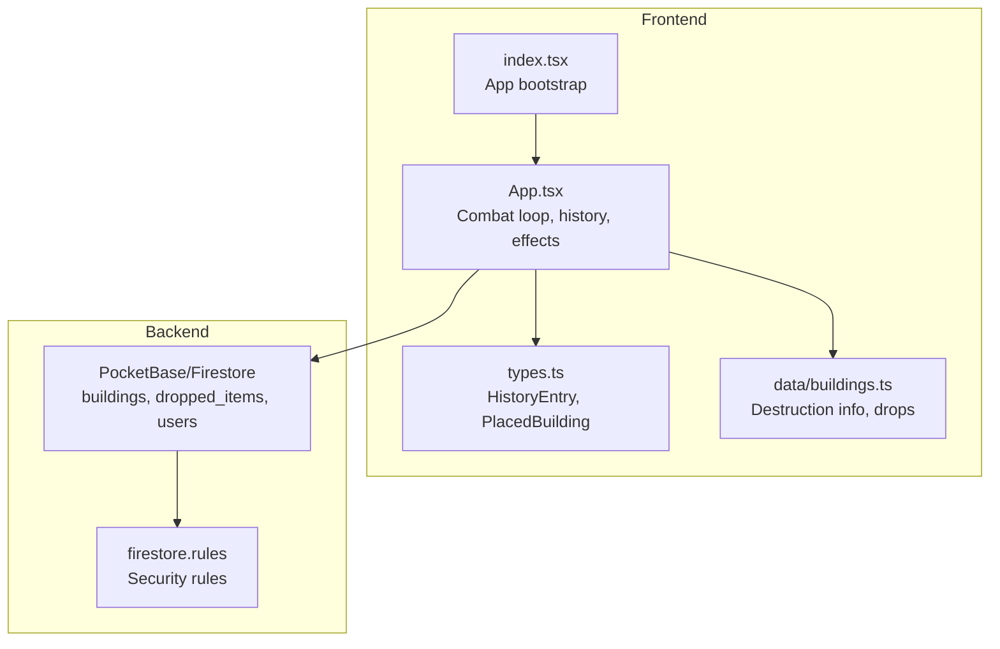
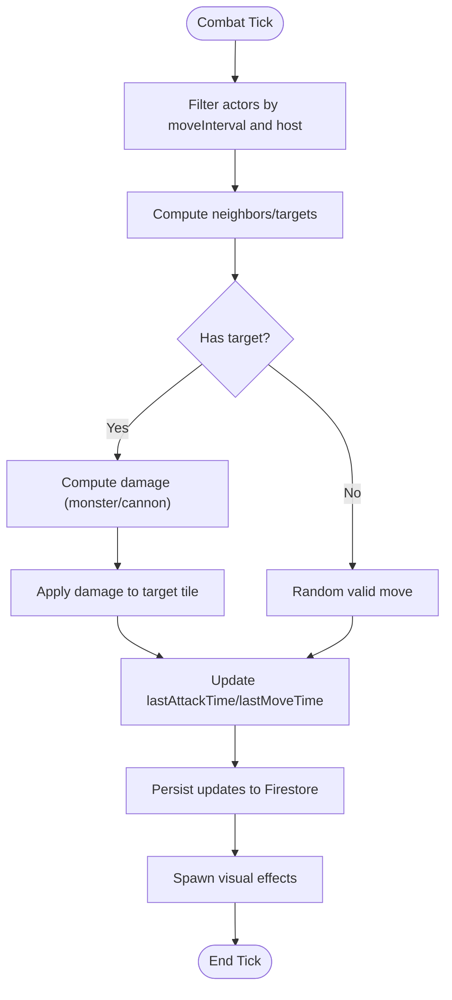
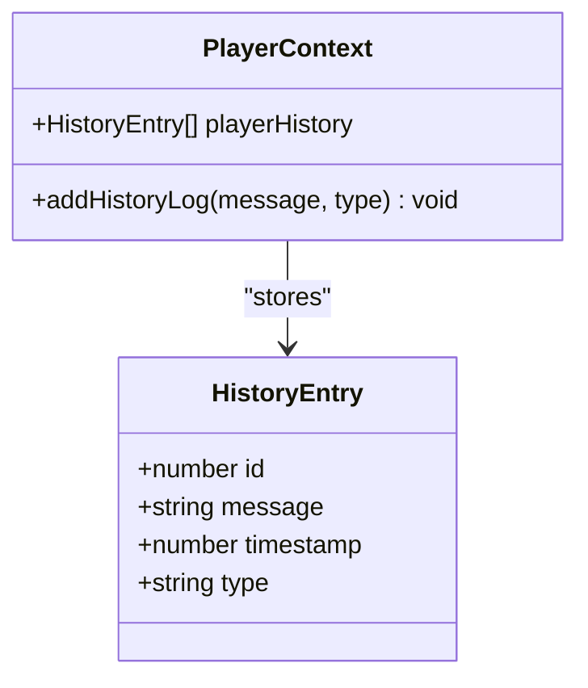
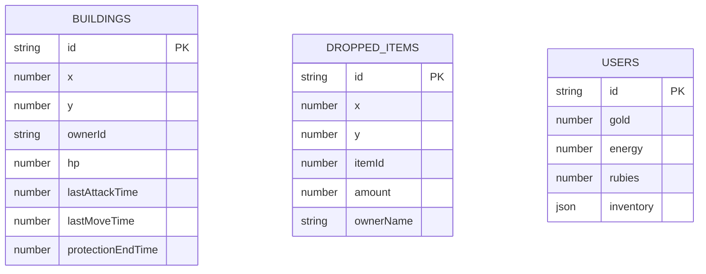
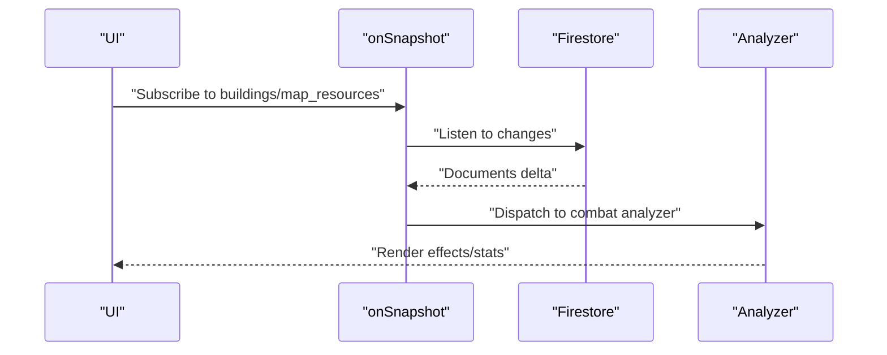
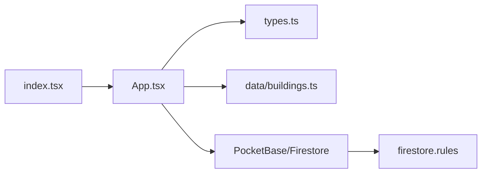

# Combat Logging and Audit

<cite>
**Referenced Files in This Document**
- [README.md](file://README.md)
- [App.tsx](file://App.tsx)
- [types.ts](file://types.ts)
- [buildings.ts](file://data/buildings.ts)
- [firestore.rules](file://firestore.rules)
- [index.tsx](file://index.tsx)
</cite>

## Table of Contents
1. [Introduction](#introduction)
2. [Project Structure](#project-structure)
3. [Core Components](#core-components)
4. [Architecture Overview](#architecture-overview)
5. [Detailed Component Analysis](#detailed-component-analysis)
6. [Dependency Analysis](#dependency-analysis)
7. [Performance Considerations](#performance-considerations)
8. [Troubleshooting Guide](#troubleshooting-guide)
9. [Conclusion](#conclusion)
10. [Appendices](#appendices)

## Introduction
This document describes the combat logging and audit system for the realtime MMORT project. It explains how combat events are captured, recorded, and audited, how histories are maintained for players, and how combat analysis can be performed. It also covers serialization, storage, retrieval, synchronization, tamper resistance, overflow handling, and performance optimization strategies grounded in the actual codebase.

## Project Structure
The combat system is implemented in the frontend application and backed by Firestore. Key areas:
- Application logic and combat loop: App.tsx
- Types and history model: types.ts
- Building definitions and destruction mechanics: data/buildings.ts
- Security rules governing building updates and deletions: firestore.rules
- Entry point: index.tsx



**Diagram sources**
- [App.tsx](file://App.tsx)
- [types.ts](file://types.ts)
- [buildings.ts](file://data/buildings.ts)
- [firestore.rules](file://firestore.rules)
- [index.tsx](file://index.tsx)

**Section sources**
- [README.md:1-21](file://README.md#L1-L21)
- [index.tsx:1-20](file://index.tsx#L1-L20)

## Core Components
- HistoryEntry model: Defines the shape of history records including message, timestamp, and type.
- PlacedBuilding: Carries combat-relevant fields such as hp, lastAttackTime, lastMoveTime, protectionEndTime, and owner identity.
- DestructionInfo: Encodes explosion mechanics and associated costs/time/damage.
- Firestore-backed storage: Buildings, dropped items, and user attributes are persisted and secured via rules.

Key responsibilities:
- Capture combat actions (monster movement/attacks, cannon fire, explosions).
- Record timestamps and participant identities.
- Persist state transitions and outcomes.
- Enforce minimal write sets and controlled updates.

**Section sources**
- [types.ts:180-185](file://types.ts#L180-L185)
- [types.ts:119-147](file://types.ts#L119-L147)
- [types.ts:25-33](file://types.ts#L25-L33)
- [firestore.rules:278-291](file://firestore.rules#L278-L291)

## Architecture Overview
The combat loop runs continuously, updating positions, applying damage, and triggering visual effects. Events are logged into the player’s history and persisted to Firestore when authenticated. Security rules restrict updates to only allowed fields and owners/admins.

```mermaid
sequenceDiagram
participant UI as "UI Layer"
participant Loop as "Combat Loop (App.tsx)"
participant DB as "Firestore (buildings/users)"
participant Hist as "HistoryEntry"
UI->>Loop : "Select building/cannon/move"
Loop->>Loop : "Compute targets, damage, timers"
Loop->>DB : "Update hp, lastAttackTime, lastMoveTime"
Loop->>Hist : "addHistoryLog(message, type)"
Hist-->>DB : "Persist history entry (when applicable)"
Loop->>Loop : "Spawn visual effects"
Loop-->>UI : "Render state changes"
```

**Diagram sources**
- [App.tsx:3290-3600](file://App.tsx#L3290-L3600)
- [App.tsx:5284-5324](file://App.tsx#L5284-L5324)
- [types.ts:180-185](file://types.ts#L180-L185)

## Detailed Component Analysis

### Combat Event Capture and Timestamp Recording
- Monster AI: Periodically evaluates neighbors, selects targets, computes damage, and updates lastAttackTime and lastMoveTime.
- Cannon AI: Scans for monsters in range, applies damage, and updates lastAttackTime.
- Timestamps: lastAttackTime and lastMoveTime are updated per actor to coordinate actions and prevent spam.



**Diagram sources**
- [App.tsx:3290-3600](file://App.tsx#L3290-L3600)

**Section sources**
- [App.tsx:3290-3600](file://App.tsx#L3290-L3600)

### Participant Tracking and Ownership
- Ownership: ownerId distinguishes neutral ("monster"/"-1"), guest ("0"), or authenticated user.
- Host identification: hostId tracks which client is responsible for AI decisions.
- Initiator tracking: initiatorId marks who started destructive actions.

These fields enable attribution and auditability of actions.

**Section sources**
- [types.ts:119-147](file://types.ts#L119-L147)
- [App.tsx:3344-3363](file://App.tsx#L3344-L3363)
- [App.tsx:3436-3445](file://App.tsx#L3436-L3445)
- [App.tsx:3547-3552](file://App.tsx#L3547-L3552)

### Combat Sequence Documentation
- Damage accumulation: A tile-based Map accumulates damage per tick.
- Destruction timers: isDestroying with destructionEndTime and pendingDamage define deferred destruction.
- Explosion handling: On zero HP, effects are spawned, drops are generated, and the building is deleted.

```mermaid
sequenceDiagram
participant Loop as "Combat Loop"
participant Tile as "Tile State"
participant DB as "Firestore"
participant Drop as "dropped_items"
Loop->>Tile : "damageMap[tileKey] += damage"
Tile->>Tile : "Apply HP reduction"
alt HP <= 0
Tile->>Drop : "Spawn drops (chance/amount)"
Tile->>DB : "Delete building doc"
else HP > 0
Tile->>DB : "Update hp"
end
```

**Diagram sources**
- [App.tsx:3447-3598](file://App.tsx#L3447-L3598)
- [App.tsx:3557-3588](file://App.tsx#L3557-L3588)

**Section sources**
- [App.tsx:3447-3598](file://App.tsx#L3447-L3598)

### History Tracking Mechanisms
- HistoryEntry: Standardized record with message, timestamp, and type.
- addHistoryLog: Centralized function to append entries to player history.
- Integration points: Used during protection activation, explosions, and construction acceleration.



**Diagram sources**
- [types.ts:180-185](file://types.ts#L180-L185)
- [App.tsx:5215-5215](file://App.tsx#L5215-L5215)
- [App.tsx:5284-5284](file://App.tsx#L5284-L5284)
- [App.tsx:5337-5337](file://App.tsx#L5337-L5337)

**Section sources**
- [types.ts:180-185](file://types.ts#L180-L185)
- [App.tsx:5215-5215](file://App.tsx#L5215-L5215)
- [App.tsx:5284-5284](file://App.tsx#L5284-L5284)
- [App.tsx:5337-5337](file://App.tsx#L5337-L5337)

### Player Profiles, Reputation, and Achievements
- Player profile fields include glory, reputation, gold, energy, inventory, and history.
- Reputation and glory adjustments are tracked per player.
- History integrates with profile tabs to present combat-related events.

While reputation and achievements are not explicitly modeled as separate entities in the provided code, the profile state and history entries provide the foundation for linking combat events to player metrics.

**Section sources**
- [App.tsx:264-290](file://App.tsx#L264-L290)
- [App.tsx:160-161](file://App.tsx#L160-L161)

### Combat Event Serialization and Storage
- Firestore documents:
  - buildings: stores PlacedBuilding with combat fields (hp, lastAttackTime, lastMoveTime, protectionEndTime, etc.).
  - dropped_items: stores loot generated on destruction.
  - users: stores player resources and inventory.
- Minimal writes: Updates target only affected fields to reduce contention and latency.



**Diagram sources**
- [types.ts:119-147](file://types.ts#L119-L147)
- [types.ts:100-109](file://types.ts#L100-L109)
- [App.tsx:3573-3575](file://App.tsx#L3573-L3575)

**Section sources**
- [App.tsx:3573-3575](file://App.tsx#L3573-L3575)
- [App.tsx:5286-5300](file://App.tsx#L5286-L5300)
- [App.tsx:5339-5350](file://App.tsx#L5339-L5350)

### Retrieval Mechanisms for Combat Analysis
- Snapshot listeners: onSnapshot is used to subscribe to map_state and buildings, enabling real-time updates and analysis of combat sequences.
- Zone-based subscriptions: Camera throttling reduces subscription churn and supports scalable retrieval.



**Diagram sources**
- [App.tsx:727-746](file://App.tsx#L727-L746)
- [App.tsx:754-777](file://App.tsx#L754-L777)

**Section sources**
- [App.tsx:727-746](file://App.tsx#L727-L746)
- [App.tsx:754-777](file://App.tsx#L754-L777)

### Integration with Player Profiles
- History entries are appended to playerHistory and can be viewed in profile tabs.
- Player state updates (glory, reputation, inventory) occur alongside combat actions.

**Section sources**
- [App.tsx:284-284](file://App.tsx#L284-L284)
- [App.tsx:160-161](file://App.tsx#L160-L161)
- [App.tsx:5284-5284](file://App.tsx#L5284-L5284)

## Dependency Analysis
- App.tsx depends on types.ts for data models and data/buildings.ts for destruction configurations.
- Firestore rules constrain updates to combat-sensitive fields to mitigate unauthorized tampering.
- Index.tsx bootstraps the app and mounts App.



**Diagram sources**
- [App.tsx](file://App.tsx)
- [types.ts](file://types.ts)
- [buildings.ts](file://data/buildings.ts)
- [firestore.rules](file://firestore.rules)
- [index.tsx](file://index.tsx)

**Section sources**
- [App.tsx](file://App.tsx)
- [types.ts](file://types.ts)
- [buildings.ts](file://data/buildings.ts)
- [firestore.rules](file://firestore.rules)
- [index.tsx](file://index.tsx)

## Performance Considerations
- Minimize writes: Only update affected fields (e.g., hp, lastAttackTime) to reduce load.
- Batch and throttle: Use throttled camera-based zone subscriptions to limit snapshot churn.
- Local optimistic updates: Update UI immediately, then reconcile with backend to reduce perceived latency.
- Tile-based damage aggregation: Accumulate damage per tile to reduce per-tick computations.

[No sources needed since this section provides general guidance]

## Troubleshooting Guide
Common issues and mitigations:
- Log synchronization across clients
  - Use snapshot listeners and throttle camera updates to keep clients in sync.
  - Ensure only allowed fields are modified by rules to prevent inconsistent writes.
- Preventing log tampering
  - Enforce field restrictions in security rules for buildings and related collections.
- Handling log overflow
  - Limit history entries per session or periodically prune older entries.
  - Paginate history retrieval to avoid large payloads.
- Optimizing combat logging performance
  - Reduce write frequency by batching updates.
  - Use targeted queries and zone-based subscriptions.

**Section sources**
- [firestore.rules:278-291](file://firestore.rules#L278-L291)
- [App.tsx:727-746](file://App.tsx#L727-L746)
- [App.tsx:754-777](file://App.tsx#L754-L777)

## Conclusion
The combat logging and audit system combines a reactive combat loop, a compact history model, and secure Firestore persistence. By tracking ownership, timestamps, and damage, it enables robust auditing and analysis. Security rules and selective writes help maintain integrity and performance. Extending the system to support formalized reputation and achievement metrics can leverage the existing profile and history infrastructure.

## Appendices

### Example: Explosion Action and History Entry
- The explosion flow updates player resources, initiates destruction timers, and logs a history entry with type "destroy".

**Section sources**
- [App.tsx:5284-5324](file://App.tsx#L5284-L5324)

### Example: Protection Activation and History Entry
- Activating protection updates building protectionEndTime and logs a social-type history entry.

**Section sources**
- [App.tsx:5215-5215](file://App.tsx#L5215-L5215)

### Example: Destruction Definitions
- DestructionInfo arrays in building definitions encode weapon costs, time, and damage for each building.

**Section sources**
- [buildings.ts:27-82](file://data/buildings.ts#L27-L82)
- [buildings.ts:120-130](file://data/buildings.ts#L120-L130)