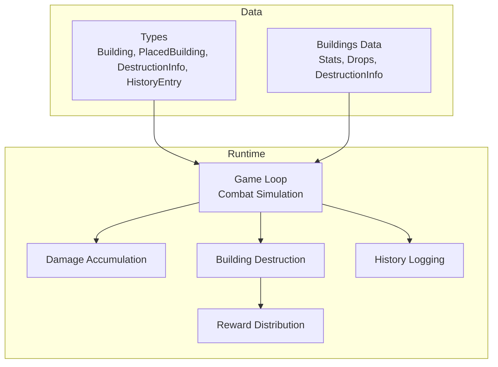
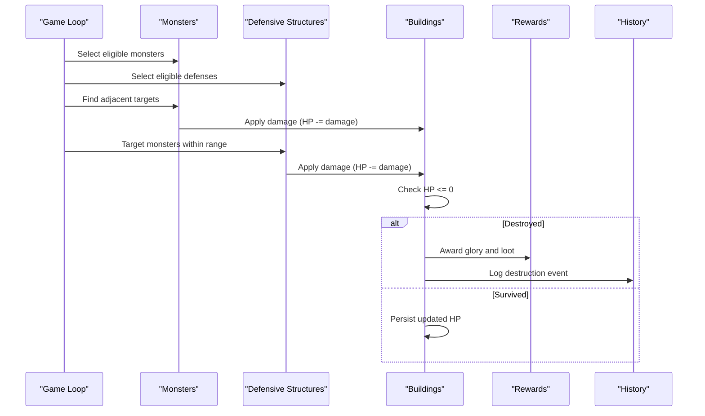
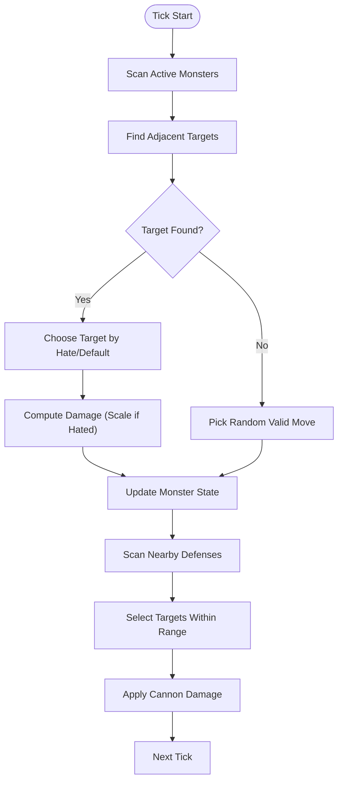
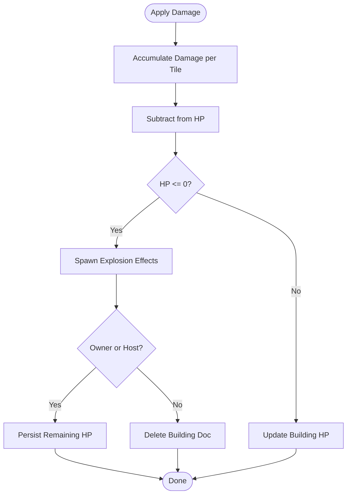
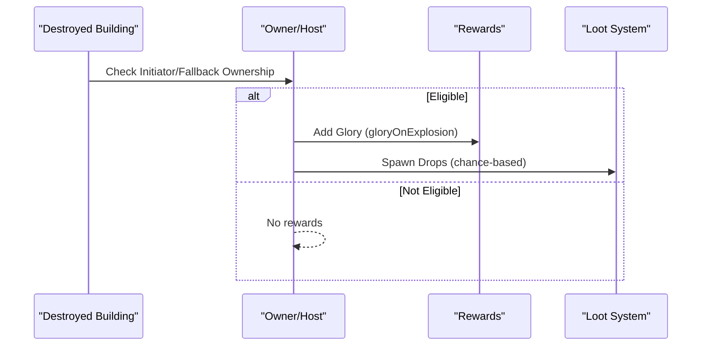
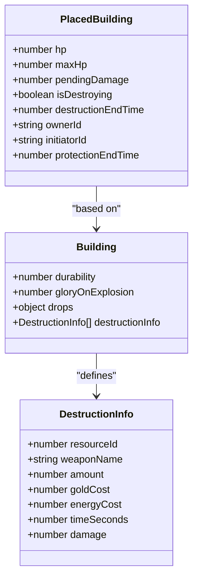
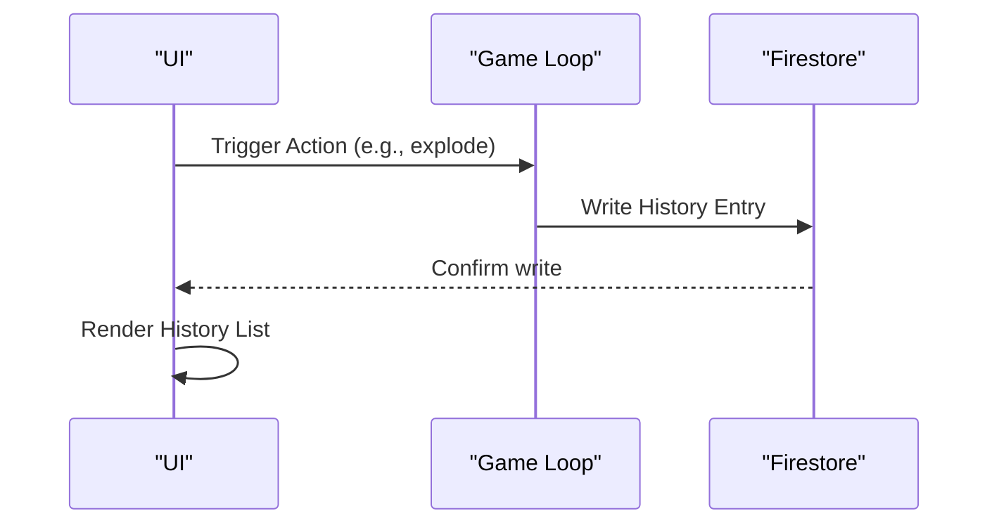
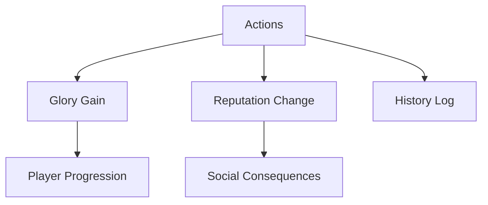
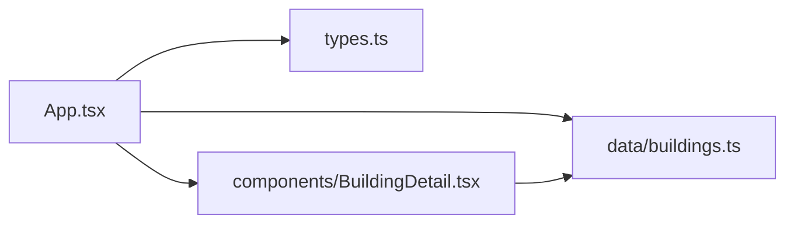

# Combat Resolution

<cite>
**Referenced Files in This Document**
- [App.tsx](file://App.tsx)
- [types.ts](file://types.ts)
- [buildings.ts](file://data/buildings.ts)
- [BuildingDetail.tsx](file://components/BuildingDetail.tsx)
</cite>

## Table of Contents
1. [Introduction](#introduction)
2. [Project Structure](#project-structure)
3. [Core Components](#core-components)
4. [Architecture Overview](#architecture-overview)
5. [Detailed Component Analysis](#detailed-component-analysis)
6. [Dependency Analysis](#dependency-analysis)
7. [Performance Considerations](#performance-considerations)
8. [Troubleshooting Guide](#troubleshooting-guide)
9. [Conclusion](#conclusion)
10. [Appendices](#appendices)

## Introduction
This document explains the combat resolution system in the game, focusing on how battles are simulated, how outcomes are determined, and how rewards and penalties are distributed. It covers:
- Battle simulation between monsters and defensive structures (cannons)
- Winner determination based on damage accumulation and HP thresholds
- Resource rewards from destroyed buildings, including glory and loot
- Integration with the building system for destruction rewards and territorial control
- The combat log/history system and audit trail
- Player progression, reputation changes, and social consequences
- Practical guidance for synchronization, exploit prevention, tie handling, and performance optimization

## Project Structure
The combat system is implemented in the main application file and supported by shared types and building definitions:
- App.tsx: Contains the game loop, combat simulation, damage accumulation, building destruction, reward distribution, and history logging
- types.ts: Defines core data structures used across the system, including Building, PlacedBuilding, DestructionInfo, and HistoryEntry
- data/buildings.ts: Provides building definitions, including stats, drops, and destruction options
- components/BuildingDetail.tsx: Renders destruction options for UI display

**Diagram sources**
- [App.tsx](file://App.tsx)
- [types.ts](file://types.ts)
- [buildings.ts](file://data/buildings.ts)

**Section sources**
- [App.tsx](file://App.tsx)
- [types.ts](file://types.ts)
- [buildings.ts](file://data/buildings.ts)

## Core Components
- PlacedBuilding: Represents a building on the map, including position, ownership, HP, timers, and combat-related fields (initiatorId, lastAttackTime, protectionEndTime)
- Building: Defines static characteristics such as durability, damage, repair, and drops
- DestructionInfo: Describes weapon options for destruction, including costs and damage
- HistoryEntry: Captures combat-related actions for audit and display

Key combat-relevant fields:
- PlacedBuilding.hp/maxHp: Health pool for buildings under attack
- PlacedBuilding.pendingDamage: Accumulated damage applied during the current tick
- PlacedBuilding.isDestroying/destructionEndTime: Timers for delayed destruction actions
- PlacedBuilding.lastAttackTime: Tracks when a building last participated in combat
- PlacedBuilding.protectionEndTime: Temporarily prevents destructive actions
- Building.stats.durability: Base HP threshold for destruction
- Building.stats.damage: Attack power for defense structures
- Building.stats.gloryOnExplosion: Glory reward for the building’s owner upon destruction
- Building.drops: Loot tables for frequent and rare items

**Section sources**
- [types.ts](file://types.ts)
- [buildings.ts](file://data/buildings.ts)

## Architecture Overview
The combat resolution pipeline runs continuously in the game loop:
1. Identify active actors (monsters and defensive structures)
2. Compute targets and apply damage per tick
3. Update HP and detect destruction
4. Distribute rewards and loot
5. Log combat events

**Diagram sources**
- [App.tsx](file://App.tsx)

## Detailed Component Analysis

### Monster vs Defensive Structures
- Targeting: Monsters scan adjacent tiles for enemy buildings, prioritizing categories defined by stats.hates or defaulting to business-type categories when not specified
- Damage scaling: If a monster attacks a building of its hated category, damage is doubled
- Attack timing: Monsters and cannons apply damage only after meeting their move/attack intervals

**Diagram sources**
- [App.tsx](file://App.tsx)

**Section sources**
- [App.tsx](file://App.tsx)

### Damage Application and Building Destruction
- Damage accumulation: During each tick, damage is accumulated per tile and later subtracted from HP
- HP thresholds: Buildings are destroyed when HP falls to zero or below
- Visual feedback: Explosions are generated on destruction
- Owner checks: Only the building owner or designated host can persist partial HP after destruction

**Diagram sources**
- [App.tsx](file://App.tsx)

**Section sources**
- [App.tsx](file://App.tsx)

### Reward Distribution on Destruction
- Glory rewards: The building owner gains glory equal to stats.gloryOnExplosion when their building is destroyed by an action they initiated or are the fallback owner for
- Loot generation: If drops are defined, random item spawns are created with configurable chances and amounts
- Ownership eligibility: Only initiators or fallback owners receive glory and loot

**Diagram sources**
- [App.tsx](file://App.tsx)
- [types.ts](file://types.ts)
- [buildings.ts](file://data/buildings.ts)

**Section sources**
- [App.tsx](file://App.tsx)
- [types.ts](file://types.ts)
- [buildings.ts](file://data/buildings.ts)

### Integration with Building System and Territorial Control
- Destruction options: Buildings define destructionInfo entries that specify weapon requirements, costs, and damage
- Weapon consumption: Players spend inventory items, gold, and energy to trigger destruction actions
- Zone-based effects: Some mechanics (e.g., taxation) depend on zone coordinates; destruction actions respect protection timers and zone ownership
- UI exposure: The Building Detail panel lists destruction options for players to choose from

**Diagram sources**
- [types.ts](file://types.ts)
- [buildings.ts](file://data/buildings.ts)
- [App.tsx](file://App.tsx)

**Section sources**
- [types.ts](file://types.ts)
- [buildings.ts](file://data/buildings.ts)
- [App.tsx](file://App.tsx)

### Combat Log System, History Tracking, and Audit Trails
- History entries: The system logs combat-related actions with timestamps and types (e.g., destroy, combat)
- UI display: History entries are rendered in the profile/history tab with localized timestamps
- Persistence: Logs capture who performed actions, where, and what was destroyed

**Diagram sources**
- [App.tsx](file://App.tsx)

**Section sources**
- [App.tsx](file://App.tsx)

### Relationship Between Outcomes and Player Progression, Reputation, and Social Consequences
- Glory: Earned when buildings explode, contributing to player progression metrics
- Reputation: Social actions (praise/complain) modify player reputation and are logged
- Social UI: Buttons for praise and complaints are exposed in profiles, with transactional updates and local fallbacks

**Diagram sources**
- [App.tsx](file://App.tsx)

**Section sources**
- [App.tsx](file://App.tsx)

## Dependency Analysis
- App.tsx orchestrates combat logic and interacts with Firestore for persistence
- types.ts defines shared structures used across components
- data/buildings.ts supplies building definitions consumed by the game loop
- components/BuildingDetail.tsx renders destruction options for UI selection

**Diagram sources**
- [App.tsx](file://App.tsx)
- [types.ts](file://types.ts)
- [buildings.ts](file://data/buildings.ts)
- [BuildingDetail.tsx](file://components/BuildingDetail.tsx)

**Section sources**
- [App.tsx](file://App.tsx)
- [types.ts](file://types.ts)
- [buildings.ts](file://data/buildings.ts)
- [BuildingDetail.tsx](file://components/BuildingDetail.tsx)

## Performance Considerations
- Batch updates: Prefer applying state changes and Firestore writes in batches to reduce network overhead
- Interval-based actions: Use attack/move intervals to throttle damage application and avoid excessive computations
- Local optimistic updates: Maintain local state for recent interactions to minimize perceived latency; reconcile with server state when appropriate
- Zone-based queries: Limit Firestore reads/writes to relevant zones to reduce load
- Avoid redundant writes: Only update documents when state changes are detected

## Troubleshooting Guide
Common issues and mitigations:
- Synchronization across clients
  - Use sticky interaction logic to prevent rollback of recent local changes until server catches up
  - Merge server and local states carefully, keeping local-only persistent entities
  - Example references:
    - [App.tsx](file://App.tsx)
- Preventing combat exploits
  - Validate ownership and protection timers before allowing destructive actions
  - Enforce weapon/item/energy/gold requirements before initiating destruction
  - Example references:
    - [App.tsx](file://App.tsx)
- Handling tie scenarios
  - When multiple actors target the same tile, accumulate damage and resolve HP in a single pass per tick
  - Example references:
    - [App.tsx](file://App.tsx)
- Optimizing combat resolution performance
  - Use efficient data structures (maps) for damage accumulation and updates
  - Minimize Firestore operations by batching and debouncing writes
  - Example references:
    - [App.tsx](file://App.tsx)

**Section sources**
- [App.tsx](file://App.tsx)

## Conclusion
The combat resolution system simulates real-time battles between monsters and defensive structures, resolves outcomes deterministically based on damage accumulation and HP thresholds, and distributes rewards and penalties fairly. It integrates tightly with the building system for destruction rewards and loot, maintains a robust history/log system, and supports player progression and social dynamics. By following the recommended practices for synchronization, exploit prevention, and performance, developers can maintain a smooth and fair combat experience.

## Appendices

### Concrete Examples from the Codebase
- Monster targeting and damage scaling:
  - [App.tsx](file://App.tsx)
- Cannon targeting and damage application:
  - [App.tsx](file://App.tsx)
- Building destruction and reward distribution:
  - [App.tsx](file://App.tsx)
- Destruction options UI:
  - [BuildingDetail.tsx](file://components/BuildingDetail.tsx)
- Building definitions (stats, drops, destruction):
  - [buildings.ts](file://data/buildings.ts)
- Shared types:
  - [types.ts](file://types.ts)