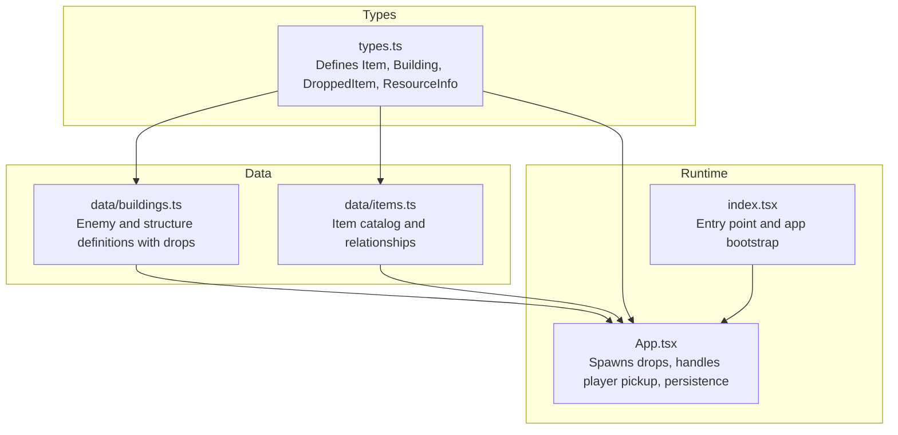
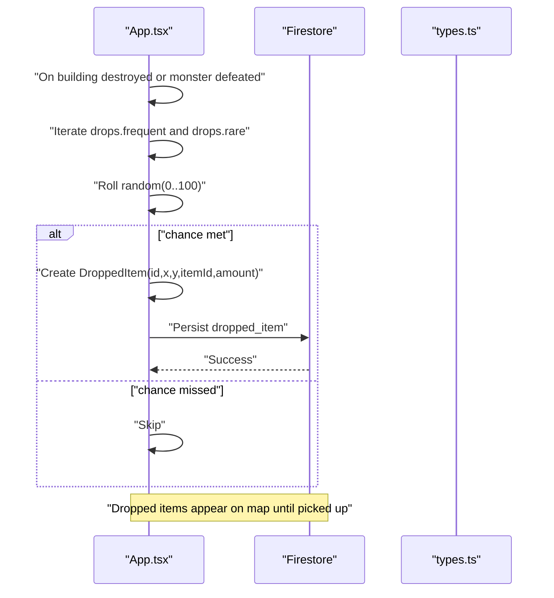
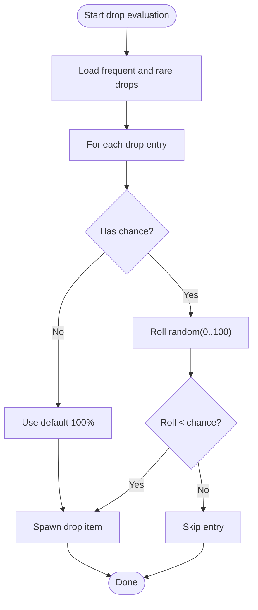
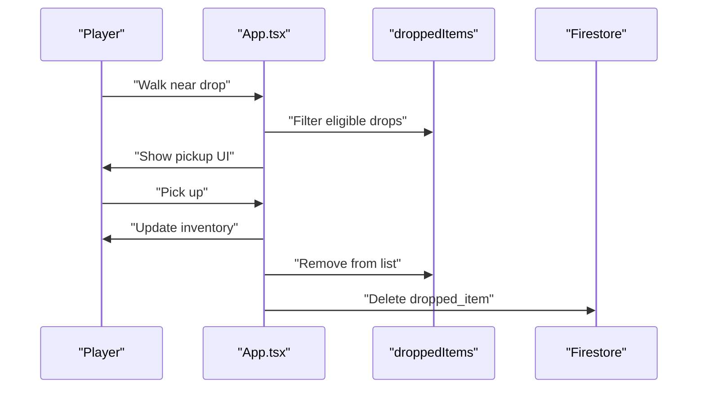
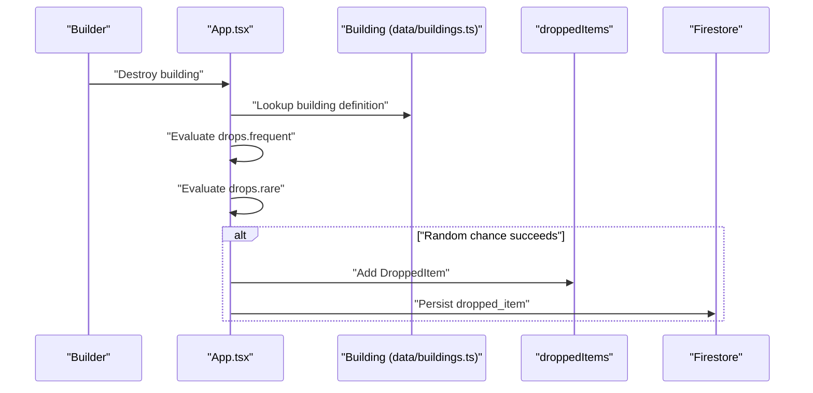
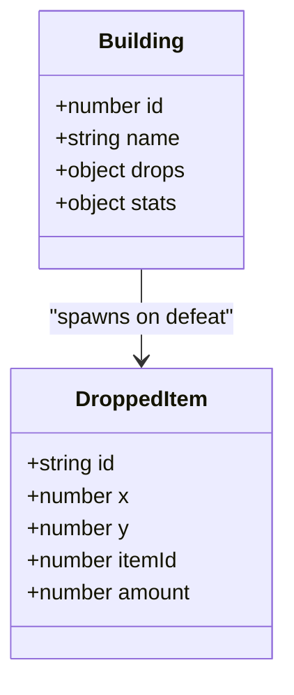
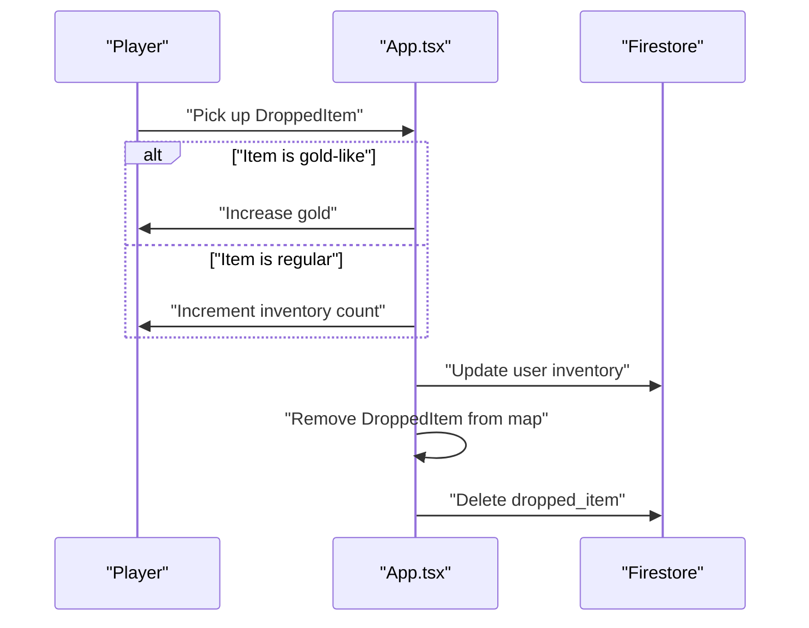
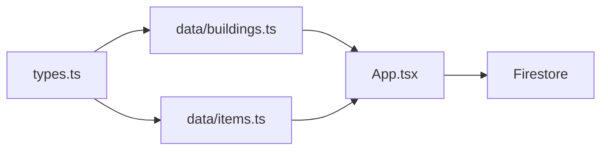

# Combat Loot Distribution

<cite>
**Referenced Files in This Document**
- [App.tsx](file://App.tsx)
- [types.ts](file://types.ts)
- [data/buildings.ts](file://data/buildings.ts)
- [data/items.ts](file://data/items.ts)
- [index.tsx](file://index.tsx)
</cite>

## Table of Contents
1. [Introduction](#introduction)
2. [Project Structure](#project-structure)
3. [Core Components](#core-components)
4. [Architecture Overview](#architecture-overview)
5. [Detailed Component Analysis](#detailed-component-analysis)
6. [Dependency Analysis](#dependency-analysis)
7. [Performance Considerations](#performance-considerations)
8. [Troubleshooting Guide](#troubleshooting-guide)
9. [Conclusion](#conclusion)

## Introduction
This document explains the combat loot distribution system in the game, focusing on how items are dropped from defeated enemies, how drop chances and quantities are calculated, and how temporary item drops are integrated into the live map state. It also covers loot generation for building destruction, resource extraction mechanics, and how the system scales with player actions and environment. The goal is to make the system understandable for beginners while providing deep technical insights for developers implementing similar systems.

## Project Structure
The loot system spans several modules:
- Types define the data contracts for items, buildings, and dropped items.
- Building definitions specify drop tables and destruction parameters.
- Items define production and consumption relationships.
- The main application orchestrates loot spawning, player interaction, and persistence.

**Diagram sources**
- [types.ts:1-197](file://types.ts#L1-L197)
- [data/buildings.ts:1-800](file://data/buildings.ts#L1-L800)
- [data/items.ts:1-415](file://data/items.ts#L1-L415)
- [App.tsx:1-8217](file://App.tsx#L1-L8217)
- [index.tsx:1-20](file://index.tsx#L1-L20)

**Section sources**
- [types.ts:1-197](file://types.ts#L1-L197)
- [data/buildings.ts:1-800](file://data/buildings.ts#L1-L800)
- [data/items.ts:1-415](file://data/items.ts#L1-L415)
- [App.tsx:1-8217](file://App.tsx#L1-L8217)
- [index.tsx:1-20](file://index.tsx#L1-L20)

## Core Components
- Drop table model: Buildings (including monsters) declare frequent and rare drop lists with item id, quantity, and optional chance.
- Random selection: Each drop entry is evaluated independently with a uniform random roll against its configured chance.
- Temporary item drops: Dropped items are created as transient entities on the map and persisted to Firestore for synchronization.
- Player pickup: Players can collect nearby drops, updating inventory and removing the drop from the map.
- Destruction loot: When structures are destroyed via weapons, their drop tables are consulted to spawn loot.

Key data contracts:
- ResourceInfo: carries id, name, amount, chance, and frequency.
- Building: includes a drops object with frequent and rare arrays.
- DroppedItem: represents a temporary item on the map with position, owner info, and amount.

**Section sources**
- [types.ts:2-8](file://types.ts#L2-L8)
- [types.ts:42-96](file://types.ts#L42-L96)
- [types.ts:100-109](file://types.ts#L100-L109)

## Architecture Overview
The loot lifecycle consists of three stages:
1. Drop generation: When a building is destroyed or a monster defeated, its drop table entries are iterated and randomly evaluated.
2. Temporary spawn: Eligible drops are added to the in-memory droppedItems list and persisted to Firestore.
3. Player interaction: Players can pick up nearby drops, which updates inventory and removes the drop from the map.

**Diagram sources**
- [App.tsx:3557-3583](file://App.tsx#L3557-L3583)
- [types.ts:100-109](file://types.ts#L100-L109)

## Detailed Component Analysis

### Drop Table Model and Random Selection
- Drop tables are defined per building under the drops object with frequent and rare arrays.
- Each entry is a ResourceInfo-like structure containing item id, amount, and optional chance (percentage).
- Random selection uses a uniform roll against the configured chance for each entry.

**Diagram sources**
- [App.tsx:3557-3583](file://App.tsx#L3557-L3583)

**Section sources**
- [data/buildings.ts:24-26](file://data/buildings.ts#L24-L26)
- [data/buildings.ts:111-119](file://data/buildings.ts#L111-L119)
- [data/buildings.ts:159-167](file://data/buildings.ts#L159-L167)
- [data/buildings.ts:197-205](file://data/buildings.ts#L197-L205)
- [data/buildings.ts:274-282](file://data/buildings.ts#L274-L282)
- [data/buildings.ts:313-321](file://data/buildings.ts#L313-L321)
- [data/buildings.ts:4549-4559](file://data/buildings.ts#L4549-L4559)
- [data/buildings.ts:4592-4601](file://data/buildings.ts#L4592-L4601)
- [data/buildings.ts:4637-4646](file://data/buildings.ts#L4637-L4646)

### Temporary Item Drops and Persistence
- When a drop is selected, a DroppedItem is created with a unique id, coordinates, and amount.
- The item is added to the in-memory droppedItems list and persisted to Firestore under the dropped_items collection.
- Players can pick up these items, which updates inventory and removes the drop from the map and database.

**Diagram sources**
- [App.tsx:1091-1113](file://App.tsx#L1091-L1113)
- [App.tsx:3557-3583](file://App.tsx#L3557-L3583)
- [types.ts:100-109](file://types.ts#L100-L109)

**Section sources**
- [App.tsx:1091-1113](file://App.tsx#L1091-L1113)
- [App.tsx:3557-3583](file://App.tsx#L3557-L3583)
- [types.ts:100-109](file://types.ts#L100-L109)

### Building Destruction Loot
- Destruction loot is governed by the building’s drops field.
- On successful destruction (initiator or fallback owner), the system evaluates frequent and rare drop lists.
- Each eligible entry spawns a temporary item on the building’s location.

**Diagram sources**
- [App.tsx:3557-3583](file://App.tsx#L3557-L3583)
- [data/buildings.ts:24-26](file://data/buildings.ts#L24-L26)
- [data/buildings.ts:111-119](file://data/buildings.ts#L111-L119)

**Section sources**
- [App.tsx:3557-3583](file://App.tsx#L3557-L3583)
- [data/buildings.ts:24-26](file://data/buildings.ts#L24-L26)
- [data/buildings.ts:111-119](file://data/buildings.ts#L111-L119)

### Monster Drops and Combat Mechanics
- Monsters are represented as buildings with special stats and categories.
- Their drop tables define frequent and rare rewards.
- Combat mechanics (attacking and defeating) trigger drop spawning when applicable.

**Diagram sources**
- [data/buildings.ts:4528-4665](file://data/buildings.ts#L4528-L4665)
- [types.ts:42-96](file://types.ts#L42-L96)
- [types.ts:100-109](file://types.ts#L100-L109)

**Section sources**
- [data/buildings.ts:4528-4665](file://data/buildings.ts#L4528-L4665)
- [types.ts:42-96](file://types.ts#L42-L96)
- [types.ts:100-109](file://types.ts#L100-L109)

### Resource Extraction from Destroyed Structures
- Some structures define destructionInfo with weapon requirements and costs.
- While destructionInfo governs the cost and feasibility of destruction, drop generation is handled separately via the drops field.
- Items produced by resource-generating buildings are not part of combat loot; they are covered by separate production logic elsewhere in the codebase.

**Section sources**
- [data/buildings.ts:27-82](file://data/buildings.ts#L27-L82)
- [data/buildings.ts:120-130](file://data/buildings.ts#L120-L130)
- [data/buildings.ts:4560-4567](file://data/buildings.ts#L4560-L4567)
- [data/buildings.ts:4602-4609](file://data/buildings.ts#L4602-L4609)
- [data/buildings.ts:4647-4654](file://data/buildings.ts#L4647-L4654)

### Player Inventory and Pickup
- When a player picks up a drop, inventory is updated locally and persisted to Firestore.
- Special handling applies for gold-like items (monetary rewards) versus regular items.

**Diagram sources**
- [App.tsx:1091-1113](file://App.tsx#L1091-L1113)

**Section sources**
- [App.tsx:1091-1113](file://App.tsx#L1091-L1113)

## Dependency Analysis
- types.ts defines shared interfaces used across the app.
- data/buildings.ts provides drop table definitions and destruction parameters.
- data/items.ts catalogs items and their relationships (used in crafting and production).
- App.tsx consumes these definitions to implement loot generation, persistence, and player interaction.

**Diagram sources**
- [types.ts:1-197](file://types.ts#L1-L197)
- [data/buildings.ts:1-800](file://data/buildings.ts#L1-L800)
- [data/items.ts:1-415](file://data/items.ts#L1-L415)
- [App.tsx:1-8217](file://App.tsx#L1-L8217)

**Section sources**
- [types.ts:1-197](file://types.ts#L1-L197)
- [data/buildings.ts:1-800](file://data/buildings.ts#L1-L800)
- [data/items.ts:1-415](file://data/items.ts#L1-L415)
- [App.tsx:1-8217](file://App.tsx#L1-L8217)

## Performance Considerations
- Random selection is O(n) per drop list; keep frequent and rare lists concise.
- Persisting each drop introduces database writes; batching or throttling could reduce load if needed.
- Rendering many temporary drops can impact UI performance; consider limiting visible drops per zone or using spatial partitioning.

## Troubleshooting Guide
- Duplicate drops: Ensure each drop entry has a unique id and is removed after pickup.
- Missing loot: Verify that chance values are set appropriately and that the building’s drops arrays are populated.
- Inventory overflow: The code increments counts without explicit cap checks; consider adding capacity limits and overflow handling.
- Synchronization issues: Confirm that dropped items are deleted from Firestore upon pickup and that inventory updates are applied consistently across clients.

**Section sources**
- [App.tsx:1091-1113](file://App.tsx#L1091-L1113)
- [App.tsx:3557-3583](file://App.tsx#L3557-L3583)

## Conclusion
The combat loot distribution system is centered around building-defined drop tables and a straightforward random selection mechanism. Temporary item drops are persisted for cross-client visibility and synchronized removal upon pickup. While the current implementation focuses on building and monster drops, the same pattern can be extended to resource extraction and crafting-based production. For production readiness, consider adding inventory capacity checks, performance optimizations for dense loot zones, and robust synchronization safeguards.