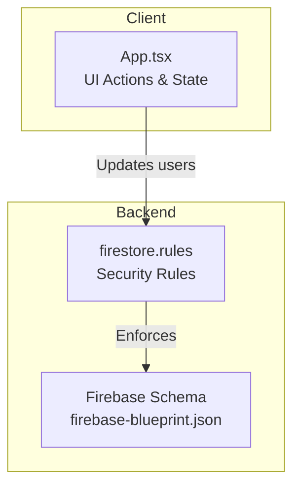
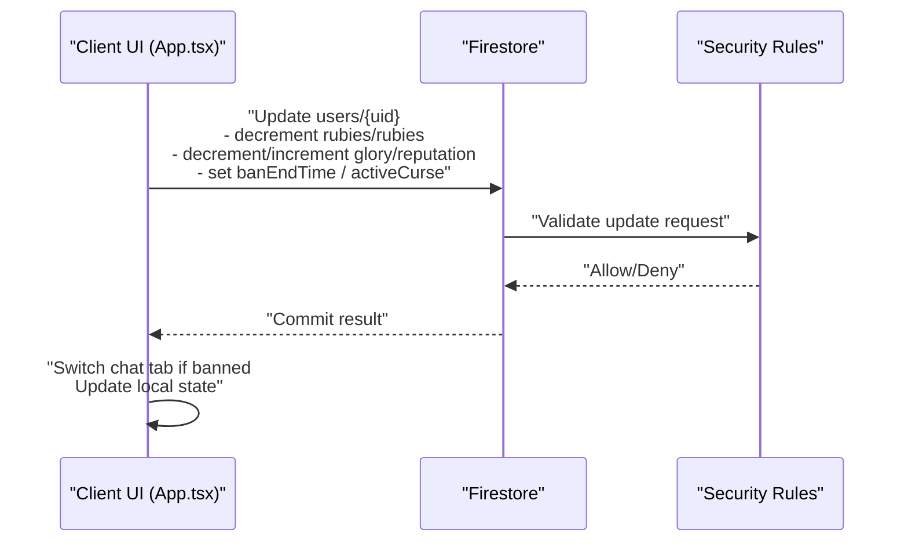
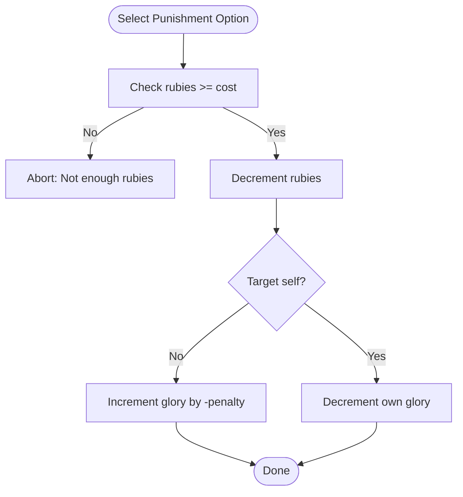
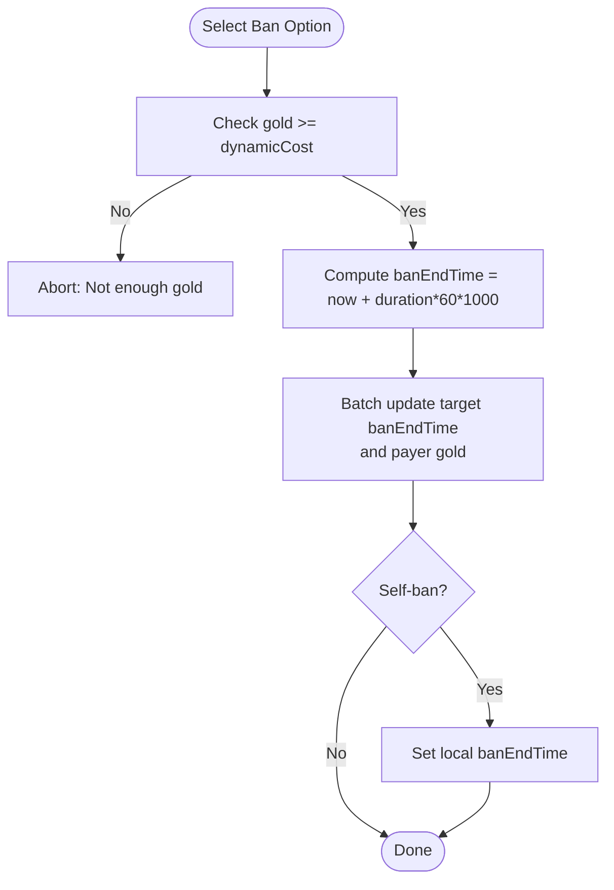
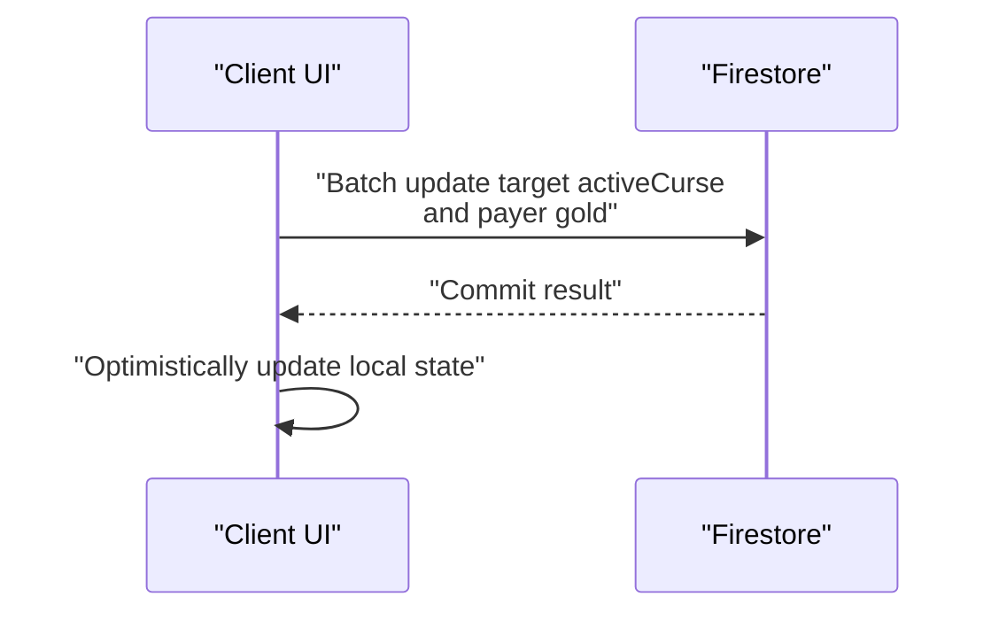
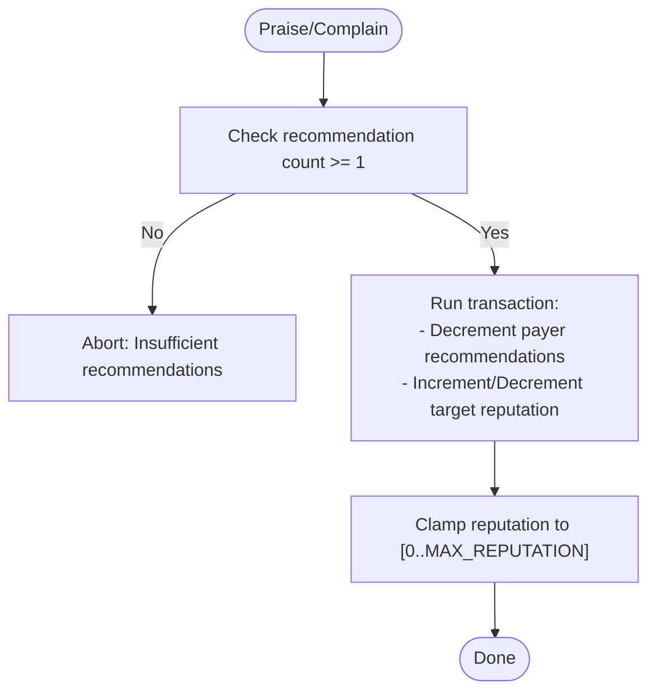
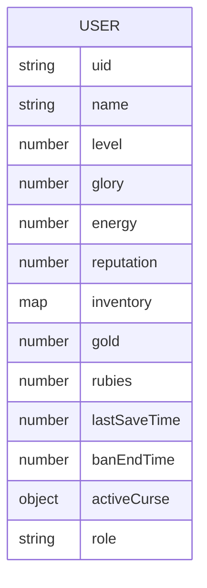
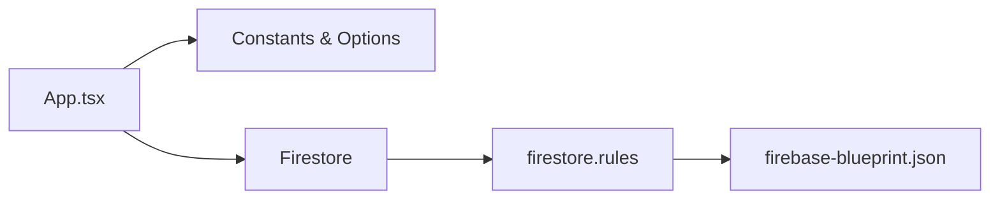

# Penalty Calculations

<cite>
**Referenced Files in This Document**
- [App.tsx](file://App.tsx)
- [firestore.rules](file://firestore.rules)
- [firebase-blueprint.json](file://firebase-blueprint.json)
- [unlock_users.mjs](file://unlock_users.mjs)
</cite>

## Table of Contents
1. [Introduction](#introduction)
2. [Project Structure](#project-structure)
3. [Core Components](#core-components)
4. [Architecture Overview](#architecture-overview)
5. [Detailed Component Analysis](#detailed-component-analysis)
6. [Dependency Analysis](#dependency-analysis)
7. [Performance Considerations](#performance-considerations)
8. [Troubleshooting Guide](#troubleshooting-guide)
9. [Conclusion](#conclusion)

## Introduction
This document explains the penalty calculation system implemented in the game client and backend. It covers combat-related penalties, rule violations, and punishment mechanics such as glory loss, temporary bans, curses, and reputation adjustments. It also documents the integration with player behavior tracking, violation detection, and automated enforcement via Firestore. The guide includes concrete examples from the codebase, describes severity-to-penalty mappings, and outlines restoration mechanisms. Guidance is provided for fairness, abuse prevention, false positive handling, and performance optimization.

## Project Structure
The penalty system spans the frontend client and backend Firestore rules. The client exposes UI actions for punishments and bans, while Firestore enforces field-level constraints and restricts updates to safe paths during active penalties.

**Diagram sources**
- [App.tsx](file://App.tsx)
- [firestore.rules](file://firestore.rules)
- [firebase-blueprint.json](file://firebase-blueprint.json)

**Section sources**
- [App.tsx](file://App.tsx)
- [firestore.rules](file://firestore.rules)
- [firebase-blueprint.json](file://firebase-blueprint.json)

## Core Components
- Glory loss penalties: Defined by predefined options with fixed glory deductions and ruby costs. Deduction is enforced via Firestore increments.
- Temporary bans: Enforced by setting a future timestamp in the user document; UI switches the active chat tab to a restricted channel while banned.
- Curses: Apply a temporary prefix to a player’s name for a limited duration.
- Reputation adjustments: Community-driven praise/complain actions adjust a player’s reputation with a cap.
- Dynamic ban pricing: Cost scales with the target’s reputation.

Key constants and options:
- Glory penalties and ruby costs: [PUNISHMENT_OPTIONS](file://App.tsx)
- Temporary ban durations and base costs: [BAN_OPTIONS](file://App.tsx)
- Curse durations and prefixes: [CURSE_OPTIONS](file://App.tsx)
- Maximum reputation: [MAX_REPUTATION](file://App.tsx)
- Ban end timestamp field: [banEndTime](file://firebase-blueprint.json)

**Section sources**
- [App.tsx](file://App.tsx)
- [firebase-blueprint.json](file://firebase-blueprint.json)

## Architecture Overview
The penalty system integrates UI actions with Firestore updates and enforces safety via security rules.

**Diagram sources**
- [App.tsx](file://App.tsx)
- [firestore.rules](file://firestore.rules)

## Detailed Component Analysis

### Glory Loss Penalties
- Options define fixed glory penalties and ruby costs.
- Deduction uses atomic increments to reduce glory.
- Self-punishment and cross-player punishment handled uniformly.

**Diagram sources**
- [App.tsx](file://App.tsx)

Penalty options and enforcement:
- Glory penalty values and ruby costs: [PUNISHMENT_OPTIONS](file://App.tsx)
- Glory decrement logic: [handlePunishPlayerByUid](file://App.tsx)

**Section sources**
- [App.tsx](file://App.tsx)

### Temporary Bans
- Duration presets and base costs are defined.
- Dynamic cost increases with target reputation.
- Ban enforcement sets a future timestamp; UI switches chat tab to a restricted channel while banned.

**Diagram sources**
- [App.tsx](file://App.tsx)

Ban mechanics:
- Preset durations and base costs: [BAN_OPTIONS](file://App.tsx)
- Dynamic cost computation: [showBanMenuInProfile rendering](file://App.tsx)
- Ban enforcement and UI effects: [handleBanPlayerByUid](file://App.tsx), [isBanned](file://App.tsx), [banEndTime effect](file://App.tsx)

**Section sources**
- [App.tsx](file://App.tsx)

### Curses
- Applies a temporary prefix to a player’s name for a limited duration.
- Uses a batch to set the curse object and decrement gold.

**Diagram sources**
- [App.tsx](file://App.tsx)

Curse mechanics:
- Durations and prefixes: [CURSE_OPTIONS](file://App.tsx)
- Enforcement: [handleCursePlayerByUid](file://App.tsx)

**Section sources**
- [App.tsx](file://App.tsx)

### Reputation Adjustments (Community Voting)
- Players can praise or complain about another player using a limited resource.
- Atomic transactions enforce both the resource decrement and the reputation change.
- Reputation is capped at a maximum value.

**Diagram sources**
- [App.tsx](file://App.tsx)

Reputation mechanics:
- Praise/complain handlers: [handlePraisePlayer](file://App.tsx), [handleComplainPlayer](file://App.tsx)
- Maximum reputation: [MAX_REPUTATION](file://App.tsx)

**Section sources**
- [App.tsx](file://App.tsx)

### Backend Enforcement and Safety
Firestore rules restrict updates to safe paths and enforce constraints during active penalties.

**Diagram sources**
- [firebase-blueprint.json](file://firebase-blueprint.json)

Key enforcement highlights:
- Users can be updated by owners or admins; limited keys are allowed for penalty-related fields.
- Ban end time and active curse updates are validated and restricted to safe transitions.
- Reputation and resource updates are permitted under controlled conditions.

**Section sources**
- [firestore.rules](file://firestore.rules)
- [firebase-blueprint.json](file://firebase-blueprint.json)

## Dependency Analysis
- Client depends on Firestore for persistence and on security rules for safety.
- UI actions depend on constants and state for cost computation and enforcement.
- Backend depends on schema definitions and rules to maintain integrity.

**Diagram sources**
- [App.tsx](file://App.tsx)
- [firestore.rules](file://firestore.rules)
- [firebase-blueprint.json](file://firebase-blueprint.json)

**Section sources**
- [App.tsx](file://App.tsx)
- [firestore.rules](file://firestore.rules)
- [firebase-blueprint.json](file://firebase-blueprint.json)

## Performance Considerations
- Prefer batch writes for related updates (e.g., ban and payment) to minimize round trips.
- Use optimistic UI updates for responsiveness; reconcile with server state on commit.
- Limit frequent reads/writes to penalty-related fields; coalesce updates where possible.
- Avoid unnecessary Firestore queries for penalty checks; rely on UI state and server-side validation.

## Troubleshooting Guide
Common issues and resolutions:
- Permission errors when updating penalties:
  - Ensure the user is authenticated and authorized to update the target document.
  - Verify Firestore rules allow updates to banEndTime and activeCurse.
  - See: [firestore.rules](file://firestore.rules)
- Dynamic ban cost too high:
  - Confirm reputation scaling is applied in the UI before sending the request.
  - See: [showBanMenuInProfile rendering](file://App.tsx)
- Temporary ban not taking effect:
  - Confirm banEndTime is set to a future timestamp and the UI switches chat tab accordingly.
  - See: [handleBanPlayerByUid](file://App.tsx), [isBanned](file://App.tsx)
- Glory loss not reflected:
  - Verify the transaction decremented rubies and incremented glory by negative penalty.
  - See: [handlePunishPlayerByUid](file://App.tsx)
- Reputation adjustments failing:
  - Ensure the payer has sufficient recommendations and the transaction runs atomically.
  - See: [handlePraisePlayer](file://App.tsx), [handleComplainPlayer](file://App.tsx)
- Unlocking user collection for testing:
  - Use the provided script to patch collection rules for development.
  - See: [unlock_users.mjs](file://unlock_users.mjs)

**Section sources**
- [firestore.rules](file://firestore.rules)
- [App.tsx](file://App.tsx)
- [unlock_users.mjs](file://unlock_users.mjs)

## Conclusion
The penalty system combines configurable UI actions with strict backend enforcement. Glory losses, temporary bans, curses, and reputation adjustments are implemented with clear cost structures and safety rules. By leveraging Firestore transactions and batch updates, the system ensures atomicity and consistency. Administrators can fine-tune enforcement via security rules, while UI logic provides responsive feedback and dynamic pricing to deter abuse and maintain fairness.