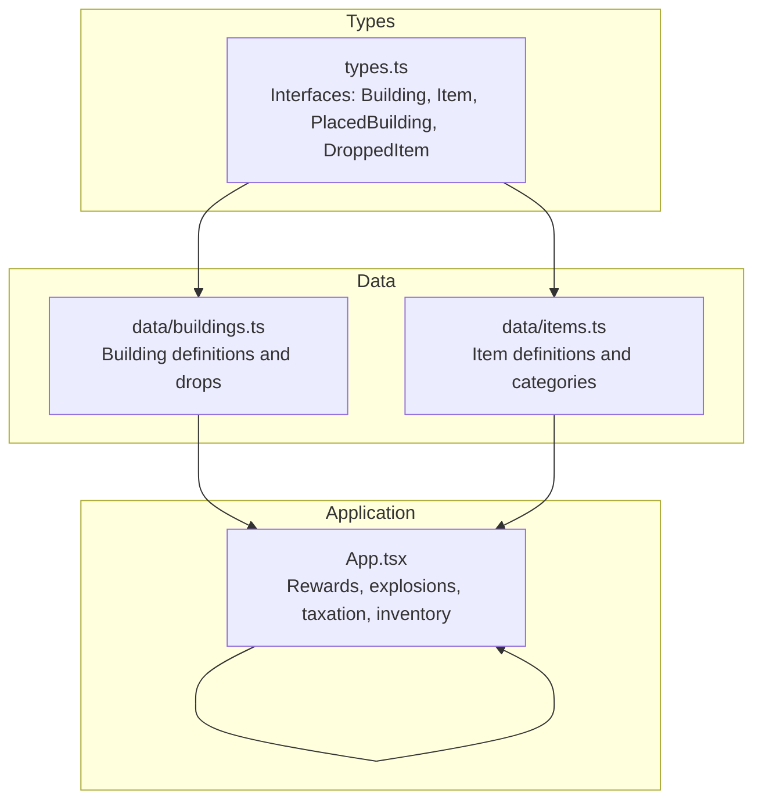
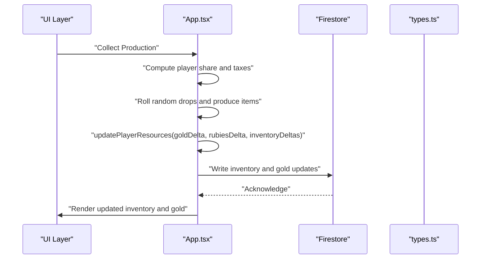
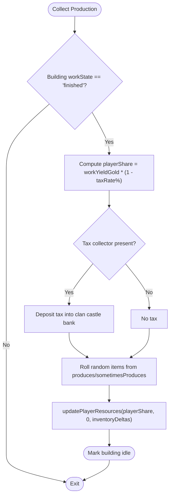
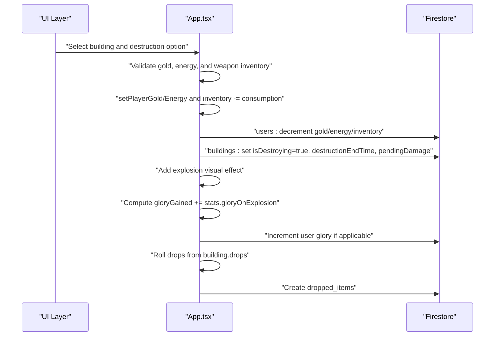
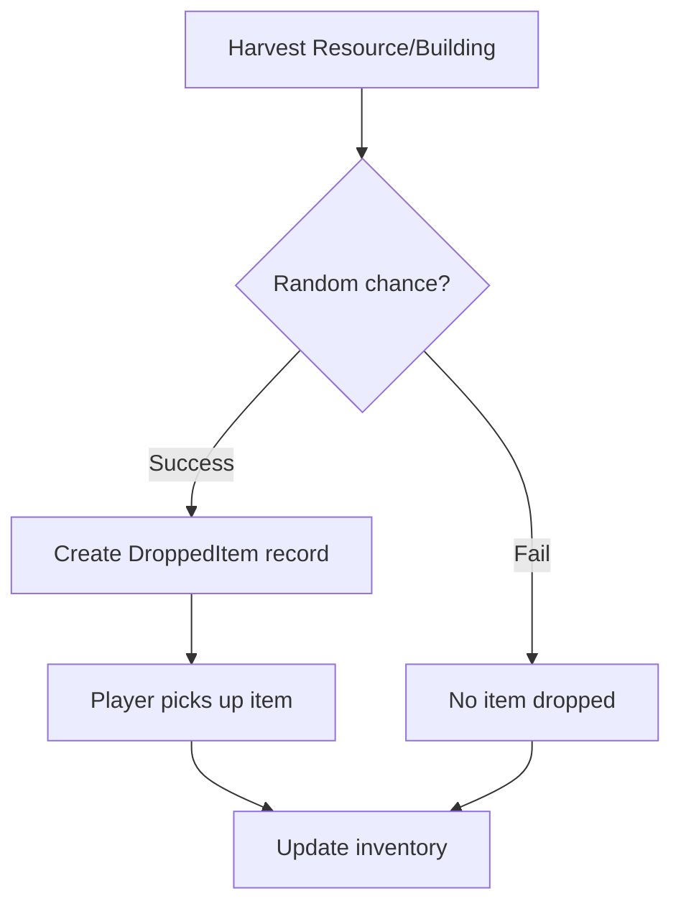
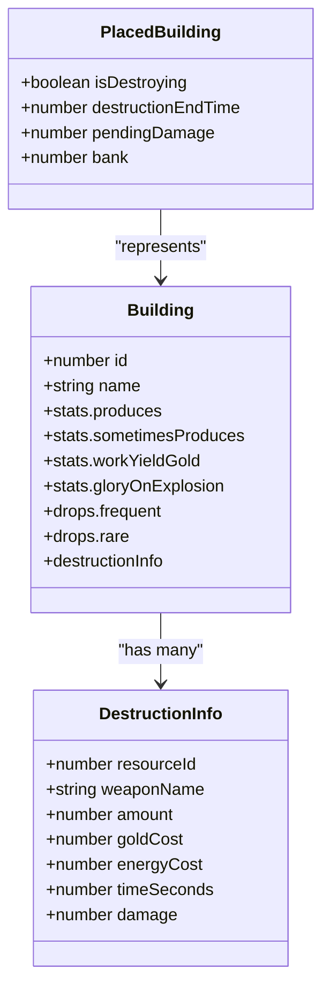
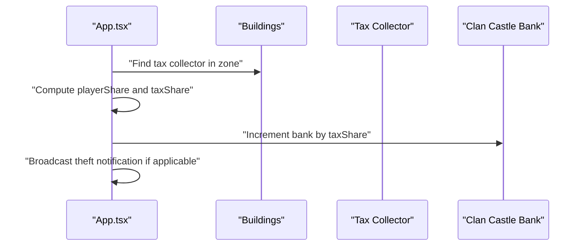
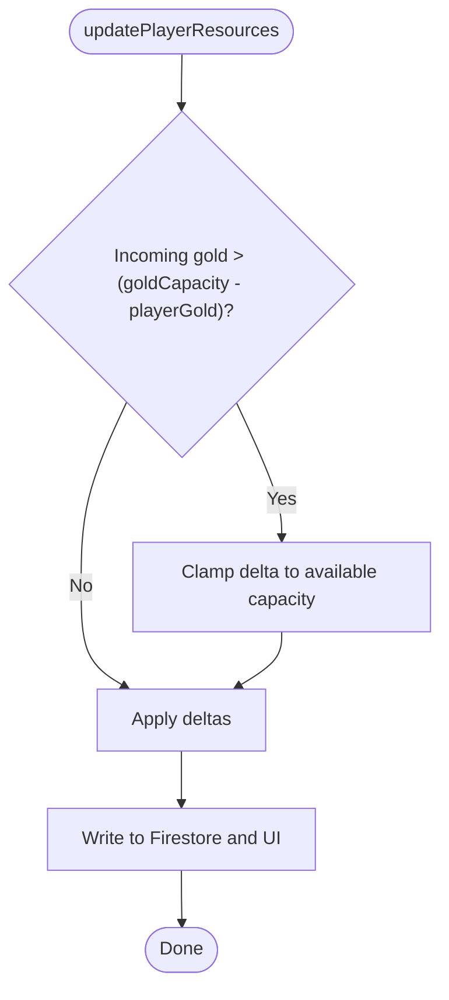
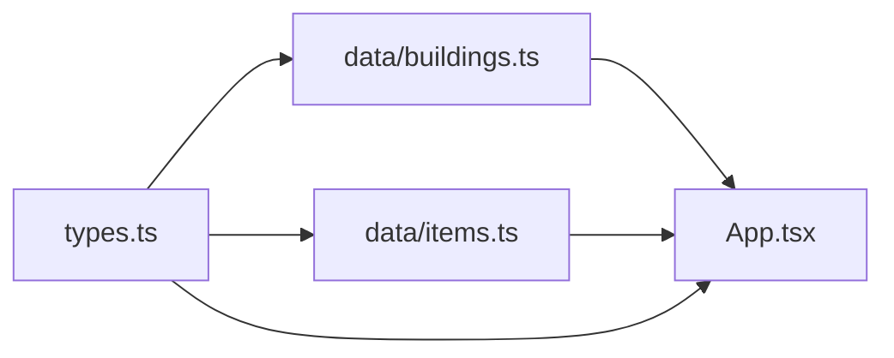

# Resource Rewards System

<cite>
**Referenced Files in This Document**
- [README.md](file://README.md)
- [types.ts](file://types.ts)
- [buildings.ts](file://data/buildings.ts)
- [items.ts](file://data/items.ts)
- [App.tsx](file://App.tsx)
- [index.tsx](file://index.tsx)
</cite>

## Table of Contents
1. [Introduction](#introduction)
2. [Project Structure](#project-structure)
3. [Core Components](#core-components)
4. [Architecture Overview](#architecture-overview)
5. [Detailed Component Analysis](#detailed-component-analysis)
6. [Dependency Analysis](#dependency-analysis)
7. [Performance Considerations](#performance-considerations)
8. [Troubleshooting Guide](#troubleshooting-guide)
9. [Conclusion](#conclusion)
10. [Appendices](#appendices)

## Introduction
This document explains the resource rewards system in the game, focusing on how players earn resources from combat actions, building destruction, and resource generation. It covers:
- Gold distribution and taxation mechanics
- Item looting from buildings and world resources
- Resource extraction from destroyed buildings
- Reward calculation formulas for percentage-based rewards, fixed amounts, and random bonus distributions
- Integration with the building system for destruction rewards, resource storage limits, and inventory management
- Relationship between combat outcomes and resource accumulation, including temporary bonuses, permanent gains, and resource decay mechanisms
- Practical guidance for reward synchronization across clients, preventing duplication, handling overflow conditions, and optimizing reward distribution performance

## Project Structure
The resource rewards system spans several modules:
- Types define the data contracts for buildings, items, and game entities
- Building definitions describe drops, production, and destruction costs
- Items define categories, production/consumption relationships, and rarity
- Application logic orchestrates rewards, explosions, taxation, and inventory updates

**Diagram sources**
- [types.ts:1-197](file://types.ts#L1-L197)
- [buildings.ts:1-800](file://data/buildings.ts#L1-L800)
- [items.ts:1-415](file://data/items.ts#L1-L415)
- [App.tsx:1646-1669](file://App.tsx#L1646-L1669)

**Section sources**
- [types.ts:1-197](file://types.ts#L1-L197)
- [buildings.ts:1-800](file://data/buildings.ts#L1-L800)
- [items.ts:1-415](file://data/items.ts#L1-L415)
- [App.tsx:1646-1669](file://App.tsx#L1646-L1669)

## Core Components
- Building model: Defines drops, production yields, destruction costs, and glory on explosion
- Item model: Defines categories, production/consumption links, and rarity
- Player resources: Gold, rubies, population, inventory, and capacity limits
- Reward pipeline: Collect production, apply taxation, roll random drops, and update inventory

Key interfaces and structures:
- Building: [types.ts:42-96](file://types.ts#L42-L96)
- Item: [types.ts:10-23](file://types.ts#L10-L23)
- PlacedBuilding: [types.ts:119-147](file://types.ts#L119-L147)
- DroppedItem: [types.ts:100-109](file://types.ts#L100-L109)
- DestructionInfo: [types.ts:25-33](file://types.ts#L25-L33)

**Section sources**
- [types.ts:10-147](file://types.ts#L10-L147)

## Architecture Overview
The reward pipeline integrates building production, destruction, and taxation with inventory and resource storage limits. The application coordinates Firestore updates and optimistic UI changes to maintain responsiveness and consistency.

**Diagram sources**
- [App.tsx:4727-4847](file://App.tsx#L4727-L4847)
- [App.tsx:1646-1669](file://App.tsx#L1646-L1669)
- [types.ts:100-147](file://types.ts#L100-L147)

## Detailed Component Analysis

### Building Production and Taxation
- Production: Buildings with workYieldGold grant gold; optional produces/sometimesProduces grant items
- Taxation: If a tax collector exists in the zone, a percentage is withheld and deposited into the clan castle bank
- Collection: Players can collect finished production, triggering inventory and gold updates

**Diagram sources**
- [App.tsx:4727-4847](file://App.tsx#L4727-L4847)
- [App.tsx:4900-5025](file://App.tsx#L4900-L5025)
- [types.ts:42-96](file://types.ts#L42-L96)

**Section sources**
- [App.tsx:4727-4847](file://App.tsx#L4727-L4847)
- [App.tsx:4900-5025](file://App.tsx#L4900-L5025)

### Building Destruction Rewards
- Destruction cost: Requires gold, energy, and a specific weapon item in inventory
- Pending damage: Sets building as destroying with a destructionEndTime
- Explosion effects: Visual effects and glory gain for initiators
- Drops: Random loot from building drops with chance thresholds

**Diagram sources**
- [App.tsx:5241-5324](file://App.tsx#L5241-L5324)
- [App.tsx:3546-3576](file://App.tsx#L3546-L3576)
- [types.ts:25-33](file://types.ts#L25-L33)

**Section sources**
- [App.tsx:5241-5324](file://App.tsx#L5241-L5324)
- [App.tsx:3546-3576](file://App.tsx#L3546-L3576)

### Item Looting Mechanics
- World resources: Trees, oil deposits, quarries, chests yield items when harvested
- Building drops: Buildings define frequent/rare drops with amounts and chances
- Dropped items: Created as items on the map with owner restrictions and timers

**Diagram sources**
- [App.tsx:1206-1238](file://App.tsx#L1206-L1238)
- [App.tsx:3557-3576](file://App.tsx#L3557-L3576)
- [types.ts:100-109](file://types.ts#L100-L109)

**Section sources**
- [App.tsx:1206-1238](file://App.tsx#L1206-L1238)
- [App.tsx:3557-3576](file://App.tsx#L3557-L3576)

### Resource Extraction from Destroyed Buildings
- DestructionInfo: Specifies weapon item, amount, goldCost, energyCost, and timeSeconds
- Pending damage: Used to compute destruction progress
- Bank integration: Tax collectors and clan castles receive taxes during production theft

**Diagram sources**
- [types.ts:42-96](file://types.ts#L42-L96)
- [types.ts:25-33](file://types.ts#L25-L33)
- [types.ts:119-147](file://types.ts#L119-L147)

**Section sources**
- [types.ts:42-96](file://types.ts#L42-L96)
- [types.ts:25-33](file://types.ts#L25-L33)
- [types.ts:119-147](file://types.ts#L119-L147)

### Reward Calculation Formulas
- Fixed gold yield: workYieldGold
- Percentage-based tax deduction: playerShare = floor(workYieldGold * (1 - taxRate/100))
- Random item drops: for each sometimesProduces entry, roll chance; if passed, add amount
- Building explosion glory: gloryGained += stats.gloryOnExplosion
- Destruction cost: consume gold, energy, and weapon item according to DestructionInfo

Examples from code:
- Production taxation: [App.tsx:4754-4757](file://App.tsx#L4754-L4757)
- Random item roll: [App.tsx:4785-4791](file://App.tsx#L4785-L4791)
- Explosion glory: [App.tsx:3554-3555](file://App.tsx#L3554-L3555)
- Destruction cost validation: [App.tsx:5254-5266](file://App.tsx#L5254-L5266)

**Section sources**
- [App.tsx:4754-4757](file://App.tsx#L4754-L4757)
- [App.tsx:4785-4791](file://App.tsx#L4785-L4791)
- [App.tsx:3554-3555](file://App.tsx#L3554-L3555)
- [App.tsx:5254-5266](file://App.tsx#L5254-L5266)

### Integration with Building System
- Tax collector detection: Watchtower or clan castle in the same zone
- Bank deposit: Taxes are incremented into the clan castle bank
- Theft notifications: Broadcasted messages when production is stolen
- Zone-based mechanics: Tax and theft checks use zone coordinates derived from building positions

**Diagram sources**
- [App.tsx:4745-4774](file://App.tsx#L4745-L4774)
- [App.tsx:4911-4932](file://App.tsx#L4911-L4932)

**Section sources**
- [App.tsx:4745-4774](file://App.tsx#L4745-L4774)
- [App.tsx:4911-4932](file://App.tsx#L4911-L4932)

### Inventory Management and Storage Limits
- updatePlayerResources enforces goldCapacity bounds for incoming gold
- Inventory deltas aggregated per production tick
- Rubies and population tracked separately; rubies used for acceleration and protection

**Diagram sources**
- [App.tsx:1646-1669](file://App.tsx#L1646-L1669)

**Section sources**
- [App.tsx:1646-1669](file://App.tsx#L1646-L1669)

### Relationship Between Combat Outcomes and Resource Accumulation
- Glory from explosions contributes to player progression
- Taxes from production theft feed the clan castle bank
- Temporary protection reduces vulnerability to theft and destruction
- Resource decay is implicit through capacity caps and taxation rather than explicit decay timers

**Section sources**
- [App.tsx:3554-3555](file://App.tsx#L3554-L3555)
- [App.tsx:4911-4932](file://App.tsx#L4911-L4932)

## Dependency Analysis
The reward system depends on:
- Building definitions for drops, production, and destruction
- Item definitions for categories and rarity
- Application logic for taxation, randomization, and Firestore updates

**Diagram sources**
- [buildings.ts:1-800](file://data/buildings.ts#L1-L800)
- [items.ts:1-415](file://data/items.ts#L1-L415)
- [types.ts:1-197](file://types.ts#L1-L197)
- [App.tsx:4727-4847](file://App.tsx#L4727-L4847)

**Section sources**
- [buildings.ts:1-800](file://data/buildings.ts#L1-L800)
- [items.ts:1-415](file://data/items.ts#L1-L415)
- [types.ts:1-197](file://types.ts#L1-L197)
- [App.tsx:4727-4847](file://App.tsx#L4727-L4847)

## Performance Considerations
- Optimistic UI updates: Immediate UI refresh before Firestore acknowledgment improves perceived performance
- Batch writes: Group related updates (e.g., user resources and building state) to minimize round trips
- Randomization offloading: Roll random drops and taxes on the client-side for immediate feedback
- Zone-based queries: Limit Firestore reads/writes to relevant zones to reduce load
- Visual effects: Keep effect lifecycles short to avoid excessive rendering overhead

## Troubleshooting Guide
Common issues and resolutions:
- Reward synchronization across clients
  - Use Firestore transactions or atomic increments for gold and inventory
  - Apply optimistic updates immediately, then reconcile on acknowledgment
  - Example references: [App.tsx:5275-5282](file://App.tsx#L5275-L5282), [App.tsx:4767-4773](file://App.tsx#L4767-L4773)
- Preventing resource duplication
  - Validate inventory and resource consumption before applying destruction
  - Example references: [App.tsx:5262-5266](file://App.tsx#L5262-L5266)
- Handling overflow conditions
  - Enforce goldCapacity bounds in updatePlayerResources
  - Example references: [App.tsx:1646-1669](file://App.tsx#L1646-L1669)
- Optimizing reward distribution performance
  - Aggregate inventory deltas per tick
  - Example references: [App.tsx:4778-4794](file://App.tsx#L4778-L4794)

**Section sources**
- [App.tsx:5275-5282](file://App.tsx#L5275-L5282)
- [App.tsx:4767-4773](file://App.tsx#L4767-L4773)
- [App.tsx:5262-5266](file://App.tsx#L5262-L5266)
- [App.tsx:1646-1669](file://App.tsx#L1646-L1669)
- [App.tsx:4778-4794](file://App.tsx#L4778-L4794)

## Conclusion
The resource rewards system combines deterministic production, percentage-based taxation, and probabilistic drops to create a balanced economy. By enforcing storage limits, using optimistic UI updates, and leveraging Firestore’s atomic operations, the system maintains fairness and performance. The modular design around types, data definitions, and application logic enables straightforward extension for new buildings, items, and reward mechanics.

## Appendices
- Data sources and models
  - Building definitions: [buildings.ts:1-800](file://data/buildings.ts#L1-L800)
  - Item definitions: [items.ts:1-415](file://data/items.ts#L1-L415)
  - Type contracts: [types.ts:1-197](file://types.ts#L1-L197)
- Entry point
  - Application bootstrap: [index.tsx:1-20](file://index.tsx#L1-L20)
  - Project overview: [README.md:1-21](file://README.md#L1-L21)