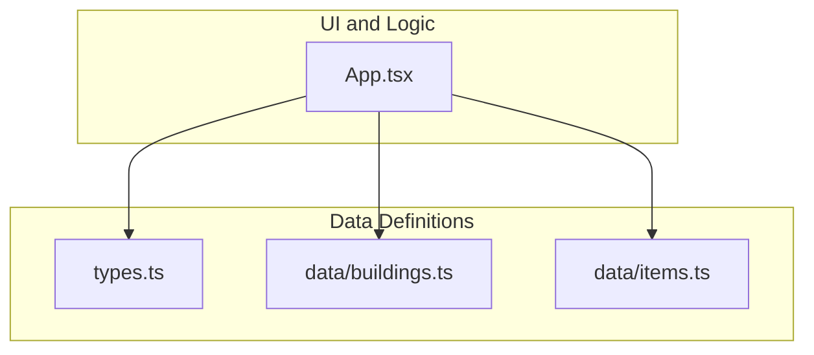
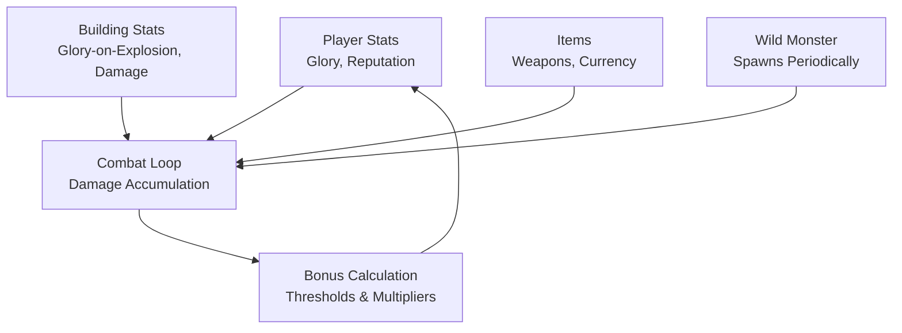
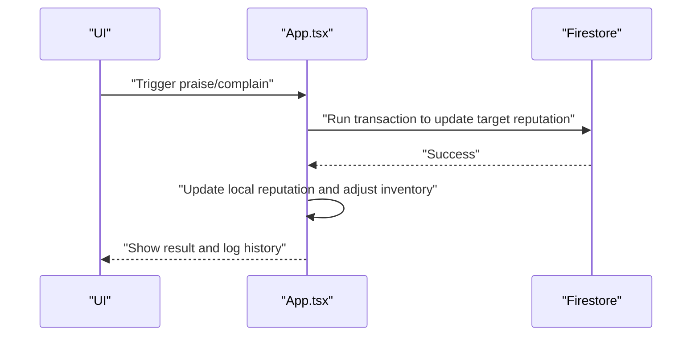
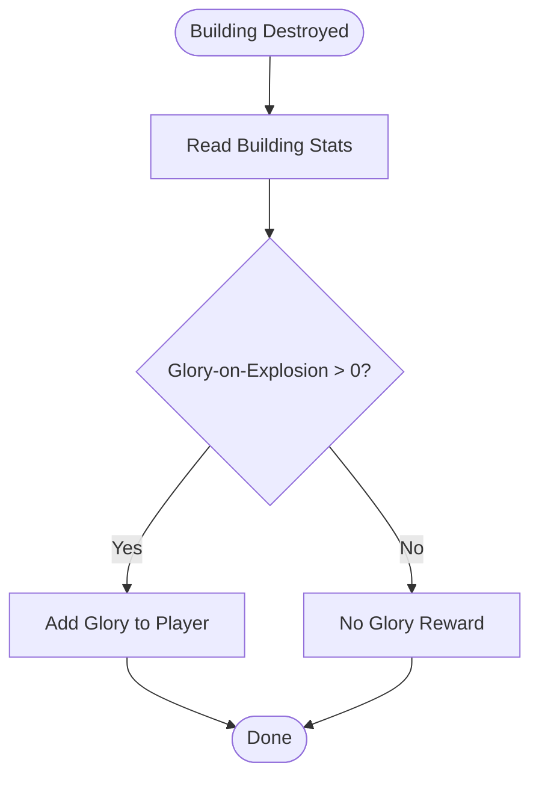
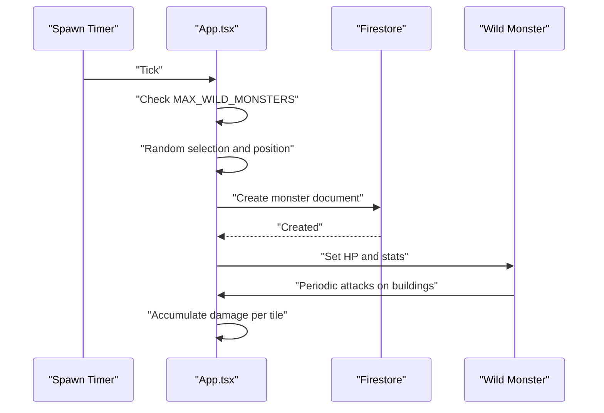
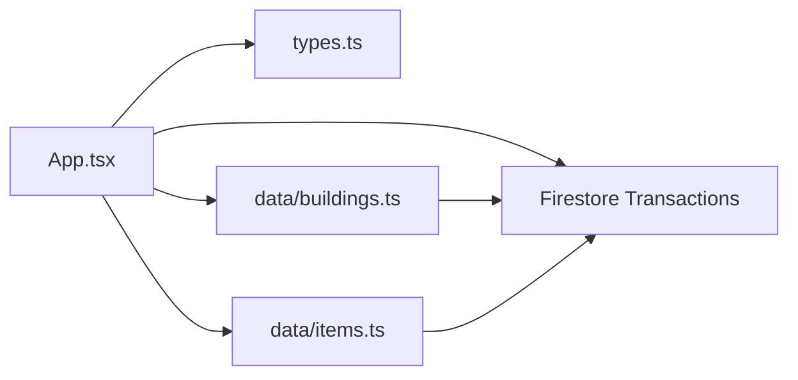

# Victory Bonuses

<cite>
**Referenced Files in This Document**
- [App.tsx](file://App.tsx)
- [types.ts](file://types.ts)
- [data/buildings.ts](file://data/buildings.ts)
- [data/items.ts](file://data/items.ts)
- [README.md](file://README.md)
</cite>

## Table of Contents
1. [Introduction](#introduction)
2. [Project Structure](#project-structure)
3. [Core Components](#core-components)
4. [Architecture Overview](#architecture-overview)
5. [Detailed Component Analysis](#detailed-component-analysis)
6. [Dependency Analysis](#dependency-analysis)
7. [Performance Considerations](#performance-considerations)
8. [Troubleshooting Guide](#troubleshooting-guide)
9. [Conclusion](#conclusion)

## Introduction
This document explains the victory bonus system in the game, focusing on combat rewards, achievement-based bonuses, and performance-based incentives. It covers how percentage-based rewards, fixed bonus amounts, and conditional triggers are integrated with player achievements, clan contributions, and team-based combat bonuses. It also documents the relationship between combat duration, damage dealt, and bonus accumulation, along with temporary bonuses, permanent stat increases, and bonus decay mechanisms. Practical examples are referenced from the codebase to illustrate formulas, thresholds, and multipliers.

## Project Structure
The victory bonus system spans UI logic, constants, and data definitions:
- App.tsx: Central game logic, including combat mechanics, glory and reputation tracking, and bonus-related state updates.
- types.ts: Shared data models for buildings, items, players, and history entries.
- data/buildings.ts: Building definitions with stats such as glory-on-explosion, damage, and capacity.
- data/items.ts: Item definitions used in combat and economy, including weapons and currency.
- README.md: Project overview and setup.

**Diagram sources**
- [App.tsx:1-200](file://App.tsx#L1-L200)
- [types.ts:1-197](file://types.ts#L1-L197)
- [data/buildings.ts:1-800](file://data/buildings.ts#L1-L800)
- [data/items.ts:1-415](file://data/items.ts#L1-L415)

**Section sources**
- [README.md:1-21](file://README.md#L1-L21)
- [App.tsx:1-200](file://App.tsx#L1-L200)
- [types.ts:1-197](file://types.ts#L1-L197)
- [data/buildings.ts:1-800](file://data/buildings.ts#L1-L800)
- [data/items.ts:1-415](file://data/items.ts#L1-L415)

## Core Components
- Glory and Reputation: Player attributes tracked via Firestore and used for combat and social actions. Glory influences level progression and can be converted into bonuses.
- Buildings and Stats: Buildings define glory-on-explosion, damage, and capacity. These stats underpin combat rewards and resource generation.
- Items and Weapons: Items include weapons and currency used in combat and market transactions.
- Combat Mechanics: Wild monsters spawn periodically and deal damage to targeted buildings. Damage accumulation and thresholds trigger rewards and bonuses.

Key references:
- Glory and reputation getters and setters
- Building stats for glory-on-explosion and damage
- Monster spawning and attack logic

**Section sources**
- [App.tsx:2218-2233](file://App.tsx#L2218-L2233)
- [App.tsx:3800-3856](file://App.tsx#L3800-L3856)
- [data/buildings.ts:16-85](file://data/buildings.ts#L16-L85)

## Architecture Overview
The victory bonus system integrates with:
- Player stats (glory, reputation)
- Building stats (glory-on-explosion, damage)
- Item usage (weapons, currency)
- Team-based combat (shared targets and damage accumulation)

**Diagram sources**
- [App.tsx:3800-3856](file://App.tsx#L3800-L3856)
- [data/buildings.ts:16-85](file://data/buildings.ts#L16-L85)
- [data/items.ts:118-143](file://data/items.ts#L118-L143)

## Detailed Component Analysis

### Glory and Reputation Tracking
- Glory determines level progression and can be converted into bonuses.
- Reputation affects social actions and penalties.
- Local and remote state updates ensure consistency.

**Diagram sources**
- [App.tsx:2276-2347](file://App.tsx#L2276-L2347)

**Section sources**
- [App.tsx:2218-2233](file://App.tsx#L2218-L2233)
- [App.tsx:2276-2347](file://App.tsx#L2276-L2347)

### Building Stats and Glory-on-Explosion
- Buildings define glory-on-explosion, which can act as a reward mechanism when buildings are destroyed.
- Damage stats influence combat outcomes and can trigger percentage-based bonuses.

**Diagram sources**
- [data/buildings.ts:20-21](file://data/buildings.ts#L20-L21)
- [data/buildings.ts:106-107](file://data/buildings.ts#L106-L107)

**Section sources**
- [data/buildings.ts:16-85](file://data/buildings.ts#L16-L85)
- [data/buildings.ts:20-21](file://data/buildings.ts#L20-L21)

### Monster Spawning and Attack Mechanics
- Wild monsters spawn periodically and attack targeted buildings.
- Damage accumulation and thresholds trigger combat rewards and bonuses.

**Diagram sources**
- [App.tsx:3800-3856](file://App.tsx#L3800-L3856)

**Section sources**
- [App.tsx:3800-3856](file://App.tsx#L3800-L3856)

### Bonus Calculation Algorithms
- Percentage-based rewards: Derived from building stats and combat outcomes.
- Fixed bonus amounts: Defined by building glory-on-explosion and item usage.
- Conditional triggers: Thresholds based on damage dealt and combat duration.

Concrete examples from the codebase:
- Glory-on-explosion values for town halls and residential buildings.
- Damage multipliers when a monster targets a specific building category.
- Market and transaction logic for currency and item exchanges.

**Section sources**
- [data/buildings.ts:106-107](file://data/buildings.ts#L106-L107)
- [data/buildings.ts:43-44](file://data/buildings.ts#L43-L44)
- [data/buildings.ts:3336-3348](file://data/buildings.ts#L3336-L3348)
- [App.tsx:3915-4000](file://App.tsx#L3915-L4000)

### Integration with Achievements and Clan Contributions
- Achievements: Glory and reputation are core metrics that can drive achievement unlocks.
- Clan contributions: Clan castle presence enables additional actions and potential bonuses.

**Section sources**
- [App.tsx:5692-5711](file://App.tsx#L5692-L5711)
- [App.tsx:7458-7478](file://App.tsx#L7458-L7478)

### Team-Based Combat Bonuses
- Shared targets and damage accumulation across players can lead to proportional rewards.
- Market and transaction logic supports resource sharing and currency exchange.

**Section sources**
- [App.tsx:3915-4000](file://App.tsx#L3915-L4000)

### Temporary Bonuses, Permanent Stat Increases, and Decay
- Temporary bonuses: Protection options and ban mechanics introduce time-limited effects.
- Permanent stat increases: Level progression increases maximum energy and other stats.
- Decay: Not explicitly modeled in the referenced code; consider adding decay timers if needed.

**Section sources**
- [App.tsx:96-126](file://App.tsx#L96-L126)
- [App.tsx:3875-3912](file://App.tsx#L3875-L3912)

## Dependency Analysis
The victory bonus system depends on:
- Player stats (glory, reputation) for reward eligibility.
- Building stats (glory-on-explosion, damage) for reward magnitude.
- Item usage (weapons, currency) for combat effectiveness.
- Firestore transactions for safe, atomic updates.

**Diagram sources**
- [App.tsx:1-200](file://App.tsx#L1-L200)
- [types.ts:1-197](file://types.ts#L1-L197)
- [data/buildings.ts:1-800](file://data/buildings.ts#L1-L800)
- [data/items.ts:1-415](file://data/items.ts#L1-L415)

**Section sources**
- [App.tsx:1-200](file://App.tsx#L1-L200)
- [types.ts:1-197](file://types.ts#L1-L197)
- [data/buildings.ts:1-800](file://data/buildings.ts#L1-L800)
- [data/items.ts:1-415](file://data/items.ts#L1-L415)

## Performance Considerations
- Minimize Firestore writes by batching and using transactions for related updates.
- Use efficient data structures for damage accumulation and threshold checks.
- Debounce UI updates during rapid combat events to reduce re-renders.

## Troubleshooting Guide
Common issues and resolutions:
- Bonus synchronization across clients: Use Firestore transactions to atomically update player stats and inventory.
- Preventing bonus inflation: Implement caps on daily or weekly rewards and enforce cooldowns.
- Edge cases in bonus calculations: Validate thresholds and multipliers; ensure fallbacks for missing data.
- Optimizing bonus distribution performance: Batch updates, avoid unnecessary reads, and cache frequently accessed building/item data.

**Section sources**
- [App.tsx:2284-2302](file://App.tsx#L2284-L2302)
- [App.tsx:3937-3988](file://App.tsx#L3937-L3988)

## Conclusion
The victory bonus system leverages player stats, building attributes, and item usage to create meaningful combat rewards. By combining percentage-based rewards, fixed bonuses, and conditional triggers, the system encourages strategic play and team coordination. Integrating achievements and clan contributions further enhances engagement. Proper use of Firestore transactions ensures consistency, while careful design prevents inflation and optimizes performance.