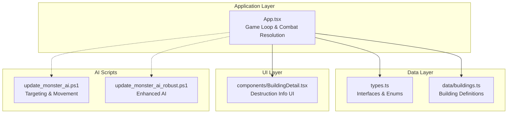
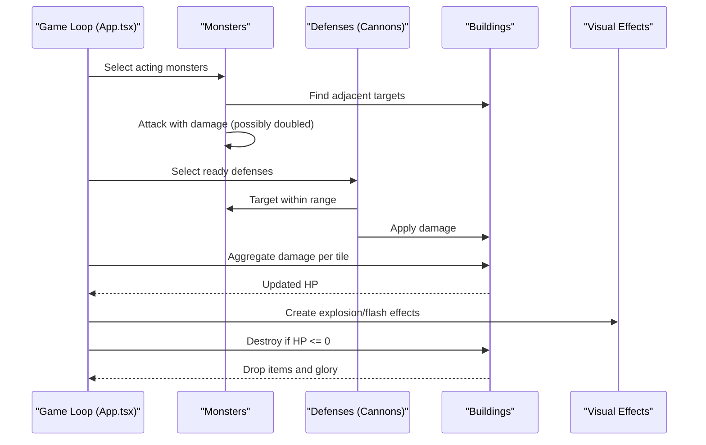
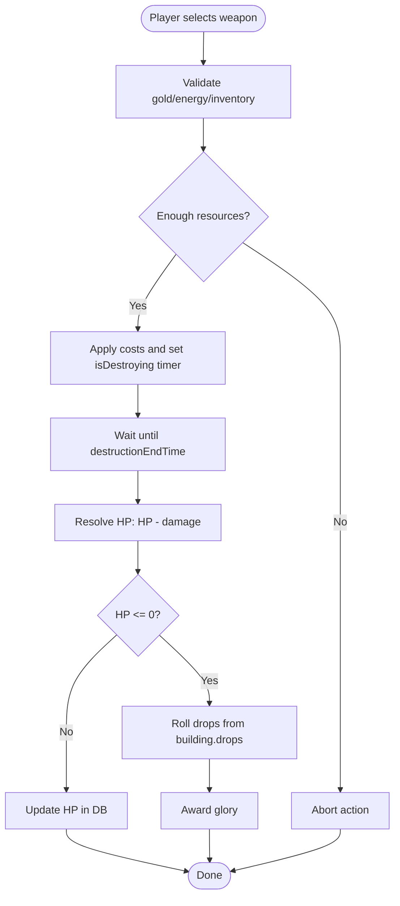
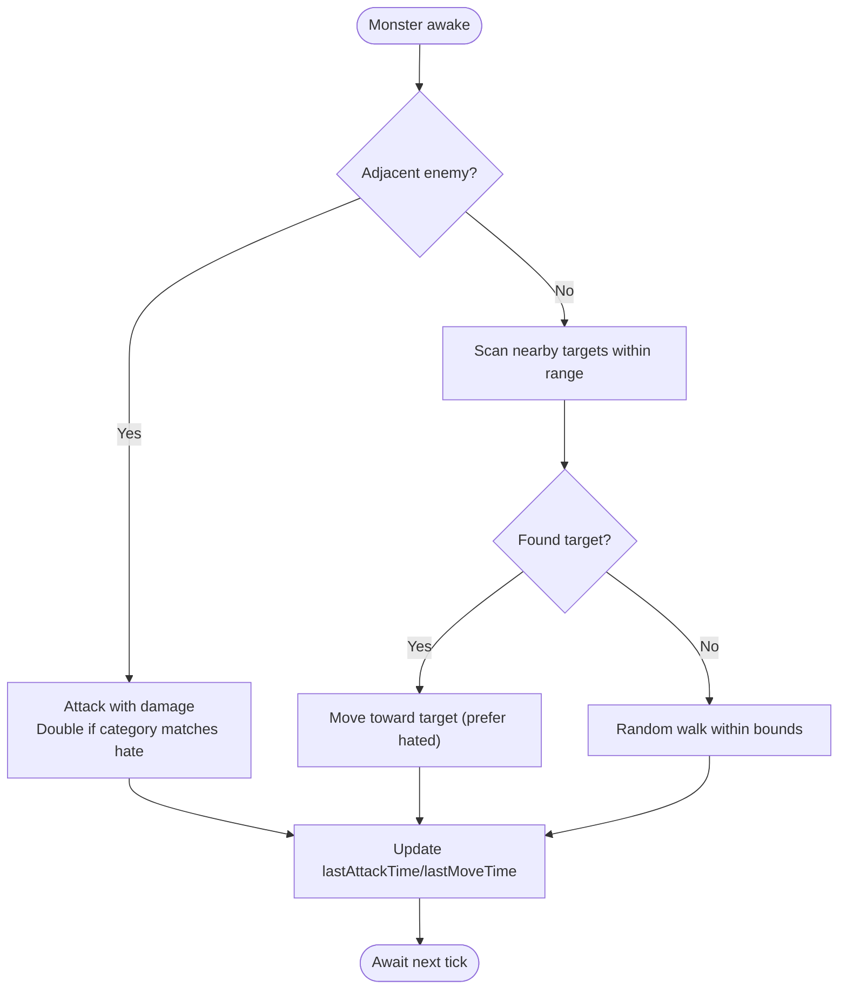
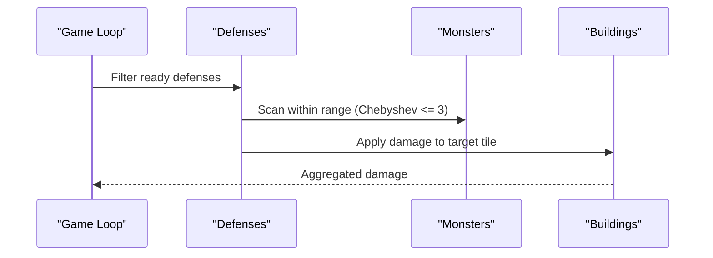
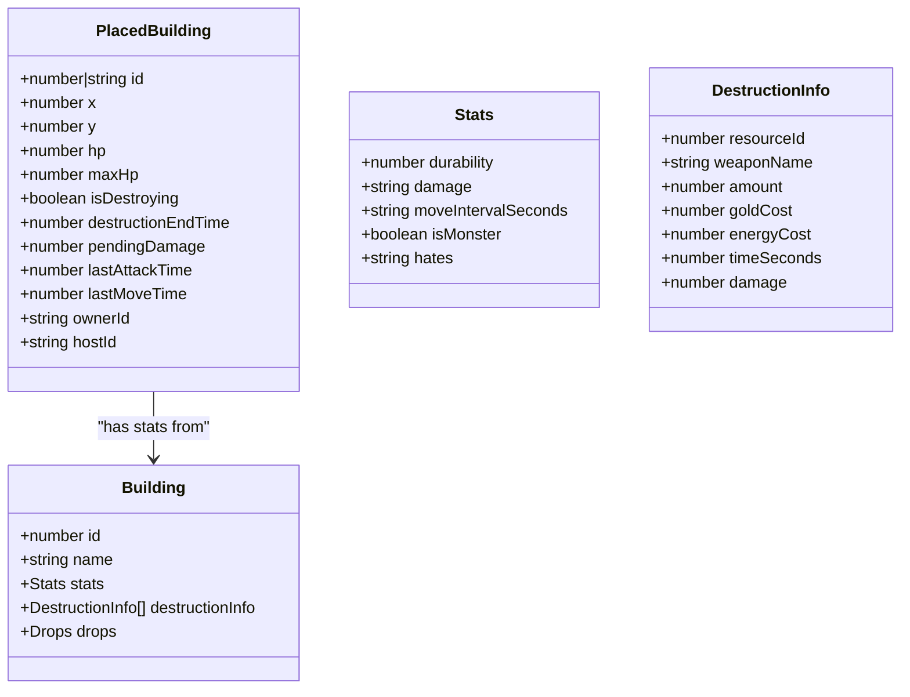
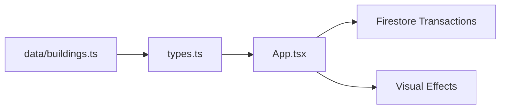

# Combat System

<cite>
**Referenced Files in This Document**
- [App.tsx](file://App.tsx)
- [types.ts](file://types.ts)
- [buildings.ts](file://data/buildings.ts)
- [BuildingDetail.tsx](file://components/BuildingDetail.tsx)
- [update_monster_ai.ps1](file://update_monster_ai.ps1)
- [update_monster_ai_robust.ps1](file://update_monster_ai_robust.ps1)
</cite>

## Table of Contents
1. [Introduction](#introduction)
2. [Project Structure](#project-structure)
3. [Core Components](#core-components)
4. [Architecture Overview](#architecture-overview)
5. [Detailed Component Analysis](#detailed-component-analysis)
6. [Dependency Analysis](#dependency-analysis)
7. [Performance Considerations](#performance-considerations)
8. [Troubleshooting Guide](#troubleshooting-guide)
9. [Conclusion](#conclusion)

## Introduction
This document explains the combat system mechanics implemented in the codebase, focusing on:
- Building destruction algorithms and resource loss calculations
- Monster AI behavior, targeting, and spawn mechanics
- Player interactions with combat actions (e.g., initiating destruction)
- Health management and combat resolution
- Integration with the building system for cascading effects and looting

The goal is to make the system understandable for beginners while providing sufficient technical depth for developers to implement or optimize combat mechanics.

## Project Structure
The combat system spans several files:
- Application loop and combat orchestration live in the main application file
- Data models define building stats, destruction info, and entity structures
- Building definitions enumerate destructible targets and their drop tables
- UI components surface destruction options and building details
- AI scripts refine monster targeting and movement logic

**Diagram sources**
- [App.tsx:3216-3627](file://App.tsx#L3216-L3627)
- [types.ts:25-147](file://types.ts#L25-L147)
- [buildings.ts:1-800](file://data/buildings.ts#L1-L800)
- [BuildingDetail.tsx:119-137](file://components/BuildingDetail.tsx#L119-L137)
- [update_monster_ai.ps1:23-108](file://update_monster_ai.ps1#L23-L108)
- [update_monster_ai_robust.ps1:67-87](file://update_monster_ai_robust.ps1#L67-L87)

**Section sources**
- [App.tsx:3216-3627](file://App.tsx#L3216-L3627)
- [types.ts:25-147](file://types.ts#L25-L147)
- [buildings.ts:1-800](file://data/buildings.ts#L1-L800)
- [BuildingDetail.tsx:119-137](file://components/BuildingDetail.tsx#L119-L137)
- [update_monster_ai.ps1:23-108](file://update_monster_ai.ps1#L23-L108)
- [update_monster_ai_robust.ps1:67-87](file://update_monster_ai_robust.ps1#L67-L87)

## Core Components
- PlacedBuilding: Entity representing buildings and monsters on the map, including health, ownership, and AI-related fields
- Building: Static definition of buildings with stats, destruction info, and drop tables
- DestructionInfo: Per-weapon parameters for destruction actions (costs, time, damage)
- VisualEffect: Temporary effects for explosions and flashes
- Game loop: Central tick that resolves monster AI, defense fire, and damage application

Key implementation references:
- PlacedBuilding and related fields: [types.ts:119-147](file://types.ts#L119-L147)
- Building and destructionInfo: [types.ts:42-96](file://types.ts#L42-L96), [buildings.ts:27-82](file://data/buildings.ts#L27-L82)
- Destruction initiation and timers: [App.tsx:5241-5313](file://App.tsx#L5241-L5313)
- Combat resolution loop: [App.tsx:3216-3627](file://App.tsx#L3216-L3627)

**Section sources**
- [types.ts:42-147](file://types.ts#L42-L147)
- [buildings.ts:27-82](file://data/buildings.ts#L27-L82)
- [App.tsx:5241-5313](file://App.tsx#L5241-L5313)
- [App.tsx:3216-3627](file://App.tsx#L3216-L3627)

## Architecture Overview
The combat system runs in a continuous game loop:
- Periodically evaluates eligible actors (monsters, defenses)
- Applies AI decisions (movement, targeting)
- Aggregates damage per tile
- Resolves destruction and looting
- Updates visuals and player state

**Diagram sources**
- [App.tsx:3295-3598](file://App.tsx#L3295-L3598)

**Section sources**
- [App.tsx:3295-3598](file://App.tsx#L3295-L3598)

## Detailed Component Analysis

### Building Destruction Mechanics
- Destruction initiation: Players select a building and a weapon option; the system deducts costs and sets a destruction timer
- Timer completion: The building’s HP is reduced by the configured damage; if HP reaches zero, the building is destroyed
- Looting: On destruction, the building’s drop table is evaluated probabilistically to spawn items
- Glory gain: Destroying a building grants glory proportional to its configured value

Concrete references:
- Initiation and timer setup: [App.tsx:5241-5313](file://App.tsx#L5241-L5313)
- Timer resolution and HP update: [App.tsx:3467-3525](file://App.tsx#L3467-L3525)
- Destruction and drops: [App.tsx:3527-3590](file://App.tsx#L3527-L3590)
- Glory reward: [App.tsx:3547-3556](file://App.tsx#L3547-L3556)
- Building definitions with destructionInfo: [buildings.ts:27-82](file://data/buildings.ts#L27-L82)
- UI for destruction options: [BuildingDetail.tsx:119-137](file://components/BuildingDetail.tsx#L119-L137)

**Diagram sources**
- [App.tsx:5241-5313](file://App.tsx#L5241-L5313)
- [App.tsx:3467-3525](file://App.tsx#L3467-L3525)
- [App.tsx:3527-3590](file://App.tsx#L3527-L3590)
- [buildings.ts:27-82](file://data/buildings.ts#L27-L82)

**Section sources**
- [App.tsx:5241-5313](file://App.tsx#L5241-L5313)
- [App.tsx:3467-3525](file://App.tsx#L3467-L3525)
- [App.tsx:3527-3590](file://App.tsx#L3527-L3590)
- [buildings.ts:27-82](file://data/buildings.ts#L27-L82)
- [BuildingDetail.tsx:119-137](file://components/BuildingDetail.tsx#L119-L137)

### Monster AI Behavior Patterns
- Host selection: Only one client hosts AI for neutral monsters; others ignore them
- Movement: If a target is adjacent, attack; otherwise, move toward targets within a small radius
- Targeting: Prefer targets in the monster’s hated category; otherwise choose any eligible neighbor
- Attack timing: Respect moveIntervalSeconds; apply doubled damage if target category matches hate

Concrete references:
- Host selection and acting monsters: [App.tsx:3234-3302](file://App.tsx#L3234-L3302)
- Targeting and damage scaling: [App.tsx:3317-3344](file://App.tsx#L3317-L3344)
- Movement logic and random move fallback: [App.tsx:3365-3398](file://App.tsx#L3365-L3398)
- AI script enhancements (seeker range, directional movement): [update_monster_ai.ps1:72-108](file://update_monster_ai.ps1#L72-L108), [update_monster_ai_robust.ps1:67-87](file://update_monster_ai_robust.ps1#L67-L87)

**Diagram sources**
- [App.tsx:3317-3398](file://App.tsx#L3317-L3398)
- [update_monster_ai.ps1:23-108](file://update_monster_ai.ps1#L23-L108)
- [update_monster_ai_robust.ps1:67-87](file://update_monster_ai_robust.ps1#L67-L87)

**Section sources**
- [App.tsx:3234-3398](file://App.tsx#L3234-L3398)
- [update_monster_ai.ps1:23-108](file://update_monster_ai.ps1#L23-L108)
- [update_monster_ai_robust.ps1:67-87](file://update_monster_ai_robust.ps1#L67-L87)

### Defense Fire Mechanics (Cannons)
- Eligibility: Only owned defenses can fire; ignore constructing or destroying buildings
- Cooldown: Enforced globally; lastAttackTime determines readiness
- Range: Chebyshev distance within 3 tiles
- Targeting: Choose nearest valid monster outside the owner’s faction
- Damage: Additive per defense; applied to target tile

Concrete references:
- Defense selection and cooldown: [App.tsx:3258-3281](file://App.tsx#L3258-L3281)
- Range and targeting logic: [App.tsx:3420-3446](file://App.tsx#L3420-L3446)
- Damage aggregation and updates: [App.tsx:3434-3446](file://App.tsx#L3434-L3446)

**Diagram sources**
- [App.tsx:3258-3446](file://App.tsx#L3258-L3446)

**Section sources**
- [App.tsx:3258-3446](file://App.tsx#L3258-L3446)

### Health Management and Combat Resolution
- Health tracking: Each building maintains hp/maxHp; defaults to durability from its definition
- Damage application: Summarized per tile; flash effects indicate recent hits
- Destruction: When HP <= 0, remove the building, spawn drops, and award glory
- Visual feedback: Explosions and flashes are rendered and cleaned up after duration

Concrete references:
- HP initialization and updates: [App.tsx:3508-3525](file://App.tsx#L3508-L3525)
- Destruction and drops: [App.tsx:3527-3590](file://App.tsx#L3527-L3590)
- Visual effects lifecycle: [App.tsx:3604-3620](file://App.tsx#L3604-L3620)

**Diagram sources**
- [types.ts:119-147](file://types.ts#L119-L147)
- [types.ts:42-96](file://types.ts#L42-L96)

**Section sources**
- [App.tsx:3508-3590](file://App.tsx#L3508-L3590)
- [types.ts:42-147](file://types.ts#L42-L147)

### Integration with Building System and Cascading Effects
- Occupancy checks: Both buildings and map resources block movement and placement
- Zone-awareness: Zone IDs assist in spatial queries and effects
- Cascade-friendly design: Damage is aggregated per tile, enabling multiple concurrent attackers

Concrete references:
- Occupancy and movement: [App.tsx:421-431](file://App.tsx#L421-L431), [App.tsx:3365-3398](file://App.tsx#L3365-L3398)
- Zone ID usage: [App.tsx:46-46](file://App.tsx#L46-L46), [App.tsx:3842](file://App.tsx#L3842-L3842)

**Section sources**
- [App.tsx:421-431](file://App.tsx#L421-L431)
- [App.tsx:3365-3398](file://App.tsx#L3365-L3398)
- [App.tsx:46-46](file://App.tsx#L46-L46)

### Resource Loss Calculations and Loot Distribution
- Destruction costs: Gold, energy, and item consumption are deducted before starting the timer
- Drop tables: Frequent and rare drops are rolled independently with chances
- Glory rewards: Based on building stats.gloryOnExplosion

Concrete references:
- Cost deduction and timer: [App.tsx:5268-5313](file://App.tsx#L5268-L5313)
- Drop rolling and spawning: [App.tsx:3557-3587](file://App.tsx#L3557-L3587)
- Glory award: [App.tsx:3547-3556](file://App.tsx#L3547-L3556)

**Section sources**
- [App.tsx:5268-5313](file://App.tsx#L5268-L5313)
- [App.tsx:3557-3587](file://App.tsx#L3557-L3587)
- [App.tsx:3547-3556](file://App.tsx#L3547-L3556)

### Player Interactions and UI
- Destruction menu: Displays available weapons with costs and damage
- Protection checks: Prevents destruction if under protection
- History logging: Records destruction actions for transparency

Concrete references:
- Destruction UI and logic: [BuildingDetail.tsx:119-137](file://components/BuildingDetail.tsx#L119-L137)
- Protection checks and alerts: [App.tsx:5249-5252](file://App.tsx#L5249-L5252)
- History logs: [App.tsx:5284](file://App.tsx#L5284)

**Section sources**
- [BuildingDetail.tsx:119-137](file://components/BuildingDetail.tsx#L119-L137)
- [App.tsx:5249-5252](file://App.tsx#L5249-L5252)
- [App.tsx:5284](file://App.tsx#L5284)

## Dependency Analysis
The combat system depends on:
- Building definitions for stats and destruction parameters
- PlacedBuilding state for runtime HP and ownership
- Firestore transactions for atomic updates across clients
- Visual effects for feedback

**Diagram sources**
- [buildings.ts:1-800](file://data/buildings.ts#L1-L800)
- [types.ts:42-147](file://types.ts#L42-L147)
- [App.tsx:3216-3627](file://App.tsx#L3216-L3627)

**Section sources**
- [buildings.ts:1-800](file://data/buildings.ts#L1-L800)
- [types.ts:42-147](file://types.ts#L42-L147)
- [App.tsx:3216-3627](file://App.tsx#L3216-L3627)

## Performance Considerations
- Batch updates: The game loop consolidates state changes and applies them once per tick to minimize database writes
- Ref-based caches: Use refs for building lists and user state to avoid unnecessary re-renders and expensive recomputations
- Spatial checks: Precompute occupied positions to speed up movement and targeting
- Effect cleanup: Remove expired visual effects to keep memory bounded

Practical tips:
- Keep the number of concurrent attackers reasonable to avoid excessive damage aggregation
- Use throttled camera-based zone subscriptions to reduce snapshot churn
- Prefer additive damage maps keyed by tile coordinates for O(1) updates

[No sources needed since this section provides general guidance]

## Troubleshooting Guide
Common issues and resolutions:
- Stuck construction timers: The loop auto-finalizes construction when the timer elapses, regardless of ownership
  - Reference: [App.tsx:3487-3496](file://App.tsx#L3487-L3496)
- Future-dated lastAttackTime: Defensive cooldown logic accounts for clock drift
  - Reference: [App.tsx:3279-3281](file://App.tsx#L3279-L3281)
- Missing or insufficient permissions: Game loop ignores expected Firestore errors to prevent noisy logs
  - Reference: [App.tsx:27-33](file://App.tsx#L27-L33)
- Monster AI not moving: Ensure the host selection logic is satisfied and that the monster is not constructing/destroying
  - Reference: [App.tsx:3234-3256](file://App.tsx#L3234-L3256)

**Section sources**
- [App.tsx:3487-3496](file://App.tsx#L3487-L3496)
- [App.tsx:3279-3281](file://App.tsx#L3279-L3281)
- [App.tsx:27-33](file://App.tsx#L27-L33)
- [App.tsx:3234-3256](file://App.tsx#L3234-L3256)

## Conclusion
The combat system integrates destruction mechanics, monster AI, and defensive capabilities into a single game loop. It emphasizes:
- Clear separation of concerns (definitions, runtime state, UI, AI)
- Robust state synchronization via Firestore
- Scalable performance through batching and ref caching
- Transparent feedback via visual effects and history logs

This foundation supports further enhancements such as balancing AI difficulty, optimizing large-scale battles, and refining loot distribution.