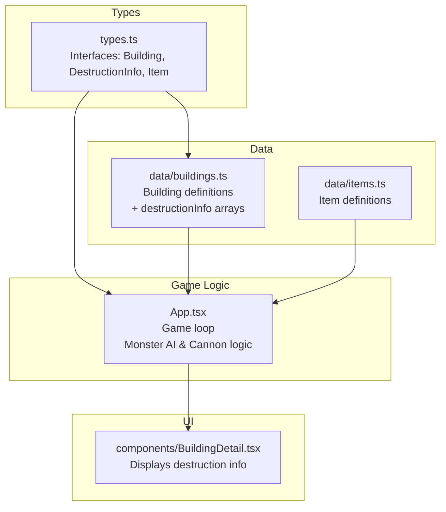
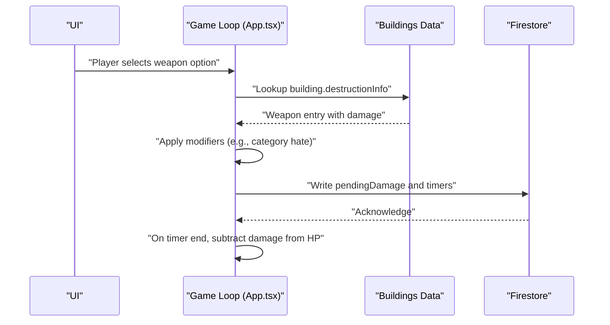
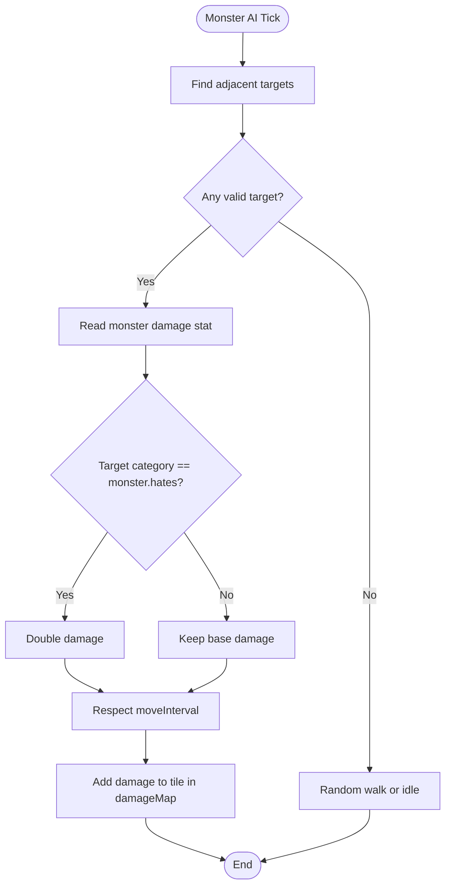
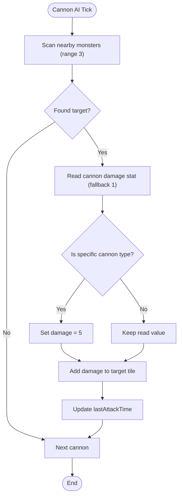
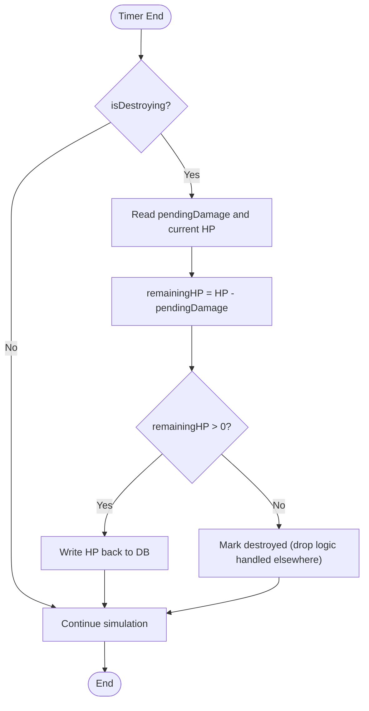
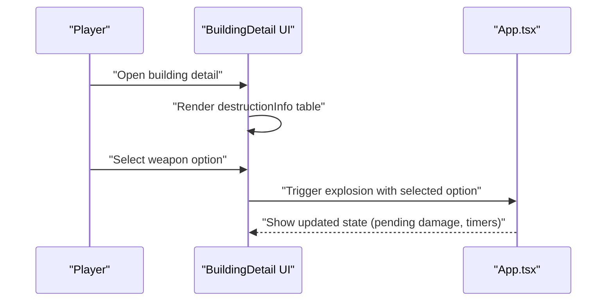
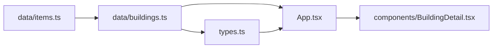

# Damage Calculation System

<cite>
**Referenced Files in This Document**
- [types.ts](file://types.ts)
- [data/buildings.ts](file://data/buildings.ts)
- [data/items.ts](file://data/items.ts)
- [App.tsx](file://App.tsx)
- [components/BuildingDetail.tsx](file://components/BuildingDetail.tsx)
</cite>

## Table of Contents
1. [Introduction](#introduction)
2. [Project Structure](#project-structure)
3. [Core Components](#core-components)
4. [Architecture Overview](#architecture-overview)
5. [Detailed Component Analysis](#detailed-component-analysis)
6. [Dependency Analysis](#dependency-analysis)
7. [Performance Considerations](#performance-considerations)
8. [Troubleshooting Guide](#troubleshooting-guide)
9. [Conclusion](#conclusion)

## Introduction
This document explains the damage calculation system implemented in the codebase. It focuses on how damage is computed for two primary combat contexts:
- Monster attacks against buildings
- Defensive cannons attacking monsters

It also documents how weapon types and their associated stats influence damage outcomes, how building categories and attributes affect vulnerability, and how the system integrates with items and building definitions. The goal is to make the math and mechanics understandable for beginners while providing sufficient technical depth for developers to implement or extend combat calculations.

## Project Structure
The damage system spans several files:
- Type definitions describe the shape of buildings, items, and related structures.
- Building definitions include weapon-to-damage mappings used during destruction actions.
- Game logic computes real-time damage during the game loop for monsters and cannons.
- UI components surface weapon and damage information to players.

**Diagram sources**
- [types.ts:1-197](file://types.ts#L1-L197)
- [data/buildings.ts:1-200](file://data/buildings.ts#L1-L200)
- [data/items.ts:1-200](file://data/items.ts#L1-L200)
- [App.tsx:3300-3499](file://App.tsx#L3300-L3499)
- [components/BuildingDetail.tsx:119-150](file://components/BuildingDetail.tsx#L119-L150)

**Section sources**
- [types.ts:1-197](file://types.ts#L1-L197)
- [data/buildings.ts:1-200](file://data/buildings.ts#L1-L200)
- [data/items.ts:1-200](file://data/items.ts#L1-L200)
- [App.tsx:3300-3499](file://App.tsx#L3300-L3499)
- [components/BuildingDetail.tsx:119-150](file://components/BuildingDetail.tsx#L119-L150)

## Core Components
- Building and DestructionInfo interfaces define how weapon entries map to damage values during destruction actions.
- Building definitions include a destructionInfo array per building, enumerating available weapons, costs, and damage values.
- Game loop logic computes damage for:
  - Monsters attacking adjacent buildings, applying category-based multipliers.
  - Cannons targeting monsters within range, using base stats and hardcoded values.
- UI displays weapon and damage details for player selection.

Key implementation anchors:
- Damage application for monsters and cannons uses a shared damage map keyed by tile coordinates.
- Cannon damage reads from building stats with a fallback and a special-case override.
- Monster damage reads from building stats with a category-based multiplier.

**Section sources**
- [types.ts:25-33](file://types.ts#L25-L33)
- [data/buildings.ts:27-82](file://data/buildings.ts#L27-L82)
- [App.tsx:3332-3344](file://App.tsx#L3332-L3344)
- [App.tsx:3412-3446](file://App.tsx#L3412-L3446)

## Architecture Overview
The damage system operates in two stages:
1. Data-driven weapon-to-damage mapping from building definitions.
2. Real-time game-loop computation that applies modifiers and updates building HP.

**Diagram sources**
- [App.tsx:3448-3486](file://App.tsx#L3448-L3486)
- [data/buildings.ts:27-82](file://data/buildings.ts#L27-L82)

## Detailed Component Analysis

### Damage Types and Mechanics
- Physical damage is the dominant type in the current implementation. It is applied as raw HP reduction when a building is destroyed or when a cannon hits a monster.
- No explicit magical or explosive damage types are modeled in the examined code. The weapon list includes items like firecrackers, garden bombs, and atomic bombs, but their effect is represented as a single numeric damage value in the building definitions.

Implications:
- The system treats all destructive actions as a single physical damage value.
- There is no separate resistance or mitigation system for different damage types in the examined code.

**Section sources**
- [data/buildings.ts:27-82](file://data/buildings.ts#L27-L82)
- [data/items.ts:118-188](file://data/items.ts#L118-L188)

### Weapon Types and Their Influence on Damage
Weapons are defined as items and linked to buildings via destructionInfo. Each weapon entry specifies:
- resourceId (item identifier)
- weaponName
- amount (quantity consumed)
- goldCost and energyCost (resource costs)
- timeSeconds (destruction duration)
- damage (direct damage value)

Examples from the codebase:
- Low-tier: firecracker-like items deal small damage values.
- Mid-tier: garden bombs and guided missiles deal moderate damage.
- High-tier: super bombs and atomic weapons deal large damage values.

These values are directly used by the game loop to compute damage outcomes.

**Section sources**
- [data/buildings.ts:27-82](file://data/buildings.ts#L27-L82)
- [data/buildings.ts:351-4368](file://data/buildings.ts#L351-L4368)
- [data/items.ts:118-188](file://data/items.ts#L118-L188)

### Monster Attacks Against Buildings
Mechanics:
- Monsters attack adjacent buildings if they are not constructing/destroying and not owned by the same player.
- Base damage is taken from the monster’s building definition stats.
- If the monster “hates” the building’s category, damage is doubled.
- Attack timing respects the monster’s move interval.

**Diagram sources**
- [App.tsx:3308-3399](file://App.tsx#L3308-L3399)

**Section sources**
- [App.tsx:3308-3399](file://App.tsx#L3308-L3399)

### Defensive Cannons Attacking Monsters
Mechanics:
- Cannons scan for monsters within Chebyshev distance 3.
- Base damage is read from the cannon’s building stats with a fallback value.
- A special-case adjustment overrides the base damage for a specific cannon type.
- On successful hit, damage is added to the target tile and the cannon’s lastAttackTime is updated.

**Diagram sources**
- [App.tsx:3412-3446](file://App.tsx#L3412-L3446)

**Section sources**
- [App.tsx:3412-3446](file://App.tsx#L3412-L3446)

### Building Durability and Destruction Timers
When a building is marked for destruction:
- pendingDamage is subtracted from current HP when the destruction timer ends.
- If HP remains above zero, the building persists; otherwise, it is destroyed.

**Diagram sources**
- [App.tsx:3467-3486](file://App.tsx#L3467-L3486)

**Section sources**
- [App.tsx:3467-3486](file://App.tsx#L3467-L3486)

### UI Integration and Player Feedback
The UI surfaces weapon and damage information for player selection:
- The Building Detail component lists weapon options, quantities, durations, and damage values.
- The explosion action button displays energy cost, time, and damage for the selected weapon option.

**Diagram sources**
- [components/BuildingDetail.tsx:119-150](file://components/BuildingDetail.tsx#L119-L150)
- [App.tsx:6389-6402](file://App.tsx#L6389-L6402)

**Section sources**
- [components/BuildingDetail.tsx:119-150](file://components/BuildingDetail.tsx#L119-L150)
- [App.tsx:6389-6402](file://App.tsx#L6389-L6402)

## Dependency Analysis
The damage system depends on:
- Building definitions for base stats and weapon mappings.
- Items for weapon identification and categorization.
- Game loop for real-time computations and state updates.

**Diagram sources**
- [data/items.ts:1-200](file://data/items.ts#L1-L200)
- [data/buildings.ts:1-200](file://data/buildings.ts#L1-L200)
- [types.ts:1-197](file://types.ts#L1-L197)
- [App.tsx:3300-3499](file://App.tsx#L3300-L3499)
- [components/BuildingDetail.tsx:119-150](file://components/BuildingDetail.tsx#L119-L150)

**Section sources**
- [data/items.ts:1-200](file://data/items.ts#L1-L200)
- [data/buildings.ts:1-200](file://data/buildings.ts#L1-L200)
- [types.ts:1-197](file://types.ts#L1-L197)
- [App.tsx:3300-3499](file://App.tsx#L3300-L3499)
- [components/BuildingDetail.tsx:119-150](file://components/BuildingDetail.tsx#L119-L150)

## Performance Considerations
- Tile-keyed damage accumulation: Using coordinate strings as keys avoids repeated object allocations and enables efficient aggregation across multiple attackers.
- Minimal branching: The damage computation branches are simple and constant-time, minimizing overhead.
- Range checks: Cannon targeting uses Chebyshev distance, which is fast and suitable for real-time loops.
- Batched writes: Updates to Firestore are performed per entity, reducing contention and enabling eventual consistency.

Recommendations:
- Prefer integer arithmetic for damage values to avoid floating-point overhead.
- Cache frequently accessed building stats (e.g., damage, moveIntervalSeconds) to reduce lookups.
- Limit the number of concurrent attackers per tick to maintain smooth performance.

[No sources needed since this section provides general guidance]

## Troubleshooting Guide
Common issues and remedies:
- Missing or insufficient permissions errors during Firestore updates are ignored in the game loop to prevent noisy failures during expected races. This is handled by a dedicated error handler that filters benign errors.
- Construction timers may stall if the owner is offline; the code allows any observer to finalize construction when the timer elapses, preventing indefinite stuck states.
- Damage not applying: Verify that the building is marked as destroying and that the destruction timer has elapsed so pendingDamage is subtracted from HP.

**Section sources**
- [App.tsx:27-33](file://App.tsx#L27-L33)
- [App.tsx:3487-3498](file://App.tsx#L3487-L3498)
- [App.tsx:3467-3486](file://App.tsx#L3467-L3486)

## Conclusion
The damage calculation system centers on straightforward, data-driven mechanics:
- Weapons are defined with explicit damage values and used to compute destruction outcomes.
- Real-time combat applies base damage with simple modifiers (e.g., category-based multipliers) and updates building HP via timers.
- The system is optimized for simplicity and performance, relying on tile-keyed aggregations and minimal branching.

Future enhancements could introduce:
- Separate damage types with resistances and mitigation.
- Critical hit mechanics and scaling with player stats or equipment.
- Overflow protection and precision handling for very large damage values.
- Centralized damage formula functions for reuse and testing.

[No sources needed since this section summarizes without analyzing specific files]