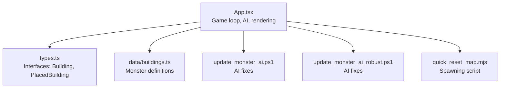
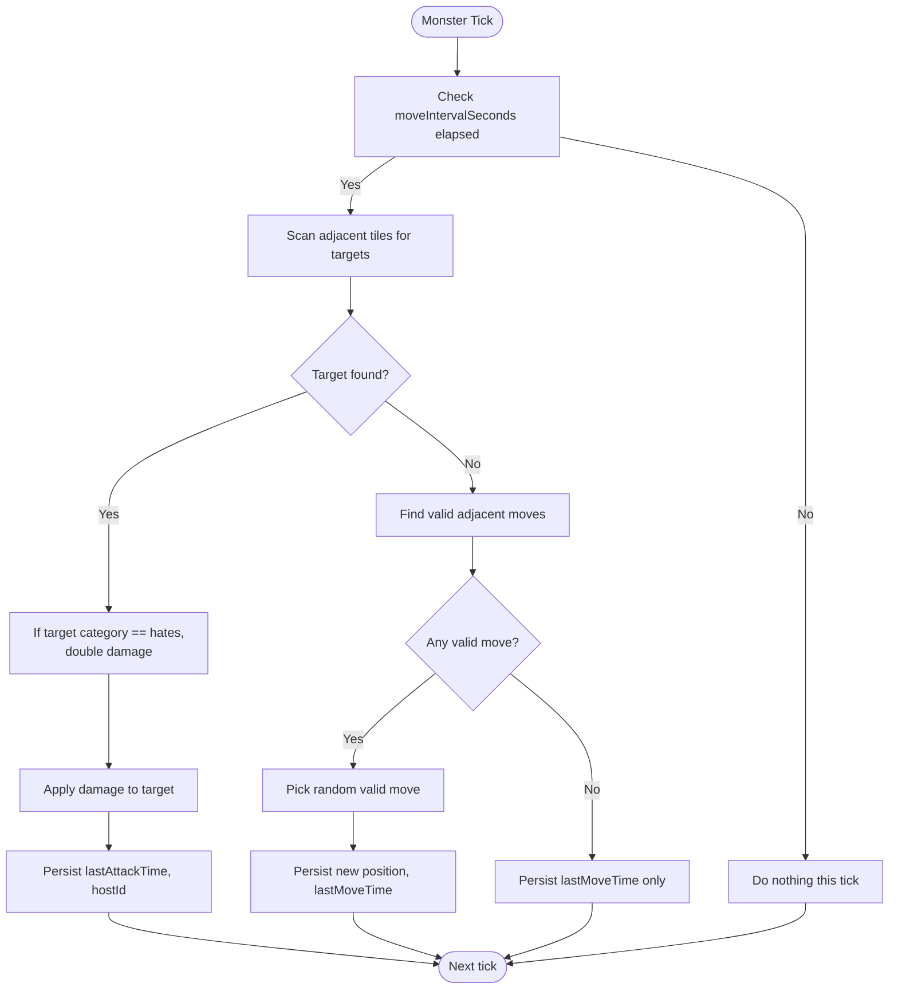
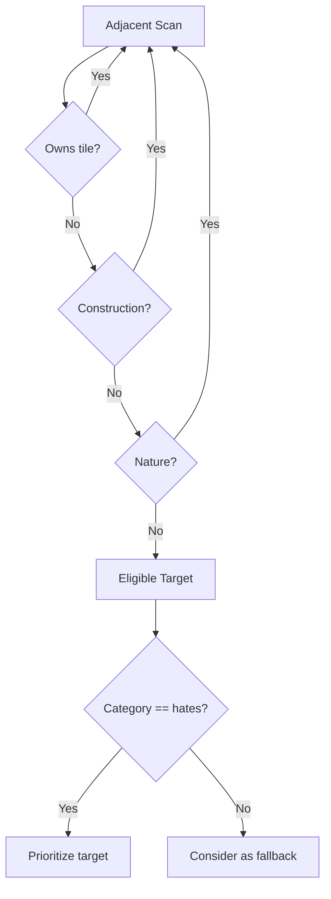
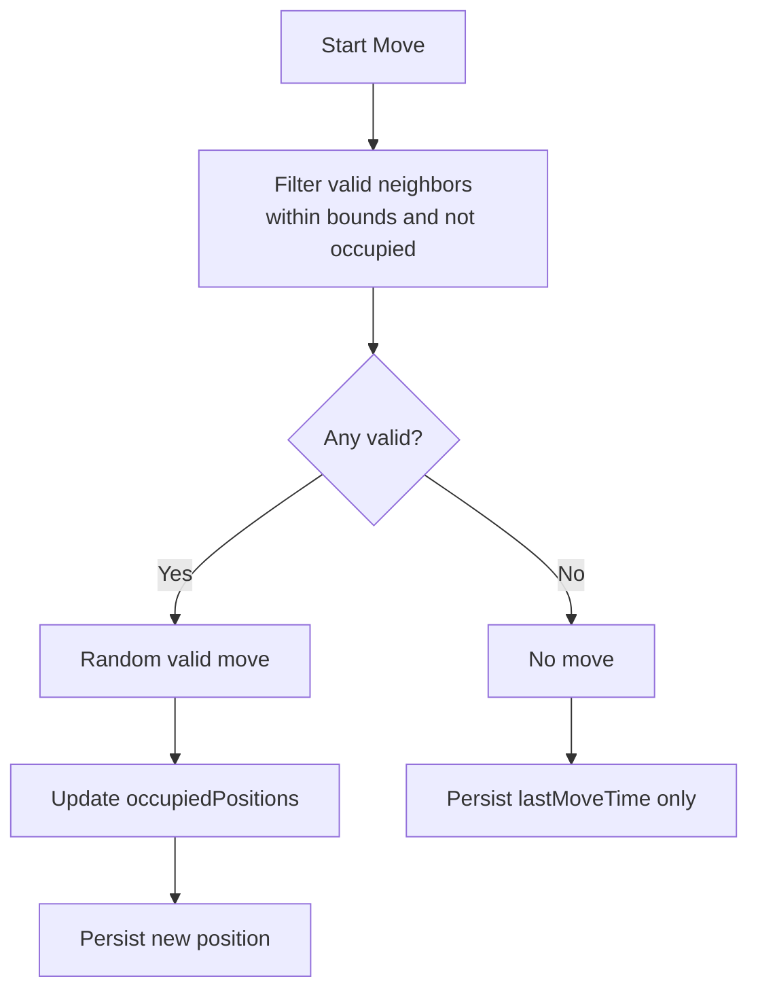
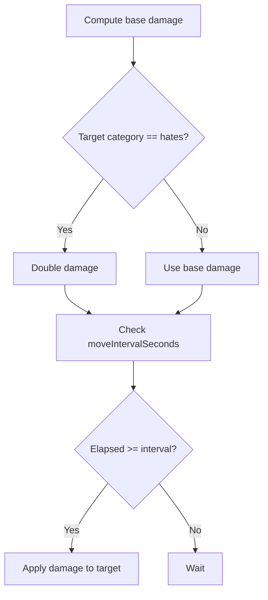
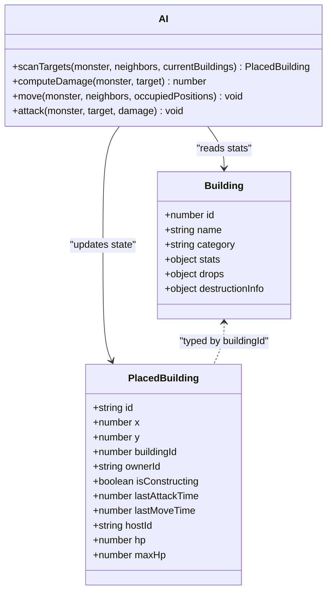
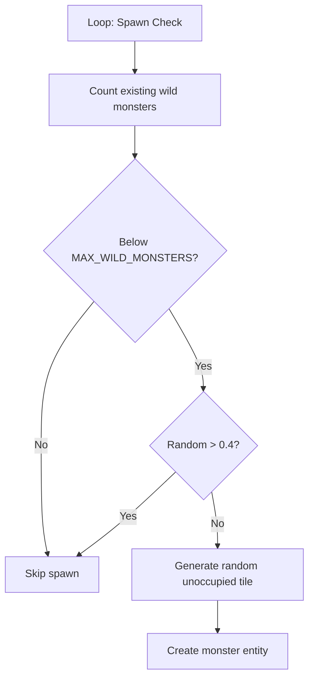
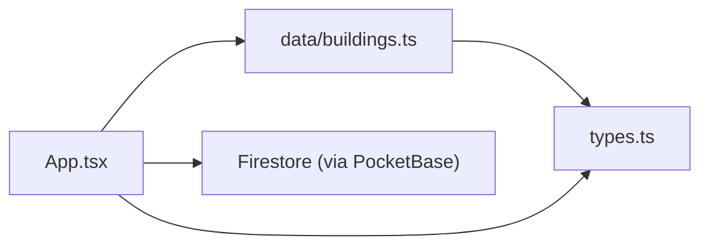

# Monster AI System

<cite>
**Referenced Files in This Document**
- [App.tsx](file://App.tsx)
- [buildings.ts](file://data/buildings.ts)
- [types.ts](file://types.ts)
- [update_monster_ai.ps1](file://update_monster_ai.ps1)
- [update_monster_ai_robust.ps1](file://update_monster_ai_robust.ps1)
- [quick_reset_map.mjs](file://quick_reset_map.mjs)
</cite>

## Table of Contents
1. [Introduction](#introduction)
2. [Project Structure](#project-structure)
3. [Core Components](#core-components)
4. [Architecture Overview](#architecture-overview)
5. [Detailed Component Analysis](#detailed-component-analysis)
6. [Dependency Analysis](#dependency-analysis)
7. [Performance Considerations](#performance-considerations)
8. [Troubleshooting Guide](#troubleshooting-guide)
9. [Conclusion](#conclusion)
10. [Appendices](#appendices)

## Introduction
This document explains the monster AI system in the realtime multiplayer game. It covers behavior patterns, targeting mechanics, movement decisions, combat engagement, and spawning algorithms. It also documents the three monster types (Killing Hut, Kind Santa, Gorynych), their unique stats and special abilities, and how the AI interacts with players and the environment. The goal is to make the AI understandable for beginners while providing sufficient technical depth for developers to implement or extend similar systems.

## Project Structure
The AI logic is implemented in the main application file and backed by shared data and types. The game loop orchestrates AI actions, targeting, movement, and combat. Monster definitions live in the buildings dataset, and the types define the shared interfaces.



**Diagram sources**
- [App.tsx:3217-3660](file://App.tsx#L3217-L3660)
- [types.ts:42-147](file://types.ts#L42-L147)
- [buildings.ts:4528-4657](file://data/buildings.ts#L4528-L4657)
- [update_monster_ai.ps1:23-159](file://update_monster_ai.ps1#L23-L159)
- [update_monster_ai_robust.ps1:67-110](file://update_monster_ai_robust.ps1#L67-L110)
- [quick_reset_map.mjs:220-247](file://quick_reset_map.mjs#L220-L247)

**Section sources**
- [App.tsx:3217-3660](file://App.tsx#L3217-L3660)
- [types.ts:42-147](file://types.ts#L42-L147)
- [buildings.ts:4528-4657](file://data/buildings.ts#L4528-L4657)
- [update_monster_ai.ps1:23-159](file://update_monster_ai.ps1#L23-L159)
- [update_monster_ai_robust.ps1:67-110](file://update_monster_ai_robust.ps1#L67-L110)
- [quick_reset_map.mjs:220-247](file://quick_reset_map.mjs#L220-L247)

## Core Components
- Game loop and AI orchestration: The game loop periodically evaluates all monsters, computes targets, resolves attacks, and applies movement. It tracks occupied positions to prevent collisions and updates Firestore-backed state.
- Targeting system: Monsters scan adjacent tiles for valid targets, preferring buildings in their “hates” category. If none, they attack any eligible business building or choose randomly.
- Movement system: After attack decisions, monsters attempt to move to adjacent tiles. If no valid moves exist, they remain still. Movement avoids occupied tiles and world bounds.
- Combat system: Damage is applied to targeted buildings, scaled when the target matches the monster’s hated category. Attack timing is governed by moveIntervalSeconds.
- Spawning system: Wild monsters spawn during the game loop with a probabilistic trigger and spatial constraints. A dedicated script can reset and spawn predefined counts.

**Section sources**
- [App.tsx:3304-3399](file://App.tsx#L3304-L3399)
- [App.tsx:3332-3348](file://App.tsx#L3332-L3348)
- [App.tsx:3364-3398](file://App.tsx#L3364-L3398)
- [App.tsx:3809-3837](file://App.tsx#L3809-L3837)
- [quick_reset_map.mjs:220-247](file://quick_reset_map.mjs#L220-L247)

## Architecture Overview
The AI runs inside the game loop. It reads current buildings, filters acting monsters, computes targets, applies damage, and updates positions. It also handles defensive structures’ targeting and damage accumulation.

```mermaid
sequenceDiagram
participant Loop as "Game Loop"
participant Mon as "Monster (PlacedBuilding)"
participant BD as "Building Data"
participant Map as "World Grid"
participant DB as "Firestore"
Loop->>Mon : Iterate acting monsters
Loop->>BD : Load monster stats (damage, moveInterval, hates)
Loop->>Map : Scan adjacent tiles for targets
alt Target found
Loop->>Map : Apply damage (scaled if hated category)
Loop->>DB : Persist lastAttackTime and hostId
else No target
Loop->>Map : Find valid adjacent moves (no collision)
alt Moves available
Loop->>Map : Pick random valid move
Loop->>DB : Persist new position and lastMoveTime
else No moves
Loop->>DB : Persist lastMoveTime only
end
end
```

**Diagram sources**
- [App.tsx:3304-3399](file://App.tsx#L3304-L3399)
- [App.tsx:3332-3348](file://App.tsx#L3332-L3348)
- [App.tsx:3364-3398](file://App.tsx#L3364-L3398)

## Detailed Component Analysis

### AI Decision-Making and State Machine
The monster AI operates as a simple finite-state-like loop:
- State: Waiting for moveIntervalSeconds to elapse.
- Decision: Scan adjacent tiles for targets; prefer hated category; otherwise any eligible business building.
- Action: Attack if target exists; else move to a random valid adjacent tile if available.
- Persistence: Update Firestore with timestamps and hostId to coordinate distributed state.



**Diagram sources**
- [App.tsx:3304-3399](file://App.tsx#L3304-L3399)
- [App.tsx:3332-3348](file://App.tsx#L3332-L3348)
- [App.tsx:3364-3398](file://App.tsx#L3364-L3398)

**Section sources**
- [App.tsx:3304-3399](file://App.tsx#L3304-L3399)
- [App.tsx:3332-3348](file://App.tsx#L3332-L3348)
- [App.tsx:3364-3398](file://App.tsx#L3364-L3398)

### Targeting Mechanics
- Adjacent targeting: Monsters first consider neighbors for valid targets (not owned by the same player, not under construction, not nature).
- Preference: If a target belongs to the hated category, it is prioritized; otherwise any eligible business building is chosen.
- Fallback: If no adjacent targets, a random eligible building is selected.



**Diagram sources**
- [App.tsx:3317-3330](file://App.tsx#L3317-L3330)
- [App.tsx:3323-3330](file://App.tsx#L3323-L3330)

**Section sources**
- [App.tsx:3317-3330](file://App.tsx#L3317-L3330)
- [App.tsx:3323-3330](file://App.tsx#L3323-L3330)

### Movement and Collision Avoidance
- Movement candidates: Four cardinal neighbors within world bounds and not occupied.
- Selection: Random among valid moves; if none, no movement occurs.
- Occupancy tracking: The occupiedPositions set is updated when moving to preserve spatial consistency.



**Diagram sources**
- [App.tsx:3364-3398](file://App.tsx#L3364-L3398)

**Section sources**
- [App.tsx:3364-3398](file://App.tsx#L3364-L3398)

### Combat Engagement and Damage Scaling
- Base damage: From monster stats.
- Scaling: If the target category equals the monster’s hated category, damage is doubled.
- Timing: Attacks occur when the elapsed time since lastAttackTime meets or exceeds moveIntervalSeconds.



**Diagram sources**
- [App.tsx:3332-3348](file://App.tsx#L3332-L3348)

**Section sources**
- [App.tsx:3332-3348](file://App.tsx#L3332-L3348)

### Monster Types and Behaviors
Each monster type defines stats, preferred categories to attack, and rewards. Their behaviors are derived from these stats within the AI logic.

- Killing Hut
  - Stats: low durability, moderate damage, hates “Грядки” (Gardens).
  - Behavior: Prefers attacking gardens; otherwise attacks any eligible business building.
  - Drops and destruction weapons are defined for counterplay.

- Kind Santa
  - Stats: higher durability and damage, hates “Заводы” (Factories).
  - Behavior: Similar targeting pattern to Killing Hut, with category preference.

- Gorynych
  - Stats: high durability and damage, hates “Жилые” (Residential).
  - Behavior: Stronger threat with higher damage scaling potential.



**Diagram sources**
- [types.ts:42-147](file://types.ts#L42-L147)
- [buildings.ts:4528-4657](file://data/buildings.ts#L4528-L4657)
- [App.tsx:3304-3399](file://App.tsx#L3304-L3399)

**Section sources**
- [buildings.ts:4528-4657](file://data/buildings.ts#L4528-L4657)
- [types.ts:42-147](file://types.ts#L42-L147)
- [App.tsx:3304-3399](file://App.tsx#L3304-L3399)

### Special Abilities and Destruction Weapons
- Destruction entries define weapon items usable against monsters, including costs and damage values. These enable players to strategically destroy monsters using appropriate munitions.

**Section sources**
- [buildings.ts:4560-4567](file://data/buildings.ts#L4560-L4567)
- [buildings.ts:4602-4609](file://data/buildings.ts#L4602-L4609)
- [buildings.ts:4647-4654](file://data/buildings.ts#L4647-L4654)

### Spawning Algorithms and Population Limits
- Wild spawning during the game loop:
  - Triggered probabilistically and bounded by a maximum count per monster type.
  - New spawns are placed at random coordinates not currently occupied.
  - Each spawned monster receives initial stats and flags for AI activity.

- Scripted spawning:
  - A dedicated script can reset and spawn fixed counts of each monster type across the map.



**Diagram sources**
- [App.tsx:3809-3837](file://App.tsx#L3809-L3837)
- [quick_reset_map.mjs:220-247](file://quick_reset_map.mjs#L220-L247)

**Section sources**
- [App.tsx:3809-3837](file://App.tsx#L3809-L3837)
- [quick_reset_map.mjs:220-247](file://quick_reset_map.mjs#L220-L247)

### Relationship Between AI and Player Interactions
- Threat detection: Monsters detect nearby buildings and prioritize according to their hated categories.
- Pursuit behavior: Movement logic attempts to approach targets within a small radius, using Chebyshev distance for range checks elsewhere in the codebase.
- Combat resolution: Damage accumulates per tick per target; persistence ensures state consistency across clients.

**Section sources**
- [App.tsx:3304-3399](file://App.tsx#L3304-L3399)
- [App.tsx:3420-3432](file://App.tsx#L3420-L3432)

## Dependency Analysis
The AI depends on:
- Building definitions for stats and categories.
- Shared types for consistent state representation.
- Game loop for scheduling ticks and applying updates.
- Firestore for persistence and cross-client synchronization.



**Diagram sources**
- [buildings.ts:4528-4657](file://data/buildings.ts#L4528-L4657)
- [types.ts:42-147](file://types.ts#L42-L147)
- [App.tsx:3217-3660](file://App.tsx#L3217-L3660)

**Section sources**
- [buildings.ts:4528-4657](file://data/buildings.ts#L4528-L4657)
- [types.ts:42-147](file://types.ts#L42-L147)
- [App.tsx:3217-3660](file://App.tsx#L3217-L3660)

## Performance Considerations
- Complexity:
  - Target scanning is O(N) per monster, where N is the number of nearby buildings.
  - Movement selection is O(1) with constant-time neighbor checks.
- Optimization opportunities:
  - Spatial indexing: Use a grid or quadtree to reduce neighbor scans.
  - Early exits: Short-circuit when hated targets are found.
  - Batch updates: Apply multiple monster updates in a single transaction.
  - Reduce Firestore writes: Debounce or coalesce updates when safe.
- Pathfinding:
  - Current logic is local greedy movement; for future expansion, integrate a lightweight pathfinder (e.g., A* with jump-point-style pruning) while respecting occupancy and bounds.

[No sources needed since this section provides general guidance]

## Troubleshooting Guide
- Symptom: Monsters not moving or attacking
  - Verify moveIntervalSeconds and lastAttackTime persistence.
  - Ensure occupiedPositions is updated on movement.
- Symptom: Targeting incorrect buildings
  - Confirm hated categories match building categories.
  - Validate adjacency checks and construction flags.
- Symptom: Spawning too frequently or not enough
  - Adjust MAX_WILD_MONSTERS and the probabilistic threshold.
  - Review occupied tile generation and retry limits.
- Symptom: Performance degradation
  - Monitor loop tick rate and Firestore write volume.
  - Consider batching and spatial indexing.

**Section sources**
- [App.tsx:3304-3399](file://App.tsx#L3304-L3399)
- [App.tsx:3809-3837](file://App.tsx#L3809-L3837)

## Conclusion
The monster AI system is a compact, deterministic loop that evaluates targets, applies damage with category-based scaling, and selects movement with collision avoidance. Its simplicity enables easy maintenance and predictable behavior, while the stats-driven design allows straightforward customization. Extending the system—such as adding pathfinding, smarter decision trees, or environmental triggers—can be done incrementally without disrupting core mechanics.

[No sources needed since this section summarizes without analyzing specific files]

## Appendices

### AI Logic References
- Targeting and attack logic: [App.tsx:3304-3399](file://App.tsx#L3304-L3399)
- Movement and persistence: [App.tsx:3364-3398](file://App.tsx#L3364-L3398)
- Spawning loop: [App.tsx:3809-3837](file://App.tsx#L3809-L3837)
- Monster definitions: [buildings.ts:4528-4657](file://data/buildings.ts#L4528-L4657)
- Types and interfaces: [types.ts:42-147](file://types.ts#L42-L147)
- AI fixes scripts: [update_monster_ai.ps1:23-159](file://update_monster_ai.ps1#L23-L159), [update_monster_ai_robust.ps1:67-110](file://update_monster_ai_robust.ps1#L67-L110)
- Spawning script: [quick_reset_map.mjs:220-247](file://quick_reset_map.mjs#L220-L247)