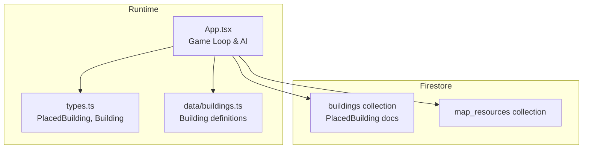
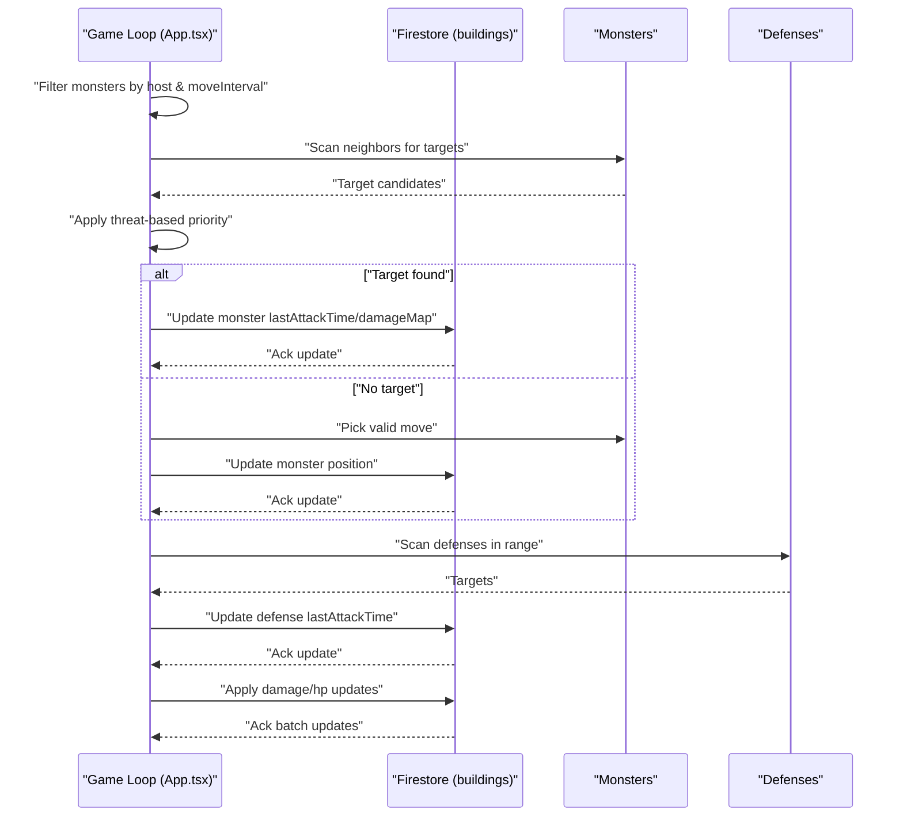
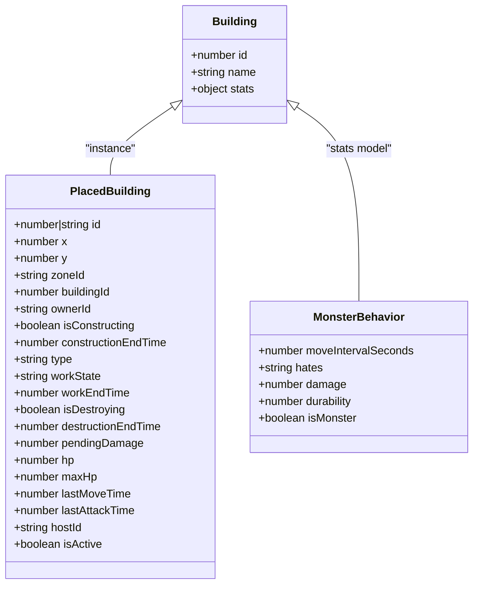
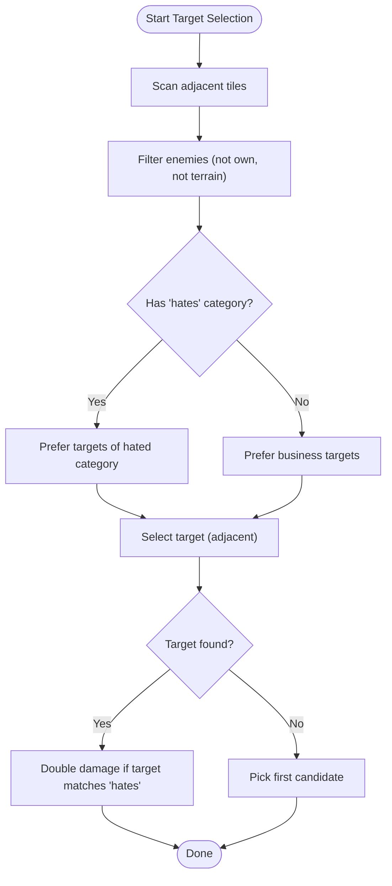
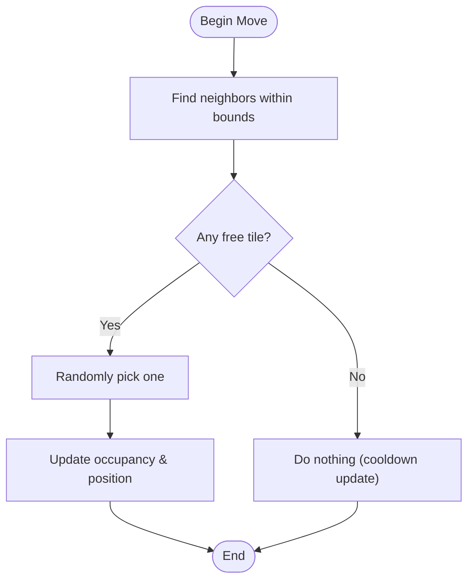
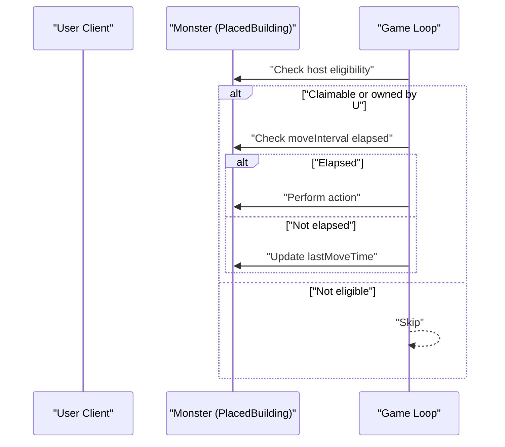
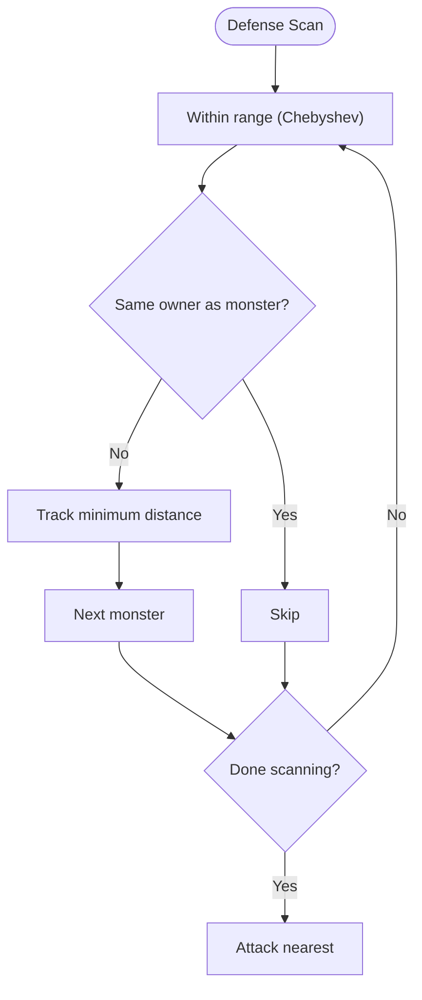
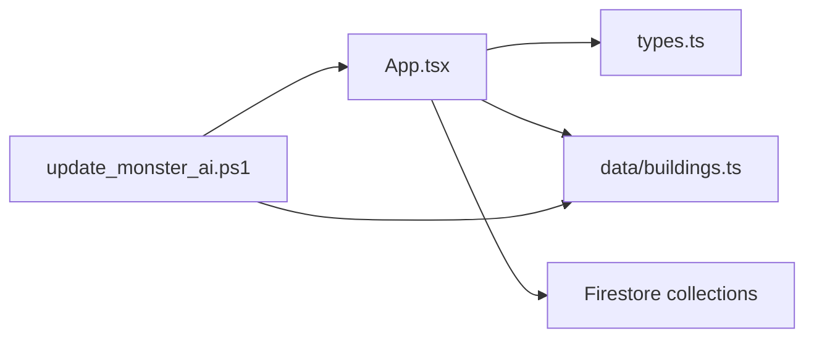

# Behavioral Patterns Overview

<cite>
**Referenced Files in This Document**
- [App.tsx](file://App.tsx)
- [buildings.ts](file://data/buildings.ts)
- [types.ts](file://types.ts)
- [README.md](file://README.md)
- [update_monster_ai.ps1](file://update_monster_ai.ps1)
- [fix_cannon_debug.ps1](file://fix_cannon_debug.ps1)
- [fix_cannon_owner.ps1](file://fix_cannon_owner.ps1)
</cite>

## Table of Contents
1. [Introduction](#introduction)
2. [Project Structure](#project-structure)
3. [Core Components](#core-components)
4. [Architecture Overview](#architecture-overview)
5. [Detailed Component Analysis](#detailed-component-analysis)
6. [Dependency Analysis](#dependency-analysis)
7. [Performance Considerations](#performance-considerations)
8. [Troubleshooting Guide](#troubleshooting-guide)
9. [Conclusion](#conclusion)

## Introduction
This document explains the unified behavioral patterns governing monster AI in the realtime multiplayer game. It covers the common AI framework, state transitions, shared decision-making logic, and the base monster class model embedded in the building data. It also documents the threat assessment system, priority targeting algorithms, environmental awareness, and performance strategies for processing many monsters concurrently. Finally, it outlines debug visualization and monitoring aids used during development and operation.

## Project Structure
The behavioral logic for monsters is implemented in the frontend application loop and driven by Firestore-backed game state. Monster types are defined in the building catalog and consumed by the game loop to compute actions each tick.

**Diagram sources**
- [App.tsx:3216-3529](file://App.tsx#L3216-L3529)
- [types.ts:100-147](file://types.ts#L100-L147)
- [buildings.ts:1-800](file://data/buildings.ts#L1-L800)

**Section sources**
- [README.md:1-21](file://README.md#L1-L21)
- [App.tsx:3216-3529](file://App.tsx#L3216-L3529)
- [types.ts:100-147](file://types.ts#L100-L147)
- [buildings.ts:1-800](file://data/buildings.ts#L1-L800)

## Core Components
- Base monster class model: Implemented as a special-purpose building type with a dedicated flag and stats in the building catalog. The game loop treats these as mobile, autonomous actors.
- Shared decision-making: Centralized in the game loop’s AI tick, which evaluates neighbors, applies threat-based targeting, and schedules movement/attacks.
- Host assignment: Neutral or monster-owned entities are processed by a single host client to avoid duplicate actions.
- Threat assessment and targeting: Priority selection considers adjacency, ownership, terrain, and a “hates” category stat to bias targets.
- Environmental awareness: Movement respects occupied positions and world bounds; attacks use Chebyshev distance for range checks.

**Section sources**
- [App.tsx:3247-3399](file://App.tsx#L3247-L3399)
- [App.tsx:3330-3390](file://App.tsx#L3330-L3390)
- [types.ts:119-147](file://types.ts#L119-L147)
- [buildings.ts:1-800](file://data/buildings.ts#L1-L800)

## Architecture Overview
The runtime AI architecture centers on a periodic game loop that:
- Filters eligible monsters by host eligibility and cooldowns
- Builds a working set of actionable monsters
- Performs neighbor scanning and target selection
- Applies movement or attack updates atomically via Firestore
- Aggregates damage and applies destruction/visual effects

**Diagram sources**
- [App.tsx:3216-3529](file://App.tsx#L3216-L3529)
- [App.tsx:3330-3390](file://App.tsx#L3330-L3390)

## Detailed Component Analysis

### Base Monster Model and Inheritance Pattern
- Definition: Monsters are represented as buildings with a boolean marker indicating they are monsters. Their stats define movement intervals, damage, durability, and optional “hates” category.
- Inheritance pattern: All monster behaviors derive from the shared building definition. Different monster types are differentiated by their building ID and stats (e.g., damage, moveIntervalSeconds, hates).
- Example types: The game spawns predefined monster types by ID and places them as neutral entities on the map.

**Diagram sources**
- [types.ts:42-96](file://types.ts#L42-L96)
- [types.ts:119-147](file://types.ts#L119-L147)
- [buildings.ts:1-800](file://data/buildings.ts#L1-L800)

**Section sources**
- [types.ts:42-96](file://types.ts#L42-L96)
- [types.ts:119-147](file://types.ts#L119-L147)
- [buildings.ts:1-800](file://data/buildings.ts#L1-L800)
- [App.tsx:687-715](file://App.tsx#L687-L715)

### Threat Assessment and Priority Targeting
- Immediate neighbors: Prefer targets immediately adjacent to the monster.
- Category bias: If a monster “hates” a category, prioritize targets of that category; otherwise default to business category targets.
- Fallback: If no preferred target exists among neighbors, pick the first valid candidate.
- Attack bonus: When the target matches the hated category, damage is doubled.

**Diagram sources**
- [App.tsx:3317-3330](file://App.tsx#L3317-L3330)
- [App.tsx:3332-3338](file://App.tsx#L3332-L3338)

**Section sources**
- [App.tsx:3317-3330](file://App.tsx#L3317-L3330)
- [App.tsx:3332-3338](file://App.tsx#L3332-L3338)

### Movement and Environmental Awareness
- Movement space: Neighboring tiles within world bounds and not occupied are considered valid moves.
- Occupancy clobber: Moving updates the occupancy set to reflect the new position.
- Randomization: When multiple valid moves exist, one is chosen randomly.
- Bounds checking: Movement is clipped to the world grid.

**Diagram sources**
- [App.tsx:3365-3398](file://App.tsx#L3365-L3398)

**Section sources**
- [App.tsx:3365-3398](file://App.tsx#L3365-L3398)

### Host Assignment and Concurrency Control
- Eligibility: Only the host client assigned to a neutral or monster-owned building performs actions for it.
- Claiming: If a building is unclaimed by an online user, the lowest UID user claims it; otherwise it is not processed by that user.
- Cooldown enforcement: Actions occur only after the monster’s move interval elapses.

**Diagram sources**
- [App.tsx:3234-3256](file://App.tsx#L3234-L3256)

**Section sources**
- [App.tsx:3234-3256](file://App.tsx#L3234-L3256)

### Cannon Counterplay and Range-Based Targeting
- Range: Defenses scan for monsters within a fixed Chebyshev distance.
- Ownership: Do not target allied monsters.
- Minimizing selection: Select the closest qualifying monster to maximize DPS efficiency.

**Diagram sources**
- [App.tsx:3401-3446](file://App.tsx#L3401-L3446)

**Section sources**
- [App.tsx:3401-3446](file://App.tsx#L3401-L3446)

### Concrete Examples from the Codebase
- Monster spawning: Three predefined monster types are spawned at map generation and placed as neutral entities.
- Threat targeting: Adjacent targets are prioritized; if none match the hated category, a fallback target is chosen.
- Movement: When no adjacent target exists, the monster selects a random valid neighbor move.
- Cannon targeting: Defenses within range attack the nearest monster, respecting ownership.

**Section sources**
- [App.tsx:687-715](file://App.tsx#L687-L715)
- [App.tsx:3317-3330](file://App.tsx#L3317-L3330)
- [App.tsx:3365-3398](file://App.tsx#L3365-L3398)
- [App.tsx:3401-3446](file://App.tsx#L3401-L3446)

## Dependency Analysis
- App.tsx depends on:
  - types.ts for typed game entities
  - data/buildings.ts for monster definitions and stats
  - Firestore collections for live state updates
- update_monster_ai.ps1 and related scripts demonstrate targeted fixes to targeting and movement logic, showing how the team iteratively refines the shared decision-making algorithm.

**Diagram sources**
- [App.tsx:3216-3529](file://App.tsx#L3216-L3529)
- [types.ts:100-147](file://types.ts#L100-L147)
- [buildings.ts:1-800](file://data/buildings.ts#L1-L800)
- [update_monster_ai.ps1:23-108](file://update_monster_ai.ps1#L23-L108)

**Section sources**
- [App.tsx:3216-3529](file://App.tsx#L3216-L3529)
- [types.ts:100-147](file://types.ts#L100-L147)
- [buildings.ts:1-800](file://data/buildings.ts#L1-L800)
- [update_monster_ai.ps1:23-108](file://update_monster_ai.ps1#L23-L108)

## Performance Considerations
- Batching: The game loop aggregates updates in per-tile maps (e.g., damageMap, monsterUpdates, cannonUpdates) and writes them back to Firestore in a single pass, minimizing round-trips.
- Culling: Eligible monsters are filtered by host eligibility and move interval before entering the hot loop.
- Update scheduling: Actions are scheduled using timestamps and intervals, avoiding unnecessary computations when cooldowns are not met.
- Occupancy set: A set tracks occupied positions to quickly validate movement and avoid collisions.
- Range scans: Defenses use a bounded Chebyshev distance to limit target scanning cost.

[No sources needed since this section provides general guidance]

## Troubleshooting Guide
- Debug logs:
  - Monster AI: Logs indicate how many monsters are being processed each tick.
  - Cannons: Periodic logs show how many defenses are ready and how many monsters are on the map.
  - Cannon diagnostics: Additional debug prints show per-cannon owner checks, construction state, and cooldown timing.
- Owner and host checks:
  - Ensure the current user is eligible to act as host for a given monster.
  - Verify that lastAttackTime and moveIntervalSeconds are properly synchronized with Firestore.
- Script-driven fixes:
  - Targeting and movement logic was refined via PowerShell scripts, demonstrating iterative improvements to threat assessment and pathfinding.

**Section sources**
- [App.tsx:3304-3306](file://App.tsx#L3304-L3306)
- [App.tsx:3408-3410](file://App.tsx#L3408-L3410)
- [fix_cannon_debug.ps1:36-61](file://fix_cannon_debug.ps1#L36-L61)
- [fix_cannon_owner.ps1:30-57](file://fix_cannon_owner.ps1#L30-L57)

## Conclusion
The monster AI follows a unified, data-driven behavioral model:
- Monsters are modeled as buildings with specialized stats and flags.
- Decision-making is centralized in the game loop with clear threat assessment and priority targeting.
- Movement and attack updates are batched and applied atomically via Firestore.
- Host assignment and cooldowns prevent concurrency conflicts.
- Debugging and script-based refinements support continuous improvement of the shared algorithms.

[No sources needed since this section summarizes without analyzing specific files]