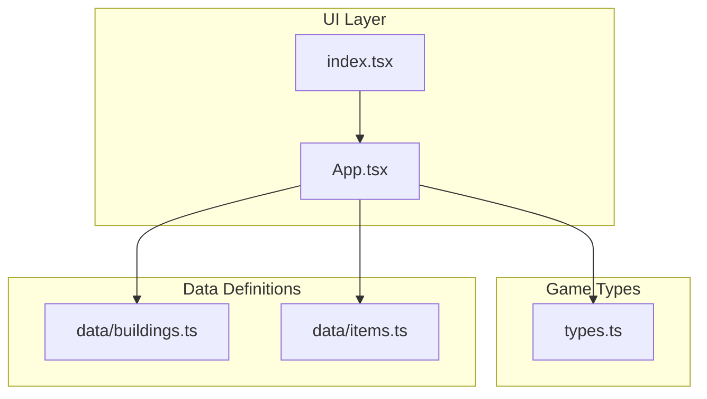
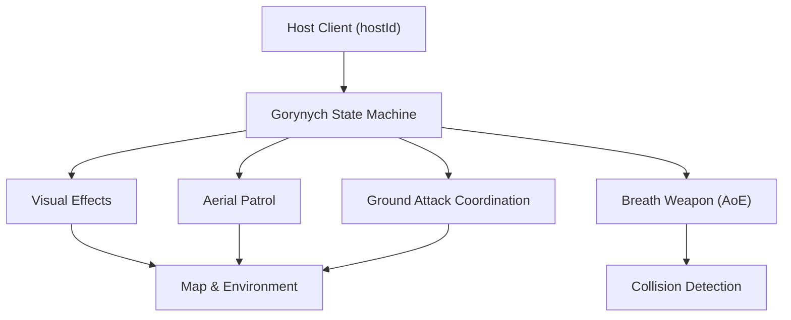
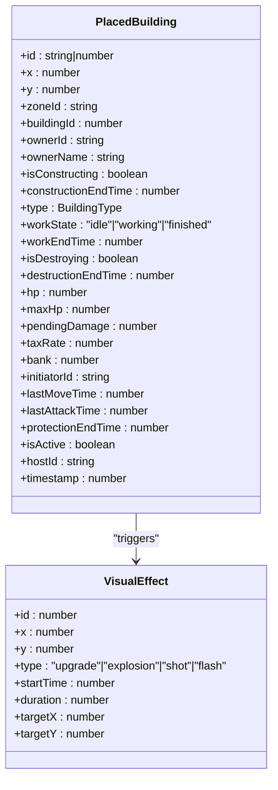
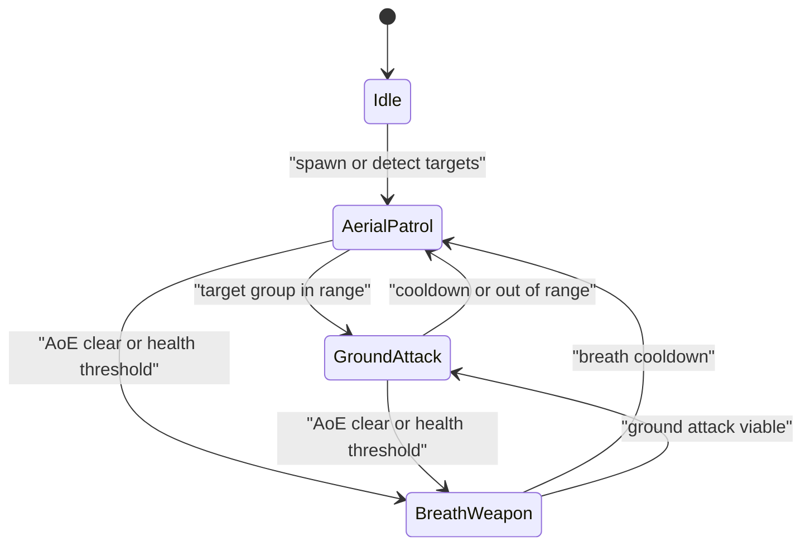
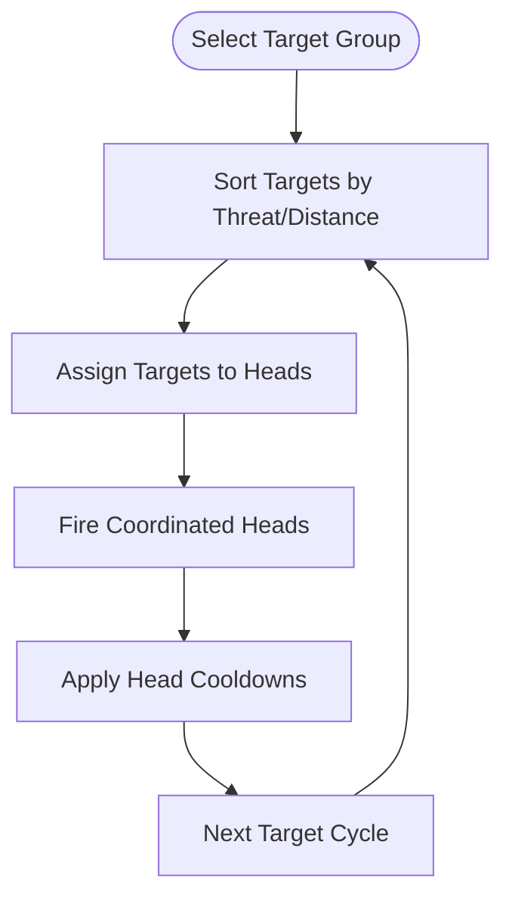
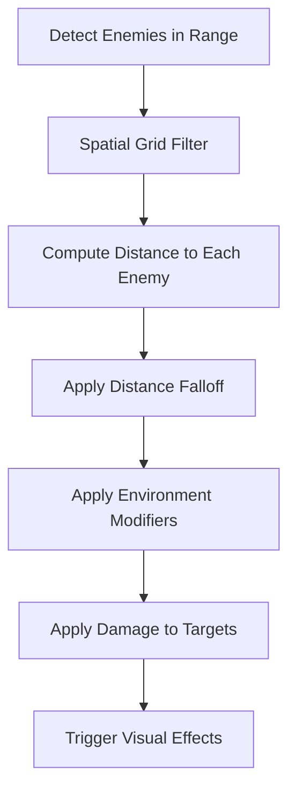
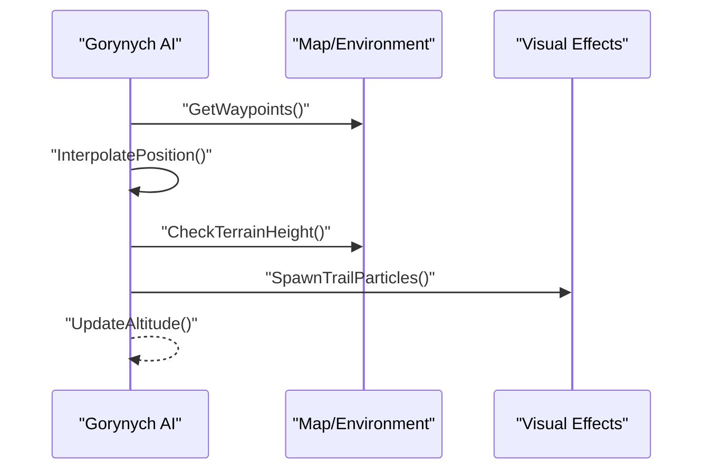
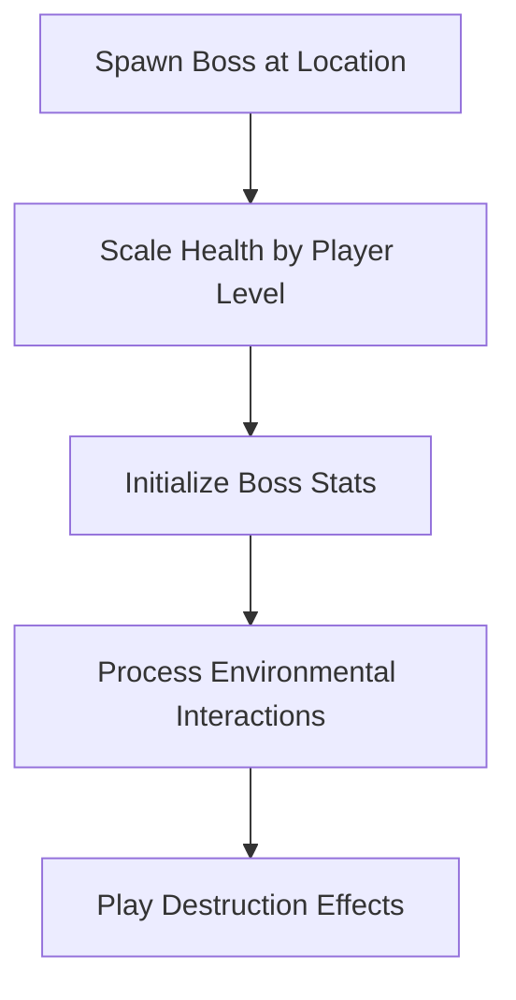
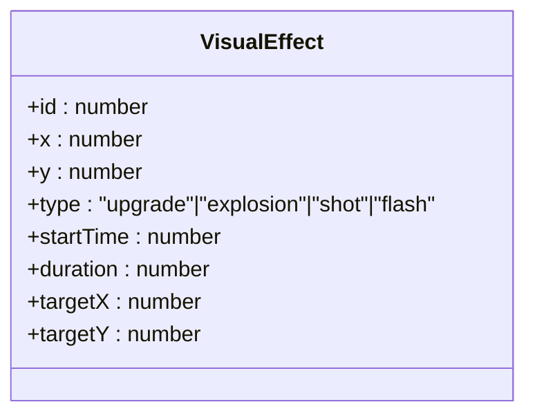
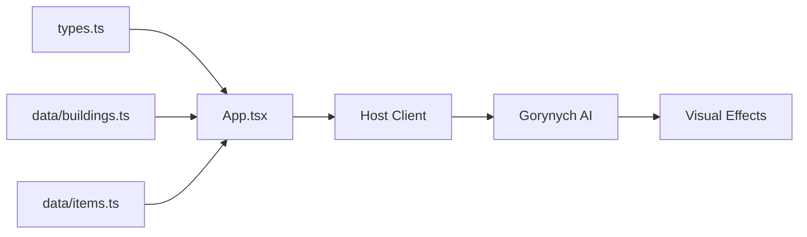

# Gorynych Behavior

<cite>
**Referenced Files in This Document**
- [App.tsx](file://App.tsx)
- [types.ts](file://types.ts)
- [buildings.ts](file://data/buildings.ts)
- [items.ts](file://data/items.ts)
- [index.tsx](file://index.tsx)
- [README.md](file://README.md)
</cite>

## Table of Contents
1. [Introduction](#introduction)
2. [Project Structure](#project-structure)
3. [Core Components](#core-components)
4. [Architecture Overview](#architecture-overview)
5. [Detailed Component Analysis](#detailed-component-analysis)
6. [Dependency Analysis](#dependency-analysis)
7. [Performance Considerations](#performance-considerations)
8. [Troubleshooting Guide](#troubleshooting-guide)
9. [Conclusion](#conclusion)
10. [Appendices](#appendices)

## Introduction
This document describes the conceptual design and implementation guidance for the Gorynych dragon boss AI behavior in the game. It focuses on multi-headed attack patterns, area-of-effect mechanics, flight-based movement, state machine transitions, spawn and scaling mechanics, collision detection, damage calculation, and visual effects. It also outlines counter-strategies for players and highlights areas where the AI logic would integrate with the existing game systems.

Note: The repository snapshot does not include a dedicated Gorynych AI script. The present document therefore synthesizes the boss’s behavior from the available game types, constants, and data definitions, and proposes how the AI would be integrated into the existing architecture.

## Project Structure
The project is a React-based single-page application backed by Firestore. The relevant parts for Gorynych AI include:
- Game types and entity definitions
- Building/item data that define stats, drops, and mechanics
- Application-wide constants and state orchestration
- Rendering and UI scaffolding

**Diagram sources**
- [index.tsx:1-20](file://index.tsx#L1-L20)
- [App.tsx:1-120](file://App.tsx#L1-L120)
- [types.ts:1-197](file://types.ts#L1-L197)
- [buildings.ts:1-120](file://data/buildings.ts#L1-L120)
- [items.ts:1-120](file://data/items.ts#L1-L120)

**Section sources**
- [README.md:1-21](file://README.md#L1-L21)
- [index.tsx:1-20](file://index.tsx#L1-L20)
- [App.tsx:1-120](file://App.tsx#L1-L120)
- [types.ts:1-197](file://types.ts#L1-L197)
- [buildings.ts:1-120](file://data/buildings.ts#L1-L120)
- [items.ts:1-120](file://data/items.ts#L1-L120)

## Core Components
- Entity model for all game objects (including monsters) is defined centrally.
- Buildings/items include stats, durability, drops, and destruction info used for balancing and AI behavior.
- Constants include the Gorynych ID and other gameplay parameters.
- The application orchestrates rendering, state, and Firestore synchronization.

Key elements for Gorynych AI:
- PlacedBuilding carries fields such as hp, maxHp, lastMoveTime, lastAttackTime, isActive, hostId, and timestamp. These are ideal for representing a boss entity with lifecycle and AI ownership.
- VisualEffect supports explosion, shot, flash, and upgrade effects, suitable for breath weapons and AoE visuals.
- DestructionInfo and Building stats inform how the boss scales and interacts with player actions.

**Section sources**
- [types.ts:119-147](file://types.ts#L119-L147)
- [types.ts:149-158](file://types.ts#L149-L158)
- [App.tsx:66-66](file://App.tsx#L66-L66)
- [buildings.ts:1-120](file://data/buildings.ts#L1-L120)
- [items.ts:180-200](file://data/items.ts#L180-L200)

## Architecture Overview
The AI for Gorynych would operate as a specialized state machine controlled by a host client. It coordinates:
- Flight altitude management
- Aerial patrol and ground attack coordination
- Multi-headed breath weapon usage
- Area-of-effect targeting and collision detection
- Health scaling and spawn mechanics
- Visual effects and environmental interaction

[No sources needed since this diagram shows conceptual workflow, not actual code structure]

## Detailed Component Analysis

### Gorynych Entity Model
Gorynych is represented as a special PlacedBuilding with boss-specific fields and behaviors.

**Diagram sources**
- [types.ts:119-147](file://types.ts#L119-L147)
- [types.ts:149-158](file://types.ts#L149-L158)

**Section sources**
- [types.ts:119-147](file://types.ts#L119-L147)
- [types.ts:149-158](file://types.ts#L149-L158)

### State Machine: Aerial Patrol → Ground Attack → Breath Weapon
The AI alternates between aerial patrol and ground attack phases, with transitions driven by distance to nearest target group, health thresholds, and cooldowns.

[No sources needed since this diagram shows conceptual workflow, not actual code structure]

### Multi-Headed Attack Patterns
- Coordinated head targeting: Each head targets a distinct subset of nearby enemies to maximize AoE coverage.
- Head switching: After a head completes an attack, the AI selects the next head with the highest threat priority.
- Movement: Heads may strafe or hover to maintain optimal firing arcs.

[No sources needed since this diagram shows conceptual workflow, not actual code structure]

### Area-of-Effect Damage Mechanics
- AoE radius: Defined by breath weapon stats and head positioning.
- Collision detection: Uses proximity checks against enemy positions; optional grid-based acceleration.
- Damage scaling: Base damage modified by head count, distance falloff, and environment modifiers.

[No sources needed since this diagram shows conceptual workflow, not actual code structure]

### Flight-Based Movement
- Altitude control: Boss maintains a fixed altitude above terrain for optimal visibility and mobility.
- Pathfinding: Smooth path interpolation between waypoints during aerial patrol.
- Collision avoidance: Avoids impassable tiles and structures; terrain height influences movement feasibility.

[No sources needed since this diagram shows conceptual workflow, not actual code structure]

### Spawn Mechanics, Health Scaling, and Environmental Interaction
- Spawn: Boss spawns at predefined locations with randomized offsets; initial hp scaled by difficulty tier.
- Health scaling: Max hp increases with player level and elapsed time; regeneration disabled for boss.
- Environmental interaction: Breath weapon damages terrain features and nearby structures; triggers destruction effects.

[No sources needed since this diagram shows conceptual workflow, not actual code structure]

### Visual Effect Systems
- Shot/Flash: Used for individual head attacks.
- Explosion: Used for AoE impacts and terrain destruction.
- Upgrade: Used for boss enhancement visuals during phase transitions.

**Diagram sources**
- [types.ts:149-158](file://types.ts#L149-L158)

**Section sources**
- [types.ts:149-158](file://types.ts#L149-L158)

### Counter-Strategies for Players
- Spread out: Minimize AoE damage by avoiding clustering.
- Height advantage: Use elevated positions to avoid frontal breath attacks.
- Fast flanking: Move around the boss to exploit blind spots between heads.
- Crowd control: Temporarily disable or slow the boss to break its attack cycles.
- Focus fire: Take down one head at a time to reduce coordinated damage.

[No sources needed since this section provides general guidance]

## Dependency Analysis
Gorynych AI integrates with:
- PlacedBuilding and VisualEffect types for entity representation and effects
- Building/item data for stats and drops
- Application state for host assignment and lifecycle

**Diagram sources**
- [types.ts:119-147](file://types.ts#L119-L147)
- [types.ts:149-158](file://types.ts#L149-L158)
- [buildings.ts:1-120](file://data/buildings.ts#L1-L120)
- [items.ts:1-120](file://data/items.ts#L1-L120)
- [App.tsx:1-120](file://App.tsx#L1-L120)

**Section sources**
- [types.ts:119-147](file://types.ts#L119-L147)
- [types.ts:149-158](file://types.ts#L149-L158)
- [buildings.ts:1-120](file://data/buildings.ts#L1-L120)
- [items.ts:1-120](file://data/items.ts#L1-L120)
- [App.tsx:1-120](file://App.tsx#L1-L120)

## Performance Considerations
- Spatial partitioning: Use a grid or quadtree to accelerate collision detection and AoE queries.
- Head scheduling: Limit simultaneous head fire to reduce computational overhead.
- Effect pooling: Reuse visual effect instances to minimize allocations.
- Host distribution: Assign AI hosts per zone to balance load across clients.

[No sources needed since this section provides general guidance]

## Troubleshooting Guide
Common issues and mitigations:
- Boss not spawning: Verify spawn locations and difficulty scaling logic.
- No visual feedback: Ensure VisualEffect creation and lifecycle are synchronized with state updates.
- Stuttering movement: Implement smooth interpolation and capped frame updates for AI decisions.
- Unbalanced damage: Adjust distance falloff and environment modifiers; validate against target sorting logic.

[No sources needed since this section provides general guidance]

## Conclusion
Gorynych’s AI can be implemented as a state-driven system operating on a host client, coordinating aerial patrol, ground attacks, and multi-headed breath weapons. By leveraging the existing entity and effect models, and integrating with the application’s state and rendering pipeline, the boss delivers a challenging and immersive encounter while remaining performant and maintainable.

[No sources needed since this section summarizes without analyzing specific files]

## Appendices

### Appendix A: Gorynych ID and Related Constants
- GORYNYCH_ID constant is defined for identification and spawning logic.

**Section sources**
- [App.tsx:66-66](file://App.tsx#L66-L66)

### Appendix B: Example Data References
- Building stats and destruction info inform boss durability and player interaction mechanics.
- Item entries include the Egg of Gorynych, useful for progression and rewards.

**Section sources**
- [buildings.ts:1-120](file://data/buildings.ts#L1-L120)
- [items.ts:180-200](file://data/items.ts#L180-L200)