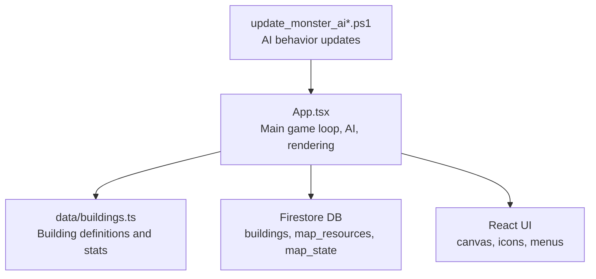
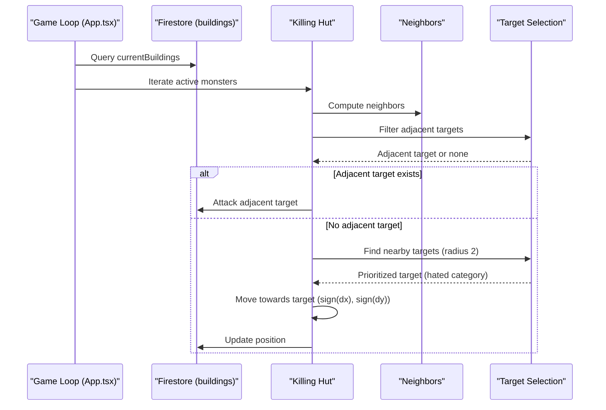
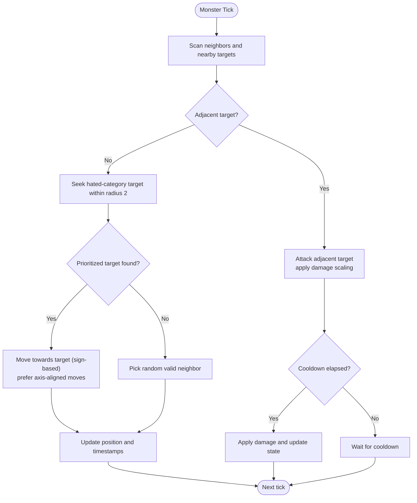
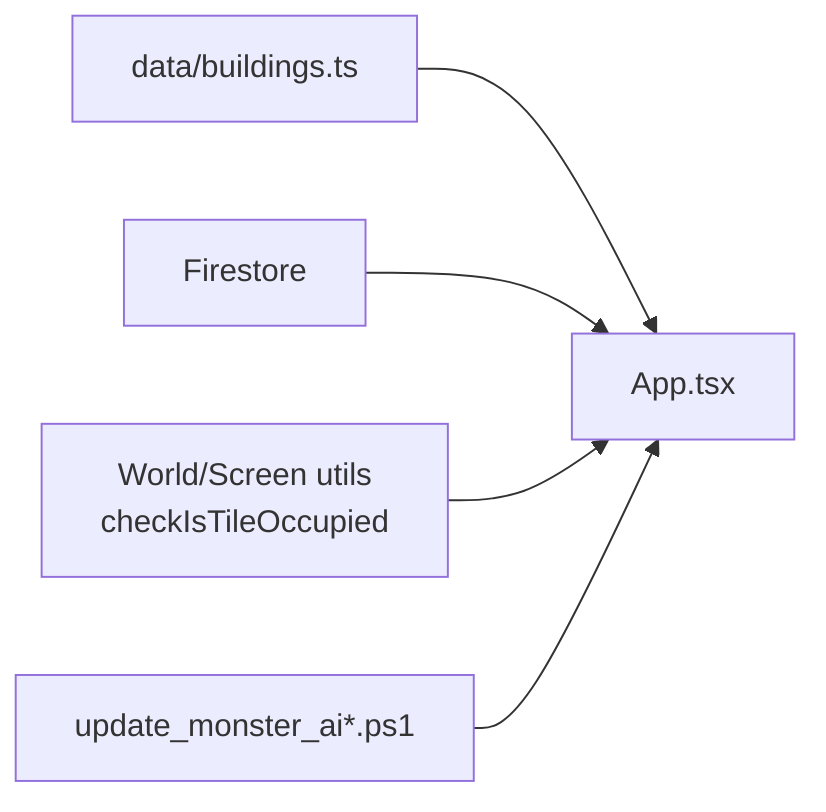

# Killing Hut Behavior

<cite>
**Referenced Files in This Document**
- [App.tsx](file://App.tsx)
- [buildings.ts](file://data/buildings.ts)
- [update_monster_ai.ps1](file://update_monster_ai.ps1)
- [update_monster_ai_robust.ps1](file://update_monster_ai_robust.ps1)
- [README.md](file://README.md)
- [package.json](file://package.json)
</cite>

## Table of Contents
1. [Introduction](#introduction)
2. [Project Structure](#project-structure)
3. [Core Components](#core-components)
4. [Architecture Overview](#architecture-overview)
5. [Detailed Component Analysis](#detailed-component-analysis)
6. [Dependency Analysis](#dependency-analysis)
7. [Performance Considerations](#performance-considerations)
8. [Troubleshooting Guide](#troubleshooting-guide)
9. [Conclusion](#conclusion)

## Introduction
This document explains the Killing Hut monster AI behavior in the realtime RTS/MMO game. It covers the aggressive hunting pattern, target acquisition mechanics, movement and attack strategies, state machine implementation, spawning and limits, environmental triggers, performance optimizations for multiple monsters, collision detection, and visual/audio effects. The content is grounded in the repository’s source files and scripts that modify and document the AI logic.

## Project Structure
The game is a React + Vite application backed by Firestore. The AI logic resides in the main application file and is augmented by PowerShell scripts that update the AI behavior. Building definitions (including monster stats and categories) are loaded from a data module.

**Diagram sources**
- [App.tsx:1-120](file://App.tsx#L1-L120)
- [buildings.ts:4530](file://data/buildings.ts#L4530)
- [update_monster_ai.ps1:1-160](file://update_monster_ai.ps1#L1-L160)
- [update_monster_ai_robust.ps1:1-150](file://update_monster_ai_robust.ps1#L1-L150)

**Section sources**
- [README.md:1-21](file://README.md#L1-L21)
- [package.json:1-31](file://package.json#L1-L31)

## Core Components
- Game loop and AI orchestration: The main game loop processes all monsters, computes neighbors, selects targets, and applies movement/attacks.
- Targeting logic: Adjacent targets are preferred; otherwise, targets within a small radius are considered, prioritizing hated categories.
- Movement logic: Prefer moving toward a prioritized target; fallback to random valid moves.
- Attack logic: Damage scaling against hated categories; attack cooldown enforced.
- Spawning: Initial spawning of monsters during map generation; later spawns are governed by map_state and limits.
- Collision detection: Tile occupancy checks prevent overlapping and invalid moves.
- Visual effects and animations: Effects are tracked and rendered via the UI pipeline; sounds are not explicitly defined in the referenced files.

Key constants and identifiers:
- KILLING_HUT_ID: Unique identifier for the Killing Hut.
- WORLD_WIDTH_TILES, WORLD_HEIGHT_TILES: World bounds for movement validation.
- moveIntervalSeconds and damage stats: From building definitions.

**Section sources**
- [App.tsx:64-67](file://App.tsx#L64-L67)
- [App.tsx:41-95](file://App.tsx#L41-L95)
- [App.tsx:687-718](file://App.tsx#L687-L718)
- [buildings.ts:4530](file://data/buildings.ts#L4530)

## Architecture Overview
The AI runs inside the main game loop. Each tick, the system:
- Loads current buildings and map resources.
- Filters acting monsters (e.g., active, non-construction).
- For each monster:
  - Identifies neighbors and possible targets.
  - Selects target (adjacent first, then nearby, then hated category).
  - Applies movement toward target or random valid move.
  - Executes attack if adjacent and cooldown elapsed.

**Diagram sources**
- [App.tsx:3304-3367](file://App.tsx#L3304-L3367)
- [update_monster_ai.ps1:23-128](file://update_monster_ai.ps1#L23-L128)
- [update_monster_ai_robust.ps1:44-127](file://update_monster_ai_robust.ps1#L44-L127)

## Detailed Component Analysis

### State Machine Implementation
The AI follows a simple finite state-like behavior:
- Idle scanning: Compute neighbors and scan for targets.
- Target tracking: Prefer adjacent targets; otherwise seek hated-category targets within a small radius.
- Melee attack execution: If adjacent and cooldown elapsed, apply damage and update state.

**Diagram sources**
- [App.tsx:3304-3367](file://App.tsx#L3304-L3367)
- [update_monster_ai.ps1:71-128](file://update_monster_ai.ps1#L71-L128)
- [update_monster_ai_robust.ps1:67-127](file://update_monster_ai_robust.ps1#L67-L127)

**Section sources**
- [App.tsx:3304-3367](file://App.tsx#L3304-L3367)
- [update_monster_ai.ps1:23-128](file://update_monster_ai.ps1#L23-L128)
- [update_monster_ai_robust.ps1:44-127](file://update_monster_ai_robust.ps1#L44-L127)

### Target Acquisition Mechanics
- Immediate neighbors: Adjacent tiles are checked first; only targets owned by other players and not under construction are considered.
- Category hatred: If a hated category is configured, priority is given to targets of that category among adjacent targets.
- Nearby seeking: If no adjacent target, scan up to two tiles (Chebyshev distance) for targets excluding nature category and construction.
- Fallback selection: If hated category does not match any nearby targets, pick the first eligible nearby target.

Concrete examples from the codebase:
- Adjacent target filtering and hated-category prioritization.
- Nearby target filtering within a 2-tile radius and hated-category prioritization.
- Fallback to random valid move when no suitable target is found.

**Section sources**
- [update_monster_ai.ps1:28-40](file://update_monster_ai.ps1#L28-L40)
- [update_monster_ai.ps1:72-84](file://update_monster_ai.ps1#L72-L84)
- [update_monster_ai_robust.ps1:28-40](file://update_monster_ai_robust.ps1#L28-L40)
- [update_monster_ai_robust.ps1:70-81](file://update_monster_ai_robust.ps1#L70-L81)

### Movement and Attack Strategies
- Movement: Prefer moving along axes (sign-based deltas) toward the prioritized target; choose the first valid move that avoids occupied positions.
- Attack: If adjacent and cooldown elapsed, apply base damage multiplied by a factor if the target belongs to the hated category; update last attack time and monster state.
- Cooldown: Controlled by moveIntervalSeconds from building stats; ensures periodic attacks.

Concrete examples from the codebase:
- Sign-based movement toward target.
- Random fallback movement when no preferred direction is available.
- Damage scaling for hated-category targets and cooldown enforcement.

**Section sources**
- [update_monster_ai.ps1:86-108](file://update_monster_ai.ps1#L86-L108)
- [App.tsx:3334-3348](file://App.tsx#L3334-L3348)
- [update_monster_ai_robust.ps1:83-105](file://update_monster_ai_robust.ps1#L83-L105)

### Spawning Mechanics, Limits, and Environmental Triggers
- Initial spawn: During map generation, a fixed number of Killing Huts are placed at random locations.
- Active state: Newly spawned monsters are marked active and participate in the game loop.
- Limits: The repository defines a constant for the maximum number of wild monsters; this constrains total monster presence.
- Environmental triggers: Nature-based buildings are excluded from targeting; this acts as an environmental trigger affecting target eligibility.

Concrete examples from the codebase:
- Spawning during map generation.
- Maximum wild monster count constant.
- Exclusion of nature category from valid targets.

**Section sources**
- [App.tsx:687-718](file://App.tsx#L687-L718)
- [App.tsx:53-53](file://App.tsx#L53-L53)
- [update_monster_ai.ps1:32-33](file://update_monster_ai.ps1#L32-L33)

### Collision Detection and Occupancy
- Occupancy checks: Tiles are considered occupied if a building with HP > 0 or a map resource exists at that location.
- Movement validation: Valid moves must be within world bounds and not occupied.
- Position updates: When moving, the occupied set is updated to reflect new positions.

Concrete examples from the codebase:
- Occupancy check function.
- Movement validation against world bounds and occupied positions.
- Position updates and Firestore writes.

**Section sources**
- [App.tsx:421-431](file://App.tsx#L421-L431)
- [App.tsx:3365-3367](file://App.tsx#L3365-L3367)
- [update_monster_ai.ps1:99-108](file://update_monster_ai.ps1#L99-L108)

### Visual Effects, Sound Cues, and Animation States
- Visual effects: The game maintains a list of visual effects; while not explicitly tied to Killing Hut actions in the referenced files, effects can be added during combat or movement.
- Sound cues: No explicit sound definitions were found in the referenced files.
- Animation states: The UI pipeline renders buildings and effects; animation timing and states are managed by the rendering loop.

Concrete examples from the codebase:
- Visual effects array maintained in state.
- Rendering pipeline and effect management.

**Section sources**
- [App.tsx:313-313](file://App.tsx#L313-L313)

## Dependency Analysis
The AI logic depends on:
- Building definitions for stats (damage, moveIntervalSeconds, hates category).
- Firestore for real-time updates and state persistence.
- Utility functions for world-to-screen conversion and tile occupancy checks.

**Diagram sources**
- [buildings.ts:4530](file://data/buildings.ts#L4530)
- [App.tsx:1-120](file://App.tsx#L1-L120)
- [update_monster_ai.ps1:1-160](file://update_monster_ai.ps1#L1-L160)

**Section sources**
- [buildings.ts:4530](file://data/buildings.ts#L4530)
- [App.tsx:1-120](file://App.tsx#L1-L120)

## Performance Considerations
- Target filtering: Limit nearby search to a small radius (e.g., 2 tiles) to reduce computation.
- Occupancy checks: Use a set keyed by tile coordinates for O(1) occupancy lookups.
- Movement validation: Precompute candidate moves and select the first unoccupied option to minimize retries.
- Cooldown enforcement: Avoid unnecessary Firestore writes by batching updates and checking cooldowns locally first.
- Zone-based subscriptions: The UI throttles camera updates to reduce re-subscriptions; similar strategies can help manage monster updates.

[No sources needed since this section provides general guidance]

## Troubleshooting Guide
- Missing or insufficient permissions: The game loop ignores expected Firestore permission errors during updates to avoid noisy logs.
- Race conditions: Updates are wrapped to catch and ignore benign race conditions.
- Target selection anomalies: Verify that hated categories are properly defined in building stats and that nature category exclusions are applied consistently.

**Section sources**
- [App.tsx:27-33](file://App.tsx#L27-L33)

## Conclusion
The Killing Hut AI implements a straightforward yet effective hunting pattern: prioritize adjacent targets, seek hated-category targets within a small radius, and execute melee attacks with cooldown-based pacing. The system leverages building stats for behavior configuration, maintains collision safety, and integrates with Firestore for state synchronization. The included scripts demonstrate targeted improvements to targeting and movement logic, ensuring consistent and performant behavior across multiple monsters.