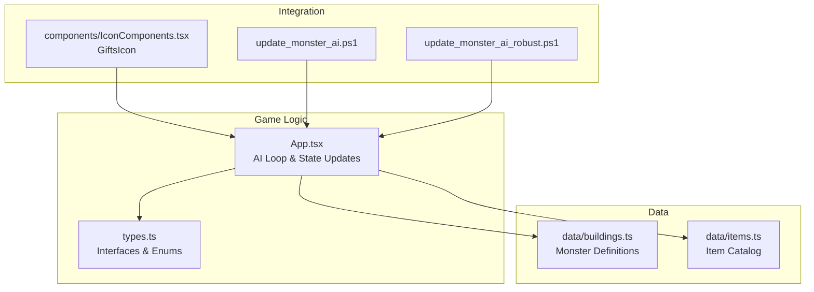
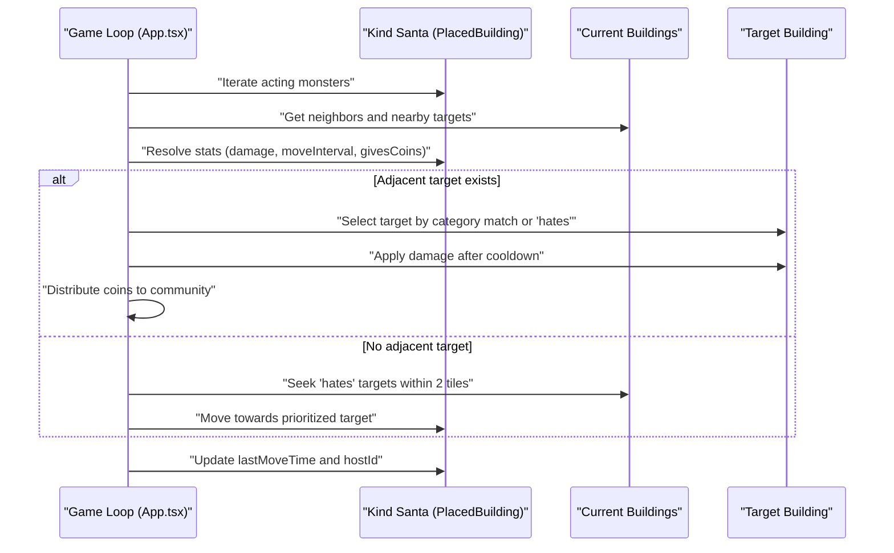
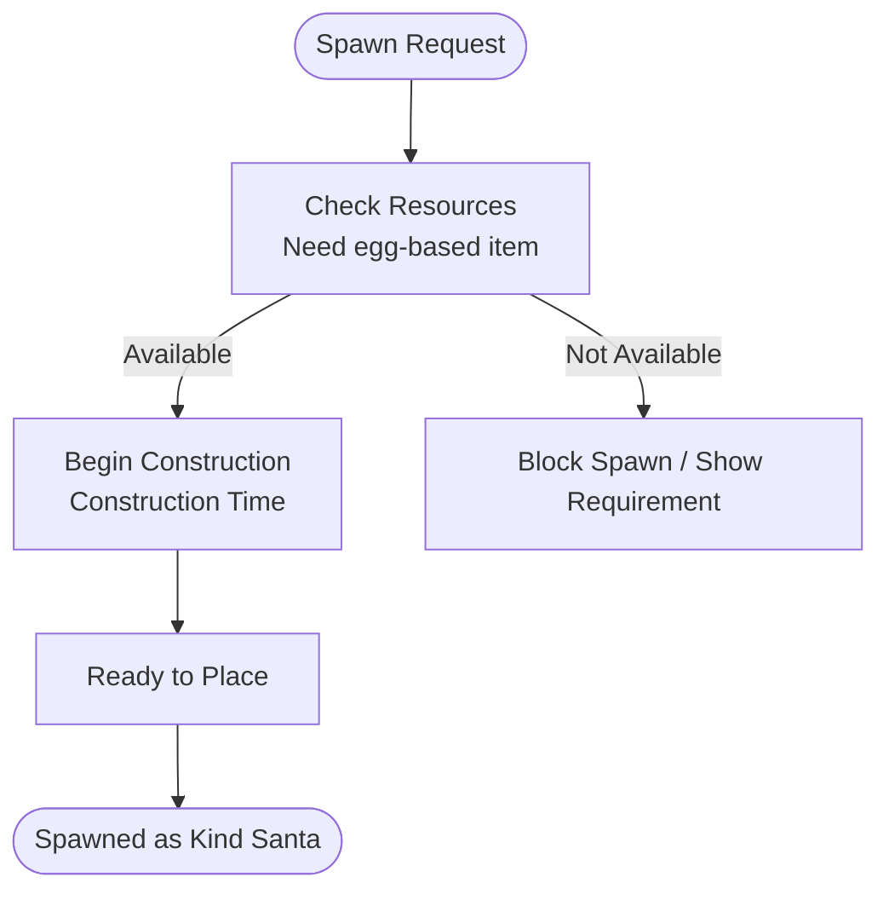
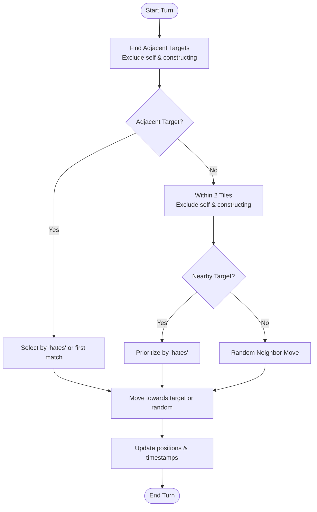
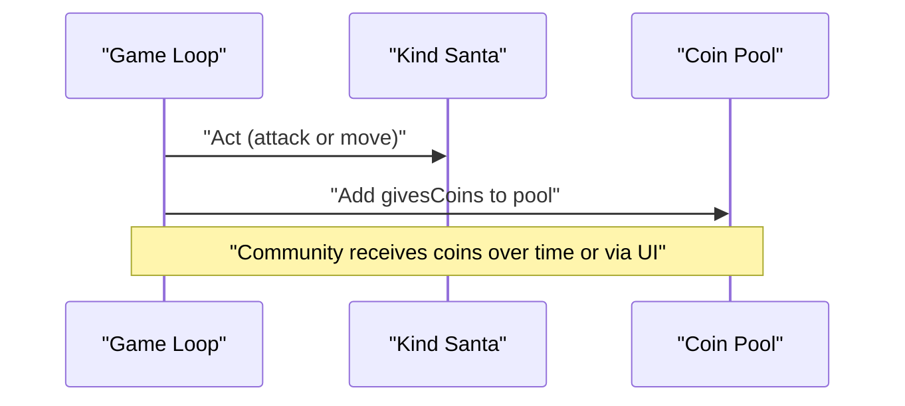
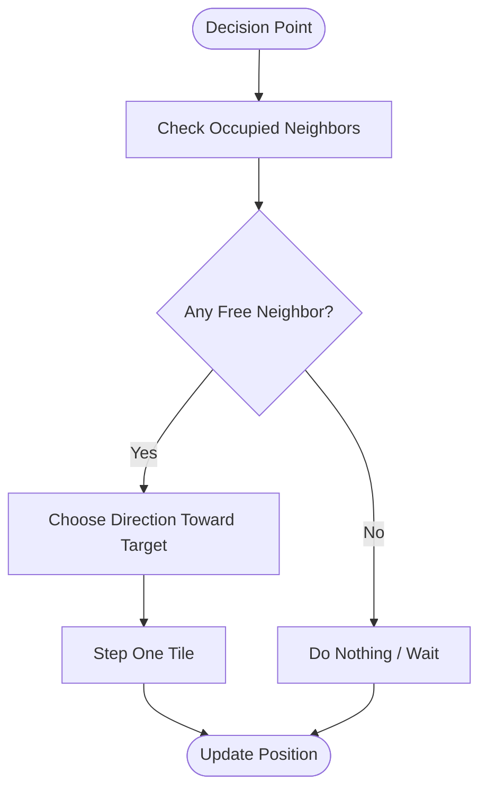
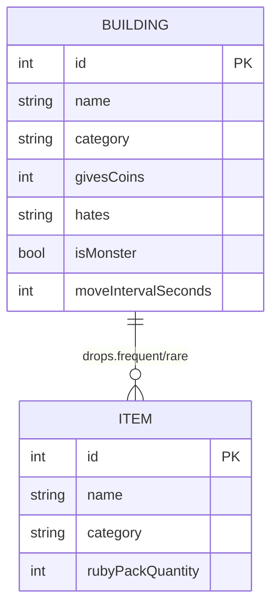
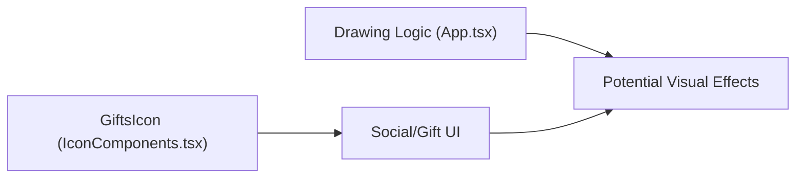
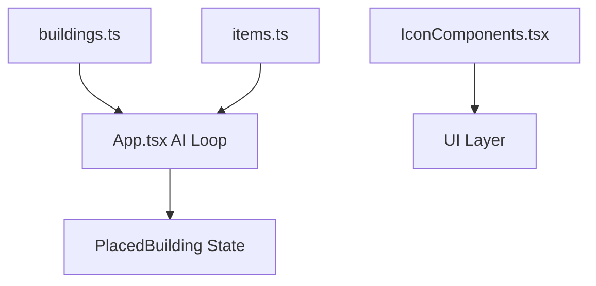

# Kind Santa Behavior

<cite>
**Referenced Files in This Document**
- [App.tsx](file://App.tsx)
- [buildings.ts](file://data/buildings.ts)
- [items.ts](file://data/items.ts)
- [types.ts](file://types.ts)
- [update_monster_ai.ps1](file://update_monster_ai.ps1)
- [update_monster_ai_robust.ps1](file://update_monster_ai_robust.ps1)
- [IconComponents.tsx](file://components/IconComponents.tsx)
</cite>

## Table of Contents
1. [Introduction](#introduction)
2. [Project Structure](#project-structure)
3. [Core Components](#core-components)
4. [Architecture Overview](#architecture-overview)
5. [Detailed Component Analysis](#detailed-component-analysis)
6. [Dependency Analysis](#dependency-analysis)
7. [Performance Considerations](#performance-considerations)
8. [Troubleshooting Guide](#troubleshooting-guide)
9. [Conclusion](#conclusion)

## Introduction
This document explains the Kind Santa monster AI behavior in the game. Kind Santa is a passive-friendly monster that does not attack players directly. Instead, it:
- Identifies targets based on its “hates” category
- Moves toward hated targets within a limited range
- Distributes coins to the community when it acts
- Maintains safe distances from hostile entities
- Integrates with the game’s social mechanics and visual indicators

The document also covers spawn conditions, gift distribution mechanics, probability calculations for drops, and behavioral differences from other monsters.

## Project Structure
The Kind Santa behavior spans several parts of the codebase:
- Game logic and AI loop: [App.tsx](file://App.tsx)
- Monster definition and stats: [buildings.ts](file://data/buildings.ts)
- Item catalog and probabilities: [items.ts](file://data/items.ts)
- Type definitions for buildings and items: [types.ts](file://types.ts)
- AI updates and movement logic scripts: [update_monster_ai.ps1](file://update_monster_ai.ps1), [update_monster_ai_robust.ps1](file://update_monster_ai_robust.ps1)
- Visual icons for social/gifts: [IconComponents.tsx](file://components/IconComponents.tsx)

**Diagram sources**
- [App.tsx](file://App.tsx)
- [buildings.ts](file://data/buildings.ts)
- [items.ts](file://data/items.ts)
- [types.ts](file://types.ts)
- [update_monster_ai.ps1](file://update_monster_ai.ps1)
- [update_monster_ai_robust.ps1](file://update_monster_ai_robust.ps1)
- [IconComponents.tsx](file://components/IconComponents.tsx)

**Section sources**
- [App.tsx](file://App.tsx)
- [buildings.ts](file://data/buildings.ts)
- [items.ts](file://data/items.ts)
- [types.ts](file://types.ts)
- [update_monster_ai.ps1](file://update_monster_ai.ps1)
- [update_monster_ai_robust.ps1](file://update_monster_ai_robust.ps1)
- [IconComponents.tsx](file://components/IconComponents.tsx)

## Core Components
- Kind Santa definition and stats:
  - Name and category: [data/buildings.ts](file://data/buildings.ts)
  - Stats: damage, move interval, givesCoins, hates, isMonster, durability, gloryOnExplosion
  - Drops: frequent and rare loot entries
  - Construction requirements: egg-based resource
- AI loop in the game:
  - Target selection logic and movement decisions
  - Attack timing and coin distribution
  - Safe-distance behavior and non-aggressive movement
- Social and visual integration:
  - Gift icon for UI
  - Social mechanics (praise/complain) and their impact on gameplay

**Section sources**
- [buildings.ts](file://data/buildings.ts)
- [App.tsx](file://App.tsx)
- [IconComponents.tsx](file://components/IconComponents.tsx)

## Architecture Overview
The Kind Santa AI operates inside the game’s periodic AI loop. It evaluates adjacent and nearby targets, selects a target based on its “hates” category, and either attacks or moves. When acting, it distributes coins to the community and updates state.

**Diagram sources**
- [App.tsx](file://App.tsx)
- [buildings.ts](file://data/buildings.ts)

## Detailed Component Analysis

### Kind Santa Definition and Spawn Conditions
- Stats and behavior:
  - Is a monster with a “hates” category
  - Has a move interval and givesCoins value
  - Drops frequent and rare items
- Spawn conditions:
  - Requires a specific egg resource for construction
  - Buildable and has construction time

**Diagram sources**
- [buildings.ts](file://data/buildings.ts)

**Section sources**
- [buildings.ts](file://data/buildings.ts)

### Target Selection and Movement Logic
- Targeting:
  - Adjacent targets are preferred first
  - If none, seek targets within a 2-tile Chebyshev distance
  - Only targets whose category matches “hates” are prioritized
- Movement:
  - Chooses a direction toward the prioritized target
  - Randomly selects among valid neighbor tiles if no preferred move
  - Ensures no occupied positions are stepped on

**Diagram sources**
- [App.tsx](file://App.tsx)
- [update_monster_ai.ps1](file://update_monster_ai.ps1)
- [update_monster_ai_robust.ps1](file://update_monster_ai_robust.ps1)

**Section sources**
- [App.tsx](file://App.tsx)
- [update_monster_ai.ps1](file://update_monster_ai.ps1)
- [update_monster_ai_robust.ps1](file://update_monster_ai_robust.ps1)

### Gift Distribution Mechanics
- When acting, Kind Santa distributes coins to the community:
  - The amount is defined by its givesCoins stat
  - Distributed during the AI tick when a target is selected or moved
- Integration with social mechanics:
  - Coins can be part of the economy and influence player interactions
  - Social actions (praise/complain) affect reputation and in-game dynamics

**Diagram sources**
- [App.tsx](file://App.tsx)
- [buildings.ts](file://data/buildings.ts)

**Section sources**
- [App.tsx](file://App.tsx)
- [buildings.ts](file://data/buildings.ts)

### Non-Aggressive Movement Patterns and Safe Distances
- Non-aggressive:
  - Does not attack players directly
  - Focuses on buildings in its “hates” category
- Safe distances:
  - Avoids moving onto occupied positions
  - Uses neighbor checks to prevent collisions
- Movement pattern:
  - Prefers adjacent targets; otherwise seeks within a small radius
  - Moves in straight-line steps toward the target

**Diagram sources**
- [App.tsx](file://App.tsx)

**Section sources**
- [App.tsx](file://App.tsx)

### Drop Generation and Probability Calculations
- Drops:
  - Frequent and rare lists define items and amounts
  - Items include boards, firecrackers, garden bombs, and super pumpkin pieces
- Probability:
  - Drops are defined as frequent/rare sets; no explicit numeric chance fields are present in the item schema shown
  - Frequency is indicated by the presence of items in frequent/rare arrays

**Diagram sources**
- [buildings.ts](file://data/buildings.ts)
- [items.ts](file://data/items.ts)
- [types.ts](file://types.ts)

**Section sources**
- [buildings.ts](file://data/buildings.ts)
- [items.ts](file://data/items.ts)
- [types.ts](file://types.ts)

### Unique Animation Sequences and Visual Indicators
- Visual indicators:
  - Gift icon is available for UI elements related to social/gifts
- Animation:
  - The repository includes drawing logic for effects (shots, flashes) that could be extended for Kind Santa visuals
  - Specific Kind Santa animations are not defined in the provided files

**Diagram sources**
- [IconComponents.tsx](file://components/IconComponents.tsx)
- [App.tsx](file://App.tsx)

**Section sources**
- [IconComponents.tsx](file://components/IconComponents.tsx)
- [App.tsx](file://App.tsx)

### Behavioral Differences from Other Monsters
- Kind Santa:
  - Passive-friendly, “hates” specific categories
  - Distributes coins, not aggressive toward players
- Other monsters (examples):
  - Have different “hates” categories and stats
  - May attack players or focus on other targets
- Integration:
  - Kind Santa’s presence influences economy and social dynamics differently than aggressive monsters

**Section sources**
- [buildings.ts](file://data/buildings.ts)

## Dependency Analysis
- Kind Santa depends on:
  - Building definitions for stats and drops
  - Game loop for targeting, movement, and state updates
  - Item catalog for loot generation
- Coupling:
  - AI logic is centralized in the game loop
  - Visuals and social mechanics are separate UI concerns

**Diagram sources**
- [buildings.ts](file://data/buildings.ts)
- [items.ts](file://data/items.ts)
- [App.tsx](file://App.tsx)
- [IconComponents.tsx](file://components/IconComponents.tsx)

**Section sources**
- [buildings.ts](file://data/buildings.ts)
- [items.ts](file://data/items.ts)
- [App.tsx](file://App.tsx)
- [IconComponents.tsx](file://components/IconComponents.tsx)

## Performance Considerations
- Target filtering:
  - Adjacent and nearby target checks are O(n) over current buildings
  - Chebyshev distance and category filtering keep complexity linear
- Movement:
  - Neighbor enumeration is constant-time
  - Random selection among valid moves is O(k) where k is number of free neighbors
- Recommendations:
  - Keep the building list bounded
  - Avoid unnecessary re-computation by caching neighbor and category lookups

[No sources needed since this section provides general guidance]

## Troubleshooting Guide
- If Kind Santa does not move:
  - Verify that adjacent targets are blocked or occupied
  - Confirm that “hates” targets exist within the 2-tile radius
- If coins are not distributed:
  - Ensure the AI tick executes and that the monster is marked as acting
  - Check that givesCoins is set in the building definition
- If targeting seems incorrect:
  - Review the “hates” category and building categories
  - Confirm that constructing or owned buildings are excluded from targeting

**Section sources**
- [App.tsx](file://App.tsx)
- [buildings.ts](file://data/buildings.ts)

## Conclusion
Kind Santa is a unique, passive-friendly monster that focuses on targeted destruction of specific building categories while distributing coins to the community. Its AI emphasizes safe, non-aggressive movement and integrates with the game’s economy and social systems. The provided scripts and definitions outline a robust foundation for its behavior, with room for extending visuals and balancing mechanics.