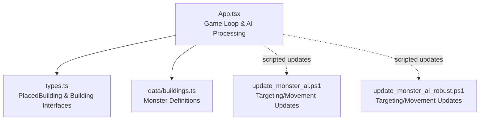
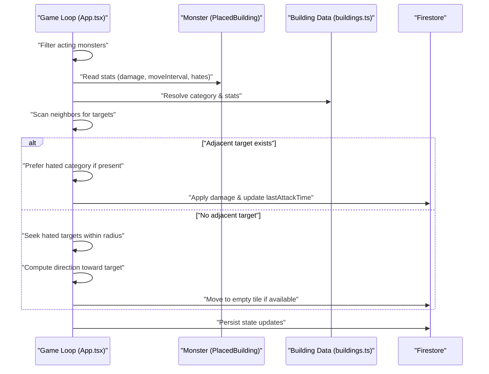
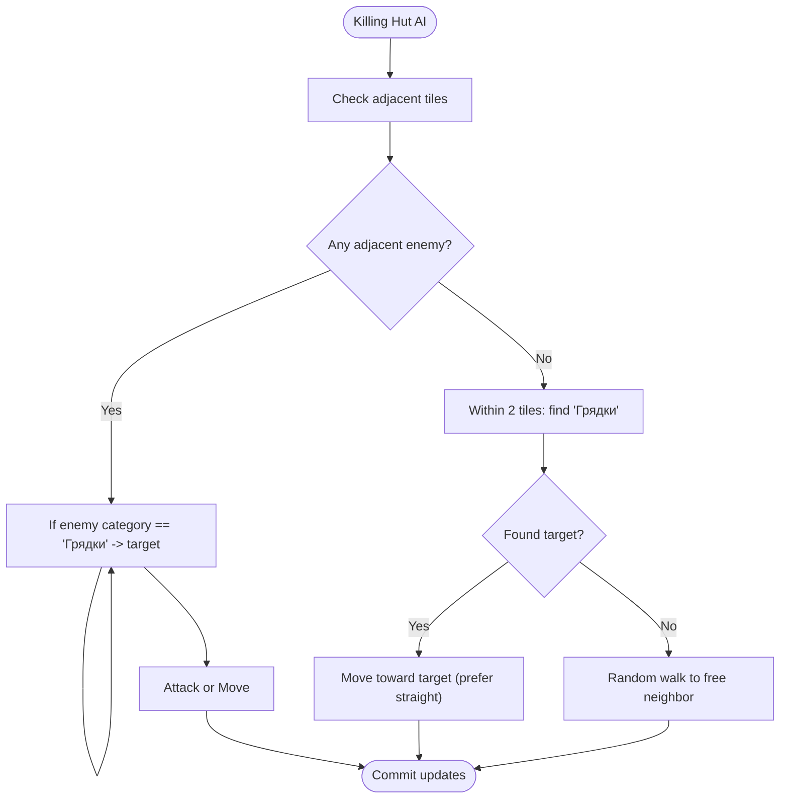
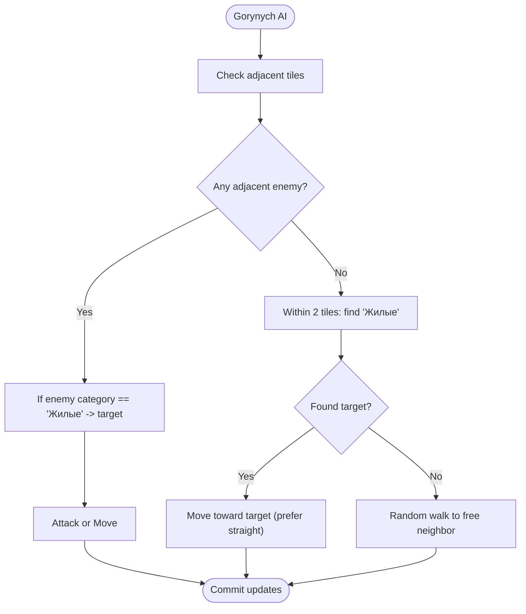
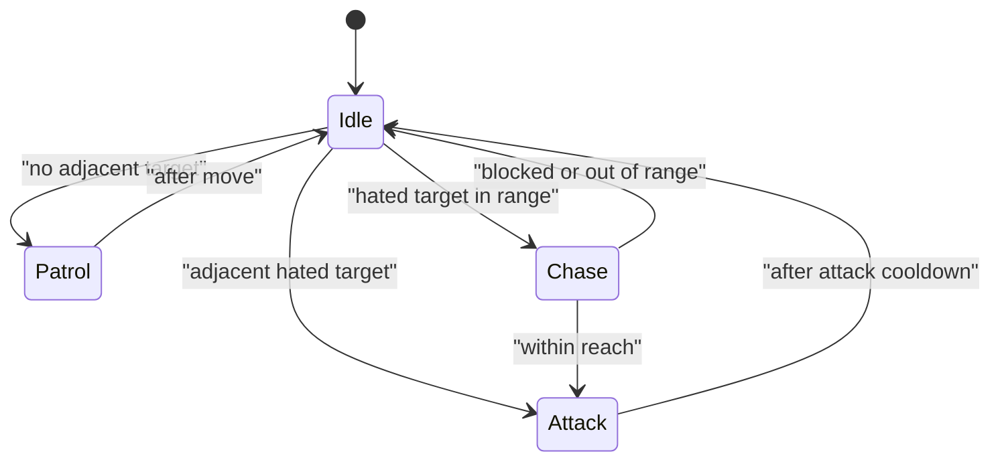
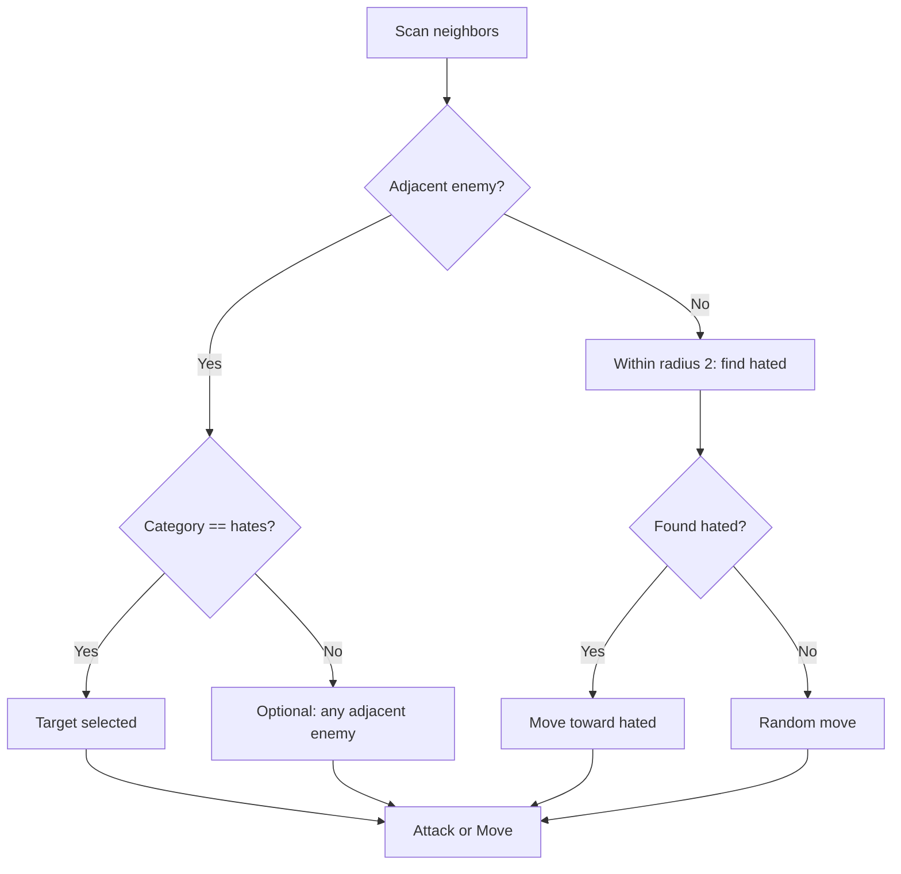
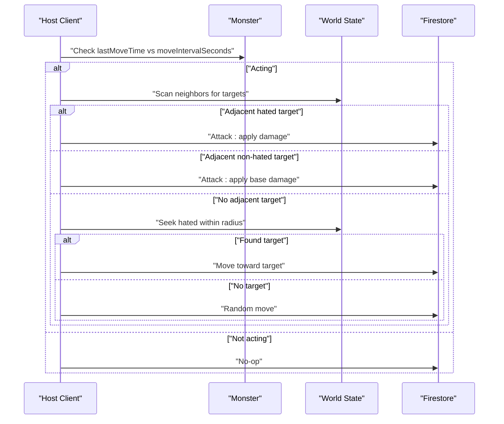
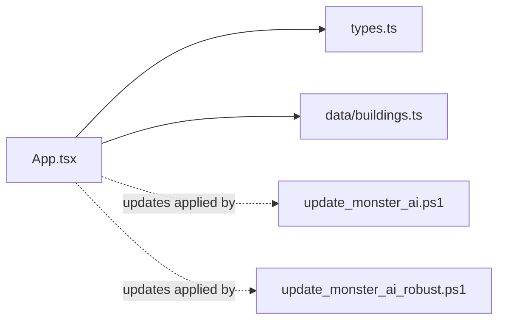

# Monster Behavior Patterns

<cite>
**Referenced Files in This Document**
- [App.tsx](file://App.tsx)
- [types.ts](file://types.ts)
- [buildings.ts](file://data/buildings.ts)
- [update_monster_ai.ps1](file://update_monster_ai.ps1)
- [update_monster_ai_robust.ps1](file://update_monster_ai_robust.ps1)
</cite>

## Table of Contents
1. [Introduction](#introduction)
2. [Project Structure](#project-structure)
3. [Core Components](#core-components)
4. [Architecture Overview](#architecture-overview)
5. [Detailed Component Analysis](#detailed-component-analysis)
6. [Dependency Analysis](#dependency-analysis)
7. [Performance Considerations](#performance-considerations)
8. [Troubleshooting Guide](#troubleshooting-guide)
9. [Conclusion](#conclusion)

## Introduction
This document explains the monster behavior patterns for three distinct AI-controlled units: Killing Hut, Kind Santa, and Gorynych. It details their AI decision trees, movement mechanics, attack patterns, and special abilities. It also documents the monster activation system, threat detection mechanisms, engagement protocols, and performance considerations for scalable AI processing across many monsters.

## Project Structure
The game’s runtime AI loop and monster logic are implemented in the main application file, with monster definitions centralized in the buildings data file. Supporting scripts refine targeting and movement heuristics.

**Diagram sources**
- [App.tsx:3217-3446](file://App.tsx#L3217-L3446)
- [types.ts:119-147](file://types.ts#L119-L147)
- [buildings.ts:4528-4665](file://data/buildings.ts#L4528-L4665)
- [update_monster_ai.ps1:1-160](file://update_monster_ai.ps1#L1-L160)
- [update_monster_ai_robust.ps1:1-150](file://update_monster_ai_robust.ps1#L1-L150)

**Section sources**
- [App.tsx:3217-3446](file://App.tsx#L3217-L3446)
- [types.ts:119-147](file://types.ts#L119-L147)
- [buildings.ts:4528-4665](file://data/buildings.ts#L4528-L4665)

## Core Components
- Monster definitions: Each monster is defined as a building with stats that govern AI behavior, including damage, move interval, and a “hates” category that biases targeting.
- Game loop AI: A single requestAnimationFrame-driven loop evaluates which monsters act, selects targets, applies damage, and updates positions.
- Host assignment: Monsters are owned by neutral identifiers and processed by a single host client at a time to prevent conflicts.
- Threat detection: Adjacent targets are preferred; otherwise, monsters seek hated categories within a small radius.
- Attack mechanics: Damage scales when attacking the hated category; attacks are rate-limited by moveIntervalSeconds.

**Section sources**
- [buildings.ts:4528-4665](file://data/buildings.ts#L4528-L4665)
- [App.tsx:3217-3446](file://App.tsx#L3217-L3446)
- [App.tsx:3308-3399](file://App.tsx#L3308-L3399)

## Architecture Overview
The monster AI pipeline runs inside the game loop. It filters acting monsters, computes neighbors, detects targets, decides whether to attack or move, and writes updates back to Firestore.

**Diagram sources**
- [App.tsx:3217-3446](file://App.tsx#L3217-L3446)
- [App.tsx:3308-3399](file://App.tsx#L3308-L3399)
- [buildings.ts:4528-4665](file://data/buildings.ts#L4528-L4665)

## Detailed Component Analysis

### Monster Type: Killing Hut
- Stats and behavior
  - Damage: base value applied when attacking.
  - Move interval: controls how often the monster acts.
  - Hates category: “Грядки” (Farms). Attacking farms doubles damage.
  - Durability and explosion glory: affects survivability and reward.
- Targeting logic
  - Prefer adjacent targets in the hated category (“Грядки”).
  - If none, fall back to any eligible adjacent target (excluding nature).
- Movement logic
  - If no adjacent target, scan nearby tiles within a small radius for hated targets.
  - Move diagonally toward the target if possible; otherwise pick a free neighbor.
- Special abilities
  - No special ability in the current logic; relies on hate-based bonus and basic movement.

**Diagram sources**
- [App.tsx:3308-3399](file://App.tsx#L3308-L3399)
- [buildings.ts:4528-4570](file://data/buildings.ts#L4528-L4570)

**Section sources**
- [buildings.ts:4528-4570](file://data/buildings.ts#L4528-L4570)
- [App.tsx:3308-3399](file://App.tsx#L3308-L3399)

### Monster Type: Kind Santa
- Stats and behavior
  - Higher damage than Killing Hut.
  - Hates category: “Заводы” (Factories). Attacking factories doubles damage.
  - Move interval and explosion glory similar to other monsters.
- Targeting logic
  - Same preference order: adjacent hated targets first, then any eligible adjacent target.
- Movement logic
  - Seeks hated targets within a small radius and moves toward them, preferring straight-line progress.

**Diagram sources**
- [App.tsx:3308-3399](file://App.tsx#L3308-L3399)
- [buildings.ts:4571-4612](file://data/buildings.ts#L4571-L4612)

**Section sources**
- [buildings.ts:4571-4612](file://data/buildings.ts#L4571-L4612)
- [App.tsx:3308-3399](file://App.tsx#L3308-L3399)

### Monster Type: Gorynych
- Stats and behavior
  - Highest damage among the three.
  - Hates category: “Жилые” (Residential). Attacking residential buildings doubles damage.
  - Highest durability and explosion glory.
- Targeting logic
  - Same as others: adjacent hated targets preferred, then any eligible adjacent target.
- Movement logic
  - Seeks hated targets within a small radius and moves toward them.

**Diagram sources**
- [App.tsx:3308-3399](file://App.tsx#L3308-L3399)
- [buildings.ts:4613-4657](file://data/buildings.ts#L4613-L4657)

**Section sources**
- [buildings.ts:4613-4657](file://data/buildings.ts#L4613-L4657)
- [App.tsx:3308-3399](file://App.tsx#L3308-L3399)

### State Machine: Idle, Patrol, Chase, Attack
The current implementation does not define separate named states. Instead, the AI uses a continuous decision loop:
- Idle: Waiting until moveIntervalSeconds elapses.
- Patrol: Random walk to free neighboring tiles.
- Chase: Move toward a hated target within a small radius.
- Attack: Apply damage to adjacent hated targets; if none, move.

**Diagram sources**
- [App.tsx:3308-3399](file://App.tsx#L3308-L3399)

**Section sources**
- [App.tsx:3308-3399](file://App.tsx#L3308-L3399)

### Decision Trees and Pattern Recognition
- Adjacent targeting: Immediate neighbors are scanned first; hated category is prioritized when present.
- Range-based seeking: If no adjacent target, scan within a small radius for hated targets.
- Movement bias: Prefer straight-line movement toward the target; fallback to random neighbor if blocked.
- Damage scaling: Double damage when attacking the hated category.

**Diagram sources**
- [App.tsx:3308-3399](file://App.tsx#L3308-L3399)

**Section sources**
- [App.tsx:3308-3399](file://App.tsx#L3308-L3399)

### Activation System, Threat Detection, and Engagement Protocols
- Activation: Monsters act when the elapsed time since lastMoveTime exceeds moveIntervalSeconds.
- Host selection: Neutral-owned monsters are processed by a single host client determined by a deterministic tie-breaker.
- Threat detection: Adjacent enemies are primary; otherwise, hated-category targets within a small radius.
- Engagement: Attack if adjacent and hated; otherwise move toward hated targets; otherwise random walk.

**Diagram sources**
- [App.tsx:3217-3446](file://App.tsx#L3217-L3446)
- [App.tsx:3308-3399](file://App.tsx#L3308-L3399)

**Section sources**
- [App.tsx:3217-3446](file://App.tsx#L3217-L3446)
- [App.tsx:3308-3399](file://App.tsx#L3308-L3399)

### Special Abilities and Mechanics
- Hates-based damage multiplier: When attacking the hated category, damage is doubled.
- Movement bias: Straight-line movement toward targets; random fallback when blocked.
- No special abilities beyond targeting and movement heuristics in the current implementation.

**Section sources**
- [buildings.ts:4528-4665](file://data/buildings.ts#L4528-L4665)
- [App.tsx:3308-3399](file://App.tsx#L3308-L3399)

## Dependency Analysis
- App.tsx depends on:
  - types.ts for PlacedBuilding and Building interfaces.
  - data/buildings.ts for monster definitions and stats.
  - Firestore via updateDoc to persist state changes.
- Scripts update_monster_ai.ps1 and update_monster_ai_robust.ps1 refine targeting and movement logic in App.tsx.

**Diagram sources**
- [App.tsx:3217-3446](file://App.tsx#L3217-L3446)
- [types.ts:119-147](file://types.ts#L119-L147)
- [buildings.ts:4528-4665](file://data/buildings.ts#L4528-L4665)
- [update_monster_ai.ps1:1-160](file://update_monster_ai.ps1#L1-L160)
- [update_monster_ai_robust.ps1:1-150](file://update_monster_ai_robust.ps1#L1-L150)

**Section sources**
- [App.tsx:3217-3446](file://App.tsx#L3217-L3446)
- [types.ts:119-147](file://types.ts#L119-L147)
- [buildings.ts:4528-4665](file://data/buildings.ts#L4528-L4665)

## Performance Considerations
- Single-host constraint: Neutral monsters are processed by one host at a time to avoid race conditions and redundant work.
- Minimal branching: Targeting and movement checks are linear in the number of neighbors and nearby targets.
- Batch updates: Changes are accumulated in maps and written to Firestore in bulk per tick.
- Rate limiting: moveIntervalSeconds prevents excessive computation per monster.
- Occupancy set: Occupied positions are tracked in a Set for O(1) lookup during movement.
- Recommendations:
  - Keep the search radius small to bound complexity.
  - Consider spatial indexing (grid or quadtree) for very large maps.
  - Defer expensive computations to off-screen hosts or precompute common paths.

[No sources needed since this section provides general guidance]

## Troubleshooting Guide
- Monsters not moving:
  - Verify moveIntervalSeconds and lastMoveTime are being updated.
  - Confirm host selection logic allows the current client to process the monster.
- Monsters not attacking hated targets:
  - Ensure the hated category matches the target’s category.
  - Check that adjacent targets are considered before seeking.
- Stuck or jittery movement:
  - Review movement bias logic and occupancy set updates.
  - Ensure occupiedPositions is updated when moving and cleared from old tile.
- Performance degradation with many monsters:
  - Confirm only acting monsters are processed each tick.
  - Validate that updates are batched and written efficiently.

**Section sources**
- [App.tsx:3217-3446](file://App.tsx#L3217-L3446)
- [App.tsx:3308-3399](file://App.tsx#L3308-L3399)

## Conclusion
The monster AI system centers on a simple yet effective decision loop: scan neighbors, prefer hated targets, attack or move accordingly, and persist state. The three monster types differ primarily in stats and hated categories, enabling distinct tactical roles. The host-based activation model ensures predictable, conflict-free processing. With modest optimizations, this system scales to many monsters while maintaining responsive gameplay.