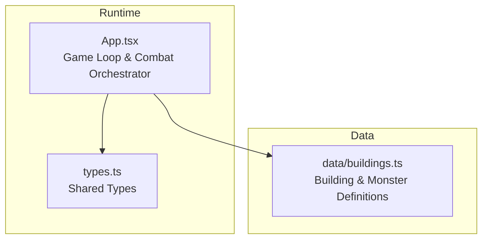
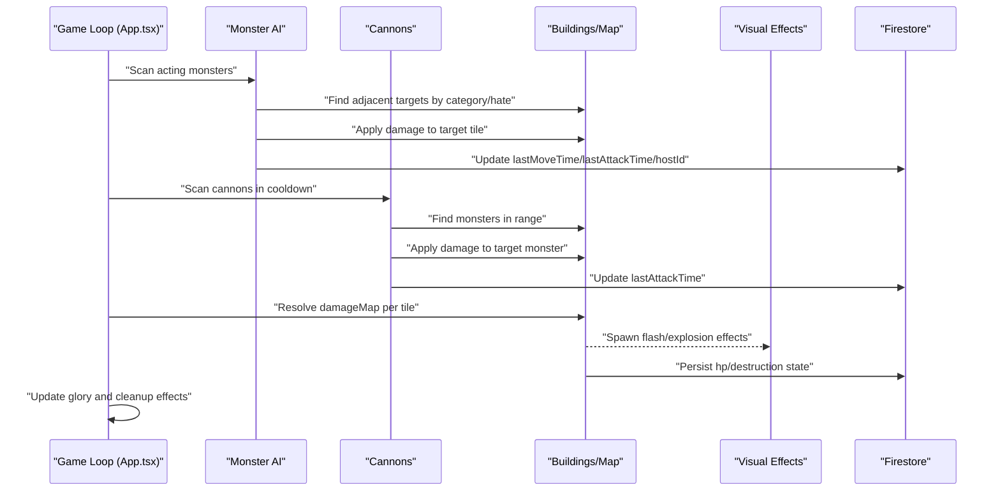
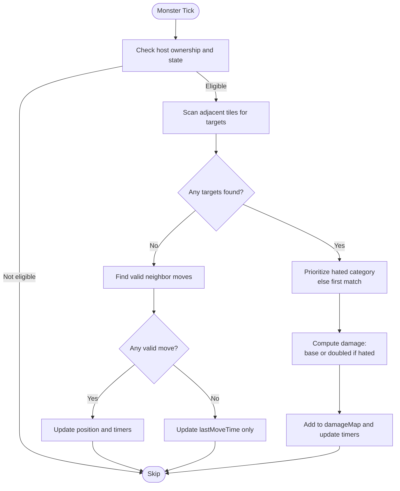
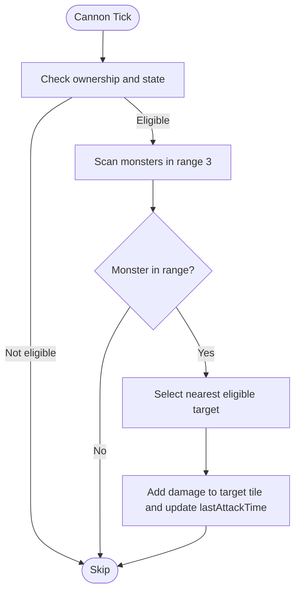
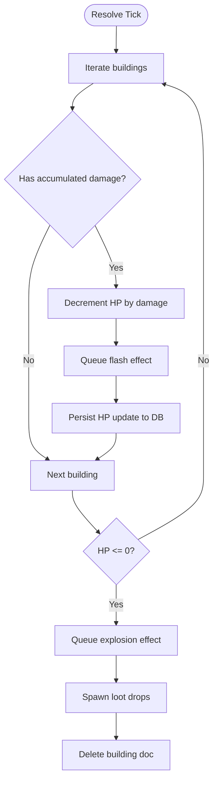
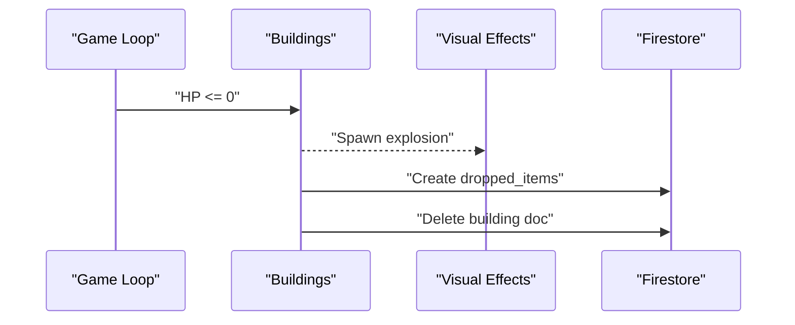
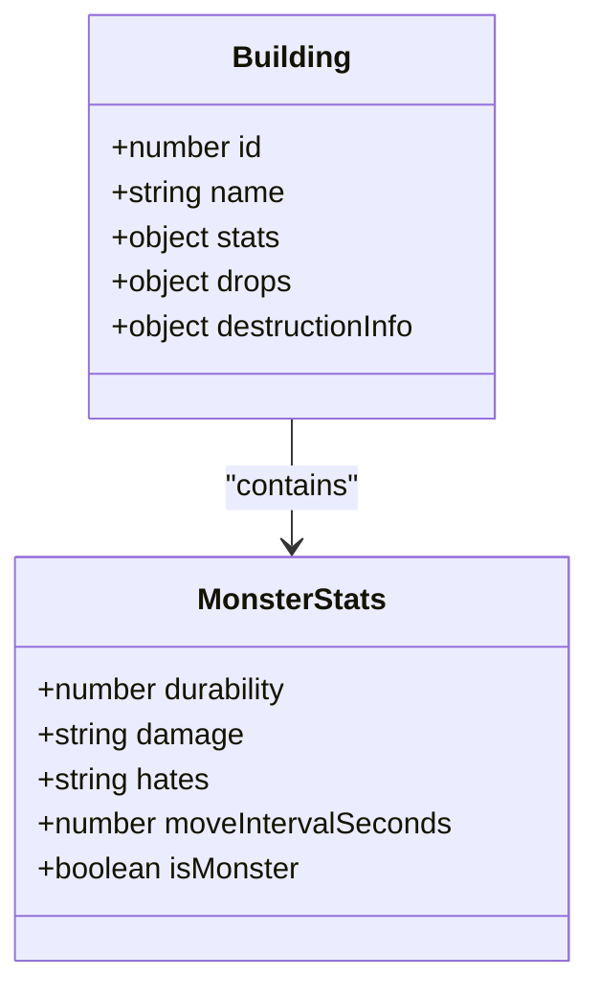
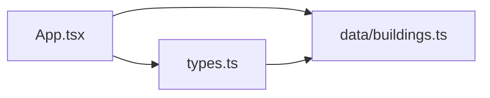

# Monster Combat System

<cite>
**Referenced Files in This Document**
- [App.tsx](file://App.tsx)
- [types.ts](file://types.ts)
- [buildings.ts](file://data/buildings.ts)
- [index.tsx](file://index.tsx)
</cite>

## Table of Contents
1. [Introduction](#introduction)
2. [Project Structure](#project-structure)
3. [Core Components](#core-components)
4. [Architecture Overview](#architecture-overview)
5. [Detailed Component Analysis](#detailed-component-analysis)
6. [Dependency Analysis](#dependency-analysis)
7. [Performance Considerations](#performance-considerations)
8. [Troubleshooting Guide](#troubleshooting-guide)
9. [Conclusion](#conclusion)

## Introduction
This document explains the monster combat system implemented in the game. It covers combat mechanics, damage calculations, combat resolution, and how combat integrates with building destruction, player building protection, and visual feedback. It also documents attack timing, hit detection algorithms, and combat state synchronization across players.

## Project Structure
The combat system is implemented in the main application loop and leverages shared data types and building definitions:
- Game loop and combat orchestration live in the main application component.
- Building and monster definitions define stats, categories, and damage properties.
- Shared types describe building state, destruction mechanics, and visual effects.

**Diagram sources**
- [App.tsx](file://App.tsx)
- [types.ts](file://types.ts)
- [buildings.ts](file://data/buildings.ts)

**Section sources**
- [index.tsx:1-20](file://index.tsx#L1-L20)
- [App.tsx:1-800](file://App.tsx#L1-L800)

## Core Components
- Monster AI and targeting: Monsters scan adjacent tiles and select targets based on hate categories and building type. They attack with periodic intervals and apply damage to targeted buildings.
- Cannon defense: Player-owned defensive structures scan for monsters within a fixed range and deal damage.
- Damage accumulation and resolution: Damage is accumulated per tile and applied to buildings at the end of the game tick. Buildings destroyed emit explosions and drop loot.
- Visual feedback: Flash and explosion effects are queued and rendered each frame.
- State synchronization: Updates to positions, timers, and health are persisted to Firestore when authorized.

**Section sources**
- [App.tsx:3290-3647](file://App.tsx#L3290-L3647)
- [types.ts:25-96](file://types.ts#L25-L96)
- [buildings.ts:4528-4657](file://data/buildings.ts#L4528-L4657)

## Architecture Overview
The combat system runs inside a continuous game loop. Each tick:
- Collects acting monsters and cannons eligible for action.
- Computes targets and damage for monsters and cannons.
- Applies accumulated damage to buildings and resolves destruction.
- Emits visual effects and updates player glory.
- Persists state changes to Firestore.

**Diagram sources**
- [App.tsx:3290-3647](file://App.tsx#L3290-L3647)

## Detailed Component Analysis

### Monster AI and Attack Timing
- Eligibility: A monster acts when it is hosted by the current client, not constructing/destroying, and the elapsed time since its last move exceeds its move interval.
- Targeting: Adjacent tiles are scanned for enemy buildings. Priority is given to hated categories; otherwise, any eligible business-type building is selected.
- Attack application: If eligible, damage equals the monster’s base damage, doubled if the target matches the monster’s hated category. Attack and move timers are updated.
- Movement fallback: If no adjacent target exists, the monster attempts a random valid neighbor move within world bounds and occupied-position constraints.

**Diagram sources**
- [App.tsx:3295-3399](file://App.tsx#L3295-L3399)

**Section sources**
- [App.tsx:3295-3399](file://App.tsx#L3295-L3399)

### Cannon Defense Mechanics
- Eligibility: Player-owned cannons outside construction/destroying state are eligible if their last attack time is beyond the 10-second cooldown.
- Targeting: Within Chebyshev range 3, the closest eligible monster is selected (not owned by the cannon’s owner).
- Damage application: Cannon damage is applied to the target via the damage map, and the cannon’s last attack time is updated.

**Diagram sources**
- [App.tsx:3401-3446](file://App.tsx#L3401-L3446)

**Section sources**
- [App.tsx:3401-3446](file://App.tsx#L3401-L3446)

### Damage Calculation and Resolution
- Accumulation: Damage is accumulated per target tile using a map keyed by coordinates.
- Application: At the end of the tick, each building’s HP is decremented by the accumulated damage for its tile. If HP reaches zero, the building is marked for destruction.
- Visual feedback: A flash effect is emitted immediately upon damage application; an explosion effect is emitted upon destruction.
- Persistence: Health updates and destruction state are written to Firestore when the current client is the owner or host.

**Diagram sources**
- [App.tsx:3448-3598](file://App.tsx#L3448-L3598)

**Section sources**
- [App.tsx:3448-3598](file://App.tsx#L3448-L3598)

### Building Destruction and Loot
- Destruction triggers: A building is removed when its HP falls to zero.
- Effects: Explosion visual effect is emitted at the building’s location.
- Loot: On destruction, loot drops are randomly spawned according to frequent and rare lists with configured chances. Drops are stored in Firestore and added to the in-game dropped items list.

**Diagram sources**
- [App.tsx:3527-3598](file://App.tsx#L3527-L3598)

**Section sources**
- [App.tsx:3527-3598](file://App.tsx#L3527-L3598)

### Monster Stats and Categories
Monster definitions specify:
- Base damage and hated categories that increase damage against matched targets.
- Durability and move intervals that govern combat and movement pacing.
- Drop tables for loot on destruction.

**Diagram sources**
- [buildings.ts:4528-4657](file://data/buildings.ts#L4528-L4657)
- [types.ts:42-96](file://types.ts#L42-L96)

**Section sources**
- [buildings.ts:4528-4657](file://data/buildings.ts#L4528-L4657)
- [types.ts:42-96](file://types.ts#L42-L96)

### Integration with Building Protection and Player Building Protection
- Player-owned buildings: Eligibility checks ensure only owner-controlled or authorized hosts update monster/cannon state.
- Host selection: Monsters track a host identifier; updates are only written when the current client matches the host or is the owner.
- Protection: While not explicitly shown in the referenced code, the presence of protection-related constants and UI elements indicates a broader protection system that complements combat mechanics.

**Section sources**
- [App.tsx:3345-3353](file://App.tsx#L3345-L3353)
- [App.tsx:3376-3388](file://App.tsx#L3376-L3388)
- [App.tsx:3438-3444](file://App.tsx#L3438-L3444)
- [App.tsx:3477-3485](file://App.tsx#L3477-L3485)
- [App.tsx:3547-3552](file://App.tsx#L3547-L3552)

### Combat Feedback Systems
- Visual effects: Flash effects accompany damage application; explosion effects accompany destruction.
- Glory rewards: Players gain glory when they destroy buildings, with increments persisted to Firestore.
- Effect lifecycle: Effects are cleaned up after their duration elapses.

**Section sources**
- [App.tsx:3512-3520](file://App.tsx#L3512-L3520)
- [App.tsx:3536-3543](file://App.tsx#L3536-L3543)
- [App.tsx:3608-3613](file://App.tsx#L3608-L3613)
- [App.tsx:3616-3620](file://App.tsx#L3616-L3620)

## Dependency Analysis
- App.tsx orchestrates combat logic and persists state to Firestore.
- types.ts defines shared structures for buildings, destruction info, and visual effects.
- data/buildings.ts defines monster stats, categories, and drop tables.

**Diagram sources**
- [App.tsx](file://App.tsx)
- [types.ts](file://types.ts)
- [buildings.ts](file://data/buildings.ts)

**Section sources**
- [types.ts:25-96](file://types.ts#L25-L96)
- [buildings.ts:4528-4657](file://data/buildings.ts#L4528-L4657)

## Performance Considerations
- Cooldown gating: Both monsters and cannons are gated by last-action timestamps to prevent excessive writes and redundant computations.
- Batch updates: State changes are collected and applied once per tick to minimize database round-trips.
- Occupancy tracking: A set of occupied positions avoids collisions during movement and reduces invalid move checks.
- Range queries: Cannon targeting uses Chebyshev distance for efficient neighborhood scanning.
- Effect cleanup: Visual effects are pruned after their duration to keep memory usage bounded.

[No sources needed since this section provides general guidance]

## Troubleshooting Guide
- Missing or insufficient permissions errors are ignored in the game loop to avoid noisy failures during expected race conditions.
- Construction timers: Construction completion is finalized by any observer when the timer elapses to prevent stale states.
- Future-dated timestamps: Cooldown eligibility accounts for timestamps that may temporarily exceed the current time.

**Section sources**
- [App.tsx:27-33](file://App.tsx#L27-L33)
- [App.tsx:3487-3497](file://App.tsx#L3487-L3497)
- [App.tsx:3279-3281](file://App.tsx#L3279-L3281)

## Conclusion
The monster combat system combines deterministic AI, efficient range targeting, and robust state synchronization to deliver responsive, fair, and visually engaging combat. Damage accumulation per tile simplifies conflict resolution, while visual feedback and glory rewards enhance player engagement. The system’s design supports scalability and maintainability through centralized data definitions and consistent persistence patterns.