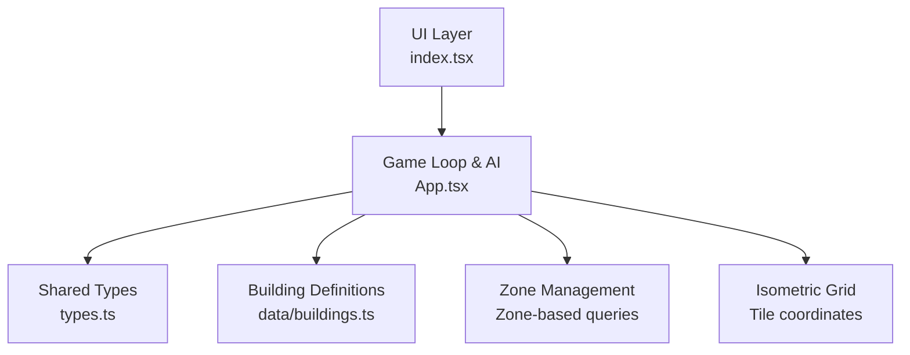
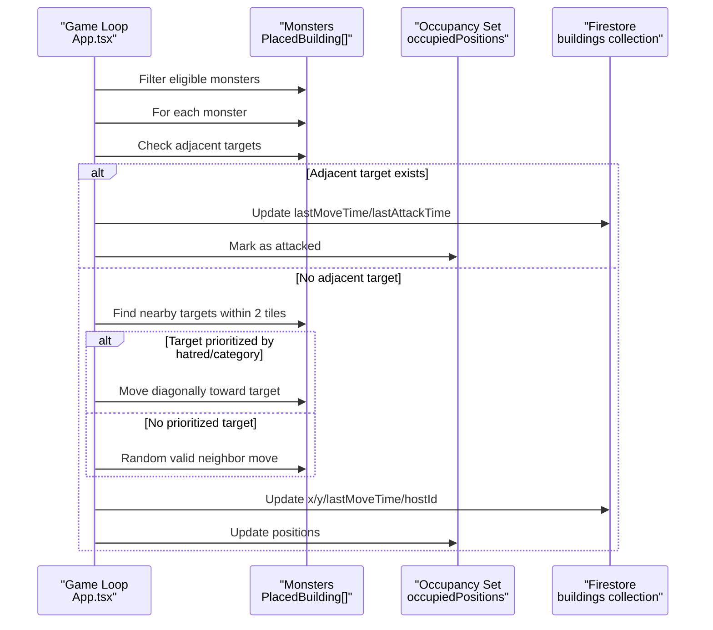
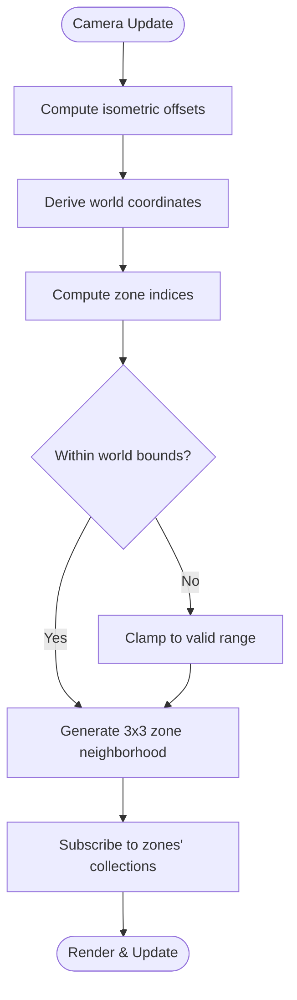
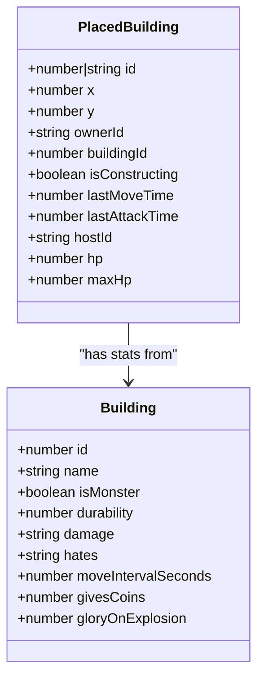
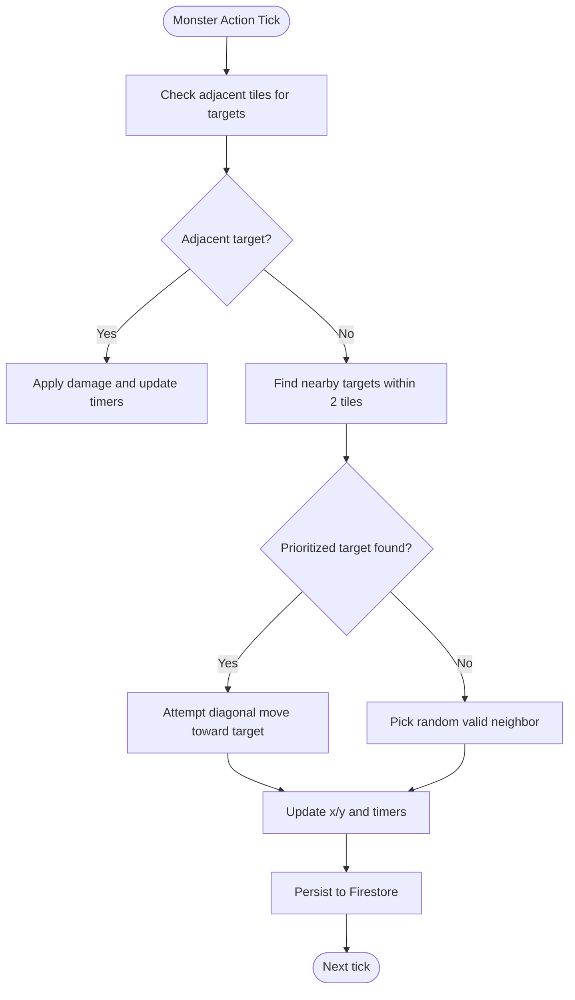
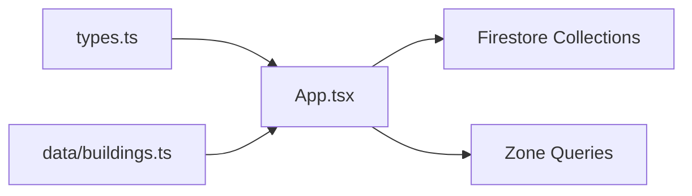

# Monster Pathfinding System

<cite>
**Referenced Files in This Document**
- [App.tsx](file://App.tsx)
- [types.ts](file://types.ts)
- [buildings.ts](file://data/buildings.ts)
- [update_monster_ai.ps1](file://update_monster_ai.ps1)
- [update_monster_ai_robust.ps1](file://update_monster_ai_robust.ps1)
- [index.tsx](file://index.tsx)
</cite>

## Table of Contents
1. [Introduction](#introduction)
2. [Project Structure](#project-structure)
3. [Core Components](#core-components)
4. [Architecture Overview](#architecture-overview)
5. [Detailed Component Analysis](#detailed-component-analysis)
6. [Dependency Analysis](#dependency-analysis)
7. [Performance Considerations](#performance-considerations)
8. [Troubleshooting Guide](#troubleshooting-guide)
9. [Conclusion](#conclusion)

## Introduction
This document explains the monster pathfinding and movement system implemented in the game. It covers how monsters select targets, move across the isometric grid, avoid obstacles (including buildings and terrain), and integrate with zone-based data partitioning. It also documents the movement mechanics for different monster types, speed variations, and terrain traversal costs, along with practical examples from the codebase and strategies for collision avoidance and performance optimization.

## Project Structure
The pathfinding logic is implemented in the main application file and supported by shared types and building definitions. Zone-based data partitioning is integrated with the rendering and game loop.

**Diagram sources**
- [index.tsx:1-20](file://index.tsx#L1-L20)
- [App.tsx:37-95](file://App.tsx#L37-L95)
- [types.ts:119-147](file://types.ts#L119-L147)
- [buildings.ts:4613-4657](file://data/buildings.ts#L4613-L4657)

**Section sources**
- [index.tsx:1-20](file://index.tsx#L1-L20)
- [App.tsx:37-95](file://App.tsx#L37-L95)

## Core Components
- Isometric grid and coordinate conversion: The game uses an isometric projection with tile width and height constants and provides conversions between world and screen coordinates.
- Zone-based data partitioning: The world is divided into fixed-size zones, and the camera position determines which zones are subscribed to for real-time updates.
- Monster entities: Monsters are represented as special buildings with stats that define movement intervals, damage, and categories that influence targeting.
- Movement and targeting logic: The game loop selects eligible monsters, checks adjacent targets, and either attacks or moves toward targets within a small radius.

**Section sources**
- [App.tsx:37-95](file://App.tsx#L37-L95)
- [App.tsx:780-820](file://App.tsx#L780-L820)
- [types.ts:119-147](file://types.ts#L119-L147)
- [buildings.ts:4613-4657](file://data/buildings.ts#L4613-L4657)

## Architecture Overview
The monster AI runs inside the main game loop. It identifies monsters under the responsibility of the current client, filters out those not due for action based on move intervals, and applies either attack or movement logic. Obstacles are derived from placed buildings and map resources. Movement avoids occupied positions and respects world bounds.

**Diagram sources**
- [App.tsx:3216-3400](file://App.tsx#L3216-L3400)
- [App.tsx:3308-3399](file://App.tsx#L3308-L3399)

## Detailed Component Analysis

### Isometric Coordinate System and Zone Partitioning
- World constants define tile dimensions and zoom levels. The camera offset and zoom influence the current zone calculation.
- Zone IDs are computed from world coordinates and used to subscribe to Firestore collections for map resources and buildings.
- The zone set is recalculated when the camera position changes, throttled to reduce subscription churn.

**Diagram sources**
- [App.tsx:780-820](file://App.tsx#L780-L820)
- [App.tsx:822-840](file://App.tsx#L822-L840)

**Section sources**
- [App.tsx:37-95](file://App.tsx#L37-L95)
- [App.tsx:780-820](file://App.tsx#L780-L820)
- [App.tsx:822-840](file://App.tsx#L822-L840)

### Monster Entities and Stats
- Monsters are represented as buildings with a dedicated flag and stats such as durability, damage, move interval, and a category that influences targeting.
- Example monster types include a killer hut, a kind santa, and a gorynych, each with distinct stats and behaviors.

**Diagram sources**
- [types.ts:119-147](file://types.ts#L119-L147)
- [buildings.ts:4613-4657](file://data/buildings.ts#L4613-L4657)

**Section sources**
- [types.ts:119-147](file://types.ts#L119-L147)
- [buildings.ts:4613-4657](file://data/buildings.ts#L4613-L4657)

### Movement Mechanics and Collision Avoidance
- Eligibility: Only monsters owned by the current client or unowned/neutral are processed. A per-monster lastMoveTime ensures periodic updates based on moveIntervalSeconds.
- Targeting: Adjacent targets are preferred; if none, the system searches within a small radius for targets categorized by the monster’s hatred field or default business category.
- Movement: If a target is found, the monster attacks; otherwise, it attempts diagonal movement toward the target or falls back to random valid neighbor moves. Occupied positions are tracked to prevent collisions.

**Diagram sources**
- [App.tsx:3308-3399](file://App.tsx#L3308-L3399)

**Section sources**
- [App.tsx:3247-3256](file://App.tsx#L3247-L3256)
- [App.tsx:3308-3399](file://App.tsx#L3308-L3399)

### Dynamic Path Recalculation and Waypoint Generation
- The system does not implement a traditional A* pathfinder. Instead, it uses a reactive approach:
  - Immediate adjacency check for attacks.
  - Small-radius (2-tile) seeker logic to move toward hated or business targets.
  - Random neighbor fallback when no valid moves remain.
- Waypoints are implicit: the next move is computed each tick based on current occupancy and target availability.

**Section sources**
- [App.tsx:3308-3399](file://App.tsx#L3308-L3399)
- [update_monster_ai.ps1:71-128](file://update_monster_ai.ps1#L71-L128)
- [update_monster_ai_robust.ps1:67-127](file://update_monster_ai_robust.ps1#L67-L127)

### Integration with Obstacle Detection (Buildings and Terrain)
- Obstacles are derived from:
  - Buildings with health > 0 or undefined health.
  - Map resources (trees, oil, quarries, chests).
- The occupiedPositions set is constructed from current buildings and resources and updated after each move.

**Section sources**
- [App.tsx:421-431](file://App.tsx#L421-L431)
- [App.tsx:3288-3289](file://App.tsx#L3288-L3289)

### Movement Speed Variations and Traversal Costs
- Movement speed is controlled by moveIntervalSeconds per monster type. The game loop enforces a minimum interval between actions.
- There is no explicit terrain traversal cost in the movement logic; mountains and rivers are treated as impassable via the adjacency and occupancy checks.

**Section sources**
- [App.tsx:3247-3256](file://App.tsx#L3247-L3256)
- [buildings.ts:4613-4657](file://data/buildings.ts#L4613-L4657)

### Concrete Examples from the Codebase
- Monster eligibility and host assignment:
  - [App.tsx:3234-3245](file://App.tsx#L3234-L3245)
  - [App.tsx:3247-3256](file://App.tsx#L3247-L3256)
- Target selection and attack logic:
  - [App.tsx:3317-3348](file://App.tsx#L3317-L3348)
- Movement toward target and random fallback:
  - [App.tsx:3364-3399](file://App.tsx#L3364-L3399)
- Zone-based subscriptions and throttled camera updates:
  - [App.tsx:780-820](file://App.tsx#L780-L820)
  - [App.tsx:822-840](file://App.tsx#L822-L840)

## Dependency Analysis
The monster AI depends on:
- Shared types for entity definitions.
- Building definitions for monster stats and categories.
- Firestore for persistence and synchronization of monster positions and states.
- Zone queries for efficient data loading.

**Diagram sources**
- [types.ts:119-147](file://types.ts#L119-L147)
- [buildings.ts:4613-4657](file://data/buildings.ts#L4613-L4657)
- [App.tsx:822-840](file://App.tsx#L822-L840)

**Section sources**
- [types.ts:119-147](file://types.ts#L119-L147)
- [buildings.ts:4613-4657](file://data/buildings.ts#L4613-L4657)
- [App.tsx:822-840](file://App.tsx#L822-L840)

## Performance Considerations
- Zone throttling: Camera updates are throttled to reduce Firestore re-subscriptions and improve responsiveness.
- Occupancy set reuse: The occupiedPositions set is recomputed each tick from current buildings and resources to minimize repeated scans.
- Minimal branching: Movement logic prefers immediate adjacency and small-radius seeking to keep computations lightweight.
- Host assignment: Only one client handles AI for neutral or owned monsters, preventing redundant actions.

Recommendations:
- Batch Firestore writes: Group updates for multiple monsters to reduce network overhead.
- Spatial indexing: Consider precomputing spatial structures (e.g., quadtree) for large worlds to accelerate obstacle queries.
- Predictive occupancy: Preemptively mark positions when a monster initiates a move to reduce conflicts.

[No sources needed since this section provides general guidance]

## Troubleshooting Guide
Common issues and resolutions:
- Monsters not moving: Verify moveIntervalSeconds and lastMoveTime updates; ensure the monster is hosted by the current client.
  - [App.tsx:3247-3256](file://App.tsx#L3247-L3256)
  - [App.tsx:3375-3399](file://App.tsx#L3375-L3399)
- Stuck in place: Conflicts arise when all neighbors are occupied; confirm occupancy updates occur after moves.
  - [App.tsx:3375-3399](file://App.tsx#L3375-L3399)
- Targeting anomalies: Confirm monster stats.hates and category filtering align with expectations.
  - [App.tsx:3317-3348](file://App.tsx#L3317-L3348)
- Zone subscription churn: Adjust throttle timing and ensure zone boundaries are calculated correctly.
  - [App.tsx:780-820](file://App.tsx#L780-L820)

**Section sources**
- [App.tsx:3247-3256](file://App.tsx#L3247-L3256)
- [App.tsx:3317-3348](file://App.tsx#L3317-L3348)
- [App.tsx:3375-3399](file://App.tsx#L3375-L3399)
- [App.tsx:780-820](file://App.tsx#L780-L820)

## Conclusion
The monster pathfinding system uses a reactive, low-complexity approach suited to real-time multiplayer: immediate adjacency checks, small-radius seeking, and random fallback movement. It integrates cleanly with the isometric grid and zone-based data partitioning, relying on Firestore for persistence and synchronization. While not a full A* implementation, the system is efficient and maintainable, with clear extension points for future enhancements such as spatial indexing and predictive occupancy.