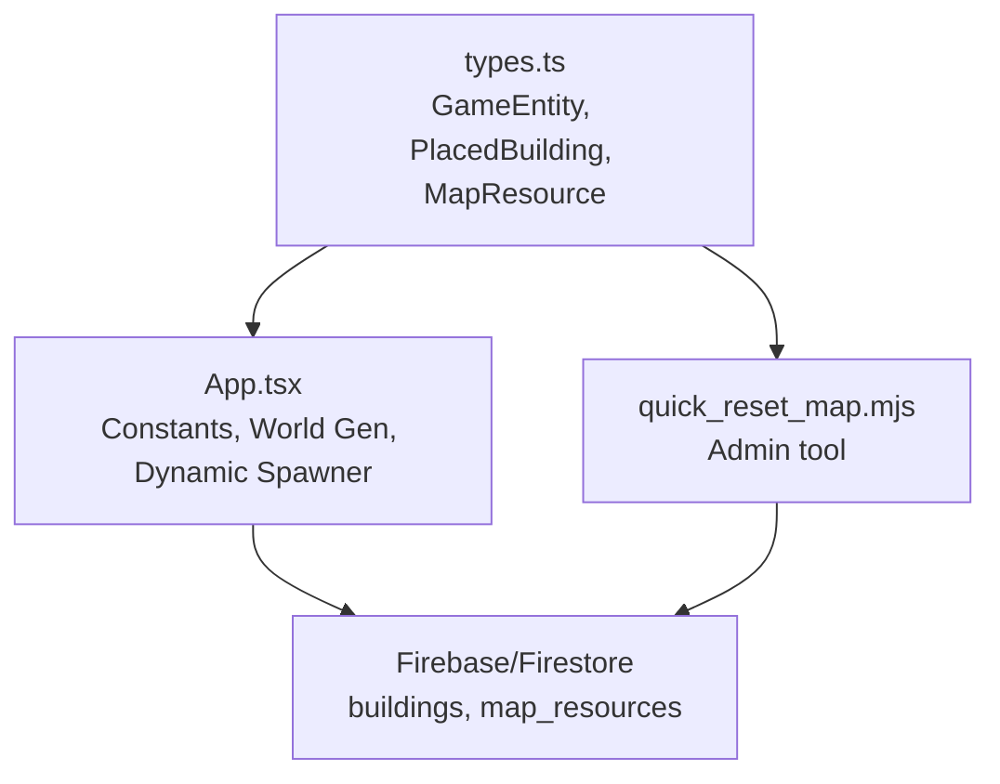
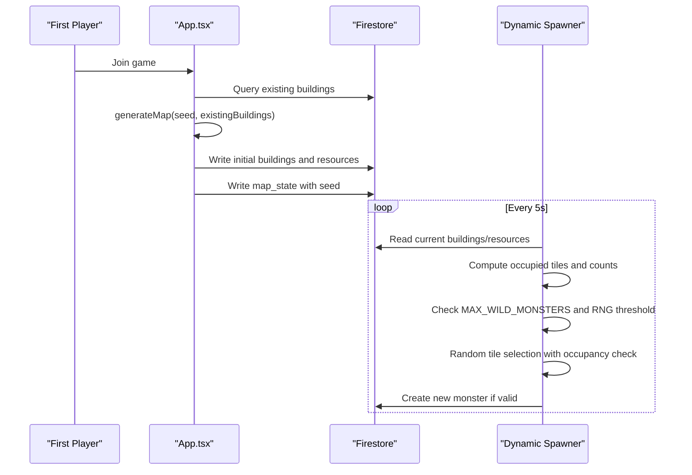
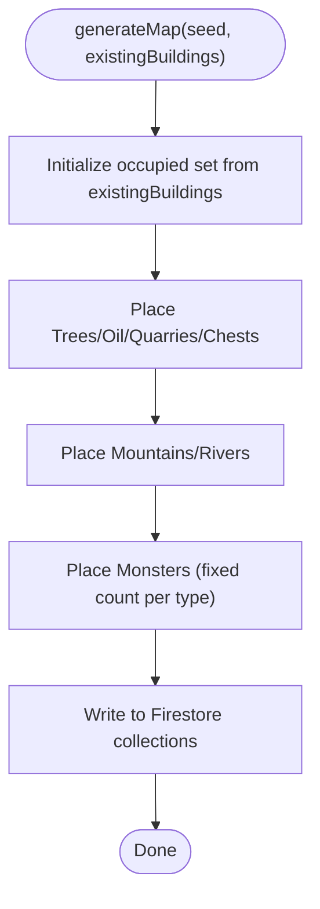
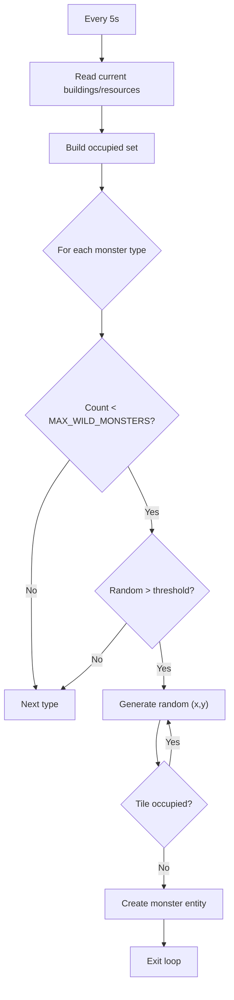
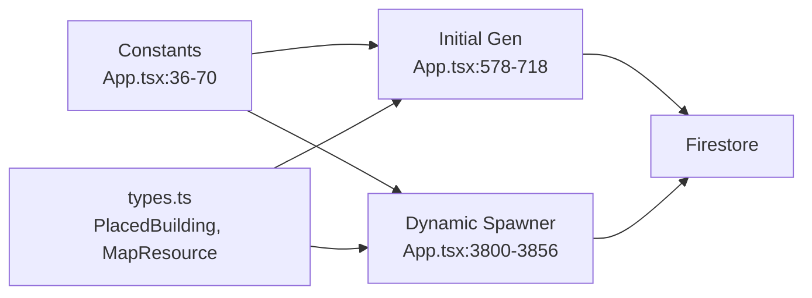

# Monster Spawning System

<cite>
**Referenced Files in This Document**
- [App.tsx](file://App.tsx)
- [quick_reset_map.mjs](file://quick_reset_map.mjs)
- [types.ts](file://types.ts)
</cite>

## Table of Contents
1. [Introduction](#introduction)
2. [Project Structure](#project-structure)
3. [Core Components](#core-components)
4. [Architecture Overview](#architecture-overview)
5. [Detailed Component Analysis](#detailed-component-analysis)
6. [Dependency Analysis](#dependency-analysis)
7. [Performance Considerations](#performance-considerations)
8. [Troubleshooting Guide](#troubleshooting-guide)
9. [Conclusion](#conclusion)

## Introduction
This document explains the monster spawning system in the realtime MMORTS world. It covers spawn mechanics during initial world generation, dynamic spawn management, population limits, spawn point selection, and environmental triggers. It also documents spawn constants, spawn locations, spawn conditions, and the integration with world generation and the spawn prevention system. Concrete examples are provided via file references and code snippet paths to actual implementation.

## Project Structure
The spawning system spans frontend game logic and a dedicated map reset script:
- Frontend game logic defines constants, spawn algorithms, and dynamic spawners.
- A Node.js script resets and regenerates the world, including monster placement.

**Diagram sources**
- [App.tsx:36-70](file://App.tsx#L36-L70)
- [App.tsx:578-718](file://App.tsx#L578-L718)
- [App.tsx:3800-3856](file://App.tsx#L3800-L3856)
- [quick_reset_map.mjs:14-67](file://quick_reset_map.mjs#L14-L67)
- [types.ts:100-147](file://types.ts#L100-L147)

**Section sources**
- [App.tsx:36-70](file://App.tsx#L36-L70)
- [App.tsx:578-718](file://App.tsx#L578-L718)
- [App.tsx:3800-3856](file://App.tsx#L3800-L3856)
- [quick_reset_map.mjs:14-67](file://quick_reset_map.mjs#L14-L67)
- [types.ts:100-147](file://types.ts#L100-L147)

## Core Components
- Spawn constants and IDs
  - World dimensions and zones: WORLD_WIDTH_TILES, WORLD_HEIGHT_TILES, ZONE_SIZE, getZoneId.
  - Population cap: MAX_WILD_MONSTERS.
  - Monster type IDs: KILLING_HUT_ID, KIND_SANTA_ID, GORYNYCH_ID.
- Initial world generation
  - Random placement with occupancy checks via tryPlace(maxTries).
  - Spawns a small fixed count per monster type during first map generation.
- Dynamic spawning
  - Periodic spawner checks current counts, validates spawn conditions, selects random positions, avoids occupied tiles, and creates new monsters.
- Environmental triggers
  - Zone-based resource seeding can indirectly influence monster presence by altering terrain and resource distribution.
- Spawn prevention system
  - Occupancy sets prevent overlapping spawns.
  - Count checks enforce MAX_WILD_MONSTERS.

**Section sources**
- [App.tsx:36-70](file://App.tsx#L36-L70)
- [App.tsx:590-604](file://App.tsx#L590-L604)
- [App.tsx:687-715](file://App.tsx#L687-L715)
- [App.tsx:3800-3856](file://App.tsx#L3800-L3856)
- [App.tsx:907-932](file://App.tsx#L907-L932)

## Architecture Overview
The spawning system integrates three layers:
- Constants and configuration define world geometry, caps, and monster identities.
- Initial world generator populates the map with resources and monsters using deterministic randomness seeded by the first joining player.
- Dynamic spawner periodically enforces population limits and spawns new monsters at random locations outside occupied tiles.

**Diagram sources**
- [App.tsx:750-778](file://App.tsx#L750-L778)
- [App.tsx:578-718](file://App.tsx#L578-L718)
- [App.tsx:3800-3856](file://App.tsx#L3800-L3856)

## Detailed Component Analysis

### Initial World Generation Spawning
- Purpose: Populate the map with a balanced set of resources and a small number of monsters at first boot.
- Mechanics:
  - Uses a seeded pseudo-random generator to ensure reproducible world layout.
  - tryPlace(maxTries) selects random tiles within WORLD_WIDTH_TILES × WORLD_HEIGHT_TILES, rejects occupied keys, and records placement.
  - Iterates over predefined counts for trees, oil, quarries, chests, mountains, and rivers.
  - Spawns a small fixed number of monsters per type (e.g., a few per type) using the same placement routine.
- Data structures:
  - PlacedBuilding for monsters and static features.
  - MapResource for trees, oil, quarries, chests.
- Conditions:
  - Placement occurs only if the tile is unoccupied.
  - Counts are bounded by constants (e.g., MAX_OIL_DEPOSITS, MAX_QUARRIES, MAX_MOUNTAINS, MAX_RIVERS).

**Diagram sources**
- [App.tsx:578-718](file://App.tsx#L578-L718)
- [App.tsx:590-604](file://App.tsx#L590-L604)

**Section sources**
- [App.tsx:578-718](file://App.tsx#L578-L718)
- [App.tsx:590-604](file://App.tsx#L590-L604)

### Dynamic Spawning Algorithm
- Purpose: Maintain a controlled population of wild monsters across the world.
- Mechanics:
  - Runs periodically (every 5 seconds).
  - Builds an occupancy set from current map_resources and active buildings.
  - For each monster type, checks current count against MAX_WILD_MONSTERS.
  - Applies a spawn chance threshold (random roll) to avoid guaranteed spawns every tick.
  - Repeatedly generates random coordinates until an unoccupied tile is found or maxTries exceeded.
  - Creates a new monster with stats derived from buildingData and marks it active.
- Data structures:
  - PlacedBuilding with stats for HP, movement intervals, and targeting attributes.
- Conditions:
  - Count must be below MAX_WILD_MONSTERS.
  - Random chance must pass.
  - Tile must be unoccupied.

**Diagram sources**
- [App.tsx:3800-3856](file://App.tsx#L3800-L3856)

**Section sources**
- [App.tsx:3800-3856](file://App.tsx#L3800-L3856)

### Spawn Point Selection and Validation
- Selection:
  - Random coordinates within WORLD_WIDTH_TILES × WORLD_HEIGHT_TILES.
  - Rejection sampling via do-while loop with maxTries to ensure unoccupied tiles.
- Validation:
  - Occupancy set includes both map_resources and active buildings.
  - Zone assignment computed via getZoneId.
- Prevention:
  - Occupancy prevents overlap.
  - Count cap prevents overpopulation.

**Section sources**
- [App.tsx:3800-3856](file://App.tsx#L3800-L3856)

### Spawn Locations and Distribution
- World bounds:
  - Spawns occur within WORLD_WIDTH_TILES × WORLD_HEIGHT_TILES grid.
- Distribution:
  - Uniform random distribution across the grid.
  - Zone-aware placement via getZoneId.
- Environmental influence:
  - Zone-based resource seeding can indirectly affect spawn density by altering terrain and resource availability.

**Section sources**
- [App.tsx:36-70](file://App.tsx#L36-L70)
- [App.tsx:907-932](file://App.tsx#L907-L932)

### Spawn State Management
- Entity representation:
  - PlacedBuilding carries spawn state (position, HP, lastMoveTime, isActive, ownerId, hostId).
- Persistence:
  - New monsters are written to Firestore under the buildings collection.
- Cleanup:
  - Destruction logic reduces HP to zero and deletes entities when appropriate.

**Section sources**
- [types.ts:119-147](file://types.ts#L119-L147)
- [App.tsx:3828-3850](file://App.tsx#L3828-L3850)

### Integration with World Generation and Spawn Prevention
- First-player-triggered generation seeds the map and establishes baseline resources and monsters.
- Subsequent dynamic spawning respects the spawn prevention system (occupancy and count caps) to maintain balance.

**Section sources**
- [App.tsx:750-778](file://App.tsx#L750-L778)
- [App.tsx:3800-3856](file://App.tsx#L3800-L3856)

### Admin Tool: Quick Reset and Spawn
- Purpose: Rapidly reset and regenerate the world, including monsters.
- Mechanics:
  - Deletes existing resources and system-owned buildings.
  - Regenerates trees, oil, quarries, chests, mountains, rivers, and monsters.
  - Uses batched writes and retry-safe creation.
- Constants:
  - WORLD_W, WORLD_H, ZONE_SIZE, INITIAL_TREES, MAX_MOUNTAINS, MAX_RIVERS, MAX_OIL, MAX_QUARRIES, MAX_CHESTS, MONSTERS_PER_TYPE.
  - Monster stats keyed by type ID.

**Section sources**
- [quick_reset_map.mjs:14-67](file://quick_reset_map.mjs#L14-L67)
- [quick_reset_map.mjs:153-247](file://quick_reset_map.mjs#L153-L247)

## Dependency Analysis
- Constants and IDs
  - WORLD_WIDTH_TILES, WORLD_HEIGHT_TILES, ZONE_SIZE, getZoneId define spatial constraints.
  - MAX_WILD_MONSTERS controls population cap.
  - KILLING_HUT_ID, KIND_SANTA_ID, GORYNYCH_ID identify monster types.
- Initial generation depends on:
  - buildingData for stats and categories.
  - tryPlace for placement.
- Dynamic spawner depends on:
  - current snapshot of buildings and resources.
  - occupancy set computation.
  - RNG thresholds and count checks.

**Diagram sources**
- [App.tsx:36-70](file://App.tsx#L36-L70)
- [App.tsx:578-718](file://App.tsx#L578-L718)
- [App.tsx:3800-3856](file://App.tsx#L3800-L3856)
- [types.ts:100-147](file://types.ts#L100-L147)

**Section sources**
- [App.tsx:36-70](file://App.tsx#L36-L70)
- [App.tsx:578-718](file://App.tsx#L578-L718)
- [App.tsx:3800-3856](file://App.tsx#L3800-L3856)
- [types.ts:100-147](file://types.ts#L100-L147)

## Performance Considerations
- Occupancy checks:
  - Using Sets for occupied tiles ensures O(1) average-time membership tests.
- Batched writes:
  - The admin tool batches writes to reduce load and improve throughput.
- RNG and rejection sampling:
  - maxTries bounds worst-case placement attempts.
- Zone-based seeding:
  - Limits regeneration scope to underpopulated sectors, reducing unnecessary writes.

[No sources needed since this section provides general guidance]

## Troubleshooting Guide
- Symptom: Too few or too many monsters
  - Verify MAX_WILD_MONSTERS and spawn chance thresholds.
  - Confirm occupancy set includes both resources and buildings.
- Symptom: Monsters overlap or spawn inside structures
  - Ensure tryPlace and dynamic spawner both consult the same occupancy set.
- Symptom: Spawns fail silently
  - Check Firestore permissions and error handling paths.
- Symptom: Zone appears empty after reload
  - Confirm zone-based seeding logic runs and writes resources within the zone’s bounds.

**Section sources**
- [App.tsx:3800-3856](file://App.tsx#L3800-L3856)
- [App.tsx:907-932](file://App.tsx#L907-L932)

## Conclusion
The monster spawning system combines deterministic initial generation with probabilistic dynamic spawning. It enforces population limits, avoids overlaps, and integrates with world generation and zone-based resource seeding. The admin tool supports rapid reset and regeneration, ensuring a robust and scalable spawning pipeline.