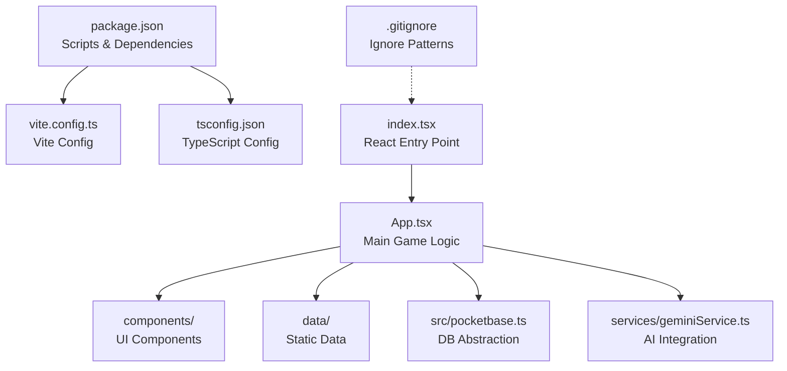
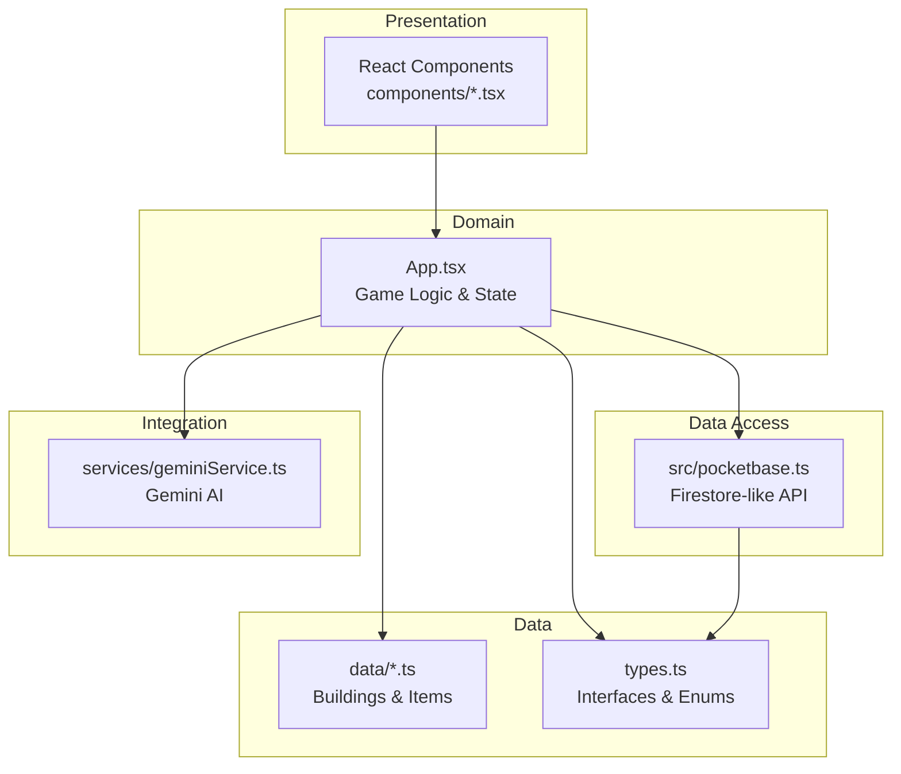

# Contributing Guidelines

<cite>
**Referenced Files in This Document**
- [package.json](file://package.json)
- [vite.config.ts](file://vite.config.ts)
- [tsconfig.json](file://tsconfig.json)
- [README.md](file://README.md)
- [index.tsx](file://index.tsx)
- [App.tsx](file://App.tsx)
- [components/ErrorBoundary.tsx](file://components/ErrorBoundary.tsx)
- [components/IconComponents.tsx](file://components/IconComponents.tsx)
- [components/SearchBar.tsx](file://components/SearchBar.tsx)
- [src/pocketbase.ts](file://src/pocketbase.ts)
- [services/geminiService.ts](file://services/geminiService.ts)
- [data/buildings.ts](file://data/buildings.ts)
- [data/items.ts](file://data/items.ts)
- [types.ts](file://types.ts)
- [.gitignore](file://.gitignore)
</cite>

## Table of Contents
1. [Introduction](#introduction)
2. [Project Structure](#project-structure)
3. [Core Components](#core-components)
4. [Architecture Overview](#architecture-overview)
5. [Development Workflow](#development-workflow)
6. [Testing Procedures](#testing-procedures)
7. [Coding Standards](#coding-standards)
8. [Documentation Standards](#documentation-standards)
9. [Pull Request Process](#pull-request-process)
10. [Quality Assurance](#quality-assurance)
11. [Troubleshooting Guide](#troubleshooting-guide)
12. [Conclusion](#conclusion)

## Introduction
This document defines the contribution workflow and standards for the Real-Time Strategy game project. It covers development setup, coding conventions, testing, pull request procedures, and quality practices. The project is a Vite + React + TypeScript application with a PocketBase backend and optional AI integration via Google Gemini.

## Project Structure
The repository follows a feature-based layout with clear separation of concerns:
- Root configuration files define scripts, dependencies, and build settings.
- Frontend entry point initializes React and wraps the App with an Error Boundary.
- App.tsx orchestrates game logic, state, UI, and integrations.
- Components are organized under components/.
- Data definitions and constants live under data/.
- Backend abstraction and database helpers are under src/.
- AI service integration is under services/.

**Diagram sources**
- [package.json:1-31](file://package.json#L1-L31)
- [vite.config.ts:1-29](file://vite.config.ts#L1-L29)
- [tsconfig.json:1-29](file://tsconfig.json#L1-L29)
- [index.tsx:1-20](file://index.tsx#L1-L20)
- [App.tsx:1-120](file://App.tsx#L1-L120)
- [.gitignore:1-25](file://.gitignore#L1-L25)

**Section sources**
- [package.json:1-31](file://package.json#L1-L31)
- [vite.config.ts:1-29](file://vite.config.ts#L1-L29)
- [tsconfig.json:1-29](file://tsconfig.json#L1-L29)
- [index.tsx:1-20](file://index.tsx#L1-L20)
- [README.md:1-21](file://README.md#L1-L21)
- [.gitignore:1-25](file://.gitignore#L1-L25)

## Core Components
- Application bootstrap and rendering are handled in index.tsx, which mounts the App inside an Error Boundary.
- App.tsx is the central orchestrator for game state, UI, and integrations with PocketBase and AI services.
- Components folder contains reusable UI elements such as icons and a generic SearchBar.
- Data files define typed building and item definitions used across the game.
- Types.ts centralizes shared TypeScript interfaces and enums.
- src/pocketbase.ts abstracts PocketBase operations to a Firestore-like API surface.
- services/geminiService.ts integrates with Google Gemini for dynamic content generation.

**Section sources**
- [index.tsx:1-20](file://index.tsx#L1-L20)
- [App.tsx:1-120](file://App.tsx#L1-L120)
- [components/IconComponents.tsx:1-187](file://components/IconComponents.tsx#L1-L187)
- [components/SearchBar.tsx:1-29](file://components/SearchBar.tsx#L1-L29)
- [data/buildings.ts:1-120](file://data/buildings.ts#L1-L120)
- [data/items.ts:1-120](file://data/items.ts#L1-L120)
- [types.ts:1-197](file://types.ts#L1-L197)
- [src/pocketbase.ts:1-120](file://src/pocketbase.ts#L1-L120)
- [services/geminiService.ts:1-43](file://services/geminiService.ts#L1-L43)

## Architecture Overview
The application uses a layered architecture:
- Presentation Layer: React components and UI logic.
- Domain Layer: Game logic, state derivation, and UI state management in App.tsx.
- Data Access Layer: src/pocketbase.ts provides a Firestore-like API over PocketBase.
- Data Layer: Static data definitions under data/ and shared types under types.ts.
- Integration Layer: services/geminiService.ts for AI-driven content.

**Diagram sources**
- [App.tsx:1-120](file://App.tsx#L1-L120)
- [src/pocketbase.ts:1-120](file://src/pocketbase.ts#L1-L120)
- [data/buildings.ts:1-120](file://data/buildings.ts#L1-L120)
- [data/items.ts:1-120](file://data/items.ts#L1-L120)
- [types.ts:1-197](file://types.ts#L1-L197)
- [services/geminiService.ts:1-43](file://services/geminiService.ts#L1-L43)

## Development Workflow
Follow these steps to contribute effectively:

1. Fork and clone the repository.
2. Install dependencies using the project’s package manager.
3. Create a feature branch for your changes.
4. Develop locally using the Vite dev server.
5. Commit with clear messages and push to your fork.
6. Open a Pull Request targeting the main branch.

Environment setup and prerequisites are documented in the repository’s README.

**Section sources**
- [README.md:11-21](file://README.md#L11-L21)
- [package.json:6-11](file://package.json#L6-L11)

## Testing Procedures
- Linting: Run TypeScript compilation in no-emit mode to catch type errors during development.
- Local preview: Use the Vite preview script to validate builds locally.
- Manual verification: Test UI interactions, state transitions, and PocketBase integration paths.
- AI integration: Verify Gemini service behavior when API keys are present or absent.

Note: There are no automated test runner scripts defined in the repository. Prefer manual verification guided by the build and lint scripts.

**Section sources**
- [package.json:10](file://package.json#L10)
- [package.json:9](file://package.json#L9)

## Coding Standards
- TypeScript best practices
  - Use strict compiler options and isolated modules for type safety.
  - Prefer functional patterns with React hooks and memoization where appropriate.
  - Keep interfaces cohesive and centralized in types.ts.
- React component patterns
  - Stateless functional components for presentational logic.
  - Use memoization and callbacks to optimize renders.
  - Centralize error handling with ErrorBoundary.
- Naming conventions
  - Use PascalCase for components and interfaces.
  - Use camelCase for variables and props.
  - Keep file names descriptive and aligned with their responsibilities.
- Data modeling
  - Define all game entities in types.ts and reference them consistently.
  - Keep static data in data/*.ts with clear structure and categories.
- Backend integration
  - Abstract database operations behind src/pocketbase.ts to maintain portability.
  - Sanitize IDs to meet backend requirements and handle edge cases.
- AI integration
  - Guard AI features with environment checks and provide graceful fallbacks.

**Section sources**
- [tsconfig.json:2-28](file://tsconfig.json#L2-L28)
- [types.ts:1-197](file://types.ts#L1-L197)
- [components/ErrorBoundary.tsx:1-78](file://components/ErrorBoundary.tsx#L1-L78)
- [src/pocketbase.ts:252-276](file://src/pocketbase.ts#L252-L276)
- [services/geminiService.ts:4-8](file://services/geminiService.ts#L4-L8)

## Documentation Standards
- Inline documentation
  - Add concise comments for complex logic in App.tsx and src/pocketbase.ts.
  - Document exported functions and interfaces in types.ts.
- Component documentation
  - Include prop descriptions and usage notes for components in components/.
- Data documentation
  - Maintain clear categories and descriptions in data/buildings.ts and data/items.ts.
- README maintenance
  - Keep installation and setup instructions accurate and up-to-date.

**Section sources**
- [types.ts:1-197](file://types.ts#L1-L197)
- [data/buildings.ts:1-120](file://data/buildings.ts#L1-L120)
- [data/items.ts:1-120](file://data/items.ts#L1-L120)
- [README.md:1-21](file://README.md#L1-L21)

## Pull Request Process
- Branching
  - Create feature branches prefixed with feature/, fix/, or chore/.
- Commits
  - Write clear, focused commit messages describing the change.
- Review
  - Request reviews from maintainers for significant changes.
  - Address feedback promptly and update the PR accordingly.
- Merge
  - Squash or rebase commits before merging to keep history clean.
  - Ensure CI passes (lint/build) and all checks succeed.

[No sources needed since this section provides general guidance]

## Quality Assurance
- Build validation
  - Confirm builds succeed using the build script.
- Linting
  - Run TypeScript compilation in no-emit mode to catch type errors.
- Runtime stability
  - Use ErrorBoundary to gracefully handle unexpected errors.
- Data integrity
  - Validate PocketBase ID sanitization and query filters.
- Performance
  - Minimize unnecessary re-renders with memoization and derived state.
  - Throttle heavy operations (e.g., zone updates) to reduce backend load.

**Section sources**
- [package.json:8](file://package.json#L8)
- [package.json:10](file://package.json#L10)
- [components/ErrorBoundary.tsx:14-78](file://components/ErrorBoundary.tsx#L14-L78)
- [src/pocketbase.ts:252-276](file://src/pocketbase.ts#L252-L276)

## Troubleshooting Guide
- Environment variables
  - Ensure the Gemini API key is configured when AI features are needed.
- Build issues
  - Clean node_modules and reinstall dependencies if build artifacts appear stale.
- Runtime errors
  - Use the ErrorBoundary to capture and display meaningful error messages.
- Database connectivity
  - Verify PocketBase endpoint configuration and client ID handling.
- AI integration
  - Check for API key warnings and confirm fallback behavior.

**Section sources**
- [services/geminiService.ts:4-8](file://services/geminiService.ts#L4-L8)
- [components/ErrorBoundary.tsx:24-78](file://components/ErrorBoundary.tsx#L24-L78)
- [src/pocketbase.ts:8-12](file://src/pocketbase.ts#L8-L12)
- [src/pocketbase.ts:787-800](file://src/pocketbase.ts#L787-L800)

## Conclusion
These guidelines ensure consistent development, high-quality code, and smooth collaboration. Follow the workflow, adhere to coding standards, and leverage the provided tools and abstractions to deliver reliable features and improvements.