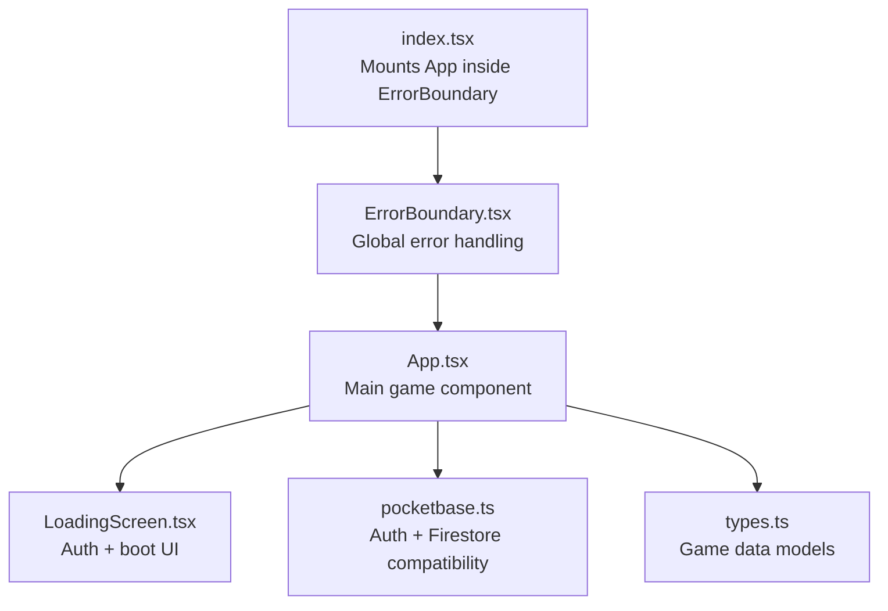
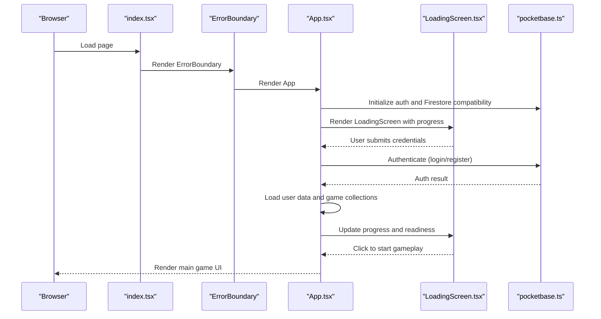
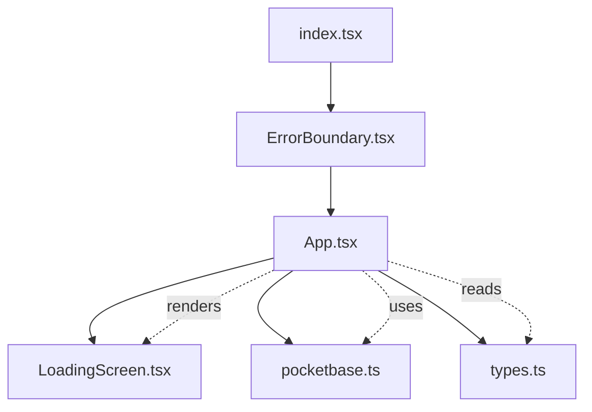

# Component Lifecycle Integration

<cite>
**Referenced Files in This Document**
- [index.tsx](file://index.tsx)
- [App.tsx](file://App.tsx)
- [LoadingScreen.tsx](file://LoadingScreen.tsx)
- [ErrorBoundary.tsx](file://components/ErrorBoundary.tsx)
- [pocketbase.ts](file://src/pocketbase.ts)
- [types.ts](file://types.ts)
</cite>

## Table of Contents
1. [Introduction](#introduction)
2. [Project Structure](#project-structure)
3. [Core Components](#core-components)
4. [Architecture Overview](#architecture-overview)
5. [Detailed Component Analysis](#detailed-component-analysis)
6. [Dependency Analysis](#dependency-analysis)
7. [Performance Considerations](#performance-considerations)
8. [Troubleshooting Guide](#troubleshooting-guide)
9. [Conclusion](#conclusion)

## Introduction
This document explains how the main App component coordinates the application lifecycle, integrates the LoadingScreen, and orchestrates authentication and game data initialization. It details the relationship between index.tsx, App.tsx, and LoadingScreen.tsx, and describes the initialization sequence, error handling during startup, and coordination of multiple asynchronous operations during game bootstrapping.

## Project Structure
The application follows a React-based structure with a strict entry point and a single-page application pattern. The entry point mounts the root component inside an error boundary to provide robust error handling.

**Diagram sources**
- [index.tsx:1-20](file://index.tsx#L1-L20)
- [ErrorBoundary.tsx:1-78](file://components/ErrorBoundary.tsx#L1-L78)
- [App.tsx:1-120](file://App.tsx#L1-L120)
- [LoadingScreen.tsx:1-60](file://LoadingScreen.tsx#L1-L60)
- [pocketbase.ts:1-120](file://src/pocketbase.ts#L1-L120)
- [types.ts:1-60](file://types.ts#L1-L60)

**Section sources**
- [index.tsx:1-20](file://index.tsx#L1-L20)
- [App.tsx:1-120](file://App.tsx#L1-L120)
- [LoadingScreen.tsx:1-60](file://LoadingScreen.tsx#L1-L60)
- [ErrorBoundary.tsx:1-78](file://components/ErrorBoundary.tsx#L1-L78)
- [pocketbase.ts:1-120](file://src/pocketbase.ts#L1-L120)
- [types.ts:1-60](file://types.ts#L1-L60)

## Core Components
- index.tsx: Creates the React root and mounts the application within an ErrorBoundary.
- App.tsx: Orchestrates authentication, game data synchronization, LoadingScreen visibility, and rendering of the main game UI.
- LoadingScreen.tsx: Provides the authentication UI and boot progress visualization; controls transition to gameplay.
- ErrorBoundary.tsx: Catches unhandled errors and offers a reset mechanism.
- pocketbase.ts: Provides Firebase-like auth and Firestore compatibility wrappers around PocketBase.
- types.ts: Defines game data structures used across the app.

**Section sources**
- [index.tsx:1-20](file://index.tsx#L1-L20)
- [App.tsx:255-380](file://App.tsx#L255-L380)
- [LoadingScreen.tsx:5-41](file://LoadingScreen.tsx#L5-L41)
- [ErrorBoundary.tsx:14-31](file://components/ErrorBoundary.tsx#L14-L31)
- [pocketbase.ts:13-121](file://src/pocketbase.ts#L13-L121)
- [types.ts:100-147](file://types.ts#L100-L147)

## Architecture Overview
The lifecycle begins at the entry point, proceeds through authentication and data bootstrap, and transitions to the LoadingScreen before entering gameplay. The LoadingScreen coordinates user interaction and progress updates, while App.tsx manages state, subscriptions, and UI rendering.

**Diagram sources**
- [index.tsx:12-19](file://index.tsx#L12-L19)
- [App.tsx:1677-1753](file://App.tsx#L1677-L1753)
- [App.tsx:5896-5918](file://App.tsx#L5896-L5918)
- [LoadingScreen.tsx:45-50](file://LoadingScreen.tsx#L45-L50)
- [pocketbase.ts:13-121](file://src/pocketbase.ts#L13-L121)

## Detailed Component Analysis

### Entry Point Coordination (index.tsx)
- Creates the root and mounts the application within an ErrorBoundary.
- Ensures the DOM element exists before mounting.
- Wraps the App with React.StrictMode for development diagnostics.

**Section sources**
- [index.tsx:7-19](file://index.tsx#L7-L19)

### Error Boundary Integration (ErrorBoundary.tsx)
- Catches unhandled errors from child components.
- Displays a friendly error message and a reset button.
- Resets the application state and reloads the page on user action.

**Section sources**
- [ErrorBoundary.tsx:14-31](file://components/ErrorBoundary.tsx#L14-L31)
- [ErrorBoundary.tsx:33-74](file://components/ErrorBoundary.tsx#L33-L74)

### Authentication and Initialization (App.tsx)
- Initializes authentication state and user context.
- Handles login and registration flows with form submission.
- Loads user data from the backend and sets initial player state.
- Manages readiness flags and triggers LoadingScreen progress updates.

Key behaviors:
- Authentication flow: [App.tsx:1677-1753](file://App.tsx#L1677-L1753)
- User data loading: [App.tsx:1768-1819](file://App.tsx#L1768-L1819)
- Loading progress and readiness: [App.tsx:5896-5918](file://App.tsx#L5896-L5918)

**Section sources**
- [App.tsx:1677-1753](file://App.tsx#L1677-L1753)
- [App.tsx:1768-1819](file://App.tsx#L1768-L1819)
- [App.tsx:5896-5918](file://App.tsx#L5896-L5918)

### LoadingScreen Integration (LoadingScreen.tsx)
- Provides the authentication UI and boot progress visualization.
- Controls the transition to gameplay when ready.
- Accepts props for user state, progress, and callbacks.

Behavior:
- Progress bar and readiness state: [LoadingScreen.tsx:148-153](file://LoadingScreen.tsx#L148-L153)
- Click-to-start interaction: [LoadingScreen.tsx:45-50](file://LoadingScreen.tsx#L45-L50)

**Section sources**
- [LoadingScreen.tsx:5-41](file://LoadingScreen.tsx#L5-L41)
- [LoadingScreen.tsx:148-153](file://LoadingScreen.tsx#L148-L153)
- [LoadingScreen.tsx:45-50](file://LoadingScreen.tsx#L45-L50)

### Data Synchronization and Boot Process (App.tsx)
- Subscribes to user-specific data and game collections.
- Generates or validates the world map on first join.
- Updates presence and synchronizes online users.

Boot sequence highlights:
- Map generation and synchronization: [App.tsx:749-778](file://App.tsx#L749-L778)
- Clans and chat synchronization: [App.tsx:1821-1862](file://App.tsx#L1821-L1862)
- Presence updates: [App.tsx:1864-1899](file://App.tsx#L1864-L1899)

**Section sources**
- [App.tsx:749-778](file://App.tsx#L749-L778)
- [App.tsx:1821-1862](file://App.tsx#L1821-L1862)
- [App.tsx:1864-1899](file://App.tsx#L1864-L1899)

### PocketBase Compatibility Layer (pocketbase.ts)
- Exposes Firebase-like auth and Firestore APIs backed by PocketBase.
- Provides wrappers for doc, collection, onSnapshot, and CRUD operations.
- Handles ID sanitization and data transformation for compatibility.

Highlights:
- Auth helpers: [pocketbase.ts:13-121](file://src/pocketbase.ts#L13-L121)
- Firestore compatibility: [pocketbase.ts:288-448](file://src/pocketbase.ts#L288-L448)
- Real-time subscriptions: [pocketbase.ts:578-707](file://src/pocketbase.ts#L578-L707)

**Section sources**
- [pocketbase.ts:13-121](file://src/pocketbase.ts#L13-L121)
- [pocketbase.ts:288-448](file://src/pocketbase.ts#L288-L448)
- [pocketbase.ts:578-707](file://src/pocketbase.ts#L578-L707)

### Game Data Models (types.ts)
- Defines core game entity types used across the application.
- Includes building, resource, item, and player-related structures.

Examples:
- Building and PlacedBuilding: [types.ts:42-96](file://types.ts#L42-L96), [types.ts:119-147](file://types.ts#L119-L147)
- MapResource and DroppedItem: [types.ts:111-117](file://types.ts#L111-L117), [types.ts:100-109](file://types.ts#L100-L109)

**Section sources**
- [types.ts:42-96](file://types.ts#L42-L96)
- [types.ts:100-147](file://types.ts#L100-L147)

## Dependency Analysis
The main dependencies and interactions are as follows:

**Diagram sources**
- [index.tsx:12-19](file://index.tsx#L12-L19)
- [ErrorBoundary.tsx:14-31](file://components/ErrorBoundary.tsx#L14-L31)
- [App.tsx:255-380](file://App.tsx#L255-L380)
- [LoadingScreen.tsx:5-41](file://LoadingScreen.tsx#L5-L41)
- [pocketbase.ts:13-121](file://src/pocketbase.ts#L13-L121)
- [types.ts:100-147](file://types.ts#L100-L147)

**Section sources**
- [index.tsx:12-19](file://index.tsx#L12-L19)
- [ErrorBoundary.tsx:14-31](file://components/ErrorBoundary.tsx#L14-L31)
- [App.tsx:255-380](file://App.tsx#L255-L380)
- [LoadingScreen.tsx:5-41](file://LoadingScreen.tsx#L5-L41)
- [pocketbase.ts:13-121](file://src/pocketbase.ts#L13-L121)
- [types.ts:100-147](file://types.ts#L100-L147)

## Performance Considerations
- Real-time subscriptions are throttled and staggered to avoid initial load storms.
- Presence updates use a 15-second heartbeat for responsiveness without overloading the backend.
- Initial chat load limits messages to reduce bootstrap latency.
- Loading progress increments at a steady cadence to provide smooth feedback.

[No sources needed since this section provides general guidance]

## Troubleshooting Guide
Common startup issues and resolutions:
- Authentication failures: Errors are caught and displayed in the LoadingScreen; translation logic maps common PocketBase errors to user-friendly messages.
  - Reference: [App.tsx:1734-1752](file://App.tsx#L1734-L1752)
- Real-time subscription errors: The compatibility layer retries on stale client ID and logs warnings; ensure client IDs are valid.
  - Reference: [pocketbase.ts:587-621](file://src/pocketbase.ts#L587-L621)
- Global reload signaling: Administrators can trigger a reload that forces clients to refresh; verify backend connectivity.
  - Reference: [force_reload.mjs:1-46](file://force_reload.mjs#L1-L46)
- Error boundary resets: If the app crashes, use the reset button to reload the page.
  - Reference: [ErrorBoundary.tsx:28-31](file://components/ErrorBoundary.tsx#L28-L31)

**Section sources**
- [App.tsx:1734-1752](file://App.tsx#L1734-L1752)
- [pocketbase.ts:587-621](file://src/pocketbase.ts#L587-L621)
- [ErrorBoundary.tsx:28-31](file://components/ErrorBoundary.tsx#L28-L31)

## Conclusion
The integration between index.tsx, App.tsx, and LoadingScreen.tsx establishes a clear lifecycle: mount under an error boundary, authenticate and bootstrap game data, visualize progress, and transition to gameplay. App.tsx coordinates multiple asynchronous operations through PocketBase compatibility wrappers, ensuring robust error handling and responsive user feedback. The LoadingScreen serves as the primary UI for authentication and progress, while the ErrorBoundary guarantees recoverability from unexpected runtime errors.