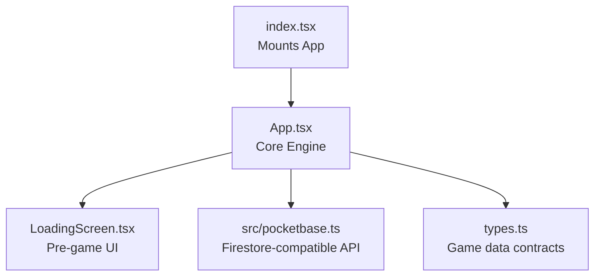
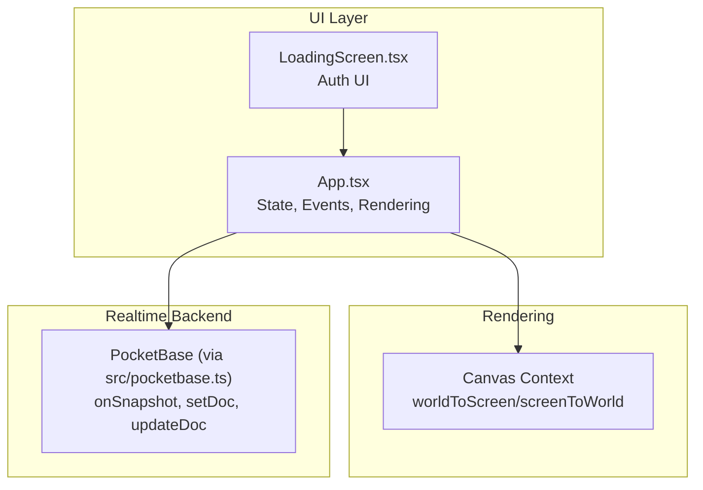
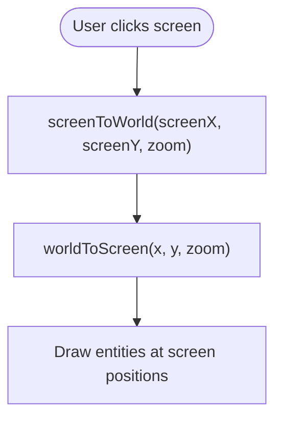
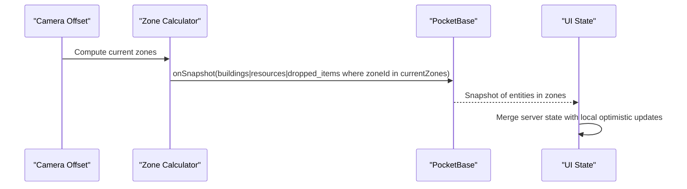
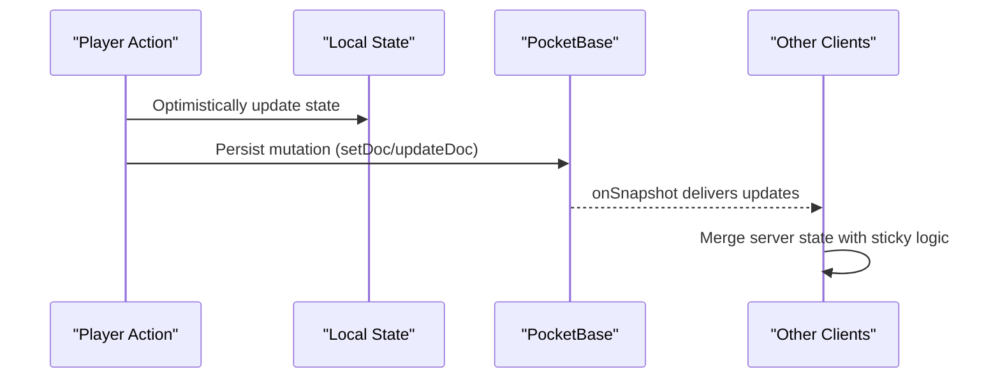
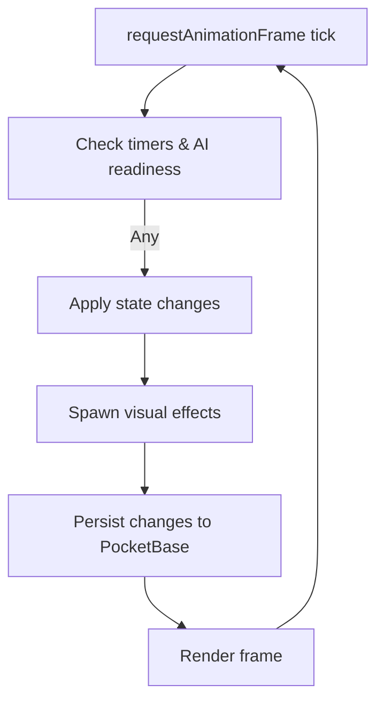
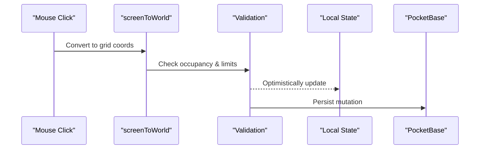
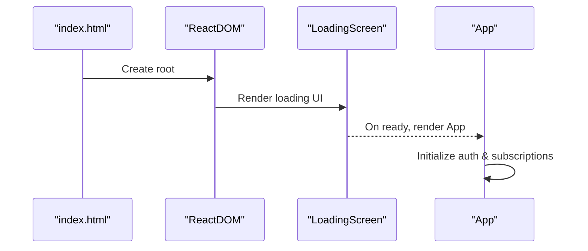
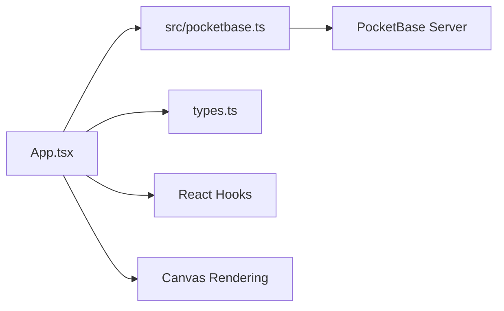

# Core Game Engine

<cite>
**Referenced Files in This Document**
- [App.tsx](file://App.tsx)
- [index.tsx](file://index.tsx)
- [LoadingScreen.tsx](file://LoadingScreen.tsx)
- [src/pocketbase.ts](file://src/pocketbase.ts)
- [types.ts](file://types.ts)
</cite>

## Table of Contents
1. [Introduction](#introduction)
2. [Project Structure](#project-structure)
3. [Core Components](#core-components)
4. [Architecture Overview](#architecture-overview)
5. [Detailed Component Analysis](#detailed-component-analysis)
6. [Dependency Analysis](#dependency-analysis)
7. [Performance Considerations](#performance-considerations)
8. [Troubleshooting Guide](#troubleshooting-guide)
9. [Conclusion](#conclusion)

## Introduction
This document explains the core game engine centered on the App.tsx component, which orchestrates a live isometric city-builder with real-time multiplayer synchronization. It covers:
- Isometric coordinate system and rendering pipeline
- Zone-based data management for performance
- Real-time synchronization with PocketBase
- Game loop, state management, and component lifecycle
- Player actions: building placement, resource extraction, and combat
- Integration with the loading screen and main entry point
- Common pitfalls and remedies

## Project Structure
The engine is a React application bootstrapped from index.tsx, which mounts App.tsx inside an ErrorBoundary. App.tsx integrates:
- Rendering via HTML Canvas
- Real-time state via PocketBase compatibility layer
- Zone-based subscriptions for map data
- A persistent game loop for AI and timers

**Diagram sources**
- [index.tsx:1-20](file://index.tsx#L1-L20)
- [App.tsx:255-322](file://App.tsx#L255-L322)
- [LoadingScreen.tsx:24-41](file://LoadingScreen.tsx#L24-L41)
- [src/pocketbase.ts:1-121](file://src/pocketbase.ts#L1-L121)
- [types.ts:100-147](file://types.ts#L100-L147)

**Section sources**
- [index.tsx:1-20](file://index.tsx#L1-L20)
- [App.tsx:255-322](file://App.tsx#L255-L322)
- [LoadingScreen.tsx:24-41](file://LoadingScreen.tsx#L24-L41)
- [src/pocketbase.ts:1-121](file://src/pocketbase.ts#L1-L121)
- [types.ts:100-147](file://types.ts#L100-L147)

## Core Components
- App.tsx: Central orchestration of rendering, state, subscriptions, and the game loop
- LoadingScreen.tsx: Authentication UI and pre-load experience
- src/pocketbase.ts: Firestore-compatible wrapper around PocketBase for auth and realtime
- types.ts: Shared data contracts for buildings, resources, and game entities

Key responsibilities:
- Coordinate conversions between screen and world spaces
- Zone-aware subscriptions for buildings, resources, and dropped items
- Optimistic UI updates with eventual server reconciliation
- Periodic game loop for AI, timers, and combat resolution
- Player action handlers for placement, resource harvesting, and combat

**Section sources**
- [App.tsx:37-110](file://App.tsx#L37-L110)
- [App.tsx:473-487](file://App.tsx#L473-L487)
- [App.tsx:822-877](file://App.tsx#L822-L877)
- [App.tsx:2094-2145](file://App.tsx#L2094-L2145)
- [src/pocketbase.ts:578-707](file://src/pocketbase.ts#L578-L707)
- [types.ts:100-147](file://types.ts#L100-L147)

## Architecture Overview
The engine uses a hybrid architecture:
- React state for UI and local game logic
- Canvas rendering for isometric tiles and entities
- PocketBase for real-time subscriptions and persistence
- Zone-based subscriptions to minimize bandwidth and CPU

**Diagram sources**
- [App.tsx:2762-3209](file://App.tsx#L2762-L3209)
- [App.tsx:822-877](file://App.tsx#L822-L877)
- [src/pocketbase.ts:578-707](file://src/pocketbase.ts#L578-L707)
- [LoadingScreen.tsx:24-41](file://LoadingScreen.tsx#L24-L41)

## Detailed Component Analysis

### Isometric Coordinate System
The engine converts between screen and world coordinates using tile dimensions and an isometric transform. Two core functions encapsulate this:
- worldToScreen: Converts world tile coordinates to screen pixels
- screenToWorld: Converts screen coordinates to world tile coordinates

**Diagram sources**
- [App.tsx:473-487](file://App.tsx#L473-L487)
- [App.tsx:2762-3209](file://App.tsx#L2762-L3209)

Implementation highlights:
- Tile constants define width/height and scaling per zoom level
- Camera offset is applied before projection
- Reverse projection computes world coordinates from adjusted screen positions

Common pitfalls:
- Off-by-one errors when checking hovered tile boundaries
- Incorrect zoom scaling causing misalignment between cursor and hovered tile

**Section sources**
- [App.tsx:37-46](file://App.tsx#L37-L46)
- [App.tsx:473-487](file://App.tsx#L473-L487)
- [App.tsx:2762-3209](file://App.tsx#L2762-L3209)

### Zone-Based Data Management
The world is subdivided into fixed-size zones. The engine:
- Computes current zones from camera position (throttled)
- Subscribes to buildings/resources/dropped items within current zones
- Seeds empty zones with initial content
- Maintains separate subscriptions for “my buildings” and “zone buildings”

**Diagram sources**
- [App.tsx:822-877](file://App.tsx#L822-L877)
- [App.tsx:2094-2145](file://App.tsx#L2094-L2145)
- [src/pocketbase.ts:578-707](file://src/pocketbase.ts#L578-L707)

Benefits:
- Limits data transfer and processing to visible area
- Enables targeted seeding of new zones

Common pitfalls:
- Zone boundary artifacts when crossing borders
- Race conditions during rapid camera movement

**Section sources**
- [App.tsx:822-877](file://App.tsx#L822-L877)
- [App.tsx:894-953](file://App.tsx#L894-L953)
- [App.tsx:2094-2145](file://App.tsx#L2094-L2145)

### Real-Time Synchronization and Optimistic Updates
The engine uses a two-pronged approach:
- Real-time subscriptions for live updates
- Optimistic UI updates for immediate feedback

Examples:
- Building placement: immediately add to local state, then persist to PocketBase
- Resource harvesting: deduct energy/inventory immediately, then reconcile server state
- Movement: validate cooldowns locally, then update server

**Diagram sources**
- [App.tsx:1040-1067](file://App.tsx#L1040-L1067)
- [App.tsx:1195-1285](file://App.tsx#L1195-L1285)
- [App.tsx:2024-2091](file://App.tsx#L2024-L2091)
- [src/pocketbase.ts:578-707](file://src/pocketbase.ts#L578-L707)

Sticky interaction logic prevents rollback when local actions are newer than server state.

**Section sources**
- [App.tsx:1040-1067](file://App.tsx#L1040-L1067)
- [App.tsx:1195-1285](file://App.tsx#L1195-L1285)
- [App.tsx:2024-2091](file://App.tsx#L2024-L2091)
- [src/pocketbase.ts:578-707](file://src/pocketbase.ts#L578-L707)

### Game Loop, State Management, and Lifecycle
The game loop runs continuously, processing:
- Construction timers (finish construction)
- Work timers (mark production finished)
- Destruction timers (apply pending damage)
- Monster AI (movement and attacks)
- Cannon defense AI (attack nearby monsters)

**Diagram sources**
- [App.tsx:3218-3627](file://App.tsx#L3218-L3627)

Lifecycle patterns:
- Refs capture current state for loop iteration without triggering re-renders
- Throttled camera offset reduces zone churn and subscription churn
- Auto-save intervals persist player stats periodically

**Section sources**
- [App.tsx:3218-3627](file://App.tsx#L3218-L3627)
- [App.tsx:571-576](file://App.tsx#L571-L576)
- [App.tsx:1639-1645](file://App.tsx#L1639-L1645)

### Player Actions: Placement, Extraction, and Combat
- Building placement:
  - Validates occupancy, building limits, and requirements
  - Deducts costs optimistically
  - Creates building record in PocketBase
- Resource extraction:
  - Checks energy and cooldowns
  - Updates inventory and gold
  - Handles respawn timers for trees
- Combat:
  - Monsters move and attack adjacent targets
  - Cannons auto-target monsters within range
  - Damage applied via timers; explosions visualized

**Diagram sources**
- [App.tsx:1040-1067](file://App.tsx#L1040-L1067)
- [App.tsx:1195-1285](file://App.tsx#L1195-L1285)
- [App.tsx:3401-3446](file://App.tsx#L3401-L3446)

**Section sources**
- [App.tsx:1040-1067](file://App.tsx#L1040-L1067)
- [App.tsx:1195-1285](file://App.tsx#L1195-L1285)
- [App.tsx:3401-3446](file://App.tsx#L3401-L3446)

### Integration with Loading Screen and Entry Point
- index.tsx mounts App inside an ErrorBoundary and sets up strict mode
- LoadingScreen provides authentication UI and pre-load progress
- App initializes auth listeners and user data on mount

**Diagram sources**
- [index.tsx:7-19](file://index.tsx#L7-L19)
- [LoadingScreen.tsx:42-51](file://LoadingScreen.tsx#L42-L51)
- [App.tsx:1559-1616](file://App.tsx#L1559-L1616)

**Section sources**
- [index.tsx:7-19](file://index.tsx#L7-L19)
- [LoadingScreen.tsx:42-51](file://LoadingScreen.tsx#L42-L51)
- [App.tsx:1559-1616](file://App.tsx#L1559-L1616)

## Dependency Analysis
- App.tsx depends on:
  - src/pocketbase.ts for auth and realtime operations
  - types.ts for typed game entities
  - React hooks for state and lifecycle
- Rendering depends on canvas and image assets
- Zone subscriptions depend on computed camera position and throttling

**Diagram sources**
- [App.tsx:1-50](file://App.tsx#L1-L50)
- [src/pocketbase.ts:1-20](file://src/pocketbase.ts#L1-L20)
- [types.ts:1-20](file://types.ts#L1-L20)

**Section sources**
- [App.tsx:1-50](file://App.tsx#L1-L50)
- [src/pocketbase.ts:1-20](file://src/pocketbase.ts#L1-L20)
- [types.ts:1-20](file://types.ts#L1-L20)

## Performance Considerations
- Zone throttling: Camera updates are throttled to reduce subscription churn
- Batched updates: writeBatch and runTransaction consolidate writes
- Image preloading: All asset URLs are preloaded to avoid render stalls
- Efficient rendering: Sorting by (x+y) and entity type ensures correct layering
- Timers: Game loop processes only eligible entities each frame

Recommendations:
- Monitor subscription counts and adjust zone size if needed
- Use memoization for expensive computations (already present in several places)
- Consider virtualizing large lists if chat/history grows substantially

**Section sources**
- [App.tsx:571-576](file://App.tsx#L571-L576)
- [App.tsx:2632-2631](file://App.tsx#L2632-L2631)
- [App.tsx:2762-3209](file://App.tsx#L2762-L3209)
- [src/pocketbase.ts:749-765](file://src/pocketbase.ts#L749-L765)

## Troubleshooting Guide
Common issues and resolutions:
- Coordinate conversion errors
  - Symptom: Clicking does not align with hovered tile
  - Resolution: Verify camera offset and zoom are applied consistently in both directions
  - Reference: [App.tsx:473-487](file://App.tsx#L473-L487)
- Zone boundary problems
  - Symptom: Entities disappear or duplicate when crossing zone edges
  - Resolution: Ensure zone computation uses floor division and includes neighboring zones
  - Reference: [App.tsx:801-820](file://App.tsx#L801-L820)
- Performance bottlenecks
  - Symptom: High CPU usage or lag during dense gameplay
  - Resolution: Confirm zone throttling is active, avoid unnecessary re-renders, and verify image preload completion
  - References: [App.tsx:571-576](file://App.tsx#L571-L576), [App.tsx:2632-2631](file://App.tsx#L2632-L2631)
- Stuck construction timers
  - Symptom: Buildings remain under construction indefinitely
  - Resolution: Ensure constructionEndTime is persisted and loop checks timers
  - References: [App.tsx:3487-3497](file://App.tsx#L3487-L3497), [App.tsx:3218-3627](file://App.tsx#L3218-L3627)
- Optimistic rollback anomalies
  - Symptom: Local changes revert after server update
  - Resolution: Review sticky interaction logic and ensure lastInteractionRef is cleared when server confirms
  - References: [App.tsx:2056-2091](file://App.tsx#L2056-L2091)

**Section sources**
- [App.tsx:473-487](file://App.tsx#L473-L487)
- [App.tsx:801-820](file://App.tsx#L801-L820)
- [App.tsx:571-576](file://App.tsx#L571-L576)
- [App.tsx:2632-2631](file://App.tsx#L2632-L2631)
- [App.tsx:3487-3497](file://App.tsx#L3487-L3497)
- [App.tsx:3218-3627](file://App.tsx#L3218-L3627)
- [App.tsx:2056-2091](file://App.tsx#L2056-L2091)

## Conclusion
The core engine in App.tsx combines a robust isometric rendering pipeline with efficient, zone-based real-time synchronization. By leveraging optimistic updates, a dedicated game loop, and careful state management, it delivers a responsive multiplayer experience. Understanding the coordinate system, zone mechanics, and synchronization patterns is essential for extending or debugging the engine effectively.